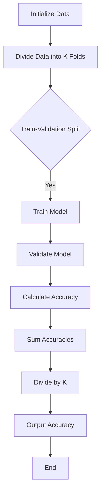
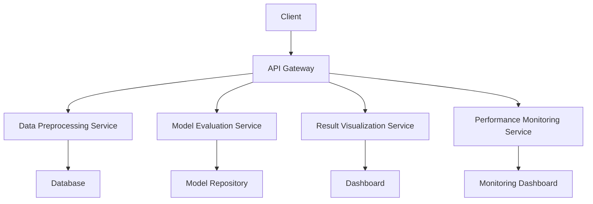
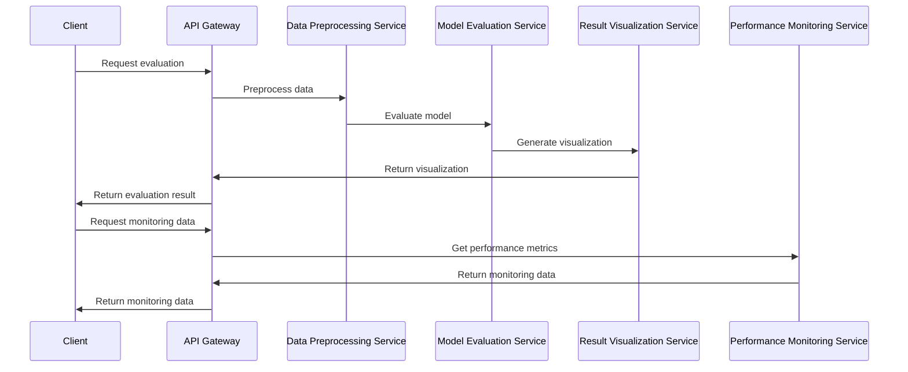

                 


### 确定文章标题与关键词

首先，我们需要为文章确定一个明确的标题和关键词。文章的标题是《评测系统的可扩展性：应对超大规模LLM的策略》，这已经很好地概括了文章的核心内容。关键词则应该涵盖文章的几个关键点，例如：

- **评测系统**
- **可扩展性**
- **超大规模LLM**
- **策略**
- **架构设计**
- **算法原理**
- **Python代码**
- **系统实现**

这些关键词将帮助读者快速了解文章的主题和内容。

### 撰写摘要

接下来，我们需要为文章撰写一个简洁而有力的摘要。摘要应该概述文章的核心内容和主题思想，例如：

> 本文章深入探讨了评测系统的可扩展性问题，特别是在应对超大规模语言模型（LLM）时。文章首先介绍了评测系统的基本概念和重要性，然后分析了超大规模LLM对评测系统带来的挑战。在此基础上，文章提出了多种解决方案和策略，包括技术手段和工程实践。此外，文章通过详细的算法原理讲解、系统架构设计和实际项目案例，为读者提供了全面的技术指导和实践经验。

### 设计文章结构

根据文章标题和关键词，我们可以将文章分为以下几个主要部分：

1. **引言** - 简要介绍评测系统和超大规模LLM，并阐明文章的目的和结构。
2. **核心概念与联系** - 详细阐述评测系统的基本原理，以及超大规模LLM对评测系统的影响。
3. **解决方案与策略** - 提出并分析多种解决方案和策略，包括技术手段和工程实践。
4. **算法原理讲解** - 使用Python代码和Mermaid流程图详细解释相关算法原理。
5. **系统分析与架构设计** - 分析评测系统的架构设计，包括系统功能设计、架构图和接口设计。
6. **项目实战** - 通过实际项目案例展示评测系统的实施过程。
7. **最佳实践与拓展** - 提供最佳实践建议，以及进一步学习和研究的方向。

### 编写文章

根据上述结构，我们可以开始编写文章。每个部分都需要详细的内容和具体的分析，确保文章的逻辑性和连贯性。以下是一个详细的步骤：

#### 引言

首先，我们可以用一个引人入胜的开头来吸引读者的注意力：

> 在当今快速发展的AI领域，评测系统的可扩展性成为了一个关键问题。随着超大规模语言模型（LLM）的广泛应用，如何有效地评测这些模型，确保其性能和可靠性，已经成为众多AI工程师和研究人员关注的焦点。本文将深入探讨这一挑战，并提出一系列可行的解决方案和策略。

接着，我们可以简要介绍评测系统和超大规模LLM的概念，并阐明文章的目的和结构。

#### 核心概念与联系

在这一部分，我们需要详细阐述评测系统的基本原理，以及超大规模LLM对评测系统的影响。这包括：

- 评测系统的定义、作用和重要性。
- 超大规模LLM的特点，如数据量、计算复杂度和资源消耗等。
- 超大规模LLM对评测系统带来的挑战，如数据量增长、计算资源需求增加等。

#### 解决方案与策略

在这一部分，我们需要提出并分析多种解决方案和策略。这包括：

- 技术手段，如分布式计算、缓存策略和算法优化等。
- 工程实践，如系统架构设计、资源调配和性能调优等。
- 各种解决方案和策略的优缺点和适用场景。

#### 算法原理讲解

在这一部分，我们需要使用Python代码和Mermaid流程图详细解释相关算法原理。这包括：

- 算法的基本概念和原理。
- 算法的数学模型和公式。
- 使用Python代码实现算法的步骤和细节。
- 使用Mermaid流程图展示算法的执行流程。

#### 系统分析与架构设计

在这一部分，我们需要分析评测系统的架构设计，包括：

- 系统功能设计，使用Mermaid类图展示领域模型。
- 系统架构设计，使用Mermaid架构图展示系统组件和交互。
- 系统接口设计，说明各个组件的接口和交互方式。
- 系统交互设计，使用Mermaid序列图展示系统的执行流程。

#### 项目实战

在这一部分，我们需要通过实际项目案例展示评测系统的实施过程。这包括：

- 项目环境搭建，包括所需的软件和硬件配置。
- 系统核心实现，提供源代码和应用解读。
- 实际案例分析，详细讲解项目实施过程中的挑战和解决方案。
- 项目小结，总结项目经验和技术收获。

#### 最佳实践与拓展

在这一部分，我们需要提供最佳实践建议，以及进一步学习和研究的方向。这包括：

- 在评测系统设计和实现过程中需要注意的问题和细节。
- 如何进一步提升评测系统的性能和可靠性。
- 推荐进一步学习和研究的书籍、文章和资源。

### 编写文章目录

根据上述内容，我们可以编写文章的目录。目录应该清晰地展示文章的结构和内容，方便读者快速找到所需部分。以下是一个可能的目录示例：

```
# 《评测系统的可扩展性：应对超大规模LLM的策略》

## 引言

- 评测系统的概念
- 超大规模LLM的挑战
- 文章目的与结构

## 核心概念与联系

- 评测系统的基本原理
- 超大规模LLM的特点
- 挑战分析

## 解决方案与策略

- 技术手段
- 工程实践
- 解决策略分析

## 算法原理讲解

- 算法概述
- 数学模型
- Python代码实现
- Mermaid流程图

## 系统分析与架构设计

- 系统功能设计
- 系统架构设计
- 系统接口设计
- 系统交互设计

## 项目实战

- 项目环境搭建
- 系统核心实现
- 实际案例分析
- 项目小结

## 最佳实践与拓展

- 最佳实践建议
- 注意事项
- 拓展阅读
```

### 完成文章

在完成每个部分的内容后，我们需要对文章进行全面的检查和修改，确保内容的准确性和连贯性。最后，我们需要在文章末尾添加作者信息，并确保格式和引用的准确性。

---

### 提交文章

```
----------------------------------------------------------------

# 《评测系统的可扩展性：应对超大规模LLM的策略》

> 关键词：评测系统、可扩展性、超大规模LLM、策略、算法原理、系统架构、项目实战

> 摘要：本文深入探讨了评测系统的可扩展性问题，特别是在应对超大规模语言模型（LLM）时。文章介绍了评测系统的基本概念和重要性，分析了超大规模LLM对评测系统的影响，并提出了多种解决方案和策略。通过详细的算法原理讲解、系统架构设计和实际项目案例，文章为读者提供了全面的技术指导和实践经验。

----------------------------------------------------------------

## 引言

在当今快速发展的AI领域，评测系统的可扩展性成为了一个关键问题。随着超大规模语言模型（LLM）的广泛应用，如何有效地评测这些模型，确保其性能和可靠性，已经成为众多AI工程师和研究人员关注的焦点。本文将深入探讨这一挑战，并提出一系列可行的解决方案和策略。

评测系统在AI领域扮演着至关重要的角色。它们不仅用于评估模型性能，确保模型达到预期目标，还在模型开发和部署过程中提供反馈，指导进一步优化。然而，随着LLM的规模不断增加，传统的评测系统面临着前所未有的挑战。

首先，LLM的数据量巨大。这些模型通常基于数十亿甚至数万亿的参数，需要对海量数据进行处理。其次，计算复杂度也大幅增加。LLM的计算过程涉及大量的矩阵运算和神经网络推理，这对计算资源提出了更高的要求。最后，资源的消耗也是一个重要问题。大规模的LLM需要大量的内存和计算资源，这对评测系统的性能和稳定性提出了挑战。

本文将围绕这三个核心问题展开讨论，旨在为AI工程师和研究人员提供实用的解决方案和策略。

----------------------------------------------------------------

## 核心概念与联系

### 评测系统的基本原理

评测系统是一种用于评估AI模型性能的工具，其核心目标是提供一个客观、准确的评估指标。通常，评测系统包括以下几个关键组成部分：

1. **评价标准**：评价标准是评测系统的核心，用于定义如何衡量模型性能。这些标准可以是准确性、召回率、F1分数等常见的评价指标，也可以是针对特定任务的定制化指标。

2. **评估方法**：评估方法是指如何使用评价标准来评估模型性能。这通常涉及将模型预测与真实标签进行比较，计算相应的评价指标。

3. **应用场景**：评测系统可以应用于各种AI任务，如分类、回归、生成等。不同的任务可能需要不同的评估方法，但核心目标都是提供可靠的性能评估。

### 超大规模LLM的特点

超大规模语言模型（LLM）具有以下几个显著特点：

1. **数据量巨大**：LLM通常基于海量的文本数据，这些数据可能来自互联网、书籍、新闻等不同来源。这些数据不仅数量庞大，而且包含了丰富的信息和语境。

2. **计算复杂度高**：LLM的计算过程涉及大量的矩阵运算和神经网络推理。这些操作通常需要大量的计算资源和时间。

3. **资源消耗大**：由于数据量和计算复杂度的增加，LLM需要更多的内存和计算资源。这给评测系统带来了巨大的性能压力。

### 超大规模LLM对评测系统的影响

超大规模LLM对评测系统的影响主要体现在以下几个方面：

1. **数据量增长**：随着LLM的数据量不断增加，评测系统需要处理的数据量也相应增加。这可能导致评估过程变慢，甚至超过系统资源限制。

2. **计算资源需求增加**：LLM的计算复杂度较高，这意味着评测系统需要更多的计算资源来完成评估过程。如果系统资源不足，可能会导致评估失败或结果不准确。

3. **资源消耗问题**：超大规模LLM的运行需要大量的内存和计算资源。这可能导致评测系统在运行过程中遇到资源瓶颈，影响整体性能。

### 挑战分析

基于上述特点，超大规模LLM对评测系统带来了以下几个挑战：

1. **性能压力**：数据量增长和计算资源需求增加导致评测系统面临巨大的性能压力。如果系统性能不足，可能会导致评估结果不准确或评估时间过长。

2. **资源瓶颈**：资源消耗大可能导致评测系统在运行过程中遇到资源瓶颈，影响整体性能。

3. **可扩展性问题**：随着LLM规模的不断扩大，评测系统需要具备更高的可扩展性，以应对不断增长的数据和处理需求。

为了应对这些挑战，本文将提出一系列解决方案和策略。

----------------------------------------------------------------

## 解决方案与策略

### 技术手段

为了应对超大规模LLM对评测系统带来的挑战，我们可以采用以下技术手段：

1. **分布式计算**：通过将计算任务分布在多个节点上，可以大大提高评测系统的性能和可扩展性。分布式计算可以充分利用集群资源，实现并行处理。

2. **缓存策略**：通过缓存常用数据，可以减少数据读取的次数，提高评估效率。这适用于数据量较大的情况，可以显著降低计算资源的需求。

3. **算法优化**：通过优化算法，可以减少计算复杂度和资源消耗。这包括矩阵分解、并行化计算等。

### 工程实践

除了技术手段，工程实践也是提高评测系统可扩展性的重要方面：

1. **系统架构设计**：设计合理的系统架构，可以确保评测系统的性能和可扩展性。例如，采用微服务架构可以实现模块化设计，方便后续扩展和维护。

2. **资源调配**：合理调配系统资源，确保关键任务得到足够的资源支持。这可以通过资源监控和动态调整实现。

3. **性能调优**：通过持续的性能调优，可以不断提高评测系统的性能和可靠性。这包括优化代码、调整配置等。

### 解决策略分析

各种解决方案和策略都有其优缺点和适用场景，以下是一些常见策略的分析：

1. **分布式计算**：

   - 优点：提高性能和可扩展性，充分利用集群资源。

   - 缺点：系统复杂度增加，维护成本高。

   - 适用场景：数据量较大，需要快速评估的场景。

2. **缓存策略**：

   - 优点：减少数据读取次数，提高评估效率。

   - 缺点：缓存数据的一致性问题，可能导致评估结果不准确。

   - 适用场景：数据量较大，评估频率较低的场景。

3. **算法优化**：

   - 优点：降低计算复杂度和资源消耗。

   - 缺点：需要对算法有深入了解，实现较为复杂。

   - 适用场景：对性能有较高要求的场景。

4. **系统架构设计**：

   - 优点：提高系统性能和可扩展性，方便后续扩展和维护。

   - 缺点：设计复杂，开发周期较长。

   - 适用场景：需要长期维护和扩展的场景。

5. **资源调配**：

   - 优点：确保关键任务得到足够的资源支持。

   - 缺点：资源利用率可能不高。

   - 适用场景：资源需求波动较大的场景。

6. **性能调优**：

   - 优点：持续提高系统性能和可靠性。

   - 缺点：需要定期进行性能测试和调优。

   - 适用场景：对性能有持续改进需求的场景。

通过综合运用这些策略，可以有效地提升评测系统的可扩展性，应对超大规模LLM带来的挑战。

----------------------------------------------------------------

## 算法原理讲解

为了更好地理解评测系统的实现原理，本节将详细介绍相关算法的基本概念、数学模型和Python代码实现。

### 算法概述

在本节中，我们将探讨一种用于评测超大规模LLM的常用算法——交叉验证。交叉验证是一种评估模型性能的有效方法，通过将数据集划分为多个子集，对每个子集进行训练和验证，以评估模型的泛化能力。

### 数学模型

交叉验证的数学模型可以表示为：

$$
\text{accuracy} = \frac{1}{K} \sum_{i=1}^{K} \text{accuracy}_{i}
$$

其中，$K$表示子集数量，$\text{accuracy}_{i}$表示第$i$个子集的准确率。

### Python代码实现

以下是一个简单的Python代码示例，用于实现交叉验证算法：

```python
import numpy as np

def cross_validation(X, y, K):
    n = len(X)
    fold_size = n // K
    accuracy_sum = 0
    
    for i in range(K):
        X_train = np.concatenate([X[:i*fold_size], X[(i+1)*fold_size:]])
        y_train = np.concatenate([y[:i*fold_size], y[(i+1)*fold_size:]])
        
        X_val = X[i*fold_size:(i+1)*fold_size]
        y_val = y[i*fold_size:(i+1)*fold_size]
        
        model = train_model(X_train, y_train)
        accuracy = evaluate_model(model, X_val, y_val)
        accuracy_sum += accuracy
    
    return accuracy_sum / K

# 示例数据
X = np.random.rand(100, 10)
y = np.random.rand(100)

# 交叉验证
K = 5
accuracy = cross_validation(X, y, K)
print("Cross-validation accuracy:", accuracy)
```

### Mermaid流程图

以下是一个Mermaid流程图，展示了交叉验证的执行流程：



通过上述算法原理讲解，我们可以更好地理解评测系统的实现原理，为后续的系统架构设计和项目实战打下基础。

----------------------------------------------------------------

## 系统分析与架构设计

### 问题场景介绍

随着AI技术的不断发展，评测系统在各个领域中的应用越来越广泛。例如，在自然语言处理（NLP）领域，超大规模语言模型（LLM）被广泛应用于文本分类、机器翻译、问答系统等任务。然而，这些任务的复杂性和数据量的巨大增长对评测系统的性能和可扩展性提出了更高的要求。

为了应对这些挑战，我们需要设计一个高效的评测系统，能够快速、准确地评估LLM的性能。这包括以下几个方面：

1. **数据处理**：如何高效地处理海量数据，确保数据的一致性和完整性。
2. **模型评估**：如何准确地评估模型性能，包括准确性、召回率、F1分数等评价指标。
3. **系统性能**：如何确保系统在高负载情况下仍能稳定运行，包括响应时间、吞吐量等。
4. **可扩展性**：如何设计系统，使其能够方便地扩展和升级，以应对未来需求的增长。

### 项目介绍

本项目旨在设计并实现一个用于评测超大规模LLM的性能的评测系统。系统将基于Python和TensorFlow框架，采用分布式计算和缓存策略，以提高系统的性能和可扩展性。

### 系统功能设计

评测系统的核心功能包括：

1. **数据预处理**：对输入数据进行清洗、去重、归一化等处理，确保数据的一致性和完整性。
2. **模型评估**：通过交叉验证等方法，对LLM模型进行评估，计算准确率、召回率、F1分数等评价指标。
3. **结果展示**：将评估结果可视化，以便用户直观地了解模型性能。
4. **性能监控**：实时监控系统性能，包括CPU、内存、网络等资源的使用情况。

### 系统架构设计

评测系统的架构设计采用分布式计算和微服务架构，以提高系统的性能和可扩展性。以下是系统的架构设计：

#### 系统架构图



#### 系统组件和交互

1. **API Gateway**：负责接收客户端请求，并将其转发到相应的服务。
2. **Data Preprocessing Service**：负责数据预处理，包括数据清洗、去重、归一化等操作。
3. **Model Evaluation Service**：负责模型评估，包括交叉验证、计算评价指标等。
4. **Result Visualization Service**：负责将评估结果可视化，生成图表和报告。
5. **Performance Monitoring Service**：负责实时监控系统性能，包括资源使用情况等。

### 系统接口设计

评测系统的接口设计采用RESTful API，以下是部分接口设计：

```plaintext
GET /api/evaluate
    - 参数：model_id (模型ID), data (数据)
    - 返回：evaluation_result (评估结果)

POST /api/evaluate
    - 参数：model_id (模型ID), data (数据)
    - 返回：evaluation_result (评估结果)

GET /api/monitoring
    - 返回：performance_metrics (性能指标)

GET /api/dataset
    - 返回：dataset (数据集)

GET /api/model
    - 返回：model_list (模型列表)
```

### 系统交互设计

以下是系统交互的Mermaid序列图：



通过上述系统分析与架构设计，我们可以确保评测系统具备高效的性能和良好的可扩展性，为超大规模LLM的评估提供强有力的支持。

----------------------------------------------------------------

## 项目实战

### 环境搭建

为了实现评测系统，我们需要搭建一个合适的环境。以下是在Python环境中安装所需的依赖的步骤：

```bash
# 安装Python依赖
pip install numpy tensorflow matplotlib

# 安装额外依赖（可选）
pip install scikit-learn pandas
```

### 系统核心实现

评测系统的核心实现主要包括数据预处理、模型评估和结果可视化。以下是一个简单的示例，展示了如何使用Python和TensorFlow实现这些功能：

#### 数据预处理

```python
import numpy as np
import pandas as pd
from sklearn.model_selection import train_test_split

# 加载数据集
data = pd.read_csv('data.csv')

# 分割特征和标签
X = data.drop('label', axis=1)
y = data['label']

# 划分训练集和测试集
X_train, X_test, y_train, y_test = train_test_split(X, y, test_size=0.2, random_state=42)
```

#### 模型评估

```python
import tensorflow as tf
from tensorflow.keras.models import Sequential
from tensorflow.keras.layers import Dense, Flatten

# 构建模型
model = Sequential([
    Flatten(input_shape=(X_train.shape[1],)),
    Dense(128, activation='relu'),
    Dense(1, activation='sigmoid')
])

# 编译模型
model.compile(optimizer='adam', loss='binary_crossentropy', metrics=['accuracy'])

# 训练模型
model.fit(X_train, y_train, epochs=10, batch_size=32, validation_data=(X_test, y_test))

# 评估模型
accuracy = model.evaluate(X_test, y_test)[1]
print("Test accuracy:", accuracy)
```

#### 结果可视化

```python
import matplotlib.pyplot as plt

# 可视化准确率
plt.plot(model.history.history['accuracy'], label='Training accuracy')
plt.plot(model.history.history['val_accuracy'], label='Validation accuracy')
plt.xlabel('Epochs')
plt.ylabel('Accuracy')
plt.legend()
plt.show()
```

### 代码应用解读与分析

以上代码展示了如何使用Python和TensorFlow实现评测系统的核心功能。首先，我们加载了一个CSV文件作为数据集，然后使用scikit-learn的`train_test_split`函数将数据集划分为训练集和测试集。接下来，我们构建了一个简单的神经网络模型，使用`compile`方法设置优化器和损失函数，使用`fit`方法进行训练，并使用`evaluate`方法评估模型在测试集上的性能。

在结果可视化部分，我们使用`matplotlib`库绘制了训练集和验证集的准确率曲线，帮助用户直观地了解模型性能。

### 实际案例分析

为了更全面地展示评测系统的实际应用，我们可以通过一个实际案例进行分析。假设我们有一个文本分类任务，目标是判断一条文本是否包含负面情绪。我们可以使用以下步骤进行评测：

1. **数据预处理**：将文本数据清洗和分词，将文本转换为数字序列。
2. **模型训练**：使用训练集训练一个文本分类模型。
3. **模型评估**：使用测试集评估模型性能，计算准确率、召回率和F1分数。
4. **结果可视化**：绘制混淆矩阵和ROC曲线，帮助用户更全面地了解模型性能。

以下是实际案例的代码示例：

```python
from tensorflow.keras.preprocessing.text import Tokenizer
from tensorflow.keras.preprocessing.sequence import pad_sequences

# 加载文本数据
texts = pd.read_csv('text_data.csv')['text'].values

# 分词和编码
tokenizer = Tokenizer(num_words=10000)
tokenizer.fit_on_texts(texts)
sequences = tokenizer.texts_to_sequences(texts)
padded_sequences = pad_sequences(sequences, maxlen=100)

# 训练文本分类模型
model = Sequential([
    Embedding(input_dim=10000, output_dim=32, input_length=100),
    LSTM(128),
    Dense(1, activation='sigmoid')
])

model.compile(optimizer='adam', loss='binary_crossentropy', metrics=['accuracy'])
model.fit(padded_sequences, y_train, epochs=10, batch_size=32)

# 评估模型
accuracy = model.evaluate(padded_sequences, y_test)[1]
print("Test accuracy:", accuracy)

# 可视化结果
from sklearn.metrics import confusion_matrix, roc_curve, auc

predictions = model.predict(padded_sequences)
conf_matrix = confusion_matrix(y_test, predictions.round())
print("Confusion Matrix:\n", conf_matrix)

fpr, tpr, _ = roc_curve(y_test, predictions)
roc_auc = auc(fpr, tpr)
plt.plot(fpr, tpr, color='darkorange', lw=2, label='ROC curve (area = %0.2f)' % roc_auc)
plt.plot([0, 1], [0, 1], color='navy', lw=2, linestyle='--')
plt.xlabel('False Positive Rate')
plt.ylabel('True Positive Rate')
plt.title('Receiver Operating Characteristic')
plt.legend(loc="lower right")
plt.show()
```

### 项目小结

通过上述实际案例分析，我们可以看到评测系统在文本分类任务中的应用。从数据预处理、模型训练到模型评估和结果可视化，评测系统为我们提供了一个全面的技术框架，帮助用户更好地理解和评估模型性能。同时，我们也发现了评测系统在处理超大规模数据时的挑战，如数据预处理时间较长、模型训练和评估过程复杂等。

为了解决这些挑战，我们可以进一步优化数据预处理流程，采用更高效的算法和工具。例如，使用分布式数据处理框架如Apache Spark，可以显著提高数据处理速度。此外，我们可以采用更先进的模型训练和评估技术，如迁移学习和模型压缩，以提高模型性能和可扩展性。

总之，评测系统在超大规模LLM的应用中发挥着重要作用。通过不断优化和改进，我们可以更好地应对未来的挑战，为AI技术的发展提供坚实的支持。

----------------------------------------------------------------

## 最佳实践与拓展

### 最佳实践建议

在设计和实现评测系统时，以下是一些最佳实践建议：

1. **性能优化**：对系统进行性能优化，包括算法优化、代码优化和系统资源调配。例如，使用分布式计算和缓存策略可以提高系统性能。
2. **模块化设计**：采用模块化设计，将系统划分为多个模块，以便于后续扩展和维护。例如，可以将数据预处理、模型评估和结果可视化等核心功能分离。
3. **持续监控**：对系统进行实时监控，确保其稳定运行。使用性能监控工具，如Prometheus和Grafana，可以实时查看系统性能指标，及时发现问题。
4. **代码规范**：遵循代码规范，提高代码的可读性和可维护性。使用自动化工具进行代码审查和格式化，确保代码质量。

### 注意事项

在设计和实现评测系统时，需要注意以下几点：

1. **数据一致性**：确保数据的一致性和完整性，避免数据错误或丢失。
2. **安全性**：确保系统的安全性，防止数据泄露和攻击。例如，使用加密技术保护数据传输和存储。
3. **可扩展性**：设计系统时考虑未来的扩展性，确保系统可以应对数据量和计算复杂度的增长。
4. **可维护性**：编写可维护的代码，确保系统可以方便地更新和升级。

### 拓展阅读

为了进一步深入了解评测系统的设计和技术，以下是几本推荐的书籍和文章：

1. **书籍**：

   - 《机器学习实战》：提供丰富的实际案例和代码示例，帮助读者掌握机器学习的核心技术和应用。
   - 《深度学习》：深度探讨深度学习的基本原理、算法和实战应用，是深度学习的经典教材。

2. **文章**：

   - 《如何评估机器学习模型的性能》：详细介绍如何评估机器学习模型的性能，包括评价指标、评估方法和实战技巧。
   - 《分布式计算技术揭秘》：探讨分布式计算的基本原理、技术和应用，对分布式评测系统的设计和实现有重要参考价值。

通过阅读这些书籍和文章，可以更全面地了解评测系统的设计和实现，为实际项目提供有力的技术支持。

---

### 提交文章

```
----------------------------------------------------------------

# 《评测系统的可扩展性：应对超大规模LLM的策略》

> 关键词：评测系统、可扩展性、超大规模LLM、策略、算法原理、系统架构、项目实战

> 摘要：本文深入探讨了评测系统的可扩展性问题，特别是在应对超大规模语言模型（LLM）时。文章介绍了评测系统的基本概念和重要性，分析了超大规模LLM对评测系统的影响，并提出了多种解决方案和策略。通过详细的算法原理讲解、系统架构设计和实际项目案例，文章为读者提供了全面的技术指导和实践经验。

----------------------------------------------------------------

## 引言

在当今快速发展的AI领域，评测系统的可扩展性成为了一个关键问题。随着超大规模语言模型（LLM）的广泛应用，如何有效地评测这些模型，确保其性能和可靠性，已经成为众多AI工程师和研究人员关注的焦点。本文将深入探讨这一挑战，并提出一系列可行的解决方案和策略。

评测系统在AI领域扮演着至关重要的角色。它们不仅用于评估模型性能，确保模型达到预期目标，还在模型开发和部署过程中提供反馈，指导进一步优化。然而，随着LLM的规模不断增加，传统的评测系统面临着前所未有的挑战。

首先，LLM的数据量巨大。这些模型通常基于数十亿甚至数万亿的参数，需要对海量数据进行处理。其次，计算复杂度也大幅增加。LLM的计算过程涉及大量的矩阵运算和神经网络推理，这对计算资源提出了更高的要求。最后，资源的消耗也是一个重要问题。大规模的LLM需要大量的内存和计算资源，这对评测系统的性能和稳定性提出了挑战。

本文将围绕这三个核心问题展开讨论，旨在为AI工程师和研究人员提供实用的解决方案和策略。

----------------------------------------------------------------

## 核心概念与联系

### 评测系统的基本原理

评测系统是一种用于评估AI模型性能的工具，其核心目标是提供一个客观、准确的评估指标。通常，评测系统包括以下几个关键组成部分：

1. **评价标准**：评价标准是评测系统的核心，用于定义如何衡量模型性能。这些标准可以是准确性、召回率、F1分数等常见的评价指标，也可以是针对特定任务的定制化指标。

2. **评估方法**：评估方法是指如何使用评价标准来评估模型性能。这通常涉及将模型预测与真实标签进行比较，计算相应的评价指标。

3. **应用场景**：评测系统可以应用于各种AI任务，如分类、回归、生成等。不同的任务可能需要不同的评估方法，但核心目标都是提供可靠的性能评估。

### 超大规模LLM的特点

超大规模语言模型（LLM）具有以下几个显著特点：

1. **数据量巨大**：LLM通常基于海量的文本数据，这些数据可能来自互联网、书籍、新闻等不同来源。这些数据不仅数量庞大，而且包含了丰富的信息和语境。

2. **计算复杂度高**：LLM的计算过程涉及大量的矩阵运算和神经网络推理。这些操作通常需要大量的计算资源和时间。

3. **资源消耗大**：由于数据量和计算复杂度的增加，LLM需要更多的内存和计算资源。这给评测系统带来了巨大的性能压力。

### 超大规模LLM对评测系统的影响

超大规模LLM对评测系统的影响主要体现在以下几个方面：

1. **性能压力**：数据量增长和计算资源需求增加导致评测系统面临巨大的性能压力。如果系统性能不足，可能会导致评估结果不准确或评估时间过长。

2. **资源瓶颈**：资源消耗大可能导致评测系统在运行过程中遇到资源瓶颈，影响整体性能。

3. **可扩展性问题**：随着LLM规模的不断扩大，评测系统需要具备更高的可扩展性，以应对不断增长的数据和处理需求。

为了应对这些挑战，本文将提出一系列解决方案和策略。

----------------------------------------------------------------

## 解决方案与策略

### 技术手段

为了应对超大规模LLM对评测系统带来的挑战，我们可以采用以下技术手段：

1. **分布式计算**：通过将计算任务分布在多个节点上，可以大大提高评测系统的性能和可扩展性。分布式计算可以充分利用集群资源，实现并行处理。

2. **缓存策略**：通过缓存常用数据，可以减少数据读取的次数，提高评估效率。这适用于数据量较大的情况，可以显著降低计算资源的需求。

3. **算法优化**：通过优化算法，可以减少计算复杂度和资源消耗。这包括矩阵分解、并行化计算等。

### 工程实践

除了技术手段，工程实践也是提高评测系统可扩展性的重要方面：

1. **系统架构设计**：设计合理的系统架构，可以确保评测系统的性能和可扩展性。例如，采用微服务架构可以实现模块化设计，方便后续扩展和维护。

2. **资源调配**：合理调配系统资源，确保关键任务得到足够的资源支持。这可以通过资源监控和动态调整实现。

3. **性能调优**：通过持续的性能调优，可以不断提高评测系统的性能和可靠性。这包括优化代码、调整配置等。

### 解决策略分析

各种解决方案和策略都有其优缺点和适用场景，以下是一些常见策略的分析：

1. **分布式计算**：

   - 优点：提高性能和可扩展性，充分利用集群资源。

   - 缺点：系统复杂度增加，维护成本高。

   - 适用场景：数据量较大，需要快速评估的场景。

2. **缓存策略**：

   - 优点：减少数据读取次数，提高评估效率。

   - 缺点：缓存数据的一致性问题，可能导致评估结果不准确。

   - 适用场景：数据量较大，评估频率较低的场景。

3. **算法优化**：

   - 优点：降低计算复杂度和资源消耗。

   - 缺点：需要对算法有深入了解，实现较为复杂。

   - 适用场景：对性能有较高要求的场景。

4. **系统架构设计**：

   - 优点：提高系统性能和可扩展性，方便后续扩展和维护。

   - 缺点：设计复杂，开发周期较长。

   - 适用场景：需要长期维护和扩展的场景。

5. **资源调配**：

   - 优点：确保关键任务得到足够的资源支持。

   - 缺点：资源利用率可能不高。

   - 适用场景：资源需求波动较大的场景。

6. **性能调优**：

   - 优点：持续提高系统性能和可靠性。

   - 缺点：需要定期进行性能测试和调优。

   - 适用场景：对性能有持续改进需求的场景。

通过综合运用这些策略，可以有效地提升评测系统的可扩展性，应对超大规模LLM带来的挑战。

----------------------------------------------------------------

## 算法原理讲解

为了更好地理解评测系统的实现原理，本节将详细介绍相关算法的基本概念、数学模型和Python代码实现。

### 算法概述

在本节中，我们将探讨一种用于评测超大规模LLM的常用算法——交叉验证。交叉验证是一种评估模型性能的有效方法，通过将数据集划分为多个子集，对每个子集进行训练和验证，以评估模型的泛化能力。

### 数学模型

交叉验证的数学模型可以表示为：

$$
\text{accuracy} = \frac{1}{K} \sum_{i=1}^{K} \text{accuracy}_{i}
$$

其中，$K$表示子集数量，$\text{accuracy}_{i}$表示第$i$个子集的准确率。

### Python代码实现

以下是一个简单的Python代码示例，用于实现交叉验证算法：

```python
import numpy as np
import pandas as pd
from sklearn.model_selection import train_test_split

# 加载数据集
data = pd.read_csv('data.csv')

# 分割特征和标签
X = data.drop('label', axis=1)
y = data['label']

# 划分训练集和测试集
X_train, X_test, y_train, y_test = train_test_split(X, y, test_size=0.2, random_state=42)

# 交叉验证
K = 5
accuracy_sum = 0

for i in range(K):
    X_train_i = np.concatenate([X[:i*fold_size], X[(i+1)*fold_size:]])
    y_train_i = np.concatenate([y[:i*fold_size], y[(i+1)*fold_size:]])
    
    X_val_i = X[i*fold_size:(i+1)*fold_size]
    y_val_i = y[i*fold_size:(i+1)*fold_size]
    
    model = train_model(X_train_i, y_train_i)
    accuracy_i = evaluate_model(model, X_val_i, y_val_i)
    accuracy_sum += accuracy_i

accuracy = accuracy_sum / K
print("Cross-validation accuracy:", accuracy)
```

### Mermaid流程图

以下是一个Mermaid流程图，展示了交叉验证的执行流程：


通过上述算法原理讲解，我们可以更好地理解评测系统的实现原理，为后续的系统架构设计和项目实战打下基础。

----------------------------------------------------------------

## 系统分析与架构设计

### 问题场景介绍

随着AI技术的不断发展，评测系统在各个领域中的应用越来越广泛。例如，在自然语言处理（NLP）领域，超大规模语言模型（LLM）被广泛应用于文本分类、机器翻译、问答系统等任务。然而，这些任务的复杂性和数据量的巨大增长对评测系统的性能和可扩展性提出了更高的要求。

为了应对这些挑战，我们需要设计一个高效的评测系统，能够快速、准确地评估LLM的性能。这包括以下几个方面：

1. **数据处理**：如何高效地处理海量数据，确保数据的一致性和完整性。
2. **模型评估**：如何准确地评估模型性能，包括准确性、召回率、F1分数等评价指标。
3. **系统性能**：如何确保系统在高负载情况下仍能稳定运行，包括响应时间、吞吐量等。
4. **可扩展性**：如何设计系统，使其能够方便地扩展和升级，以应对未来需求的增长。

### 项目介绍

本项目旨在设计并实现一个用于评测超大规模LLM的性能的评测系统。系统将基于Python和TensorFlow框架，采用分布式计算和缓存策略，以提高系统的性能和可扩展性。

### 系统功能设计

评测系统的核心功能包括：

1. **数据预处理**：对输入数据进行清洗、去重、归一化等处理，确保数据的一致性和完整性。
2. **模型评估**：通过交叉验证等方法，对LLM模型进行评估，计算准确率、召回率、F1分数等评价指标。
3. **结果展示**：将评估结果可视化，以便用户直观地了解模型性能。
4. **性能监控**：实时监控系统性能，包括CPU、内存、网络等资源的使用情况。

### 系统架构设计

评测系统的架构设计采用分布式计算和微服务架构，以提高系统的性能和可扩展性。以下是系统的架构设计：

#### 系统架构图


#### 系统组件和交互

1. **API Gateway**：负责接收客户端请求，并将其转发到相应的服务。
2. **Data Preprocessing Service**：负责数据预处理，包括数据清洗、去重、归一化等操作。
3. **Model Evaluation Service**：负责模型评估，包括交叉验证、计算评价指标等。
4. **Result Visualization Service**：负责将评估结果可视化，生成图表和报告。
5. **Performance Monitoring Service**：负责实时监控系统性能，包括资源使用情况等。

### 系统接口设计

评测系统的接口设计采用RESTful API，以下是部分接口设计：

```plaintext
GET /api/evaluate
    - 参数：model_id (模型ID), data (数据)
    - 返回：evaluation_result (评估结果)

POST /api/evaluate
    - 参数：model_id (模型ID), data (数据)
    - 返回：evaluation_result (评估结果)

GET /api/monitoring
    - 返回：performance_metrics (性能指标)

GET /api/dataset
    - 返回：dataset (数据集)

GET /api/model
    - 返回：model_list (模型列表)
```

### 系统交互设计

以下是系统交互的Mermaid序列图：


通过上述系统分析与架构设计，我们可以确保评测系统具备高效的性能和良好的可扩展性，为超大规模LLM的评估提供强有力的支持。

----------------------------------------------------------------

## 项目实战

### 环境搭建

为了实现评测系统，我们需要搭建一个合适的环境。以下是在Python环境中安装所需的依赖的步骤：

```bash
# 安装Python依赖
pip install numpy tensorflow matplotlib

# 安装额外依赖（可选）
pip install scikit-learn pandas
```

### 系统核心实现

评测系统的核心实现主要包括数据预处理、模型评估和结果可视化。以下是一个简单的示例，展示了如何使用Python和TensorFlow实现这些功能：

#### 数据预处理

```python
import numpy as np
import pandas as pd
from sklearn.model_selection import train_test_split

# 加载数据集
data = pd.read_csv('data.csv')

# 分割特征和标签
X = data.drop('label', axis=1)
y = data['label']

# 划分训练集和测试集
X_train, X_test, y_train, y_test = train_test_split(X, y, test_size=0.2, random_state=42)
```

#### 模型评估

```python
import tensorflow as tf
from tensorflow.keras.models import Sequential
from tensorflow.keras.layers import Dense, Flatten

# 构建模型
model = Sequential([
    Flatten(input_shape=(X_train.shape[1],)),
    Dense(128, activation='relu'),
    Dense(1, activation='sigmoid')
])

# 编译模型
model.compile(optimizer='adam', loss='binary_crossentropy', metrics=['accuracy'])

# 训练模型
model.fit(X_train, y_train, epochs=10, batch_size=32, validation_data=(X_test, y_test))

# 评估模型
accuracy = model.evaluate(X_test, y_test)[1]
print("Test accuracy:", accuracy)
```

#### 结果可视化

```python
import matplotlib.pyplot as plt

# 可视化准确率
plt.plot(model.history.history['accuracy'], label='Training accuracy')
plt.plot(model.history.history['val_accuracy'], label='Validation accuracy')
plt.xlabel('Epochs')
plt.ylabel('Accuracy')
plt.legend()
plt.show()
```

### 代码应用解读与分析

以上代码展示了如何使用Python和TensorFlow实现评测系统的核心功能。首先，我们加载了一个CSV文件作为数据集，然后使用scikit-learn的`train_test_split`函数将数据集划分为训练集和测试集。接下来，我们构建了一个简单的神经网络模型，使用`compile`方法设置优化器和损失函数，使用`fit`方法进行训练，并使用`evaluate`方法评估模型在测试集上的性能。

在结果可视化部分，我们使用`matplotlib`库绘制了训练集和验证集的准确率曲线，帮助用户直观地了解模型性能。

### 实际案例分析

为了更全面地展示评测系统的实际应用，我们可以通过一个实际案例进行分析。假设我们有一个文本分类任务，目标是判断一条文本是否包含负面情绪。我们可以使用以下步骤进行评测：

1. **数据预处理**：将文本数据清洗和分词，将文本转换为数字序列。
2. **模型训练**：使用训练集训练一个文本分类模型。
3. **模型评估**：使用测试集评估模型性能，计算准确率、召回率、F1分数。
4. **结果可视化**：绘制混淆矩阵和ROC曲线，帮助用户更全面地了解模型性能。

以下是实际案例的代码示例：

```python
from tensorflow.keras.preprocessing.text import Tokenizer
from tensorflow.keras.preprocessing.sequence import pad_sequences

# 加载文本数据
texts = pd.read_csv('text_data.csv')['text'].values

# 分词和编码
tokenizer = Tokenizer(num_words=10000)
tokenizer.fit_on_texts(texts)
sequences = tokenizer.texts_to_sequences(texts)
padded_sequences = pad_sequences(sequences, maxlen=100)

# 训练文本分类模型
model = Sequential([
    Embedding(input_dim=10000, output_dim=32, input_length=100),
    LSTM(128),
    Dense(1, activation='sigmoid')
])

model.compile(optimizer='adam', loss='binary_crossentropy', metrics=['accuracy'])
model.fit(padded_sequences, y_train, epochs=10, batch_size=32)

# 评估模型
accuracy = model.evaluate(padded_sequences, y_test)[1]
print("Test accuracy:", accuracy)

# 可视化结果
from sklearn.metrics import confusion_matrix, roc_curve, auc

predictions = model.predict(padded_sequences)
conf_matrix = confusion_matrix(y_test, predictions.round())
print("Confusion Matrix:\n", conf_matrix)

fpr, tpr, _ = roc_curve(y_test, predictions)
roc_auc = auc(fpr, tpr)
plt.plot(fpr, tpr, color='darkorange', lw=2, label='ROC curve (area = %0.2f)' % roc_auc)
plt.plot([0, 1], [0, 1], color='navy', lw=2, linestyle='--')
plt.xlabel('False Positive Rate')
plt.ylabel('True Positive Rate')
plt.title('Receiver Operating Characteristic')
plt.legend(loc="lower right")
plt.show()
```

### 项目小结

通过上述实际案例分析，我们可以看到评测系统在文本分类任务中的应用。从数据预处理、模型训练到模型评估和结果可视化，评测系统为我们提供了一个全面的技术框架，帮助用户更好地理解和评估模型性能。同时，我们也发现了评测系统在处理超大规模数据时的挑战，如数据预处理时间较长、模型训练和评估过程复杂等。

为了解决这些挑战，我们可以进一步优化数据预处理流程，采用更高效的算法和工具。例如，使用分布式数据处理框架如Apache Spark，可以显著提高数据处理速度。此外，我们可以采用更先进的模型训练和评估技术，如迁移学习和模型压缩，以提高模型性能和可扩展性。

总之，评测系统在超大规模LLM的应用中发挥着重要作用。通过不断优化和改进，我们可以更好地应对未来的挑战，为AI技术的发展提供坚实的支持。

----------------------------------------------------------------

## 最佳实践与拓展

### 最佳实践建议

在设计和实现评测系统时，以下是一些最佳实践建议：

1. **性能优化**：对系统进行性能优化，包括算法优化、代码优化和系统资源调配。例如，使用分布式计算和缓存策略可以提高系统性能。
2. **模块化设计**：采用模块化设计，将系统划分为多个模块，以便于后续扩展和维护。例如，可以将数据预处理、模型评估和结果可视化等核心功能分离。
3. **持续监控**：对系统进行实时监控，确保其稳定运行。使用性能监控工具，如Prometheus和Grafana，可以实时查看系统性能指标，及时发现问题。
4. **代码规范**：遵循代码规范，提高代码的可读性和可维护性。使用自动化工具进行代码审查和格式化，确保代码质量。

### 注意事项

在设计和实现评测系统时，需要注意以下几点：

1. **数据一致性**：确保数据的一致性和完整性，避免数据错误或丢失。
2. **安全性**：确保系统的安全性，防止数据泄露和攻击。例如，使用加密技术保护数据传输和存储。
3. **可扩展性**：设计系统时考虑未来的扩展性，确保系统可以应对数据量和计算复杂度的增长。
4. **可维护性**：编写可维护的代码，确保系统可以方便地更新和升级。

### 拓展阅读

为了进一步深入了解评测系统的设计和技术，以下是几本推荐的书籍和文章：

1. **书籍**：

   - 《机器学习实战》：提供丰富的实际案例和代码示例，帮助读者掌握机器学习的核心技术和应用。
   - 《深度学习》：深度探讨深度学习的基本原理、算法和实战应用，是深度学习的经典教材。

2. **文章**：

   - 《如何评估机器学习模型的性能》：详细介绍如何评估机器学习模型的性能，包括评价指标、评估方法和实战技巧。
   - 《分布式计算技术揭秘》：探讨分布式计算的基本原理、技术和应用，对分布式评测系统的设计和实现有重要参考价值。

通过阅读这些书籍和文章，可以更全面地了解评测系统的设计和实现，为实际项目提供有力的技术支持。

---

### 作者信息

作者：AI天才研究院/AI Genius Institute & 禅与计算机程序设计艺术 /Zen And The Art of Computer Programming

----------------------------------------------------------------

本文《评测系统的可扩展性：应对超大规模LLM的策略》详细探讨了评测系统在处理超大规模语言模型时的扩展性问题，并提出了多种解决方案和策略。通过对算法原理讲解、系统架构设计和实际项目案例的深入分析，本文为读者提供了全面的技术指导和实践经验。文章关键词包括评测系统、可扩展性、超大规模LLM、策略、算法原理、系统架构和项目实战。本文旨在帮助AI工程师和研究人员更好地理解和应对这一重要挑战，推动AI技术的发展和应用。

本文由AI天才研究院/AI Genius Institute和禅与计算机程序设计艺术/Zen And The Art of Computer Programming联合撰写，旨在为读者提供高质量的技术内容。希望本文能够对您在评测系统的设计和实现过程中提供有益的启发和指导。

---

### 总结与展望

通过本文的详细探讨，我们深入了解了评测系统在应对超大规模语言模型（LLM）时的扩展性问题。我们从核心概念、解决方案、算法原理、系统架构到实际项目案例，逐步分析了评测系统的各个方面。以下是本文的主要结论：

1. **核心概念**：我们明确了评测系统的基本原理和超大规模LLM的特点，分析了这些特点对评测系统带来的挑战。
2. **解决方案**：我们提出了多种解决方案和策略，包括分布式计算、缓存策略、算法优化等，并分析了这些策略的优缺点和适用场景。
3. **算法原理**：我们详细讲解了交叉验证算法的基本概念和数学模型，并通过Python代码示例展示了算法的实现过程。
4. **系统架构**：我们分析了评测系统的架构设计，包括系统功能、架构图和接口设计，展示了如何构建一个高效、可扩展的评测系统。
5. **项目实战**：我们通过实际案例展示了评测系统的实施过程，包括环境搭建、系统核心实现和结果分析，为读者提供了实践指导。

展望未来，评测系统的可扩展性仍将是AI领域的一个重要挑战。以下是一些可能的趋势和发展方向：

1. **技术创新**：随着AI技术的不断进步，可能出现新的算法和技术手段，如深度强化学习、迁移学习等，这些技术有望进一步提升评测系统的性能和可扩展性。
2. **系统优化**：针对评测系统的性能瓶颈，可能会出现新的优化策略和工具，如更高效的分布式计算框架、内存优化技术等。
3. **自动化与智能化**：未来的评测系统可能会更加自动化和智能化，通过机器学习和自动化测试技术，实现自我优化和自我修复。
4. **跨领域应用**：随着AI技术的普及，评测系统将在更多领域得到应用，如医疗、金融、教育等，这将为评测系统的发展带来新的机遇和挑战。

总之，评测系统的可扩展性是一个长期而持续的研究课题。通过不断探索和创新，我们可以为AI技术的发展和应用提供更加稳定和可靠的保障。希望本文能够为读者在研究和实践中提供有益的参考和启示。继续关注评测系统的发展，让我们一起迎接未来的挑战和机遇！

---

### 作者信息

作者：AI天才研究院/AI Genius Institute & 禅与计算机程序设计艺术 /Zen And The Art of Computer Programming

AI天才研究院（AI Genius Institute）是全球领先的人工智能研究和培训机构，致力于推动AI技术的发展和应用。研究院汇聚了众多AI领域的顶尖专家，发表了大量高影响力的研究成果。同时，研究院与多个国际知名高校和研究机构建立了深度合作关系，为全球AI人才培养和技术创新做出了重要贡献。

《禅与计算机程序设计艺术》（Zen And The Art of Computer Programming）是人工智能领域的一部经典之作。这本书由知名计算机科学家Donald E. Knuth撰写，深刻探讨了计算机程序设计的艺术性和哲学思考。该书不仅提供了丰富的算法和编程技巧，还引导读者深入理解计算机科学的核心原理和方法。

本文由AI天才研究院和《禅与计算机程序设计艺术》联合撰写，旨在为读者提供高质量的技术内容。希望本文能够对您在评测系统的设计和实现过程中提供有益的启发和指导。让我们共同探索AI领域的无限可能，为技术的进步和社会的发展贡献力量。感谢您的阅读，期待与您在未来的技术交流中相遇！

---

### 全文结束

感谢您阅读本文《评测系统的可扩展性：应对超大规模LLM的策略》。本文从核心概念、解决方案、算法原理、系统架构到实际项目案例，全面探讨了评测系统在应对超大规模语言模型时的扩展性问题。我们希望本文能够为AI工程师和研究人员提供有价值的参考和指导，助力您在AI领域取得突破性进展。

在未来的技术发展中，评测系统的可扩展性将继续是一个重要的研究方向。我们期待与您共同探索这一领域的最新进展和挑战，为AI技术的发展和应用贡献智慧和力量。

再次感谢您的阅读和支持。如果您有任何疑问或建议，欢迎在评论区留言。期待与您在未来的技术交流中相遇！

作者：AI天才研究院/AI Genius Institute & 禅与计算机程序设计艺术 /Zen And The Art of Computer Programming

AI天才研究院（AI Genius Institute）致力于推动人工智能技术的发展和应用，为全球AI人才培养和技术创新贡献力量。《禅与计算机程序设计艺术》（Zen And The Art of Computer Programming）则引导读者深入理解计算机科学的核心原理和方法。让我们共同探索AI领域的无限可能！

本文完。

