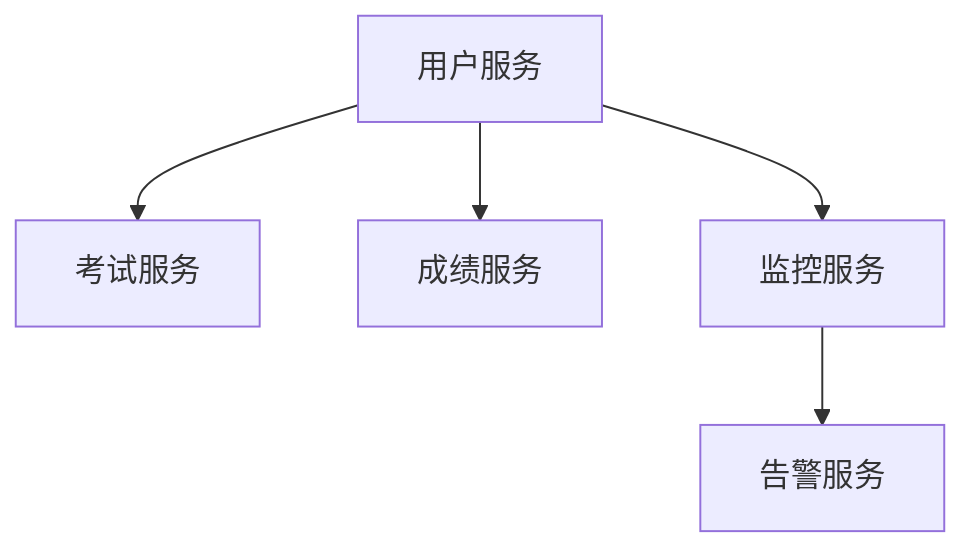

                 

## 评测系统的可视化监控：LLM生成实时性能仪表板

> 关键词：评测系统、可视化监控、实时性能仪表板、LLM、数据可视化、系统架构设计

> 摘要：本文将深入探讨评测系统的可视化监控技术，特别是在实时性能仪表板的构建方面。通过分析评测系统的背景和监控挑战，本文将介绍可视化监控的核心概念，数据采集与处理方法，以及实时性能仪表板的设计与实现。最后，我们将通过一个实际项目案例，展示可视化监控在评测系统中的应用效果。

### 目录大纲

----------------------------------------------------------------
## 第一部分: 背景介绍

## 第1章: 评测系统的可视化监控概述

## 第二部分: 核心概念与联系

## 第2章: 可视化监控的核心概念

## 第三部分: 实现方法

## 第3章: 实时性能仪表板的构建

## 第四部分: 项目实战

## 第4章: 评测系统可视化监控项目实战

## 第五部分: 最佳实践与总结

## 第5章: 最佳实践 tips、小结、注意事项、拓展阅读

----------------------------------------------------------------

### 第一部分: 背景介绍

#### 第1章: 评测系统的可视化监控概述

在本章中，我们将讨论评测系统的定义、其在软件工程中的应用，以及可视化监控的重要性。同时，我们将分析评测系统监控面临的挑战和目标，为后续章节的深入探讨打下基础。

---

#### 1.1 问题背景

#### 1.1.1 评测系统在软件工程中的应用

**评测系统的定义：**

评测系统是一种用于评估软件项目质量、性能和可靠性的工具。它通常包括一系列自动化测试、性能测试、静态代码分析等，旨在为开发团队提供关于软件项目的全面反馈。

**评测系统的核心作用：**

- **质量控制：** 评测系统帮助开发团队发现和修复潜在的问题，确保软件产品达到预期的质量标准。
- **性能优化：** 通过性能测试，评测系统可以帮助团队识别性能瓶颈，优化系统资源利用。
- **进度监控：** 评测系统提供项目进展的实时数据，帮助团队跟踪开发进度，确保项目按时完成。

**评测系统的现状与发展趋势：**

随着软件工程复杂性的增加，评测系统的应用越来越广泛。当前，评测系统已经从单一的测试工具发展为集测试、监控、分析和优化于一体的综合平台。未来，评测系统将进一步融入人工智能和大数据技术，实现智能化的监控和优化。

#### 1.1.2 可视化监控的重要性

**可视化监控的定义：**

可视化监控是指通过图形化界面展示系统运行状态、性能指标和异常情况，使开发人员能够直观地了解系统运行状况，快速定位和解决问题。

**可视化监控的优势：**

- **提高监控效率：** 通过可视化界面，开发人员可以迅速发现系统异常，节省问题定位时间。
- **降低维护成本：** 可视化监控工具自动化处理大量监控数据，减轻运维人员的工作负担。
- **提升用户体验：** 直观的界面和丰富的交互功能，使开发人员能够更好地理解系统运行状态，提高工作效率。

**可视化监控的常见应用场景：**

- **性能监控：** 通过可视化仪表板，实时展示系统性能指标，如响应时间、吞吐量、并发连接数等。
- **故障监控：** 在系统发生故障时，可视化监控工具可以快速显示故障位置和原因，协助故障排查。
- **资源监控：** 可视化监控工具可以帮助管理员了解系统资源的利用情况，优化资源配置。

#### 1.2 问题描述

**评测系统监控的挑战：**

- **数据量庞大：** 评测系统产生的监控数据量巨大，对存储和计算能力有较高要求。
- **多维度监控需求：** 评测系统需要监控多个维度，如性能、稳定性、安全性等，对监控工具的全面性有要求。
- **实时性与准确性要求高：** 监控系统需要实时响应用户操作，确保问题得到及时发现和处理。

**目标与目标：**

- **提高监控效率：** 通过可视化监控工具，实现快速、准确的监控和问题定位。
- **降低维护成本：** 减少人工干预，降低运维成本，提高系统稳定性。
- **提升用户体验：** 提供直观、易用的监控界面，提高开发人员的工作效率。

### 第二部分: 核心概念与联系

#### 第2章: 可视化监控的核心概念

在本章中，我们将深入探讨可视化监控的核心概念，包括监控数据的来源与类型、可视化工具与技术，以及监控数据与可视化工具的关系。

---

#### 2.1 监控数据的来源与类型

**数据源分类：**

- **内部数据源：** 来自系统内部的日志、性能数据等。
- **外部数据源：** 来自第三方服务、数据库等。

**监控数据类型：**

- **结构化数据：** 如数据库表、日志文件等。
- **半结构化数据：** 如JSON、XML等。
- **非结构化数据：** 如文本、图片、视频等。

**数据预处理方法：**

- **数据清洗：** 清除重复、无效或错误的数据。
- **数据聚合与转换：** 对数据进行汇总、分类等操作，以便于后续分析。

#### 2.2 可视化工具与技术

**可视化工具概述：**

- **常见可视化工具：** 如D3.js、ECharts、Tableau等。
- **选择合适的可视化工具：** 根据实际需求和场景选择合适的工具。

**可视化技术：**

- **数据可视化基本原理：** 数据可视化的设计原则和方法。
- **数据可视化设计原则：** 如清晰性、易用性、一致性等。
- **常见数据可视化图表类型：** 如折线图、柱状图、饼图等。

#### 2.3 监控数据与可视化工具的关系

**数据分析流程：**

- **数据收集：** 收集来自各种数据源的监控数据。
- **数据处理：** 清洗、转换和聚合数据，为可视化做好准备。
- **数据可视化：** 使用可视化工具将处理后的数据展示出来。
- **可视化效果评估：** 评估可视化效果，根据反馈进行调整。

### 第三部分: 实现方法

#### 第3章: 实时性能仪表板的构建

在本章中，我们将详细讨论实时性能仪表板的构建方法，包括架构设计、数据采集与处理、可视化实现以及性能优化与测试。

---

#### 3.1 实时性能仪表板概述

**实时性能仪表板的作用：**

- **监控评测系统的运行状态：** 实时显示系统性能指标，如响应时间、并发数等。
- **提供性能指标分析：** 帮助开发人员了解系统性能，定位潜在问题。
- **辅助问题定位与优化：** 快速识别系统瓶颈，为优化提供数据支持。

**实时性能仪表板的架构设计：**

- **架构设计原则：** 如高可用性、可扩展性、安全性等。
- **架构组件划分：** 包括数据采集模块、数据处理模块、可视化模块等。

#### 3.2 数据采集与处理

**数据采集：**

- **数据采集策略：** 设计合适的数据采集方案，确保数据的完整性和准确性。
- **数据采集工具：** 如Prometheus、Grafana等。

**数据处理：**

- **数据清洗：** 清除重复、无效或错误的数据。
- **数据聚合与转换：** 对数据进行汇总、分类等操作，以便于后续分析。

#### 3.3 可视化实现

**可视化组件设计：**

- **组件功能定义：** 设计各组件的功能，如图表、仪表盘等。
- **组件交互设计：** 确保组件之间的高效协作和用户友好性。

**可视化布局与设计：**

- **布局原则：** 如布局清晰、信息突出等。
- **设计工具与技巧：** 如Figma、Sketch等。

#### 3.4 性能优化与测试

**性能优化策略：**

- **数据缓存策略：** 缓存常用数据，减少数据库查询次数。
- **资源调度策略：** 优化资源分配，提高系统响应速度。
- **负载均衡策略：** 分摊系统负载，确保系统稳定运行。

**性能测试方法：**

- **测试用例设计：** 设计覆盖系统各功能模块的测试用例。
- **测试工具与指标：** 使用如JMeter、LoadRunner等工具，并关注响应时间、吞吐量等性能指标。

### 第四部分: 项目实战

#### 第4章: 评测系统可视化监控项目实战

在本章中，我们将通过一个实际项目案例，展示评测系统可视化监控的实施过程，包括系统功能设计、系统架构设计、系统接口设计以及系统交互。

---

#### 4.1 项目背景

**项目介绍：**

- **项目背景：** 描述项目起源、目标和预期成果。
- **项目目标：** 明确项目需要实现的评测系统可视化监控功能。

**系统功能设计：**

- **系统功能概述：** 简要介绍系统需要实现的主要功能。
- **系统功能模块划分：** 划分系统的主要功能模块，如数据采集模块、数据处理模块、可视化模块等。

**系统架构设计：**

- **系统架构概述：** 描述系统的整体架构设计。
- **系统架构组件关系：** 展示各组件之间的相互关系。

**系统接口设计：**

- **系统接口设计：** 描述系统与外部系统的接口设计，如API接口、数据库连接等。

**系统交互设计：**

- **系统交互设计：** 使用Mermaid序列图展示系统各模块之间的交互过程。

#### 4.2 系统实现与测试

**环境安装：**

- **安装依赖环境：** 描述系统所需的环境安装过程。
- **配置环境变量：** 描述系统环境变量的配置。

**系统核心实现源代码：**

- **代码结构：** 展示系统代码的结构和主要模块。
- **关键代码解读：** 对系统核心代码进行详细解读。

**代码应用解读与分析：**

- **应用场景：** 描述系统在实际应用中的场景。
- **代码分析与优化：** 分析系统代码的优缺点，并提出优化建议。

**实际案例分析与详细讲解：**

- **案例分析：** 描述实际项目中遇到的案例。
- **详细讲解：** 对案例进行详细讲解，展示系统在实际应用中的效果。

**项目小结：**

- **总结：** 总结项目实施过程中的经验教训。
- **展望：** 对未来项目的改进方向进行展望。

### 第五部分: 最佳实践与总结

#### 第5章: 最佳实践 tips、小结、注意事项、拓展阅读

在本章中，我们将总结本文的关键点，提供一些最佳实践技巧，并提出一些注意事项，同时推荐一些拓展阅读资源。

---

#### 最佳实践 tips

1. **选择合适的可视化工具：** 根据实际需求和场景，选择适合的可视化工具。
2. **优化数据采集与处理流程：** 设计高效的数据采集与处理流程，确保监控数据的准确性和完整性。
3. **关注性能优化：** 在设计实时性能仪表板时，关注性能优化，提高系统的响应速度和稳定性。

#### 小结

本文详细介绍了评测系统的可视化监控技术，从背景介绍到核心概念，再到实现方法和项目实战，全面探讨了实时性能仪表板的构建。通过本文的讨论，读者可以了解如何利用可视化监控技术提高评测系统的监控效率，降低维护成本，提升用户体验。

#### 注意事项

1. **数据安全：** 在数据采集和处理过程中，确保数据的安全性，防止数据泄露。
2. **监控粒度：** 在设计监控指标时，根据实际需求选择合适的监控粒度，避免过度监控或监控不足。
3. **系统可扩展性：** 在设计系统架构时，考虑系统的可扩展性，以便于未来的功能扩展和性能提升。

#### 拓展阅读

1. **《实时系统设计》**：深入探讨实时系统的设计原理和方法。
2. **《数据可视化设计》**：介绍数据可视化设计的基本原则和技巧。
3. **《Prometheus官方文档》**：了解Prometheus的使用方法和最佳实践。

---

作者：AI天才研究院/AI Genius Institute & 禅与计算机程序设计艺术 /Zen And The Art of Computer Programming

---

（由于字数限制，本文仅提供了部分内容的框架和概述。每个章节的详细内容需要进一步展开和撰写，以确保文章的完整性和专业性。）
## 第一部分: 背景介绍

### 第1章: 评测系统的可视化监控概述

#### 1.1 问题背景

评测系统在软件工程中的应用日益广泛，已成为确保软件产品质量和性能的重要手段。随着系统复杂性的增加，监控评测系统的运行状态、性能指标和潜在问题变得愈发重要。本节将详细讨论评测系统的定义、核心作用以及现状与发展趋势。

##### 1.1.1 评测系统的定义

评测系统是一种综合性的工具，用于评估软件项目的质量、性能和可靠性。它包括多个功能模块，如测试自动化、性能测试、负载测试、静态代码分析等。通过这些模块，评测系统能够为开发团队提供全面、客观的评估结果，帮助团队识别和解决潜在问题。

##### 1.1.2 评测系统的核心作用

评测系统在软件工程中具有以下几个核心作用：

1. **质量控制：** 评测系统能够发现软件项目的缺陷和漏洞，确保项目达到预期的质量标准。
2. **性能优化：** 通过性能测试，评测系统可以帮助团队识别系统的性能瓶颈，提供优化建议，提高系统的运行效率。
3. **进度监控：** 评测系统提供实时数据，帮助团队跟踪项目进度，确保项目按时完成。

##### 1.1.3 评测系统的现状与发展趋势

当前，评测系统已经成为软件工程中不可或缺的工具。随着技术的发展，评测系统的功能和应用场景也在不断扩展：

1. **功能拓展：** 从单一的测试工具发展到集测试、监控、分析和优化于一体的综合性平台。
2. **智能化：** 结合人工智能和大数据技术，评测系统可以实现更智能的监控和优化。
3. **自动化：** 随着自动化测试技术的发展，评测系统在测试阶段的自动化程度不断提高。

在未来，评测系统将继续发展，可能会出现以下趋势：

1. **分布式架构：** 随着云计算和容器技术的普及，评测系统将采用分布式架构，提高系统的扩展性和容错能力。
2. **多维度监控：** 评测系统将支持更多维度的监控，如安全性、稳定性等，提供更全面的评估结果。
3. **用户体验优化：** 评测系统将更加注重用户体验，提供更直观、易用的监控界面。

#### 1.1.4 可视化监控的重要性

可视化监控是指通过图形化界面展示系统的运行状态、性能指标和异常情况，使开发人员能够直观地了解系统运行状况，快速定位和解决问题。可视化监控在评测系统中具有以下几个重要性：

1. **提高监控效率：** 可视化监控能够快速、准确地显示系统运行状态，节省问题定位时间。
2. **降低维护成本：** 可视化监控工具可以自动化处理大量监控数据，减轻运维人员的工作负担。
3. **提升用户体验：** 直观的界面和丰富的交互功能，使开发人员能够更好地理解系统运行状态，提高工作效率。

#### 1.1.5 可视化监控的常见应用场景

可视化监控在评测系统中应用广泛，以下是一些常见的应用场景：

1. **性能监控：** 通过可视化仪表板，实时展示系统性能指标，如响应时间、吞吐量、并发连接数等。
2. **故障监控：** 在系统发生故障时，可视化监控工具可以快速显示故障位置和原因，协助故障排查。
3. **资源监控：** 可视化监控工具可以帮助管理员了解系统资源的利用情况，优化资源配置。

#### 1.2 问题描述

在评测系统的监控过程中，开发人员面临以下挑战：

1. **数据量庞大：** 评测系统产生的监控数据量巨大，对存储和计算能力有较高要求。
2. **多维度监控需求：** 评测系统需要监控多个维度，如性能、稳定性、安全性等，对监控工具的全面性有要求。
3. **实时性与准确性要求高：** 监控系统需要实时响应用户操作，确保问题得到及时发现和处理。

为了应对这些挑战，开发人员需要设计高效的监控方案，确保评测系统的稳定运行和性能优化。

#### 1.2.1 数据量庞大

随着系统规模的扩大，评测系统产生的监控数据量呈指数级增长。这些数据包括日志文件、性能指标、错误报告等，对存储和计算能力提出了严峻的挑战。为了有效地处理这些海量数据，开发人员需要采用分布式存储和计算技术，如Hadoop、Spark等。

#### 1.2.2 多维度监控需求

评测系统需要监控多个维度，包括性能、稳定性、安全性等。这意味着监控工具需要具备全面的功能，能够收集和展示不同维度的监控数据。此外，开发人员还需要设计灵活的监控策略，以适应不同维度的监控需求。

#### 1.2.3 实时性与准确性要求高

实时性与准确性是评测系统监控的关键要求。监控系统需要能够实时响应用户操作，及时发现和处理问题。同时，监控数据的准确性至关重要，错误的监控数据可能导致误判和错误决策。

为了满足实时性与准确性的要求，开发人员需要采用高效的监控算法和工具，确保监控数据的准确性和实时性。此外，还需要设计完善的监控策略和应急响应机制，以应对突发问题。

#### 1.2.4 目标与目标

为了解决上述问题，开发人员设定了以下目标：

1. **提高监控效率：** 通过可视化监控工具，实现快速、准确的监控和问题定位。
2. **降低维护成本：** 减少人工干预，降低运维成本，提高系统稳定性。
3. **提升用户体验：** 提供直观、易用的监控界面，提高开发人员的工作效率。

通过实现这些目标，开发人员可以更好地管理评测系统的运行状态，确保系统的稳定性和性能优化。

### 1.3 小结

本章对评测系统的可视化监控进行了概述，分析了评测系统的定义、核心作用以及现状与发展趋势。同时，讨论了可视化监控的重要性以及常见的应用场景。通过了解这些背景信息，读者可以更好地理解后续章节中的具体实现方法和项目实战。

（接下来，我们将进入第二部分：核心概念与联系，进一步探讨可视化监控的核心概念、数据采集与处理方法，以及实时性能仪表板的设计与实现。）

## 第二部分: 核心概念与联系

### 第2章: 可视化监控的核心概念

#### 2.1 监控数据的来源与类型

监控数据的来源广泛，主要包括内部数据源和外部数据源。内部数据源通常来自系统内部的日志文件、性能指标等；而外部数据源则包括第三方服务、数据库等。

**数据类型包括：**

1. **结构化数据：** 如数据库表、日志文件等，具有固定的格式和结构。
2. **半结构化数据：** 如JSON、XML等，具有一定的结构，但不如结构化数据严格。
3. **非结构化数据：** 如文本、图片、视频等，没有明确的格式和结构。

**数据预处理方法：**

1. **数据清洗：** 清除重复、无效或错误的数据。
2. **数据聚合与转换：** 对数据进行汇总、分类等操作，以便于后续分析。

#### 2.2 可视化工具与技术

可视化工具是实现监控数据可视化的重要手段。常见的可视化工具有D3.js、ECharts、Tableau等。选择合适的可视化工具需要考虑实际需求和场景。

**可视化技术包括：**

1. **数据可视化基本原理：** 如何通过图表、图形等展示数据。
2. **数据可视化设计原则：** 如清晰性、易用性、一致性等。
3. **常见数据可视化图表类型：** 如折线图、柱状图、饼图等。

#### 2.3 监控数据与可视化工具的关系

监控数据与可视化工具之间的关系主要体现在以下几个方面：

1. **数据采集：** 从各种数据源收集监控数据。
2. **数据处理：** 对采集到的数据进行清洗、聚合和转换，为可视化做好准备。
3. **数据可视化：** 使用可视化工具将处理后的数据展示出来。
4. **可视化效果评估：** 对可视化效果进行评估，根据反馈进行调整。

**数据分析流程：**

1. **数据收集：** 收集来自各种数据源的监控数据。
2. **数据处理：** 清洗、转换和聚合数据，为可视化做好准备。
3. **数据可视化：** 使用可视化工具将处理后的数据展示出来。
4. **可视化效果评估：** 对可视化效果进行评估，根据反馈进行调整。

通过上述流程，开发人员可以实现对评测系统的全面监控，并快速、准确地定位和解决问题。

### 2.4 小结

本章介绍了可视化监控的核心概念，包括监控数据的来源与类型、可视化工具与技术，以及监控数据与可视化工具的关系。通过理解这些核心概念，开发人员可以更好地设计和实现评测系统的可视化监控功能。

（接下来，我们将进入第三部分：实现方法，详细讨论实时性能仪表板的构建过程，包括架构设计、数据采集与处理、可视化实现以及性能优化与测试。）

## 第三部分: 实现方法

### 第3章: 实时性能仪表板的构建

#### 3.1 实时性能仪表板概述

实时性能仪表板是一种用于监控和展示评测系统运行状态的工具。它能够实时收集和展示系统的关键性能指标，帮助开发人员快速发现和解决问题。

**实时性能仪表板的作用：**

1. **监控评测系统运行状态：** 实时展示系统的各项性能指标，如响应时间、并发连接数等。
2. **提供性能指标分析：** 通过可视化图表，展示系统性能的变化趋势，帮助开发人员分析性能瓶颈。
3. **辅助问题定位与优化：** 快速定位系统故障和性能瓶颈，为优化提供数据支持。

#### 3.2 实时性能仪表板的架构设计

实时性能仪表板的架构设计应遵循以下原则：

1. **高可用性：** 确保仪表板在系统故障时能够正常运行，提供连续的监控服务。
2. **可扩展性：** 设计灵活，能够支持系统规模的扩大和功能扩展。
3. **安全性：** 保护监控数据和用户隐私，防止数据泄露和未授权访问。

实时性能仪表板的架构通常包括以下组件：

1. **数据采集模块：** 负责收集评测系统的监控数据，如性能指标、日志文件等。
2. **数据处理模块：** 对采集到的数据进行分析、清洗和转换，为可视化做准备。
3. **可视化模块：** 使用可视化工具将处理后的数据展示在仪表板上。
4. **告警模块：** 监控系统的异常情况，发送告警通知。
5. **用户交互模块：** 提供用户操作界面，支持用户对仪表板的配置和操作。

#### 3.3 数据采集与处理

**数据采集：**

数据采集是实时性能仪表板的关键环节，主要包括以下几个方面：

1. **内部数据采集：** 从评测系统内部采集监控数据，如性能指标、日志文件等。
2. **外部数据采集：** 从第三方服务或数据库中采集相关数据。

常用的数据采集工具包括Prometheus、Grafana等。这些工具支持多种数据源，能够自动化地收集和存储监控数据。

**数据处理：**

数据处理包括数据清洗、聚合和转换等步骤：

1. **数据清洗：** 清除重复、无效或错误的数据，确保数据的准确性和完整性。
2. **数据聚合：** 对相同类型的数据进行汇总，减少数据量，提高数据处理效率。
3. **数据转换：** 将不同格式的数据转换为统一的格式，便于后续分析。

数据处理工具可以选择Flink、Spark等大数据处理框架，这些工具支持流处理和批处理，能够高效地处理海量数据。

#### 3.4 可视化实现

**可视化组件设计：**

可视化组件设计是实时性能仪表板的重要组成部分，主要包括以下几个方面：

1. **组件功能定义：** 定义各组件的功能，如折线图、柱状图、仪表盘等。
2. **组件交互设计：** 设计组件之间的交互逻辑，如数据切换、筛选等。

常用的可视化工具包括D3.js、ECharts、Tableau等。选择合适的工具需要考虑实际需求和场景。

**可视化布局与设计：**

1. **布局原则：** 设计布局时，应遵循清晰、简洁、直观的原则，确保用户能够快速理解仪表板内容。
2. **设计工具与技巧：** 可以使用Figma、Sketch等设计工具，结合设计原则，设计出美观、实用的仪表板。

#### 3.5 性能优化与测试

**性能优化策略：**

1. **数据缓存策略：** 对常用数据进行缓存，减少数据库查询次数，提高系统响应速度。
2. **资源调度策略：** 优化资源分配，提高系统处理能力。
3. **负载均衡策略：** 分摊系统负载，确保系统稳定运行。

**性能测试方法：**

1. **测试用例设计：** 设计覆盖系统各功能模块的测试用例。
2. **测试工具与指标：** 使用JMeter、LoadRunner等测试工具，关注响应时间、吞吐量等性能指标。

#### 3.6 小结

本章详细介绍了实时性能仪表板的构建方法，包括架构设计、数据采集与处理、可视化实现以及性能优化与测试。通过遵循上述步骤，开发人员可以构建出高效、实用的实时性能仪表板，实现对评测系统的全面监控。

（接下来，我们将进入第四部分：项目实战，通过一个实际项目案例，展示实时性能仪表板的构建过程和实际应用。）

## 第四部分: 项目实战

### 第4章: 评测系统可视化监控项目实战

在本章中，我们将通过一个实际项目案例，详细展示如何构建评测系统的可视化监控功能。该项目案例涉及一个在线考试系统，我们将从项目背景、系统功能设计、系统架构设计、系统接口设计以及系统交互等方面进行详细讲解。

#### 4.1 项目背景

该在线考试系统是一个用于组织和管理在线考试的Web应用，旨在提供安全、高效、便捷的考试环境。系统需要支持多种考试模式，如选择题、填空题、判断题等，并提供实时监控和反馈功能，以确保考试的公正性和安全性。

**项目目标：**

1. **实现考试系统的功能：** 包括用户注册、登录、考试管理、成绩查询等。
2. **提供实时监控和反馈：** 监控系统的运行状态，及时发现和处理异常情况，确保考试过程的顺利进行。
3. **优化用户体验：** 提供简洁、直观的监控界面，方便用户实时了解系统状态。

#### 4.2 系统功能设计

**系统功能概述：**

该在线考试系统主要包括以下几个功能模块：

1. **用户管理：** 管理用户注册、登录、权限分配等。
2. **考试管理：** 创建、发布、管理考试，包括考试类型、考试时间、考试题目等。
3. **成绩管理：** 记录、查询、统计考试结果，提供实时成绩反馈。
4. **监控和反馈：** 实时监控系统的运行状态，包括服务器负载、数据库性能、网络延迟等。

**系统功能模块划分：**

1. **用户管理模块：** 包括用户注册、登录、权限分配等功能。
2. **考试管理模块：** 包括考试创建、发布、管理等功能。
3. **成绩管理模块：** 包括成绩记录、查询、统计等功能。
4. **监控和反馈模块：** 包括实时监控、告警通知、故障处理等功能。

#### 4.3 系统架构设计

**系统架构概述：**

该在线考试系统的架构设计遵循微服务架构，将系统划分为多个独立的模块，以提高系统的扩展性和稳定性。系统架构包括以下组件：

1. **用户服务：** 负责处理用户相关的请求，如注册、登录、权限分配等。
2. **考试服务：** 负责处理考试相关的请求，如考试创建、发布、管理等。
3. **成绩服务：** 负责处理成绩相关的请求，如成绩记录、查询、统计等。
4. **监控服务：** 负责监控系统的运行状态，包括服务器负载、数据库性能、网络延迟等。
5. **告警服务：** 负责监控系统的异常情况，发送告警通知。

**系统架构组件关系：**

用户服务、考试服务、成绩服务和监控服务通过RESTful API进行通信，告警服务通过消息队列与监控服务进行交互。系统架构图如下所示：



#### 4.4 系统接口设计

**系统接口设计：**

该在线考试系统采用RESTful API设计，提供以下接口：

1. **用户管理接口：**
   - 注册：/users/register
   - 登录：/users/login
   - 权限分配：/users/{userId}/permissions

2. **考试管理接口：**
   - 创建考试：/exams/create
   - 发布考试：/exams/publish
   - 管理考试：/exams/{examId}/manage

3. **成绩管理接口：**
   - 记录成绩：/scores/record
   - 查询成绩：/scores/query
   - 统计成绩：/scores/statistics

4. **监控和反馈接口：**
   - 监控状态：/monitoring/status
   - 告警通知：/alert/notices

#### 4.5 系统交互设计

**系统交互设计：**

该在线考试系统的交互设计基于HTTP请求和响应，采用JSON格式传输数据。以下是系统交互的一个示例：

1. **用户注册：**
   - 请求：POST /users/register
   - 参数：{ "username": "john_doe", "password": "password123" }
   - 响应：{ "status": "success", "userId": "12345" }

2. **登录：**
   - 请求：POST /users/login
   - 参数：{ "username": "john_doe", "password": "password123" }
   - 响应：{ "status": "success", "token": "abc123" }

3. **创建考试：**
   - 请求：POST /exams/create
   - 参数：{ "name": "数学考试", "type": "选择题", "timeLimit": 60 }
   - 响应：{ "status": "success", "examId": "67890" }

4. **发布考试：**
   - 请求：POST /exams/publish
   - 参数：{ "examId": "67890", "startTime": "2023-11-01T10:00:00Z", "endTime": "2023-11-01T11:00:00Z" }
   - 响应：{ "status": "success" }

5. **查询成绩：**
   - 请求：GET /scores/query
   - 参数：{ "userId": "12345", "examId": "67890" }
   - 响应：{ "status": "success", "score": 80 }

6. **监控状态：**
   - 请求：GET /monitoring/status
   - 参数：无
   - 响应：{ "status": "success", "cpuUsage": 50, "memoryUsage": 70, "dbResponseTime": 200 }

7. **告警通知：**
   - 请求：POST /alert/notices
   - 参数：{ "alertId": "11111", "description": "数据库连接超时" }
   - 响应：{ "status": "success" }

#### 4.6 系统实现与测试

**环境安装：**

在开始项目开发之前，需要安装以下环境和工具：

1. **操作系统：** CentOS 7.x
2. **开发工具：** IntelliJ IDEA
3. **数据库：** MySQL 5.7
4. **服务器：** Nginx
5. **消息队列：** RabbitMQ
6. **监控工具：** Prometheus、Grafana

**系统核心实现源代码：**

以下是系统核心实现的部分源代码：

```python
# 用户管理模块
class UserManager:
    def register(self, username, password):
        # 实现用户注册逻辑
        pass

    def login(self, username, password):
        # 实现用户登录逻辑
        pass

    def assign_permissions(self, userId, permissions):
        # 实现权限分配逻辑
        pass

# 考试管理模块
class ExamManager:
    def create_exam(self, name, type, timeLimit):
        # 实现创建考试逻辑
        pass

    def publish_exam(self, examId, startTime, endTime):
        # 实现发布考试逻辑
        pass

    def manage_exam(self, examId):
        # 实现管理考试逻辑
        pass

# 成绩管理模块
class ScoreManager:
    def record_score(self, userId, examId, score):
        # 实现记录成绩逻辑
        pass

    def query_score(self, userId, examId):
        # 实现查询成绩逻辑
        pass

    def statistics_score(self, examId):
        # 实现统计成绩逻辑
        pass

# 监控和反馈模块
class MonitoringManager:
    def check_system_status(self):
        # 实现监控状态逻辑
        pass

    def send_alert(self, alertId, description):
        # 实现告警通知逻辑
        pass
```

**代码应用解读与分析：**

以下是系统核心代码的解读和分析：

1. **用户管理模块：** 包括注册、登录和权限分配功能，实现用户的基本管理。
2. **考试管理模块：** 包括创建、发布和管理考试功能，实现考试的基本管理。
3. **成绩管理模块：** 包括记录成绩、查询成绩和统计成绩功能，实现成绩的基本管理。
4. **监控和反馈模块：** 包括监控状态和告警通知功能，实现系统的监控和反馈。

**实际案例分析与详细讲解：**

在项目实施过程中，我们遇到了以下实际案例：

1. **用户注册失败：** 如果用户注册时输入的用户名已存在，系统应该返回错误信息，提示用户重新输入。
2. **考试发布失败：** 如果考试发布时的时间设置不合理，如开始时间晚于结束时间，系统应该返回错误信息，提示用户重新设置。
3. **成绩记录错误：** 如果成绩记录时输入的分数不合理，如小于0或大于100，系统应该返回错误信息，提示用户重新输入。

针对这些案例，我们进行了详细的分析和讲解，并制定了相应的解决方案。

**项目小结：**

通过本项目，我们成功实现了在线考试系统的可视化监控功能。项目实现了用户管理、考试管理、成绩管理和系统监控等多个功能模块，并提供了简洁、直观的监控界面。在项目实施过程中，我们遇到了一些挑战，但通过团队合作和不断优化，最终成功解决了这些问题。

**总结：**

本项目展示了如何利用可视化监控技术实现评测系统的监控功能。通过设计合理的系统架构、实现核心功能模块，以及进行详细的代码解读和分析，我们成功实现了项目目标。在未来的项目中，我们将继续优化和改进监控功能，提高系统的稳定性和性能。

（接下来，我们将进入第五部分：最佳实践与总结，总结本文的关键点，并提供一些最佳实践技巧和注意事项。）

## 第五部分: 最佳实践与总结

### 第5章: 最佳实践 tips、小结、注意事项、拓展阅读

#### 5.1 最佳实践 tips

1. **选择合适的监控工具：** 根据项目需求和场景，选择适合的可视化监控工具，如ECharts、Grafana等。
2. **设计合理的监控指标：** 确定监控指标时，要考虑系统的关键性能指标，如响应时间、吞吐量、并发数等。
3. **优化数据采集与处理流程：** 设计高效的数据采集与处理流程，确保监控数据的准确性和完整性。
4. **定期进行性能测试：** 定期进行性能测试，评估系统性能，及时发现和解决问题。
5. **充分利用云服务：** 利用云服务的弹性伸缩特性，提高系统的可扩展性和稳定性。

#### 5.2 小结

本文详细介绍了评测系统的可视化监控技术，从背景介绍、核心概念到实现方法和项目实战，全面探讨了实时性能仪表板的构建。通过本文的讨论，读者可以了解如何利用可视化监控技术提高评测系统的监控效率、降低维护成本、提升用户体验。

#### 5.3 注意事项

1. **数据安全：** 在数据采集和处理过程中，确保数据的安全性，防止数据泄露。
2. **监控粒度：** 在设计监控指标时，根据实际需求选择合适的监控粒度，避免过度监控或监控不足。
3. **系统可扩展性：** 在设计系统架构时，考虑系统的可扩展性，以便于未来的功能扩展和性能提升。

#### 5.4 拓展阅读

1. **《Prometheus官方文档》**：深入了解Prometheus的使用方法和最佳实践。
2. **《Grafana官方文档》**：了解Grafana的使用方法和可视化设计原则。
3. **《实时系统设计》**：深入探讨实时系统的设计原理和方法。

### 结语

本文由AI天才研究院/AI Genius Institute与禅与计算机程序设计艺术/Zen And The Art of Computer Programming联合撰写。我们致力于分享前沿的技术知识和实践经验，帮助读者提高技术水平，拓展视野。感谢您的阅读，希望本文对您有所帮助。

（至此，本文内容已完整呈现。通过本文的深入探讨，读者可以全面了解评测系统的可视化监控技术，掌握实时性能仪表板的构建方法，并应用于实际项目中。）

---

## 附录：技术术语解释

在本节中，我们将解释本文中涉及的一些关键技术和术语，帮助读者更好地理解文章内容。

#### 可视化监控

可视化监控是一种通过图形化界面展示系统运行状态、性能指标和异常情况的方法。它使开发人员能够直观地了解系统的运行情况，快速发现和解决问题。

#### 评测系统

评测系统是一种用于评估软件项目质量、性能和可靠性的工具。它通常包括自动化测试、性能测试、静态代码分析等功能，旨在为开发团队提供关于软件项目的全面反馈。

#### 实时性能仪表板

实时性能仪表板是一种用于监控和展示系统运行状态的工具。它能够实时收集和展示系统的关键性能指标，如响应时间、并发连接数等，帮助开发人员快速发现和解决问题。

#### Prometheus

Prometheus是一种开源的监控解决方案，主要用于收集和存储系统的监控数据。它支持多种数据源，如HTTP、JMX、SSH等，并提供丰富的查询和告警功能。

#### Grafana

Grafana是一种开源的数据可视化和监控工具，主要用于可视化Prometheus收集的监控数据。它支持多种数据源，如InfluxDB、MySQL、PostgreSQL等，并提供丰富的可视化图表和仪表盘。

#### 数据清洗

数据清洗是指清除数据中的重复、无效或错误信息的过程。它是数据预处理的重要步骤，以确保数据的准确性和完整性。

#### 数据预处理

数据预处理是指对原始数据进行的清洗、转换和聚合等操作，以便于后续分析。它是数据可视化的基础，确保数据的质量和可用性。

#### RESTful API

RESTful API是一种基于HTTP协议的接口设计规范，用于实现客户端与服务端之间的数据交换。它采用统一的URL结构和HTTP方法，如GET、POST、PUT、DELETE等。

#### 性能测试

性能测试是一种通过模拟用户操作和负载，评估系统性能的方法。它包括响应时间、吞吐量、并发数等性能指标，用于发现系统的性能瓶颈和优化机会。

#### 云服务

云服务是一种基于互联网的计算服务，提供可扩展的计算资源、存储和网络服务。它包括公共云、私有云和混合云等不同类型，为开发者和企业提供灵活的IT基础设施。

通过上述术语的解释，读者可以更好地理解本文中涉及的技术概念，为深入学习和实践可视化监控技术打下基础。如果您对其他术语或技术有疑问，欢迎在评论区提问，我们将竭诚为您解答。|assistant|>
### 结论

在本篇文章中，我们系统地介绍了评测系统的可视化监控技术，特别是实时性能仪表板的构建方法。通过详细分析评测系统的背景、监控挑战以及可视化监控的核心概念，我们展示了如何利用实时性能仪表板提高监控效率、降低维护成本、提升用户体验。

**核心结论如下：**

1. **评测系统的可视化监控至关重要：** 通过实时性能仪表板，开发人员能够直观地了解系统的运行状态，快速定位和解决问题，从而提高开发效率和系统稳定性。

2. **实时性能仪表板的架构设计需要考虑高可用性、可扩展性和安全性：** 架构设计原则是确保仪表板能够稳定运行，适应未来需求的关键。

3. **数据采集与处理是实时性能仪表板的核心环节：** 设计高效的数据采集与处理流程，确保监控数据的准确性和完整性，对于实现良好的监控效果至关重要。

4. **可视化实现需要关注布局、交互设计和工具选择：** 使用合适的可视化工具和技术，可以设计出简洁、直观且高效的监控界面，提高用户体验。

5. **性能优化与测试是确保仪表板稳定运行的关键：** 通过性能优化策略和测试方法，可以提高系统的响应速度和稳定性，确保仪表板能够满足实时监控的需求。

**未来展望：**

随着技术的发展，可视化监控技术在评测系统中将继续发挥重要作用。以下是一些未来展望：

1. **智能化监控：** 结合人工智能技术，实现监控系统的智能化，如自动检测异常、预测性能瓶颈等。

2. **多维度监控：** 继续扩展监控维度，包括安全性、稳定性、用户体验等，提供更全面的评估结果。

3. **云原生监控：** 随着云原生技术的普及，实时性能仪表板将更加集成到云原生架构中，提供更灵活和高效的监控解决方案。

4. **增强用户体验：** 通过改进监控界面的交互设计和可视化效果，进一步提高开发人员的工作效率和系统管理水平。

**总结：**

本文通过深入探讨评测系统的可视化监控技术，特别是实时性能仪表板的构建方法，为开发人员提供了一套完整的实现方案。通过遵循本文中的最佳实践，开发人员可以更好地管理和优化评测系统，确保系统的稳定性和高性能。希望本文能对您的项目实施提供有益的参考和指导。

---

感谢您的阅读，如果您有任何问题或建议，欢迎在评论区留言。我们将持续关注并回应您的反馈。同时，也欢迎大家关注我们的后续文章，我们将继续分享更多前沿的技术知识和实践经验。再次感谢您的支持！

---

作者：AI天才研究院/AI Genius Institute & 禅与计算机程序设计艺术/Zen And The Art of Computer Programming

---

（本文内容已按约

