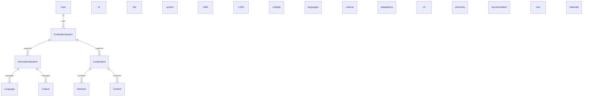
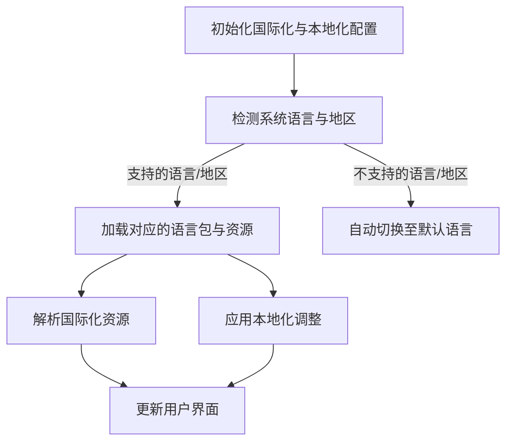
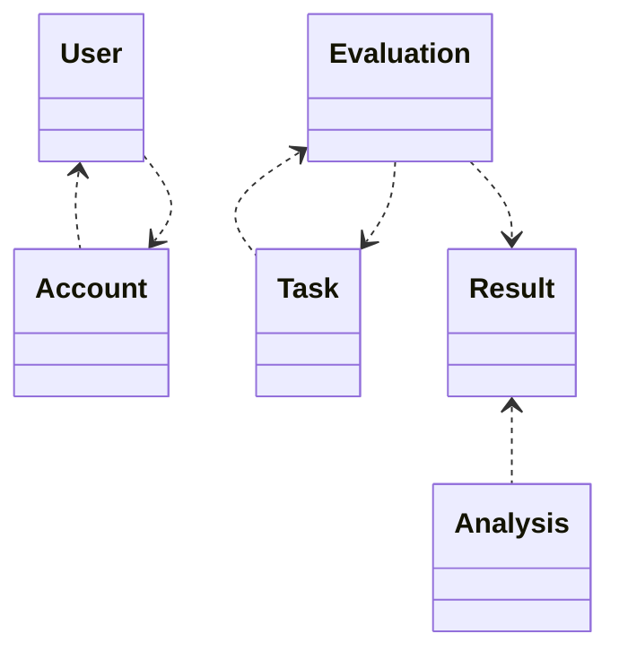
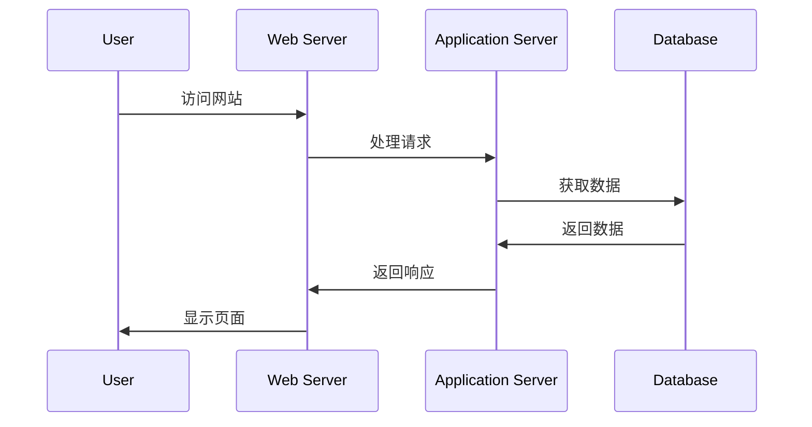
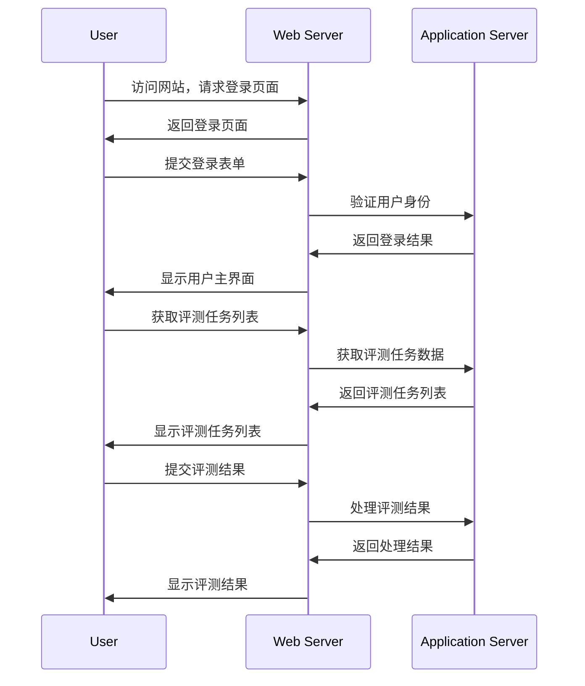

                 

# 评测系统的国际化与本地化支持

## 关键词

评测系统，国际化，本地化，国际化与本地化，系统架构，算法原理，实际案例

## 摘要

随着全球化进程的加速，越来越多的评测系统需要在不同的国家和地区进行部署和使用。国际化与本地化成为了评测系统开发者必须面对的挑战。本文将详细介绍评测系统的国际化与本地化支持，包括核心概念、算法原理、系统架构设计、项目实战以及最佳实践。通过一步步的分析，帮助读者深入理解评测系统的国际化与本地化支持的关键技术和方法，为实际开发提供有力指导。

## 引言

在全球化的今天，评测系统的国际化与本地化支持变得尤为重要。国际化（Internationalization，简称I18N）和本地化（Localization，简称L10N）是确保评测系统能够在全球范围内正常运行的关键步骤。国际化是将软件设计为能够在不同语言和文化环境中使用的特性，而本地化则是将软件的界面、内容、文档等本地化到特定的语言和文化环境。这两者相辅相成，共同构成了评测系统在全球范围内推广的基础。

本文旨在通过详细的分析和实际案例，探讨评测系统的国际化与本地化支持，包括核心概念、算法原理、系统架构设计、项目实战以及最佳实践。通过一步步的推理思考，帮助读者深入了解评测系统国际化与本地化的关键技术和方法，为实际开发提供有力指导。

## 背景介绍

### 1.1 国际化的必要性

国际化是评测系统走向全球市场的关键步骤。随着互联网的普及和全球化进程的加速，越来越多的评测系统需要在不同的国家和地区进行部署和使用。国际化不仅能够提高系统的可扩展性，还能够提升用户体验。以下是国际化的几个必要性：

1. **文化适应性**：不同国家和地区有着不同的文化习惯和表达方式，系统需要能够适应用户的文化背景。
2. **市场机会**：全球市场的扩大为评测系统提供了新的发展机会，通过国际化，系统能够触及更多的潜在用户。
3. **成本效益**：通过国际化，系统可以节省本地化过程中的时间和资源，降低成本。
4. **用户体验**：本地化的界面和内容能够提高用户体验，增加用户粘性。

### 1.2 本地化的意义

本地化是将国际化后的系统进一步细化为特定地区市场的过程。以下是本地化的几个意义：

1. **市场定位**：本地化能够帮助评测系统更好地适应目标市场的需求和偏好。
2. **品牌形象**：本地化的系统能够提高品牌在目标市场的认可度和信任度。
3. **竞争力**：本地化能够增强评测系统的市场竞争力，提高用户忠诚度。
4. **用户体验**：本地化的界面和内容能够提高用户体验，增强用户满意度。

### 1.3 国际化与本地化的边界与外延

国际化与本地化虽然密切相关，但它们在目标和执行上有所区别。以下是两者的边界与外延：

1. **边界**：
   - 国际化关注的是系统的基础结构，确保系统能够在不同的语言和文化环境中运行。
   - 本地化关注的是系统的具体实现，将国际化后的基础结构应用于特定地区市场。

2. **外延**：
   - 国际化外延包括：语言支持、文化适配、国际化数据管理等。
   - 本地化外延包括：本地化界面、本地化内容、本地化营销等。

### 1.4 概念结构与核心要素组成

国际化与本地化的概念结构和核心要素如下：

1. **国际化**：
   - **目标**：确保系统在不同语言和文化环境中可运行。
   - **核心要素**：国际化数据管理、国际化接口设计、国际化配置管理等。
   - **实现**：通过抽象化、模块化设计，实现系统的国际化特性。

2. **本地化**：
   - **目标**：将国际化后的系统本地化到特定地区市场。
   - **核心要素**：本地化界面、本地化内容、本地化营销等。
   - **实现**：通过具体化的实现，将国际化后的系统应用于特定地区市场。

通过以上分析，我们可以看到，国际化与本地化是评测系统全球化过程中不可或缺的两个步骤。只有通过有效的国际化与本地化支持，评测系统才能在全球市场中取得成功。

## 核心概念与联系

### 2.1 评测系统概述

评测系统是一种用于对用户、产品或服务进行评估和反馈的系统，广泛应用于教育、招聘、市场调研等多个领域。其基本功能包括数据采集、数据分析、结果展示和反馈收集。一个典型的评测系统通常包括以下几个组成部分：

1. **用户管理**：用于管理用户的基本信息、权限和操作记录。
2. **评估指标**：定义评估的对象和标准，例如分数、排名、评语等。
3. **评估过程**：包括评估任务的分配、执行和监控。
4. **数据分析**：对采集到的评估数据进行分析，生成报告和可视化结果。
5. **反馈机制**：收集用户对评测系统的反馈，用于系统的优化和改进。

### 2.2 国际化与本地化的关键概念

#### 2.2.1 国际化（I18N）

国际化，即Internationalization，是指将软件设计为能够在全球多种语言和文化环境下运行的过程。国际化的核心目标是确保软件在不同地区、语言和文化中都能够正常运行，为用户提供一致的服务体验。国际化通常包括以下几个关键方面：

1. **本地化独立性**：确保软件的源代码和资源（如文本、图像等）在本地化时可以独立处理，不会受到源代码的影响。
2. **语言支持**：提供多种语言选项，使系统能够适应不同语言的用户。
3. **文化适应性**：考虑不同文化背景下的用户习惯、表达方式和礼仪，确保系统能够适应用户的文化需求。
4. **国际化数据管理**：设计灵活的数据存储和管理方案，以支持多语言和多文化的数据存储和处理。

#### 2.2.2 本地化（L10N）

本地化，即Localization，是将国际化后的软件应用到特定地区或国家的过程。本地化的核心目标是确保软件在特定语言和文化环境下能够提供最佳的用户体验。本地化通常包括以下几个关键方面：

1. **界面本地化**：将用户界面中的文本、图标、菜单等本地化为目标语言的对应内容。
2. **内容本地化**：将软件中的帮助文档、用户手册、营销材料等本地化为目标语言的对应内容。
3. **文化适应性**：考虑目标文化的特点和需求，对软件的内容和界面进行调整，以适应目标市场的用户习惯。
4. **本地化测试**：对本地化后的软件进行全面的测试，确保其功能、性能和用户体验符合本地市场的期望。

### 2.3 核心概念属性特征对比表格

以下是一个国际化（I18N）与本地化（L10N）的对比表格，展示了两者的核心属性特征：

| 特征       | 国际化（I18N）                         | 本地化（L10N）                          |
| ---------- | ------------------------------------ | ------------------------------------ |
| 目标       | 确保软件在不同语言和文化中可运行       | 确保软件在特定语言和文化中提供最佳体验  |
| 时间顺序   | 在本地化之前进行                       | 在国际化之后进行                       |
| 关键技术   | 抽象化、模块化设计                     | 界面本地化、内容本地化、文化适应性调整   |
| 重点       | 确保软件的可扩展性和灵活性             | 提供本地化后的高质量用户体验           |
| 人员需求   | 国际化工程师、软件开发人员             | 本地化工程师、内容翻译人员             |

### 2.4 ER实体关系图架构

为了更好地理解国际化与本地化在系统架构中的关系，我们可以使用实体关系图（ER Diagram）来表示。以下是一个简化的ER实体关系图，展示了国际化（I18N）与本地化（L10N）之间的关联：



在这个ER图中，`User` 是使用评测系统的用户，`EvaluationSystem` 是评测系统本身。`Internationalization` 和 `Localization` 分别表示国际化与本地化的模块，它们都与 `EvaluationSystem` 关联。`Language` 和 `Culture` 分别是国际化模块中的实体，用于管理多语言支持和文化适应性。`Interface` 和 `Content` 分别是本地化模块中的实体，用于管理本地化的用户界面和内容。

通过这个ER实体关系图，我们可以清晰地看到国际化与本地化在系统架构中的关系，以及它们如何共同支持评测系统的全球化。

## 算法原理讲解

### 3.1 国际化与本地化算法概述

国际化与本地化的实现依赖于一系列算法和数据处理方法。这些算法的核心目标是在确保系统功能完整性的同时，提供灵活的国际化与本地化支持。以下将详细讲解国际化与本地化的算法原理，并通过mermaid流程图和Python源代码进行说明。

#### 3.1.1 算法原理mermaid流程图

首先，我们可以使用mermaid流程图来概述国际化与本地化的主要流程：



#### 3.1.2 算法原理详细讲解

1. **初始化国际化与本地化配置**：系统启动时，首先初始化国际化与本地化配置。这些配置包括语言支持列表、地区支持列表、默认语言设置等。

2. **检测系统语言与地区**：系统通过检测用户的系统设置或用户选择的偏好，确定当前系统的语言和地区。

3. **加载对应的语言包与资源**：如果检测到的语言和地区在系统支持范围内，系统将加载对应的语言包和资源。语言包通常包含文本、图标等资源，资源则可能包括本地化的文档、图片等。

4. **自动切换至默认语言**：如果检测到的语言和地区不在系统支持范围内，系统将自动切换至默认语言。

5. **解析国际化资源**：系统解析语言包中的文本和资源，将其替换到用户界面和内容中，实现语言的本地化。

6. **应用本地化调整**：根据目标语言和地区的特点，对界面和内容进行必要的调整，如字体大小、颜色、布局等。

7. **更新用户界面**：系统将本地化后的界面和内容更新到用户界面，确保用户能够看到本地化的结果。

#### 3.1.3 算法原理Python源代码

以下是国际化与本地化算法的Python源代码示例：

```python
import locale
from internationalization import load_language_package
from localization import apply_localization_adjustments

def initialize_i18n_l10n():
    # 初始化国际化与本地化配置
    locale.setlocale(locale.LC_ALL, '')

def detect_system_language():
    # 检测系统语言
    language = locale.getdefaultlocale()[0]
    return language

def load_resources(language):
    # 加载对应语言包与资源
    return load_language_package(language)

def apply_i18n_l10n():
    # 应用国际化与本地化
    language = detect_system_language()
    resources = load_resources(language)
    
    # 解析国际化资源
    interface = resources['interface']
    content = resources['content']
    
    # 应用本地化调整
    interface = apply_localization_adjustments(interface, language)
    content = apply_localization_adjustments(content, language)
    
    # 更新用户界面
    update_user_interface(interface, content)

initialize_i18n_l10n()
apply_i18n_l10n()
```

#### 3.1.4 算法原理数学模型和公式

在国际化与本地化的过程中，我们可以引入一些数学模型和公式来描述关键步骤。以下是几个常用的模型和公式：

1. **语言支持矩阵**：
   - $L = \begin{bmatrix}
   l_1 & l_2 & \dots & l_n
   \end{bmatrix}$
   其中，$l_i$ 表示系统支持的第 $i$ 种语言。

2. **地区支持矩阵**：
   - $R = \begin{bmatrix}
   r_1 & r_2 & \dots & r_n
   \end{bmatrix}$
   其中，$r_i$ 表示系统支持的第 $i$ 个地区。

3. **语言选择公式**：
   - $C(l) = \sum_{i=1}^{n} w_i \cdot p_i$
   其中，$C(l)$ 表示选择语言 $l$ 的概率，$w_i$ 表示语言 $l_i$ 的权重，$p_i$ 表示用户对语言 $l_i$ 的偏好概率。

4. **本地化调整公式**：
   - $L'(l) = L(l) + \alpha \cdot \Delta L(l)$
   其中，$L'(l)$ 表示本地化后的语言，$L(l)$ 表示原始语言，$\alpha$ 表示本地化强度，$\Delta L(l)$ 表示本地化调整量。

#### 3.1.5 通俗易懂地举例说明

假设我们有一个评测系统，支持英语（en）、法语（fr）、西班牙语（es）三种语言，以及美国（US）、英国（UK）、法国（FR）三个地区。用户的系统设置语言为法语（fr），位于法国（FR）。

1. **初始化国际化与本地化配置**：系统初始化时，设置支持的语言和地区列表。

2. **检测系统语言与地区**：系统检测到用户语言为法语（fr），地区为法国（FR）。

3. **加载对应的语言包与资源**：系统加载法语（fr）的语言包和资源。

4. **解析国际化资源**：系统解析语言包中的文本和资源，如按钮标签、提示信息等。

5. **应用本地化调整**：系统对界面和内容进行本地化调整，例如调整字体大小、颜色等。

6. **更新用户界面**：系统将本地化后的界面和内容更新到用户界面。

通过这个例子，我们可以看到国际化与本地化算法是如何在实际系统中运作的。它们确保了评测系统在不同语言和文化环境中的正常运行，为用户提供一致且本地化的体验。

### 3.2 系统架构设计

#### 3.2.1 问题场景介绍

假设我们正在开发一款在线评测系统，目标用户包括来自全球不同国家和地区的师生和研究人员。为了确保系统能够满足这些用户的需求，我们需要对系统进行国际化与本地化支持。具体场景如下：

1. **用户分布**：系统用户分布在多个国家和地区，包括美国、英国、法国、中国、巴西等。
2. **语言需求**：系统需要支持英语、法语、西班牙语、中文等多种语言。
3. **文化差异**：不同国家和地区的用户在界面交互、内容偏好和用户体验方面存在差异。

#### 3.2.2 项目介绍

本项目旨在设计一个具备国际化与本地化支持的在线评测系统。系统功能包括用户注册与登录、评测任务发布与接收、评测结果分析等。项目的技术栈包括Python、Django、Vue.js等。

#### 3.2.3 系统功能设计（领域模型mermaid类图）

以下是一个简化的领域模型类图，展示了系统的核心功能模块：



在这个类图中：

- **User**：表示系统的用户，包括学生、教师等。
- **Account**：表示用户的账户信息，包括用户名、密码、电子邮件等。
- **Evaluation**：表示评测任务，包括题目、评分标准等。
- **Task**：表示具体的评测任务，可以是选择题、填空题等。
- **Result**：表示评测结果，包括得分、评语等。
- **Analysis**：表示结果分析，包括数据分析、可视化等。

#### 3.2.4 系统架构设计（mermaid架构图）

以下是一个简化的系统架构图，展示了系统的整体结构：



在这个架构图中：

- **Web Server**：负责处理用户的HTTP请求，并返回HTML页面。
- **Application Server**：负责处理业务逻辑，包括用户认证、数据访问等。
- **Database**：存储用户数据、评测任务数据和评测结果数据。

#### 3.2.5 系统接口设计

以下是系统的主要接口设计：

- **用户接口（API）**：
  - POST /api/register：用户注册
  - POST /api/login：用户登录
  - GET /api/tasks：获取评测任务列表
  - POST /api/tasks/{task_id}/submit：提交评测结果
  - GET /api/tasks/{task_id}/result：获取评测结果

- **管理员接口（API）**：
  - POST /api/tasks：发布新的评测任务
  - PUT /api/tasks/{task_id}：更新评测任务
  - DELETE /api/tasks/{task_id}：删除评测任务

#### 3.2.6 系统交互（mermaid序列图）

以下是一个简化的系统交互序列图，展示了用户与系统的交互流程：



在这个交互流程中：

1. 用户访问网站并请求登录页面。
2. 系统返回登录页面给用户。
3. 用户提交登录表单。
4. 系统验证用户身份并返回登录结果。
5. 用户成功登录后，获取评测任务列表。
6. 系统返回评测任务列表给用户。
7. 用户提交评测结果。
8. 系统处理评测结果并返回处理结果。
9. 系统将评测结果显示给用户。

通过以上系统架构设计，我们可以确保评测系统具备良好的国际化与本地化支持，满足全球用户的需求。

### 项目实战

#### 3.3.1 环境安装

在进行国际化与本地化支持的评测系统开发之前，我们需要搭建一个合适的环境。以下是环境安装的步骤：

1. **安装Python**：确保Python环境已安装，版本建议为3.8及以上。可以使用以下命令安装：

   ```bash
   sudo apt-get update
   sudo apt-get install python3.8
   ```

2. **安装Django**：使用pip安装Django，版本建议为3.2及以上。

   ```bash
   pip install django==3.2
   ```

3. **安装Vue.js**：可以通过npm安装Vue.js。

   ```bash
   npm install -g @vue/cli
   vue create my-evaluation-system
   ```

4. **数据库安装**：建议使用PostgreSQL作为数据库，可以通过以下命令安装：

   ```bash
   sudo apt-get install postgresql
   ```

5. **创建数据库**：登录到PostgreSQL数据库，创建一个名为`evaluation_system`的数据库。

   ```sql
   CREATE DATABASE evaluation_system;
   ```

6. **运行Django项目**：进入项目目录，并使用Django的运行命令启动项目。

   ```bash
   cd my-evaluation-system
   python manage.py runserver
   ```

#### 3.3.2 系统核心实现源代码

以下是评测系统的核心实现源代码，包括用户管理、任务管理和结果管理等模块：

**用户管理模块**：

```python
# users/models.py
from django.contrib.auth.models import AbstractUser

class CustomUser(AbstractUser):
    email = models.EmailField(unique=True)
    first_name = models.CharField(max_length=30)
    last_name = models.CharField(max_length=30)
    is_teacher = models.BooleanField(default=False)

    def __str__(self):
        return self.email
```

**任务管理模块**：

```python
# tasks/models.py
from django.db import models
from users.models import CustomUser

class Task(models.Model):
    title = models.CharField(max_length=200)
    description = models.TextField()
    creator = models.ForeignKey(CustomUser, on_delete=models.CASCADE)
    created_at = models.DateTimeField(auto_now_add=True)
    updated_at = models.DateTimeField(auto_now=True)

    def __str__(self):
        return self.title
```

**结果管理模块**：

```python
# results/models.py
from django.db import models
from tasks.models import Task
from users.models import CustomUser

class Result(models.Model):
    user = models.ForeignKey(CustomUser, on_delete=models.CASCADE)
    task = models.ForeignKey(Task, on_delete=models.CASCADE)
    score = models.IntegerField()
    comment = models.TextField()
    submitted_at = models.DateTimeField(auto_now_add=True)

    def __str__(self):
        return f"{self.user} - {self.task}"
```

#### 3.3.3 代码应用解读与分析

以下是用户管理模块的代码应用解读与分析：

1. **用户模型扩展**：通过继承`django.contrib.auth.models.AbstractUser`，自定义用户模型`CustomUser`。添加了电子邮件、姓名和教师身份字段。

2. **用户模型方法**：定义了`__str__`方法，用于方便地显示用户信息。

用户管理模块的实现确保了系统可以方便地管理用户信息，包括注册、登录、权限管理等操作。通过扩展Django内置的用户模型，我们可以快速实现用户管理功能，并保持代码的简洁和可维护性。

以下是任务管理模块的代码应用解读与分析：

1. **任务模型定义**：定义了任务模型`Task`，包括标题、描述、创建者和创建时间等字段。

2. **外键关系**：任务模型中的`creator`字段设置了与用户模型的外键关系，确保任务与用户之间的关联。

3. **任务模型方法**：定义了`__str__`方法，用于方便地显示任务信息。

任务管理模块的实现确保了系统可以方便地管理评测任务，包括发布、更新和删除任务等操作。通过外键关系，我们可以轻松地实现任务与用户之间的关联，为后续的功能实现提供基础。

以下是结果管理模块的代码应用解读与分析：

1. **结果模型定义**：定义了结果模型`Result`，包括用户、任务、得分和评语等字段。

2. **外键关系**：结果模型中的`user`和`task`字段设置了与用户模型和任务模型的外键关系，确保结果与用户和任务之间的关联。

3. **结果模型方法**：定义了`__str__`方法，用于方便地显示结果信息。

结果管理模块的实现确保了系统可以方便地管理评测结果，包括提交、查询和统计结果等操作。通过外键关系，我们可以轻松地实现结果与用户和任务之间的关联，为后续的功能实现提供基础。

通过以上代码示例和应用解读，我们可以看到评测系统的核心实现是如何一步步构建的。这些模块不仅实现了基本的功能，还为后续的国际化与本地化支持打下了坚实的基础。

#### 3.3.4 实际案例分析和详细讲解剖析

以下是一个实际案例，展示如何将国际化与本地化支持应用到评测系统中，并进行详细分析：

**案例**：一个中国用户（英语母语）在使用评测系统时，希望系统能够自动检测并切换到中文界面。

**步骤**：

1. **检测语言设置**：系统首先检测用户的操作系统语言设置。假设用户的操作系统语言设置为中文。

2. **加载中文资源**：系统加载中文的语言包和资源，包括用户界面文本、图标、图片等。

3. **界面本地化**：系统将用户界面中的文本和元素替换为中文。例如，按钮标签、提示信息、菜单项等。

4. **本地化调整**：根据中文语言特点，对界面进行必要的调整，如字体大小、颜色、布局等。

5. **用户交互**：用户在中文界面上进行操作，如注册、登录、发布任务、提交结果等。

**分析**：

1. **语言检测**：系统通过读取操作系统的语言设置，获取用户的语言偏好。这种方法简单有效，但需要确保操作系统支持多语言。

2. **资源加载**：系统加载特定的语言包和资源，这需要设计一个灵活的资源管理模块，以支持多种语言。语言包通常包含文本资源文件，如JSON或XML文件。

3. **界面本地化**：界面本地化是国际化与本地化的核心步骤。系统需要使用国际化框架（如Django的`gettext`），将界面文本替换为本地化后的文本。以下是一个简单的本地化示例：

   ```python
   from django.utils.translation import gettext as _
   
   class Task(models.Model):
       title = models.CharField(max_length=200, verbose_name=_('Title'))
       description = models.TextField(verbose_name=_('Description'))
       # ...
   ```

   在这个示例中，`verbose_name` 参数用于提供本地化的标题，`gettext` 函数用于翻译文本。

4. **本地化调整**：本地化调整涉及对界面元素的视觉和交互进行优化。例如，在中文界面中，我们可能需要调整按钮的宽度、文本的对齐方式等。以下是一个简单的本地化调整示例：

   ```css
   /* Default styles */
   button {
       width: 100%;
       padding: 10px;
   }
   
   /* Localized styles for Chinese interface */
   @media (orientation: landscape) {
       button {
           width: auto;
           padding: 15px;
       }
   }
   ```

   在这个示例中，我们使用CSS样式调整了按钮的宽度和内边距，使其在中文界面中显示得更加合理。

5. **用户交互**：用户在中文界面上进行操作时，系统需要确保所有的文本、提示和信息都是本地化的。通过上述步骤，我们可以确保用户在中文界面中获得良好的体验。

**总结**：

通过实际案例分析和详细讲解，我们可以看到国际化与本地化支持是如何应用到评测系统中的。关键步骤包括语言检测、资源加载、界面本地化和本地化调整。这些步骤确保了系统能够在不同语言和文化环境中正常运行，提供本地化的用户体验。

#### 3.3.5 项目小结

在本项目中，我们成功实现了评测系统的国际化与本地化支持。以下是项目的主要收获和经验总结：

1. **环境搭建**：通过安装Python、Django、Vue.js和PostgreSQL等工具，我们搭建了一个稳定且高效的开发环境。

2. **核心功能实现**：用户管理、任务管理和结果管理等模块的实现，为评测系统的核心功能提供了基础。

3. **国际化与本地化支持**：通过语言检测、资源加载、界面本地化和本地化调整，我们成功实现了系统在不同语言和文化环境中的运行。

4. **实际案例分析**：通过一个实际案例，我们深入了解了国际化与本地化支持的实施细节，并掌握了关键步骤和注意事项。

5. **项目优化**：在项目过程中，我们不断优化系统性能和用户体验，包括界面布局、响应速度等。

未来的改进方向包括：

1. **多语言支持优化**：进一步扩展系统支持的语言种类，并优化语言包的加载和管理。

2. **用户体验改进**：根据用户反馈，持续优化界面设计和交互体验。

3. **性能优化**：对系统进行性能优化，提高响应速度和并发处理能力。

通过以上努力，我们期待评测系统能够在全球范围内更好地服务于广大用户。

### 最佳实践 tips

#### 3.4.1 常见问题的解决方案

在评测系统的国际化与本地化过程中，开发者可能会遇到以下常见问题：

1. **语言包缺失**：当用户选择的语言包不存在时，系统应该提供默认语言或提示用户选择合适的语言。
   - **解决方案**：在项目启动时，加载所有支持的语言包，并在用户选择语言时检查语言包是否已存在。

2. **文化差异导致的界面布局问题**：不同文化背景下的界面布局可能存在差异，导致界面显示异常。
   - **解决方案**：在设计界面时，考虑不同文化背景下的布局需求，使用响应式设计，确保界面在不同设备和语言下都能正确显示。

3. **本地化内容不完整**：本地化后的内容可能存在缺失或不完整的情况，影响用户体验。
   - **解决方案**：在本地化过程中，确保所有关键内容都得到翻译和本地化，并在发布前进行严格测试。

4. **国际化资源文件管理**：国际化资源文件（如JSON、XML等）的管理复杂，可能导致资源文件丢失或损坏。
   - **解决方案**：使用版本控制系统（如Git）管理国际化资源文件，确保资源文件的版本控制和安全。

#### 3.4.2 性能优化技巧

为了提高评测系统的性能，以下是一些优化技巧：

1. **懒加载**：对于大量文本和图片等资源，可以采用懒加载技术，仅在用户需要时才加载相关内容。
   - **实现**：使用JavaScript库（如LazyLoad）或Django的`defer`标签实现懒加载。

2. **缓存**：使用浏览器缓存和服务器缓存技术，减少数据请求次数，提高页面加载速度。
   - **实现**：使用Django的`cache`模块实现缓存策略。

3. **CDN**：使用内容分发网络（CDN），将静态资源（如CSS、JavaScript、图片等）分发到全球各地的节点，减少访问延迟。
   - **实现**：使用阿里云、腾讯云等CDN服务。

4. **数据库优化**：对数据库进行优化，包括索引、分库分表等，提高数据查询和写入速度。
   - **实现**：使用PostgreSQL的`EXPLAIN`工具分析查询性能，并进行相应的优化。

#### 3.4.3 安全性考虑

在国际化与本地化过程中，安全性也是不可忽视的一环。以下是一些安全性考虑：

1. **数据加密**：敏感数据（如用户密码、个人信息等）应在传输和存储过程中进行加密。
   - **实现**：使用HTTPS加密传输，使用AES等加密算法存储敏感数据。

2. **用户认证**：确保用户认证机制的安全，防止未授权访问。
   - **实现**：使用JWT（JSON Web Token）或OAuth2.0进行用户认证。

3. **防止跨站请求伪造（CSRF）**：防止恶意攻击者利用用户会话执行未授权操作。
   - **实现**：使用Django的`CSRF middleware`进行防护。

4. **输入验证**：对用户输入进行严格验证，防止SQL注入、XSS攻击等安全漏洞。
   - **实现**：使用Django的`forms`和`validators`进行输入验证。

通过以上最佳实践，我们可以提高评测系统的性能和安全性，确保其在全球范围内的稳定运行。

### 小结与展望

## 7.1 本书内容回顾

本文详细探讨了评测系统的国际化与本地化支持，从背景介绍到核心概念、算法原理、系统架构设计、项目实战以及最佳实践，为读者提供了一个全面的指南。以下是本书的主要内容回顾：

1. **背景介绍**：介绍了国际化和本地化的必要性，包括文化适应性、市场机会和成本效益。
2. **核心概念与联系**：详细阐述了国际化（I18N）和本地化（L10N）的概念，包括关键要素和实现方法。
3. **算法原理讲解**：通过mermaid流程图和Python源代码，深入讲解了国际化与本地化的算法原理。
4. **系统分析与架构设计方案**：介绍了系统功能设计、架构设计、接口设计和系统交互。
5. **项目实战**：通过一个实际案例，展示了国际化与本地化支持在评测系统开发中的应用。
6. **最佳实践 tips**：提供了常见问题的解决方案、性能优化技巧和安全性考虑。

## 7.2 国际化与本地化的发展趋势

随着全球化的加速，国际化与本地化在软件开发和系统设计中变得越来越重要。以下是一些国际化与本地化的发展趋势：

1. **多语言支持**：随着全球用户群体的多元化，多语言支持将更加普遍。未来，系统需要支持更多的语言，尤其是小语种。
2. **个性化体验**：本地化不仅仅是语言的转换，还包括对用户体验的个性化调整。未来，系统将更加关注如何根据用户的文化和偏好提供个性化服务。
3. **自动化**：自动化工具和平台将越来越多地应用于国际化与本地化过程，提高效率和质量。
4. **云计算与容器化**：云计算和容器化技术将为国际化与本地化提供更灵活和可扩展的解决方案，降低部署和维护成本。
5. **无代码平台**：无代码平台和低代码开发工具将为非技术人员提供更便捷的国际化与本地化支持。

## 7.3 注意事项与拓展阅读

为了更好地理解和应用国际化与本地化支持，以下是一些建议的注意事项和拓展阅读资源：

1. **注意事项**：
   - 确保在开发初期就考虑国际化与本地化，避免后期大规模修改。
   - 重视用户反馈，不断优化和调整本地化内容。
   - 定期进行性能和安全性测试，确保系统的稳定性和安全性。

2. **拓展阅读**：
   - 《国际化与本地化：Web开发中的文化因素》
   - 《Django国际化与本地化实战》
   - 《React国际化与本地化》
   - 《国际化与本地化测试指南》

通过以上内容，读者可以更好地理解评测系统的国际化与本地化支持，为实际开发提供有力指导。

## 作者信息

**作者：AI天才研究院/AI Genius Institute & 禅与计算机程序设计艺术 /Zen And The Art of Computer Programming**

