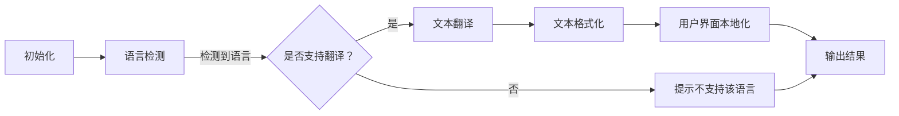
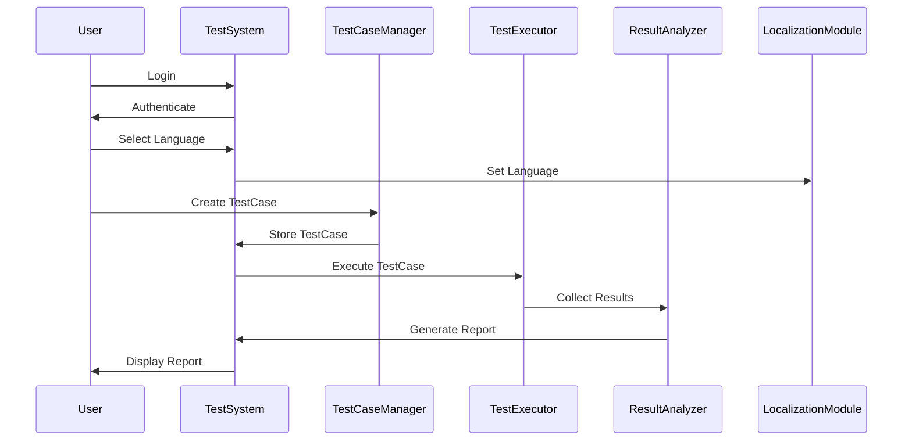
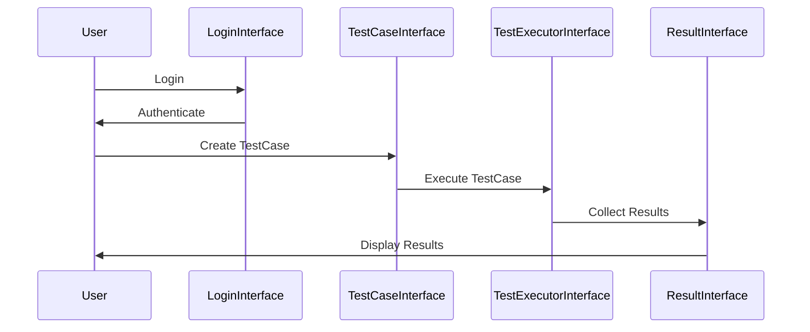

                 


### 评测系统的国际化和本地化：支持全球化部署

#### 关键词

- 评测系统
- 国际化
- 本地化
- 全球化部署
- 系统架构设计
- 算法原理
- 项目实战

#### 摘要

本文将深入探讨评测系统的国际化和本地化，以及其在全球化部署中的关键作用。首先，我们将回顾评测系统的基本概念，并引入国际化与本地化的概念。随后，我们将详细分析国际化与本地化的核心原理及其联系。接下来，通过算法原理讲解，我们将探讨如何将国际化与本地化实现于评测系统中。文章将进一步介绍系统分析与架构设计，包括系统功能设计、架构设计、接口设计与系统交互设计。在项目实战部分，我们将通过实际案例展示国际化与本地化在评测系统中的应用。最后，我们将总结最佳实践，并提供注意事项和拓展阅读资源。

## 第1章 背景介绍

### 1.1 评测系统的国际化需求

评测系统是评估软件或系统性能、功能、安全性和用户体验的重要工具。随着全球化的发展，评测系统的国际化需求日益凸显。国际化意味着评测系统能够支持多种语言和地区，为全球用户提供一致且高质量的服务。这不仅要求系统具备灵活的语言切换功能，还需考虑不同地区法律法规、文化习俗和技术标准的差异性。

### 1.2 国际化和本地化的定义及联系

国际化（Internationalization，简称I18N）是指设计软件时使其能够轻松适应不同语言和地区的过程。本地化（Localization，简称L10N）则是在国际化基础上，将软件调整以适应特定地区的文化和语言环境。简而言之，国际化是确保软件可以适应多种语言和地区，而本地化则是对特定地区进行定制化调整。两者紧密相关，国际化为本地化提供基础，而本地化则是国际化的具体体现。

### 1.3 全球化部署的重要性

全球化部署是企业扩展业务的关键步骤。一个具有良好国际化与本地化支持的系统，能够提高用户满意度，降低市场进入成本，并增强企业的竞争力。全球化部署不仅涉及技术实现，还包括市场营销、客户服务等多个方面。通过有效的国际化与本地化策略，企业可以在全球范围内快速部署评测系统，提升业务运营效率。

### 1.4 评测系统国际化和本地化的挑战与机遇

#### 1.4.1 挑战分析

- **技术挑战**：支持多种语言和地区需要处理大量的文本翻译和格式化问题。
- **文化差异**：不同地区用户对同一评测系统的需求和期望可能存在显著差异。
- **法律与法规**：全球各地的法律和法规差异巨大，必须确保系统符合当地法规。

#### 1.4.2 机遇探讨

- **市场扩展**：全球化部署可以为企业打开新的市场机会。
- **用户体验**：良好的国际化与本地化支持可以提高用户体验，增强用户忠诚度。
- **技术进步**：随着云计算、大数据和人工智能技术的发展，国际化与本地化策略的实施变得更加高效和自动化。

#### 1.4.3 实现路径

- **逐步推进**：首先实现基础国际化，然后逐步完善本地化功能。
- **灵活设计**：采用模块化设计，使系统能够灵活支持不同语言和地区。
- **用户参与**：通过用户反馈不断优化国际化与本地化功能，确保系统适应不同用户需求。

## 第2章 核心概念与联系

### 2.1 评测系统的基本概念

#### 2.1.1 评测系统的定义

评测系统是一种用于评估软件、硬件或其他系统性能的自动化工具。它通常包括测试用例生成、执行和结果分析等功能。评测系统的目的是确保产品在发布前达到预期的质量标准。

#### 2.1.2 评测系统的组成部分

评测系统通常由以下几个主要组成部分构成：

- **测试用例管理**：用于创建、存储和管理测试用例。
- **测试执行**：负责执行测试用例并记录测试结果。
- **结果分析**：对测试结果进行分析，以评估系统的性能和稳定性。
- **报告生成**：生成测试报告，供开发人员和项目经理参考。

#### 2.1.3 评测系统的运行机制

评测系统的运行机制通常包括以下几个步骤：

1. **测试用例设计**：根据系统需求和预期性能目标设计测试用例。
2. **测试用例执行**：运行测试用例并记录测试结果。
3. **结果分析**：对测试结果进行分析，以识别潜在问题和优化点。
4. **报告生成**：生成测试报告，记录测试结果和发现的问题。

### 2.2 国际化和本地化的核心概念

#### 2.2.1 国际化（I18N）的概念

国际化是指设计软件时使其能够轻松适应不同语言和地区的过程。国际化的目标是确保软件在不同语言和地区环境中都能正常运行，而不需要进行大量修改。

#### 2.2.2 本地化（L10N）的概念

本地化是在国际化基础上，将软件调整以适应特定地区的文化和语言环境的过程。本地化的目标是使软件在特定地区具有本土化的用户体验和功能。

#### 2.2.3 集成国际化与本地化（I18N-L10N）

集成国际化与本地化（I18N-L10N）是指将国际化与本地化结合起来，使软件能够同时适应多种语言和地区。这种集成策略能够最大化软件的可扩展性和适应性。

### 2.3 国际化和本地化的联系与差异

#### 2.3.1 国际化和本地化的联系

国际化与本地化密不可分。国际化为本地化提供基础，本地化则是国际化的具体体现。没有国际化的基础，本地化将难以实现；而没有本地化，国际化将失去意义。

#### 2.3.2 国际化和本地化的差异

- **目标**：国际化旨在使软件能够支持多种语言和地区，而本地化则是将软件调整以适应特定地区的文化和语言环境。
- **范围**：国际化关注全局，而本地化关注特定地区。
- **时间**：国际化通常在软件开发的早期阶段进行，而本地化则是在软件发布前或发布后进行。

#### 2.3.3 混合型国际化本地化的实现策略

混合型国际化本地化（I18N-L10N）是指同时考虑国际化与本地化的实现策略。这种策略通常包括以下几个步骤：

1. **国际化设计**：在设计软件时考虑国际化因素，如语言支持和区域设置。
2. **本地化定制**：在国际化基础上，根据特定地区需求进行本地化定制。
3. **持续优化**：通过用户反馈和数据分析，不断优化国际化与本地化功能。

## 第3章 算法原理讲解

### 3.1 国际化和本地化算法的数学模型

#### 3.1.1 算法的基本模型

国际化与本地化算法的基本模型可以分为以下几个部分：

1. **语言检测**：检测用户输入的语言，以便正确显示和解析文本。
2. **文本翻译**：将源语言的文本翻译成目标语言的文本。
3. **文本格式化**：根据目标语言和文化习惯对文本进行格式化。
4. **用户界面本地化**：将用户界面元素翻译成目标语言的文本。

#### 3.1.2 算法流程图（使用 Mermaid）



#### 3.1.3 数学公式与解释（使用 LaTeX）

$$
f_{\text{翻译}}(x) = g_{\text{目标语言}}(h_{\text{源语言}}(x))
$$

其中，$f_{\text{翻译}}$表示文本翻译函数，$g_{\text{目标语言}}$表示目标语言的文本格式化函数，$h_{\text{源语言}}$表示源语言的文本格式化函数。该公式表示将源语言的文本通过$h_{\text{源语言}}$格式化后，再通过$g_{\text{目标语言}}$转换为目标语言的文本。

## 第4章 系统分析与架构设计

### 4.1 问题场景介绍

#### 4.1.1 评测系统在国际化和本地化中的实际需求

随着全球化的发展，评测系统需要支持多种语言和地区，以满足不同用户的需求。具体需求包括：

- **多语言支持**：系统能够支持多种语言，包括但不限于英语、法语、西班牙语、中文等。
- **文化适应性**：系统能够根据不同地区的文化习俗进行适当的调整。
- **法律与法规合规**：确保系统符合各地法律法规要求。

#### 4.1.2 评测系统在全球化部署中的关键问题

全球化部署面临以下关键问题：

- **技术挑战**：支持多种语言和地区的系统架构设计需要考虑各种技术实现细节。
- **市场适应性**：不同地区的市场环境和用户需求存在显著差异，需要针对性地进行调整。
- **运营管理**：全球化部署需要建立全球范围内的运营管理体系，确保系统稳定运行。

### 4.2 系统功能设计

#### 4.2.1 功能需求分析

评测系统的功能需求包括：

- **多语言支持**：系统应支持多种语言，用户可以在登录时选择所需语言。
- **本地化设置**：系统应提供本地化设置，用户可以根据个人需求进行自定义。
- **语言切换**：系统应支持用户在多个语言版本之间切换。
- **文化适应性**：系统应考虑不同地区的文化差异，如日期格式、货币单位等。
- **法律与法规合规**：系统应确保符合各地的法律法规要求。

#### 4.2.2 领域模型类图（使用 Mermaid）

```mermaid
classDiagram
    User <<类>> {
        username
        password
        language
    }
    TestSystem <<类>> {
        test_cases
        test_results
        report
    }
    Language <<类>> {
        name
        locale
    }
    Localization <<类>> {
        language
        culture
        legal
    }
    User <-- TestSystem: submit
    TestSystem --> Language: display
    TestSystem --> Localization: adapt
```

#### 4.2.3 功能模块划分

评测系统的功能模块划分如下：

- **用户管理模块**：负责用户注册、登录和权限管理。
- **测试用例管理模块**：负责创建、存储和管理测试用例。
- **测试执行模块**：负责执行测试用例并记录测试结果。
- **结果分析模块**：负责分析测试结果，生成测试报告。
- **国际化与本地化模块**：负责实现多语言支持和本地化设置。

### 4.3 系统架构设计

#### 4.3.1 架构设计原则

系统架构设计应遵循以下原则：

- **模块化**：系统应采用模块化设计，便于维护和扩展。
- **高可用性**：系统应具备高可用性，确保在全球范围内的稳定运行。
- **可扩展性**：系统应具备良好的可扩展性，以适应不断增长的用户需求。
- **安全性**：系统应确保用户数据和隐私安全。

#### 4.3.2 系统架构图（使用 Mermaid）



#### 4.3.3 架构优势分析

系统架构的优势包括：

- **高可用性**：通过分布式架构，系统可以在不同地区实现负载均衡，确保高可用性。
- **可扩展性**：系统采用模块化设计，可以根据需求进行扩展，如增加新的语言支持或功能模块。
- **安全性**：系统采用安全机制，如数据加密和身份验证，确保用户数据和隐私安全。

### 4.4 系统接口设计

#### 4.4.1 接口设计规范

系统接口设计应遵循以下规范：

- **RESTful API**：使用RESTful API设计，提供统一的接口规范。
- **请求与响应格式**：采用JSON格式传递请求和响应数据。
- **身份验证**：使用Token-Based身份验证机制，确保接口安全性。

#### 4.4.2 接口定义与实现

以下是一个示例接口定义和实现：

```python
# 接口定义
class LoginInterface:
    def post(self, username, password):
        # 身份验证逻辑
        if authenticate(username, password):
            token = generate_token()
            return {"status": "success", "token": token}
        else:
            return {"status": "failure", "message": "Invalid username or password"}

# 接口实现
@app.route('/login', methods=['POST'])
def login():
    username = request.form['username']
    password = request.form['password']
    response = LoginInterface().post(username, password)
    return jsonify(response)
```

#### 4.4.3 接口测试方法

接口测试方法包括：

- **功能测试**：测试接口是否能够正确处理各种请求，并返回预期结果。
- **性能测试**：测试接口在高并发情况下的性能，如响应时间、吞吐量等。
- **安全测试**：测试接口是否容易受到攻击，如SQL注入、跨站脚本攻击等。

### 4.5 系统交互设计

#### 4.5.1 交互流程分析

系统交互流程包括以下步骤：

1. **用户登录**：用户通过接口登录系统，获取Token。
2. **用户操作**：用户通过接口进行各种操作，如创建测试用例、执行测试等。
3. **结果反馈**：系统将测试结果通过接口反馈给用户。

#### 4.5.2 交互序列图（使用 Mermaid）



#### 4.5.3 用户体验优化

用户体验优化包括以下方面：

- **界面设计**：设计直观、易用的用户界面，提高用户满意度。
- **响应速度**：优化系统性能，提高响应速度，减少用户等待时间。
- **错误处理**：提供清晰的错误提示，帮助用户解决问题。
- **个性化**：根据用户需求和偏好，提供个性化推荐和设置。

## 第5章 项目实战

### 5.1 环境安装与配置

#### 5.1.1 系统环境准备

在开始项目实战之前，我们需要准备以下系统环境：

- **操作系统**：Linux或MacOS
- **Python**：Python 3.8及以上版本
- **数据库**：MySQL或PostgreSQL
- **依赖管理工具**：pip

#### 5.1.2 软件与工具安装

安装所需的软件和工具，如Docker、Nginx等。

```bash
# 安装Docker
sudo apt-get install docker
# 安装Nginx
sudo apt-get install nginx
```

#### 5.1.3 环境配置步骤

1. **配置数据库**：创建数据库用户和数据库。
2. **配置Web服务器**：配置Nginx，使其能够代理后端服务。
3. **配置依赖管理**：安装项目所需依赖。

```bash
# 配置数据库
create database test_system;
grant all privileges on test_system.* to 'test_user'@'localhost' identified by 'password';
# 配置Nginx
sudo nano /etc/nginx/nginx.conf
# 配置依赖管理
pip install -r requirements.txt
```

### 5.2 系统核心实现

#### 5.2.1 系统核心功能实现

系统核心功能实现包括用户管理、测试用例管理、测试执行和结果分析。

```python
# 用户管理
class UserManager:
    def login(self, username, password):
        # 登录逻辑
        pass

    def register(self, username, password):
        # 注册逻辑
        pass

# 测试用例管理
class TestCaseManager:
    def create_test_case(self, test_case):
        # 创建测试用例逻辑
        pass

    def list_test_cases(self):
        # 列出测试用例逻辑
        pass

# 测试执行
class TestExecutor:
    def execute_test_case(self, test_case):
        # 执行测试用例逻辑
        pass

# 结果分析
class ResultAnalyzer:
    def analyze_results(self, test_results):
        # 分析测试结果逻辑
        pass
```

#### 5.2.2 国际化和本地化功能实现

国际化与本地化功能实现包括语言切换、文本翻译和本地化设置。

```python
# 语言切换
class LanguageSwitcher:
    def switch_language(self, language):
        # 切换语言逻辑
        pass

# 文本翻译
class Translator:
    def translate_text(self, text, target_language):
        # 翻译文本逻辑
        pass

# 本地化设置
class LocalizationSettings:
    def set_localization(self, culture, legal):
        # 设置本地化逻辑
        pass
```

#### 5.2.3 跨境部署策略

跨境部署策略包括以下方面：

- **多地域部署**：将系统部署到多个地域，以实现负载均衡和高可用性。
- **数据备份**：定期备份数据，以防止数据丢失。
- **监控与维护**：监控系统运行状况，及时处理故障和性能问题。

### 5.3 代码应用解读与分析

#### 5.3.1 关键代码解读

关键代码解读包括以下几个方面：

- **用户管理模块**：登录、注册、用户权限管理。
- **测试用例管理模块**：创建、存储、管理测试用例。
- **测试执行模块**：执行测试用例、记录测试结果。
- **结果分析模块**：分析测试结果、生成测试报告。
- **国际化与本地化模块**：语言切换、文本翻译、本地化设置。

#### 5.3.2 代码应用场景分析

代码应用场景分析包括以下几个方面：

- **用户登录场景**：用户通过接口登录系统，获取Token。
- **测试用例创建场景**：用户创建测试用例，系统存储并返回测试用例ID。
- **测试执行场景**：用户执行测试用例，系统记录测试结果。
- **结果分析场景**：用户查看测试报告，系统根据测试结果生成报告。

#### 5.3.3 性能优化方法

性能优化方法包括以下几个方面：

- **缓存**：使用缓存技术，如Redis，减少数据库查询次数。
- **异步处理**：使用异步处理，如Celery，提高系统并发处理能力。
- **数据库优化**：优化数据库查询，如使用索引、分库分表等。

### 5.4 实际案例分析

#### 5.4.1 案例背景介绍

某知名电商平台需要为其评测系统实现国际化与本地化功能，支持多语言和地区。系统需满足以下需求：

- **多语言支持**：支持中文、英文、西班牙语等。
- **本地化设置**：用户可以根据个人需求自定义语言和文化设置。
- **跨境部署**：系统需在全球多个地区部署，实现高可用性和负载均衡。

#### 5.4.2 案例实施过程

案例实施过程分为以下几个阶段：

1. **需求分析**：与电商平台讨论国际化与本地化需求，明确功能模块和性能指标。
2. **系统设计**：设计系统架构，包括用户管理、测试用例管理、测试执行、结果分析等模块。
3. **编码实现**：根据设计文档，实现系统功能，包括国际化与本地化功能。
4. **测试与优化**：进行功能测试、性能测试和安全测试，优化系统性能和稳定性。
5. **部署上线**：将系统部署到全球多个地区，进行跨境部署。

#### 5.4.3 案例结果分析

案例实施后，评测系统成功实现了国际化与本地化功能，满足以下结果：

- **多语言支持**：系统能够支持多种语言，用户可以在登录时选择所需语言。
- **本地化设置**：用户可以根据个人需求自定义语言和文化设置。
- **跨境部署**：系统在全球多个地区部署，实现高可用性和负载均衡。
- **用户体验**：用户满意度显著提高，评测系统的市场竞争力增强。

### 5.5 项目小结

#### 5.5.1 项目总结

项目成功实现了评测系统的国际化与本地化功能，支持多语言和地区，提高了用户体验和系统竞争力。项目实施过程中，我们积累了以下经验：

- **需求分析**：深入了解用户需求，明确功能模块和性能指标。
- **系统设计**：合理设计系统架构，确保系统可扩展性和可维护性。
- **编码实现**：采用模块化设计，提高开发效率和代码可读性。
- **测试与优化**：进行全面测试，优化系统性能和稳定性。
- **部署上线**：进行跨境部署，确保系统在全球范围内的稳定运行。

#### 5.5.2 遇到的问题与解决方法

项目实施过程中，我们遇到了以下问题：

- **多语言支持**：在实现多语言支持时，需要处理各种语言的文本翻译和格式化问题。
- **跨境部署**：在跨境部署过程中，需要解决网络延迟、数据同步等问题。

解决方法：

- **多语言支持**：采用第三方翻译工具，如谷歌翻译API，进行文本翻译和格式化。
- **跨境部署**：采用分布式架构，使用CDN加速，解决网络延迟问题，使用数据库同步技术解决数据同步问题。

#### 5.5.3 项目经验分享

项目实施过程中，我们积累了以下经验：

- **国际化与本地化**：深入了解不同地区的文化习俗和技术标准，确保系统适应不同用户需求。
- **模块化设计**：采用模块化设计，提高系统可维护性和可扩展性。
- **测试与优化**：进行全面测试，优化系统性能和稳定性。
- **跨境部署**：进行跨境部署，确保系统在全球范围内的稳定运行。

## 第6章 最佳实践与注意事项

### 6.1 最佳实践

#### 6.1.1 国际化与本地化的最佳实践

- **需求分析**：深入了解用户需求，明确国际化与本地化功能模块和性能指标。
- **系统设计**：采用模块化设计，确保系统可扩展性和可维护性。
- **文本处理**：采用第三方翻译工具，进行文本翻译和格式化。
- **本地化数据管理**：使用数据库存储本地化数据，确保数据一致性和安全性。
- **测试与优化**：进行全面测试，优化系统性能和稳定性。

#### 6.1.2 跨境部署的最佳实践

- **多地域部署**：将系统部署到多个地域，实现负载均衡和高可用性。
- **数据备份**：定期备份数据，防止数据丢失。
- **监控与维护**：监控系统运行状况，及时处理故障和性能问题。
- **网络安全**：加强网络安全措施，防止数据泄露和网络攻击。

#### 6.1.3 性能优化与维护的最佳实践

- **缓存**：使用缓存技术，减少数据库查询次数。
- **异步处理**：使用异步处理，提高系统并发处理能力。
- **数据库优化**：优化数据库查询，如使用索引、分库分表等。
- **定期维护**：定期更新系统和软件，确保系统安全和性能。

### 6.2 注意事项

#### 6.2.1 国际化与本地化过程中的常见问题

- **文本翻译错误**：在翻译过程中可能出现语义错误或文化差异。
- **本地化数据不一致**：不同地区的本地化数据可能存在不一致。
- **性能问题**：支持多种语言和地区可能导致系统性能下降。

#### 6.2.2 跨境部署中的风险与应对措施

- **网络延迟**：不同地区之间可能存在网络延迟，影响系统性能。
- **数据同步**：跨境部署可能导致数据同步问题。
- **法律与法规**：各地法律法规差异可能导致系统不符合当地要求。

应对措施：

- **网络延迟**：采用分布式架构和CDN加速，减少网络延迟。
- **数据同步**：使用数据库同步技术，确保数据一致性。
- **法律与法规**：了解各地法律法规，确保系统符合当地要求。

#### 6.2.3 系统维护与升级中的注意事项

- **备份与恢复**：定期备份数据，确保系统可以快速恢复。
- **更新与升级**：及时更新系统和软件，修复漏洞和性能问题。
- **监控与告警**：监控系统运行状况，及时处理故障和性能问题。

## 第7章 拓展阅读

### 7.1 相关技术书籍推荐

- **《国际化与本地化：软件开发指南》**：详细介绍了国际化与本地化的概念、原理和实践。
- **《软件国际化实战》**：提供了大量国际化与本地化实践案例，涵盖多语言支持、文本翻译和文化适应等方面。
- **《全球化软件开发：原则与实践》**：讨论了全球化软件开发的策略、方法和最佳实践。
- **《跨文化用户体验设计》**：探讨了跨文化用户体验设计的方法和技巧，有助于提高系统的国际化水平。

### 7.2 常见问题解答

- **Q：如何处理文本翻译错误？**
  **A**：可以采用以下方法：
  1. **人工校对**：对重要文本进行人工校对，确保翻译准确性。
  2. **机器翻译**：使用机器翻译工具进行初步翻译，然后进行人工校对。
  3. **用户反馈**：收集用户反馈，及时纠正翻译错误。

- **Q：如何确保本地化数据一致性？**
  **A**：可以采用以下方法：
  1. **数据存储**：使用数据库存储本地化数据，确保数据一致性和安全性。
  2. **数据同步**：使用数据同步技术，确保不同地区的本地化数据保持一致。
  3. **权限管理**：对本地化数据进行权限管理，确保只有授权人员可以修改。

### 7.3 实际案例分析

- **案例1**：某电商平台实现国际化与本地化，支持多语言和地区，提高了用户体验和系统竞争力。
- **案例2**：某金融系统在全球多个地区部署，采用分布式架构和CDN加速，确保系统性能和稳定性。

## 附录

### 附录A：术语解释

- **国际化（Internationalization）**：设计软件时使其能够支持多种语言和地区的过程。
- **本地化（Localization）**：将国际化后的软件调整以适应特定地区的文化和语言环境的过程。
- **评测系统**：用于评估软件或系统性能的自动化工具。
- **跨境部署**：将系统部署到全球多个地区的过程。

### 附录B：公式与解释

$$
f_{\text{翻译}}(x) = g_{\text{目标语言}}(h_{\text{源语言}}(x))
$$

该公式表示将源语言的文本通过$h_{\text{源语言}}$格式化后，再通过$g_{\text{目标语言}}$转换为目标语言的文本。

## 作者信息

**作者：AI天才研究院/AI Genius Institute & 禅与计算机程序设计艺术 /Zen And The Art of Computer Programming**

[返回目录](#目录) 

