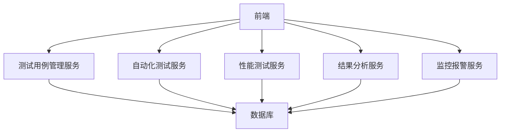

                 

----------------------------------------------------------------
# 第一部分: 引言

## 第1章: 评测系统的多云部署概述

### 1.1 评测系统的概念与作用

#### 1.1.1 评测系统的定义

评测系统是一种用于评估、测试、验证和监控软件、硬件、系统或服务的工具或平台。它通常包括一系列测试用例、测试工具、评估指标和报告生成功能，可以帮助开发人员、测试人员和质量保证团队确保产品的质量、性能和可靠性。

#### 1.1.2 评测系统在现代IT环境中的重要性

随着云计算和大数据技术的发展，现代IT环境变得越来越复杂。评测系统在这个过程中发挥着至关重要的作用。它可以：
- 提高开发效率：通过自动化测试和监控，减少手动测试的工作量，提高开发流程的效率。
- 提升产品质量：通过持续集成和持续交付，及时发现和修复问题，确保产品质量。
- 降低成本：通过优化资源使用和减少故障时间，降低运维成本。

#### 1.1.3 云计算与多云部署的基本概念

云计算是一种通过互联网提供计算资源、存储、网络和其他服务的计算模型。它使得企业可以根据需求灵活地扩展或缩减资源，提高资源利用率。

多云部署是指在一个组织内部，同时使用两个或两个以上的云服务提供商来托管、部署和管理应用程序和数据。它可以提供：
- 更高的可用性：通过使用多个云服务提供商，可以在某个云服务提供商发生故障时，快速切换到另一个云服务提供商，确保业务的连续性。
- 更好的性能：可以根据应用程序的需求，选择最适合的云服务提供商和地理位置，提高应用程序的性能。
- 更好的成本效益：可以根据应用程序的使用情况，灵活选择云服务提供商，优化成本。

### 1.2 多云部署的优势与挑战

#### 1.2.1 多云部署的优势

- **提高灵活性**：可以根据业务需求，选择最适合的云服务提供商和地理位置。
- **提高可靠性**：通过使用多个云服务提供商，可以在某个云服务提供商发生故障时，快速切换到另一个云服务提供商。
- **优化成本**：可以根据应用程序的使用情况，灵活选择云服务提供商，降低成本。

#### 1.2.2 多云部署面临的挑战

- **复杂性**：需要管理多个云服务提供商，涉及到不同平台、工具和技术。
- **安全性**：需要确保数据的安全和合规性。
- **成本管理**：需要合理规划和管理云资源的消耗，避免不必要的成本。

#### 1.2.3 多云部署策略的选择

- **混合云**：将公有云和私有云结合起来，利用公有云的灵活性，同时保持私有云的控制性。
- **多公有云**：同时使用两个或两个以上的公有云服务提供商，提高可靠性和性能。
- **多私有云**：在组织内部部署多个私有云，提高灵活性和可靠性。

### 1.3 本书结构与内容安排

#### 1.3.1 本书的核心目标

本书旨在系统地介绍评测系统的多云部署与管理，帮助读者了解多云部署的基本概念、技术基础、部署实践和监控优化策略。

#### 1.3.2 内容安排与章节划分

本书分为四个部分，共六个章节。第一部分是引言，介绍评测系统的概念和多云部署的基本概念。第二部分是多云部署技术基础，介绍云服务提供商及其服务、多云环境管理。第三部分是评测系统在多云环境中的部署，包括设计与规划、部署实践和监控优化。第四部分是总结和展望，对本书的内容进行总结，并提出未来的研究方向。

#### 1.3.3 阅读建议与预期收获

本书适合云计算和评测系统领域的开发人员、测试人员和技术管理人员阅读。通过本书的学习，读者可以：
- 掌握多云部署的基本概念和策略。
- 学会评测系统的设计与规划。
- 了解评测系统在多云环境中的部署与监控优化。
- 提高在云计算环境下的系统设计和部署能力。

### 1.4 本章小结

本章介绍了评测系统的概念、作用和多云部署的基本概念，以及多云部署的优势和挑战。通过本章的学习，读者可以对评测系统和多云部署有一个初步的了解，为后续章节的学习打下基础。

----------------------------------------------------------------
## 第二部分: 多云部署技术基础

### 第2章: 云服务提供商及其服务

### 2.1 主要云服务提供商概述

#### 2.1.1 AWS

亚马逊网络服务（Amazon Web Services，简称AWS）是当前全球最大的云服务提供商之一。它提供了广泛的云服务，包括计算、存储、数据库、网络、机器学习、人工智能等。AWS的优点包括：

- **广泛的服务**：提供了几乎所有的云服务。
- **强大的生态系统**：拥有大量的合作伙伴和开发者社区。
- **全球覆盖**：在全球多个地区拥有数据中心。

#### 2.1.2 Azure

微软的Azure也是全球领先的云服务提供商之一。它提供了与AWS类似的服务，并且在某些方面具有独特的优势，如集成Microsoft 365和Azure Active Directory。Azure的优点包括：

- **与Microsoft生态系统的深度集成**。
- **强大的混合云能力**。
- **丰富的AI和机器学习服务**。

#### 2.1.3 Google Cloud Platform

谷歌的Google Cloud Platform（GCP）提供了强大的云服务，包括计算、存储、数据库、机器学习、人工智能等。GCP的优点包括：

- **强大的AI和机器学习能力**。
- **优秀的网络性能**。
- **创新的数据库服务**。

### 2.2 云服务类型

#### 2.2.1 IaaS、PaaS和SaaS

云服务主要可以分为三类：基础设施即服务（IaaS）、平台即服务（PaaS）和软件即服务（SaaS）。

- **IaaS**：提供虚拟化的计算资源，如虚拟机、存储和网络。用户可以根据需要配置和管理这些资源。优点是灵活性高，但需要用户具备一定的技术能力。
- **PaaS**：提供了一个开发平台，包括应用程序运行环境、数据库、Web服务器等。用户可以专注于应用程序的开发，无需管理底层基础设施。优点是开发效率高，但灵活性相对较低。
- **SaaS**：提供了一个完整的软件应用，用户可以直接使用，无需关心底层基础设施。优点是使用方便，但灵活性最低。

#### 2.2.2 不同服务类型的适用场景

- **IaaS**：适用于需要高度定制化、灵活的IT环境，如开发测试环境、大数据处理等。
- **PaaS**：适用于需要快速开发、部署和管理应用程序的场景，如Web应用、移动应用等。
- **SaaS**：适用于需要直接使用软件应用的场景，如办公软件、客户关系管理软件等。

#### 2.2.3 服务对比与选择

在选择云服务时，需要根据业务需求、技术能力、成本等因素进行综合考虑。以下是一个简单的对比：

| 服务类型 | 优点 | 缺点 | 适用场景 |
| --- | --- | --- | --- |
| IaaS | 灵活性高，可控性强 | 需要用户具备较高技术能力 | 开发测试环境、大数据处理 |
| PaaS | 开发效率高，管理简单 | 灵活性相对较低 | Web应用、移动应用开发 |
| SaaS | 使用方便，无需管理基础设施 | 灵活性最低，定制化程度低 | 办公软件、客户关系管理 |

### 2.3 多云环境管理

#### 2.3.1 多云环境管理的重要性

多云环境管理涉及到多个云服务提供商、多个云平台和多个应用程序的管理。有效的多云环境管理可以帮助企业：

- **提高效率**：通过自动化和标准化管理流程，提高运维效率。
- **降低成本**：通过合理的资源分配和优化，降低运维成本。
- **确保安全性**：通过统一的安全策略和监控，确保数据安全和合规性。

#### 2.3.2 多云管理工具介绍

常见的多云管理工具包括：

- **AWS CloudFormation**：用于创建和管理AWS资源。
- **Azure Resource Manager**：用于创建和管理Azure资源。
- **Google Cloud Deployment Manager**：用于创建和管理GCP资源。
- **HashiCorp Terraform**：用于创建和管理多个云平台的资源。

#### 2.3.3 多云策略的制定与实施

制定和实施多云策略的步骤包括：

1. **需求分析**：分析业务需求，确定需要使用哪些云服务提供商和哪些服务。
2. **资源规划**：根据业务需求，规划需要使用的云资源。
3. **环境搭建**：搭建多云环境，包括选择云服务提供商、配置云资源等。
4. **管理策略制定**：制定多云环境的管理策略，包括资源管理、安全管理、监控管理等。
5. **实施与优化**：实施多云策略，并根据业务需求进行优化。

### 2.4 本章小结

本章介绍了主要云服务提供商及其服务、云服务类型、多云环境管理的重要性以及多云策略的制定与实施。通过本章的学习，读者可以了解多云部署的基本技术基础，为后续章节的学习打下基础。

----------------------------------------------------------------
## 第三部分: 评测系统在多云环境中的部署

### 第3章: 评测系统的设计与规划

### 3.1 评测系统的需求分析

#### 3.1.1 评测系统的功能需求

评测系统的功能需求主要包括：

- **测试用例管理**：支持创建、管理、执行和查看测试用例。
- **自动化测试**：支持自动化测试脚本的编写和执行。
- **性能测试**：支持对系统性能的测试，包括响应时间、吞吐量、并发用户数等。
- **结果分析**：支持测试结果的统计分析，生成测试报告。
- **监控与报警**：支持对系统运行状态的监控，当系统出现异常时发送报警。

#### 3.1.2 性能与可靠性需求

评测系统的性能和可靠性需求主要包括：

- **高并发**：能够支持大量的并发测试，确保测试的准确性。
- **低延迟**：确保测试数据的处理和传输延迟低，保证测试结果的及时性。
- **高可用性**：系统应具有高可用性，确保在硬件故障、网络中断等情况下，系统的正常运行。

#### 3.1.3 安全性需求

评测系统的安全性需求主要包括：

- **数据安全**：确保测试数据和用户数据的安全，防止数据泄露。
- **访问控制**：确保只有授权用户才能访问系统。
- **安全审计**：记录系统操作日志，便于进行安全审计。

### 3.2 评测系统的架构设计

#### 3.2.1 系统架构的总体设计

评测系统的架构设计采用微服务架构，将系统划分为多个微服务，每个微服务负责一个特定的功能模块。系统架构的总体设计如下：

- **前端**：包括用户界面和交互逻辑，负责与用户进行交互。
- **后端**：包括多个微服务，分别负责测试用例管理、自动化测试、性能测试、结果分析和监控报警等功能。
- **数据库**：存储测试数据、用户数据和系统配置信息。
- **缓存**：提高数据访问速度，减轻数据库负载。
- **消息队列**：用于异步处理任务，提高系统的响应速度和稳定性。

#### 3.2.2 架构设计的关键要素

架构设计的关键要素包括：

- **模块化**：将系统功能划分为多个模块，每个模块独立开发、部署和维护。
- **松耦合**：模块之间通过接口进行通信，降低模块之间的依赖性。
- **高可用性**：通过冗余设计和故障转移机制，确保系统的高可用性。
- **可扩展性**：通过水平扩展和垂直扩展，支持系统的扩展。

#### 3.2.3 架构设计示例

以下是一个简单的评测系统架构设计示例：

### 3.3 系统规划与资源分配

#### 3.3.1 资源规划的重要性

资源规划是确保评测系统能够高效、稳定运行的关键。它包括对计算资源、存储资源、网络资源等的需求分析、分配和优化。

#### 3.3.2 资源需求预测

资源需求预测包括：

- **计算资源**：根据系统的并发用户数、测试用例数量和执行时间，预测所需的计算资源。
- **存储资源**：根据测试数据的大小、存储时间等因素，预测所需的存储资源。
- **网络资源**：根据系统的数据传输量、网络带宽等因素，预测所需的网络资源。

#### 3.3.3 资源分配策略

资源分配策略包括：

- **按需分配**：根据实际需求动态分配资源。
- **预留资源**：为未来的需求预留一定量的资源。
- **负载均衡**：通过负载均衡技术，合理分配资源，提高系统的整体性能。

### 3.4 本章小结

本章介绍了评测系统的需求分析、架构设计和资源规划与资源分配。通过本章的学习，读者可以了解评测系统的设计与规划的基本方法和步骤，为后续章节的部署和监控优化打下基础。

----------------------------------------------------------------
## 第四部分: 多云部署实践

### 第4章: 云服务提供商选择与评估

#### 4.1 云服务提供商选择标准

在选择云服务提供商时，需要考虑以下标准：

##### 4.1.1 可用性与可靠性

- **数据中心地理位置**：确保数据中心地理位置满足业务需求，如接近用户、业务伙伴或合作伙伴。
- **服务等级协议（SLA）**：查看SLA中关于可用性、故障恢复时间、响应时间等方面的条款。

##### 4.1.2 成本效益

- **定价策略**：了解不同服务提供商的定价策略，选择性价比高的服务。
- **成本结构**：考虑长期成本，包括初始成本、维护成本、扩展成本等。

##### 4.1.3 安全性与合规性

- **安全措施**：了解服务提供商的安全措施，如数据加密、防火墙、入侵检测等。
- **合规性**：确保服务提供商符合相关行业和地区的法规要求。

#### 4.2 评估方法与工具

##### 4.2.1 评估指标体系

评估指标体系包括：

- **性能**：包括响应时间、吞吐量、并发用户数等。
- **可靠性**：包括可用性、故障恢复时间、故障率等。
- **安全性**：包括数据加密、访问控制、安全审计等。
- **成本**：包括初始成本、维护成本、扩展成本等。

##### 4.2.2 评估流程与方法

评估流程包括：

1. **需求分析**：分析业务需求，确定评估指标。
2. **信息收集**：收集各云服务提供商的相关信息。
3. **评估指标量化**：将评估指标量化，以便进行比较。
4. **评估结果分析**：分析评估结果，选择最优的云服务提供商。

##### 4.2.3 常见评估工具介绍

常见的评估工具包括：

- **AWS Well-Architected Tool**：用于评估AWS架构的健壮性。
- **Azure Well-Architected Framework**：用于评估Azure架构的健壮性。
- **Google Cloud Well-Architected Tool**：用于评估GCP架构的健壮性。
- **CloudCheckr**：用于评估云资源的使用情况和成本。

#### 4.3 云服务提供商选择案例

##### 4.3.1 案例背景

某公司计划将其评测系统部署到云环境中，以提高系统的可用性、可靠性和性能。公司需要选择一个合适的云服务提供商。

##### 4.3.2 选择过程

选择过程包括以下步骤：

1. **需求分析**：确定评测系统的功能需求、性能需求和安全需求。
2. **信息收集**：收集AWS、Azure、GCP的相关信息，包括服务、价格、安全措施等。
3. **评估指标量化**：将评估指标量化，如响应时间、故障恢复时间等。
4. **评估结果分析**：比较各云服务提供商的评估结果，选择最优的提供商。

##### 4.3.3 选择结果与分析

最终，公司选择了GCP作为评测系统的云服务提供商，原因如下：

- **性能**：GCP在响应时间和吞吐量方面表现优异。
- **可靠性**：GCP的可用性和故障恢复时间较高。
- **安全性与合规性**：GCP提供了强大的安全措施，符合相关法规要求。
- **成本**：GCP的定价策略较为合理。

### 4.4 本章小结

本章介绍了云服务提供商选择的标准、评估方法与工具以及一个选择案例。通过本章的学习，读者可以了解如何选择合适的云服务提供商，为后续章节的部署和监控优化提供参考。

----------------------------------------------------------------
### 第5章: 评测系统在多云环境中的部署与配置

#### 5.1 部署前准备

部署前准备是确保评测系统成功部署的关键步骤。以下是一些重要的部署前准备工作：

##### 5.1.1 环境准备

环境准备包括：

- **云服务提供商选择**：根据上一章节的选择结果，确定使用的云服务提供商。
- **账户创建**：创建必要的云服务账户和用户。
- **资源配置**：根据评测系统的需求，配置所需的云资源，如虚拟机、存储、网络等。
- **网络配置**：配置云服务提供商的网络，如虚拟私有云（VPC）、子网、路由器等。

##### 5.1.2 配置管理

配置管理是确保评测系统稳定运行的重要环节。以下是一些配置管理的准备工作：

- **配置管理工具选择**：选择适合的配置管理工具，如AWS CloudFormation、Azure Resource Manager、Google Cloud Deployment Manager等。
- **基础设施模板**：创建基础设施模板，包括虚拟机、存储、网络等配置。
- **应用程序模板**：创建应用程序模板，包括应用程序的依赖项、配置文件等。

##### 5.1.3 部署策略制定

部署策略制定是确保评测系统高效、稳定部署的关键。以下是一些常见的部署策略：

- **一次性部署**：将所有组件一次性部署到目标环境中。
- **分阶段部署**：将系统分为多个阶段，逐步部署到目标环境中。
- **蓝绿部署**：同时运行两个相同的版本，逐步切换流量，确保新版本的正确性。
- **灰度部署**：将新版本部署到一部分用户，观察其性能和稳定性，逐步扩大部署范围。

#### 5.2 部署过程

部署过程是将评测系统从开发环境迁移到生产环境的过程。以下是一些关键的部署步骤：

##### 5.2.1 部署工具选择

部署工具的选择取决于云服务提供商和部署策略。以下是一些常见的部署工具：

- **AWS CodePipeline**：用于自动化代码部署。
- **Azure DevOps**：用于自动化代码部署和持续集成。
- **Google Cloud Build**：用于自动化代码部署和持续集成。

##### 5.2.2 自动化部署流程

自动化部署流程可以提高部署的效率和稳定性。以下是一个简单的自动化部署流程：

1. **代码提交**：将代码提交到版本控制系统中。
2. **构建**：构建应用程序和依赖项。
3. **测试**：对构建的应用程序进行测试。
4. **部署**：将测试通过的应用程序部署到目标环境中。

##### 5.2.3 部署验证与测试

部署验证与测试是确保评测系统正确部署的重要环节。以下是一些常见的验证与测试方法：

- **功能测试**：验证评测系统的功能是否正确。
- **性能测试**：验证评测系统的性能是否满足需求。
- **安全测试**：验证评测系统的安全性，确保没有安全漏洞。

#### 5.3 配置管理

配置管理是确保评测系统在多云环境中稳定运行的关键。以下是一些配置管理的方法：

##### 5.3.1 配置管理的重要性

配置管理的重要性包括：

- **保持系统一致性**：确保所有环境中的系统配置一致。
- **提高可维护性**：方便系统的维护和升级。
- **降低故障风险**：通过标准化和自动化，降低人为错误导致故障的风险。

##### 5.3.2 配置管理工具与策略

常见的配置管理工具有：

- **AWS CloudFormation**：用于创建和管理AWS资源。
- **Azure Resource Manager**：用于创建和管理Azure资源。
- **Google Cloud Deployment Manager**：用于创建和管理GCP资源。

配置管理策略包括：

- **基础设施即代码**：将基础设施的配置信息编码为代码，方便管理和变更。
- **持续集成与持续部署**：通过自动化流程，确保代码的变更及时部署到生产环境。
- **版本控制**：对配置文件进行版本控制，确保变更的可追溯性和可回滚性。

##### 5.3.3 配置管理实践

配置管理实践包括：

1. **配置文件管理**：将配置文件存储在版本控制系统中，确保变更的可追溯性。
2. **自动化部署**：使用配置管理工具，自动化部署过程，减少人为干预。
3. **监控与报警**：监控配置变更，当配置发生错误时，及时报警。

### 5.4 本章小结

本章介绍了评测系统在多云环境中的部署前准备、部署过程和配置管理。通过本章的学习，读者可以了解如何成功部署和配置评测系统，为后续章节的监控与优化打下基础。

----------------------------------------------------------------
## 第6章: 评测系统的监控与优化

### 6.1 监控的重要性

在多云环境中，对评测系统的监控至关重要。监控不仅可以确保系统的稳定运行，还可以提高系统的性能和可靠性。以下是一些监控的重要性：

#### 6.1.1 监控目标与指标

监控目标通常包括：

- **性能指标**：如响应时间、吞吐量、并发用户数等。
- **资源指标**：如CPU使用率、内存使用率、磁盘I/O等。
- **错误率**：如系统错误率、应用错误率等。
- **健康指标**：如系统健康状况、服务状态等。

#### 6.1.2 监控体系的设计

监控体系的设计需要考虑以下几个方面：

- **监控范围**：确定需要监控的系统组件和指标。
- **监控工具**：选择适合的监控工具，如Prometheus、Grafana、ELK Stack等。
- **数据存储**：选择合适的数据存储方案，如InfluxDB、Elasticsearch等。
- **报警机制**：设计报警机制，当监控指标超出阈值时，及时通知相关人员。

#### 6.1.3 监控工具的选择

选择监控工具时，需要考虑以下几个方面：

- **功能**：监控工具是否具备所需的监控功能，如性能监控、日志监控、报警等。
- **可扩展性**：监控工具是否支持横向扩展，以适应业务增长。
- **易用性**：监控工具是否易于使用，降低运维成本。
- **集成**：监控工具是否与其他工具和系统集成良好。

### 6.2 监控实施

#### 6.2.1 监控数据的收集与处理

监控数据的收集与处理包括以下步骤：

1. **数据采集**：通过监控工具采集系统性能、资源使用情况等数据。
2. **数据处理**：对采集到的数据进行分析、处理，提取有用的信息。
3. **数据存储**：将处理后的数据存储到数据库或数据仓库中，以便后续分析。

#### 6.2.2 监控数据的可视化

监控数据的可视化是将监控数据以图表、仪表板等形式展示出来，使运维人员能够直观地了解系统的运行状况。以下是一些常见的可视化工具：

- **Grafana**：用于构建监控仪表板。
- **Kibana**：与Elasticsearch集成，用于数据可视化。
- **Power BI**：用于数据分析和可视化。

#### 6.2.3 监控策略的制定与实施

监控策略的制定与实施包括以下步骤：

1. **确定监控目标**：明确需要监控的系统组件和指标。
2. **设定阈值**：根据业务需求和性能要求，设定监控指标的阈值。
3. **配置监控规则**：在监控工具中配置监控规则，当指标超过阈值时，触发报警。
4. **测试与优化**：测试监控策略的有效性，根据实际情况进行优化。

### 6.3 优化策略

#### 6.3.1 性能优化方法

性能优化方法包括：

- **代码优化**：优化应用程序的代码，提高执行效率。
- **缓存策略**：使用缓存减少数据库的访问次数。
- **负载均衡**：通过负载均衡器合理分配流量，提高系统的处理能力。
- **数据库优化**：优化数据库的查询语句、索引、存储引擎等。

#### 6.3.2 负载均衡

负载均衡是将流量分配到多个服务器，提高系统的处理能力。以下是一些常见的负载均衡方法：

- **轮询**：将流量按顺序分配到各个服务器。
- **最小连接数**：将流量分配到连接数最少的服务器。
- **响应时间**：将流量分配到响应时间最短的服务器。

#### 6.3.3 缓存策略

缓存策略是将经常访问的数据存储在内存中，提高系统的响应速度。以下是一些常见的缓存策略：

- **本地缓存**：在应用程序内部使用缓存。
- **分布式缓存**：在多个服务器之间共享缓存。
- **数据库缓存**：在数据库中使用缓存。

### 6.4 本章小结

本章介绍了评测系统的监控与优化的重要性、监控体系的设计与实施、监控工具的选择以及性能优化方法和负载均衡。通过本章的学习，读者可以了解如何对评测系统进行有效的监控与优化，提高系统的性能和可靠性。

----------------------------------------------------------------
## 总结

随着云计算的普及，多云部署已成为现代IT环境中的一种常见模式。本文从评测系统的角度出发，详细介绍了多云部署的概念、技术基础、部署实践和监控优化。通过本文的学习，读者可以：

1. **理解多云部署的基本概念**：了解多云部署的优势、挑战以及基本策略。
2. **掌握多云部署技术基础**：熟悉主要云服务提供商及其服务、云服务类型和多云环境管理。
3. **掌握评测系统的设计与规划**：了解评测系统的需求分析、架构设计和资源规划。
4. **学会评测系统的部署实践**：掌握评测系统在多云环境中的部署与配置方法。
5. **了解评测系统的监控与优化**：掌握如何对评测系统进行监控和性能优化。

### 小结

多云部署是一个复杂但必要的任务，它要求企业具备较高的技术能力和管理水平。通过本文的学习，读者可以掌握多云部署的关键技术和最佳实践，为企业的数字化转型提供有力支持。

### 注意事项

1. **安全性**：在多云环境中，安全性是至关重要的。确保数据的安全和合规性，使用强密码、加密传输等安全措施。
2. **成本管理**：合理规划和管理云资源的消耗，避免不必要的成本。
3. **监控与优化**：定期对评测系统进行监控和优化，确保其性能和可靠性。

### 拓展阅读

- 《云计算：概念、技术和应用》（张英杰 著）
- 《亚马逊AWS云实践指南》（李峻 著）
- 《Azure云计算实践指南》（吴华 著）

### 作者信息

**作者：AI天才研究院/AI Genius Institute & 禅与计算机程序设计艺术 /Zen And The Art of Computer Programming**

