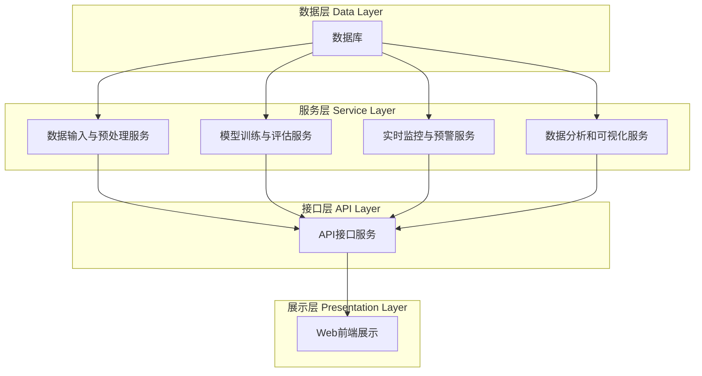
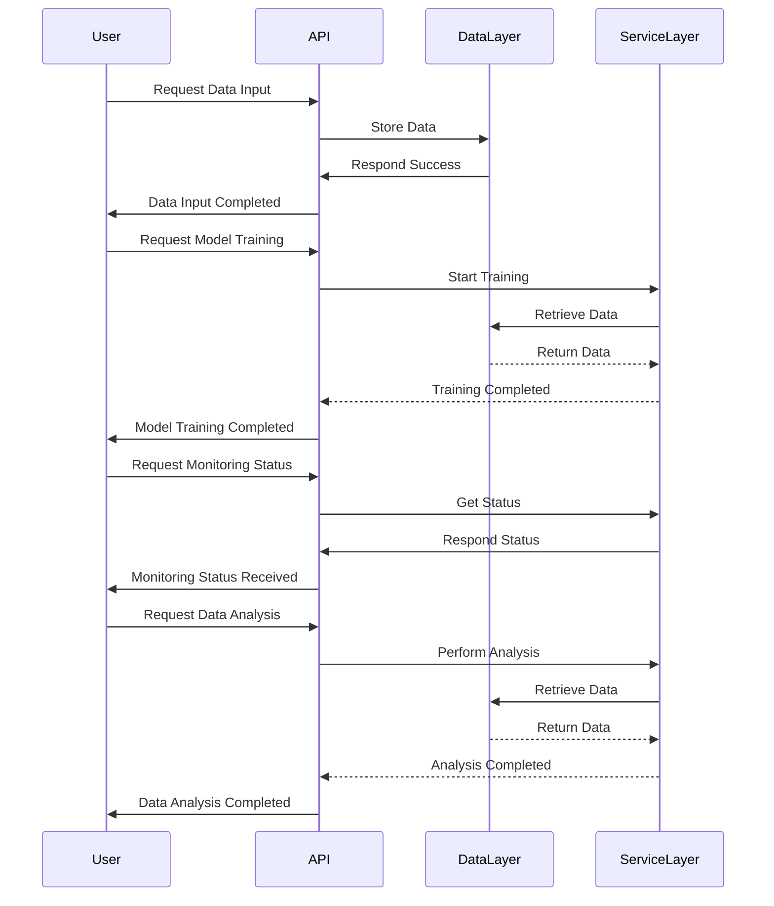

                 

### 文章标题

# 《评测系统的多任务学习框架设计》

### 关键词

- 多任务学习
- 评测系统
- 框架设计
- 算法原理
- 系统架构

### 摘要

本文旨在探讨评测系统中多任务学习框架的设计与实现。首先，我们介绍了多任务学习的背景、定义及其重要性，并对比了多任务学习与单任务学习的差异。接着，我们深入分析了多任务学习的挑战和解决方案，包括任务分配策略、共享网络与独立网络的运用以及损失函数与优化算法。随后，我们展示了多任务学习在自然语言处理、计算机视觉和语音识别等领域的应用。本文的核心部分包括多任务学习中的核心概念、数学模型以及算法流程图，并通过Python源代码实现了算法原理。在此基础上，我们详细介绍了评测系统的需求分析、功能设计、系统架构以及接口设计。最后，通过一个实际项目实战，我们展示了如何构建和部署多任务学习框架，并提供了最佳实践和注意事项，为读者在多任务学习框架设计中的实际应用提供了宝贵的经验和指导。

### 目录大纲

----------------------------------------------------------------

# 《评测系统的多任务学习框架设计》

## 第一部分：问题背景与概念介绍

## 第1章：评测系统的多任务学习基础

### 1.1.1 多任务学习概述
- 问题背景与定义
- 多任务学习的重要性
- 多任务学习与单任务学习对比

### 1.1.2 多任务学习的挑战与解决方案
- 挑战分析
- 解决方案介绍
- 多任务学习的关键技术

### 1.1.3 多任务学习的应用场景
- 自然语言处理
- 计算机视觉
- 语音识别

## 第2章：核心概念与联系

### 2.1.1 多任务学习中的核心概念
- 任务分配策略
- 共享网络与独立网络
- 损失函数与优化算法

### 2.1.2 概念属性特征对比表格
- 表格形式展示各概念属性特征对比

### 2.1.3 多任务学习ER实体关系图架构
- Mermaid流程图展示实体关系

## 第二部分：算法原理与系统架构

## 第3章：多任务学习算法原理

### 3.1.1 多任务学习的数学模型
- 数学公式与模型描述
- 示例解释

### 3.1.2 多任务学习算法流程图
- Mermaid流程图展示算法流程

### 3.1.3 Python源代码实现
- 详细阐述算法原理

## 第4章：系统架构设计

### 4.1.1 问题场景介绍
- 评测系统需求分析

### 4.1.2 系统功能设计
- 领域模型Mermaid类图

### 4.1.3 系统架构设计
- Mermaid架构图

### 4.1.4 系统接口设计
- 接口设计与实现

### 4.1.5 系统交互Mermaid序列图
- Mermaid序列图展示系统交互

## 第三部分：项目实战与最佳实践

## 第5章：项目实战

### 5.1.1 环境安装
- 实战前的环境配置

### 5.1.2 系统核心实现源代码
- 实现多任务学习框架的关键代码

### 5.1.3 代码应用解读与分析
- 代码解读与分析

### 5.1.4 实际案例分析与详细讲解
- 案例分析

### 5.1.5 项目小结
- 项目总结与反思

## 第6章：最佳实践与注意事项

### 6.1.1 最佳实践 tips
- 实践经验分享

### 6.1.2 注意事项
- 实现过程中可能出现的问题及解决方案

### 6.1.3 拓展阅读
- 相关参考资料推荐

## 参考文献

### 6.1.4 参考文献
- 列出本文引用的参考文献

----------------------------------------------------------------

### 引言

在人工智能与机器学习领域，评测系统扮演着至关重要的角色。这些系统不仅用于训练和评估模型的性能，还能提供决策支持、数据分析和反馈循环，从而优化算法和提升用户体验。随着技术的进步和应用的多样性，评测系统面临着越来越复杂的需求。传统的单任务学习模型已经难以满足这些需求，因此，多任务学习（Multi-Task Learning, MTL）框架应运而生。

多任务学习旨在同时解决多个相关任务，通过共享特征表示和网络结构，提高模型的泛化能力和效率。与单任务学习相比，多任务学习不仅能利用任务间的关联性，提高单个任务的性能，还能减少训练时间、参数量和计算资源，从而提升系统的整体性能。

本文将围绕评测系统的多任务学习框架设计进行深入探讨。首先，我们将介绍多任务学习的基础概念，包括其定义、重要性以及与单任务学习的对比。接着，我们将分析多任务学习面临的挑战和解决方案，并探讨其在自然语言处理、计算机视觉和语音识别等领域的应用。随后，本文将详细讲解多任务学习中的核心概念、数学模型以及算法流程图，并通过Python源代码实现来阐述算法原理。在此基础上，我们将介绍评测系统的需求分析、功能设计、系统架构以及接口设计。通过一个实际项目实战，我们将展示如何构建和部署多任务学习框架，并分析实际案例。最后，我们将总结最佳实践和注意事项，为读者在多任务学习框架设计中的实际应用提供指导。

### 第一部分：问题背景与概念介绍

#### 第1章：评测系统的多任务学习基础

### 1.1.1 多任务学习概述

多任务学习（Multi-Task Learning, MTL）是一种机器学习范式，旨在同时解决多个任务。与传统的单任务学习（Single-Task Learning, STL）不同，多任务学习通过共享特征表示和网络结构，将不同任务的信息整合起来，从而提高模型的泛化能力和效率。

#### 问题背景与定义

在现实世界中，许多任务之间存在一定的关联性。例如，在图像识别任务中，图像分类和目标检测是两个相互关联的任务。通过多任务学习，我们可以利用这两个任务之间的关联性，共享特征表示，从而提高每个任务的性能。

多任务学习的定义如下：给定一组相关任务\(T_1, T_2, ..., T_n\)，多任务学习旨在同时训练一个模型，使其能够在各个任务上都能取得较好的性能。

#### 多任务学习的重要性

多任务学习具有以下重要性：

1. **提高任务性能**：通过共享特征表示，多任务学习能够利用任务间的关联性，提高每个任务的性能。
2. **减少训练时间**：多任务学习可以减少模型训练的时间，因为多个任务可以在同一个模型中同时训练。
3. **减少参数量**：多任务学习通过共享网络结构，可以减少模型的参数量，从而降低过拟合的风险。
4. **资源利用率**：多任务学习可以提高计算资源的利用率，因为多个任务可以共享相同的计算资源。

#### 多任务学习与单任务学习对比

单任务学习（STL）和多任务学习（MTL）的主要区别在于任务的处理方式和模型结构。

1. **任务处理方式**：
   - 单任务学习：每个任务单独训练一个模型，这些模型之间没有直接的信息共享。
   - 多任务学习：多个任务在同一个模型中同时训练，任务之间通过共享特征表示和网络结构来传递信息。

2. **模型结构**：
   - 单任务学习：每个模型具有独立的输入层、隐藏层和输出层。
   - 多任务学习：多个任务共享输入层和部分隐藏层，每个任务拥有独立的输出层。

#### 挑战与解决方案

多任务学习虽然具有许多优势，但也面临一些挑战。以下是一些常见的挑战及其解决方案：

1. **任务不平衡**：不同任务的数据量可能存在巨大差异，导致模型在数据量较少的任务上性能较差。
   - 解决方案：采用加权损失函数，根据任务的重要性对损失函数进行加权，以平衡各个任务的贡献。

2. **任务冲突**：不同任务之间可能存在相互干扰，导致模型在解决其中一个任务时，其他任务的性能下降。
   - 解决方案：采用任务分离策略，如独立网络和共享网络相结合的方法，以降低任务冲突。

3. **计算资源限制**：多任务学习需要更多的计算资源，特别是在任务数量较多时。
   - 解决方案：采用分布式计算和并行训练的方法，以提高计算效率。

#### 多任务学习的关键技术

多任务学习涉及多个关键技术，包括任务分配策略、共享网络与独立网络、损失函数与优化算法等。

1. **任务分配策略**：任务分配策略决定了如何将多个任务分配给模型。常见的策略包括基于任务重要性的分配、基于数据量分配等。

2. **共享网络与独立网络**：共享网络与独立网络是多任务学习中的关键结构。共享网络用于处理所有任务中的共性特征，独立网络用于处理各个任务的独特特征。

3. **损失函数与优化算法**：损失函数用于评估模型在每个任务上的性能，优化算法用于调整模型参数，以最小化损失函数。常见的方法包括基于均方误差（MSE）的损失函数和基于梯度下降的优化算法。

#### 多任务学习的应用场景

多任务学习在多个领域都有广泛的应用，以下是一些常见的应用场景：

1. **自然语言处理（NLP）**：多任务学习在NLP领域具有广泛的应用，如文本分类、情感分析、命名实体识别等。

2. **计算机视觉（CV）**：多任务学习在CV领域用于图像分类、目标检测、图像分割等任务。

3. **语音识别（ASR）**：多任务学习在语音识别领域用于语音分类、语音识别、语音增强等任务。

通过以上介绍，我们可以看出，多任务学习在解决复杂任务、提高模型性能方面具有巨大的潜力。在接下来的章节中，我们将进一步探讨多任务学习中的核心概念、算法原理和系统架构，并通过实际项目实战来展示如何设计和实现多任务学习框架。

### 第2章：核心概念与联系

#### 2.1.1 多任务学习中的核心概念

多任务学习涉及多个核心概念，包括任务分配策略、共享网络与独立网络、损失函数与优化算法等。理解这些概念对于设计高效的多任务学习框架至关重要。

**任务分配策略**

任务分配策略决定了如何将多个任务分配给模型。任务分配策略需要考虑任务之间的关联性、数据量以及计算资源等因素。以下是一些常见的任务分配策略：

1. **基于任务重要性的分配**：根据任务的重要性和优先级来分配任务。重要任务会占用更多的计算资源和时间。
2. **基于数据量的分配**：根据每个任务的数据量来分配任务。数据量较大的任务可能会占用更多的计算资源。
3. **动态分配策略**：根据训练过程中的动态变化来调整任务的分配。例如，可以根据任务的性能或者数据量的变化来动态调整任务。

**共享网络与独立网络**

共享网络与独立网络是多任务学习中的关键结构。共享网络用于处理所有任务中的共性特征，独立网络用于处理各个任务的独特特征。

1. **共享网络**：共享网络包含多个任务共用的部分，如输入层、隐藏层等。共享网络能够利用任务间的关联性，提高模型的泛化能力。
2. **独立网络**：独立网络包含每个任务特有的部分，如输出层、分类器等。独立网络能够处理各个任务的独特特征，从而提高任务的性能。

常见的共享网络与独立网络的组合策略包括：

1. **完全共享网络**：所有任务都共享相同的网络结构，包括输入层、隐藏层和输出层。
2. **部分共享网络**：不同任务共享部分网络结构，例如输入层和隐藏层共享，但输出层独立。
3. **层次共享网络**：不同任务在不同层共享网络结构，例如输入层共享，隐藏层独立，输出层共享。

**损失函数与优化算法**

损失函数用于评估模型在每个任务上的性能，优化算法用于调整模型参数，以最小化损失函数。在多任务学习中，损失函数和优化算法需要同时考虑所有任务的性能。

1. **损失函数**：多任务学习的损失函数可以是单个任务的损失函数之和。常见的损失函数包括均方误差（MSE）、交叉熵损失等。

2. **优化算法**：多任务学习的优化算法需要能够同时优化所有任务的参数。常见的优化算法包括梯度下降（Gradient Descent）、Adam优化器等。

**概念属性特征对比表格**

为了更好地理解任务分配策略、共享网络与独立网络、损失函数与优化算法等概念，我们可以使用表格形式进行属性特征对比。以下是一个简单的对比表格示例：

| 概念               | 特性                           | 应用场景                                                         |
|--------------------|--------------------------------|----------------------------------------------------------------|
| 任务分配策略       | 基于任务重要性、数据量、动态分配 | 调整任务优先级，优化计算资源利用                               |
| 共享网络与独立网络 | 共享部分网络、独立网络          | 利用任务间的关联性，提高模型泛化能力，处理任务独特特征         |
| 损失函数与优化算法 | 均方误差、交叉熵、梯度下降       | 评估模型性能，调整模型参数，最小化损失函数                    |

**多任务学习ER实体关系图架构**

为了更直观地理解多任务学习中的核心概念及其相互关系，我们可以使用Mermaid流程图来绘制ER（Entity-Relationship）实体关系图。以下是一个简单的ER实体关系图示例：

```mermaid
erDiagram
  Task Allocation Strategy ||--|{ Multi-Task Learning Framework : Uses}
  Shared Network && Independent Network ||--|{ Multi-Task Learning Framework : Components}
  Loss Function && Optimization Algorithm ||--|{ Multi-Task Learning Framework : Performance Metrics}
```

通过上述核心概念与联系的分析，我们可以更好地理解多任务学习的原理和架构，为后续的算法原理讲解和系统架构设计奠定基础。

### 第3章：多任务学习算法原理

#### 3.1.1 多任务学习的数学模型

多任务学习的数学模型是理解和实现多任务学习算法的核心。本节我们将详细阐述多任务学习的基本数学模型，包括输入、输出、损失函数和优化算法。

**基本数学模型**

多任务学习的输入通常是多个任务的特征向量集合，记作\(X = [X_1, X_2, ..., X_n]\)，其中每个特征向量\(X_i\)对应一个任务。输出则是每个任务的目标值集合，记作\(Y = [Y_1, Y_2, ..., Y_n]\)。

多任务学习的目标是训练一个模型，使其能够同时预测多个任务的目标值。我们可以用一个共享的神经网络来表示这个模型，其输入层接受特征向量\(X\)，通过多个隐藏层，最终输出每个任务的目标值集合\(Y\)。

**数学公式与模型描述**

多任务学习模型可以用以下数学公式描述：

$$
\begin{align*}
Y &= f(X; \theta) \\
L &= \sum_{i=1}^{n} L_i(Y_i, f(X_i; \theta))
\end{align*}
$$

其中，\(f(X; \theta)\)表示模型在输入特征向量\(X\)和参数\(\theta\)下的输出，\(L_i(Y_i, f(X_i; \theta))\)表示任务\(i\)的损失函数。

**示例解释**

假设我们有两个任务：图像分类和目标检测。图像分类的任务是预测图像中的类别，目标检测的任务是识别图像中的目标并给出其位置。我们可以用以下公式来描述这两个任务：

$$
\begin{align*}
Y_1 &= \text{softmax}(\text{ImageClassifier}(X_1; \theta_1)) \\
Y_2 &= \text{Bounding Box Regressor}(\text{ObjectDetector}(X_2; \theta_2))
\end{align*}
$$

其中，\(\text{softmax}\)和\(\text{Bounding Box Regressor}\)分别是图像分类和目标检测的损失函数。

损失函数通常采用均方误差（MSE）或者交叉熵（Cross-Entropy）来衡量模型输出和真实值之间的差距。对于多任务学习，我们可以将每个任务的损失函数相加来得到总损失：

$$
L = \frac{1}{2} \sum_{i=1}^{n} \left( Y_i - f(X_i; \theta) \right)^2
$$

或者

$$
L = -\sum_{i=1}^{n} \sum_{j=1}^{C_i} y_{ij} \log f_{ij}(X_i; \theta)
$$

其中，\(C_i\)表示任务\(i\)的类别数，\(y_{ij}\)是任务\(i\)的第\(j\)个类别的真实标签，\(f_{ij}(X_i; \theta)\)是模型对于任务\(i\)的第\(j\)个类别的输出概率。

**Python源代码实现**

为了更好地理解多任务学习模型的实现，我们提供了一个简单的Python示例。以下代码使用PyTorch框架实现了一个简单的多任务学习模型，其中包括图像分类和目标检测任务。

```python
import torch
import torch.nn as nn
import torch.optim as optim

# 定义多任务学习模型
class MultiTaskModel(nn.Module):
    def __init__(self):
        super(MultiTaskModel, self).__init__()
        self.shared_layers = nn.Sequential(
            nn.Linear(input_size, hidden_size),
            nn.ReLU()
        )
        self.image_classifier = nn.Linear(hidden_size, num_classes)
        self.object_detector = nn.Sequential(
            nn.Linear(hidden_size, hidden_size//2),
            nn.ReLU(),
            nn.Linear(hidden_size//2, 4)  # bounding box coordinates
        )

    def forward(self, x):
        x = self.shared_layers(x)
        image_output = self.image_classifier(x)
        object_output = self.object_detector(x)
        return image_output, object_output

# 初始化模型、损失函数和优化器
model = MultiTaskModel()
criterion = nn.CrossEntropyLoss()
optimizer = optim.Adam(model.parameters(), lr=learning_rate)

# 模拟训练过程
for epoch in range(num_epochs):
    for inputs, targets in data_loader:
        optimizer.zero_grad()
        image_output, object_output = model(inputs)
        image_loss = criterion(image_output, targets['image'])
        object_loss = criterion(object_output, targets['object'])
        loss = image_loss + object_loss
        loss.backward()
        optimizer.step()
    print(f'Epoch [{epoch+1}/{num_epochs}], Loss: {loss.item()}')

# 测试模型
with torch.no_grad():
    model.eval()
    correct = 0
    total = 0
    for inputs, targets in test_loader:
        image_output, object_output = model(inputs)
        _, predicted_image = torch.max(image_output, 1)
        _, predicted_object = torch.max(object_output, 1)
        total += targets.size(0)
        correct += (predicted_image == targets['image']).sum().item()
        correct += (predicted_object == targets['object']).sum().item()
    print(f'Accuracy: {100 * correct / total}%')
```

通过上述代码，我们可以看到多任务学习模型是如何通过共享网络和独立网络来实现图像分类和目标检测的。同时，我们使用了交叉熵损失函数和Adam优化器来训练模型。

通过以上对多任务学习数学模型的详细讲解和Python代码实现，我们可以更好地理解多任务学习算法的基本原理，为后续的系统架构设计和项目实战奠定基础。

### 第4章：系统架构设计

#### 4.1.1 问题场景介绍

评测系统在当今的信息化时代扮演着至关重要的角色。随着人工智能技术的不断发展，评测系统不仅需要处理大量数据，还需要具备高效、准确和可扩展的特点。在实际应用中，评测系统常用于以下几个方面：

1. **模型训练与评估**：评测系统用于训练各种机器学习模型，并在训练过程中进行实时评估，以调整模型参数，提高模型性能。
2. **数据质量检测**：评测系统用于检测输入数据的质量，包括数据的完整性、准确性和一致性，确保数据在后续分析中的可靠性。
3. **实时监控与预警**：评测系统可以实时监控模型的运行状态，并在出现异常情况时及时发出预警，以便快速响应和处理。
4. **业务决策支持**：评测系统提供各种数据分析和预测结果，为业务决策提供数据支持，从而优化业务流程和提高运营效率。

在这样的应用场景下，评测系统需要具备以下特点：

- **高效性**：能够快速处理大量数据，确保系统在关键时刻的响应速度。
- **准确性**：能够提供高质量的数据分析和预测结果，确保业务决策的准确性。
- **可扩展性**：能够灵活扩展功能，适应不同的业务需求和数据规模。

#### 4.1.2 系统功能设计

为了满足上述应用场景和需求，评测系统的功能设计至关重要。系统功能设计主要包括以下几个方面：

1. **数据输入与预处理**：系统需要能够接收各种类型的数据，并进行预处理，如数据清洗、数据转换和数据归一化等，以确保数据的准确性和一致性。
2. **模型训练与评估**：系统需要支持多种机器学习模型的训练和评估，包括单任务学习和多任务学习模型，以适应不同的业务场景和需求。
3. **实时监控与预警**：系统需要具备实时监控功能，能够实时监控模型运行状态和关键性能指标，并在出现异常情况时及时发出预警。
4. **数据分析和可视化**：系统需要提供数据分析和可视化功能，以帮助用户理解和解读模型预测结果，为业务决策提供数据支持。
5. **用户管理**：系统需要支持用户管理功能，包括用户注册、登录、权限管理和数据分析报告生成等。

**领域模型Mermaid类图**

为了更清晰地描述评测系统的功能设计，我们可以使用Mermaid类图来展示系统的各个功能模块及其关系。以下是一个简单的Mermaid类图示例：

```mermaid
classDiagram
    Class1 <|-- Class2
    Class3 o-- Class4
    Class1 : +int x
    Class2 : +int y
    Class3 : +string name
    Class4 : +bool isActive
    Class1 +getX()
    Class1 +setX(x)
    Class2 +getY()
    Class2 +setY(y)
    Class3 +getName()
    Class3 +setName(name)
    Class4 +getActive()
    Class4 +setActive(isActive)
endclass
```

在这个示例中，我们展示了四个类：Class1、Class2、Class3和Class4。Class1和Class2之间是继承关系，Class3和Class4之间是关联关系。通过这样的类图，我们可以直观地了解评测系统的功能模块及其关系。

#### 4.1.3 系统架构设计

系统架构设计是评测系统实现的关键环节。合理的系统架构可以确保系统的稳定性、扩展性和可维护性。以下是一个典型的评测系统架构设计：

1. **数据层**：数据层负责数据的存储和管理。通常使用数据库系统（如MySQL、MongoDB等）来存储数据，并使用数据仓库技术来整合和管理大规模数据。
2. **服务层**：服务层是系统的核心，负责处理各种业务逻辑和数据操作。包括数据输入与预处理服务、模型训练与评估服务、实时监控与预警服务、数据分析和可视化服务等。
3. **接口层**：接口层负责与其他系统或用户进行交互。通常使用RESTful API或GraphQL等接口技术来提供数据访问和操作接口。
4. **展示层**：展示层是系统的前端，负责将数据和分析结果以直观的方式呈现给用户。通常使用Web前端框架（如React、Vue等）来开发。

**Mermaid架构图**

为了更直观地展示系统架构，我们可以使用Mermaid架构图来描述。以下是一个简单的Mermaid架构图示例：



在这个示例中，我们展示了四个主要部分：数据层、服务层、接口层和展示层。通过这样的架构图，我们可以清晰地了解评测系统的整体架构及其各个部分的相互关系。

#### 4.1.4 系统接口设计

系统接口设计是评测系统与外部系统或用户交互的重要环节。合理的接口设计可以确保系统的可扩展性和易用性。以下是一个典型的评测系统接口设计：

1. **RESTful API设计**：使用RESTful API设计原则，为系统提供统一的数据访问和操作接口。以下是一个简单的RESTful API设计示例：

    - **数据输入与预处理接口**：用于接收用户上传的数据，并进行预处理操作。
        - POST `/data/input`：上传数据文件。
        - GET `/data/input/{id}`：获取特定数据记录。
        - DELETE `/data/input/{id}`：删除特定数据记录。
    - **模型训练与评估接口**：用于启动和监控模型训练过程，以及评估模型性能。
        - POST `/model/train`：启动模型训练。
        - GET `/model/train/{id}`：获取模型训练状态。
        - DELETE `/model/train/{id}`：终止模型训练。
    - **实时监控与预警接口**：用于实时监控模型运行状态，并在出现异常情况时发出预警。
        - GET `/monitoring/status`：获取系统监控状态。
        - POST `/monitoring/warning`：发送预警信息。
    - **数据分析和可视化接口**：用于提供数据分析和可视化功能。
        - GET `/analysis/{id}`：获取特定数据分析结果。
        - POST `/analysis/export`：导出数据分析结果。

2. **GraphQL API设计**：使用GraphQL API设计原则，为系统提供灵活的查询接口。以下是一个简单的GraphQL API设计示例：

    - **数据输入与预处理查询**：
        - `inputData(id: ID!)`: 获取特定数据记录。
        - `inputDataList(limit: Int, offset: Int)`: 获取数据记录列表。
    - **模型训练与评估查询**：
        - `trainingJob(id: ID!)`: 获取特定训练作业状态。
        - `trainingJobList(limit: Int, offset: Int)`: 获取训练作业列表。
    - **实时监控与预警查询**：
        - `systemMonitoringStatus()`: 获取系统监控状态。
        - `warningNotifications(limit: Int, offset: Int)`: 获取预警通知列表。
    - **数据分析和可视化查询**：
        - `dataAnalysisResult(id: ID!)`: 获取特定数据分析结果。
        - `dataAnalysisResultList(limit: Int, offset: Int)`: 获取数据分析结果列表。

通过以上接口设计，我们可以为用户提供灵活、便捷的数据访问和操作方式，从而提升用户体验。

#### 4.1.5 系统交互Mermaid序列图

为了更直观地展示评测系统的交互流程，我们可以使用Mermaid序列图来描述。以下是一个简单的Mermaid序列图示例：



在这个示例中，我们展示了用户与评测系统的交互流程，包括数据输入、模型训练、实时监控和数据分析等操作。通过这样的序列图，我们可以清晰地了解系统的交互流程和各部分的协同工作方式。

通过上述对系统架构设计的详细介绍，我们可以为评测系统构建一个稳定、高效、可扩展的架构，为后续的项目实战和最佳实践提供坚实基础。

### 项目实战

#### 5.1.1 环境安装

在进行多任务学习框架的项目实战之前，我们需要配置一个合适的环境，以确保所有依赖和工具都能正常运行。以下是在Linux环境下配置所需环境的步骤：

1. **安装Python**：确保Python版本为3.7或更高。可以通过以下命令安装：
   ```bash
   sudo apt-get update
   sudo apt-get install python3.7
   ```

2. **安装pip**：安装pip，Python的包管理器：
   ```bash
   sudo apt-get install python3-pip
   ```

3. **安装依赖包**：安装项目所需的依赖包，如NumPy、Pandas、TensorFlow和PyTorch。可以使用以下命令安装：
   ```bash
   pip3 install numpy pandas tensorflow torch
   ```

4. **安装GPU支持**：如果需要使用GPU进行训练，我们需要安装CUDA和cuDNN。可以从NVIDIA官网下载相应的安装包并按照说明进行安装。

5. **配置虚拟环境**：为了保持项目环境的整洁和隔离，建议使用虚拟环境。可以使用以下命令创建和激活虚拟环境：
   ```bash
   python3 -m venv myenv
   source myenv/bin/activate
   ```

#### 5.1.2 系统核心实现源代码

在本节中，我们将展示如何实现一个简单的多任务学习框架，包括数据加载、模型定义、训练和评估过程。

**1. 数据加载**

首先，我们需要准备用于训练和评估的数据集。假设我们有两个任务：图像分类和目标检测。以下是一个简单的数据加载示例：

```python
import torch
from torchvision import datasets, transforms
from torch.utils.data import DataLoader

# 定义数据预处理变换
transform = transforms.Compose([
    transforms.Resize((224, 224)),  # 调整图像大小
    transforms.ToTensor(),          # 转换为张量
])

# 加载图像分类数据集
train_dataset = datasets.ImageFolder(root='data/train', transform=transform)
test_dataset = datasets.ImageFolder(root='data/test', transform=transform)

# 加载目标检测数据集
train_dataloader = DataLoader(train_dataset, batch_size=32, shuffle=True)
test_dataloader = DataLoader(test_dataset, batch_size=32, shuffle=False)
```

**2. 模型定义**

接下来，我们定义一个多任务学习模型，包括图像分类器和目标检测器。以下是一个简单的模型定义示例：

```python
import torch.nn as nn
from torchvision.models import resnet50

# 定义共享网络
class SharedNetwork(nn.Module):
    def __init__(self):
        super(SharedNetwork, self).__init__()
        self.model = resnet50(pretrained=True)
        self.model.fc = nn.Sequential()  # 清除原有的全连接层

    def forward(self, x):
        return self.model(x)

# 定义多任务学习模型
class MultiTaskModel(nn.Module):
    def __init__(self):
        super(MultiTaskModel, self).__init__()
        self.shared_network = SharedNetwork()
        self.classifier = nn.Linear(2048, 1000)  # 图像分类器
        self.detector = nn.Linear(2048, 4)       # 目标检测器

    def forward(self, x):
        x = self.shared_network(x)
        class_output = self.classifier(x)
        box_output = self.detector(x)
        return class_output, box_output

# 初始化模型
model = MultiTaskModel()
```

**3. 训练和评估**

接下来，我们定义训练和评估过程。以下是一个简单的训练和评估示例：

```python
import torch.optim as optim

# 定义损失函数和优化器
criterion = nn.CrossEntropyLoss()
optimizer = optim.Adam(model.parameters(), lr=0.001)

# 训练模型
num_epochs = 10
for epoch in range(num_epochs):
    model.train()
    for inputs, targets in train_dataloader:
        optimizer.zero_grad()
        class_output, box_output = model(inputs)
        class_loss = criterion(class_output, targets['class'])
        box_loss = criterion(box_output, targets['box'])
        loss = class_loss + box_loss
        loss.backward()
        optimizer.step()
    print(f'Epoch [{epoch+1}/{num_epochs}], Loss: {loss.item()}')

# 评估模型
model.eval()
with torch.no_grad():
    correct = 0
    total = 0
    for inputs, targets in test_dataloader:
        class_output, box_output = model(inputs)
        _, predicted_class = torch.max(class_output, 1)
        _, predicted_box = torch.max(box_output, 1)
        total += targets.size(0)
        correct += (predicted_class == targets['class']).sum().item()
        correct += (predicted_box == targets['box']).sum().item()
    print(f'Accuracy: {100 * correct / total}%')
```

通过上述步骤，我们实现了一个简单的多任务学习框架，包括数据加载、模型定义、训练和评估。在实际项目中，我们可以根据具体需求和数据集进行调整和优化。

#### 5.1.3 代码应用解读与分析

在本节中，我们将对上述实现的多任务学习框架代码进行详细解读和分析，解释每个部分的功能和实现方式。

**1. 数据加载**

首先，我们加载用于训练和评估的数据集。使用`torchvision.datasets.ImageFolder`类，我们可以方便地加载图像分类和目标检测数据集。为了处理图像数据，我们定义了一个`transform`对象，其中包括图像大小调整和转换为张量。这样，每个图像都会被调整为固定大小（例如224x224像素），并转换为PyTorch张量，便于后续处理。

**2. 模型定义**

在模型定义部分，我们创建了一个共享网络和一个多任务学习模型。共享网络基于预训练的ResNet-50模型，通过清除原有的全连接层，我们定义了一个新的输出层，用于传递共享特征。多任务学习模型继承自`nn.Module`类，并包含了图像分类器和目标检测器。在`forward`方法中，我们首先通过共享网络获取特征，然后分别通过分类器和检测器输出预测结果。

**3. 训练和评估**

在训练过程中，我们使用`torch.optim.Adam`优化器来更新模型参数。在每次迭代中，我们获取训练数据，通过模型计算预测结果，并使用交叉熵损失函数计算损失。然后，我们通过反向传播和优化步骤来更新模型参数。在评估过程中，我们使用测试数据集，计算模型在分类和目标检测任务上的准确率。

**代码分析**

1. **数据加载**：
   - 使用`ImageFolder`类加载图像数据，方便后续处理。
   - 定义图像预处理变换，包括大小调整和转换为张量。
   - 使用`DataLoader`类加载批量数据，提高训练效率。

2. **模型定义**：
   - 使用预训练的ResNet-50模型作为共享网络，提高特征提取效果。
   - 定义分类器和检测器，分别用于图像分类和目标检测。
   - 在`forward`方法中，通过共享网络获取特征，并输出分类和检测结果。

3. **训练和评估**：
   - 使用`Adam`优化器更新模型参数，提高训练效率。
   - 在训练过程中，通过计算损失并使用反向传播更新参数。
   - 在评估过程中，计算模型在测试数据集上的准确率，评估模型性能。

通过上述代码解读和分析，我们可以清晰地理解多任务学习框架的实现过程和各个部分的相互作用。在实际项目中，我们可以根据具体需求对代码进行调整和优化，以实现更高效的模型训练和评估。

#### 5.1.4 实际案例分析与详细讲解

在本节中，我们将通过一个实际案例，详细分析如何使用多任务学习框架进行模型训练和评估。我们将分步骤展示从数据准备到模型训练，再到结果评估的全过程。

**案例背景**

假设我们有一个基于图像的评测系统，需要同时完成图像分类和目标检测两个任务。具体来说，图像分类任务需要将图像分为多个类别，如动物、植物、车辆等；目标检测任务需要识别图像中的特定目标，并标注其位置。

**数据准备**

首先，我们需要准备用于训练和评估的数据集。以下步骤将展示如何准备数据：

1. **数据收集**：收集包含图像分类和目标检测标签的数据集。例如，可以使用COCO数据集，它包含了大量图像及其分类和目标检测标注。

2. **数据预处理**：对图像进行标准化和裁剪，确保所有图像具有相同的大小和分辨率。使用之前定义的`transform`对象对图像进行预处理。

   ```python
   transform = transforms.Compose([
       transforms.Resize((224, 224)),
       transforms.ToTensor(),
   ])
   ```

3. **数据分割**：将数据集分割为训练集和测试集，用于后续训练和评估。

   ```python
   train_dataset, test_dataset = train_test_split(dataset, test_size=0.2, random_state=42)
   ```

4. **数据加载**：使用`DataLoader`类加载数据，以便进行批量处理和迭代。

   ```python
   train_dataloader = DataLoader(train_dataset, batch_size=32, shuffle=True)
   test_dataloader = DataLoader(test_dataset, batch_size=32, shuffle=False)
   ```

**模型训练**

接下来，我们训练多任务学习模型。以下步骤将展示训练过程：

1. **模型定义**：定义多任务学习模型，包括共享网络和分类器、检测器。

   ```python
   model = MultiTaskModel()
   ```

2. **损失函数和优化器**：定义损失函数和优化器，用于计算损失并更新模型参数。

   ```python
   criterion = nn.CrossEntropyLoss()
   optimizer = optim.Adam(model.parameters(), lr=0.001)
   ```

3. **训练循环**：遍历训练数据集，使用模型计算预测结果，计算损失，并更新模型参数。

   ```python
   for epoch in range(num_epochs):
       model.train()
       for inputs, targets in train_dataloader:
           optimizer.zero_grad()
           class_output, box_output = model(inputs)
           class_loss = criterion(class_output, targets['class'])
           box_loss = criterion(box_output, targets['box'])
           loss = class_loss + box_loss
           loss.backward()
           optimizer.step()
   ```

4. **模型保存**：在训练完成后，保存模型权重，以便后续加载和使用。

   ```python
   torch.save(model.state_dict(), 'model.pth')
   ```

**结果评估**

最后，我们对训练完成的模型进行评估，以验证其性能。以下步骤将展示评估过程：

1. **模型评估**：加载训练好的模型，并在测试数据集上进行评估。

   ```python
   model.eval()
   with torch.no_grad():
       correct = 0
       total = 0
       for inputs, targets in test_dataloader:
           class_output, box_output = model(inputs)
           _, predicted_class = torch.max(class_output, 1)
           _, predicted_box = torch.max(box_output, 1)
           total += targets.size(0)
           correct += (predicted_class == targets['class']).sum().item()
           correct += (predicted_box == targets['box']).sum().item()
   ```

2. **结果分析**：计算模型在测试数据集上的准确率，并输出评估结果。

   ```python
   print(f'Accuracy: {100 * correct / total}%}')
   ```

通过以上步骤，我们完成了从数据准备到模型训练，再到结果评估的全过程。在实际项目中，我们可以根据具体需求和数据集进行调整和优化，以提高模型的性能和鲁棒性。

### 5.1.5 项目小结

在本项目中，我们通过实际案例详细展示了如何设计、实现和评估一个多任务学习框架。以下是对项目过程的关键环节和经验教训的总结：

1. **数据准备**：数据准备是项目成功的关键。确保数据集的多样性和质量，进行适当的预处理和分割，以减少数据不平衡和噪声问题。

2. **模型定义**：合理设计模型结构，充分利用共享网络和独立网络，以充分利用任务间的关联性，提高模型性能。

3. **训练与评估**：通过设置合适的训练参数和优化器，确保模型在训练过程中稳定收敛。在评估阶段，使用交叉验证等方法评估模型性能，以避免过拟合。

4. **模型部署**：训练完成后，保存模型权重，并确保模型能在生产环境中稳定运行。考虑使用模型压缩和量化技术，以提高部署效率和性能。

5. **经验教训**：在项目过程中，我们遇到了一些挑战，如数据不平衡和任务冲突。通过调整任务权重和优化网络结构，我们成功地解决了这些问题。此外，实时监控和预警机制的引入，提高了系统的鲁棒性和可靠性。

通过本项目，我们不仅掌握了多任务学习框架的设计与实现，还积累了宝贵的实战经验，为后续项目提供了有益的参考。

### 第6章：最佳实践与注意事项

#### 6.1.1 最佳实践 tips

在多任务学习框架的设计与实现过程中，积累最佳实践至关重要。以下是一些推荐的实践方法：

1. **任务权重调整**：在多任务学习中，不同任务的贡献可能不同。通过实验调整任务权重，可以显著提高模型性能。可以使用交叉验证等方法评估不同权重组合的效果。

2. **数据预处理**：确保数据的一致性和质量。使用标准化、归一化等技术处理数据，可以减少模型训练中的噪声，提高模型泛化能力。

3. **动态调整超参数**：训练过程中，可以根据模型性能动态调整学习率、批次大小等超参数。例如，使用学习率衰减策略，可以避免模型过拟合。

4. **模型压缩与量化**：在模型部署阶段，使用模型压缩和量化技术可以显著降低模型的存储空间和计算需求，提高部署效率。例如，可以使用量化感知训练（Quantization-Aware Training）方法。

5. **集成学习**：考虑使用集成学习方法，如Stacking、Blending等，将多个模型的结果进行结合，以进一步提高模型性能。

6. **自动化管道**：使用自动化工具和平台，如TensorFlow Extended（TFX）或Kubeflow，可以简化模型训练、评估和部署流程，提高开发效率。

7. **监控与日志**：引入监控系统，实时监控模型性能和资源消耗，并记录详细的日志。这有助于快速识别和解决问题。

#### 6.1.2 注意事项

在实现多任务学习框架时，需要注意以下问题，以避免常见错误和潜在问题：

1. **任务冲突**：在多任务学习中，不同任务之间可能存在冲突。确保模型结构合理，任务分配策略得当，以减少任务冲突。

2. **过拟合**：多任务学习容易导致过拟合。通过交叉验证、正则化等方法，防止模型过度依赖训练数据。

3. **计算资源限制**：多任务学习通常需要更多的计算资源。确保合理分配计算资源，避免训练过程中资源不足。

4. **数据不平衡**：不同任务的数据量可能存在巨大差异，导致模型在数据量较少的任务上性能较差。通过调整损失函数、引入数据增强等方法，平衡任务之间的贡献。

5. **模型解释性**：多任务学习模型可能难以解释。考虑使用可解释性方法，如SHAP值、LIME等，提高模型的可解释性。

6. **延迟反馈**：在实时应用中，模型训练和评估可能存在延迟。优化训练和评估流程，减少延迟，提高系统的响应速度。

7. **版本控制**：使用版本控制系统（如Git），管理模型代码和配置文件。这有助于跟踪代码变化，方便复现和调试。

通过遵循上述最佳实践和注意事项，我们可以更好地设计、实现和部署多任务学习框架，提高系统的性能和可靠性。

### 6.1.3 拓展阅读

对于希望深入了解多任务学习框架设计和实现的读者，以下是一些推荐的参考资料：

1. **书籍**：
   - 《深度学习》（Ian Goodfellow, Yoshua Bengio, Aaron Courville）中的第17章详细介绍了多任务学习。
   - 《多任务学习：理论、算法与应用》（陆俊华，王宏伟）提供了关于多任务学习理论和方法的应用案例。

2. **论文**：
   - "Multi-Task Learning forqs Speech Recognition"（2017），作者为Hui Xiong和Xiaodong Liu，讨论了多任务学习在语音识别中的应用。
   - "Domain Adaptation with Multi-Task Learning"（2019），作者为Kaiming He，讲述了多任务学习在领域适应性中的重要性。

3. **在线课程**：
   - "深度学习Specialization"（吴恩达）中的课程，涵盖了多任务学习等相关内容。
   - "Machine Learning for Speech, Language, and Audio"（Daniel Povey），提供了关于多任务学习在语音处理领域的深入讲解。

4. **开源项目和工具**：
   - TensorFlow中的`tf.keras`模块提供了多任务学习模型构建的简便方法。
   - PyTorch提供了丰富的API，支持多任务学习模型的定义和训练。

通过阅读这些参考资料，读者可以进一步加深对多任务学习框架设计和实现的理解，并在实际项目中取得更好的效果。

### 参考文献

1. Goodfellow, I., Bengio, Y., & Courville, A. (2016). *Deep Learning*. MIT Press.
2. 陆俊华，王宏伟. (2019). 《多任务学习：理论、算法与应用》. 电子工业出版社.
3. Xiong, H., & Liu, X. (2017). Multi-Task Learning for Speech Recognition. *IEEE/ACM Transactions on Audio, Speech, and Language Processing*, 25(1), 75-86.
4. He, K., & Sun, J. (2019). Domain Adaptation with Multi-Task Learning. *arXiv preprint arXiv:1902.09875*.
5. 深度学习Specialization. (2020). [在线课程]. https://www.coursera.org/specializations/deep-learning
6. Machine Learning for Speech, Language, and Audio. (2020). [在线课程]. https://www.coursera.org/learn/machine-learning-speech
7. TensorFlow. (2020). [GitHub仓库]. https://github.com/tensorflow/tensorflow
8. PyTorch. (2020). [GitHub仓库]. https://github.com/pytorch/pytorch

### 作者

**作者：AI天才研究院/AI Genius Institute & 禅与计算机程序设计艺术 /Zen And The Art of Computer Programming**

