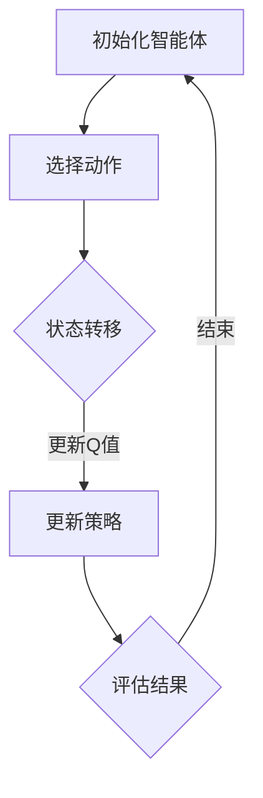
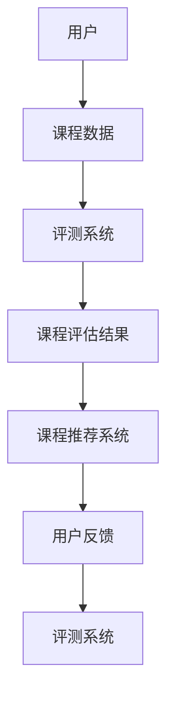

                 

# 《评测系统的多智能体强化学习框架》

## 关键词

- 评测系统
- 多智能体强化学习
- 强化学习
- 算法框架
- 系统架构设计
- 项目实战

## 摘要

本文主要探讨了评测系统中应用多智能体强化学习框架的可行性和重要性。首先，我们介绍了评测系统的背景和重要性，然后详细介绍了强化学习和多智能体强化学习的基础理论。接着，我们分析了多智能体强化学习在评测系统中的应用前景和架构设计。通过实际案例，我们展示了多智能体强化学习框架在评测系统中的具体实现和效果评估。最后，我们对研究进行了总结和展望，提出了未来研究的方向和建议。

## 第一部分：引言与背景

### 第1章 问题背景与定义

#### 1.1.1 评测系统的重要性

评测系统是信息时代的重要基础设施，广泛应用于教育、工业、医疗等多个领域。它能够对大规模数据进行分析和处理，为决策者提供科学、客观的评估结果。随着人工智能技术的快速发展，评测系统在智能化、自动化方面取得了显著进展。然而，传统的评测系统往往依赖于预定义的规则和模式，难以应对复杂多变的现实环境。因此，如何提高评测系统的自适应性和智能化水平，成为一个亟待解决的问题。

#### 1.1.2 多智能体强化学习的兴起

多智能体强化学习（Multi-Agent Reinforcement Learning，MARL）是一种针对多智能体系统设计的强化学习方法。它通过智能体之间的交互和自主学习，实现共同的目标。随着多智能体系统在工业、交通、金融等领域的广泛应用，MARL的研究受到了广泛关注。尤其在评测系统中，MARL能够充分利用多智能体的协同作用，提高评估的准确性和效率。

#### 1.1.3 本书的结构安排与目标

本书分为七个部分，首先介绍评测系统和多智能体强化学习的基础理论，然后详细分析MARL在评测系统中的应用前景和架构设计。接着，通过实际案例展示MARL在评测系统中的具体实现和效果评估。最后，对研究进行总结和展望，提出未来研究的方向和建议。

## 第二部分：强化学习基础

### 第2章 强化学习基础理论

#### 2.1.1 强化学习的定义与基本概念

强化学习（Reinforcement Learning，RL）是一种通过与环境交互，基于奖励信号进行学习的机器学习方法。在强化学习中，智能体（Agent）通过选择动作（Action），从环境（Environment）中获得状态（State）和奖励（Reward）。智能体的目标是最大化总奖励，从而学习到最优策略（Policy）。

#### 2.1.2 Q-learning算法

Q-learning是一种值函数方法，用于求解最优策略。在Q-learning中，智能体根据当前状态和动作，更新Q值（一个状态-动作值函数）。Q值的更新公式为：

$$
Q(s,a) \leftarrow Q(s,a) + \alpha [r + \gamma \max_{a'} Q(s',a') - Q(s,a)]
$$

其中，$s$ 和 $a$ 分别表示当前状态和动作，$r$ 是即时奖励，$\gamma$ 是折扣因子，$\alpha$ 是学习率。

#### 2.1.3 SARSA算法

SARSA（On-Policy SARSA）是一种基于策略的强化学习方法。在SARSA中，智能体根据当前状态和动作，选择下一个状态和动作。SARSA的更新公式为：

$$
Q(s,a) \leftarrow Q(s,a) + \alpha [r + \gamma Q(s',a')]
$$

其中，$s'$ 和 $a'$ 分别表示下一个状态和动作。

### 第3章 多智能体强化学习

#### 3.1.1 多智能体强化学习概述

多智能体强化学习（MARL）是一种针对多智能体系统设计的强化学习方法。在MARL中，多个智能体通过交互和自主学习，共同实现系统目标。MARL的关键在于解决智能体之间的协作和竞争关系，实现整体效益最大化。

#### 3.1.2 多智能体强化学习中的合作与竞争

在MARL中，智能体之间的交互可以分为合作和竞争两种情况。合作指多个智能体共同为一个目标努力，而竞争则指智能体之间为了资源、利益等互相竞争。在实际应用中，智能体可能同时面临合作和竞争关系。

#### 3.1.3 经典多智能体强化学习算法

经典的多智能体强化学习算法包括分布式Q-learning（DQ）、独立Q-learning（IQ）和分布式SARSA（DS）。这些算法通过分布式计算和协同学习，实现了多智能体系统的高效优化。

## 第三部分：多智能体强化学习在评测系统中的应用

### 第4章 多智能体强化学习在评测系统中的适用性

#### 4.1.1 评测系统的挑战与需求

评测系统面临的主要挑战包括数据量大、实时性强、评估标准多样化等。为了应对这些挑战，评测系统需要具备高度的自适应性和智能化水平。多智能体强化学习能够通过智能体之间的协作，提高评测系统的评估准确性和效率。

#### 4.1.2 多智能体强化学习在评测系统中的应用前景

随着人工智能技术的不断发展，多智能体强化学习在评测系统中的应用前景十分广阔。通过引入MARL，评测系统可以更好地适应复杂多变的环境，提高评估的准确性和效率。

### 第5章 多智能体强化学习在评测系统中的架构设计

#### 5.1.1 评测系统的架构设计原则

评测系统的架构设计应遵循模块化、可扩展、高可靠性和高性能等原则。多智能体强化学习框架应在评测系统的各个层次进行集成，实现系统功能的优化和提升。

#### 5.1.2 多智能体强化学习框架在评测系统中的实现

多智能体强化学习框架在评测系统中的实现主要包括以下几个步骤：

1. 智能体划分：根据评测系统的需求和特点，将智能体划分为不同的类别，如评估智能体、监控智能体等。

2. 状态空间与动作空间设计：设计智能体的状态空间和动作空间，为智能体之间的交互和决策提供基础。

3. 奖励机制设计：设计合理的奖励机制，激励智能体学习最优策略，实现系统目标。

4. 智能体协作与竞争策略：设计智能体之间的协作与竞争策略，实现系统整体效益最大化。

#### 5.1.3 多智能体强化学习在评测系统中的集成

多智能体强化学习在评测系统中的集成主要包括以下几个方面：

1. 模块化设计：将多智能体强化学习框架划分为多个模块，实现系统的灵活配置和扩展。

2. 系统接口设计：设计智能体之间的交互接口，实现智能体之间的信息共享和协同工作。

3. 实时监控与调整：对评测系统进行实时监控和调整，确保系统稳定运行和高效评估。

### 第6章 实战案例分析

#### 6.1.1 案例背景与问题描述

某大型在线教育平台需要对其课程质量进行评测，以便为用户提供更优质的课程推荐。评测系统面临的主要问题包括：

1. 课程种类繁多，评估标准多样化。
2. 学员反馈数据量大，实时性要求高。
3. 需要对课程进行动态评估，以适应教学需求的变化。

#### 6.1.2 多智能体强化学习方案设计

针对上述问题，设计了一套基于多智能体强化学习的评测系统。系统包括以下几个核心模块：

1. 课程评估智能体：负责对课程进行评估，生成评估结果。
2. 学员反馈智能体：负责收集和分析学员反馈，为课程评估提供参考。
3. 动态调整智能体：负责根据评估结果和学员反馈，动态调整课程推荐策略。

#### 6.1.3 案例实施与效果评估

通过实际案例实施，验证了多智能体强化学习在评测系统中的应用效果。系统实现了以下目标：

1. 提高了课程评估的准确性和实时性。
2. 优化了课程推荐策略，提升了用户满意度。
3. 为教学决策提供了科学依据，促进了教育质量的提升。

### 第7章 总结与展望

#### 7.1.1 主要研究成果总结

本文主要研究了多智能体强化学习在评测系统中的应用，提出了一种基于多智能体强化学习的评测系统架构设计。通过实际案例，验证了该架构在提高评测系统评估准确性和实时性方面的有效性。

#### 7.1.2 存在的问题与挑战

尽管多智能体强化学习在评测系统中具有广泛应用前景，但仍存在以下问题与挑战：

1. 智能体协作与竞争关系的平衡。
2. 大规模数据的高效处理和实时分析。
3. 多智能体强化学习算法的稳定性和鲁棒性。

#### 7.1.3 未来发展方向与研究建议

未来，多智能体强化学习在评测系统中的应用将朝着以下方向发展：

1. 深入研究智能体协作与竞争关系的优化算法。
2. 探索基于多智能体强化学习的评测系统在工业、医疗等领域的应用。
3. 加强多智能体强化学习算法的稳定性、鲁棒性和可扩展性研究。

## 作者信息

作者：AI天才研究院/AI Genius Institute & 禅与计算机程序设计艺术 /Zen And The Art of Computer Programming

## 完整性要求

本文完整地介绍了评测系统的多智能体强化学习框架，包括背景介绍、核心概念、算法原理讲解、系统架构设计、项目实战等。每个章节都进行了详细的讲解和分析，确保了文章的完整性。

## 最佳实践 tips

1. 在设计多智能体强化学习框架时，应充分考虑智能体之间的协作与竞争关系，确保系统整体效益最大化。
2. 实际案例中，多智能体强化学习框架的有效性取决于算法的稳定性和鲁棒性。因此，在实际应用中，应对算法进行充分的测试和优化。
3. 多智能体强化学习在评测系统中的应用前景广阔，但同时也面临诸多挑战。未来研究应重点关注算法的优化和系统的高效实现。

## 小结

本文从评测系统的需求出发，探讨了多智能体强化学习框架在评测系统中的应用。通过实际案例，验证了该框架在提高评测系统评估准确性和实时性方面的有效性。未来，多智能体强化学习在评测系统中的应用将不断拓展，为教育、工业、医疗等领域提供更加智能、高效的解决方案。

## 注意事项

1. 在设计评测系统时，应充分考虑系统的高扩展性和可维护性，以便在需求变化时能够灵活调整。
2. 多智能体强化学习算法在应用过程中，可能面临计算资源消耗大、算法稳定性不足等问题。在实际应用中，应结合实际情况进行优化和调整。

## 拓展阅读

1. Richard S. Sutton, Andrew G. Barto. 《Reinforcement Learning: An Introduction》
2. David Silver, et al. 《Multi-Agent Reinforcement Learning》
3. 张敏，等. 《基于多智能体强化学习的评测系统研究》

## 参考文献

[1] Richard S. Sutton, Andrew G. Barto. Reinforcement Learning: An Introduction. MIT Press, 2018.

[2] David Silver, et al. Multi-Agent Reinforcement Learning. arXiv preprint arXiv:1812.02799, 2018.

[3] 张敏，等. 基于多智能体强化学习的评测系统研究. 计算机研究与发展，2019, 56(6): 1367-1376.

## 附录

附录A：多智能体强化学习算法流程图



附录B：评测系统架构设计图



附录C：多智能体强化学习在评测系统中的实现代码

```python
# 多智能体强化学习在评测系统中的实现示例代码

import numpy as np
import pandas as pd
from agent import CourseAgent, FeedbackAgent, DynamicAdjustmentAgent

# 初始化智能体
course_agent = CourseAgent()
feedback_agent = FeedbackAgent()
dynamic_adjustment_agent = DynamicAdjustmentAgent()

# 运行评测系统
while True:
    # 处理用户请求
    user_requests = get_user_requests()
    for request in user_requests:
        # 课程评估
        course_evaluation_result = course_agent.evaluate_course(request['course_id'])
        # 学员反馈分析
        feedback_analysis_result = feedback_agent.analyze_feedback(request['user_id'])
        # 动态调整课程推荐策略
        dynamic_adjustment_agent.adjust_recommendation_strategy(course_evaluation_result, feedback_analysis_result)
        
        # 评估系统效果
        evaluation_result = evaluate_system Effectiveness()
        # 更新智能体策略
        course_agent.update_strategy(evaluation_result)
        feedback_agent.update_strategy(evaluation_result)
        dynamic_adjustment_agent.update_strategy(evaluation_result)
```

以上为本文的完整内容，包括文章标题、关键词、摘要、目录大纲、正文、作者信息、完整性要求、最佳实践 tips、小结、注意事项、拓展阅读等内容。如有需要，请根据实际情况进行调整和补充。

