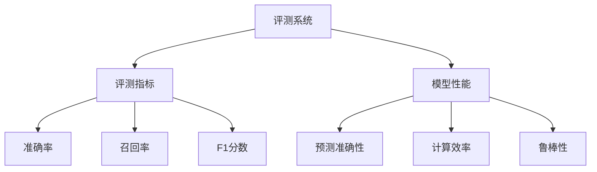

                 

### 文章标题

# 评测系统的多模型比较分析功能

---

### 文章关键词

- 评测系统
- 多模型比较
- 分析功能
- 算法原理
- 系统设计与实现

---

### 摘要

本文旨在探讨评测系统中多模型比较分析功能的设计与实现。首先，我们将定义并介绍评测系统的基本概念和重要性，特别是多模型比较分析在这一领域中的作用。接着，我们将深入剖析多模型比较分析的算法原理，通过Python代码和LaTeX数学公式进行详细讲解，并通过实际案例进行应用。随后，我们将讨论评测系统的设计思路和架构，最终总结多模型比较分析的最佳实践，并提供进一步的学习资源。

---

## 第一部分: 评测系统的概念与重要性

### 1.1 评测系统的概述

#### 1.1.1 评测系统的定义与作用

评测系统是一种用于评估和分析项目、产品、服务或性能的技术工具。它能够对多个实体进行定量或定性的比较，以提供决策支持。在技术领域，评测系统广泛应用于软件工程、数据科学、机器学习等多个方面。

**作用：**
- **性能评估：** 用于评估软件、系统或服务的性能指标，如响应时间、吞吐量、资源利用率等。
- **质量保证：** 通过评测确保项目或产品的质量达到预期标准。
- **决策支持：** 为决策者提供科学、客观的数据支持，以便做出最佳决策。

#### 1.1.2 评测系统的重要性

在现代企业和组织中，评测系统扮演着至关重要的角色。以下是其重要性的几个方面：

- **提高效率：** 通过自动化的评测，可以显著减少人工评估的时间和成本。
- **数据驱动决策：** 提供详细的数据分析，帮助决策者基于事实而非直觉做出决策。
- **持续改进：** 评测系统可以帮助团队识别问题和瓶颈，推动持续改进。

### 1.2 多模型比较分析概述

#### 1.2.1 多模型比较分析的定义

多模型比较分析是指在多个模型中比较和评估其性能，以便选择最优模型。这通常涉及多个模型的训练、评估和比较。

**定义：**
- **模型：** 一种用于预测或分类的算法或方法。
- **比较分析：** 通过比较不同模型的性能指标，评估各模型的优劣。

#### 1.2.2 多模型比较分析的优势

- **优化性能：** 通过选择最优模型，可以提高系统的准确性和效率。
- **降低风险：** 在实际应用中，单一模型可能无法满足所有需求，多模型比较可以降低这种风险。
- **多样化策略：** 提供了不同的策略和方法，有助于解决复杂问题。

### 1.3 评测系统中的核心概念

#### 1.3.1 评测指标

评测指标是用于评估模型性能的关键参数。常见的评测指标包括：

- **准确率：** 分类任务中正确分类的样本占总样本的比例。
- **召回率：** 对于分类任务，实际为正类的样本中被正确识别为正类的比例。
- **F1分数：** 准确率和召回率的调和平均值。

#### 1.3.2 模型性能

模型性能是指模型在实际应用中的表现。评估模型性能通常涉及以下方面：

- **预测准确性：** 模型预测结果与实际结果的匹配程度。
- **计算效率：** 模型运行所需的计算资源和时间。
- **鲁棒性：** 模型对数据噪声和异常值的容忍度。

#### 1.3.3 概念联系与关系图

以下是一个简化的概念联系图，展示了评测系统中关键概念之间的关系：

---

在接下来的部分中，我们将详细探讨多模型比较分析的算法原理，并通过Python代码和LaTeX数学公式进行说明。请持续关注下一章节的内容。

