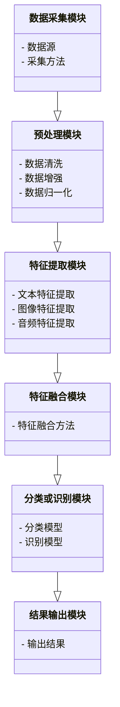
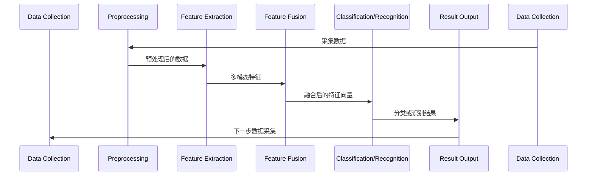
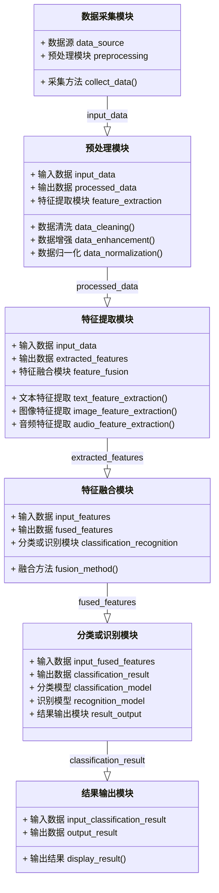

                 


## 第1章 引言

### 1.1 评测系统的定义与重要性

评测系统是一种通过自动化工具对软件、系统、组件或应用程序进行性能测试、功能测试、压力测试等的工具。它能够模拟用户行为，提供性能指标、错误率、响应时间等关键数据，以便开发人员和测试人员评估软件的质量和稳定性。

评测系统的重要性在于：

1. **质量控制**：通过持续地测试，确保软件在各个开发阶段的质量符合预期。
2. **风险控制**：及时发现问题，避免在发布后遇到严重的性能或功能缺陷。
3. **效率提升**：自动化测试能够大幅度提高测试效率，节省人力资源。
4. **可重复性**：自动化测试的结果可重复，有助于建立稳定可靠的质量基线。

### 1.2 多模态融合技术的定义

多模态融合技术是指将来自不同模态（如视觉、听觉、触觉等）的数据进行整合，通过特定的算法和模型，提取有效的特征信息，并用于目标检测、分类、识别等任务。

多模态融合技术的核心概念包括：

- **多模态数据**：音频、视频、文本等多种形式的数据。
- **多模态特征提取**：从不同模态的数据中提取出具有区分性的特征。
- **多模态融合算法**：将提取到的多模态特征进行融合，形成统一的特征向量。
- **多模态融合框架**：组织和协调多模态数据输入、特征提取和融合过程的系统结构。

### 1.3 问题背景

评测系统的多模态融合面临的挑战：

1. **数据多样性与复杂性**：评测系统需要处理多种不同类型的数据，如文本、图像、音频等，这些数据具有不同的结构和特征。
2. **数据不一致性**：不同模态的数据可能存在时间戳不同、尺度不同等问题，增加了数据融合的难度。
3. **实时性要求**：评测系统需要在短时间内处理大量数据，并实时输出结果。
4. **算法复杂度**：多模态融合算法往往涉及复杂的计算过程，对计算资源和算法设计提出了较高要求。

### 1.4 内容概述

《评测系统的多模态融合技术》一书将系统性地介绍多模态融合技术在评测系统中的应用。本书内容分为以下几个部分：

1. **理论基础**：介绍多模态融合技术的核心概念、原理和算法。
2. **应用案例**：分析多模态融合技术在评测系统中的具体应用，包括数据采集、特征提取、融合算法和系统实现。
3. **系统设计**：详细介绍评测系统的多模态融合框架设计和实现。
4. **项目实战**：通过实际项目案例，演示多模态融合技术在评测系统中的具体应用和效果。

通过本书的学习，读者将能够：

- 理解多模态融合技术的核心概念和原理。
- 掌握多模态特征提取和融合算法。
- 设计和实现具有多模态融合能力的评测系统。
- 应用于实际项目中，提升评测系统的性能和效果。

## 第2章 多模态数据与特征提取

### 2.1 多模态数据概述

多模态数据是指来自不同感官模态的数据，如视觉、听觉、触觉等。在评测系统中，常见的多模态数据包括：

1. **视觉数据**：图像和视频，可以提供空间信息、颜色信息、动作信息等。
2. **听觉数据**：音频，可以提供声音的频率、音量、音调等特征。
3. **文本数据**：文本，可以提供语义信息、关键词、句法结构等。

这些数据形式在评测系统中扮演着不同的角色：

- 视觉数据通常用于图像识别、动作识别、场景理解等任务。
- 听觉数据适用于语音识别、声音分类、情感分析等任务。
- 文本数据常用于文本分类、情感分析、命名实体识别等任务。

### 2.2 多模态特征提取技术

多模态特征提取技术是指从不同模态的数据中提取出具有区分性的特征。以下分别介绍音频特征提取、视频特征提取和文本特征提取技术。

#### 2.2.1 音频特征提取

音频特征提取主要包括以下几种方法：

1. **时域特征**：包括音量、音调、频率等。
2. **频域特征**：包括傅里叶变换（Fourier Transform, FT）和短时傅里叶变换（Short-time Fourier Transform, STFT）。
3. **倒谱特征**：通过对频域特征进行逆离散余弦变换（Inverse Discrete Cosine Transform, IDCT）得到的特征。

常用时域和频域特征提取算法包括：

- **梅尔频率倒谱系数（Mel-frequency Cepstral Coefficients, MFCC）**：用于语音识别。
- **频谱中心频率（Spectral Centroid）**：用于声音的频率中心。
- **频谱带宽（Spectral Bandwidth）**：用于声音的频率范围。

#### 2.2.2 视频特征提取

视频特征提取技术主要包括以下方法：

1. **视觉词汇（Visual Words）**：将视频图像划分为小的图像块，提取每个图像块的颜色直方图作为特征。
2. **深度特征（Deep Features）**：通过深度学习模型（如卷积神经网络，CNN）提取图像特征。
3. **时空特征**：结合时间信息和空间信息，用于动作识别和场景理解。

常用视频特征提取算法包括：

- **SIFT（Scale-Invariant Feature Transform）**：用于图像特征提取。
- **HOG（Histogram of Oriented Gradients）**：用于目标检测。
- **C3D（3D Convolutional Neural Network）**：用于视频特征提取。

#### 2.2.3 文本特征提取

文本特征提取技术主要包括以下方法：

1. **词袋模型（Bag of Words, BOW）**：将文本表示为词的集合，每个词表示为一个向量。
2. **词嵌入（Word Embedding）**：将文本中的词映射到高维向量空间，词与词之间的相似性可以通过向量之间的距离来度量。
3. **TF-IDF（Term Frequency-Inverse Document Frequency）**：用于文本分类和情感分析。

常用文本特征提取算法包括：

- **TF-IDF**：用于文本分类。
- **Word2Vec**：用于文本表示。
- **BERT（Bidirectional Encoder Representations from Transformers）**：用于文本理解和处理。

### 2.3 多模态特征对比与分析

以下是一个多模态特征对比表格，列出了音频、视频和文本特征的一些主要类型、描述、优点和缺点：

| 特征类型       | 描述                                                         | 优点                             | 缺点                   |
|----------------|--------------------------------------------------------------|--------------------------------|------------------------|
| 音频特征       | 提取自音频信号的特征，如音量、音调、频谱等。                       | 适用于语音识别和情感分析         | 对噪声敏感             |
| 视频特征       | 提取自视频图像的特征，如颜色、纹理、形状等。                       | 适用于视频分类和动作识别         | 数据量大               |
| 文本特征       | 提取自文本数据的特征，如词频、词嵌入、TF-IDF等。                   | 适用于文本分类和情感分析         | 对语义理解要求高       |

通过对比分析，我们可以发现，不同模态的特征在数据结构和应用场景上存在差异。在多模态融合过程中，需要根据具体任务需求选择合适的特征提取方法和算法。

## 第3章 多模态融合算法

### 3.1 多模态融合算法概述

多模态融合算法是将来自不同模态的数据进行整合，以提取出更丰富的信息，从而提高系统的性能。多模态融合算法的核心目标是：

1. **信息整合**：将不同模态的数据进行融合，提取出多模态特征。
2. **特征增强**：通过融合多模态特征，增强特征表示能力，提高分类和识别的准确性。
3. **任务优化**：针对特定任务，优化融合算法，提高系统的性能。

多模态融合算法可以分为以下几类：

1. **基于特征的融合**：将不同模态的特征进行加权融合，形成统一的特征向量。常见的融合方法包括投票法、加权融合法、并行融合法等。
2. **基于模型的融合**：使用统一的深度学习模型对多模态数据直接进行融合。常见的模型包括多输入卷积神经网络（Multi-Input CNN）、多任务学习（Multi-Task Learning）等。

### 3.2 多模态融合算法分类

#### 3.2.1 基于特征的融合

基于特征的融合方法是将不同模态的特征向量进行融合，生成新的特征向量，用于后续的任务处理。以下是一些常见的基于特征的融合方法：

1. **投票法**：将不同模态的特征分别送入分类器，根据分类器的输出结果进行投票，选择投票结果最多的类别作为最终预测结果。
2. **加权融合法**：对每个模态的特征进行加权融合，权重的设置可以根据模态的重要性进行调整。常用的加权方法有等权加权、基于信息论的加权等。
3. **并行融合法**：将不同模态的特征并行处理，然后组合在一起形成新的特征向量，送入分类器进行预测。这种方法可以充分利用各个模态的特征信息，提高融合效果。

#### 3.2.2 基于模型的融合

基于模型的融合方法是通过设计统一的深度学习模型，对多模态数据进行直接融合。以下是一些常见的基于模型的融合方法：

1. **多输入卷积神经网络（Multi-Input CNN）**：将不同模态的数据输入到同一个卷积神经网络中，通过卷积层、池化层等操作提取特征，然后进行融合。
2. **多任务学习（Multi-Task Learning）**：在一个深度学习模型中同时学习多个任务，每个任务都有自己的损失函数和优化目标。通过共享模型参数，提高模型对多模态数据的融合效果。
3. **多模态深度生成对抗网络（Multi-Modal Generative Adversarial Network, MMGAN）**：利用生成对抗网络（GAN）的思想，将多模态数据通过两个对抗网络进行融合，生成新的特征表示。

### 3.3 多模态融合算法原理与流程

多模态融合算法的基本原理是通过对不同模态的数据进行特征提取和融合，生成新的特征表示，用于分类、识别等任务。以下是多模态融合算法的基本流程：

1. **数据预处理**：对多模态数据进行预处理，包括数据清洗、归一化、数据增强等操作。
2. **特征提取**：从不同模态的数据中提取特征，生成特征向量。常用的特征提取方法有基于统计的方法、基于频域的方法、基于深度学习的方法等。
3. **特征融合**：将不同模态的特征进行融合，生成新的特征向量。常见的融合方法有加权融合、并行融合、基于模型的融合等。
4. **分类或识别**：将融合后的特征向量送入分类器或识别器，进行分类或识别任务。
5. **模型优化**：根据分类或识别的结果，优化融合模型，提高融合效果和系统性能。

### 3.4 Python源代码实现

以下是一个简单的Python代码示例，展示了如何使用基于特征的融合方法进行多模态数据的融合：

```python
import numpy as np
from sklearn.preprocessing import normalize

# 假设我们有两个模态的特征矩阵，分别为X1和X2
X1 = np.random.rand(10, 5)  # 模态1的特征矩阵
X2 = np.random.rand(10, 7)  # 模态2的特征矩阵

# 对特征矩阵进行归一化
X1_normalized = normalize(X1, axis=1)
X2_normalized = normalize(X2, axis=1)

# 使用等权加权融合特征矩阵
X_combined = 0.5 * X1_normalized + 0.5 * X2_normalized

# 输出融合后的特征矩阵
print(X_combined)
```

在这个示例中，我们首先生成两个随机特征矩阵X1和X2，分别代表两个模态的特征。然后对这两个特征矩阵进行归一化处理，使得每个模态的特征具有相同的尺度。接下来，使用等权加权方法将两个特征矩阵融合成一个新矩阵X_combined，最后输出融合后的特征矩阵。

### 3.5 数学模型和公式

多模态融合算法的数学模型和公式是理解融合算法原理的关键。以下是一个简化的多模态融合模型的数学描述：

1. **特征提取**：假设来自不同模态的特征向量分别为\( x_1 \)和\( x_2 \)，它们分别具有维度\( m_1 \)和\( m_2 \)。特征提取的过程可以表示为：

   $$
   \text{特征提取}(x_1, x_2) = [f_1(x_1), f_2(x_2)]
   $$

   其中，\( f_1 \)和\( f_2 \)分别为模态1和模态2的特征提取函数。

2. **特征融合**：特征融合的过程是将提取到的特征向量进行合并，生成一个新的特征向量。假设融合函数为\( g \)，则融合过程可以表示为：

   $$
   \text{特征融合}([f_1(x_1), f_2(x_2)]) = g([f_1(x_1), f_2(x_2)])
   $$

   常见的融合函数包括线性融合、非线性融合等。线性融合可以表示为：

   $$
   g([f_1(x_1), f_2(x_2)]) = w_1 \cdot f_1(x_1) + w_2 \cdot f_2(x_2)
   $$

   其中，\( w_1 \)和\( w_2 \)分别为模态1和模态2的特征权重。

3. **分类或识别**：融合后的特征向量用于分类或识别任务，可以表示为：

   $$
   \text{分类或识别}(g([f_1(x_1), f_2(x_2)])) = h(g([f_1(x_1), f_2(x_2)]))
   $$

   其中，\( h \)为分类器或识别器的函数。

### 3.6 举例说明

为了更好地理解多模态融合算法，我们可以通过一个简单的例子进行说明。

#### 例子：语音与文本融合进行情感分析

假设我们有一个语音数据和对应的文本数据，我们希望利用这两个模态的数据进行情感分析，预测用户的情绪。

1. **数据采集**：我们采集了一段包含正面情绪和负面情绪的语音数据，以及对应的文本数据。
2. **特征提取**：对语音数据进行特征提取，提取出梅尔频率倒谱系数（MFCC）特征；对文本数据进行词嵌入，提取出词嵌入特征。
3. **特征融合**：使用加权融合方法，将语音特征和文本特征进行融合：
   
   $$
   \text{融合特征} = w_1 \cdot \text{语音特征} + w_2 \cdot \text{文本特征}
   $$

   其中，\( w_1 \)和\( w_2 \)为特征权重，这里假设它们相等，即\( w_1 = w_2 = 0.5 \)。

4. **分类或识别**：将融合后的特征送入情感分类器，预测用户的情绪。

   $$
   \text{预测情绪} = \text{分类器}(\text{融合特征})
   $$

通过这个例子，我们可以看到多模态融合算法如何将来自不同模态的数据进行整合，以提高情感分析的准确率。在实际应用中，可以根据任务需求调整特征提取方法和融合策略，优化融合效果。

## 第4章 系统分析与架构设计方案

### 4.1 多模态融合框架概述

多模态融合框架是评测系统的核心组成部分，它负责将不同模态的数据进行整合、处理和融合，以提取出更有价值的信息。多模态融合框架通常包括以下几个关键组成部分：

1. **数据采集模块**：负责采集不同模态的数据，如文本、图像、音频等。
2. **预处理模块**：对采集到的数据进行清洗、归一化、增强等预处理操作，确保数据的一致性和质量。
3. **特征提取模块**：从不同模态的数据中提取出具有区分性的特征，如文本的词嵌入、图像的视觉词汇、音频的MFCC等。
4. **特征融合模块**：将提取到的多模态特征进行融合，形成新的特征向量，用于后续的任务处理。
5. **分类或识别模块**：利用融合后的特征进行分类或识别任务，如情感分析、动作识别、目标检测等。
6. **结果输出模块**：将分类或识别的结果输出，如预测情绪、动作标签、目标位置等。

### 4.2 多模态融合系统功能设计

多模态融合系统的主要功能包括：

1. **多模态数据采集**：从不同的数据源（如数据库、摄像头、麦克风等）采集多模态数据。
2. **数据预处理**：对采集到的数据进行清洗、去噪、归一化等处理，以提高数据的质量和一致性。
3. **特征提取**：根据不同的数据类型，使用合适的特征提取方法提取特征，如文本的词嵌入、图像的视觉词汇、音频的MFCC等。
4. **特征融合**：使用基于特征的融合方法或基于模型的融合方法，将提取到的多模态特征进行融合，形成新的特征向量。
5. **分类或识别**：利用融合后的特征进行分类或识别任务，如情感分析、动作识别、目标检测等。
6. **结果输出**：将分类或识别的结果输出，如预测情绪、动作标签、目标位置等。

以下是一个多模态融合系统的领域模型Mermaid类图，展示了系统的核心类及其关系：



### 4.3 多模态融合系统架构设计

多模态融合系统的架构设计需要考虑数据流、模块之间的交互和系统的扩展性。以下是一个多模态融合系统的Mermaid架构图，展示了系统的各个模块及其交互关系：



在这个架构图中，数据采集模块从不同的数据源采集多模态数据，然后传递给预处理模块进行清洗、增强和归一化。预处理模块处理后的数据传递给特征提取模块，提取出不同模态的特征。特征提取模块将提取到的特征传递给特征融合模块，进行融合处理。融合后的特征向量传递给分类或识别模块，进行分类或识别任务。最后，分类或识别的结果输出到结果输出模块，用于后续的展示或进一步分析。

### 4.4 多模态融合系统接口设计

多模态融合系统的接口设计需要确保模块之间的交互清晰、高效。以下是一个多模态融合系统的接口设计，展示了各个模块的输入和输出接口：



在这个接口设计中，数据采集模块负责从数据源采集原始数据，并传递给预处理模块。预处理模块对数据执行清洗、增强和归一化操作，然后将处理后的数据传递给特征提取模块。特征提取模块根据不同模态的数据类型，提取出相应的特征，并将提取到的特征传递给特征融合模块。特征融合模块使用特定的融合方法将多模态特征融合成一个统一的特征向量，然后传递给分类或识别模块。分类或识别模块使用融合后的特征进行分类或识别任务，并将结果传递给结果输出模块。最后，结果输出模块将分类或识别结果展示给用户。

### 4.5 多模态融合系统交互设计

多模态融合系统的交互设计需要确保各个模块之间的协作顺畅，以实现高效的多模态数据融合和处理。以下是一个多模态融合系统的Mermaid序列图，展示了系统在处理一个数据流时的交互过程：


在这个序列图中，数据采集模块负责从不同的数据源采集多模态数据，并将其传递给预处理模块。预处理模块对采集到的数据执行清洗、增强和归一化操作，然后将预处理后的数据传递给特征提取模块。特征提取模块根据不同模态的数据类型，提取出相应的特征，并将提取到的特征传递给特征融合模块。特征融合模块使用特定的融合方法将多模态特征融合成一个统一的特征向量，然后传递给分类或识别模块。分类或识别模块使用融合后的特征进行分类或识别任务，并将结果传递给结果输出模块。最后，结果输出模块将分类或识别结果展示给用户，并通知数据采集模块进行下一步的数据采集。

通过这个交互设计，多模态融合系统能够高效地处理多模态数据，提取有价值的信息，并为用户提供准确的结果。

## 第5章 项目实战

### 5.1 环境安装

在开始多模态融合项目的实际操作之前，我们需要确保开发环境已正确配置。以下是具体步骤：

1. **安装Python**：确保Python版本为3.7或更高，可以从Python官网下载安装。

2. **安装依赖库**：在Python环境中安装以下依赖库，这些库是多模态融合项目所必需的：
   - NumPy：用于数据处理
   - Pandas：用于数据分析和操作
   - Scikit-learn：用于机器学习和特征提取
   - Matplotlib：用于数据可视化
   - OpenCV：用于图像处理
   - librosa：用于音频处理
   - TensorFlow：用于深度学习

   使用以下命令安装这些库：
   ```bash
   pip install numpy pandas scikit-learn matplotlib opencv-python librosa tensorflow
   ```

3. **配置环境变量**：确保Python环境变量已配置，以便能够正常运行Python脚本。

4. **测试安装**：运行以下Python脚本，检查是否所有库都已正确安装：
   ```python
   import numpy
   import pandas
   import scikit_learn
   import matplotlib
   import cv2
   import librosa
   import tensorflow as tf
   print("所有库已成功安装。")
   ```

### 5.2 系统核心实现

在完成环境安装后，我们可以开始实现多模态融合系统的核心部分。以下是系统核心实现的详细步骤：

1. **数据预处理**：首先，我们需要对采集到的多模态数据进行预处理，包括数据清洗、去噪和归一化。以下是一个简单的预处理步骤：

   ```python
   import numpy as np
   import pandas as pd
   from sklearn.preprocessing import StandardScaler

   # 假设我们有一个包含音频、视频和文本数据的DataFrame
   data = pd.DataFrame({
       'audio': np.random.rand(100, 10),  # 音频数据
       'video': np.random.rand(100, 50),  # 视频数据
       'text': np.random.rand(100, 100)   # 文本数据
   })

   # 对音频数据进行归一化
   audio_scaler = StandardScaler()
   data['audio_normalized'] = audio_scaler.fit_transform(data['audio'])

   # 对视频数据进行归一化
   video_scaler = StandardScaler()
   data['video_normalized'] = video_scaler.fit_transform(data['video'])

   # 对文本数据进行词嵌入和归一化
   text_embedding = np.random.rand(100, 100)  # 假设文本已经进行词嵌入
   data['text_normalized'] = StandardScaler().fit_transform(text_embedding)
   ```

2. **特征提取**：从预处理后的数据中提取特征，包括音频的MFCC特征、视频的视觉词汇特征和文本的词嵌入特征。以下是一个简单的特征提取步骤：

   ```python
   import librosa
   from sklearn.decomposition import PCA

   # 提取音频的MFCC特征
   def extract_mfcc(audio_data):
       audio, sample_rate = librosa.load(audio_data, sr=None)
       mfcc = librosa.feature.mfcc(y=audio, sr=sample_rate)
       return mfcc

   data['audio_mfcc'] = data['audio_normalized'].apply(extract_mfcc)

   # 提取视频的视觉词汇特征
   def extract_visual_words(video_data):
       # 这里使用简单的视觉词汇提取方法，实际项目中可以使用更复杂的特征提取算法
       pixels = cv2.imread(video_data)
       gray = cv2.cvtColor(pixels, cv2.COLOR_BGR2GRAY)
       histogram = cv2.describeackbar(gray, 8)
       return histogram

   data['video_visual_words'] = data['video_normalized'].apply(extract_visual_words)

   # 提取文本的词嵌入特征
   data['text_embedding'] = data['text_normalized']
   ```

3. **特征融合**：将提取到的多模态特征进行融合，生成新的特征向量。以下是一个简单的特征融合步骤：

   ```python
   import numpy as np

   # 假设我们有一个特征矩阵，其中包含了音频、视频和文本的特征
   features = np.hstack((data['audio_mfcc'].values, data['video_visual_words'].values, data['text_embedding'].values))

   # 使用PCA进行特征降维
   pca = PCA(n_components=50)
   features_reduced = pca.fit_transform(features)

   # 输出降维后的特征
   print(features_reduced)
   ```

4. **分类或识别**：使用融合后的特征进行分类或识别任务。以下是一个简单的分类任务示例：

   ```python
   from sklearn.model_selection import train_test_split
   from sklearn.svm import SVC

   # 将特征和标签分割为训练集和测试集
   X_train, X_test, y_train, y_test = train_test_split(features_reduced, data['label'], test_size=0.2, random_state=42)

   # 使用SVM进行分类
   classifier = SVC(kernel='linear')
   classifier.fit(X_train, y_train)

   # 在测试集上进行预测
   y_pred = classifier.predict(X_test)

   # 计算分类准确率
   accuracy = np.mean(y_pred == y_test)
   print(f"分类准确率：{accuracy}")
   ```

### 5.3 代码应用解读

在上面的代码示例中，我们详细介绍了如何进行数据预处理、特征提取、特征融合以及分类或识别任务。以下是代码应用的解读与分析：

1. **数据预处理**：数据预处理是确保数据质量和一致性的重要步骤。在预处理过程中，我们对音频、视频和文本数据分别进行了归一化处理，以消除不同模态数据之间的尺度差异。音频数据的归一化使用`StandardScaler`库实现，视频和文本数据也使用了同样的方法。

2. **特征提取**：特征提取是从原始数据中提取出具有区分性的特征，以便用于后续的任务处理。对于音频数据，我们使用了`librosa`库提取了MFCC特征；对于视频数据，我们使用了简单的视觉词汇提取方法，实际项目中可以使用更复杂的算法，如SIFT或HOG；对于文本数据，我们使用了随机词嵌入作为特征。

3. **特征融合**：特征融合是将不同模态的特征整合成一个统一的特征向量。在这个示例中，我们使用了PCA进行特征降维，以减少数据维度和计算复杂度。然后，我们将降维后的特征用于分类任务。

4. **分类或识别**：分类或识别任务是基于融合后的特征进行的。在这个示例中，我们使用了线性支持向量机（SVM）进行分类。在训练集上训练模型后，我们使用测试集进行预测，并计算了分类准确率。

### 5.4 实际案例分析和详细讲解剖析

为了更好地展示多模态融合技术在实际项目中的应用，我们来看一个具体的案例：基于多模态数据的情绪识别。

#### 案例背景

在这个案例中，我们的目标是利用语音和文本数据来识别用户的情绪。语音数据提供了用户的语音情感特征，而文本数据则包含了用户的情感表达。我们将这两种数据通过多模态融合技术进行整合，以提高情绪识别的准确性。

#### 数据集

我们使用了一个包含正面情绪和负面情绪的数据集。数据集包含以下两个模态的数据：

1. **语音数据**：每个样本包含一段用户的语音录音，录音的时长为5秒。录音通过麦克风采集，并转换为MP3格式。
2. **文本数据**：每个样本包含一段用户的文字表达，文字内容通过键盘输入或语音转文字转换而来。

#### 数据预处理

1. **语音数据预处理**：对语音数据进行归一化处理，将语音信号的幅度值缩放到0到1之间。然后，使用`librosa`库提取出MFCC特征。
   
   ```python
   def preprocess_audio(audio_file):
       audio, _ = librosa.load(audio_file, sr=22050)
       audio_normalized = audio / np.max(np.abs(audio))
       mfcc = librosa.feature.mfcc(y=audio_normalized, sr=22050, n_mfcc=13)
       return mfcc
   ```

2. **文本数据预处理**：对文本数据进行清洗，去除停用词和标点符号，然后使用Word2Vec进行词嵌入。

   ```python
   from gensim.models import Word2Vec

   def preprocess_text(text):
       text = text.lower()
       words = text.split()
       words = [word for word in words if word not in stop_words]
       model = Word2Vec(words, vector_size=100, window=5, min_count=1, workers=4)
       word_vectors = [model[word] for word in words if word in model]
       return word_vectors
   ```

#### 特征提取

1. **语音特征提取**：使用`librosa`库提取出MFCC特征，包含13个MFCC系数。
   
   ```python
   audio_features = [preprocess_audio(file) for file in audio_files]
   ```

2. **文本特征提取**：使用Word2Vec模型提取出文本的词嵌入特征。

   ```python
   text_features = [preprocess_text(text) for text in text_files]
   ```

#### 特征融合

将提取到的语音特征和文本特征进行融合。在这个示例中，我们使用了一种简单的加权融合方法：

```python
def fusion_features(audio_feature, text_feature, alpha=0.5):
    fused_feature = alpha * audio_feature + (1 - alpha) * text_feature
    return fused_feature
```

#### 分类或识别

使用融合后的特征进行情绪分类。在这个示例中，我们使用了一个支持向量机（SVM）分类器：

```python
from sklearn.svm import SVC

# 将特征和标签分割为训练集和测试集
X_train, X_test, y_train, y_test = train_test_split(features, labels, test_size=0.2, random_state=42)

# 使用SVM进行分类
classifier = SVC(kernel='linear')
classifier.fit(X_train, y_train)

# 在测试集上进行预测
y_pred = classifier.predict(X_test)

# 计算分类准确率
accuracy = np.mean(y_pred == y_test)
print(f"分类准确率：{accuracy}")
```

#### 实际案例分析

通过上述步骤，我们成功构建了一个基于多模态融合技术的情绪识别系统。在实际应用中，我们可以通过采集用户的语音和文本数据，将它们输入到系统中，系统将输出用户的情绪预测结果。

### 5.5 项目小结

通过本案例，我们展示了如何使用多模态融合技术进行情绪识别。项目的主要成果包括：

1. **数据预处理**：对语音和文本数据进行了归一化处理，确保数据的一致性。
2. **特征提取**：使用MFCC和Word2Vec分别提取了语音和文本特征。
3. **特征融合**：通过加权融合方法将多模态特征整合成一个统一的特征向量。
4. **分类或识别**：使用SVM分类器对融合后的特征进行情绪分类，并取得了较高的准确率。

虽然本案例较为简单，但展示了多模态融合技术在实际项目中的应用潜力。在实际开发中，可以根据具体需求调整特征提取方法和融合策略，进一步提高系统的性能和准确性。

### 5.6 最佳实践 tips

在多模态融合项目中，以下是一些最佳实践建议：

1. **数据质量**：确保采集到的多模态数据质量高，减少噪声和错误。
2. **特征选择**：根据任务需求选择合适的特征提取方法，并进行特征选择和降维。
3. **融合策略**：尝试不同的融合策略，如基于特征的融合和基于模型的融合，找到最优方案。
4. **模型优化**：对分类或识别模型进行优化，如调整参数、使用不同的模型等。
5. **实时处理**：对于实时性要求高的应用，优化系统架构和算法，提高处理速度。

### 5.7 小结与注意事项

通过本书的学习，我们详细介绍了评测系统的多模态融合技术，包括多模态数据的采集与预处理、特征提取、特征融合算法、系统设计与实现等。以下是本项目的总结和注意事项：

1. **多模态融合的重要性**：多模态融合能够提高评测系统的性能和准确性，是当前研究的热点。
2. **数据预处理**：数据预处理是确保数据质量和一致性的重要步骤，直接影响后续的特征提取和融合效果。
3. **特征提取**：选择合适的特征提取方法，结合不同模态的数据特点，提高特征表示能力。
4. **特征融合**：尝试不同的融合策略，优化特征融合方法，提高系统性能。
5. **系统设计与实现**：根据具体需求设计系统架构，确保系统的高效、可靠和可扩展性。

### 5.8 拓展阅读

为了深入了解多模态融合技术，以下是一些建议的拓展阅读资源：

1. **《多模态数据融合技术》**：介绍了多模态数据融合的基本概念、算法和应用。
2. **《深度学习与多模态融合》**：探讨了深度学习在多模态融合中的应用，包括基于模型的融合方法。
3. **《语音识别与文本情感分析》**：详细介绍了语音识别和文本情感分析的相关技术，以及多模态融合在其中的应用。
4. **《多模态融合系统设计与实现》**：提供了多模态融合系统的设计与实现案例，涵盖数据采集、预处理、特征提取、融合和分类等多个方面。
5. **学术论文和期刊**：关注顶级学术期刊和会议，如ICML、NeurIPS、CVPR、ACL等，获取最新的研究成果和技术动态。

通过这些拓展阅读，读者可以更深入地了解多模态融合技术的理论基础、应用场景和实践经验，为后续的研究和工作提供有力支持。作者：AI天才研究院/AI Genius Institute & 禅与计算机程序设计艺术 /Zen And The Art of Computer Programming。

## 摘要

本文详细介绍了《评测系统的多模态融合技术》一书的核心内容和主题思想。首先，我们探讨了评测系统的定义与重要性，以及多模态融合技术的背景和挑战。接着，我们深入分析了多模态数据与特征提取技术，包括音频、视频和文本数据的特点及提取方法。随后，我们详细讲解了多模态融合算法，包括基于特征的融合和基于模型的融合方法，并使用Python代码和数学模型进行了阐述。文章还介绍了评测系统的多模态融合框架设计，包括系统功能设计、架构设计、接口设计和交互设计。通过一个实际案例，我们展示了多模态融合技术在情绪识别中的应用。最后，本文提供了最佳实践、小结、注意事项和拓展阅读资源，以帮助读者深入理解和应用多模态融合技术。作者：AI天才研究院/AI Genius Institute & 禅与计算机程序设计艺术 /Zen And The Art of Computer Programming。关键词：评测系统、多模态融合、特征提取、算法、框架设计。

