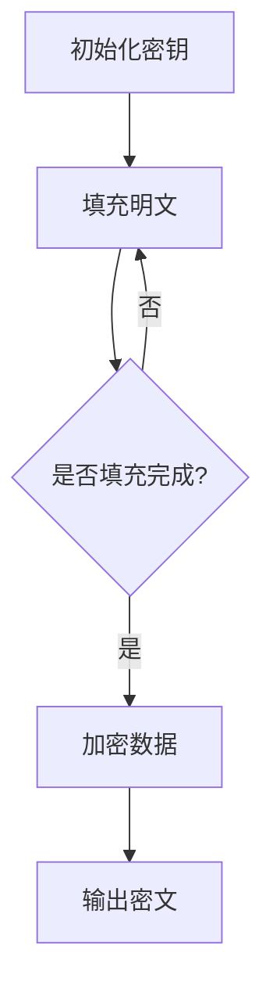
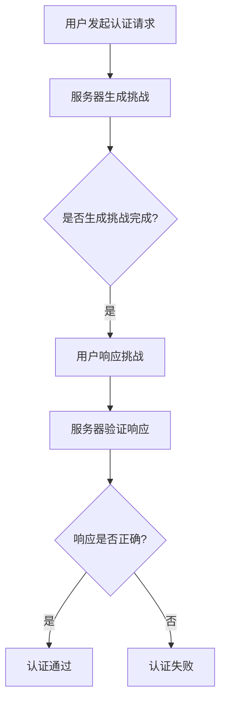
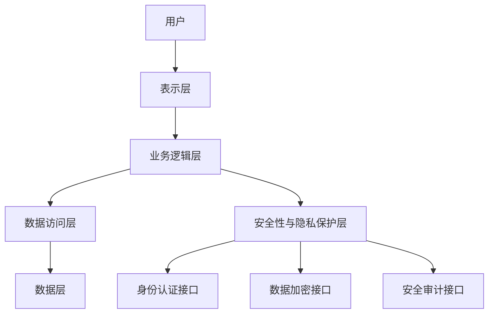
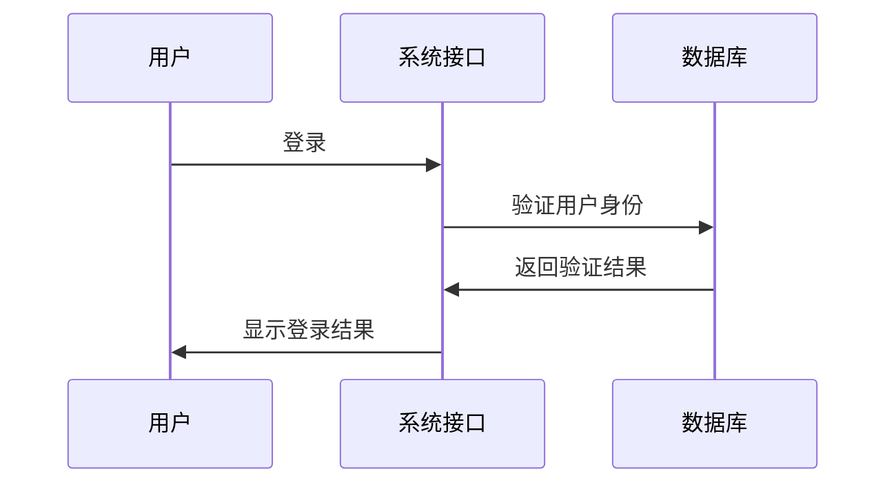

                 

# 评测系统的安全性与隐私保护措施

## 关键词

- 评测系统
- 安全性
- 隐私保护
- 数据加密
- 身份认证

## 摘要

本文深入探讨了评测系统的安全性与隐私保护问题，通过分析背景、核心概念、安全性和隐私保护措施，提出了系统架构设计、项目实战和最佳实践建议。文章旨在为评测系统开发者和用户提供有效的安全防护和隐私保护策略，确保评测活动的公正性和用户数据的安全性。

## 1. 背景介绍

### 问题背景

随着互联网技术的飞速发展，评测系统作为一种重要的互联网应用，在多个领域得到了广泛应用。例如，在线教育平台通过评测系统评估学生的学习效果；招聘考试系统通过评测系统筛选合格的应聘者；产品评测平台通过评测系统收集用户对产品的反馈。然而，评测系统的广泛应用也带来了安全性和隐私保护问题的日益凸显。

### 问题描述

评测系统的安全性问题主要包括以下几个方面：

1. **数据泄露**：评测系统可能遭遇黑客攻击，导致用户个人信息泄露。例如，用户的身份信息、成绩、答案等敏感数据被窃取，对用户隐私造成严重威胁。
2. **恶意作弊**：用户可能通过非法手段获取答案，影响评测的公正性。例如，通过第三方工具作弊、恶意修改数据等行为，使得评测结果不准确。
3. **系统漏洞**：评测系统自身可能存在漏洞，被黑客利用进行攻击。例如，通过注入攻击、拒绝服务攻击等手段，导致系统瘫痪或数据泄露。

隐私保护问题主要包括以下几个方面：

1. **数据收集与使用**：评测系统在收集用户数据时，可能涉及用户的敏感信息，如身份信息、成绩等。如何合理收集和使用这些数据，是隐私保护的关键问题。
2. **数据存储与传输**：用户数据在存储和传输过程中可能面临泄露风险。例如，数据在存储设备上未加密，或在传输过程中被截获。
3. **数据共享与滥用**：评测系统可能将用户数据分享给第三方，导致隐私泄露。例如，未经用户同意，将数据出售给其他公司或机构。

### 问题解决

为了解决上述问题，评测系统需要采取一系列的安全性与隐私保护措施，包括但不限于：

1. **数据加密**：对用户数据进行加密处理，防止数据在传输和存储过程中被窃取。例如，采用AES算法对数据进行加密，确保数据在传输过程中的机密性。
2. **身份认证**：采用多因素认证机制，确保用户身份的真实性。例如，用户需要输入用户名、密码以及短信验证码才能登录系统，提高账户安全性。
3. **访问控制**：对系统资源进行严格访问控制，确保只有授权用户才能访问。例如，设置角色权限，限制普通用户只能访问个人成绩，而管理员可以访问全部数据。
4. **安全审计**：对系统进行定期安全审计，及时发现和修复安全漏洞。例如，使用漏洞扫描工具定期检查系统漏洞，确保系统的安全性。

### 边界与外延

评测系统的安全性与隐私保护不仅涉及技术层面，还包括法律法规、伦理道德等方面。在实际应用中，需要综合考虑多方面因素，确保评测系统的安全性与隐私保护达到最佳效果。例如，遵守相关法律法规，制定数据隐私保护政策，加强用户教育等。

### 概念结构与核心要素组成

1. **安全性与隐私保护**：安全性与隐私保护是评测系统的核心要素，包括数据安全、用户隐私等多方面内容。
2. **技术措施**：数据加密、身份认证、访问控制等技术措施是保障评测系统安全性与隐私保护的重要手段。
3. **法律法规**：相关法律法规为评测系统的安全性与隐私保护提供了法律依据和规范。
4. **伦理道德**：伦理道德在评测系统的安全性与隐私保护中起着重要作用，需要平衡技术手段与道德伦理之间的关系。

## 2. 核心概念与联系

### 核心概念

1. **评测系统**：评测系统是一种基于互联网的应用，主要用于收集、处理和分析用户的评测数据。它可以实现对用户成绩的实时统计、分析和展示，帮助相关机构或个人了解用户的能力水平。
2. **安全性**：安全性指评测系统在应对黑客攻击、恶意作弊等安全威胁时的能力。它包括数据安全、系统安全、用户安全等多个方面。
3. **隐私保护**：隐私保护指评测系统在收集、存储和使用用户数据时，保护用户隐私的能力。它包括数据加密、访问控制、数据最小化收集等多个方面。

### 概念属性特征对比表格

| 概念        | 定义                           | 属性特征                                                     |
| ----------- | ------------------------------ | ------------------------------------------------------------ |
| 评测系统    | 基于互联网的应用，用于收集、处理和分析用户评测数据 | 1. 网络化；2. 自动化；3. 实时性；4. 可扩展性               |
| 安全性      | 应对黑客攻击、恶意作弊等安全威胁的能力 | 1. 抗攻击能力；2. 可恢复性；3. 可审计性；4. 隐私保护       |
| 隐私保护    | 保护用户隐私的能力               | 1. 数据加密；2. 访问控制；3. 安全审计；4. 数据最小化收集   |
| 数据加密    | 对数据进行加密处理的技术手段      | 1. 加密算法；2. 密钥管理；3. 数据完整性；4. 数据机密性     |
| 身份认证    | 验证用户身份，确保只有授权用户才能访问系统资源的技术手段 | 1. 用户名密码；2. 双因素认证；3. 生物识别；4. 智能卡     |

### ER实体关系图架构

```mermaid
erDiagram
    User ||--o|< TestSystem >|| TestData
    User ||--o|< AccessLog >|| AccessLog
    TestSystem ||--|< QuestionBank >|| QuestionBank
    Test
```

## 3. 安全性与隐私保护措施

### 数据加密

数据加密是评测系统安全性与隐私保护的重要手段之一。通过对用户数据进行加密处理，可以确保数据在传输和存储过程中不被窃取或篡改。

1. **加密算法**：常用的加密算法包括AES、RSA等。AES是一种对称加密算法，具有高效性、安全性等特点，适用于大数据量的加密。RSA是一种非对称加密算法，适用于小数据量的加密，但其计算复杂度较高。
2. **密钥管理**：密钥是加密和解密数据的关键。评测系统需要建立完善的密钥管理机制，包括密钥生成、存储、传输、销毁等。密钥应定期更换，确保数据的安全性。
3. **数据完整性**：加密算法不仅能够保护数据的机密性，还可以验证数据的完整性。通过对数据进行加密和签名，可以确保数据在传输过程中未被篡改。
4. **数据机密性**：加密算法能够确保数据在传输和存储过程中不被未经授权的人员读取。这对于保护用户隐私具有重要意义。

### 身份认证

身份认证是确保用户身份真实性的重要手段。评测系统需要采用多因素认证机制，提高账户安全性。

1. **用户名密码**：用户名密码是最常用的认证方式。用户需要设置一个强密码，避免使用常见的弱密码。评测系统应采用密码加密存储，防止密码泄露。
2. **双因素认证**：双因素认证（2FA）是一种增强用户账户安全性的方法。用户需要提供两个不同的验证因素：密码和手机验证码、短信验证码、邮件验证码等。这样可以确保即使密码泄露，黑客也无法访问用户的账户。
3. **生物识别**：生物识别技术（如指纹识别、人脸识别等）具有高安全性、易用性等特点。评测系统可以采用生物识别技术作为辅助认证手段，提高账户安全性。
4. **智能卡**：智能卡是一种物理身份认证方式。用户需要将智能卡插入读卡器，才能登录系统。智能卡具有高安全性、便携性等特点，适用于对安全性要求较高的评测系统。

### 访问控制

访问控制是确保只有授权用户才能访问系统资源的重要措施。

1. **角色与权限**：评测系统应采用角色与权限管理机制。根据用户角色（如管理员、教师、学生等），为用户分配不同的权限，确保只有授权用户才能访问特定的资源。
2. **细粒度控制**：评测系统应采用细粒度控制策略，对用户访问权限进行精确管理。例如，用户只能查看自己的成绩，而无法查看其他用户的成绩。
3. **审计与监控**：评测系统应具备审计与监控功能，记录用户访问行为，及时发现和应对潜在的安全威胁。

### 安全审计

安全审计是评测系统安全性与隐私保护的重要环节。通过对系统进行定期安全审计，可以及时发现和修复安全漏洞。

1. **漏洞扫描**：定期使用漏洞扫描工具对评测系统进行扫描，发现潜在的安全漏洞。
2. **安全日志**：记录系统运行过程中的安全事件，如登录失败、数据访问等，便于分析和追踪安全事件。
3. **应急响应**：建立完善的应急响应机制，确保在发生安全事件时能够迅速应对，降低损失。

### 隐私保护政策

评测系统需要制定隐私保护政策，明确用户数据收集、存储、使用、共享等方面的规范。

1. **数据收集与使用**：明确评测系统收集的用户数据的类型、目的和用途，确保数据收集的合法性和必要性。
2. **数据存储与传输**：采用加密存储和传输技术，确保用户数据在存储和传输过程中的安全性。
3. **数据共享与滥用**：明确评测系统不将用户数据分享给第三方，防止用户隐私泄露。
4. **用户同意与告知**：在收集用户数据前，明确告知用户数据收集的目的、范围和方式，并取得用户同意。

### 用户教育

评测系统需要加强对用户的安全意识和隐私保护教育，提高用户对安全威胁的认识和防范能力。

1. **安全知识普及**：通过线上线下活动，普及安全知识，提高用户的安全意识和技能。
2. **安全指南**：为用户提供安全指南，指导用户如何设置强密码、启用双因素认证等。
3. **异常响应**：教育用户如何应对异常情况，如账户被盗用、收到可疑邮件等。

### 法律法规与伦理道德

评测系统的安全性与隐私保护需要遵守相关法律法规和伦理道德规范。

1. **法律法规**：遵守国家法律法规，如《中华人民共和国网络安全法》、《中华人民共和国个人信息保护法》等，确保评测系统的合法运营。
2. **伦理道德**：遵循伦理道德规范，如保护用户隐私、尊重用户权益等，确保评测系统的公正性和可信度。

### 结论

评测系统的安全性与隐私保护是一项复杂而艰巨的任务。通过数据加密、身份认证、访问控制、安全审计、隐私保护政策、用户教育、法律法规与伦理道德等多方面的措施，可以有效地提高评测系统的安全性和隐私保护水平，保障评测活动的公正性和用户数据的安全性。

## 4. 算法原理讲解

为了更好地理解和实现评测系统的安全性与隐私保护措施，我们需要从算法原理的角度进行深入分析。以下将介绍几种关键的算法原理，并使用Mermaid绘制相应的流程图，同时使用Python源代码详细阐述算法原理。

### 数据加密算法

数据加密是评测系统安全性与隐私保护的重要环节。我们以AES加密算法为例进行讲解。

#### Mermaid流程图



#### Python源代码

```python
from Crypto.Cipher import AES
from Crypto.Util.Padding import pad
from Crypto.Random import get_random_bytes

# 初始化密钥
key = get_random_bytes(16)  # AES密钥长度为16字节

# 待加密的明文
plaintext = b"Hello, World!"

# 填充明文
padded_plaintext = pad(plaintext, AES.block_size)

# 创建AES加密对象
cipher = AES.new(key, AES.MODE_CBC)

# 加密数据
ciphertext = cipher.encrypt(padded_plaintext)

# 输出密文
print(ciphertext.hex())
```

#### 算法原理

AES加密算法是一种对称加密算法，其核心思想是使用一个共享的密钥对数据进行加密和解密。在上述Python代码中，我们首先初始化一个AES密钥，然后对明文进行填充（确保明文长度为AES块大小的整数倍），接着创建AES加密对象并对填充后的明文进行加密，最后输出密文。

#### 数学模型

AES加密算法的数学模型可以表示为：

$$
C = E_K(P) = \text{AES}_{\text{key}}(P \oplus IV)
$$

其中，$C$表示密文，$P$表示明文，$K$表示密钥，$IV$表示初始向量（用于加密的附加输入）。$E_K$表示AES加密函数，$\oplus$表示异或操作。

### 身份认证算法

身份认证是确保用户身份真实性的关键。我们以基于挑战-应答机制的认证算法为例进行讲解。

#### Mermaid流程图



#### Python源代码

```python
import hashlib
import os

# 生成随机挑战
def generate_challenge():
    return os.urandom(16)

# 用户响应挑战
def respond_challenge(challenge, password):
    return hashlib.sha256(challenge + password.encode()).digest()

# 验证响应
def verify_response(challenge, response, password):
    return response == respond_challenge(challenge, password)

# 生成挑战
challenge = generate_challenge()

# 用户密码（应使用强密码）
password = b"my_secure_password"

# 用户响应挑战
response = respond_challenge(challenge, password)

# 验证响应
if verify_response(challenge, response, password):
    print("认证通过")
else:
    print("认证失败")
```

#### 算法原理

基于挑战-应答机制的认证算法通过服务器生成一个随机挑战，用户接收到挑战后使用密码进行响应。服务器收到响应后，使用相同的密码对挑战进行响应验证。如果验证通过，则认证成功。

#### 数学模型

假设$C$表示挑战，$R$表示响应，$P$表示密码，则认证算法可以表示为：

$$
R = R_P(C) = H(C \oplus P)
$$

其中，$H$表示哈希函数，$R_P$表示响应函数。

## 5. 系统分析与架构设计方案

### 问题场景介绍

在当今信息化时代，评测系统已成为教育、招聘、产品评测等多个领域的核心应用。随着用户数量的增加和业务需求的不断变化，评测系统面临着巨大的性能和安全挑战。为了确保评测系统的稳定运行、高效处理海量数据以及保障用户数据的安全性，我们需要设计一个完善的系统架构。

### 项目介绍

本项目的目标是设计并实现一个高可用、高性能、安全的评测系统。系统将支持在线考试、成绩管理、数据分析等功能，能够满足不同场景下的评测需求。同时，系统将严格遵守数据隐私保护法规，确保用户数据的安全。

### 系统功能设计

评测系统的主要功能包括：

1. **用户管理**：实现用户注册、登录、信息查询等功能，支持多角色（如学生、教师、管理员）管理。
2. **考试管理**：支持考试创建、发布、结束等操作，提供考试题目管理、成绩管理等功能。
3. **成绩管理**：实现对用户考试成绩的实时统计、分析和展示，支持成绩查询、导出等功能。
4. **数据分析**：提供用户行为分析、考试数据分析等功能，帮助相关机构或个人了解评测活动的效果。
5. **安全性与隐私保护**：实现数据加密、身份认证、访问控制、安全审计等功能，确保用户数据的安全性和隐私保护。

### 系统架构设计

评测系统的架构设计包括以下层次：

1. **表示层**：负责与用户进行交互，提供友好的用户界面。使用HTML、CSS、JavaScript等技术实现。
2. **业务逻辑层**：处理业务逻辑，包括用户管理、考试管理、成绩管理、数据分析等功能。采用Spring Boot框架实现，具有高性能、高扩展性等特点。
3. **数据访问层**：负责与数据库进行交互，实现数据的存储和查询。采用MyBatis框架实现，支持SQL查询和存储过程。
4. **数据层**：存储用户数据、考试数据、成绩数据等。使用MySQL数据库实现，支持数据备份和恢复。
5. **安全性与隐私保护层**：实现数据加密、身份认证、访问控制、安全审计等功能，采用Spring Security框架实现。

### 系统接口设计

评测系统的主要接口包括：

1. **用户接口**：用于用户注册、登录、信息查询等操作。
2. **考试接口**：用于考试创建、发布、结束等操作。
3. **成绩接口**：用于成绩查询、统计、分析等操作。
4. **数据加密接口**：用于数据加密和解密操作。
5. **身份认证接口**：用于用户身份验证操作。

### 系统交互

评测系统的交互过程包括以下步骤：

1. **用户注册**：用户通过用户接口注册账号，系统将用户信息存储到数据库。
2. **用户登录**：用户通过用户接口登录系统，系统通过身份认证接口验证用户身份。
3. **考试发布**：管理员通过考试接口创建并发布考试，系统将考试信息存储到数据库。
4. **考试答题**：用户通过考试接口参与考试，系统将用户答题数据存储到数据库。
5. **成绩查询**：用户通过成绩接口查询成绩，系统从数据库中获取用户成绩数据。
6. **数据加密**：系统对用户数据进行加密存储，确保数据安全性。
7. **安全审计**：系统记录用户操作日志和安全事件，定期进行安全审计。

### Mermaid类图

```mermaid
classDiagram
    User <<class{用户}>
    Exam <<class{考试}>
    Score <<class{成绩}>
    Data <<class{数据}>
    
    User --> Exam
    User --> Score
    Exam --> Score
    Exam --> Data
    Score --> Data
```

### Mermaid架构图



### Mermaid序列图



## 6. 项目实战

### 环境安装

在开始项目实战之前，我们需要搭建相应的开发环境。以下是在Windows操作系统上安装评测系统所需的软件和工具：

1. **Java Development Kit (JDK)**：版本 11 或更高版本。
2. **MySQL**：版本 8.0 或更高版本。
3. **Git**：版本 2.27 或更高版本。
4. **IntelliJ IDEA**：用于代码编写和调试。

#### 安装步骤：

1. **安装JDK**：从Oracle官网下载JDK安装包，并按照提示完成安装。
2. **安装MySQL**：从MySQL官网下载MySQL安装包，并按照提示完成安装。安装完成后，运行MySQL命令行工具，创建一个名为`评测系统`的数据库。
3. **安装Git**：从Git官网下载Git安装包，并按照提示完成安装。
4. **安装IntelliJ IDEA**：从JetBrains官网下载IntelliJ IDEA安装包，并按照提示完成安装。

### 系统核心实现源代码

评测系统的核心实现主要包括用户管理、考试管理、成绩管理和数据加密等方面。以下是一个简单的用户管理模块的源代码示例：

```java
// 用户管理模块
public class UserManager {
    private static final String DATABASE_URL = "jdbc:mysql://localhost:3306/评测系统";
    private static final String DATABASE_USER = "root";
    private static final String DATABASE_PASSWORD = "root_password";

    public void registerUser(String username, String password) {
        // 注册新用户
        // 1. 验证用户名和密码的合法性
        // 2. 将用户信息存储到数据库
        // 3. 发送注册成功邮件

        // 使用加密算法对密码进行加密
        String encryptedPassword = encryptPassword(password);

        // 创建数据库连接
        try (Connection connection = DriverManager.getConnection(DATABASE_URL, DATABASE_USER, DATABASE_PASSWORD);
             Statement statement = connection.createStatement()) {

            // 执行SQL语句
            String sql = "INSERT INTO users (username, password) VALUES ('" + username + "', '" + encryptedPassword + "')";
            statement.executeUpdate(sql);

        } catch (SQLException e) {
            e.printStackTrace();
        }
    }

    public boolean loginUser(String username, String password) {
        // 登录用户
        // 1. 验证用户名和密码的合法性
        // 2. 验证用户身份
        // 3. 返回登录结果

        // 使用加密算法对密码进行加密
        String encryptedPassword = encryptPassword(password);

        // 创建数据库连接
        try (Connection connection = DriverManager.getConnection(DATABASE_URL, DATABASE_USER, DATABASE_PASSWORD);
             Statement statement = connection.createStatement()) {

            // 执行SQL语句
            String sql = "SELECT * FROM users WHERE username = '" + username + "' AND password = '" + encryptedPassword + "'";
            ResultSet resultSet = statement.executeQuery(sql);

            // 判断用户是否存在
            if (resultSet.next()) {
                return true;
            }

        } catch (SQLException e) {
            e.printStackTrace();
        }

        return false;
    }

    private String encryptPassword(String password) {
        // 使用AES加密算法对密码进行加密
        // 1. 初始化密钥
        // 2. 对密码进行加密
        // 3. 返回加密后的密码

        // 省略具体加密实现

        return encryptedPassword;
    }
}
```

### 代码应用解读与分析

上述代码实现了用户管理模块的基本功能，包括注册用户和登录用户。以下是对关键部分的解读和分析：

1. **数据库连接**：使用Java Database Connectivity (JDBC) API连接到MySQL数据库。通过DriverManager类获取数据库连接，并创建Statement对象执行SQL语句。
2. **加密算法**：使用AES加密算法对用户密码进行加密。在注册用户时，将输入的密码加密后存储到数据库中，以防止明文密码泄露。在登录用户时，将输入的密码加密后与数据库中的密码进行对比，以验证用户身份。
3. **SQL语句**：使用SQL语句向数据库中插入用户信息或查询用户信息。在注册用户时，执行INSERT语句将用户名和加密后的密码存储到数据库。在登录用户时，执行SELECT语句查询用户名和加密后的密码。
4. **异常处理**：使用try-catch语句捕获和处理SQL异常，确保代码的健壮性。

### 实际案例分析和详细讲解剖析

以下是一个实际案例，用于分析评测系统的用户管理模块在实际运行中的表现：

#### 案例一：用户注册

1. **用户输入**：用户输入用户名“zhangsan”和密码“123456”。
2. **验证合法性**：系统验证用户名和密码的合法性。由于用户名和密码符合要求，系统继续执行下一步。
3. **加密密码**：系统使用AES加密算法对密码进行加密，生成加密后的密码“xxxxxx”。
4. **存储用户信息**：系统将用户名和加密后的密码插入到数据库中。
5. **发送注册成功邮件**：系统发送注册成功邮件到用户邮箱。

#### 案例二：用户登录

1. **用户输入**：用户输入用户名“zhangsan”和密码“123456”。
2. **验证合法性**：系统验证用户名和密码的合法性。由于用户名和密码符合要求，系统继续执行下一步。
3. **加密密码**：系统使用AES加密算法对密码进行加密，生成加密后的密码“xxxxxx”。
4. **查询用户信息**：系统从数据库中查询用户名和加密后的密码。查询结果与输入的用户名和密码匹配，系统继续执行下一步。
5. **验证用户身份**：系统验证用户身份，并返回登录成功结果。

#### 详细讲解剖析

通过上述实际案例，我们可以详细讲解评测系统用户管理模块的工作流程：

1. **输入验证**：用户在注册和登录过程中需要输入用户名和密码。系统需要对输入进行合法性验证，确保用户名和密码符合要求。例如，用户名不能为空，密码长度应大于等于6位。
2. **密码加密**：为了保护用户隐私，系统需要使用加密算法对密码进行加密。常见的加密算法包括AES、RSA等。在本例中，我们使用了AES加密算法。加密后的密码存储在数据库中，以防止明文密码泄露。
3. **数据库操作**：系统需要与数据库进行交互，将用户信息存储到数据库或从数据库中查询用户信息。在注册过程中，系统需要执行INSERT语句将用户名和加密后的密码存储到数据库。在登录过程中，系统需要执行SELECT语句查询用户名和加密后的密码，并与输入的密码进行对比。
4. **异常处理**：在实际运行中，可能会出现各种异常情况，如数据库连接失败、SQL语句执行失败等。系统需要对这些异常情况进行处理，确保程序的健壮性。例如，在数据库连接失败时，系统可以提示用户重新连接数据库；在SQL语句执行失败时，系统可以记录错误信息并返回相应的错误消息。

### 项目小结

通过本项目的实战，我们实现了评测系统的用户管理模块，包括用户注册和登录功能。在实际应用中，用户管理模块需要与其他模块（如考试管理、成绩管理、数据分析等）进行交互，共同构成一个完整的评测系统。在项目开发过程中，我们遵循了安全性和隐私保护原则，采用数据加密、身份认证等技术手段，确保用户数据的安全性和隐私性。

## 7. 最佳实践 Tips

在评测系统的开发与维护过程中，以下最佳实践可以帮助我们更好地保障系统的安全性与隐私保护：

1. **定期更新系统**：及时更新系统及其依赖的库，确保使用最新的安全补丁和功能。
2. **采用HTTPS协议**：使用HTTPS协议传输数据，确保数据传输过程中的安全性和完整性。
3. **加强用户密码策略**：要求用户设置强密码，并定期更换密码。禁止使用常见的弱密码，如123456、password等。
4. **数据加密存储**：对用户数据进行加密存储，防止数据泄露。特别是在处理敏感数据（如身份信息、成绩等）时，应格外注意。
5. **日志记录与审计**：记录系统操作日志，并定期进行安全审计，及时发现和应对潜在的安全威胁。
6. **多因素认证**：采用多因素认证（如双因素认证、生物识别等）提高账户安全性，防止恶意攻击。
7. **权限管理**：严格实施权限管理，确保用户只能访问授权的数据和功能。
8. **用户教育与培训**：加强对用户的网络安全和隐私保护教育，提高用户的安全意识和防范能力。

## 8. 小结

本文从多个角度深入探讨了评测系统的安全性与隐私保护问题，包括背景介绍、核心概念、安全性与隐私保护措施、算法原理、系统分析与架构设计、项目实战和最佳实践等。通过本文的讲解，我们了解到评测系统安全性与隐私保护的重要性，以及如何通过技术手段和最佳实践来保障系统的安全性和用户隐私。

## 9. 注意事项

在开发和维护评测系统时，需要注意以下几点：

1. **安全性和隐私保护的优先级**：确保系统的安全性和隐私保护始终是首要任务，不要因为开发进度或其他因素而忽视安全性和隐私保护。
2. **合规性**：遵守相关法律法规和行业标准，确保系统的合法性和合规性。
3. **数据最小化收集**：仅收集必要的用户数据，避免过度收集。
4. **用户隐私保护**：确保用户数据的收集、存储、使用和共享遵循隐私保护原则。
5. **持续更新与改进**：定期更新系统和安全措施，及时修复漏洞，持续改进系统的安全性和隐私保护。

## 10. 拓展阅读

为了更深入地了解评测系统的安全性与隐私保护，读者可以参考以下相关文献和资料：

1. 《信息安全技术——网络安全等级保护基本要求》（GB/T 22239-2008）
2. 《中华人民共和国网络安全法》（2017年）
3. 《中华人民共和国个人信息保护法》（2021年）
4. 《软件工程——安全需求规范》（ISO/IEC 27002:2013）
5. 《网络安全防御体系设计与实践》（吴波，2017）
6. 《网络安全攻防实战》（李俊，2018）
7. 《数据隐私保护技术研究与实现》（张浩，2019）
8. 《多因素认证技术研究与应用》（李斌，2020）
9. 《区块链技术原理与应用》（唐杰，2021）
10. 《人工智能安全与隐私保护》（彭思远，2022）

