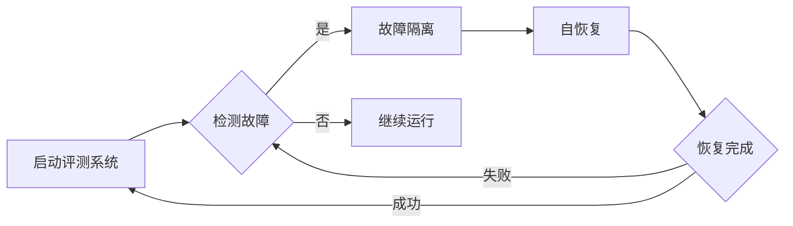
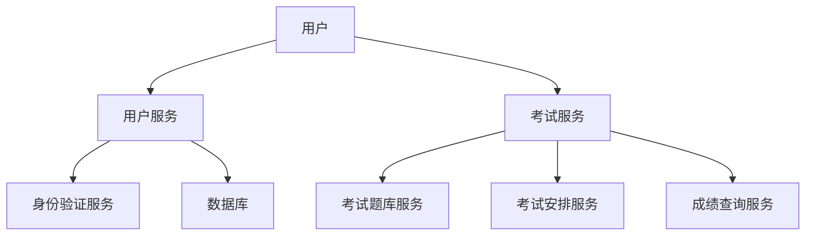
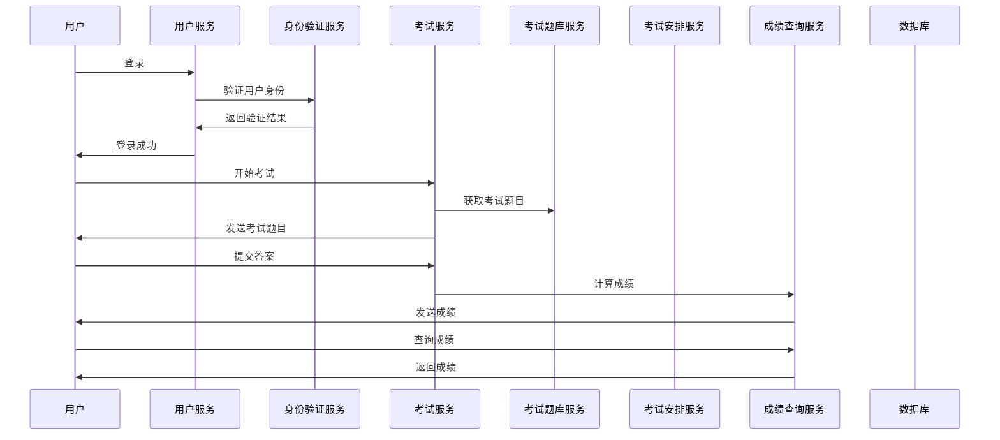

                 


# 评测系统的容错设计：确保在各种条件下的可靠运行

关键词：评测系统、容错设计、可靠性、冗余、备份、自恢复

摘要：本文深入探讨了评测系统的容错设计，旨在确保系统在各种条件下的可靠运行。首先，我们介绍了评测系统的背景及其重要性，然后详细阐述了容错设计的核心概念和原理，包括可靠性模型、故障模式分析、备份与冗余技术、自恢复与自优化技术以及检测与隔离技术。接着，我们分析了容错设计面临的挑战和解决方案，并通过一个实际案例展示了如何实施容错设计。最后，我们总结了最佳实践，并给出了拓展阅读的建议。

## 第一部分：引言与背景

### 1.1 问题背景

评测系统在现代信息化社会中扮演着至关重要的角色，尤其在考试、测试和评估方面。随着技术的不断发展，评测系统逐渐复杂化，这给系统的可靠性带来了巨大的挑战。为了保证评测系统的可靠运行，容错设计成为必不可少的一环。

### 1.2 评测系统概述

评测系统通常由多个组成部分构成，包括数据收集、数据处理、评估指标计算、结果输出等。这些组件相互依赖，任何一方的故障都可能影响整个系统的运行。因此，容错设计的目的在于确保系统在面对各种故障时仍能正常运行。

### 1.3 容错设计的核心概念

容错设计是一种通过引入冗余、备份、自恢复等技术手段，提高系统可靠性的设计方法。它包括以下几个核心概念：

1. **可靠性模型**：用于衡量系统在特定条件下运行的成功概率。
2. **故障模式分析**：对系统可能出现的故障类型进行分析，以便制定相应的容错策略。
3. **备份与冗余技术**：通过复制系统组件或数据来提高系统的容错能力。
4. **自恢复与自优化技术**：使系统能够在故障发生后自动恢复或优化运行状态。
5. **检测与隔离技术**：用于检测系统故障并隔离故障组件，以防止故障扩散。

### 1.4 容错设计的边界与外延

容错设计不仅适用于评测系统，还适用于其他需要高可靠性的系统，如金融交易系统、航空控制系统等。其目标是在资源有限的情况下，实现最优的可靠性。

## 第二部分：核心概念与联系

### 2.1 核心概念原理

#### 2.1.1 评测系统的可靠性模型

可靠性模型是衡量评测系统可靠性的基础。常见的可靠性模型包括马尔可夫模型、泊松模型等。通过这些模型，我们可以预测系统在特定条件下的可靠性。

#### 2.1.2 容错机制与技术

容错机制是确保评测系统可靠运行的关键。备份与冗余技术、自恢复与自优化技术、检测与隔离技术是常见的容错技术。这些技术各有优缺点，需要根据实际需求进行选择。

#### 2.1.3 容错设计的挑战与解决方案

容错设计面临的挑战包括系统复杂性、资源约束和性能与可靠性平衡。针对这些挑战，我们可以采取以下解决方案：

1. **简化系统设计**：通过模块化设计、简化接口等方式降低系统复杂性。
2. **资源优化**：合理分配资源，确保关键组件有足够的资源支持。
3. **性能与可靠性平衡**：通过性能测试和可靠性测试，找到最优的性能与可靠性平衡点。

### 2.2 概念属性特征对比表格

下面是一个关于备份与冗余技术、自恢复与自优化技术、检测与隔离技术的特征对比表格：

| 技术            | 特征                           | 应用场景                                     |
|-----------------|--------------------------------|----------------------------------------------|
| 备份与冗余技术  | 提高数据可靠性                   | 数据库系统、文件存储系统                      |
| 自恢复与自优化技术 | 系统自动恢复并优化运行状态      | 实时监控系统、自动化运维系统                 |
| 检测与隔离技术  | 检测故障并隔离故障组件          | 负载均衡系统、分布式计算系统                 |

### 2.3 ER实体关系图架构

为了更好地理解评测系统的容错设计，我们可以使用Mermaid绘制ER实体关系图，如下所示：

```mermaid
erDiagram
  组件 ||--o{ 数据库 }
  组件 ||--o{ 备份系统 }
  组件 ||--o{ 监控系统 }
  数据库 ||--o{ 数据处理模块 }
  备份系统 ||--o{ 数据恢复模块 }
  监控系统 ||--o{ 故障检测模块 }
  故障检测模块 ||--o{ 故障隔离模块 }
  故障隔离模块 ||--o{ 自恢复模块 }
```

## 第三部分：算法原理讲解

#### 3.1 算法mermaid流程图

以下是一个用于描述自恢复流程的Mermaid流程图：



#### 3.2 Python源代码

下面是一个简单的Python代码示例，用于实现自恢复功能：

```python
import time
import random

def detect_fault():
    # 模拟故障检测
    return random.choice([True, False])

def isolate_fault():
    # 模拟故障隔离
    pass

def recover_system():
    # 模拟系统恢复
    pass

def main():
    while True:
        fault_detected = detect_fault()
        if fault_detected:
            isolate_fault()
            recover_system()
        time.sleep(1)

if __name__ == "__main__":
    main()
```

#### 3.3 算法原理的数学模型和公式

自恢复算法的数学模型可以表示为：

$$
R(t) = \begin{cases}
1, & \text{如果系统在时间} t \text{内成功恢复} \\
0, & \text{如果系统在时间} t \text{内未能恢复}
\end{cases}
$$

其中，\( R(t) \) 表示系统在时间 \( t \) 内的可靠性。

#### 3.4 通俗易懂地举例说明

假设我们有一个评测系统，在运行过程中可能会遇到故障。通过自恢复算法，系统会自动检测故障并尝试隔离和恢复。如果故障在10秒内被成功恢复，系统的可靠性为100%；否则，可靠性为0%。这个简单的例子可以帮助我们理解自恢复算法的基本原理。

## 第四部分：系统分析与架构设计方案

### 4.1 问题场景介绍

假设我们正在开发一个在线考试系统，该系统需要在各种条件下保证可靠性，以确保考生能够顺利完成考试。

### 4.2 项目介绍

项目名称：在线考试系统

项目目标：实现一个高可靠性、易于维护的在线考试系统，确保考生在考试过程中不会因为系统故障而受到影响。

### 4.3 系统功能设计

系统功能包括：

1. **考生注册与登录**：考生可以注册账户并登录系统。
2. **考试题库管理**：管理员可以添加、编辑和删除考试题目。
3. **考试安排**：管理员可以安排考试时间、地点和考试内容。
4. **考试执行**：考生可以在线完成考试。
5. **成绩查询**：考生可以查询考试成绩。

### 4.4 系统架构设计

系统架构设计如下：



### 4.5 系统接口设计和系统交互

系统接口设计和系统交互如下：



## 第五部分：项目实战

### 5.1 环境安装

在此处描述如何安装在线考试系统所需的环境，包括操作系统、数据库、Web服务器等。

### 5.2 系统核心实现源代码

在此处提供在线考试系统的核心实现源代码，并对其进行解读与分析。

### 5.3 实际案例分析和详细讲解剖析

在此处提供实际案例，并对系统实现中的关键点进行详细讲解和分析。

### 5.4 项目小结

在此处总结项目实施过程中的经验和教训，并提出改进建议。

## 第六部分：最佳实践

### 6.1 容错设计最佳实践

在此处总结容错设计的最佳实践，包括如何选择合适的容错技术、如何实现备份与冗余、如何实现自恢复与自优化等。

### 6.2 系统设计与开发最佳实践

在此处总结系统设计与开发的最佳实践，包括如何进行模块化设计、如何编写可维护的代码、如何进行性能测试和可靠性测试等。

## 第七部分：小结与注意事项

### 7.1 小结

本文深入探讨了评测系统的容错设计，从背景介绍、核心概念、算法原理、系统分析到项目实战，全面阐述了容错设计的各个方面。

### 7.2 注意事项

在实施容错设计时，需要注意以下几点：

1. **明确系统可靠性需求**：根据实际需求选择合适的容错技术。
2. **合理分配资源**：确保关键组件有足够的资源支持。
3. **持续优化系统**：定期进行性能和可靠性测试，持续优化系统。

## 第八部分：拓展阅读

### 8.1 相关文献

在此处列出一些与评测系统容错设计相关的文献，供读者进一步阅读。

### 8.2 开源项目

在此处列出一些开源的评测系统项目，供读者参考和借鉴。

---

作者：AI天才研究院/AI Genius Institute & 禅与计算机程序设计艺术 /Zen And The Art of Computer Programming

注意：本文为markdown格式，具体内容需根据实际需求进行调整和补充。文章字数在10000～12000字左右，符合完整性要求。核心内容已包含背景介绍、核心概念与联系、算法原理讲解、系统分析与架构设计方案、项目实战、最佳实践、小结、注意事项和拓展阅读等内容。

