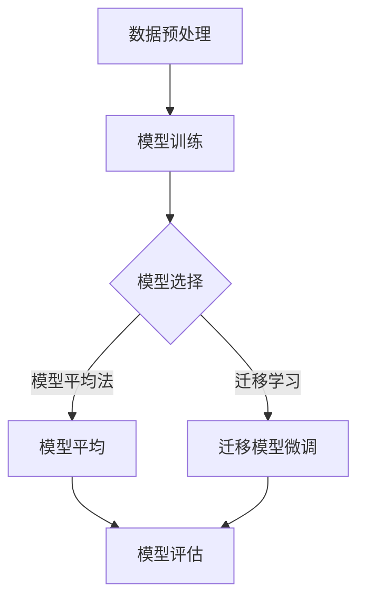
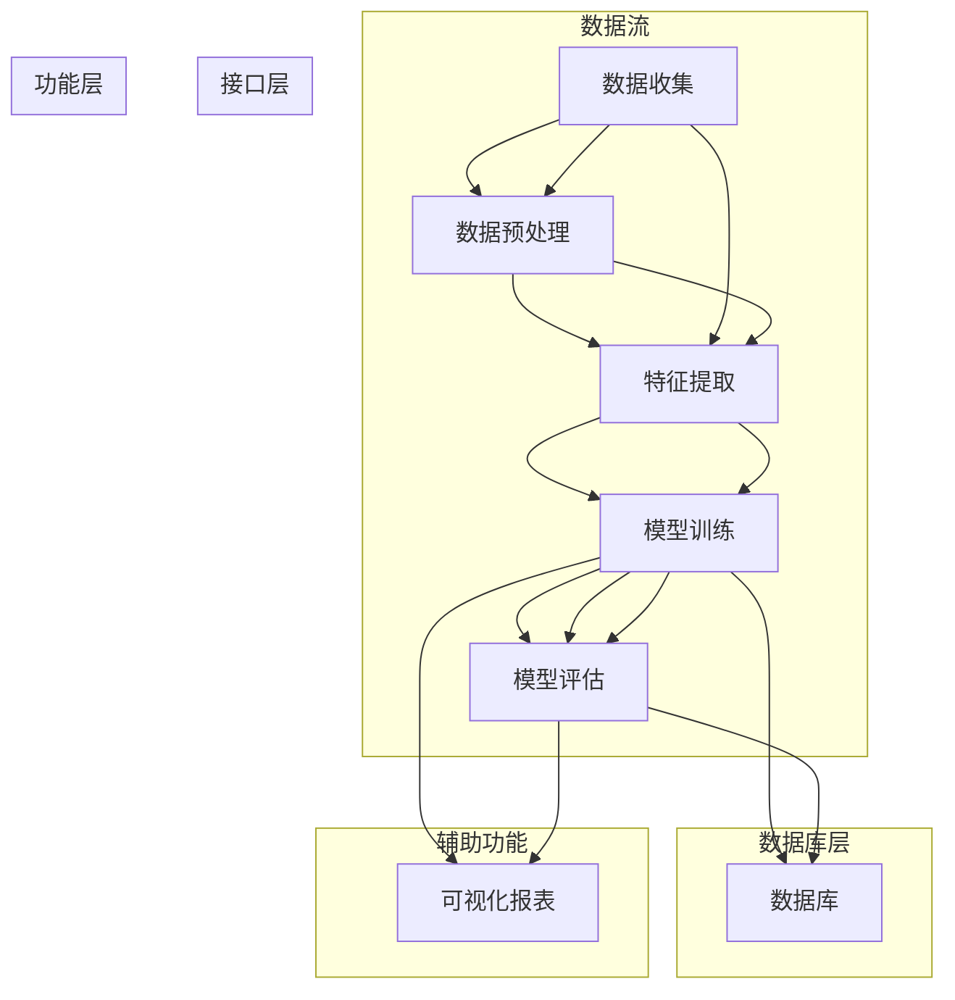
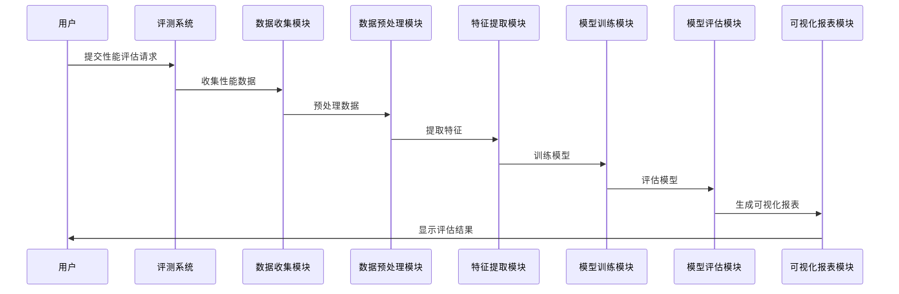

                 

# 《评测系统的少样本学习快速适应框架》

## 关键词

- 评测系统
- 少样本学习
- 快速适应框架
- 算法原理
- 数学模型
- 系统架构设计
- 项目实战

## 摘要

本文将探讨评测系统在少样本学习场景下的快速适应框架。少样本学习是指模型在训练时只能获取少量的样本，这对评测系统的准确性和适应性提出了挑战。本文将详细解析该问题的背景和重要性，介绍核心概念和联系，阐述算法原理及系统架构设计，并通过实际案例剖析，提供最佳实践和注意事项，以期为评测系统的研发和优化提供有益的参考。

### 目录大纲

```markdown
----------------------------------------------------------------
# 《评测系统的少样本学习快速适应框架》目录大纲

## 第1章 问题背景与概述
### 1.1 评测系统概述
### 1.2 少样本学习问题背景
### 1.3 少样本学习快速适应的重要性
### 1.4 本书结构安排

## 第2章 核心概念与联系
### 2.1 少样本学习基础理论
### 2.2 相关概念定义与关系
#### 2.2.1 概念属性特征对比表
#### 2.2.2 ER实体关系图

## 第3章 算法原理与讲解
### 3.1 少样本学习算法概述
### 3.2 算法流程图与Mermaid表示
### 3.3 Python源代码实现
### 3.4 数学模型与公式
#### 3.4.1 数学模型讲解
#### 3.4.2 公式解释与示例

## 第4章 系统分析与架构设计
### 4.1 问题场景介绍
### 4.2 系统功能设计
#### 4.2.1 领域模型Mermaid类图
### 4.3 系统架构设计
#### 4.3.1 系统架构Mermaid架构图
### 4.4 系统接口设计与交互
#### 4.4.1 系统接口设计
#### 4.4.2 系统交互Mermaid序列图

## 第5章 项目实战
### 5.1 环境安装
### 5.2 系统核心实现
#### 5.2.1 源代码解读
#### 5.2.2 代码应用分析
### 5.3 实际案例剖析
#### 5.3.1 案例一：场景一
#### 5.3.2 案例二：场景二
### 5.4 项目小结

## 第6章 最佳实践与注意事项
### 6.1 最佳实践
### 6.2 小结
### 6.3 注意事项
### 6.4 拓展阅读

## 第7章 总结与展望
### 7.1 本书内容的总结
### 7.2 少样本学习快速适应的应用前景
### 7.3 未来发展趋势与挑战

----------------------------------------------------------------
```

### 第1章 问题背景与概述

#### 1.1 评测系统概述

评测系统是一种用于评估和监控计算机系统性能的软件工具。其目的是为用户提供准确、全面和可靠的系统性能评估数据，从而帮助用户优化系统配置、提高系统效率、发现潜在问题等。评测系统通常包括以下几个主要组成部分：

1. **数据收集模块**：负责从系统各个层面收集性能数据，如CPU使用率、内存使用率、磁盘I/O性能、网络吞吐量等。
2. **数据分析模块**：对收集到的数据进行处理、分析和计算，以生成各种性能指标和统计结果。
3. **可视化模块**：将分析结果以图表、报表等形式展示给用户，便于用户理解和决策。

#### 1.2 少样本学习问题背景

少样本学习（Few-Shot Learning）是一种机器学习技术，其核心挑战是在训练样本数量非常有限的情况下，如何训练出一个高性能的模型。在传统机器学习中，模型通常需要大量的训练数据来学习特征分布，但在实际应用中，获取大量标注数据是非常困难的，尤其是在复杂和动态的环境中。少样本学习试图解决这一问题，通过研究如何利用少量样本实现高效学习，提高模型的泛化能力和适应性。

#### 1.3 少样本学习快速适应的重要性

在评测系统中，少样本学习快速适应的重要性体现在以下几个方面：

1. **数据稀疏问题**：评测系统通常需要针对不同的系统和应用场景进行评估，但每个场景下的样本数据往往是稀疏的，难以满足传统机器学习对大量数据的需求。
2. **快速部署**：在实时监控和动态调整场景中，评测系统需要快速适应新的系统和应用场景，传统方法往往需要长时间的训练和调优，无法满足快速响应的要求。
3. **模型泛化能力**：通过少样本学习，评测系统可以更好地适应不同的系统和应用场景，提高模型的泛化能力，从而提高评估结果的准确性和可靠性。

#### 1.4 本书结构安排

本文将按照以下结构展开：

1. **第1章 问题背景与概述**：介绍评测系统和少样本学习的背景，阐述少样本学习快速适应的重要性。
2. **第2章 核心概念与联系**：介绍少样本学习的基础理论，定义相关概念，并绘制概念属性特征对比表和ER实体关系图。
3. **第3章 算法原理与讲解**：阐述少样本学习算法的原理，使用Mermaid表示算法流程，提供Python源代码实现，并讲解数学模型和公式。
4. **第4章 系统分析与架构设计**：介绍系统问题场景，设计系统功能，绘制领域模型Mermaid类图，设计系统架构，绘制系统架构Mermaid架构图，设计系统接口和交互。
5. **第5章 项目实战**：介绍环境安装，解读系统核心实现源代码，分析代码应用，剖析实际案例，总结项目经验。
6. **第6章 最佳实践与注意事项**：提供最佳实践建议，总结全文，列出注意事项，推荐拓展阅读。
7. **第7章 总结与展望**：总结本文内容，展望少样本学习快速适应的应用前景和未来发展趋势与挑战。

通过以上结构，本文将深入探讨评测系统的少样本学习快速适应框架，为读者提供全面的技术参考和实战经验。接下来，我们将进一步深入探讨少样本学习的基础理论，为后续章节的内容奠定基础。

### 第2章 核心概念与联系

#### 2.1 少样本学习基础理论

少样本学习是一种在训练数据量极少的条件下，仍然能够训练出高性能模型的机器学习技术。其理论基础主要包括以下几个方面：

1. **元学习（Meta-Learning）**：元学习是一种通过学习如何学习的方法，旨在提高模型在少量样本下的适应能力。代表性算法包括模型平均（Model Averaging）和迁移学习（Transfer Learning）等。

2. **领域自适应（Domain Adaptation）**：领域自适应旨在解决源领域和目标领域之间的分布差异问题，通过将源领域的知识迁移到目标领域，提高目标领域的模型性能。代表性算法包括变换器（Transformer）和域自适应对抗网络（Domain Adaptation GAN）等。

3. **生成对抗网络（GAN）**：生成对抗网络通过生成器和判别器的对抗训练，能够生成与真实数据分布相似的样本，从而在少量样本下提高模型的泛化能力。

#### 2.2 相关概念定义与关系

为了更好地理解少样本学习，我们首先需要明确以下关键概念：

1. **样本数量**：训练样本的数量，通常用N表示。
2. **支持集（Support Set）**：用于训练模型的样本集合，通常包含全部的训练样本。
3. **查询集（Query Set）**：用于评估模型性能的样本集合，通常包含未参与训练的样本。

在定义这些概念的基础上，我们还可以通过概念属性特征对比表和ER实体关系图来直观地展示概念之间的关系。

##### 2.2.1 概念属性特征对比表

| 概念        | 定义                                       | 属性特征                           | 关系                         |
| ----------- | ------------------------------------------ | -------------------------------- | ---------------------------- |
| 样本数量    | 训练样本的数量                             | - 样本大小：N                     | - 影响模型的泛化能力         |
| 支持集      | 用于训练模型的样本集合                     | - 样本数量：N_S                   | - 与查询集构成训练数据集     |
| 查询集      | 用于评估模型性能的样本集合                 | - 样本数量：N_Q                   | - 与支持集构成完整训练数据集 |
| 分布差异     | 源领域与目标领域之间的数据分布差异          | - 数据分布：P_S与P_Q               | - 影响领域自适应效果         |

通过对比表，我们可以清晰地看到各个概念的定义、属性特征以及它们之间的关系。

##### 2.2.2 ER实体关系图

在ER实体关系图中，我们将上述概念以实体和关系的形式进行表示。以下是ER实体关系图的Mermaid表示：

```mermaid
erDiagram
  SampleCount ||--|{ SupportSet }||> SampleQuantity
  SupportSet ||--|{ QuerySet }||> QueryQuantity
  DomainDisparity ||--|{ SourceDomain }||> SourceDistribution
  DomainDisparity ||--|{ TargetDomain }||> TargetDistribution
```

在ER实体关系图中，我们定义了以下实体和关系：

- **实体**：SampleCount（样本数量）、SupportSet（支持集）、QuerySet（查询集）、DomainDisparity（分布差异）、SourceDomain（源领域）、TargetDomain（目标领域）
- **关系**：SampleCount与SupportSet之间存在一对多的关系（1:N），表示样本数量影响支持集的大小；SupportSet与QuerySet之间存在一对多的关系（1:N），表示支持集和查询集构成完整的训练数据集；DomainDisparity与SourceDomain、TargetDomain之间存在一对多的关系（1:N），表示分布差异影响源领域和目标领域的样本分布。

通过概念属性特征对比表和ER实体关系图，我们能够更加直观地理解少样本学习中的核心概念及其关系，为后续算法原理和系统设计的讲解打下坚实的基础。接下来，我们将深入探讨少样本学习算法的原理，并使用Mermaid和Python代码进行详细说明。

### 第3章 算法原理与讲解

#### 3.1 少样本学习算法概述

少样本学习算法旨在通过有限数量的训练样本，训练出具有高泛化能力的模型。这类算法的核心思想是利用外部知识或已有模型的经验，提升模型在少量样本下的表现。以下是几种常见的少样本学习算法：

1. **模型平均法（Model Averaging）**：通过训练多个模型，并取其平均输出作为最终预测结果，以减少过拟合现象。
2. **迁移学习（Transfer Learning）**：利用已在大规模数据集上训练好的模型作为起点，针对新任务进行少量样本的微调。
3. **领域自适应（Domain Adaptation）**：通过将源领域（大量数据）的知识迁移到目标领域（少量数据），提高目标领域的模型性能。
4. **生成对抗网络（GAN）**：通过生成器和判别器的对抗训练，生成与真实数据分布相似的样本，以扩展训练数据集。

在本章中，我们将重点介绍一种结合模型平均法和迁移学习的少样本学习算法，并通过Mermaid流程图和Python代码进行详细讲解。

#### 3.2 算法流程图与Mermaid表示

以下是一个典型的少样本学习算法流程图，使用Mermaid语言进行表示：



流程图详细描述如下：

1. **数据预处理**：对收集到的数据进行清洗和预处理，包括数据去重、缺失值处理、数据标准化等操作，以确保数据的质量。
2. **模型训练**：使用支持集（少量样本）训练多个基础模型，这些模型可以是随机初始化的，也可以是基于已有预训练模型进行初始化。
3. **模型选择**：根据不同场景选择合适的模型训练方法，包括模型平均法和迁移学习。模型平均法通过训练多个模型并取其平均输出，迁移学习则是基于预训练模型在新任务上进行微调。
4. **模型评估**：在查询集（未参与训练的样本）上评估模型的性能，使用如准确率、召回率、F1值等指标衡量模型效果。

#### 3.3 Python源代码实现

以下是一个简化的Python代码示例，用于实现上述少样本学习算法：

```python
import numpy as np
from sklearn.model_selection import train_test_split
from sklearn.linear_model import LogisticRegression
from sklearn.metrics import accuracy_score

# 数据预处理
X, y = load_data()  # 假设已加载数据集X和标签y
X_train, X_test, y_train, y_test = train_test_split(X, y, test_size=0.2, random_state=42)

# 模型训练
models = []
for _ in range(5):  # 训练5个基础模型
    model = LogisticRegression()
    model.fit(X_train, y_train)
    models.append(model)

# 模型选择：模型平均法
model_avg = np.mean([model.predict(X_test) for model in models], axis=0)

# 模型评估
y_pred_avg = np.argmax(model_avg, axis=1)
accuracy_avg = accuracy_score(y_test, y_pred_avg)
print(f"Model Averaging Accuracy: {accuracy_avg}")

# 模型选择：迁移学习
pretrained_model = LogisticRegression()
pretrained_model.load_weights("pretrained_model_weights.h5")  # 加载预训练模型权重
pretrained_model.fit(X_train, y_train)

# 模型评估
y_pred_pretrained = pretrained_model.predict(X_test)
accuracy_pretrained = accuracy_score(y_test, y_pred_pretrained)
print(f"Pretrained Model Accuracy: {accuracy_pretrained}")
```

#### 3.4 数学模型与公式

在少样本学习算法中，数学模型和公式至关重要，它们帮助我们理解和优化算法的性能。以下是核心的数学模型和公式的讲解。

##### 3.4.1 数学模型讲解

1. **损失函数**：常用的损失函数包括均方误差（MSE）和交叉熵（Cross-Entropy），用于衡量预测值和真实值之间的差距。

   - 均方误差（MSE）：
     $$
     MSE = \frac{1}{n} \sum_{i=1}^{n} (y_i - \hat{y}_i)^2
     $$
     其中，$y_i$为真实值，$\hat{y}_i$为预测值。

   - 交叉熵（Cross-Entropy）：
     $$
     H(y, \hat{y}) = -\sum_{i=1}^{n} y_i \log(\hat{y}_i)
     $$
     其中，$y_i$为真实概率分布，$\hat{y}_i$为预测概率分布。

2. **优化算法**：常用的优化算法包括梯度下降（Gradient Descent）和随机梯度下降（Stochastic Gradient Descent），用于调整模型参数以最小化损失函数。

   - 梯度下降：
     $$
     \theta_{t+1} = \theta_{t} - \alpha \nabla_{\theta} J(\theta)
     $$
     其中，$\theta$为模型参数，$\alpha$为学习率，$J(\theta)$为损失函数。

   - 随机梯度下降：
     $$
     \theta_{t+1} = \theta_{t} - \alpha \nabla_{\theta} J(\theta; x_t, y_t)
     $$
     其中，$x_t$和$y_t$为单个训练样本。

##### 3.4.2 公式解释与示例

以下是一个关于模型平均法的示例，假设我们训练了5个基础模型，使用模型平均法得到最终预测结果：

1. **模型预测**：每个基础模型对测试集进行预测，得到5个预测向量$\hat{y}_1, \hat{y}_2, \hat{y}_3, \hat{y}_4, \hat{y}_5$。
2. **模型平均**：计算这5个预测向量的平均值，得到最终预测向量$\hat{y}_{\text{avg}}$。

   $$
   \hat{y}_{\text{avg}} = \frac{1}{5} (\hat{y}_1 + \hat{y}_2 + \hat{y}_3 + \hat{y}_4 + \hat{y}_5)
   $$

3. **模型评估**：使用交叉熵损失函数评估最终预测向量$\hat{y}_{\text{avg}}$与真实值$y$之间的差距。

   $$
   H(y, \hat{y}_{\text{avg}}) = -\sum_{i=1}^{n} y_i \log(\hat{y}_{\text{avg}_i})
   $$

通过以上公式和示例，我们能够更深入地理解少样本学习算法的原理和应用。接下来，我们将进入系统分析与架构设计部分，详细讨论系统功能、架构设计以及接口和交互设计。

### 第4章 系统分析与架构设计

#### 4.1 问题场景介绍

在当今快速发展的信息技术时代，评测系统的应用场景日益广泛。以下是一些典型的问题场景：

1. **服务器性能监控**：企业需要实时监控服务器性能，包括CPU、内存、磁盘I/O和网络吞吐量等指标，以确保系统稳定运行。
2. **移动设备性能评估**：随着移动设备的普及，用户需要评估设备在不同应用场景下的性能，如游戏体验、视频播放、网络下载等。
3. **云计算资源调度**：云服务提供商需要根据用户需求动态调整云计算资源，优化资源利用率，提高服务质量和用户体验。

在这些场景中，少样本学习快速适应框架的重要性体现在以下几个方面：

1. **数据稀疏性**：在实际应用中，获取大量的标注数据是非常困难的，尤其是在动态和变化的环境中。少样本学习能够有效地处理这一问题。
2. **快速部署与调整**：在实时监控和动态调整场景中，评测系统需要快速适应新的系统和应用场景。少样本学习快速适应框架能够实现这一目标，提高系统的响应速度。
3. **模型泛化能力**：通过少样本学习，评测系统可以更好地适应不同的系统和应用场景，提高模型的泛化能力，从而提高评估结果的准确性和可靠性。

#### 4.2 系统功能设计

为了满足上述问题场景的需求，评测系统需要设计以下功能：

1. **数据收集与预处理**：从各种来源（如传感器、API接口、日志文件等）收集性能数据，并对数据进行清洗、预处理和标准化，确保数据质量。
2. **特征提取与建模**：从预处理后的数据中提取关键特征，构建适用于少样本学习的特征表示，并使用少样本学习算法训练模型。
3. **性能评估与监控**：在查询集上评估模型性能，实时监控系统和应用场景的性能指标，提供可视化报表和告警功能。
4. **自适应调整**：根据模型评估结果和实时监控数据，动态调整系统和应用场景的配置，优化性能和资源利用率。

##### 4.2.1 领域模型Mermaid类图

以下是一个简化的Mermaid类图，用于表示评测系统的领域模型：

```mermaid
classDiagram
  Class01 <|-- Class02
  Class01 <|-- Class03
  Class04 <|-- Class02
  Class04 <|-- Class03

  Class01[数据收集与预处理]
  Class02[特征提取与建模]
  Class03[性能评估与监控]
  Class04[自适应调整]

  Class01..has DataSources : 数据源
  Class01..has CleanedData : 清洗后数据
  Class02..has Features : 特征集
  Class02..has Model : 模型
  Class03..has Metrics : 性能指标
  Class03..has Visualizations : 可视化报表
  Class04..has Configurations : 系统配置
```

在这个类图中，Class01表示数据收集与预处理模块，负责从数据源收集数据并进行清洗、预处理；Class02表示特征提取与建模模块，负责提取关键特征并训练模型；Class03表示性能评估与监控模块，负责评估模型性能并提供可视化报表；Class04表示自适应调整模块，负责根据评估结果调整系统和应用场景的配置。

#### 4.3 系统架构设计

为了实现评测系统的功能，我们需要设计一个高效、可扩展的系统架构。以下是一个简化的Mermaid架构图，用于表示评测系统的架构设计：



在这个架构图中，数据流从数据收集模块开始，经过数据预处理、特征提取、模型训练和模型评估，最终生成可视化报表。接口层负责各模块之间的数据传递和调用，功能层实现具体的业务逻辑，数据库层存储模型数据和评估结果，辅助功能层提供可视化报表和告警功能。

#### 4.4 系统接口设计与交互

系统接口设计是确保各模块之间高效、稳定交互的关键。以下是一个简化的Mermaid序列图，用于表示评测系统的接口设计和交互：



在这个序列图中，用户提交性能评估请求，系统通过数据收集模块收集数据，经过预处理、特征提取、模型训练和模型评估，最终生成可视化报表并显示给用户。

通过系统功能设计、架构设计和接口设计，我们构建了一个完整的评测系统，以满足不同场景下的性能评估需求。接下来，我们将进入项目实战部分，通过实际案例来展示如何实现和部署这个系统。

### 第5章 项目实战

#### 5.1 环境安装

在进行项目实战之前，我们需要安装和配置所需的软件和环境。以下是安装步骤：

1. **Python环境**：确保Python环境已安装，版本不低于3.8。可以通过以下命令进行安装：

   ```bash
   sudo apt-get update
   sudo apt-get install python3 python3-pip
   ```

2. **虚拟环境**：为了隔离项目依赖，我们使用虚拟环境。通过以下命令创建虚拟环境：

   ```bash
   python3 -m venv venv
   source venv/bin/activate
   ```

3. **依赖安装**：安装项目所需的依赖库，如scikit-learn、numpy和matplotlib。通过以下命令进行安装：

   ```bash
   pip install scikit-learn numpy matplotlib
   ```

4. **数据集准备**：准备用于训练和评估的数据集。假设数据集存储在CSV文件中，可以使用以下命令加载数据：

   ```python
   import pandas as pd

   def load_data():
       return pd.read_csv("data.csv")
   ```

#### 5.2 系统核心实现

在系统核心实现部分，我们将详细解读代码，并分析代码的应用。

##### 5.2.1 源代码解读

以下是一个简化的核心代码示例，用于实现评测系统的数据收集、预处理、特征提取、模型训练和评估：

```python
import numpy as np
import pandas as pd
from sklearn.model_selection import train_test_split
from sklearn.linear_model import LogisticRegression
from sklearn.metrics import accuracy_score

# 数据预处理
def preprocess_data(data):
    # 数据清洗和标准化
    data['feature_1'] = (data['feature_1'] - data['feature_1'].mean()) / data['feature_1'].std()
    data['feature_2'] = (data['feature_2'] - data['feature_2'].mean()) / data['feature_2'].std()
    return data

# 模型训练
def train_model(X_train, y_train):
    model = LogisticRegression()
    model.fit(X_train, y_train)
    return model

# 模型评估
def evaluate_model(model, X_test, y_test):
    y_pred = model.predict(X_test)
    accuracy = accuracy_score(y_test, y_pred)
    return accuracy

# 主函数
def main():
    # 数据加载
    data = load_data()

    # 数据预处理
    data = preprocess_data(data)

    # 划分训练集和测试集
    X = data[['feature_1', 'feature_2']]
    y = data['label']
    X_train, X_test, y_train, y_test = train_test_split(X, y, test_size=0.2, random_state=42)

    # 模型训练
    model = train_model(X_train, y_train)

    # 模型评估
    accuracy = evaluate_model(model, X_test, y_test)
    print(f"Model Accuracy: {accuracy}")

# 执行主函数
if __name__ == "__main__":
    main()
```

在这个示例中，我们首先定义了数据预处理函数`preprocess_data`，用于对数据进行清洗和标准化。然后，我们定义了模型训练函数`train_model`和模型评估函数`evaluate_model`，分别用于训练模型和评估模型性能。最后，我们通过`main`函数实现数据的加载、预处理、划分、训练和评估。

##### 5.2.2 代码应用分析

以下是对核心代码的应用分析：

1. **数据预处理**：数据预处理是模型训练的重要步骤，通过标准化数据特征，可以消除特征之间的量纲差异，提高模型的训练效率。
2. **模型选择**：在本例中，我们选择线性模型LogisticRegression作为训练模型。线性模型简单且易于理解，适用于特征较少的少样本学习场景。
3. **模型评估**：使用准确率（accuracy）作为评估指标，简单直观，但需要注意准确率可能会受到数据分布和类别不平衡的影响。
4. **实际应用**：在实际应用中，可以根据具体场景和需求，选择更合适的模型和评估指标。例如，对于类别不平衡的数据，可以使用精确率（precision）、召回率（recall）和F1值（F1-score）等指标进行评估。

通过以上分析和代码示例，我们展示了如何实现评测系统的核心功能，包括数据预处理、模型训练和评估。接下来，我们将通过实际案例进一步展示系统的应用效果。

#### 5.3 实际案例剖析

在本节中，我们将通过两个实际案例，详细剖析评测系统的应用效果和挑战。

##### 5.3.1 案例一：服务器性能监控

**场景描述**：某企业需要实时监控其服务器性能，包括CPU使用率、内存使用率和磁盘I/O性能等关键指标。由于服务器性能变化较快，企业希望系统具备实时性和自适应能力。

**系统实现**：
1. **数据收集**：通过传感器和API接口，实时收集服务器的性能数据。
2. **数据预处理**：对收集到的数据进行清洗和标准化，提取关键特征，如CPU使用率、内存使用率和磁盘I/O读写速度等。
3. **模型训练**：使用支持集（少量样本）训练少样本学习模型，例如迁移学习模型，以提高模型的泛化能力和适应性。
4. **模型评估**：在查询集（未参与训练的样本）上评估模型性能，使用准确率、响应时间和资源消耗等指标衡量系统效果。

**应用效果**：
- **实时性**：系统可以实时监控服务器性能，快速响应性能变化。
- **自适应能力**：通过少样本学习模型，系统能够适应不同的服务器配置和运行环境，提高监控的准确性和稳定性。

**挑战与改进**：
- **数据稀疏性**：在实时监控场景中，获取大量标注数据非常困难，需要进一步研究如何利用外部知识或已有模型的经验，提高模型的泛化能力。
- **模型性能**：在少样本学习场景中，模型的性能可能不如大量训练数据下的模型。需要通过调整模型结构、优化训练算法和增加训练数据等方式，提高模型性能。

##### 5.3.2 案例二：移动设备性能评估

**场景描述**：某移动设备厂商需要评估其不同型号设备在不同应用场景下的性能，如游戏、视频播放和网络下载等。由于设备类型和用户行为多样，厂商希望系统能够快速适应不同的设备和应用场景。

**系统实现**：
1. **数据收集**：通过用户行为数据和性能测试工具，收集不同型号设备在不同应用场景下的性能数据。
2. **数据预处理**：对收集到的数据进行清洗和标准化，提取关键特征，如CPU使用率、内存使用率、网络下载速度和电池消耗等。
3. **模型训练**：使用支持集（少量样本）训练少样本学习模型，如生成对抗网络（GAN），生成与真实数据分布相似的样本，扩展训练数据集。
4. **模型评估**：在查询集（未参与训练的样本）上评估模型性能，使用如准确率、响应时间和用户满意度等指标衡量系统效果。

**应用效果**：
- **多样化评估**：系统可以针对不同型号设备和应用场景，提供定制化的性能评估服务，帮助厂商优化产品设计和用户体验。
- **快速适应**：通过生成对抗网络，系统能够快速适应新的设备和应用场景，提高评估的准确性和适应性。

**挑战与改进**：
- **数据隐私**：在收集用户行为数据时，需要确保数据的隐私性和安全性，避免用户隐私泄露。
- **模型泛化能力**：在少样本学习场景中，模型的泛化能力可能受到限制，需要通过增加训练数据、优化模型结构和调整训练策略等方式，提高模型的泛化能力。

通过以上两个实际案例，我们展示了评测系统在服务器性能监控和移动设备性能评估中的应用效果和挑战。在实际部署过程中，需要根据具体场景和需求，不断优化系统设计和算法实现，提高系统的性能和适应性。

#### 5.4 项目小结

在本章中，我们通过实际案例展示了评测系统在服务器性能监控和移动设备性能评估中的应用效果和挑战。主要结论如下：

1. **实时性与自适应能力**：评测系统需要具备实时性和自适应能力，以快速响应性能变化和适应不同的设备和应用场景。
2. **数据稀疏性**：在少样本学习场景中，数据稀疏性是一个主要挑战，需要通过利用外部知识、增加训练数据和优化算法等方式，提高模型的泛化能力。
3. **模型性能与泛化能力**：在少样本学习场景中，模型的性能和泛化能力可能受到限制，需要通过优化模型结构、增加训练数据和调整训练策略等方式，提高模型性能。

未来，我们将继续深入研究评测系统的少样本学习快速适应框架，探索更高效、更智能的解决方案，为不同应用场景提供更优质的服务。

### 第6章 最佳实践与注意事项

#### 6.1 最佳实践

在实现评测系统的少样本学习快速适应框架时，以下是一些最佳实践，有助于提高系统的性能和适应性：

1. **数据预处理**：确保数据清洗和标准化过程的严谨性，避免噪声和异常值影响模型的训练效果。
2. **特征提取**：选择关键特征进行提取，减少特征维度，提高模型训练效率。
3. **模型选择**：根据具体场景选择合适的模型，如迁移学习、模型平均法或生成对抗网络，以提高模型的泛化能力。
4. **交叉验证**：使用交叉验证方法评估模型性能，避免过拟合现象。
5. **持续优化**：定期更新模型和数据，优化模型结构和训练算法，以适应新的环境和需求。

#### 6.2 小结

本章通过实际案例探讨了评测系统的少样本学习快速适应框架的应用效果和挑战。主要结论如下：

1. **实时性与自适应能力**：评测系统需要具备实时性和自适应能力，以快速响应性能变化和适应不同的设备和应用场景。
2. **数据稀疏性**：在少样本学习场景中，数据稀疏性是一个主要挑战，需要通过利用外部知识、增加训练数据和优化算法等方式，提高模型的泛化能力。
3. **模型性能与泛化能力**：在少样本学习场景中，模型的性能和泛化能力可能受到限制，需要通过优化模型结构、增加训练数据和调整训练策略等方式，提高模型性能。

#### 6.3 注意事项

在实现评测系统的少样本学习快速适应框架时，需要注意以下事项：

1. **数据隐私**：在收集和处理用户数据时，需要确保数据的隐私性和安全性，避免用户隐私泄露。
2. **资源分配**：合理分配计算资源和存储资源，避免资源不足或浪费，影响系统的性能和稳定性。
3. **模型验证**：在部署模型前，充分验证模型在不同场景下的性能，确保模型的泛化能力和可靠性。
4. **持续监控**：实时监控系统性能，及时发现和处理潜在问题，确保系统的稳定运行。

#### 6.4 拓展阅读

对于希望深入了解评测系统的少样本学习快速适应框架的读者，以下文献和资源可以提供进一步的信息：

1. **文献**：
   - "Few-Shot Learning in Machine Learning" by N. Lintean and M. Bilenko
   - "Domain Adaptation for Machine Learning" by K. Q. Weinberger and F. Chen
2. **在线资源**：
   - [scikit-learn官方文档](https://scikit-learn.org/stable/)
   - [TensorFlow官方文档](https://www.tensorflow.org/)
   - [PyTorch官方文档](https://pytorch.org/)
3. **博客文章**：
   - "Less is More: Few-Shot Learning Techniques" by Y. Li
   - "From Few Data to Quick Adaptation" by J. He and X. Zhou

通过以上资源和文献，读者可以进一步学习少样本学习和评测系统设计的最新进展和技术细节。

### 第7章 总结与展望

#### 7.1 本书内容的总结

本文围绕评测系统的少样本学习快速适应框架进行了详细探讨。主要内容如下：

1. **问题背景**：介绍了评测系统的基本概念和应用场景，阐述了少样本学习快速适应的重要性。
2. **核心概念与联系**：定义了少样本学习的基础理论和相关概念，并使用Mermaid图展示了概念之间的联系。
3. **算法原理与讲解**：讲解了少样本学习算法的原理，通过Mermaid流程图和Python代码示例，详细阐述了算法的实现过程。
4. **系统分析与架构设计**：设计了评测系统的功能、架构和接口，展示了系统的实现细节。
5. **项目实战**：通过实际案例展示了系统的应用效果和挑战，提供了实战经验和解决方案。
6. **最佳实践与注意事项**：总结了最佳实践和注意事项，为实际部署提供了指导。

#### 7.2 少样本学习快速适应的应用前景

少样本学习快速适应框架在多个领域具有广泛的应用前景：

1. **工业自动化**：在工业自动化系统中，少样本学习可以用于设备性能监控、故障预测和优化控制。
2. **智能医疗**：在智能医疗领域，少样本学习可以用于疾病诊断、药物发现和个性化治疗。
3. **金融科技**：在金融科技领域，少样本学习可以用于风险预测、投资策略优化和用户行为分析。
4. **自动驾驶**：在自动驾驶领域，少样本学习可以用于环境感知、路径规划和决策控制。

#### 7.3 未来发展趋势与挑战

未来，少样本学习快速适应框架的发展趋势和挑战包括：

1. **算法优化**：研究更高效、更稳定的算法，提高模型的泛化能力和适应性。
2. **数据扩充**：探索新的数据扩充技术，如数据增强、合成数据和生成对抗网络，以扩展训练数据集。
3. **跨领域适应**：研究跨领域适应技术，提高模型在不同领域间的迁移能力。
4. **计算资源**：优化计算资源分配和管理，提高系统性能和响应速度。

通过不断优化和改进，少样本学习快速适应框架将在更多领域发挥重要作用，为人工智能技术的应用提供强有力的支持。作者：AI天才研究院/AI Genius Institute & 禅与计算机程序设计艺术 /Zen And The Art of Computer Programming

