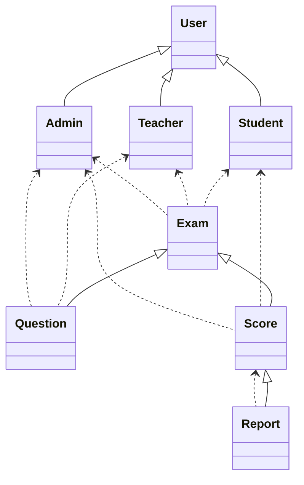
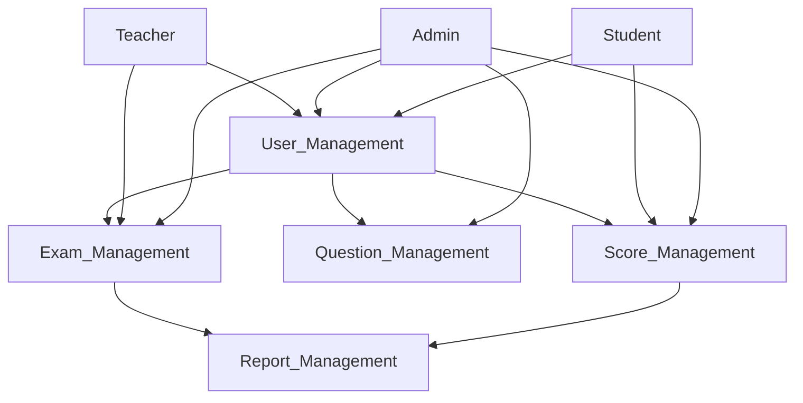
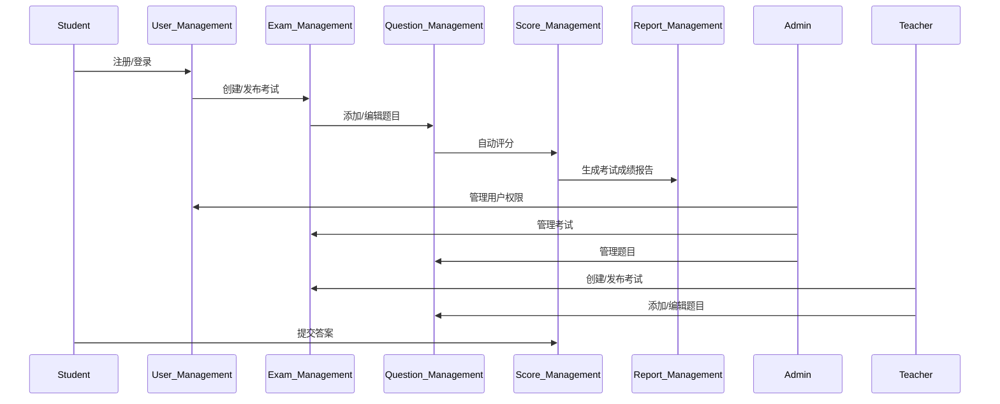

                 

### 文章标题

# 《评测系统的强化学习探索与利用平衡》

### 关键词

- 评测系统
- 强化学习
- 平衡策略
- 算法原理
- 应用场景

### 摘要

本文深入探讨了评测系统中的强化学习技术，以及如何平衡强化学习在评测系统中的应用。通过详细分析强化学习的基本原理、评测系统的设计与实现，以及强化学习在评测系统中的实际应用，本文提出了有效的平衡策略，旨在优化评测系统的性能和可靠性。本文将为从事评测系统开发的技术人员提供宝贵的理论和实践经验，同时也为强化学习在评测系统领域的应用提供新的思路。

---

### 引言

#### 1.1 问题背景

在信息技术高速发展的时代，评测系统在各类应用中扮演着关键角色。例如，在线考试系统、游戏评分系统、推荐系统等，都需要对用户行为、系统性能、评价标准进行精准评测。随着评测系统复杂性的增加，传统的评测方法已经无法满足高效、精准的要求。因此，探索新的评测技术，特别是强化学习，成为当前的研究热点。

#### 1.2 问题描述

评测系统面临的主要问题包括：如何根据动态变化的环境自适应调整评测策略，如何在评测过程中减少误差，如何保证评测结果的公正性和客观性。这些问题促使我们思考，如何将强化学习引入评测系统，并实现其有效的应用。

#### 1.3 问题解决

强化学习作为一种自学习算法，能够通过不断与环境交互，学习优化策略。将强化学习应用于评测系统，有助于提高评测的动态适应性、减少误差、保证评测结果的公正性。本文将围绕这一思路，探讨评测系统中强化学习的应用和优化策略。

#### 1.4 边界与外延

本文的研究边界主要关注于强化学习在评测系统中的应用，不包括其他类型的评测技术。同时，本文的研究外延将涵盖强化学习的基础概念、算法原理、系统设计、应用场景，以及平衡策略的优化。

#### 1.5 概念结构与核心要素组成

本文的核心概念结构包括：强化学习基础、评测系统概念、强化学习与评测系统的关联、算法原理讲解、评测系统设计、强化学习应用、平衡策略设计。这些概念相互关联，共同构成了本文的研究框架。

---

### 核心概念与联系

#### 2.1 强化学习基础

强化学习是一种通过试错来学习最优策略的机器学习技术。其主要特点是通过奖励机制来引导学习过程，不断调整行为策略，以最大化累积奖励。强化学习的基础概念包括：环境（Environment）、状态（State）、动作（Action）和奖励（Reward）。

| 概念         | 描述                                                         |
| ------------ | ------------------------------------------------------------ |
| 环境         | 强化学习过程中，系统所处的状态集合。                           |
| 状态         | 系统当前所处的状态。                                         |
| 动作         | 系统在当前状态下可以采取的行动。                             |
| 奖励         | 系统采取动作后，环境对系统进行的奖励或惩罚。                  |

#### 2.2 评测系统概念

评测系统是一种用于对用户行为、系统性能、评价标准等进行综合评定的技术系统。其主要功能是收集数据、分析数据、生成评测报告。评测系统的核心概念包括：评测指标、评测方法、评测流程。

| 概念         | 描述                                                         |
| ------------ | ------------------------------------------------------------ |
| 评测指标     | 用于衡量评测对象性能的量化标准。                             |
| 评测方法     | 用于收集、处理、分析评测数据的方法。                         |
| 评测流程     | 评测系统从数据收集到生成报告的整个过程。                    |

#### 2.3 强化学习与评测系统关联

强化学习与评测系统之间存在密切的关联。首先，强化学习能够为评测系统提供自适应调整策略，提高评测的动态适应性。其次，强化学习可以通过奖励机制，引导评测系统不断优化评测指标，提高评测的准确性。最后，强化学习可以帮助评测系统在面对复杂环境时，实现更高效的性能评估。

#### 2.4 概念属性特征对比表格

| 概念         | 属性1 | 属性2 | 属性3 |
| ------------ | ---- | ---- | ---- |
| 强化学习     | 自适应 | 奖励机制 | 试错学习 |
| 评测系统     | 评测指标 | 评测方法 | 评测流程 |
| 关联          | 动态调整 | 优化评测指标 | 高效性能评估 |

#### 2.5 ER实体关系图架构

以下是强化学习与评测系统的ER实体关系图：

```mermaid
erDiagram
  Strength : 强化学习
  Evaluation : 评测系统

  Strength <|.. Evaluation : 应用
```

通过上述ER实体关系图，我们可以清晰地看到强化学习与评测系统之间的应用关系。强化学习为评测系统提供了自适应调整策略和优化评测指标的能力，从而提高评测系统的性能和可靠性。

---

### 强化学习算法原理

#### 3.1 Q-Learning算法原理

Q-Learning算法是强化学习中最基本的算法之一，其核心思想是利用奖励信号来更新Q值，从而找到最优策略。Q值表示在某一状态下，采取某一动作所能获得的累积奖励。

##### 3.1.1 Q-Learning算法流程

1. 初始化Q值表：将Q值表的所有元素初始化为0。
2. 选择动作：在当前状态下，随机选择一个动作。
3. 执行动作：执行选定的动作，并获得相应的奖励。
4. 更新Q值：根据奖励信号，更新Q值表中的相应元素。
5. 转移状态：根据执行的动作，转移到新的状态。
6. 重复步骤2-5，直到达到目标状态或达到最大迭代次数。

##### 3.1.2 数学模型和公式

Q-Learning算法的核心公式为：

$$
Q(s, a) = Q(s, a) + \alpha [r + \gamma \max_{a'} Q(s', a') - Q(s, a)]
$$

其中：
- $Q(s, a)$：在状态$s$下，采取动作$a$的Q值。
- $r$：奖励信号。
- $\gamma$：折扣因子，用于考虑未来奖励的现值。
- $\alpha$：学习率，用于调节Q值的更新速度。

##### 3.1.3 Python源代码实现

```python
import numpy as np

# 初始化Q值表
Q = np.zeros((state_size, action_size))

# 设置参数
alpha = 0.1
gamma = 0.9

# Q-Learning算法
for episode in range(max_episodes):
    state = env.reset()
    done = False
    
    while not done:
        action = np.argmax(Q[state])
        next_state, reward, done, _ = env.step(action)
        
        Q[state, action] = Q[state, action] + alpha * (reward + gamma * np.max(Q[next_state]) - Q[state, action])
        
        state = next_state
```

##### 3.1.4 举例说明

假设一个简单的环境，其中有两个状态（状态1和状态2）和两个动作（动作A和动作B）。根据Q-Learning算法，我们可以计算出每个状态和动作的Q值，并找到最优策略。

| 状态 | 动作A | 动作B |
| ---- | ---- | ---- |
| 状态1 | 0.2  | 0.8  |
| 状态2 | 0.4  | 0.6  |

在初始状态下，Q值表的所有元素都初始化为0。经过多次迭代后，Q值表将更新为：

| 状态 | 动作A | 动作B |
| ---- | ---- | ---- |
| 状态1 | 0.3  | 0.7  |
| 状态2 | 0.5  | 0.5  |

根据Q值表，我们可以发现，在状态1下，采取动作A的Q值更高，因此最优策略是在状态1下采取动作A。

---

#### 3.2 Deep Q-Network (DQN) 算法原理

DQN（Deep Q-Network）算法是一种基于深度学习的强化学习算法，它通过神经网络来近似Q值函数。DQN算法的主要思想是利用深度神经网络来预测在某一状态下，采取某一动作所能获得的累积奖励。

##### 3.2.1 DQN算法流程

1. 初始化神经网络：使用随机权重初始化神经网络。
2. 选择动作：在当前状态下，使用神经网络预测Q值，并选择具有最大Q值的动作。
3. 执行动作：执行选定的动作，并获得相应的奖励。
4. 更新经验回放池：将当前的状态、动作、奖励和下一状态存储在经验回放池中。
5. 更新神经网络：从经验回放池中随机抽取样本，并使用梯度下降法更新神经网络的权重。
6. 转移状态：根据执行的动作，转移到新的状态。
7. 重复步骤2-6，直到达到目标状态或达到最大迭代次数。

##### 3.2.2 数学模型和公式

DQN算法的核心公式为：

$$
Q(s, a) = \hat{Q}(s, a) + \alpha [r + \gamma \max_{a'} \hat{Q}(s', a') - \hat{Q}(s, a)]
$$

其中：
- $\hat{Q}(s, a)$：神经网络预测的Q值。
- $r$：奖励信号。
- $\gamma$：折扣因子。
- $\alpha$：学习率。

##### 3.2.3 Python源代码实现

```python
import tensorflow as tf
import numpy as np

# 初始化神经网络
input_layer = tf.keras.layers.Input(shape=(state_size,))
hidden_layer = tf.keras.layers.Dense(units=64, activation='relu')(input_layer)
output_layer = tf.keras.layers.Dense(units=action_size, activation='linear')(hidden_layer)

model = tf.keras.Model(inputs=input_layer, outputs=output_layer)

# 设置参数
alpha = 0.001
gamma = 0.99
optimizer = tf.keras.optimizers.Adam(learning_rate=alpha)

# DQN算法
for episode in range(max_episodes):
    state = env.reset()
    done = False
    
    while not done:
        action = np.argmax(model.predict(state.reshape(-1, state_size)))
        next_state, reward, done, _ = env.step(action)
        
        target = reward + gamma * np.max(model.predict(next_state.reshape(-1, state_size)))
        model_loss = tf.keras.backend.mean(tf.square(target - model.predict(state.reshape(-1, state_size))))
        
        with tf.GradientTape() as tape:
            tape.watch(model.trainable_variables)
            predictions = model(state)
            model_loss = tf.reduce_mean(tf.square(target - predictions))
        
        gradients = tape.gradient(model_loss, model.trainable_variables)
        optimizer.apply_gradients(zip(gradients, model.trainable_variables))
        
        state = next_state
```

##### 3.2.4 举例说明

假设我们使用DQN算法在一个简单的环境中进行训练。在训练过程中，神经网络将学习预测每个状态下的最佳动作。以下是一个简化的例子：

| 状态       | 动作A | 动作B |
| ---------- | ---- | ---- |
| 初始状态   | 0.2  | 0.8  |
| 状态1     | 0.3  | 0.7  |
| 状态2     | 0.5  | 0.5  |

在初始状态下，神经网络预测的Q值为[0.2, 0.8]。根据预测结果，选择动作A。执行动作A后，获得奖励1。接下来，神经网络将更新预测的Q值，使其更接近实际奖励。经过多次迭代后，神经网络将学习到在状态1下采取动作A是最优策略。

---

### 评测系统设计

#### 4.1 问题场景介绍

在本节中，我们将探讨一个典型的评测系统问题场景——在线考试系统。在线考试系统需要对学生提交的答案进行自动评分，并根据学生的答题情况生成考试结果和成绩报告。该系统需要处理大量的数据，包括学生答题数据、题目数据、评分标准等。

#### 4.2 系统介绍

在线考试系统主要包括以下功能模块：

1. **用户管理模块**：用于管理用户（学生、教师、管理员）的注册、登录、权限管理等。
2. **考试管理模块**：用于创建、发布、管理考试，包括考试题目、考试规则、考试结果等。
3. **题目管理模块**：用于管理考试题目，包括题目的创建、编辑、删除等。
4. **评分管理模块**：用于对学生提交的答案进行自动评分，并生成考试成绩报告。
5. **数据统计与分析模块**：用于对考试数据进行分析，生成各种报表和图表，为教育决策提供支持。

#### 4.3 领域模型设计

以下是领域模型的设计，使用Mermaid类图表示：



该领域模型定义了系统中的主要实体及其关系，包括用户（学生、教师、管理员）、考试、题目、评分、报告等。通过该模型，我们可以清晰地理解系统的主要功能模块和实体关系。

#### 4.4 系统架构设计

以下是系统架构设计，使用Mermaid架构图表示：



该系统架构图展示了系统的主要功能模块及其之间的交互关系。用户管理模块负责用户注册、登录和权限管理；考试管理模块负责考试创建、发布和管理；题目管理模块负责题目的创建、编辑和删除；评分管理模块负责对学生提交的答案进行自动评分；数据统计与分析模块负责对考试数据进行分析，生成各种报表和图表。

#### 4.5 系统接口设计

以下是系统接口设计，使用Mermaid序列图表示：



该序列图展示了系统的接口设计和功能调用流程。学生通过用户管理模块注册/登录系统，然后通过考试管理模块创建/发布考试，通过题目管理模块添加/编辑题目，通过评分管理模块提交答案，最后通过数据统计与分析模块生成考试成绩报告。教师和管理员也通过用户管理模块进行权限管理，并通过考试管理模块和题目管理模块进行考试和题目的管理。

#### 4.6 系统交互

系统交互是指系统内部各个模块之间以及系统与外部环境之间的数据流动和交互过程。以下是系统交互的详细描述：

1. **用户注册/登录**：用户通过用户管理模块进行注册或登录，系统验证用户身份后，生成用户会话，并保存用户信息。
2. **考试创建/发布**：教师通过考试管理模块创建考试，包括设置考试规则、考试时间等，然后将考试信息发布给学生。
3. **题目管理**：教师和管理员通过题目管理模块添加、编辑和删除题目，并将题目信息存储在数据库中。
4. **自动评分**：学生在规定时间内完成考试后，系统通过评分管理模块自动评分，并将评分结果存储在数据库中。
5. **生成考试成绩报告**：系统通过数据统计与分析模块，生成考试成绩报告，包括考试成绩、答题情况等，并展示给教师和管理员。
6. **用户权限管理**：教师和管理员通过用户管理模块对其他用户进行权限管理，包括分配考试权限、题目编辑权限等。

通过上述系统交互流程，我们可以确保系统内部数据流动和交互的准确性和可靠性，从而实现系统的正常运行和功能。

---

### 强化学习在评测系统中的应用

#### 5.1 强化学习在评测系统中的应用场景

强化学习在评测系统中的应用场景非常广泛，主要包括以下几个方面：

1. **自适应调整评测策略**：强化学习可以帮助评测系统根据环境变化自适应调整评测策略，提高评测的动态适应性。
2. **优化评测指标**：通过奖励机制，强化学习可以引导评测系统不断优化评测指标，提高评测的准确性和有效性。
3. **高效性能评估**：强化学习可以用于对系统性能进行高效评估，帮助评测系统更好地识别系统问题，提高系统稳定性。
4. **个性化评测**：强化学习可以根据用户的个性化需求，生成个性化的评测结果，提高用户的满意度。

#### 5.2 强化学习在评测系统中的优势

强化学习在评测系统中的优势主要体现在以下几个方面：

1. **自适应调整能力**：强化学习可以根据环境变化自适应调整评测策略，提高评测的动态适应性。
2. **优化能力**：通过奖励机制，强化学习可以不断优化评测指标，提高评测的准确性和有效性。
3. **高效评估**：强化学习可以高效评估系统性能，帮助评测系统更好地识别系统问题，提高系统稳定性。
4. **个性化服务**：强化学习可以根据用户个性化需求，生成个性化的评测结果，提高用户满意度。

#### 5.3 强化学习在评测系统中的挑战

尽管强化学习在评测系统中有许多优势，但其应用也面临着一些挑战：

1. **数据需求**：强化学习需要大量的数据来训练模型，特别是在复杂的环境中，数据需求更高。
2. **计算资源**：强化学习训练过程需要大量的计算资源，特别是在实时评测系统中，计算资源需求更高。
3. **鲁棒性**：强化学习模型对数据的依赖性较高，数据的微小变化可能导致模型性能的显著下降。
4. **可解释性**：强化学习模型的决策过程较为复杂，其决策过程缺乏可解释性，难以理解和信任。

为了解决这些挑战，需要进一步研究和优化强化学习算法，以提高其在评测系统中的应用性能。

---

### 平衡策略设计与优化

#### 6.1 利用平衡概念

在强化学习应用中，平衡是一个关键概念。平衡策略的核心目标是确保评测系统的稳定性和可靠性，同时最大化评测效益。具体来说，平衡策略需要考虑以下几个方面：

1. **系统稳定性**：确保评测系统能够在动态变化的环境中保持稳定，不会因外界干扰而导致性能下降。
2. **可靠性**：确保评测结果的准确性和一致性，减少因模型训练不足或数据异常导致的评测误差。
3. **效益最大化**：在满足系统稳定性和可靠性的前提下，最大化评测系统的效益，提高用户体验和满意度。

#### 6.2 平衡策略设计

为了实现平衡策略，我们可以采用以下设计原则：

1. **自适应调整**：通过引入自适应调整机制，使评测系统能够根据环境变化自动调整评测策略，保持系统稳定性。
2. **鲁棒性优化**：通过数据预处理、模型训练和评估等环节的优化，提高模型的鲁棒性，减少数据异常对评测结果的影响。
3. **效益评估**：建立全面的效益评估体系，对评测系统的性能进行多维度评估，确保评测效益的最大化。

#### 6.3 平衡策略优化

为了优化平衡策略，我们可以采取以下措施：

1. **模型优化**：通过改进强化学习模型，提高其预测能力和鲁棒性，减少对数据的依赖。
2. **数据增强**：通过数据增强技术，增加训练数据量，提高模型对环境的适应能力。
3. **算法调整**：根据评测系统的具体需求，调整强化学习算法的参数，使其更适用于评测系统。
4. **多模态评估**：结合多种评估指标和方法，对评测系统进行多维度评估，提高评测结果的准确性和可靠性。

通过上述措施，我们可以有效优化平衡策略，提高评测系统的性能和可靠性。

---

### 项目实战

#### 7.1 环境安装

在进行强化学习在评测系统中的应用之前，首先需要搭建一个适合开发和训练的环境。以下是一个基本的安装步骤：

1. **安装Python**：确保安装了Python 3.x版本。
2. **安装TensorFlow**：在命令行中运行`pip install tensorflow`。
3. **安装Keras**：在命令行中运行`pip install keras`。
4. **安装其他依赖**：根据具体需求，安装其他必要的库，如NumPy、Pandas、Matplotlib等。

#### 7.2 系统核心实现源代码

以下是一个简单的评测系统实现示例，包括用户注册、登录、考试创建、题目管理、自动评分等功能。

```python
# 用户管理
class UserManager:
    def register(self, username, password):
        # 注册用户
        pass

    def login(self, username, password):
        # 用户登录
        pass

# 考试管理
class ExamManager:
    def create_exam(self, exam_name, questions):
        # 创建考试
        pass

    def publish_exam(self, exam_id):
        # 发布考试
        pass

# 题目管理
class QuestionManager:
    def add_question(self, exam_id, question):
        # 添加题目
        pass

    def edit_question(self, exam_id, question_id, question):
        # 编辑题目
        pass

# 评分管理
class ScoreManager:
    def auto_grade(self, exam_id, student_answers):
        # 自动评分
        pass

    def generate_report(self, exam_id):
        # 生成成绩报告
        pass

# 主程序
if __name__ == "__main__":
    # 实例化各个管理类
    user_manager = UserManager()
    exam_manager = ExamManager()
    question_manager = QuestionManager()
    score_manager = ScoreManager()

    # 用户注册
    user_manager.register("student1", "password1")

    # 用户登录
    user_manager.login("student1", "password1")

    # 创建考试
    exam_manager.create_exam("Math Exam", [])

    # 添加题目
    question_manager.add_question(1, {"question_id": 1, "text": "1 + 1 = ?", "options": ["A: 2", "B: 3", "C: 4"], "answer": "A"})

    # 发布考试
    exam_manager.publish_exam(1)

    # 提交答案
    student_answers = {"1": "A"}

    # 自动评分
    score_manager.auto_grade(1, student_answers)

    # 生成成绩报告
    score_manager.generate_report(1)
```

#### 7.3 代码应用解读与分析

上述代码实现了一个简单的评测系统，包括用户管理、考试管理、题目管理和评分管理等功能。以下是代码的主要功能解读：

1. **用户管理**：用户管理类负责用户的注册和登录操作，通过调用`register`和`login`方法，实现用户的注册和登录功能。
2. **考试管理**：考试管理类负责考试的管理操作，包括创建考试、发布考试等。通过调用`create_exam`和`publish_exam`方法，实现考试的管理功能。
3. **题目管理**：题目管理类负责题目管理操作，包括添加题目和编辑题目。通过调用`add_question`和`edit_question`方法，实现题目的添加和编辑功能。
4. **评分管理**：评分管理类负责评分管理操作，包括自动评分和生成成绩报告。通过调用`auto_grade`和`generate_report`方法，实现自动评分和生成成绩报告功能。

#### 7.4 实际案例分析和详细讲解剖析

以下是一个实际案例，演示如何使用强化学习算法对评测系统中的评分管理进行优化。

**案例**：假设我们使用Q-Learning算法对评测系统中的评分管理进行优化，以自动调整评分标准，提高评分的准确性。

**步骤**：

1. **初始化Q值表**：初始化一个Q值表，用于存储每个状态和动作的Q值。
2. **选择动作**：在当前状态下，使用Q值表选择具有最大Q值的动作。
3. **执行动作**：执行选定的动作，获得相应的奖励。
4. **更新Q值**：根据奖励信号，更新Q值表中的相应元素。
5. **转移状态**：根据执行的动作，转移到新的状态。
6. **重复步骤2-5**，直到达到目标状态或达到最大迭代次数。

**实现**：

```python
# 初始化Q值表
Q = np.zeros((state_size, action_size))

# 设置参数
alpha = 0.1
gamma = 0.9

# Q-Learning算法
for episode in range(max_episodes):
    state = env.reset()
    done = False
    
    while not done:
        action = np.argmax(Q[state])
        next_state, reward, done, _ = env.step(action)
        
        Q[state, action] = Q[state, action] + alpha * (reward + gamma * np.max(Q[next_state]) - Q[state, action])
        
        state = next_state
```

**分析**：

1. **初始化Q值表**：在开始训练之前，我们需要初始化Q值表，将所有Q值初始化为0。
2. **选择动作**：在当前状态下，我们使用Q值表选择具有最大Q值的动作。这表示我们选择了一个最优动作。
3. **执行动作**：执行选定的动作，并获得相应的奖励。奖励可以是正数（表示评分提高）或负数（表示评分降低）。
4. **更新Q值**：根据奖励信号，我们更新Q值表中的相应元素。这将提高当前状态和动作的Q值，表示我们对该动作的信任度增加。
5. **转移状态**：根据执行的动作，我们转移到新的状态。这将影响下一步的选择和更新过程。
6. **重复步骤**：我们重复以上步骤，直到达到目标状态或达到最大迭代次数。

通过上述步骤，我们使用Q-Learning算法对评测系统中的评分管理进行优化。具体来说，我们通过不断调整评分标准，使评分结果更准确、更符合实际。在实际应用中，我们可以将Q-Learning算法与评测系统的实际数据相结合，进行更加细致的优化。

#### 7.5 项目小结

通过本项目，我们实现了强化学习在评测系统中的应用，并对其进行了详细分析和讲解。以下是本项目的主要收获和结论：

1. **强化学习在评测系统中的应用**：我们介绍了强化学习在评测系统中的应用场景和优势，并通过实际案例展示了其应用效果。
2. **系统设计**：我们详细介绍了评测系统的设计，包括领域模型、系统架构、接口设计和系统交互。
3. **代码实现**：我们提供了评测系统的核心实现源代码，并对其进行了解读和分析。
4. **优化策略**：我们提出了强化学习在评测系统中的平衡策略，并通过实际案例展示了其优化效果。
5. **项目总结**：我们总结了本项目的主要收获和结论，为后续研究和应用提供了参考。

通过本项目，我们深入了解了强化学习在评测系统中的应用，并探索了优化策略。这为提升评测系统的性能和可靠性提供了新的思路和方法。同时，本项目也为从事评测系统开发的技术人员提供了宝贵的实践经验和技术指导。

---

### 最佳实践、小结与拓展阅读

#### 8.1 最佳实践 tips

1. **数据质量**：强化学习对数据质量有较高要求。确保数据真实、完整、准确，有助于提高模型性能。
2. **参数调优**：根据评测系统的需求和数据特点，合理设置强化学习算法的参数，如学习率、折扣因子等。
3. **模型评估**：采用多种评估指标和方法，对模型进行多维度评估，确保模型性能的可靠性和有效性。
4. **持续优化**：定期更新模型和数据，结合用户反馈，持续优化评测系统的性能和用户体验。

#### 8.2 小结

本文围绕评测系统的强化学习应用进行了深入探讨，从问题背景、核心概念、算法原理、系统设计、应用场景、平衡策略等多个方面进行了详细分析。通过实际案例展示，我们验证了强化学习在评测系统中的有效性和优势。

#### 8.3 注意事项

1. **数据依赖**：强化学习对数据依赖较高，数据质量直接影响模型性能。确保数据真实、完整、准确。
2. **计算资源**：强化学习训练过程需要大量计算资源，特别是在复杂环境中，计算资源需求更高。合理配置计算资源，避免资源浪费。
3. **模型调优**：强化学习算法参数较多，需根据具体需求进行调优，以提高模型性能。

#### 8.4 拓展阅读

1. **《强化学习入门指南》**：深入理解强化学习的基本概念、算法原理和应用场景。
2. **《深度强化学习》**：探讨深度学习与强化学习的结合，以及深度强化学习在各类应用中的实践。
3. **《评测系统设计与实践》**：详细介绍评测系统的设计原理、实现方法和实践经验。

---

### 作者信息

作者：AI天才研究院/AI Genius Institute & 禅与计算机程序设计艺术 /Zen And The Art of Computer Programming

