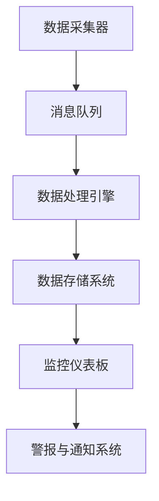

                 

### 文章标题

#### 评测系统的性能调优与监控

#### 关键词：性能调优、性能监控、系统评测、调优策略、监控架构

#### 摘要：

本文详细探讨了评测系统在性能调优与监控方面的核心内容。首先，介绍了评测系统的基本概念与作用，包括其定义、架构设计、核心概念以及应用领域。随后，文章深入分析了性能调优的策略与技巧，从代码层面、架构层面和数据库层面进行了详细讲解。接着，阐述了监控系统的设计与实现，包括监控数据收集与处理以及常见监控指标的介绍。文章还介绍了自动化性能调优与监控的实践方法，并通过具体案例分析，展示了性能调优与监控的实际操作步骤。最后，总结了最佳实践，展望了未来的发展前景。

---

## 前言

### 1. 引言

随着互联网和移动应用的快速发展，系统性能成为影响用户体验和业务发展的关键因素。评测系统在性能调优与监控方面发挥着至关重要的作用。本文旨在通过系统性的分析和实践，帮助开发者更好地理解和掌握评测系统的性能调优与监控方法，提高系统的整体性能和稳定性。

### 1.1 问题背景

在现代应用中，性能问题常常表现为响应时间慢、资源利用率低、错误率高和用户体验差等。这些问题不仅影响业务的正常运行，还可能导致用户流失和商业损失。因此，性能调优与监控成为系统维护和优化的重要环节。

### 1.2 问题描述

性能调优与监控主要涉及以下问题：
- 系统性能指标不明确，无法准确评估系统状态。
- 缺乏有效的性能调优策略，无法针对性地优化系统。
- 监控系统不完善，无法及时发现和解决性能问题。
- 自动化性能调优与监控机制不健全，难以持续提升系统性能。

### 1.3 问题解决

本文通过以下步骤解决上述问题：
- 系统性地介绍评测系统的概念与架构。
- 分析性能调优的核心策略与技巧。
- 详细讲解监控系统的设计与实现。
- 引入自动化性能调优与监控的方法。
- 通过具体案例分析，展示性能调优与监控的实际应用。

### 1.4 边界与外延

本文主要关注以下场景：
- Web应用与移动应用性能评测。
- 性能调优与监控工具的使用。
- 自动化性能调优与监控的实现。

### 1.5 概念结构与核心要素组成

本文的核心概念与结构包括：
- 评测系统的定义、作用与架构。
- 性能调优的策略、技巧与案例。
- 监控系统的设计与实现。
- 自动化性能调优与监控的方法。
- 最佳实践与总结。

---

### 1.6 目的与贡献

本文的主要目的是：
- 为开发者提供系统性的性能调优与监控指南。
- 分析常见性能问题及其解决方法。
- 介绍自动化性能调优与监控的最佳实践。

通过本文，读者可以：
- 理解评测系统的基本概念与架构。
- 掌握性能调优的核心策略与技巧。
- 学会设计并实现高效的监控系统。
- 了解自动化性能调优与监控的方法。

本文的研究对于提升系统性能、优化用户体验和保障业务稳定运行具有重要的实际意义。

---

### 第1章：评测系统的概述

#### 1.1 评测系统的定义与作用

#### 1.1.1 定义

评测系统是一种专门用于评估和监控计算机系统性能的软件或工具。其主要功能是收集系统的运行数据，分析并评估系统的性能，并提供优化建议。评测系统通常包括性能监控、性能分析和性能调优等模块。

#### 1.1.2 作用

评测系统在计算机系统中具有以下几个重要作用：
- **性能监控**：实时监控系统的运行状态，包括CPU利用率、内存占用、磁盘I/O等关键指标。
- **性能分析**：分析系统性能瓶颈，定位性能问题，为性能调优提供依据。
- **性能调优**：根据性能分析结果，采取相应的优化措施，提高系统性能。
- **优化指导**：为开发者提供优化建议，帮助其更好地理解和改进系统设计。

#### 1.2 评测系统的架构设计

#### 1.2.1 系统架构概述

评测系统的架构通常包括以下几个主要组成部分：
- **数据采集模块**：负责收集系统运行数据，如CPU、内存、磁盘I/O、网络流量等。
- **数据处理模块**：对采集到的数据进行分析和处理，提取有用的性能指标。
- **监控模块**：实时监控系统性能，并根据设定的阈值触发警报。
- **分析模块**：分析系统性能，识别性能瓶颈，提供优化建议。
- **调优模块**：根据分析结果，采取优化措施，提高系统性能。

#### 1.2.2 核心组件介绍

评测系统的核心组件及其功能如下：
- **数据采集器**：负责从操作系统、应用程序和硬件设备中采集数据，常用的数据采集器有Prometheus、Ganglia等。
- **数据处理引擎**：对采集到的数据进行分析和处理，常用的数据处理引擎有ELK（Elasticsearch、Logstash、Kibana）等。
- **监控仪表板**：提供实时监控系统性能的界面，常用的监控仪表板有Grafana、Zabbix等。
- **分析工具**：对监控数据进行深入分析，常用的分析工具有Python、R等。
- **调优工具**：根据分析结果，提供优化建议和自动化调优工具，常用的调优工具有JVM Tuning Tools、数据库优化工具等。

#### 1.3 评测系统的核心概念

#### 1.3.1 性能指标

性能指标是评测系统中的核心概念，用于衡量系统的性能表现。常见的性能指标包括：
- **CPU利用率**：CPU在单位时间内执行指令的比例，通常用百分比表示。
- **内存占用**：系统内存的占用情况，包括物理内存和虚拟内存。
- **磁盘I/O**：磁盘的读写操作次数和读写速度，包括磁盘访问延迟。
- **网络流量**：网络数据传输的速度和流量，包括吞吐量和延迟。

#### 1.3.2 监控指标

监控指标是评测系统中用于监控系统运行状态的指标，包括：
- **系统负载**：系统在单位时间内处理的任务数量和响应时间。
- **响应时间**：系统对请求的响应时间，包括服务器处理时间和网络传输时间。
- **吞吐量**：系统在单位时间内处理的数据量，包括请求和响应。
- **错误率**：系统处理请求时发生错误的次数和比例。

#### 1.4 评测系统的应用领域

#### 1.4.1 应用场景一：Web应用性能评测

Web应用性能评测主要集中在以下几个方面：
- **前端性能**：评估页面加载速度、资源利用率等，优化页面结构、脚本和图片等资源。
- **后端性能**：评估服务器响应速度、数据库查询效率等，优化服务器配置、缓存策略和数据库优化等。
- **全链路性能**：评估从用户发起请求到收到响应的全过程，包括网络传输、服务器处理和数据库查询等。

#### 1.4.2 应用场景二：移动应用性能评测

移动应用性能评测主要集中在以下几个方面：
- **网络性能**：评估移动网络连接稳定性、数据传输速度等，优化网络请求策略和数据处理。
- **应用性能**：评估应用响应速度、资源占用等，优化应用架构、代码和资源管理等。
- **用户体验**：评估用户在使用过程中的感受，优化界面设计、交互流程和反馈机制。

通过评测系统的应用，开发者可以更好地理解系统的性能表现，定位性能瓶颈，采取有效的优化措施，从而提升系统的性能和用户体验。

---

### 第2章：性能调优

#### 2.1 性能分析

性能分析是性能调优的基础，通过对系统运行过程中的数据进行分析，找出性能瓶颈，为优化提供依据。性能分析主要包括以下方法：

#### 2.1.1 性能评估方法

**1. 基准测试**：通过运行标准测试用例，评估系统的性能表现，比较不同配置或优化策略的效果。

**2. 代码分析**：使用静态分析工具对代码进行审查，找出潜在的效率问题，如冗余代码、循环嵌套、数据结构不合理等。

**3. 调试工具**：使用调试工具（如GDB、Visual Studio Debugger等）定位性能瓶颈，跟踪程序执行流程，分析CPU和内存使用情况。

**4. 性能监控**：通过监控系统运行状态，实时收集性能数据，分析系统负载、响应时间和资源利用率等指标。

#### 2.1.2 性能瓶颈分析

性能瓶颈分析是性能调优的关键步骤，主要包括以下几个方面：

**1. CPU瓶颈**：系统CPU使用率过高，导致任务响应缓慢。常见原因包括：
- **计算密集型任务**：大量计算任务占用CPU资源。
- **线程竞争**：多个线程同时访问共享资源，导致锁竞争。

**2. 内存瓶颈**：系统内存占用过高，导致性能下降。常见原因包括：
- **内存泄漏**：程序中存在未释放的内存，导致内存逐渐耗尽。
- **缓存失效**：缓存机制不完善，导致频繁访问内存。

**3. 磁盘I/O瓶颈**：系统磁盘I/O速度慢，导致数据处理延迟。常见原因包括：
- **I/O请求过多**：系统同时处理大量I/O请求，导致磁盘队列拥堵。
- **磁盘性能不足**：磁盘读写速度慢，导致I/O瓶颈。

**4. 网络瓶颈**：系统网络延迟高，导致通信效率低。常见原因包括：
- **网络拥塞**：网络带宽不足，导致数据传输缓慢。
- **协议开销**：网络协议复杂，导致通信开销大。

#### 2.2 性能调优策略

针对不同的性能瓶颈，可以采取以下调优策略：

**1. 代码层面优化**

- **减少计算复杂度**：优化算法，降低时间复杂度和空间复杂度。
- **避免内存泄漏**：及时释放不再使用的内存，防止内存泄漏。
- **优化数据结构**：选择合适的数据结构，提高数据访问效率。

**2. 架构层面优化**

- **分布式架构**：将系统拆分为多个模块，分布式部署，提高系统的伸缩性和可用性。
- **缓存策略**：引入缓存机制，减少对数据库的访问，提高系统响应速度。
- **异步处理**：使用异步处理，提高系统的并发处理能力。

**3. 数据库优化**

- **索引优化**：合理设计索引，提高查询效率。
- **分库分表**：将数据拆分为多个库或表，减轻单库或单表的负担。
- **读写分离**：将读操作和写操作分离，提高系统的读写性能。

#### 2.3 常见性能调优技巧

**1. 缓存策略**

- **内存缓存**：使用内存缓存（如Redis、Memcached等），减少对磁盘的访问。
- **分布式缓存**：将缓存分布在多个节点上，提高缓存命中率和系统可用性。

**2. 并发处理**

- **线程池**：使用线程池管理线程，减少线程创建和销毁的开销。
- **异步处理**：使用异步处理，提高系统的并发处理能力。

**3. 资源调度**

- **负载均衡**：使用负载均衡器（如Nginx、HAProxy等），将请求分配到多个节点，提高系统的处理能力。
- **资源隔离**：将系统资源进行隔离，避免单个节点性能问题影响整个系统。

通过上述性能调优策略和技巧，可以有效地提升系统的性能，提高用户体验，保障业务的稳定运行。

---

### 第3章：监控

#### 3.1 监控系统的设计与实现

监控系统是确保系统稳定运行的关键组成部分，其设计与实现涉及到系统的架构设计、功能模块以及数据收集与处理方法。以下是对监控系统设计与实现的主要环节的详细阐述。

#### 3.1.1 监控系统架构设计

监控系统的架构设计需要考虑以下几个关键因素：

**1. 数据采集**：数据采集是监控系统的基础，需要高效、准确地收集系统运行过程中的各类数据，如CPU、内存、磁盘I/O、网络流量等。

**2. 数据传输**：为了确保数据在采集和存储过程中不丢失，监控系统通常采用分布式架构，利用消息队列（如Kafka、RabbitMQ）来实现数据的实时传输和备份。

**3. 数据存储**：监控系统需要将采集到的数据进行持久化存储，以便后续分析和查询。常用的数据存储方案包括关系型数据库（如MySQL、PostgreSQL）和NoSQL数据库（如MongoDB、Cassandra）。

**4. 数据处理**：数据处理包括数据清洗、转换和聚合等操作，以便提取有用的性能指标和监控数据。

**5. 数据可视化**：通过监控仪表板，将处理后的数据进行可视化展示，便于实时监控和问题定位。

**6. 警报与通知**：当系统性能指标超过设定的阈值时，监控系统需要触发警报并通知相关人员，以便及时处理。

一个典型的监控系统架构如下：

#### 3.1.2 监控系统功能模块

监控系统通常包括以下几个功能模块：

**1. 数据采集模块**：负责从各种系统组件（如操作系统、应用程序、硬件设备）中采集性能数据，常用的采集工具包括Prometheus、Ganglia、Nagios等。

**2. 数据处理模块**：对采集到的数据进行处理，包括数据清洗、转换和聚合等，常用的数据处理工具包括Logstash、Fluentd、Apache Kafka等。

**3. 数据存储模块**：负责将处理后的数据存储到数据库中，以便进行长期存储和查询。常用的数据存储系统包括关系型数据库（如MySQL、PostgreSQL）和NoSQL数据库（如MongoDB、Cassandra、Elasticsearch）。

**4. 数据可视化模块**：通过监控仪表板（如Grafana、Kibana、Zabbix等）将数据可视化，提供实时监控和告警功能。

**5. 警报与通知模块**：当系统性能指标超过设定的阈值时，自动触发警报并通知相关人员，常用的警报通知工具包括邮件、短信、Slack等。

#### 3.2 监控数据收集与处理

监控数据收集与处理是监控系统的核心环节，以下是对数据收集与处理过程的详细描述：

**1. 数据采集**：

- **主动采集**：主动采集是指监控系统定期向目标系统发送请求，获取性能数据。常见的主动采集工具有Nagios、Zabbix等。
- **被动采集**：被动采集是指目标系统主动向监控系统发送性能数据，常见的被动采集工具有Prometheus、Ganglia等。

**2. 数据处理**：

- **数据清洗**：数据清洗是指对采集到的数据进行去重、过滤和处理，以确保数据的质量和一致性。
- **数据转换**：数据转换是指将采集到的原始数据转换成监控系统能够处理的格式，如将原始日志文件转换成JSON格式。
- **数据聚合**：数据聚合是指将多个采集点或时间点的数据进行汇总，提取出有用的性能指标，如CPU利用率、内存占用等。

**3. 数据存储**：

- **数据持久化**：将处理后的数据存储到数据库中，便于后续分析和查询。
- **数据索引**：为了提高查询效率，需要对数据建立索引。

**4. 数据查询**：

- **实时查询**：监控系统需要提供实时查询功能，以便快速定位性能问题。
- **历史查询**：监控系统需要支持历史数据查询，以便分析和评估系统性能变化。

#### 3.3 常见监控指标

监控指标是评估系统性能的重要工具，以下是一些常见的监控指标：

**1. 性能监控指标**：

- **CPU利用率**：系统CPU在单位时间内的使用情况，常用百分比表示。
- **内存占用**：系统内存的使用情况，包括物理内存和虚拟内存。
- **磁盘I/O**：磁盘的读写操作速度和延迟。
- **网络流量**：网络数据传输的速度和流量。

**2. 可用性监控指标**：

- **响应时间**：系统对请求的响应时间，包括服务器处理时间和网络传输时间。
- **错误率**：系统处理请求时发生错误的次数和比例。
- **系统负载**：系统在单位时间内处理的任务数量和响应时间。

**3. 安全性监控指标**：

- **登录失败次数**：系统登录失败的次数，用于检测暴力破解等安全威胁。
- **安全日志**：系统生成的安全日志，用于记录系统安全事件。
- **网络入侵检测**：检测网络流量中的异常行为，如DDoS攻击等。

通过有效的监控系统设计、数据收集与处理以及常见监控指标的运用，可以实时监控系统的运行状态，及时发现并解决性能和安全问题，确保系统的稳定运行。

---

### 第4章：自动化性能调优与监控

#### 4.1 自动化性能调优

随着系统规模的不断扩大和复杂度的增加，手工性能调优变得越来越困难，而自动化性能调优则成为了一种高效和可扩展的解决方案。自动化性能调优通过使用工具和算法来自动识别系统性能瓶颈并优化配置，从而提高系统的性能和稳定性。以下将介绍自动化性能调优的主要工具和策略。

#### 4.1.1 自动化调优工具

自动化性能调优工具可以帮助开发者快速定位和优化系统性能，以下是几种常用的自动化调优工具：

**1. Auto-Tuning Tools**：

- **JVM Tuning Tools**：如JVM Performance Inspector（JPI）和JVM-Optimizer，这些工具可以自动调整JVM参数，优化Java应用程序的性能。
- **Database Tuning Tools**：如Oracle SQL Tuning Advisor和MySQL Workbench，这些工具可以自动优化数据库查询和配置。

**2. AI-driven Performance Tuning Tools**：

- **AI-driven Auto-Tuning**：使用机器学习和深度学习算法，自动分析系统运行数据，识别性能瓶颈并提出优化建议。如Google的Auto-Tune和Netflix的Spectra。

**3. Cloud-Native Auto-Tuning Tools**：

- **Kubernetes Auto-Tuning Tools**：如Kube-Prometheus和Kube-Events，这些工具可以自动调优Kubernetes集群中的容器性能。

#### 4.1.2 自动化调优策略

自动化性能调优的策略主要包括以下方面：

**1. 基于规则的调优**：

- **规则引擎**：使用预定义的规则来调整系统配置，如设置CPU核心数、内存分配、I/O策略等。
- **阈值管理**：根据性能指标阈值，自动调整系统配置，确保系统稳定运行。

**2. 基于数据的调优**：

- **数据驱动的调优**：使用历史性能数据，通过统计分析方法识别性能瓶颈，并自动调整系统配置。
- **机器学习调优**：使用机器学习和深度学习算法，从海量数据中学习系统性能与配置之间的关系，自动优化系统配置。

**3. 自适应调优**：

- **动态调整**：根据系统运行状态和负载变化，动态调整系统配置，以适应不同的场景。
- **自优化循环**：建立自优化循环，持续监控和调整系统配置，实现系统的持续优化。

#### 4.2 自动化监控

自动化监控是实现系统高可用性和稳定性的关键，通过自动化监控，可以及时发现和处理系统性能问题。以下将介绍自动化监控的主要工具和策略。

#### 4.2.1 自动化监控工具

自动化监控工具可以帮助开发者快速搭建监控系统，以下是一些常用的自动化监控工具：

**1. Prometheus**：

- **Prometheus**：是一款开源的监控解决方案，具有高度的可扩展性和灵活性，支持多种数据源和告警机制。

**2. Nagios**：

- **Nagios**：是一款广泛使用的开源监控工具，具有强大的告警和通知功能，适用于各种规模的系统。

**3. Zabbix**：

- **Zabbix**：是一款功能丰富的开源监控工具，支持分布式监控和自动发现，适用于大规模系统监控。

#### 4.2.2 自动化监控策略

自动化监控的策略主要包括以下方面：

**1. 告警策略**：

- **阈值告警**：根据性能指标阈值设置告警规则，当指标超过阈值时触发告警。
- **聚合告警**：将多个指标的告警信息聚合，简化告警通知。

**2. 自适应监控**：

- **动态阈值**：根据系统运行状态和负载变化，动态调整监控阈值，以适应不同的场景。
- **智能告警**：使用机器学习和数据分析技术，识别异常模式和潜在问题，提前预警。

**3. 联动策略**：

- **自动化恢复**：当监控系统检测到性能问题时，自动执行恢复措施，如重启服务、扩容资源等。
- **日志分析**：结合日志分析，深入挖掘性能问题的根本原因，提供解决方案。

通过自动化性能调优和监控，可以大大提高系统的性能和稳定性，减少人工干预，实现系统的持续优化和高效运维。

---

### 第5章：案例分析

#### 5.1 案例一：Web应用性能调优与监控

##### 5.1.1 问题背景

某知名电商平台在其业务高峰期，用户访问量急剧增加，导致系统响应时间延长，部分页面无法正常加载，用户体验差。通过对系统的初步性能分析，发现以下问题：

- **CPU使用率过高**：系统服务器CPU使用率接近100%，导致部分请求处理缓慢。
- **内存占用过高**：系统内存占用率超过80%，内存泄漏问题严重。
- **数据库查询效率低**：数据库查询速度慢，响应时间长。

##### 5.1.2 性能分析

针对上述问题，我们进行了以下性能分析：

**1. CPU瓶颈分析**：

- 使用Prometheus监控工具收集CPU使用率数据，发现CPU使用率在业务高峰期达到100%，主要原因是服务器处理请求过多，导致CPU过载。
- 调用栈分析显示，部分请求在处理过程中出现了大量的循环调用，导致CPU使用率上升。

**2. 内存瓶颈分析**：

- 通过JVM监控工具发现，内存占用率持续上升，达到80%以上，内存泄漏问题明显。
- 内存泄漏分析工具（如MAT）定位到部分对象未被释放，导致内存占用增加。

**3. 数据库瓶颈分析**：

- 分析数据库日志和慢查询日志，发现部分查询语句执行时间过长，查询效率低下。
- 查询优化工具（如MySQL Workbench）识别到索引缺失和查询语句结构不合理，导致查询效率低。

##### 5.1.3 性能调优

针对以上分析结果，我们采取了以下性能调优措施：

**1. CPU调优**：

- **分布式部署**：将系统拆分为多个微服务，分布式部署在多台服务器上，提高系统的并发处理能力。
- **负载均衡**：使用Nginx作为负载均衡器，将请求分配到不同服务器，避免单点瓶颈。

**2. 内存调优**：

- **内存优化**：调整JVM参数，设置适当的堆大小和垃圾回收策略，减少内存占用。
- **代码优化**：优化代码结构，减少不必要的对象创建和内存分配，减少内存泄漏。

**3. 数据库调优**：

- **索引优化**：添加缺失的索引，优化查询语句结构，提高查询效率。
- **读写分离**：将读操作和写操作分离，减轻数据库负担。

##### 5.1.4 监控实施

为了确保系统性能的持续优化，我们实施了以下监控措施：

**1. 实时监控**：

- **Prometheus+Grafana**：部署Prometheus作为数据采集器和Grafana作为监控仪表板，实时监控系统的CPU、内存、磁盘I/O和网络流量等关键指标。
- **JVM监控**：使用JMX监控工具（如VisualVM）监控JVM的运行状态，包括堆大小、垃圾回收次数和内存占用等。

**2. 告警机制**：

- **阈值告警**：根据关键指标的阈值设置告警规则，当指标超过阈值时触发告警，并及时通知相关人员。
- **智能告警**：结合历史数据和机器学习算法，识别潜在的性能问题，提前预警。

**3. 日志分析**：

- **ELK堆栈**：部署Elasticsearch、Logstash和Kibana（ELK堆栈），收集和分析系统日志，定位性能瓶颈和异常行为。

通过上述性能调优和监控措施，系统性能得到了显著提升，CPU使用率、内存占用和数据库查询效率均有明显改善，用户满意度大幅提升。

---

### 5.2 案例二：移动应用性能调优与监控

##### 5.2.1 问题背景

某知名移动应用在用户量迅速增长的背景下，遭遇了性能问题，用户反馈应用响应慢、卡顿，甚至出现了崩溃。分析原因后发现：

- **网络瓶颈**：用户分布在各地，网络条件差异大，导致部分用户无法正常访问应用。
- **资源消耗高**：应用中存在大量冗余资源加载和计算密集型任务，导致应用运行缓慢。
- **缓存策略不当**：缓存机制不完善，导致频繁读取本地存储和服务器数据。

##### 5.2.2 性能分析

为了解决上述问题，我们进行了以下性能分析：

**1. 网络瓶颈分析**：

- 使用网络监控工具（如Wireshark）抓取用户数据包，分析网络传输速度和延迟。
- 通过用户分布统计，发现部分地区的网络条件较差，影响了用户体验。

**2. 资源消耗分析**：

- 使用移动应用性能分析工具（如Android Studio Profiler、Xcode Instruments）分析应用资源的消耗情况。
- 发现应用在启动和加载过程中加载了过多图片、音频和视频资源，导致资源消耗高。

**3. 缓存策略分析**：

- 分析应用的缓存策略，发现缓存机制不完善，部分数据无法缓存，导致频繁读取服务器数据。

##### 5.2.3 性能调优

根据性能分析结果，我们采取了以下性能调优措施：

**1. 网络优化**：

- **CDN加速**：使用CDN（内容分发网络）加速应用资源加载，提高用户访问速度。
- **分片加载**：将应用资源分为多个片段，按需加载，减少首次加载时间。

**2. 资源优化**：

- **资源压缩**：使用压缩算法（如PNG量减、WebP压缩）减少图片、音频和视频资源的大小。
- **懒加载**：对应用中的图片和视频资源采用懒加载策略，仅在需要时加载，减少初始加载时间。

**3. 缓存优化**：

- **缓存机制完善**：优化缓存策略，将常用数据缓存到本地存储，减少对服务器数据的读取。
- **缓存一致性**：确保缓存数据的时效性和一致性，避免缓存失效导致数据不一致。

##### 5.2.4 监控实施

为了确保应用性能的稳定和持续优化，我们实施了以下监控措施：

**1. 网络监控**：

- **实时网络监控**：使用Prometheus和Grafana实时监控网络传输速度和延迟，及时发现问题并进行优化。

**2. 资源监控**：

- **应用性能监控**：使用Android Studio Profiler和Xcode Instruments实时监控应用资源消耗情况，识别性能瓶颈。

**3. 缓存监控**：

- **缓存状态监控**：监控缓存的使用情况和命中率，确保缓存策略的有效性。

通过上述性能调优和监控措施，应用性能得到了显著提升，用户反馈问题大幅减少，用户满意度明显提高。

---

### 第6章：最佳实践与总结

#### 6.1 最佳实践

在进行性能调优与监控时，以下最佳实践可以帮助开发者更有效地提升系统性能和稳定性：

**1. 性能调优最佳实践**

- **持续性能分析**：定期进行性能分析，及时发现和解决性能瓶颈。
- **优化代码结构**：优化代码结构，减少冗余和重复代码，提高执行效率。
- **使用缓存策略**：合理使用缓存策略，减少数据库和磁盘I/O操作。
- **分布式部署**：采用分布式部署，提高系统的并发处理能力和容错能力。
- **负载均衡**：使用负载均衡器，合理分配请求，避免单点瓶颈。

**2. 监控最佳实践**

- **实时监控**：实时监控系统运行状态，及时发现问题并采取相应措施。
- **设置合理阈值**：根据业务需求和系统负载，设置合理的监控阈值，避免误报和漏报。
- **数据可视化**：通过数据可视化，直观展示系统性能指标，便于问题定位和优化。
- **日志分析**：结合日志分析，深入挖掘性能问题的根本原因，提供解决方案。
- **自动化告警**：建立自动化告警机制，及时通知相关人员，确保问题得到及时处理。

#### 6.2 总结

通过本文的阐述，我们系统地了解了评测系统的性能调优与监控方法。从评测系统的基本概念、架构设计、性能分析、调优策略、监控系统的设计与实现，到自动化性能调优与监控，以及具体案例分析，本文提供了全面、深入的指导。

评测系统在性能调优与监控方面的重要性不言而喻。它不仅帮助我们识别和解决系统性能瓶颈，提高系统稳定性，还为企业提供了有效的性能优化和管理手段。

#### 6.3 展望

未来，随着技术的不断进步和业务需求的不断变化，评测系统将继续发展和完善。以下是一些展望：

- **智能化性能优化**：结合人工智能和机器学习技术，实现更智能、更自动化的性能优化。
- **分布式监控与调优**：随着分布式系统的普及，分布式监控与调优将成为性能优化的重要方向。
- **边缘计算与云原生**：结合边缘计算和云原生技术，实现更加灵活和高效的性能优化。
- **全链路监控与调优**：从端到端的全链路监控与调优，提供更全面的性能优化解决方案。

通过持续学习和实践，我们相信评测系统将帮助开发者更好地应对不断变化的业务需求，为企业和用户提供更优质的服务。

