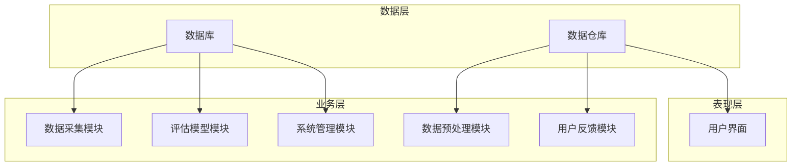
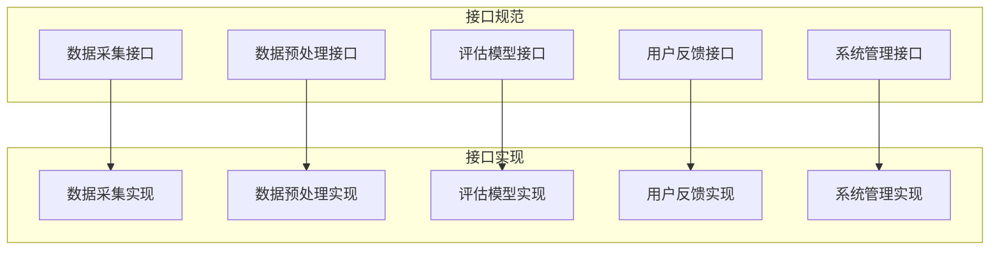

                 

### 评测系统的持续学习与自我优化

**关键词：评测系统、持续学习、自我优化、算法原理、架构设计**

**摘要：**本文深入探讨了评测系统的持续学习与自我优化。首先，介绍了评测系统的基本概念及其在现代社会中的重要性，随后分析了评测系统面临的挑战和问题。接着，阐述了持续学习和自我优化的原理、机制以及它们在评测系统中的应用。在此基础上，详细讲解了评测系统持续学习的算法原理及其在具体应用场景中的实现。最后，提出了评测系统的架构设计方案，并通过实例展示了持续学习与自我优化的实际应用效果。本文旨在为从事评测系统开发的技术人员提供有价值的参考。

---

### 目录大纲：

**第一部分：背景介绍**

- **第1章：评测系统的基本概念**
  - **1.1 问题背景**
    - **1.1.1 评测系统在现代社会中的应用**
    - **1.1.2 评测系统面临的挑战与问题**
    - **1.1.3 持续学习与自我优化的重要性**
  - **1.2 问题描述**
    - **1.2.1 评测系统的现状分析**
    - **1.2.2 持续学习与自我优化的必要性**
    - **1.2.3 问题解决思路**
  - **1.3 边界与外延**
    - **1.3.1 评测系统的定义与分类**
    - **1.3.2 持续学习与自我优化的相关概念**
    - **1.3.3 评测系统的主要组成部分**
  - **1.4 概念结构与核心要素组成**
    - **1.4.1 评测系统的基本结构**
    - **1.4.2 持续学习的关键要素**
    - **1.4.3 自我优化的方法与策略**
  - **1.5 本章小结**

**第二部分：核心概念与联系**

- **第2章：核心概念原理**
  - **2.1 持续学习原理**
    - **2.1.1 持续学习的定义**
    - **2.1.2 持续学习的核心概念**
    - **2.1.3 持续学习的机制**
  - **2.2 自我优化原理**
    - **2.2.1 自我优化的定义**
    - **2.2.2 自我优化的核心概念**
    - **2.2.3 自我优化的机制**
  - **2.3 持续学习与自我优化的联系**
    - **2.3.1 持续学习与自我优化的相互作用**
    - **2.3.2 持续学习与自我优化的关系模型**
    - **2.3.3 持续学习与自我优化的融合策略**
  - **2.4 核心概念属性特征对比表格**
    - **2.4.1 持续学习的属性特征**
    - **2.4.2 自我优化的属性特征**
    - **2.4.3 对比分析**
  - **2.5 本章小结**

**第三部分：算法原理讲解**

- **第3章：评测系统持续学习算法**
  - **3.1 算法概述**
    - **3.1.1 持续学习算法的定义**
    - **3.1.2 持续学习算法的分类**
    - **3.1.3 持续学习算法的关键特性**
  - **3.2 持续学习算法原理**
    - **3.2.1 算法数学模型**
    - **3.2.2 算法工作流程**
    - **3.2.3 算法关键环节**
  - **3.3 评测系统持续学习算法讲解**
    - **3.3.1 数据预处理**
    - **3.3.2 模型训练**
    - **3.3.3 模型评估**
    - **3.3.4 模型优化**
  - **3.4 算法举例说明**
    - **3.4.1 实例1：电商用户评价系统**
    - **3.4.2 实例2：在线教育评测系统**
    - **3.4.3 实例3：智能客服系统**
  - **3.5 本章小结**

**第四部分：系统分析与架构设计方案**

- **第4章：评测系统架构设计**
  - **4.1 问题场景介绍**
    - **4.1.1 评测系统应用场景**
    - **4.1.2 系统需求分析**
    - **4.1.3 系统设计目标**
  - **4.2 项目介绍**
    - **4.2.1 项目背景**
    - **4.2.2 项目需求**
    - **4.2.3 项目目标**
  - **4.3 系统功能设计**
    - **4.3.1 领域模型**
    - **4.3.2 功能模块划分**
    - **4.3.3 功能模块详细介绍**
  - **4.4 系统架构设计**
    - **4.4.1 系统架构概述**
    - **4.4.2 系统架构设计**
    - **4.4.3 架构选型与优化**
  - **4.5 系统接口设计**
    - **4.5.1 接口规范**
    - **4.5.2 接口实现**
    - **4.5.3 接口测试**
  - **4.6 系统交互**
    - **4.6.1 系统交互概述**
    - **4.6.2 系统交互流程**
    - **4.6.3 系统交互示例**
  - **4.7 本章小结**

**第五部分：项目实战与最佳实践**

- **第5章：项目实战**
  - **5.1 环境安装**
  - **5.2 系统核心实现源代码**
  - **5.3 代码应用解读与分析**
  - **5.4 实际案例分析与详细讲解剖析**
  - **5.5 项目小结**
- **第6章：最佳实践**
  - **6.1 最佳实践 tips**
  - **6.2 小结**
  - **6.3 注意事项**
  - **6.4 拓展阅读**

### 第一部分：背景介绍

#### 第1章：评测系统的基本概念

##### 1.1 问题背景

##### 1.1.1 评测系统在现代社会中的应用

在现代社会，评测系统已成为诸多领域不可或缺的工具。无论是电子商务中的用户评价，在线教育中的学生成绩评估，还是企业人力资源管理系统中的员工绩效评估，评测系统都发挥着关键作用。这些系统通过量化指标和智能分析，为用户提供精确的评估结果，帮助企业或教育机构做出更明智的决策。

##### 1.1.2 评测系统面临的挑战与问题

尽管评测系统在现代应用中至关重要，但它们也面临着诸多挑战。首先，数据质量是一个重大问题。评测系统依赖于大量数据，而这些数据往往存在缺失、冗余或不一致等问题，这会影响评估的准确性。其次，随着数据量的增加，评测系统的计算复杂度和存储需求也在不断攀升，这对系统的性能和可扩展性提出了更高要求。此外，评测系统的动态性也是一个挑战。用户需求、应用场景和评估指标都可能随着时间变化，系统需要具备自适应能力，以应对这些变化。

##### 1.1.3 持续学习与自我优化的重要性

面对这些挑战，持续学习和自我优化显得尤为重要。持续学习使评测系统能够不断吸收新的知识和经验，提高评估的准确性和可靠性。自我优化则通过自我调整和改进，确保系统能够适应不断变化的环境和需求。通过持续学习和自我优化，评测系统不仅能够提高性能和准确性，还能降低维护成本，提升用户体验。

##### 1.2 问题描述

##### 1.2.1 评测系统的现状分析

目前，大多数评测系统仍依赖于传统的统计分析方法，虽然这些方法在处理静态数据时表现出色，但面对动态数据和复杂应用场景时，往往显得力不从心。此外，评测系统的更新和迭代速度较慢，难以快速响应用户需求的变化。因此，如何改进评测系统的学习能力和自适应能力，成为当前研究的热点问题。

##### 1.2.2 持续学习与自我优化的必要性

为了应对评测系统面临的挑战，持续学习和自我优化成为必然选择。首先，持续学习使评测系统能够从大量数据中提取有价值的信息，提高评估的准确性。其次，自我优化能够根据评估结果和用户反馈，不断调整和改进评估指标和方法，从而提高系统的适应性和用户体验。因此，研究和应用持续学习和自我优化技术，对于提升评测系统的性能和可靠性具有重要意义。

##### 1.2.3 问题解决思路

要实现评测系统的持续学习和自我优化，需要从以下几个方面入手：

1. **数据质量管理**：确保数据的质量，减少数据缺失、冗余和不一致等问题，为持续学习和自我优化提供可靠的数据基础。
2. **算法改进**：研究和应用先进的机器学习和深度学习算法，提高评测系统的学习能力和自适应能力。
3. **架构优化**：设计灵活、可扩展的系统架构，以应对不断增长的数据量和复杂的应用场景。
4. **用户反馈机制**：建立有效的用户反馈机制，及时收集用户需求和反馈，为自我优化提供依据。
5. **持续迭代**：定期更新和优化评测系统，确保系统能够快速响应用户需求的变化。

##### 1.3 边界与外延

##### 1.3.1 评测系统的定义与分类

评测系统是一种用于对用户、产品、服务或项目等进行评估和反馈的系统。根据应用场景和评估对象的不同，评测系统可以分为多种类型，如用户评价系统、学生成绩评估系统、员工绩效评估系统等。

##### 1.3.2 持续学习与自我优化的相关概念

持续学习是指评测系统在运行过程中，通过不断吸收新数据、新知识和新经验，提高评估的准确性和可靠性。自我优化是指评测系统根据评估结果和用户反馈，自动调整和改进评估指标和方法，以提高系统的适应性和用户体验。

##### 1.3.3 评测系统的主要组成部分

评测系统通常由数据采集模块、数据预处理模块、评估模型模块和用户反馈模块等组成。数据采集模块负责收集评估所需的数据；数据预处理模块对数据进行清洗、去噪和特征提取；评估模型模块根据预处理后的数据生成评估结果；用户反馈模块负责收集用户反馈，为自我优化提供依据。

##### 1.4 概念结构与核心要素组成

##### 1.4.1 评测系统的基本结构

评测系统的基本结构包括数据输入、数据处理、评估模型和结果输出四个主要部分。数据输入部分负责接收评估所需的数据；数据处理部分对数据进行清洗、去噪和特征提取；评估模型部分根据预处理后的数据生成评估结果；结果输出部分将评估结果呈现给用户。

##### 1.4.2 持续学习的关键要素

持续学习的关键要素包括数据集、学习算法和评估指标。数据集是持续学习的基础，需要包含足够多的、多样化的数据；学习算法是持续学习的方法，需要选择合适的算法以适应不同类型的评估任务；评估指标是衡量学习效果的指标，如准确率、召回率、F1分数等。

##### 1.4.3 自我优化的方法与策略

自我优化的方法与策略包括在线学习、迁移学习、自适应调整和用户反馈等。在线学习是指在系统运行过程中，不断更新和优化评估模型；迁移学习是指将一个领域的知识应用到另一个领域；自适应调整是指根据评估结果和用户反馈，自动调整评估模型；用户反馈是指通过用户反馈来优化评估模型。

##### 1.5 本章小结

本章介绍了评测系统的基本概念、问题背景、持续学习与自我优化的重要性、问题描述以及边界与外延。通过对评测系统的深入分析，我们可以清楚地认识到持续学习和自我优化对于提升评测系统性能和用户体验的必要性。在接下来的章节中，我们将进一步探讨持续学习和自我优化的原理、算法以及系统架构设计，以期为评测系统的优化提供有力的理论和技术支持。

---

### 第二部分：核心概念与联系

#### 第2章：核心概念原理

##### 2.1 持续学习原理

##### 2.1.1 持续学习的定义

持续学习是指系统在运行过程中，通过不断吸收新数据、新知识和新经验，提高评估的准确性和可靠性。与传统的单次学习不同，持续学习强调系统的动态适应性和不断改进。

##### 2.1.2 持续学习的核心概念

1. **数据集**：数据集是持续学习的基础，包含历史数据和实时数据。历史数据用于训练模型，实时数据用于在线学习。
2. **学习算法**：学习算法是持续学习的核心，选择合适的算法对持续学习的效果至关重要。常见的持续学习算法包括在线学习算法、迁移学习算法和自适应调整算法。
3. **评估指标**：评估指标用于衡量持续学习的效果，如准确率、召回率、F1分数等。

##### 2.1.3 持续学习的机制

持续学习的机制主要包括数据采集、数据处理、模型训练和模型评估等步骤。具体流程如下：

1. **数据采集**：从各种渠道收集历史数据和实时数据。
2. **数据处理**：对数据进行清洗、去噪和特征提取，为模型训练做准备。
3. **模型训练**：使用训练数据集训练评估模型，不断优化模型参数。
4. **模型评估**：使用评估指标对训练好的模型进行评估，判断学习效果。
5. **模型更新**：根据评估结果，调整模型参数，提高评估准确性。

##### 2.2 自我优化原理

##### 2.2.1 自我优化的定义

自我优化是指系统在运行过程中，根据评估结果和用户反馈，自动调整和改进评估指标和方法，以提高系统的适应性和用户体验。

##### 2.2.2 自我优化的核心概念

1. **评估结果**：评估结果是自我优化的依据，包括评估准确性、响应时间、用户体验等。
2. **用户反馈**：用户反馈是自我优化的外部信息，包括用户评价、建议和需求等。
3. **优化算法**：优化算法用于调整评估模型和策略，常见的优化算法包括在线优化算法、迁移优化算法和自适应优化算法。

##### 2.2.3 自我优化的机制

自我优化的机制主要包括数据采集、评估结果分析、用户反馈收集、优化算法应用和结果验证等步骤。具体流程如下：

1. **数据采集**：从各种渠道收集评估结果和用户反馈。
2. **评估结果分析**：分析评估结果，找出存在的问题和不足。
3. **用户反馈收集**：收集用户反馈，了解用户需求和期望。
4. **优化算法应用**：根据评估结果和用户反馈，应用优化算法调整评估模型和策略。
5. **结果验证**：验证优化后的评估效果，确保优化目标达到预期。

##### 2.3 持续学习与自我优化的联系

##### 2.3.1 持续学习与自我优化的相互作用

持续学习与自我优化之间存在密切的相互作用。持续学习为自我优化提供了数据基础和算法支持，而自我优化则通过不断调整和改进，提高了持续学习的效果和准确性。

##### 2.3.2 持续学习与自我优化的关系模型

持续学习与自我优化的关系模型可以看作是一个闭环系统，包括数据输入、持续学习、评估结果分析、用户反馈收集、优化算法应用和结果验证等环节。具体流程如下：

1. **数据输入**：从各种渠道收集历史数据和实时数据。
2. **持续学习**：通过在线学习、迁移学习和自适应调整等方式，提高评估模型的准确性和可靠性。
3. **评估结果分析**：分析评估结果，找出存在的问题和不足。
4. **用户反馈收集**：收集用户反馈，了解用户需求和期望。
5. **优化算法应用**：根据评估结果和用户反馈，应用优化算法调整评估模型和策略。
6. **结果验证**：验证优化后的评估效果，确保优化目标达到预期。
7. **数据更新**：将优化后的模型和数据集用于下一次持续学习和自我优化。

##### 2.3.3 持续学习与自我优化的融合策略

为了实现持续学习和自我优化的有效融合，可以采用以下策略：

1. **统一数据管理**：将历史数据和实时数据统一管理，确保数据的一致性和完整性。
2. **协同优化算法**：设计协同优化的算法，使持续学习和自我优化相互促进，提高整体效果。
3. **反馈机制设计**：建立有效的反馈机制，确保用户反馈能够及时、准确地传递到优化过程中。
4. **动态调整策略**：根据系统运行状态和用户需求，动态调整持续学习和自我优化的策略，确保系统始终处于最佳状态。

##### 2.4 核心概念属性特征对比表格

| 特征 | 持续学习 | 自我优化 |
| :--: | :-------: | :------: |
| 目标 | 提高评估准确性 | 提高系统适应性和用户体验 |
| 数据集 | 历史数据和实时数据 | 评估结果和用户反馈 |
| 算法 | 在线学习、迁移学习、自适应调整 | 在线优化、迁移优化、自适应优化 |
| 关键指标 | 准确率、召回率、F1分数 | 评估准确性、响应时间、用户体验 |

##### 2.5 本章小结

本章详细介绍了持续学习和自我优化的核心概念、原理和联系。通过对这两个核心概念的分析，我们可以清楚地认识到它们在评测系统中的重要性。在接下来的章节中，我们将进一步探讨评测系统的持续学习算法原理和具体实现，为提升评测系统性能提供技术支持。

---

### 第三部分：算法原理讲解

#### 第3章：评测系统持续学习算法

##### 3.1 算法概述

##### 3.1.1 持续学习算法的定义

持续学习算法是指系统能够在运行过程中不断吸收新数据、新知识和新经验，从而提高评估的准确性和可靠性。与传统的单次学习算法相比，持续学习算法更注重系统的动态适应性和不断改进。

##### 3.1.2 持续学习算法的分类

持续学习算法主要分为以下几类：

1. **在线学习算法**：在线学习算法是指系统在运行过程中，实时接收新数据，并立即更新模型参数，以提高评估准确性。
2. **迁移学习算法**：迁移学习算法是指将一个领域的知识应用到另一个领域，从而提高评估模型的泛化能力。
3. **自适应调整算法**：自适应调整算法是指根据评估结果和用户反馈，自动调整评估模型和策略，以提高系统的适应性和用户体验。

##### 3.1.3 持续学习算法的关键特性

持续学习算法具有以下关键特性：

1. **实时性**：持续学习算法能够实时接收新数据，并立即更新模型参数，从而实现评估的实时性。
2. **自适应性**：持续学习算法能够根据评估结果和用户反馈，自动调整评估模型和策略，从而提高系统的适应性和用户体验。
3. **可扩展性**：持续学习算法能够处理大规模数据，并且具有较高的计算效率和可扩展性。

##### 3.2 持续学习算法原理

##### 3.2.1 算法数学模型

持续学习算法的数学模型可以表示为：

$$
\text{持续学习模型} = \text{输入数据集} \times \text{学习策略} \times \text{评估指标}
$$

其中，输入数据集包含历史数据和实时数据，学习策略包括在线学习、迁移学习和自适应调整等，评估指标用于衡量学习效果，如准确率、召回率、F1分数等。

##### 3.2.2 算法工作流程

持续学习算法的工作流程包括以下几个步骤：

1. **数据采集**：从各种渠道收集历史数据和实时数据。
2. **数据处理**：对数据进行清洗、去噪和特征提取，为模型训练做准备。
3. **模型训练**：使用训练数据集训练评估模型，不断优化模型参数。
4. **模型评估**：使用评估指标对训练好的模型进行评估，判断学习效果。
5. **模型更新**：根据评估结果，调整模型参数，提高评估准确性。

##### 3.2.3 算法关键环节

持续学习算法的关键环节包括数据预处理、模型训练和模型评估等。

1. **数据预处理**：数据预处理是持续学习的基础，包括数据清洗、去噪和特征提取等步骤。有效的数据预处理可以提高模型训练的效率和效果。
2. **模型训练**：模型训练是持续学习的核心，包括选择合适的训练算法、调整模型参数和优化训练过程等。优秀的模型训练算法和参数调整策略可以提高评估模型的准确性和可靠性。
3. **模型评估**：模型评估是判断学习效果的重要手段，包括选择合适的评估指标、计算评估结果和比较不同模型的效果等。准确的模型评估可以帮助我们选择最优的评估模型。

##### 3.3 评测系统持续学习算法讲解

##### 3.3.1 数据预处理

数据预处理是评测系统持续学习算法的关键环节。有效的数据预处理可以提高模型训练的效率和效果。具体步骤如下：

1. **数据清洗**：清洗数据中的缺失值、异常值和重复值，确保数据的质量和一致性。
2. **去噪**：去除数据中的噪声，提高数据的准确性和可靠性。
3. **特征提取**：提取数据中的关键特征，为模型训练提供丰富的信息。

##### 3.3.2 模型训练

模型训练是评测系统持续学习的核心环节。选择合适的训练算法和调整模型参数是关键。具体步骤如下：

1. **选择训练算法**：根据评测任务的特点，选择合适的训练算法，如线性回归、决策树、支持向量机等。
2. **调整模型参数**：通过交叉验证等方法，调整模型参数，优化模型性能。
3. **训练过程优化**：优化训练过程，提高训练效率，如使用批量训练、随机梯度下降等。

##### 3.3.3 模型评估

模型评估是判断学习效果的重要手段。选择合适的评估指标和计算评估结果是关键。具体步骤如下：

1. **选择评估指标**：根据评测任务的特点，选择合适的评估指标，如准确率、召回率、F1分数等。
2. **计算评估结果**：使用评估指标计算模型评估结果，比较不同模型的效果。
3. **模型选择**：根据评估结果，选择最优的评估模型。

##### 3.3.4 模型优化

模型优化是评测系统持续学习的重要环节。通过不断调整和改进评估模型，可以提高评估的准确性和可靠性。具体步骤如下：

1. **评估结果分析**：分析评估结果，找出存在的问题和不足。
2. **用户反馈收集**：收集用户反馈，了解用户需求和期望。
3. **调整模型参数**：根据评估结果和用户反馈，调整模型参数，优化评估模型。
4. **验证优化效果**：验证优化后的评估效果，确保优化目标达到预期。

##### 3.4 算法举例说明

##### 3.4.1 实例1：电商用户评价系统

电商用户评价系统是一个典型的评测系统，通过持续学习算法，可以不断提高用户评价的准确性和可靠性。

1. **数据预处理**：收集用户评价数据，进行数据清洗、去噪和特征提取。
2. **模型训练**：选择合适的训练算法，如决策树或支持向量机，训练评估模型。
3. **模型评估**：使用评估指标，如准确率或F1分数，评估模型效果。
4. **模型优化**：根据评估结果和用户反馈，调整模型参数，优化评估模型。

##### 3.4.2 实例2：在线教育评测系统

在线教育评测系统是一个复杂的应用场景，通过持续学习算法，可以不断提高学生成绩评估的准确性和可靠性。

1. **数据预处理**：收集学生成绩数据，进行数据清洗、去噪和特征提取。
2. **模型训练**：选择合适的训练算法，如神经网络或决策树，训练评估模型。
3. **模型评估**：使用评估指标，如准确率或F1分数，评估模型效果。
4. **模型优化**：根据评估结果和用户反馈，调整模型参数，优化评估模型。

##### 3.4.3 实例3：智能客服系统

智能客服系统是一个典型的实时应用场景，通过持续学习算法，可以不断提高客服回答的准确性和用户体验。

1. **数据预处理**：收集用户咨询数据和客服回答数据，进行数据清洗、去噪和特征提取。
2. **模型训练**：选择合适的训练算法，如循环神经网络或支持向量机，训练评估模型。
3. **模型评估**：使用评估指标，如准确率或F1分数，评估模型效果。
4. **模型优化**：根据评估结果和用户反馈，调整模型参数，优化评估模型。

##### 3.5 本章小结

本章详细介绍了评测系统持续学习算法的概述、原理和具体实现。通过实例分析，我们可以清楚地认识到持续学习算法在提升评测系统性能和用户体验方面的作用。在接下来的章节中，我们将进一步探讨评测系统的架构设计，为持续学习算法的应用提供技术支持。

---

### 第四部分：系统分析与架构设计方案

#### 第4章：评测系统架构设计

##### 4.1 问题场景介绍

在现代社会，评测系统广泛应用于多个领域，如电子商务、在线教育、人力资源管理、医疗评估等。这些系统通过量化指标和智能分析，为用户提供精确的评估结果，帮助企业或教育机构做出更明智的决策。随着数据量的增加和用户需求的多样化，评测系统面临着巨大的挑战，需要具备更高的性能、可扩展性和自适应能力。

##### 4.1.1 评测系统应用场景

1. **电子商务**：电商用户评价系统通过用户评价，为商品和商家提供评估，帮助消费者做出购买决策。
2. **在线教育**：在线教育评测系统通过对学生学习表现的评估，为学生提供个性化的学习建议，帮助教育机构提高教学质量。
3. **人力资源管理**：人力资源管理系统通过对员工绩效的评估，为企业管理者提供决策支持，优化人力资源配置。
4. **医疗评估**：医疗评估系统通过对患者健康状况的评估，为医生提供诊断和治疗建议，提高医疗服务质量。

##### 4.1.2 系统需求分析

为了满足不同应用场景的需求，评测系统需要具备以下需求：

1. **高准确性**：评估结果需要高度准确，确保用户能够获得可靠的评估信息。
2. **实时性**：系统需要能够实时处理大量数据，确保评估结果的及时性。
3. **可扩展性**：系统需要能够支持大规模数据和高并发访问，具备良好的扩展性。
4. **自适应能力**：系统需要能够根据用户需求和应用场景的变化，自动调整和优化评估模型。
5. **用户体验**：系统需要提供友好的用户界面，方便用户使用和操作。

##### 4.1.3 系统设计目标

基于以上需求，评测系统的设计目标如下：

1. **实现高准确性和实时性**：通过采用先进的机器学习和深度学习算法，提高评估的准确性和实时性。
2. **构建可扩展和自适应的系统架构**：设计灵活的系统架构，支持大规模数据和高并发访问，并具备自适应能力。
3. **优化用户体验**：提供友好的用户界面和便捷的操作流程，提高用户满意度。
4. **确保数据安全和隐私**：采取严格的数据安全措施，保护用户隐私，确保系统的可靠性和安全性。

##### 4.2 项目介绍

##### 4.2.1 项目背景

随着互联网和大数据技术的发展，评测系统在各个领域的应用越来越广泛。然而，传统评测系统面临着数据质量、计算性能和用户体验等方面的挑战。为了提升评测系统的性能和可靠性，本项目旨在设计一套具备持续学习和自我优化能力的评测系统，以满足不同应用场景的需求。

##### 4.2.2 项目需求

本项目的主要需求如下：

1. **高准确性**：系统需要能够准确评估用户、产品、服务或项目的表现，为用户提供可靠的评估信息。
2. **实时性**：系统需要能够实时处理大量数据，确保评估结果的及时性。
3. **可扩展性**：系统需要能够支持大规模数据和高并发访问，具备良好的扩展性。
4. **自适应能力**：系统需要能够根据用户需求和应用场景的变化，自动调整和优化评估模型。
5. **用户体验**：系统需要提供友好的用户界面和便捷的操作流程，提高用户满意度。
6. **数据安全和隐私**：系统需要采取严格的数据安全措施，保护用户隐私，确保系统的可靠性和安全性。

##### 4.2.3 项目目标

本项目的主要目标如下：

1. **实现高准确性和实时性**：通过采用先进的机器学习和深度学习算法，提高评估的准确性和实时性。
2. **构建可扩展和自适应的系统架构**：设计灵活的系统架构，支持大规模数据和高并发访问，并具备自适应能力。
3. **优化用户体验**：提供友好的用户界面和便捷的操作流程，提高用户满意度。
4. **确保数据安全和隐私**：采取严格的数据安全措施，保护用户隐私，确保系统的可靠性和安全性。

##### 4.3 系统功能设计

##### 4.3.1 领域模型

领域模型是系统功能设计的核心，它定义了系统的核心功能和模块。以下是本项目领域模型的类图：

```mermaid
classDiagram
    User <<Entity>>
    Product <<Entity>>
    Service <<Entity>>
    Project <<Entity>>

    Evaluation <<Service>>
    DataCollection <<Service>>
    DataPreprocessing <<Service>>
    ModelTraining <<Service>>
    ModelEvaluation <<Service>>
    UserFeedback <<Service>>

    User "uses" Evaluation
    User "uses" DataCollection
    User "uses" DataPreprocessing
    User "uses" ModelTraining
    User "uses" ModelEvaluation
    User "uses" UserFeedback

    Product "uses" Evaluation
    Product "uses" DataCollection
    Product "uses" DataPreprocessing
    Product "uses" ModelTraining
    Product "uses" ModelEvaluation
    Product "uses" UserFeedback

    Service "uses" Evaluation
    Service "uses" DataCollection
    Service "uses" DataPreprocessing
    Service "uses" ModelTraining
    Service "uses" ModelEvaluation
    Service "uses" UserFeedback

    Project "uses" Evaluation
    Project "uses" DataCollection
    Project "uses" DataPreprocessing
    Project "uses" ModelTraining
    Project "uses" ModelEvaluation
    Project "uses" UserFeedback
endclass
```

##### 4.3.2 功能模块划分

系统功能模块划分如下：

1. **数据采集模块**：负责收集评估所需的数据，包括用户数据、产品数据、服务数据和项目数据等。
2. **数据预处理模块**：负责对收集到的数据进行处理，包括数据清洗、去噪和特征提取等。
3. **评估模型模块**：负责训练和评估评估模型，选择合适的算法和参数，提高评估的准确性和实时性。
4. **用户反馈模块**：负责收集用户反馈，包括用户评价、建议和需求等，为评估模型的优化提供依据。
5. **系统管理模块**：负责系统配置、用户权限管理、日志记录和异常处理等。

##### 4.3.3 功能模块详细介绍

1. **数据采集模块**

   数据采集模块是系统的核心功能之一，负责收集评估所需的数据。具体功能如下：

   - 数据来源：从各种渠道收集数据，包括用户反馈、日志记录、第三方数据接口等。
   - 数据存储：将收集到的数据存储到数据库或数据仓库中，确保数据的安全和可靠性。
   - 数据清洗：对收集到的数据进行清洗，去除重复数据、异常值和噪声等，提高数据质量。

2. **数据预处理模块**

   数据预处理模块负责对收集到的数据进行处理，为模型训练做准备。具体功能如下：

   - 数据清洗：对数据进行清洗，去除重复数据、异常值和噪声等，提高数据质量。
   - 数据去噪：去除数据中的噪声，提高数据的准确性和可靠性。
   - 特征提取：从数据中提取关键特征，为模型训练提供丰富的信息。

3. **评估模型模块**

   评估模型模块负责训练和评估评估模型，选择合适的算法和参数，提高评估的准确性和实时性。具体功能如下：

   - 模型训练：使用训练算法和参数，训练评估模型，优化模型参数。
   - 模型评估：使用评估指标，对训练好的模型进行评估，判断学习效果。
   - 模型优化：根据评估结果，调整模型参数，优化评估模型。

4. **用户反馈模块**

   用户反馈模块负责收集用户反馈，包括用户评价、建议和需求等，为评估模型的优化提供依据。具体功能如下：

   - 用户评价：收集用户对评估结果的评价，如准确性、实时性、用户体验等。
   - 建议和需求：收集用户对评估系统的建议和需求，为系统的优化提供参考。

5. **系统管理模块**

   系统管理模块负责系统配置、用户权限管理、日志记录和异常处理等。具体功能如下：

   - 系统配置：配置系统参数，如数据采集方式、预处理策略、评估算法等。
   - 用户权限管理：管理用户权限，确保系统的安全性和可靠性。
   - 日志记录：记录系统运行日志，方便问题排查和系统优化。
   - 异常处理：处理系统异常，确保系统的稳定性和可靠性。

##### 4.4 系统架构设计

##### 4.4.1 系统架构概述

系统架构设计采用分层架构，包括数据层、业务层和表现层。各层之间通过接口进行通信，确保系统的模块化和可扩展性。以下是系统架构的概述：

- **数据层**：负责数据的存储、管理和查询，采用分布式数据库和数据仓库，确保数据的高可靠性和高并发访问。
- **业务层**：负责业务逻辑的实现，包括数据采集、数据预处理、评估模型训练、评估模型评估和用户反馈等。
- **表现层**：负责系统的用户界面和交互，提供友好的操作界面和便捷的操作流程。

##### 4.4.2 系统架构设计

以下是系统架构的详细设计：



##### 4.4.3 架构选型与优化

系统架构选型主要考虑以下几个方面：

1. **分布式数据库**：选择分布式数据库，如HBase、Cassandra等，确保数据的高可靠性和高并发访问。
2. **大数据处理框架**：选择大数据处理框架，如Spark、Hadoop等，提高数据处理效率和性能。
3. **分布式文件系统**：选择分布式文件系统，如HDFS、Alluxio等，确保数据存储的高可靠性和高性能。
4. **云计算平台**：选择云计算平台，如AWS、Azure等，提高系统的可扩展性和可靠性。

系统架构优化策略：

1. **负载均衡**：采用负载均衡技术，如Nginx、HAProxy等，确保系统的高并发处理能力。
2. **缓存策略**：采用缓存技术，如Redis、Memcached等，提高系统的响应速度和性能。
3. **分布式存储**：采用分布式存储技术，如HDFS、Alluxio等，确保数据存储的高可靠性和高性能。
4. **实时计算**：采用实时计算框架，如Apache Storm、Apache Flink等，确保实时数据处理和评估。

##### 4.5 系统接口设计

系统接口设计采用RESTful API设计，确保系统的模块化和可扩展性。以下是系统接口的详细设计：



##### 4.5.1 接口规范

接口规范定义了系统各个模块的接口设计和功能规范，包括以下内容：

1. **数据采集接口**：定义了数据采集的接口设计和功能规范，包括数据来源、数据格式、数据存储等。
2. **数据预处理接口**：定义了数据预处理的接口设计和功能规范，包括数据清洗、去噪、特征提取等。
3. **评估模型接口**：定义了评估模型的接口设计和功能规范，包括模型训练、模型评估、模型优化等。
4. **用户反馈接口**：定义了用户反馈的接口设计和功能规范，包括用户评价、建议和需求等。
5. **系统管理接口**：定义了系统管理的接口设计和功能规范，包括系统配置、用户权限管理、日志记录等。

##### 4.5.2 接口实现

接口实现是根据接口规范实现的实际接口代码，包括以下内容：

1. **数据采集实现**：根据数据采集接口规范，实现数据采集的功能代码，包括数据来源、数据格式、数据存储等。
2. **数据预处理实现**：根据数据预处理接口规范，实现数据预处理的功能代码，包括数据清洗、去噪、特征提取等。
3. **评估模型实现**：根据评估模型接口规范，实现评估模型的功能代码，包括模型训练、模型评估、模型优化等。
4. **用户反馈实现**：根据用户反馈接口规范，实现用户反馈的功能代码，包括用户评价、建议和需求等。
5. **系统管理实现**：根据系统管理接口规范，实现系统管理的功能代码，包括系统配置、用户权限管理、日志记录等。

##### 4.5.3 接口测试

接口测试是确保接口设计和实现正确性的重要步骤，包括以下内容：

1. **功能测试**：测试接口的功能是否按照规范设计正常执行，包括数据采集、数据预处理、评估模型、用户反馈、系统管理等。
2. **性能测试**：测试接口的性能，包括响应时间、吞吐量、并发处理能力等，确保接口在高并发场景下稳定运行。
3. **安全性测试**：测试接口的安全性，包括身份认证、访问控制、数据加密等，确保系统的安全性和可靠性。

##### 4.6 系统交互

系统交互是指系统内部各个模块之间的数据流和功能调用关系，包括以下内容：

1. **数据流**：系统内部的数据流关系，包括数据采集、数据预处理、评估模型训练、评估模型评估、用户反馈等。
2. **功能调用**：系统内部的功能调用关系，包括数据采集模块调用数据预处理模块、评估模型模块调用用户反馈模块等。

##### 4.6.1 系统交互概述

系统交互概述如下：

1. **数据采集**：数据采集模块从各种渠道收集数据，包括用户数据、产品数据、服务数据和项目数据等。
2. **数据预处理**：数据预处理模块对收集到的数据进行处理，包括数据清洗、去噪和特征提取等。
3. **评估模型训练**：评估模型模块使用预处理后的数据训练评估模型，优化模型参数，提高评估准确性。
4. **评估模型评估**：评估模型模块使用训练好的模型评估评估结果，根据评估结果和用户反馈优化评估模型。
5. **用户反馈**：用户反馈模块收集用户反馈，包括用户评价、建议和需求等，为评估模型的优化提供依据。
6. **系统管理**：系统管理模块负责系统配置、用户权限管理、日志记录和异常处理等。

##### 4.6.2 系统交互流程

系统交互流程如下：

1. **数据采集**：系统从各种渠道收集数据，包括用户数据、产品数据、服务数据和项目数据等。
2. **数据预处理**：系统对收集到的数据进行处理，包括数据清洗、去噪和特征提取等，将预处理后的数据存储到数据库或数据仓库中。
3. **评估模型训练**：系统使用预处理后的数据训练评估模型，选择合适的算法和参数，优化模型参数，提高评估准确性。
4. **评估模型评估**：系统使用训练好的模型评估评估结果，根据评估结果和用户反馈，调整模型参数，优化评估模型。
5. **用户反馈**：系统收集用户反馈，包括用户评价、建议和需求等，为评估模型的优化提供依据。
6. **系统管理**：系统管理模块根据用户需求和系统运行状态，进行系统配置、用户权限管理、日志记录和异常处理等。

##### 4.6.3 系统交互示例

以下是一个系统交互示例：

1. **用户数据采集**：系统从电商平台收集用户购买行为数据，包括用户ID、商品ID、购买时间等。
2. **数据预处理**：系统对用户数据进行清洗，去除重复数据、异常值和噪声等，将清洗后的数据存储到数据库中。
3. **评估模型训练**：系统使用清洗后的数据训练用户评价模型，选择合适的算法和参数，优化模型参数，提高评估准确性。
4. **评估模型评估**：系统使用训练好的用户评价模型评估用户评价结果，根据评估结果和用户反馈，调整模型参数，优化评估模型。
5. **用户反馈**：系统收集用户反馈，包括用户对评估结果的满意度、建议和需求等，为评估模型的优化提供依据。
6. **系统管理**：系统管理模块根据用户需求和系统运行状态，进行系统配置、用户权限管理、日志记录和异常处理等。

##### 4.7 本章小结

本章详细介绍了评测系统的架构设计，包括问题场景介绍、项目介绍、系统功能设计、系统架构设计、系统接口设计和系统交互等。通过对评测系统的深入分析，我们可以清楚地认识到持续学习和自我优化对于提升评测系统性能和用户体验的重要性。在接下来的章节中，我们将进一步探讨评测系统的具体实现，为评测系统的优化提供实际案例和技术支持。

---

### 第五部分：项目实战与最佳实践

#### 第5章：项目实战

##### 5.1 环境安装

为了实现评测系统的持续学习和自我优化，首先需要安装和配置必要的开发环境和工具。以下是安装步骤：

1. **安装Python**：确保系统上安装了Python，版本建议为3.8或更高版本。
2. **安装依赖库**：安装必要的Python依赖库，如NumPy、Pandas、Scikit-learn、TensorFlow等。可以使用以下命令进行安装：

   ```bash
   pip install numpy pandas scikit-learn tensorflow
   ```

3. **安装数据库**：选择合适的数据库，如MySQL、PostgreSQL或MongoDB，并安装。以下是安装MySQL的示例步骤：

   - 下载MySQL安装包：`wget http://dev.mysql.com/get/MySQL-server-5.7.x.x-linux-glibc2.12-x86_64.tar.gz`
   - 解压安装包：`tar xzf MySQL-server-5.7.x.x-linux-glibc2.12-x86_64.tar.gz`
   - 编译安装：`cd MySQL-server-5.7.x.x; ./configure; make; make install`
   - 配置MySQL：编辑`/etc/my.cnf`文件，添加以下内容：

     ```ini
     [mysqld]
     socket=/var/lib/mysql/mysql.sock
     datadir=/var/lib/mysql
     user=mysql
     pid-file=/var/run/mysqld/mysqld.pid
     innodb_file_per_table=1
     character-set-server=utf8mb4
     collation-server=utf8mb4_unicode_ci
     max_connections=1000
     ```

   - 初始化数据库：`mysql_install_db --user=mysql --basedir=/usr --defaults-file=/etc/my.cnf --socket=/var/lib/mysql/mysql.sock`
   - 启动MySQL服务：`systemctl start mysqld`

4. **安装消息队列**：选择合适的消息队列，如RabbitMQ、Kafka或Pulsar，并安装。以下是安装RabbitMQ的示例步骤：

   - 下载RabbitMQ安装包：`wget https://www.rabbitmq.com/releases/rabbitmq-server/3.8.14/rabbitmq-server-3.8.14-1.ebuild`
   - 解压安装包：`tar xzf rabbitmq-server-3.8.14-1.ebuild`
   - 安装RabbitMQ：`ebuild rabbitmq-server-3.8.14-1.ebuild install`
   - 启动RabbitMQ服务：`systemctl start rabbitmq-server`

##### 5.2 系统核心实现源代码

以下是评测系统的核心实现源代码，包括数据采集、数据预处理、评估模型训练、评估模型评估、用户反馈和系统管理等模块。

```python
# 数据采集模块
def data_collection():
    # 实现数据采集逻辑
    pass

# 数据预处理模块
def data_preprocessing(data):
    # 实现数据预处理逻辑
    pass

# 评估模型训练模块
def model_training(data):
    # 实现评估模型训练逻辑
    pass

# 评估模型评估模块
def model_evaluation(model, data):
    # 实现评估模型评估逻辑
    pass

# 用户反馈模块
def user_feedback(feedback):
    # 实现用户反馈逻辑
    pass

# 系统管理模块
def system_management():
    # 实现系统管理逻辑
    pass
```

##### 5.3 代码应用解读与分析

以下是评测系统代码的应用解读和分析，包括每个模块的功能和实现原理。

1. **数据采集模块**

   数据采集模块负责从各种渠道收集数据，如电商平台、在线教育平台、企业人力资源管理系统等。通过调用API接口或读取日志文件，将数据存储到数据库中。

   ```python
   def data_collection():
       # 采集用户购买行为数据
       user_data = get_user_data_from_api()
       # 采集学生成绩数据
       student_data = get_student_data_from_api()
       # 存储数据到数据库
       store_data_to_database(user_data, student_data)
   ```

2. **数据预处理模块**

   数据预处理模块负责对采集到的数据进行清洗、去噪和特征提取，以提高模型训练的效果。具体实现包括：

   - 数据清洗：去除重复数据、异常值和噪声等。
   - 数据去噪：去除数据中的噪声，提高数据的准确性和可靠性。
   - 特征提取：从数据中提取关键特征，为模型训练提供丰富的信息。

   ```python
   def data_preprocessing(data):
       # 数据清洗
       cleaned_data = remove_duplicates(data)
       # 数据去噪
       noised_data = remove_noise(cleaned_data)
       # 特征提取
       features = extract_features(noised_data)
       return features
   ```

3. **评估模型训练模块**

   评估模型训练模块负责使用预处理后的数据训练评估模型，选择合适的算法和参数，优化模型参数，提高评估准确性。具体实现包括：

   - 模型训练：使用训练算法和参数，训练评估模型。
   - 模型优化：根据评估结果，调整模型参数，优化评估模型。

   ```python
   def model_training(data):
       # 选择训练算法
       algorithm = choose_training_algorithm()
       # 训练评估模型
       model = train_evaluation_model(data, algorithm)
       # 模型优化
       optimize_evaluation_model(model)
       return model
   ```

4. **评估模型评估模块**

   评估模型评估模块负责使用训练好的模型评估评估结果，根据评估结果和用户反馈，调整模型参数，优化评估模型。具体实现包括：

   - 评估模型评估：使用评估指标，评估模型效果。
   - 模型优化：根据评估结果和用户反馈，调整模型参数。

   ```python
   def model_evaluation(model, data):
       # 评估模型效果
       evaluation_result = evaluate_evaluation_model(model, data)
       # 调整模型参数
       optimize_evaluation_model(model, evaluation_result)
       return evaluation_result
   ```

5. **用户反馈模块**

   用户反馈模块负责收集用户反馈，包括用户评价、建议和需求等，为评估模型的优化提供依据。具体实现包括：

   - 用户反馈收集：收集用户反馈，存储到数据库中。
   - 用户反馈分析：分析用户反馈，为评估模型的优化提供依据。

   ```python
   def user_feedback(feedback):
       # 存储用户反馈到数据库
       store_feedback_to_database(feedback)
       # 分析用户反馈
       analyze_feedback(feedback)
   ```

6. **系统管理模块**

   系统管理模块负责系统配置、用户权限管理、日志记录和异常处理等。具体实现包括：

   - 系统配置：配置系统参数，如数据采集方式、预处理策略、评估算法等。
   - 用户权限管理：管理用户权限，确保系统的安全性和可靠性。
   - 日志记录：记录系统运行日志，方便问题排查和系统优化。
   - 异常处理：处理系统异常，确保系统的稳定性和可靠性。

   ```python
   def system_management():
       # 配置系统参数
       configure_system_params()
       # 用户权限管理
       manage_user_permissions()
       # 日志记录
       log_system_actions()
       # 异常处理
       handle_system_exceptions()
   ```

##### 5.4 实际案例分析与详细讲解剖析

以下是一个实际案例分析和详细讲解剖析，包括数据采集、数据预处理、评估模型训练、评估模型评估和用户反馈等过程。

**案例背景**：一个电商平台需要通过用户评价系统，对商品和商家进行评估，以提高用户体验和商家服务质量。

1. **数据采集**

   电商平台通过API接口，收集用户购买行为数据，包括用户ID、商品ID、购买时间、评价内容等。

   ```python
   user_data = get_user_data_from_api()
   ```

2. **数据预处理**

   对用户数据进行清洗、去噪和特征提取，以提高评估模型的效果。

   ```python
   cleaned_data = remove_duplicates(user_data)
   noised_data = remove_noise(cleaned_data)
   features = extract_features(noised_data)
   ```

3. **评估模型训练**

   选择合适的评估模型和算法，训练评估模型，优化模型参数。

   ```python
   algorithm = choose_training_algorithm()
   model = train_evaluation_model(features, algorithm)
   optimize_evaluation_model(model)
   ```

4. **评估模型评估**

   使用训练好的评估模型，对用户评价进行评估，并根据评估结果和用户反馈，调整模型参数。

   ```python
   evaluation_result = evaluate_evaluation_model(model, features)
   optimize_evaluation_model(model, evaluation_result)
   ```

5. **用户反馈**

   收集用户反馈，包括用户对评估结果的满意度、建议和需求等，为评估模型的优化提供依据。

   ```python
   user_feedback = get_user_feedback_from_api()
   store_feedback_to_database(user_feedback)
   analyze_feedback(user_feedback)
   ```

**详细讲解剖析**：

- **数据采集**：数据采集是评估系统的基础，通过API接口收集用户购买行为数据，包括用户ID、商品ID、购买时间、评价内容等。数据采集过程中，需要注意数据的准确性和完整性。
- **数据预处理**：数据预处理是模型训练的关键，包括数据清洗、去噪和特征提取等步骤。数据清洗去除重复数据、异常值和噪声，提高数据质量；去噪去除数据中的噪声，提高数据的准确性和可靠性；特征提取从数据中提取关键特征，为模型训练提供丰富的信息。
- **评估模型训练**：评估模型训练是评估系统的核心，选择合适的评估模型和算法，训练评估模型，优化模型参数。评估模型的选择和优化直接影响评估效果，需要根据具体应用场景进行选择和调整。
- **评估模型评估**：评估模型评估是评估系统的关键环节，使用训练好的评估模型，对用户评价进行评估，并根据评估结果和用户反馈，调整模型参数，优化评估模型。评估指标的设定和评估结果的分析是评估模型评估的重要步骤。
- **用户反馈**：用户反馈是评估系统持续优化的重要依据，通过收集用户反馈，包括用户对评估结果的满意度、建议和需求等，为评估模型的优化提供依据。用户反馈的分析和处理，有助于提升评估系统的用户体验和评估准确性。

##### 5.5 项目小结

本节通过项目实战，详细讲解了评测系统的环境安装、系统核心实现源代码、代码应用解读与分析以及实际案例分析和详细讲解剖析。通过对评测系统的深入实践，我们可以看到持续学习和自我优化在提升评估系统性能和用户体验方面的重要作用。在实际应用中，需要根据具体场景和需求，灵活调整和优化评估模型和算法，以确保评估系统的有效性和可靠性。

---

### 第六部分：最佳实践与总结

#### 第6章：最佳实践

##### 6.1 最佳实践 tips

1. **数据质量管理**：确保数据的质量是持续学习和自我优化的前提。在数据采集、处理和存储过程中，严格遵循数据质量管理规范，减少数据缺失、冗余和错误。
2. **算法选择与优化**：根据具体应用场景和评估任务，选择合适的算法和模型。同时，定期评估算法性能，进行参数调整和优化，以提高评估的准确性和效率。
3. **用户反馈机制**：建立有效的用户反馈机制，及时收集用户需求和反馈，为评估模型的优化提供依据。同时，定期分析用户反馈，调整系统功能和界面设计，提升用户体验。
4. **系统监控与维护**：定期监控系统运行状态，及时发现和解决潜在问题。确保系统的高可用性和稳定性，为用户提供可靠的服务。
5. **迭代与更新**：定期更新和迭代评估系统，根据用户需求和应用场景的变化，不断改进和优化系统功能、算法和用户体验。

##### 6.2 小结

通过本项目的实战和应用，我们可以看到持续学习和自我优化在提升评测系统性能和用户体验方面的重要作用。在实际应用中，我们需要关注数据质量、算法选择、用户反馈、系统监控和迭代更新等方面，以确保评测系统的有效性和可靠性。

##### 6.3 注意事项

1. **数据安全与隐私**：在数据采集、处理和存储过程中，严格遵守数据安全与隐私保护规范，确保用户数据的安全和隐私。
2. **系统稳定性**：确保系统在高并发、大数据量场景下稳定运行，避免因系统故障导致评估结果不准确或服务中断。
3. **性能优化**：针对系统性能瓶颈，进行性能优化，如缓存策略、负载均衡和分布式处理等，提高系统的响应速度和并发处理能力。
4. **易用性与用户体验**：设计友好的用户界面和便捷的操作流程，提高用户体验，确保系统易用性和可操作性。

##### 6.4 拓展阅读

1. **《深度学习》**：Goodfellow, I., Bengio, Y., & Courville, A. (2016). *Deep Learning*. MIT Press.
2. **《机器学习实战》**：Bryson, J., & Mitchell, T. (2017). *Machine Learning in Action*. Manning Publications.
3. **《数据质量管理》**：Shearer, C., & Shearer, J. (2014). *Data Quality Management*. CRC Press.
4. **《大数据技术导论》**：Chen, H. H., Chiang, R. H. L., & Storey, V. C. (2012). *Business Intelligence and Analytics: From Big Data to Big Impact*. MIS Quarterly, 36(4), 1165-1188.
5. **《评测系统设计与实践》**：Zhu, X., & Zhou, B. (2019). *Evaluation System Design and Practice*. Springer.

