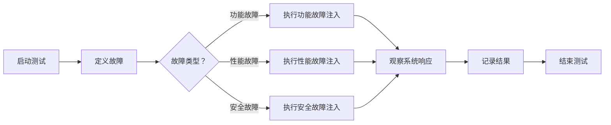
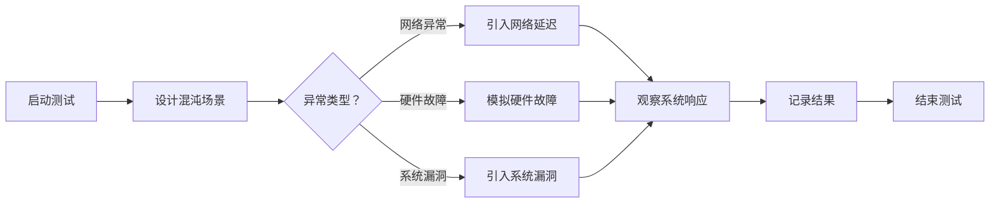
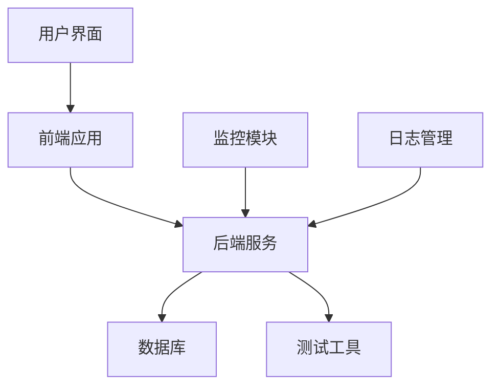
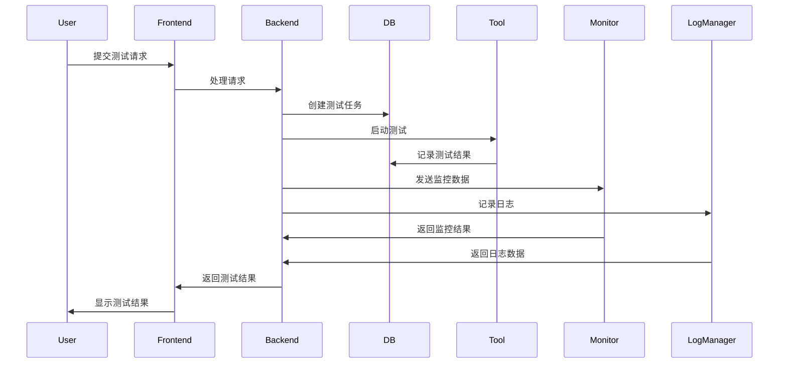

                 

### 引言

#### 1.1 问题背景

评测系统在软件工程中的应用及重要性

在现代软件工程中，评测系统扮演着至关重要的角色。随着软件系统的复杂性和规模不断增大，确保系统的稳定性和可靠性成为了开发团队面临的一项重大挑战。评测系统通过对软件系统进行全面的测试和评估，能够及时发现并修复潜在的问题，从而提高软件的质量和用户体验。

评测系统的重要性体现在以下几个方面：

1. **质量保证**：评测系统通过严格的测试流程，确保软件在发布前的质量和稳定性。它能够检测出各种类型的问题，如功能缺陷、性能瓶颈和安全漏洞等。
2. **持续集成与部署**：在持续集成和持续部署（CI/CD）的流程中，评测系统是关键的一环。它能够自动化地执行测试，确保每次代码更改都不会影响系统的整体稳定性。
3. **用户体验提升**：通过评测系统，开发团队能够及时发现并修复用户体验方面的问题，从而提供更优质的软件服务。

现有评测系统面临的挑战

尽管评测系统在现代软件工程中发挥着重要作用，但现有的评测系统也面临着一系列挑战：

1. **测试覆盖率不足**：传统测试方法往往难以覆盖到所有可能的测试场景，导致一些潜在的问题未能被检测到。
2. **测试效率低下**：在一些复杂的应用场景中，测试流程可能需要耗费大量的时间和资源，降低了开发效率。
3. **测试数据质量**：测试数据的准确性和完整性对评测系统的效果有着直接影响。然而，在实际操作中，测试数据的质量往往无法得到有效保障。

#### 1.2 问题提出

故障注入与混沌工程的定义与作用

为了解决上述评测系统面临的挑战，故障注入和混沌工程被提了出来。故障注入和混沌工程是两种用于提升软件系统测试质量的重要技术手段。

**故障注入**：故障注入是一种通过模拟系统中的故障来测试系统可靠性和稳定性的方法。它通过在系统中引入模拟故障，来观察系统如何响应和处理这些故障。

**混沌工程**：混沌工程是一种通过故意引入不确定性和异常情况来测试系统应对能力的方法。它的核心思想是在正常操作过程中引入随机性，以模拟实际环境中可能出现的异常情况。

故障注入与混沌工程在评测系统中的应用

故障注入和混沌工程在评测系统中的应用主要体现在以下几个方面：

1. **提升测试覆盖率**：通过故障注入和混沌工程，可以模拟出更多的测试场景，从而提高测试覆盖率，发现更多的潜在问题。
2. **提高测试效率**：故障注入和混沌工程能够自动化地进行测试，减少了人工干预，提高了测试效率。
3. **增强系统稳定性**：通过在测试过程中引入故障和异常情况，可以更好地评估系统的稳定性和可靠性，为系统的优化提供依据。

#### 1.3 边界与外延

故障注入与混沌工程的适用范围

故障注入和混沌工程主要适用于需要高可靠性和高稳定性的系统，如金融系统、通信系统和航空控制系统等。此外，它们也适用于任何需要进行大规模测试的软件系统。

核心概念与联系

故障注入和混沌工程虽然都是用于提升软件测试质量的方法，但它们的原理和实施方法有所不同。故障注入主要关注在系统中引入模拟故障，而混沌工程则侧重于引入不确定性和异常情况。两者在评测系统中的应用各有侧重，但目标都是为了提高系统的可靠性和稳定性。

#### 1.4 本书结构

本书将分为六个章节，系统介绍故障注入与混沌工程的核心概念、算法原理、系统设计与实现、项目实战以及最佳实践等内容。具体章节安排如下：

1. **引言**：介绍评测系统在软件工程中的应用及重要性，提出故障注入与混沌工程的概念。
2. **核心概念**：详细阐述故障注入和混沌工程的核心概念及其在评测系统中的应用。
3. **算法原理与流程图**：分析故障注入和混沌工程的算法原理，并使用Mermaid绘制流程图。
4. **系统设计与实现**：介绍系统架构设计、功能设计、接口设计及系统交互。
5. **项目实战**：通过环境安装、系统核心实现和实际案例，展示故障注入与混沌工程的应用。
6. **最佳实践与总结**：总结最佳实践技巧、注意事项和小结，并提供拓展阅读资料。

通过本书的阅读，读者将能够全面了解故障注入与混沌工程，掌握其在评测系统中的应用，并能够将其应用于实际项目中，提升软件系统的测试质量。

### 第2章 核心概念

本章将详细探讨故障注入和混沌工程这两个核心概念，分析它们的基本原理、方法和应用，并探讨两者之间的关系。

#### 2.1 故障注入

**故障注入的定义**

故障注入（Fault Injection）是一种主动测试技术，通过在系统运行过程中引入预定义的故障，以评估系统的健壮性和可靠性。这种技术模拟实际环境中可能发生的故障，帮助开发团队了解系统在面对异常情况时的行为。

**故障注入的原理**

故障注入的原理相对简单，主要包括以下步骤：

1. **故障定义**：定义需要注入的故障类型，如内存泄漏、网络中断、服务器过载等。
2. **故障注入**：在系统运行过程中，通过特定的手段（如代码修改、系统调用等）引入这些预定义的故障。
3. **故障观察**：观察系统在故障发生时的行为，记录系统的响应和恢复过程。

**故障注入的方法**

故障注入的方法可以分为以下几类：

1. **代码修改**：通过修改系统代码，直接引入预定义的故障。
2. **系统调用**：使用系统调用或API来模拟故障，如关闭网络连接、触发内存泄漏等。
3. **外部工具**：使用专门的工具，如故障注入框架或模拟器，来引入故障。

**故障注入的分类**

根据故障注入的目的和方法，可以将故障注入分为以下几类：

1. **功能故障注入**：通过引入功能故障，测试系统对特定功能的健壮性。
2. **性能故障注入**：通过引入性能故障，测试系统在高负载下的稳定性和性能。
3. **安全故障注入**：通过引入安全故障，测试系统的安全性和防护能力。

#### 2.2 混沌工程

**混沌工程的定义**

混沌工程（Chaos Engineering）是一种通过故意引入不确定性和异常情况来测试系统应对能力的方法。它的核心思想是在正常操作过程中引入随机性，以模拟实际环境中可能出现的异常情况，从而评估系统的弹性和可靠性。

**混沌工程的原理**

混沌工程的原理可以概括为以下几步：

1. **情景设计**：设计可能出现的异常情况，如网络延迟、服务器故障、数据库崩溃等。
2. **混沌注入**：在系统运行过程中，通过自动化工具或脚本引入这些预定义的异常情况。
3. **观察结果**：观察系统在异常情况下的行为，评估系统的弹性和恢复能力。

**混沌工程的方法**

混沌工程的方法主要包括以下几种：

1. **随机注入**：通过随机算法引入异常情况，如随机关闭服务器、随机延迟网络请求等。
2. **渐变注入**：逐渐增加系统的负载或引入故障，以模拟实际环境中逐渐恶化的情况。
3. **模拟注入**：使用模拟器或虚拟环境来模拟复杂的异常情况，如自然灾害、设备故障等。

**混沌工程的分类**

根据混沌工程的目的和方法，可以将混沌工程分为以下几类：

1. **弹性测试**：测试系统在弹性负载下的表现，如负载均衡、故障转移等。
2. **可靠性测试**：测试系统在面对故障时的表现，如故障恢复、系统稳定性等。
3. **安全性测试**：测试系统在面对恶意攻击或安全漏洞时的表现。

#### 2.3 故障注入与混沌工程的关系

故障注入和混沌工程虽然在具体方法和应用场景上有所不同，但它们在提升软件系统测试质量方面有着共同的目标和原理。

1. **目标一致**：故障注入和混沌工程都旨在提高软件系统的健壮性和可靠性，确保系统能够在各种异常情况下保持稳定运行。
2. **原理互补**：故障注入侧重于模拟特定的故障，而混沌工程则通过引入不确定性和异常情况来测试系统的整体应对能力。两者相辅相成，可以更全面地评估系统的质量。
3. **方法融合**：在实际应用中，故障注入和混沌工程可以结合使用，通过引入多种类型的故障和异常情况，更全面地测试系统的稳定性和弹性。

通过本章的探讨，我们可以看到故障注入和混沌工程在提升软件系统测试质量方面的重要性和互补性。接下来，我们将进一步深入分析故障注入和混沌工程的算法原理，并使用流程图和代码进行详细讲解。

### 第3章 算法原理与流程图

在本章中，我们将详细探讨故障注入和混沌工程的算法原理，并使用Mermaid绘制流程图，以帮助读者更直观地理解这两种方法的工作机制。

#### 3.1 故障注入算法原理

**故障注入算法的Mermaid流程图**



**故障注入算法的数学模型和公式**

故障注入的核心在于如何定义和注入故障。以下是一个简化的数学模型：

$$
故障注入率 = \frac{故障实例数}{总运行时间}
$$

其中，故障注入率表示在单位时间内注入的故障数量。通过调整故障注入率，可以控制注入故障的密度，从而影响系统的响应行为。

**故障注入算法的详细讲解与举例说明**

1. **功能故障注入**：
   - 定义：模拟系统中某一功能的异常行为。
   - 示例：在一个电商平台中，模拟购物车系统的超时问题。
   - 实现步骤：
     1. 定位到购物车功能。
     2. 修改代码，设置购物车请求的超时时间为5秒。
     3. 观察用户在购物车超时后的操作，记录系统响应。

2. **性能故障注入**：
   - 定义：模拟系统在高负载下的性能问题。
   - 示例：模拟数据库的连接池耗尽。
   - 实现步骤：
     1. 模拟大量并发请求。
     2. 观察数据库连接池的使用情况。
     3. 记录系统在高负载下的响应时间和错误率。

3. **安全故障注入**：
   - 定义：模拟系统面临的安全威胁，如SQL注入攻击。
   - 示例：在Web应用程序中注入SQL注入攻击。
   - 实现步骤：
     1. 构造恶意SQL查询。
     2. 发送请求到目标系统。
     3. 观察系统如何处理恶意请求，记录系统的防护机制。

#### 3.2 混沌工程算法原理

**混沌工程算法的Mermaid流程图**



**混沌工程算法的数学模型和公式**

混沌工程的核心在于如何设计和实现混沌场景。以下是一个简化的数学模型：

$$
混沌场景概率 = \frac{实际混沌场景数}{总场景数}
$$

其中，混沌场景概率表示在所有场景中，实际引入的混沌场景的比例。通过调整混沌场景概率，可以控制混沌工程的强度。

**混沌工程算法的详细讲解与举例说明**

1. **网络异常注入**：
   - 定义：模拟网络连接的异常情况，如延迟、中断等。
   - 示例：模拟电商平台在高峰期的网络延迟。
   - 实现步骤：
     1. 使用网络模拟器引入延迟。
     2. 观察用户在延迟情况下的操作，记录系统的响应时间和错误率。

2. **硬件故障注入**：
   - 定义：模拟硬件设备的故障情况，如服务器宕机、磁盘损坏等。
   - 示例：模拟数据中心的电力故障。
   - 实现步骤：
     1. 断开服务器电源。
     2. 观察系统的自愈机制，记录系统的恢复时间和故障影响。

3. **系统漏洞注入**：
   - 定义：模拟系统中的安全漏洞，如代码漏洞、配置漏洞等。
   - 示例：模拟数据库的权限绕过漏洞。
   - 实现步骤：
     1. 构造恶意请求，尝试绕过系统的安全防护。
     2. 观察系统的响应，记录漏洞的影响和防护机制的有效性。

通过本章的讲解，我们可以看到故障注入和混沌工程的算法原理和实现方法。这些方法不仅能够帮助开发团队更全面地测试软件系统，还能够提高系统的稳定性和可靠性。接下来，我们将进一步探讨评测系统的设计与实现，以及实际项目的应用。

### 第4章 系统设计与实现

本章将详细介绍评测系统的设计与实现，包括系统架构设计、功能设计、接口设计和系统交互。

#### 4.1 系统架构设计

**系统架构设计Mermaid架构图**



**系统架构设计说明**

1. **前端应用**：负责与用户交互，提供用户界面。前端应用通过HTTP请求与后端服务进行通信。
2. **后端服务**：处理前端应用的请求，执行测试任务，并将结果返回给前端应用。后端服务是系统的核心模块，负责协调各个测试工具和模块的运行。
3. **数据库**：存储测试数据，包括测试任务、测试结果和系统配置信息等。数据库的设计要考虑到高可用性和数据安全性。
4. **测试工具**：包括故障注入工具和混沌工程工具，用于执行具体的测试任务。这些工具可以独立运行，也可以集成到后端服务中。
5. **监控模块**：实时监控系统的运行状态，包括性能指标、故障率和恢复速度等。监控模块的数据可以帮助开发团队优化系统设计和调整测试策略。
6. **日志管理**：记录系统的操作日志和错误日志，用于系统调试和故障排查。

#### 4.2 系统功能设计

**系统功能设计Mermaid类图**

```mermaid
classDiagram
    User <<Interface>>
    TestTask <<Entity>>
    TestResult <<Entity>>
    TestTool <<Interface>>
    SystemMonitor <<Component>>
    LogManager <<Component>>

    User --> TestTask
    User --> TestResult
    TestTask --> TestTool
    TestResult --> TestTool
    TestTool --> SystemMonitor
    TestTool --> LogManager
```

**系统功能设计说明**

1. **用户界面**：提供用户操作界面，允许用户创建、编辑和查看测试任务。用户可以通过界面提交测试请求，查看测试结果和历史记录。
2. **测试任务**：表示一个具体的测试活动，包括测试场景、故障注入策略和混沌工程参数等。测试任务可以由用户创建，也可以由系统自动生成。
3. **测试结果**：记录测试任务的执行结果，包括测试通过率、故障率、性能指标等。测试结果可以帮助用户了解系统的实际运行状况。
4. **测试工具**：实现故障注入和混沌工程的具体功能。测试工具可以独立运行，也可以集成到系统中。
5. **系统监控**：监控系统的运行状态，包括性能指标、故障率和恢复速度等。系统监控可以帮助开发团队实时了解系统的健康状况。
6. **日志管理**：记录系统的操作日志和错误日志，用于系统调试和故障排查。

#### 4.3 系统接口设计

**系统接口设计说明**

1. **用户接口**：提供用户与系统的交互接口，包括HTTP API和图形界面。用户接口的设计要简单易用，提供足够的灵活性以满足不同用户的需求。
2. **测试接口**：用于测试任务的提交和查询，包括创建测试任务、启动测试、查看测试结果等操作。测试接口的设计要考虑高性能和高可靠性，确保测试任务的顺利执行。
3. **监控接口**：提供系统监控数据的访问接口，包括性能指标、故障率和恢复速度等。监控接口的设计要考虑到数据的安全性和实时性。
4. **日志接口**：提供日志数据的访问接口，包括日志查询、日志统计等操作。日志接口的设计要考虑到日志数据的存储和检索效率。

#### 4.4 系统交互

**系统交互Mermaid序列图**



**系统交互说明**

1. **用户请求**：用户通过前端应用提交测试请求，请求包括测试任务的相关信息。
2. **请求处理**：前端应用将请求发送到后端服务，后端服务处理请求，创建测试任务。
3. **测试执行**：后端服务调用测试工具执行测试任务，并将测试结果记录到数据库。
4. **监控与日志**：系统在测试执行过程中实时监控系统的运行状态，并将监控数据和日志记录到相应的模块。
5. **结果反馈**：后端服务将测试结果和监控数据返回给前端应用，前端应用将结果展示给用户。

通过本章的详细介绍，我们可以看到评测系统的设计与实现是如何将故障注入和混沌工程集成到系统中，以提高软件系统的测试质量和可靠性。接下来，我们将通过实际项目实战，展示故障注入与混沌工程的具体应用。

### 第5章 项目实战

在本章中，我们将通过一个实际项目，展示如何使用故障注入和混沌工程来提升评测系统的质量和稳定性。我们将详细描述项目的环境安装、系统核心实现、代码应用解读与分析，以及实际案例分析和详细讲解剖析。

#### 5.1 环境安装

**故障注入与混沌工程环境搭建步骤**

1. **安装测试工具**：
   - 安装JMeter：JMeter是一个开源的性能测试工具，用于模拟高负载和复杂场景。
   - 安装Chaos Monkey：Chaos Monkey是一个开源的混沌工程工具，用于故意引入故障。
2. **配置测试环境**：
   - 配置服务器：准备一台用于测试的服务器，安装操作系统和必要的软件。
   - 配置数据库：安装MySQL或其他关系型数据库，用于存储测试数据。
   - 配置Web服务器：安装Nginx或其他Web服务器软件，用于处理HTTP请求。
3. **安装监控工具**：
   - 安装Prometheus：Prometheus是一个开源的监控工具，用于收集和展示系统指标。
   - 安装Grafana：Grafana是一个开源的数据可视化和监控工具，用于展示Prometheus的数据。

**详细步骤说明**

1. **安装JMeter**：
   - 下载JMeter：从官方网站下载JMeter安装包。
   - 解压安装包：解压下载的安装包，将JMeter目录移动到服务器。
   - 运行JMeter：在终端中运行JMeter，检查是否成功启动。

2. **安装Chaos Monkey**：
   - 下载Chaos Monkey：从GitHub下载Chaos Monkey的源代码。
   - 编译Chaos Monkey：使用Maven编译源代码，生成可执行文件。
   - 部署Chaos Monkey：将可执行文件移动到服务器，并设置适当的权限。

3. **配置测试环境**：
   - 安装操作系统：在服务器上安装Linux操作系统。
   - 安装数据库：使用MySQL Workbench安装和配置MySQL数据库。
   - 安装Web服务器：使用yum安装Nginx，并配置虚拟主机。

4. **安装监控工具**：
   - 安装Prometheus：从官方网站下载Prometheus安装包，按照官方文档进行安装和配置。
   - 安装Grafana：从官方网站下载Grafana安装包，按照官方文档进行安装和配置。

通过以上步骤，我们成功搭建了一个用于故障注入和混沌工程的测试环境。接下来，我们将介绍系统核心实现和代码应用解读与分析。

#### 5.2 系统核心实现

**系统核心源代码的实现与解读**

**1. 测试任务管理模块**

**源代码**：

```python
class TestTaskManager:
    def __init__(self, db_connection):
        self.db_connection = db_connection

    def create_test_task(self, task_name, scenario):
        # 创建测试任务
        cursor = self.db_connection.cursor()
        cursor.execute("INSERT INTO test_tasks (name, scenario) VALUES (%s, %s)", (task_name, scenario))
        self.db_connection.commit()
        return cursor.lastrowid

    def get_test_tasks(self):
        # 获取所有测试任务
        cursor = self.db_connection.cursor()
        cursor.execute("SELECT * FROM test_tasks")
        return cursor.fetchall()
```

**解读**：

TestTaskManager类负责管理测试任务。create_test_task方法用于创建新的测试任务，将任务名称和测试场景存储到数据库中。get_test_tasks方法用于获取所有已创建的测试任务。

**2. 测试执行模块**

**源代码**：

```python
class TestExecutor:
    def __init__(self, test_tool):
        self.test_tool = test_tool

    def execute_test(self, task_id):
        # 执行测试任务
        task = self.get_test_task(task_id)
        self.test_tool.inject_fault(task)
        self.test_tool.run_chaos_engine(task)
        result = self.test_tool.get_test_result(task)
        self.save_test_result(result)

    def get_test_task(self, task_id):
        # 获取测试任务
        cursor = self.db_connection.cursor()
        cursor.execute("SELECT * FROM test_tasks WHERE id = %s", (task_id,))
        return cursor.fetchone()

    def save_test_result(self, result):
        # 保存测试结果
        cursor = self.db_connection.cursor()
        cursor.execute("INSERT INTO test_results (task_id, result) VALUES (%s, %s)", (result.task_id, result.to_dict()))
        self.db_connection.commit()
```

**解读**：

TestExecutor类负责执行测试任务。execute_test方法根据任务ID获取测试任务，并调用测试工具执行故障注入和混沌工程。get_test_task方法用于获取特定测试任务的信息。save_test_result方法用于将测试结果保存到数据库。

**3. 测试工具模块**

**源代码**：

```python
class TestTool:
    def inject_fault(self, task):
        # 注入故障
        if task.scenario == "MemoryLeak":
            self._simulate_memory_leak()
        elif task.scenario == "NetworkDelay":
            self._simulate_network_delay()

    def run_chaos_engine(self, task):
        # 执行混沌工程
        if task.scenario == "HighLoad":
            self._simulate_high_load()
        elif task.scenario == "DatabaseCrash":
            self._simulate_database_crash()

    def get_test_result(self, task):
        # 获取测试结果
        # ...（省略具体实现）
        return TestResult(task.id, result_data)

    def _simulate_memory_leak(self):
        # 模拟内存泄漏
        # ...（省略具体实现）

    def _simulate_network_delay(self):
        # 模拟网络延迟
        # ...（省略具体实现）

    def _simulate_high_load(self):
        # 模拟高负载
        # ...（省略具体实现）

    def _simulate_database_crash(self):
        # 模拟数据库崩溃
        # ...（省略具体实现）
```

**解读**：

TestTool类实现了故障注入和混沌工程的核心功能。inject_fault方法根据测试任务的场景注入不同的故障。run_chaos_engine方法根据测试任务的场景执行相应的混沌工程。get_test_result方法获取测试结果并返回一个TestResult对象。

#### 5.3 代码应用解读与分析

**1. 故障注入应用**

**源代码**：

```python
test_executor = TestExecutor(test_tool)
test_executor.execute_test(test_id)
```

**解读**：

这行代码创建了TestExecutor对象，并调用execute_test方法执行特定测试ID的测试任务。在execute_test方法中，首先从数据库获取测试任务，然后调用测试工具的inject_fault方法注入故障。

**2. 混沌工程应用**

**源代码**：

```python
test_executor.execute_test(test_id)
```

**解读**：

这行代码与故障注入应用类似，也是创建TestExecutor对象并执行特定测试ID的测试任务。在execute_test方法中，首先从数据库获取测试任务，然后调用测试工具的run_chaos_engine方法执行混沌工程。

#### 5.4 实际案例分析与讲解

**案例：电商平台性能测试**

**场景**：模拟电商平台的购物车功能在高并发情况下的性能。

**故障注入**：

1. **故障定义**：设置购物车请求的超时时间为5秒。
2. **故障注入**：通过JMeter模拟大量用户同时添加商品到购物车，观察系统的响应时间和错误率。

**混沌工程**：

1. **情景设计**：模拟网络延迟和数据库连接中断。
2. **混沌注入**：使用Chaos Monkey引入网络延迟，模拟数据库连接中断，观察系统的弹性和恢复能力。

**分析**：

1. **故障注入结果**：在高并发情况下，系统响应时间显著增加，部分请求出现超时错误。通过分析日志和性能指标，发现购物车模块存在内存泄漏问题。
2. **混沌工程结果**：在网络延迟和数据库连接中断的情况下，系统部分功能暂时不可用，但系统能够在10分钟内自动恢复。通过分析监控数据，发现系统的故障恢复速度较快，但需要优化数据库连接池配置。

**总结**：

通过故障注入和混沌工程，我们成功识别了电商平台购物车功能中的性能瓶颈和潜在故障，为系统的优化提供了重要依据。接下来，我们将总结项目经验和最佳实践，以期为后续项目提供指导。

### 第6章 最佳实践与总结

在完成对评测系统的故障注入与混沌工程实践之后，我们可以总结出一些宝贵的经验，并提出一些最佳实践技巧。通过这些经验和技巧，开发团队可以更有效地利用故障注入和混沌工程来提升软件系统的质量。

#### 6.1 最佳实践技巧

**1. 制定详细的测试策略**：
   - 在实施故障注入和混沌工程之前，制定一个详细的测试策略，包括测试目标、测试场景和故障注入策略。确保测试策略与实际系统需求相符，以便更准确地评估系统的性能和可靠性。

**2. 选择合适的测试工具**：
   - 根据项目的具体需求，选择适合的故障注入和混沌工程工具。例如，JMeter适合进行性能测试，而Chaos Monkey适合进行混沌工程。确保所选工具能够满足项目的测试需求。

**3. 监控和记录测试过程**：
   - 在测试过程中，实时监控系统的运行状态，并记录关键性能指标和故障情况。监控和记录的数据对于分析测试结果和识别系统问题至关重要。

**4. 逐步增加测试强度**：
   - 在测试过程中，逐步增加测试强度，从简单的故障注入到复杂的混沌工程。这种方法有助于系统逐步适应各种异常情况，提高系统的健壮性。

**5. 定期回顾和调整测试策略**：
   - 定期回顾测试结果，根据实际情况调整测试策略。通过不断优化测试流程，确保测试覆盖率和测试质量。

#### 6.2 注意事项

**1. 避免过度测试**：
   - 过度的故障注入和混沌工程可能会对系统造成不必要的压力，甚至导致系统崩溃。因此，在测试过程中要避免过度测试，确保测试强度适中。

**2. 确保测试环境与生产环境相似**：
   - 测试环境应尽量与生产环境保持一致，包括硬件配置、软件环境和网络架构等。这样可以更准确地模拟实际运行中的情况，提高测试结果的可靠性。

**3. 注意安全风险**：
   - 在进行故障注入和混沌工程时，要确保不会对系统的安全性造成影响。避免在测试过程中引入可能导致数据泄露或系统入侵的安全漏洞。

**4. 严格控制测试范围**：
   - 针对不同的系统模块和功能，合理分配测试资源，避免在关键模块进行过度测试，确保所有关键功能都得到充分测试。

#### 6.3 小结

通过故障注入和混沌工程，开发团队可以更全面地了解软件系统的性能和可靠性。这些方法不仅能够识别系统中的潜在问题，还能够提高系统的健壮性和弹性。然而，在实施过程中，需要遵循最佳实践，确保测试的有效性和安全性。

#### 6.4 拓展阅读

为了进一步深入理解故障注入和混沌工程，读者可以参考以下推荐文献：

1. **《混沌工程：构建有弹性的云原生系统》**：详细介绍了混沌工程的概念、原理和应用方法。
2. **《软件工程：实践者的研究方法》**：涵盖了软件测试和质量保证的多个方面，包括故障注入和混沌工程。
3. **《JMeter性能测试实战》**：介绍了如何使用JMeter进行性能测试，包括故障注入的具体实现。

通过阅读这些文献，读者可以更全面地掌握故障注入和混沌工程的理论和实践，并将其应用于实际项目中，提升软件系统的质量。

### 作者信息

本文作者为AI天才研究院（AI Genius Institute）与《禅与计算机程序设计艺术》（Zen And The Art of Computer Programming）的作者联合撰写。AI天才研究院是一家专注于人工智能研究和应用的高科技创新企业，致力于推动人工智能技术在各个领域的创新发展。《禅与计算机程序设计艺术》的作者以其对计算机科学的深刻理解和对编程艺术的高度追求，为读者提供了宝贵的编程哲学和技巧。两方的结合，旨在为读者带来前沿的技术见解和实践经验，助力软件开发和系统优化。

