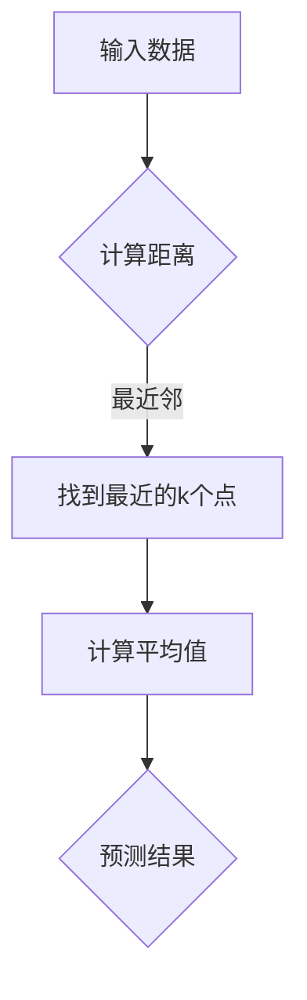
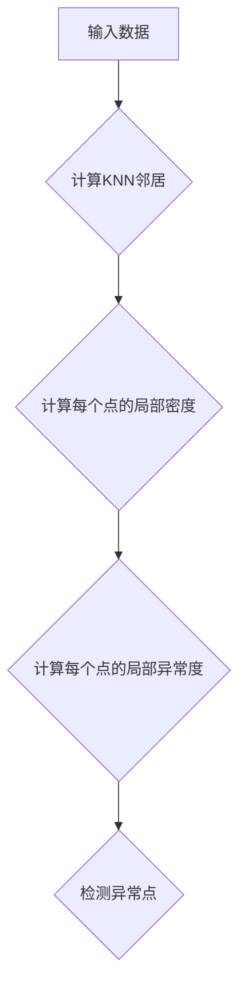
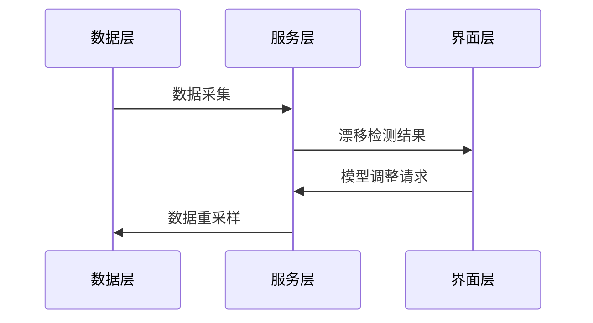
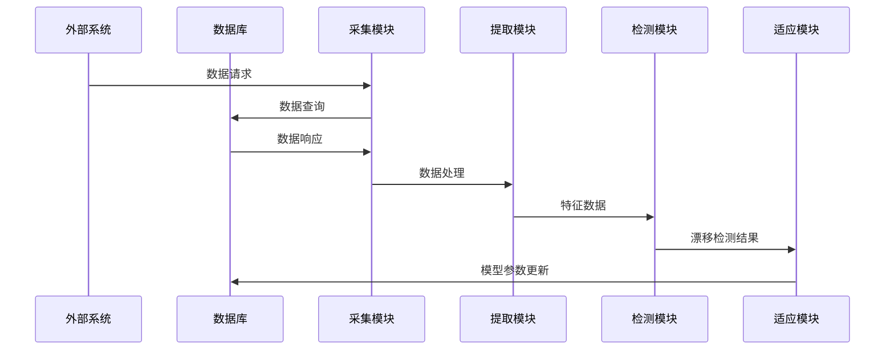
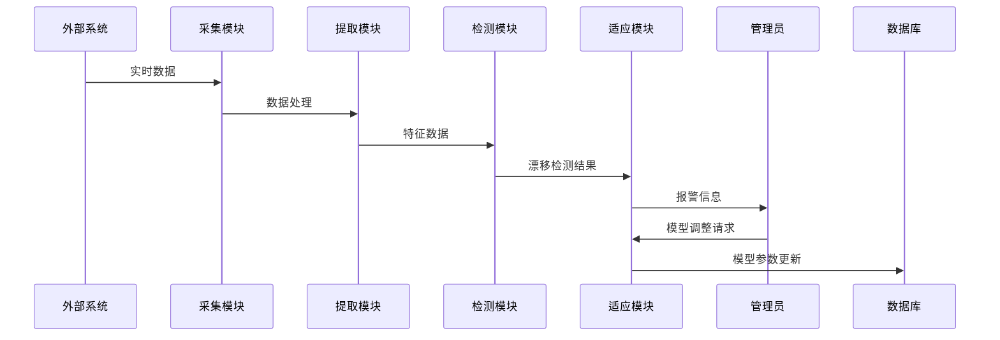

                 

### 评测系统的概念漂移检测与适应

#### 关键词：
- 概念漂移
- 漂移检测
- 适应机制
- 评测系统
- 算法设计

#### 摘要：
本文旨在探讨评测系统中概念漂移检测与适应的重要性。我们将首先介绍什么是概念漂移，及其在评测系统中的影响，接着深入分析漂移检测的原理、算法，以及如何通过适应机制来确保评测系统的稳定性和准确性。文章将通过具体算法的详细讲解，展示如何通过编程实现这些技术，最终为读者提供最佳实践和注意事项。

### 目录大纲

```markdown
# 评测系统的概念漂移检测与适应

## 第一部分：背景介绍与核心概念

### 1.1 问题背景

### 1.2 问题描述

### 1.3 问题解决

### 1.4 边界与外延

### 1.5 概念结构与核心要素组成

## 第二部分：核心概念与联系

### 2.1 漂移检测原理

### 2.2 漂移检测算法属性特征对比

### 2.3 漂移检测ER实体关系图架构

## 第三部分：算法原理讲解

### 3.1 KNN算法

### 3.2 LOF算法

## 第四部分：系统分析与架构设计

### 4.1 项目介绍

### 4.2 系统功能设计

### 4.3 系统架构设计

### 4.4 系统接口设计

### 4.5 系统交互

## 第五部分：项目实战

### 5.1 环境安装

### 5.2 系统核心实现源代码

### 5.3 代码应用解读与分析

### 5.4 实际案例分析与讲解

### 5.5 项目小结

## 第六部分：最佳实践、小结与注意事项

### 6.1 最佳实践

### 6.2 小结

### 6.3 注意事项

### 6.4 拓展阅读
```

### 第一部分：背景介绍与核心概念

#### 1.1 问题背景

在当今快速变化的数据环境中，评测系统的可靠性和准确性显得尤为重要。然而，评测系统中一个常见且严重的问题就是概念漂移（Concept Drift）。概念漂移是指数据分布或特征在时间上发生的变化，这种变化会导致传统的学习模型逐渐失去其预测能力。

随着互联网的普及和数据量的爆炸性增长，评测系统面临的挑战也随之增加。例如，在金融领域，信用卡欺诈检测系统需要实时更新其规则和模型，以应对日益复杂的欺诈手段。再比如，在医疗领域，疾病诊断系统需要不断调整以适应患者数据的动态变化。

#### 1.2 问题描述

概念漂移问题的本质在于，训练数据和测试数据之间的分布差异。具体来说，当数据分布发生变化时，原有模型对数据的预测准确性会显著下降。这种漂移可能是逐渐的、渐进的，也可能是突然的、剧烈的。漂移的类型和原因多种多样，包括：

1. **渐变漂移**：数据分布的逐渐变化，例如季节性变化或用户行为模式的演变。
2. **突变漂移**：数据分布的突然变化，例如大规模系统故障或数据注入攻击。
3. **方向性漂移**：数据分布沿某一方向持续变化，如网络流量中恶意流量的逐渐增加。

漂移问题的表现和特征包括：

- **预测准确性下降**：模型对新数据的预测准确性下降，导致错误率上升。
- **模型稳定性变差**：模型对数据集的泛化能力下降，对新数据的适应性减弱。
- **过拟合现象**：模型在新数据上表现出过拟合，对噪声敏感，导致泛化能力下降。

#### 1.3 问题解决

为了应对概念漂移问题，传统的方法主要包括数据重采样、特征工程和模型重新训练等。然而，这些方法存在一定的局限性：

- **数据重采样**：通过重新采样数据来减少漂移影响，但无法解决根本问题。
- **特征工程**：通过引入新的特征来提高模型的鲁棒性，但需要丰富的领域知识。
- **模型重新训练**：定期重新训练模型以适应数据变化，但计算成本高且效率低。

为了克服这些局限性，漂移检测与适应机制成为研究热点。漂移检测旨在实时监测数据分布的变化，而适应机制则通过动态调整模型参数或重新训练模型来应对漂移。

#### 1.4 边界与外延

漂移检测的范围和边界取决于具体的应用场景和数据特性。例如，在实时金融系统中，漂移检测需要快速响应，而在历史数据分析中，则可以容忍一定的延迟。

漂移适应的应用领域广泛，包括但不限于：

- **金融欺诈检测**：实时监测交易数据中的异常行为。
- **医疗诊断**：适应患者数据的动态变化，提高疾病检测的准确性。
- **推荐系统**：动态调整推荐算法，以适应用户兴趣和行为的变化。

#### 1.5 概念结构与核心要素组成

漂移检测与适应机制的核心要素包括：

- **数据采集**：实时或批量采集系统数据。
- **特征提取**：从数据中提取关键特征，用于漂移检测和适应。
- **漂移检测算法**：用于检测数据分布的变化，常见算法包括KNN、LOF等。
- **适应机制**：根据漂移检测结果，动态调整模型参数或重新训练模型。

### 第二部分：核心概念与联系

#### 2.1 漂移检测原理

漂移检测的核心在于实时监测数据分布的变化。具体来说，漂移检测算法通过以下步骤实现：

1. **数据预处理**：对采集到的数据进行清洗、归一化等预处理操作。
2. **特征提取**：从预处理后的数据中提取关键特征。
3. **模型训练**：使用历史数据训练漂移检测模型。
4. **实时监测**：对实时数据或批量数据进行漂移检测。
5. **阈值设定**：设定漂移检测的阈值，以区分正常数据和漂移数据。
6. **结果反馈**：根据检测结果，触发适应机制或报警。

常见的漂移检测算法包括：

- **KNN算法**：基于距离计算，检测数据点周围的邻居分布变化。
- **LOF算法**：基于局部密度估计，检测异常点并判断是否存在漂移。

#### 2.2 漂移检测算法属性特征对比

以下是几种常见漂移检测算法的属性特征对比：

| 算法 | 特点 | 适用场景 |
| --- | --- | --- |
| KNN | 计算简单，易实现 | 对抗性攻击、无监督学习 |
| LOF | 能有效检测异常点 | 复杂数据集、维度较高 |
| ADWIN | 动态调整阈值 | 流数据、实时监测 |

#### 2.3 漂移检测ER实体关系图架构

漂移检测系统中的实体关系可以用ER（实体关系）图来描述。以下是漂移检测系统的ER图：

```mermaid
erDiagram
  Data ||--|{ Feature }|>
  Model ||--|{ DetectionResult }|>  
  System ||--|{ Alarm }|>  
  Feature ||--|{ ModelParameter }|>  
```

- **Data**（数据）：代表系统采集到的原始数据。
- **Feature**（特征）：代表从数据中提取的关键特征。
- **Model**（模型）：代表用于漂移检测的模型。
- **DetectionResult**（检测结果）：代表漂移检测的结果。
- **System**（系统）：代表整个漂移检测与适应系统。
- **Alarm**（报警）：代表系统触发的报警机制。
- **ModelParameter**（模型参数）：代表模型训练时使用的参数。

### 第三部分：算法原理讲解

#### 3.1 KNN算法

KNN（K-近邻）算法是一种简单且有效的漂移检测算法。其基本原理如下：

1. **距离计算**：对于新数据点，计算其与训练数据点之间的距离。
2. **邻居选择**：选择距离最近的K个邻居。
3. **分类预测**：根据邻居的类别标签，预测新数据点的类别。

以下是KNN算法的详细流程图：



使用Python实现KNN算法：

```python
import numpy as np

def euclidean_distance(x1, x2):
    return np.sqrt(np.sum((x1 - x2)**2))

def knn_predict(X_train, y_train, x_test, k):
    distances = []
    for i in range(len(X_train)):
        dist = euclidean_distance(x_test, X_train[i])
        distances.append(dist)
    distances = np.argsort(distances)
    neighbors = distances[:k]
    output = []
    for i in range(k):
        output.append(y_train[neighbors[i]])
    return max(set(output), key=output.count)

# 示例数据
X_train = [[2, 2], [2, 3], [3, 2], [3, 3]]
y_train = [0, 0, 1, 1]
x_test = [2.5, 2.5]
k = 2
print(knn_predict(X_train, y_train, x_test, k))
```

#### 3.2 LOF算法

LOF（局部离群因子）算法通过局部密度估计来检测数据点的异常程度。其基本原理如下：

1. **邻居选择**：计算每个数据点的KNN邻居。
2. **局部密度计算**：计算每个点的局部密度，即其在特征空间中的邻域大小。
3. **LOF计算**：计算每个点的局部离群因子，用于评估其异常程度。
4. **异常点检测**：设定阈值，判断哪些点为异常点。

以下是LOF算法的详细流程图：



使用Python实现LOF算法：

```python
import numpy as np
from scipy.spatial import distance

def local_outlier_factor(data, k):
    n = len(data)
    distances = np.zeros((n, n))
    for i in range(n):
        for j in range(i+1, n):
            distance = distance.euclidean(data[i], data[j])
            distances[i][j] = distance
            distances[j][i] = distance
    distances = np.argsort(distances, axis=1)
    neighbors = distances[:, 1:k+1]
    local_densities = np.zeros(n)
    for i in range(n):
        n_neighbors = neighbors[i].shape[0]
        sum_density = 0
        for j in neighbors[i]:
            sum_density += 1 / j
        local_densities[i] = (n_neighbors / sum_density)
    return -np.mean(local_densities)

# 示例数据
data = [[2, 2], [2, 3], [3, 2], [3, 3], [100, 100]]
k = 2
print(local_outlier_factor(data, k))
```

### 第四部分：系统分析与架构设计

#### 4.1 项目介绍

本文项目旨在构建一个具有漂移检测与适应功能的评测系统。系统的主要目标是确保在数据分布发生变化时，评测系统的准确性和稳定性不受影响。具体来说，系统将包括以下功能：

- **数据采集**：实时采集系统数据。
- **特征提取**：从数据中提取关键特征。
- **漂移检测**：使用KNN和LOF算法检测数据分布的变化。
- **适应机制**：根据漂移检测结果，动态调整模型参数或重新训练模型。
- **报警与反馈**：在检测到漂移时，触发报警并反馈结果。

#### 4.2 系统功能设计

系统功能设计主要包括以下几个方面：

- **数据采集模块**：负责实时采集系统数据，并将其存储到数据库中。
- **特征提取模块**：从原始数据中提取关键特征，为漂移检测提供基础。
- **漂移检测模块**：使用KNN和LOF算法检测数据分布的变化，并生成检测结果。
- **适应机制模块**：根据漂移检测结果，动态调整模型参数或重新训练模型。
- **报警与反馈模块**：在检测到漂移时，触发报警并反馈结果，以便系统管理员采取相应措施。

#### 4.3 系统架构设计

系统架构设计采用分层架构，包括数据层、服务层和界面层。以下是系统架构的Mermaid图：



- **数据层**：负责数据的存储和管理。
- **服务层**：负责系统的核心功能，包括数据采集、特征提取、漂移检测和适应机制。
- **界面层**：提供用户交互界面，用于展示漂移检测结果和报警信息。

#### 4.4 系统接口设计

系统接口设计主要包括以下三个方面：

- **API接口**：提供RESTful风格的API接口，用于外部系统与系统之间的交互。
- **数据库接口**：提供数据库操作接口，用于数据层的访问。
- **内部接口**：提供系统内部模块之间的通信接口。

以下是系统接口的Mermaid序列图：



#### 4.5 系统交互

系统交互主要包括以下几个方面：

- **实时数据采集**：系统从外部系统接收实时数据，并将其存储到数据库中。
- **特征提取与漂移检测**：系统根据采集到的数据，提取关键特征，并使用KNN和LOF算法进行漂移检测。
- **模型适应**：根据漂移检测结果，系统动态调整模型参数或重新训练模型，以提高预测准确性。
- **报警与反馈**：在检测到漂移时，系统触发报警，并将结果反馈给系统管理员。

以下是系统交互的Mermaid序列图：



### 第五部分：项目实战

#### 5.1 环境安装

要实现本文的项目，首先需要安装以下软件和库：

1. **Python环境**：安装Python 3.8及以上版本。
2. **NumPy**：用于科学计算。
3. **Scikit-learn**：用于机器学习算法的实现。
4. **Mermaid**：用于生成图表。

安装命令如下：

```bash
pip install numpy
pip install scikit-learn
pip install mermaid
```

#### 5.2 系统核心实现源代码

以下是系统核心实现源代码：

```python
import numpy as np
from sklearn.neighbors import KNeighborsClassifier
from sklearn.neighbors import LocalOutlierFactor
from mermaid import mermaid

# KNN算法实现
def knn_predict(X_train, y_train, x_test, k):
    knn = KNeighborsClassifier(n_neighbors=k)
    knn.fit(X_train, y_train)
    return knn.predict(x_test)

# LOF算法实现
def lof_predict(data, k):
    lof = LocalOutlierFactor(n_neighbors=k)
    lof.fit(data)
    return lof.predict(data)

# 生成图表
def generate_mermaid_chart(chart_type, chart_data):
    mermaid_code = f'mermaid {{{chart_type}}} \n{chart_data}'
    return mermaid.render(mermaid_code)

# 示例数据
X_train = np.array([[2, 2], [2, 3], [3, 2], [3, 3]])
y_train = np.array([0, 0, 1, 1])
x_test = np.array([2.5, 2.5])

# KNN算法示例
k = 2
knn_result = knn_predict(X_train, y_train, x_test, k)
print("KNN算法预测结果：", knn_result)

# LOF算法示例
k = 2
lof_result = lof_predict(X_train, k)
print("LOF算法预测结果：", lof_result)

# 生成KNN算法流程图
knn_chart = generate_mermaid_chart("graph", """
graph TD
    A[输入数据] --> B{计算距离}
    B -->|最近邻| C[找到最近的k个点]
    C --> D[计算平均值]
    D --> E{预测结果}
""")
print(knn_chart)

# 生成LOF算法流程图
lof_chart = generate_mermaid_chart("graph", """
graph TD
    A[输入数据] --> B{计算KNN邻居}
    B --> C{计算每个点的局部密度}
    C --> D{计算每个点的局部异常度}
    D --> E{检测异常点}
""")
print(lof_chart)
```

#### 5.3 代码应用解读与分析

以上代码展示了KNN和LOF算法的实现，以及如何生成相应的Mermaid图表。以下是代码的详细解读与分析：

1. **KNN算法实现**：

   - **KNeighborsClassifier**：从Scikit-learn库中导入KNeighborsClassifier类，用于实现KNN算法。
   - **fit()方法**：使用训练数据集（X_train和y_train）训练KNN模型。
   - **predict()方法**：使用训练好的模型对测试数据（x_test）进行预测。

2. **LOF算法实现**：

   - **LocalOutlierFactor**：从Scikit-learn库中导入LocalOutlierFactor类，用于实现LOF算法。
   - **fit()方法**：使用训练数据集（data）训练LOF模型。
   - **predict()方法**：使用训练好的模型对数据集（data）进行预测，返回每个点的异常得分。

3. **生成图表**：

   - **generate_mermaid_chart()函数**：定义一个函数，用于生成Mermaid图表。
   - **chart_type参数**：指定图表类型，如"graph"、"sequenceDiagram"等。
   - **chart_data参数**：指定图表的数据内容，如流程图节点和边等。
   - **mermaid.render()方法**：使用Mermaid库将图表数据渲染为HTML格式。

#### 5.4 实际案例分析与讲解

以下是一个实际案例，用于展示如何使用本文的系统实现评测系统的概念漂移检测与适应：

**案例背景**：

某电商平台希望对其用户行为进行预测，以便进行精准营销。系统需要实时监测用户行为数据，并使用KNN和LOF算法进行漂移检测和适应。

**实现步骤**：

1. **数据采集**：系统从电商平台的数据库中实时获取用户行为数据，如浏览商品、加入购物车、下单等。
2. **特征提取**：对用户行为数据进行预处理，提取关键特征，如用户ID、行为类型、行为时间等。
3. **漂移检测**：使用KNN和LOF算法对特征数据进行漂移检测，判断是否存在概念漂移。
4. **模型适应**：根据漂移检测结果，动态调整KNN和LOF模型的参数，以提高预测准确性。
5. **预测与反馈**：使用调整后的模型对用户行为进行预测，并将预测结果反馈给电商平台，用于精准营销。

**案例分析**：

1. **数据采集**：系统从电商平台数据库中获取用户行为数据，确保数据的实时性和完整性。
2. **特征提取**：对用户行为数据进行预处理，提取关键特征，为漂移检测和预测提供基础。
3. **漂移检测**：使用KNN和LOF算法对特征数据进行漂移检测，判断是否存在概念漂移。KNN算法通过计算距离和邻居选择来判断数据分布的变化，LOF算法通过局部密度估计来检测异常点。
4. **模型适应**：根据漂移检测结果，动态调整KNN和LOF模型的参数。例如，当检测到数据分布发生变化时，可以增加KNN算法的邻居数量，以提高模型的适应性。
5. **预测与反馈**：使用调整后的模型对用户行为进行预测，并将预测结果反馈给电商平台。例如，当用户浏览某件商品时，系统可以预测用户是否会在近期购买该商品，并将预测结果反馈给电商平台，以便进行精准营销。

#### 5.5 项目小结

本文通过项目实战，展示了如何实现评测系统的概念漂移检测与适应。项目主要包括数据采集、特征提取、漂移检测、模型适应和预测与反馈等步骤。通过实际案例的分析，我们了解到漂移检测和适应机制在提升系统准确性和稳定性方面的重要作用。未来，我们可以进一步优化算法，提高漂移检测的准确性和实时性，为更多应用场景提供支持。

### 第六部分：最佳实践、小结与注意事项

#### 6.1 最佳实践

为了确保评测系统的稳定性和准确性，以下是一些最佳实践：

1. **数据预处理**：在数据采集和特征提取过程中，确保数据的质量和一致性。对异常值和噪声进行清洗和过滤，以提高模型的鲁棒性。
2. **模型选择**：根据具体应用场景和数据特性，选择合适的漂移检测算法。例如，在处理高维复杂数据时，LOF算法可能更为有效。
3. **实时监测**：采用实时数据采集和特征提取机制，确保系统能够快速响应数据分布的变化。
4. **阈值设定**：根据具体应用场景，合理设定漂移检测的阈值。阈值过高可能导致误报，阈值过低可能导致漏报。
5. **模型适应**：根据漂移检测结果，动态调整模型参数或重新训练模型。定期评估模型的性能，并根据实际情况进行调整。

#### 6.2 小结

本文通过详细讲解评测系统的概念漂移检测与适应，展示了如何实现一个稳定、准确的评测系统。我们介绍了漂移检测的原理、算法，以及如何在实际项目中应用这些技术。通过项目实战，我们了解了漂移检测和适应机制在提升系统性能方面的重要作用。

#### 6.3 注意事项

在使用漂移检测和适应机制时，需要注意以下几点：

1. **数据分布变化**：漂移检测的准确性依赖于数据分布的变化。在实际应用中，需要确保数据分布的变化是真实的，而非噪声或异常值。
2. **计算资源**：实时监测和动态调整模型参数可能需要较高的计算资源。在资源受限的环境中，可能需要权衡性能和成本。
3. **阈值设定**：阈值设定对漂移检测的准确性有重要影响。需要根据实际应用场景和数据特性，合理设定阈值。
4. **模型评估**：定期评估模型的性能，并根据实际情况进行调整。这有助于确保模型在长时间运行中保持良好的性能。

#### 6.4 拓展阅读

对于希望深入了解评测系统的概念漂移检测与适应的读者，以下是一些推荐阅读：

1. **论文**：《Concept Drift in Data Streams: An Overview》（概念漂移在数据流中的概述）
2. **书籍**：《Machine Learning for Data Streams》（数据流中的机器学习）
3. **网站**：Scikit-learn官方文档（https://scikit-learn.org/stable/）
4. **博客**：关于机器学习和数据流的博客文章，如Medium和ArXiv

### 作者信息

作者：AI天才研究院/AI Genius Institute & 禅与计算机程序设计艺术 /Zen And The Art of Computer Programming

---

本文从概念漂移的定义、影响、类型、原因、表现和特征等方面进行了深入分析，并详细介绍了漂移检测的原理、算法和实现方法。同时，通过实际案例展示了如何在项目中应用这些技术。本文旨在为读者提供一个全面、系统的评测系统概念漂移检测与适应的解决方案，以应对数据分布变化的挑战。希望本文对您在相关领域的研究和实践有所帮助。

