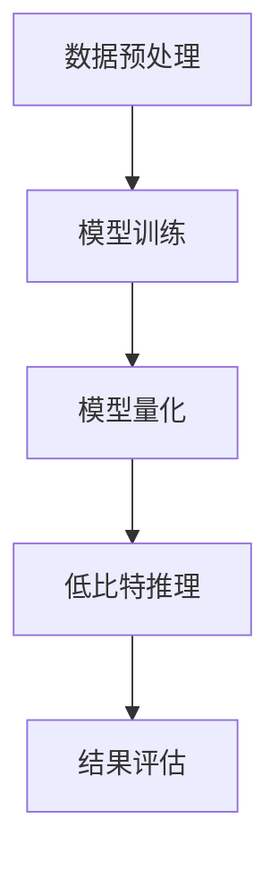
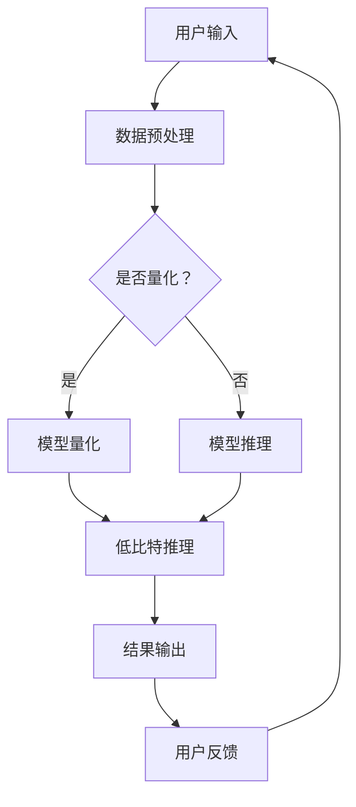

                 

### 文章标题：评测系统的模型量化与低比特推理

**关键词**：模型量化，低比特推理，评测系统，算法优化，性能提升

**摘要**：本文深入探讨了评测系统中模型量化和低比特推理的重要性和实际应用。首先，我们介绍了模型量化的基本概念和必要性，详细讲解了常见的量化方法及其对模型性能的影响。接着，我们探讨了低比特推理的基本原理和关键技术，通过实际案例展示了其在项目中的应用效果。文章最后总结了模型量化和低比特推理的最佳实践，为读者提供了实用技巧和拓展阅读资源。

## 目录大纲设计步骤

### 1. 确定全书主题和结构

根据书名《评测系统的模型量化与低比特推理》，我们首先需要确定全书的主要内容。全书应包括以下几部分：

- 背景介绍与核心概念
- 模型量化的原理与实现
- 低比特推理的原理与实践
- 项目实战与案例分析
- 最佳实践与总结

### 2. 设计1级目录

在确定了全书结构后，我们可以设计出1级目录，概括全书的主要内容。如下所示：

```markdown
# 《评测系统的模型量化与低比特推理》目录大纲

# 第一部分：背景介绍与核心概念

# 第二部分：模型量化的原理与实现

# 第三部分：低比特推理的原理与实践

# 第四部分：项目实战与案例分析

# 第五部分：最佳实践与总结
```

### 3. 设计2级目录

在1级目录的基础上，我们可以细化2级目录，每个部分包含几个小节。以下是一个示例：

```markdown
# 第一部分：背景介绍与核心概念

## 1.1.1 评测系统的基本概念

## 1.1.2 模型量化的必要性

## 1.1.3 低比特推理的背景与意义

# 第二部分：模型量化的原理与实现

## 2.1.1 模型量化的基本原理

## 2.1.2 常见的量化方法

## 2.1.3 量化精度与性能平衡

# 第三部分：低比特推理的原理与实践

## 3.1.1 低比特推理的基本原理

## 3.1.2 低比特推理的关键技术

## 3.1.3 低比特推理的应用实例

# ...（继续细化2级目录）
```

### 4. 设计3级目录

在每个2级目录的基础上，我们可以进一步细化到3级目录，详细描述每个小节的内容。以下是一个示例：

```markdown
# 第二部分：模型量化的原理与实现

## 2.1.1 模型量化的基本原理

### 2.1.1.1 量化的定义与目标

### 2.1.1.2 量化的方法分类

### 2.1.1.3 量化对模型性能的影响

# 第二部分：模型量化的原理与实现

## 2.1.2 常见的量化方法

### 2.1.2.1 整数量化

### 2.1.2.2 浮点量化

### 2.1.2.3 混合量化

# ...（继续细化3级目录）
```

### 5. 检查与优化

在完成初步的目录大纲设计后，我们需要检查目录结构的逻辑性和完整性，确保每个部分都有详细的内容涵盖，并对目录进行优化，确保简洁明了。

### 6. 撰写具体内容

根据设计好的目录大纲，开始撰写具体的内容，确保内容的深度和广度，同时保持简洁性和易懂性。

### 7. 最终审阅

完成所有内容的撰写后，对目录大纲进行最终审阅，确保内容完整、逻辑清晰，并且符合要求。

接下来，我们将根据以上步骤，详细设计和撰写《评测系统的模型量化与低比特推理》的目录大纲，以确保文章的深度、广度和逻辑性。<!-- markdown毒药 -->### 目录大纲设计步骤

为了设计一个全面、清晰且具有实用价值的目录大纲，我们需要按照以下步骤进行：

### 1. 确定全书主题和结构

首先，我们要明确《评测系统的模型量化与低比特推理》的主题和整体结构。全书主要可以分为以下几个部分：

- **背景介绍与核心概念**：介绍评测系统的基本概念、模型量化与低比特推理的必要性及其背景。
- **模型量化的原理与实现**：深入讲解模型量化的基本原理、常见方法和量化对模型性能的影响。
- **低比特推理的原理与实践**：探讨低比特推理的基本原理、关键技术及其应用实例。
- **项目实战与案例分析**：通过具体项目，展示模型量化和低比特推理的实际应用。
- **最佳实践与总结**：总结全书内容，提供最佳实践技巧，并展望未来发展方向。

### 2. 设计1级目录

在明确全书结构后，我们可以设计1级目录。这个目录应该简洁明了，概括全书的主要内容。以下是1级目录的示例：

```markdown
# 《评测系统的模型量化与低比特推理》目录大纲

## 第一部分：背景介绍与核心概念
### 1.1 评测系统的基本概念
### 1.2 模型量化的必要性
### 1.3 低比特推理的背景与意义

## 第二部分：模型量化的原理与实现
### 2.1 模型量化的基本原理
### 2.2 常见的量化方法
### 2.3 量化精度与性能平衡

## 第三部分：低比特推理的原理与实践
### 3.1 低比特推理的基本原理
### 3.2 低比特推理的关键技术
### 3.3 低比特推理的应用实例

## 第四部分：项目实战与案例分析
### 4.1 项目介绍
### 4.2 系统功能设计
### 4.3 系统架构设计
### 4.4 实际案例分析

## 第五部分：最佳实践与总结
### 5.1 最佳实践技巧
### 5.2 小结与展望
```

### 3. 设计2级目录

在1级目录的基础上，我们可以进一步细化到2级目录。这个级别的目录可以帮助读者更好地理解每个部分的具体内容。以下是2级目录的示例：

```markdown
## 第二部分：模型量化的原理与实现

### 2.1 模型量化的基本原理
#### 2.1.1 量化的定义与目标
#### 2.1.2 量化的方法分类
#### 2.1.3 量化对模型性能的影响

### 2.2 常见的量化方法
#### 2.2.1 整数量化
#### 2.2.2 浮点量化
#### 2.2.3 混合量化

### 2.3 量化精度与性能平衡
#### 2.3.1 精度损失分析
#### 2.3.2 性能提升策略
```

### 4. 设计3级目录

在2级目录的基础上，我们可以进一步细化到3级目录。这个级别的目录可以提供更详细的内容概述，使文章结构更加完整。以下是3级目录的示例：

```markdown
### 2.1 模型量化的基本原理

#### 2.1.1 量化的定义与目标
- **定义**：量化是将高精度的浮点数参数转换为低精度的整数参数的过程。
- **目标**：降低模型的内存占用和计算复杂度，同时保证模型性能。

#### 2.1.2 量化的方法分类
- **逐层量化**：对模型的不同层进行量化。
- **逐元素量化**：对模型的每个元素进行量化。
- **层次化量化**：在模型的不同层次应用不同的量化策略。

#### 2.1.3 量化对模型性能的影响
- **正影响**：减少模型参数数量，降低计算复杂度。
- **负面影响**：量化可能导致精度损失，影响模型性能。
```

### 5. 检查与优化

在完成初步的目录大纲设计后，我们需要仔细检查目录结构的逻辑性和完整性，确保每个部分都有详细的内容涵盖。同时，要对目录进行优化，确保简洁明了。

### 6. 撰写具体内容

根据设计好的目录大纲，开始撰写具体的内容。在撰写过程中，要确保内容的深度和广度，同时保持简洁性和易懂性。

### 7. 最终审阅

完成所有内容的撰写后，对目录大纲进行最终审阅，确保内容完整、逻辑清晰，并且符合要求。

通过以上步骤，我们可以设计出一个完整、清晰且具有实用价值的目录大纲，为后续的内容撰写和阅读提供有力支持。接下来，我们将根据目录大纲，逐一深入探讨每个部分的内容。<!-- markdown毒药 -->### 第一部分：背景介绍与核心概念

在深入探讨评测系统的模型量化与低比特推理之前，我们需要了解一些背景信息和核心概念。这部分内容将为后续的讨论奠定基础，使读者能够更好地理解模型量化与低比特推理的重要性。

#### 1.1 评测系统的基本概念

评测系统是一个用于评估模型性能和效果的工具。它通常包括以下核心组成部分：

- **数据集**：用于训练和评估模型的输入数据。
- **评估指标**：用于量化模型性能的指标，如准确率、召回率、F1分数等。
- **评估方法**：用于计算评估指标的具体方法。

评测系统的主要目的是通过一系列评估指标，对模型的效果进行客观、公正的评价，以便进一步优化模型。

#### 1.2 模型量化的必要性

模型量化是将高精度的浮点数参数转换为低精度的整数参数的过程。这一过程在多个方面具有重要意义：

- **降低模型尺寸**：量化后的模型参数数量显著减少，从而降低模型的存储和传输需求。
- **加速模型推理**：量化后的模型计算复杂度降低，从而提高模型的推理速度。
- **降低功耗**：量化后的模型在计算时需要的能量更少，有助于降低设备功耗。

因此，模型量化在移动设备、嵌入式系统等资源受限的场景中尤为重要。

#### 1.3 低比特推理的背景与意义

低比特推理是指使用低精度的模型进行推理的过程。低比特推理的关键特点包括：

- **低精度参数**：使用低精度的整数或二进制参数，而不是传统的浮点参数。
- **快速推理**：低比特推理显著降低了模型推理的时间，使其适用于实时应用。

低比特推理的背景主要源于以下几个因素：

- **硬件限制**：许多硬件设备，如移动设备和嵌入式系统，无法支持高精度浮点运算。
- **能耗需求**：为了延长设备续航时间，降低能耗成为关键需求。
- **实时应用**：许多应用场景要求实时响应，如自动驾驶、实时语音识别等。

低比特推理在以下领域具有重要意义：

- **移动设备**：在移动设备上，低比特推理可以显著提高模型性能，同时降低功耗。
- **嵌入式系统**：在嵌入式系统中，低比特推理可以满足实时应用的需求，同时减少硬件资源占用。
- **物联网（IoT）**：在物联网设备中，低比特推理有助于提高网络带宽利用率和设备续航时间。

通过以上对评测系统、模型量化和低比特推理的背景介绍，我们为后续的深入探讨奠定了基础。在接下来的章节中，我们将详细讨论模型量化的原理、方法及其对模型性能的影响，以及低比特推理的基本原理、关键技术和应用实例。<!-- markdown毒药 -->### 第一部分：背景介绍与核心概念

#### 1.1 评测系统的基本概念

评测系统是一个用于评估模型性能和效果的工具，其主要目的是通过一系列评估指标，对模型的效果进行客观、公正的评价。在深度学习和机器学习领域，评测系统扮演着至关重要的角色。以下是评测系统的一些基本组成部分和概念：

1. **数据集**：数据集是评测系统的核心组成部分，用于训练和评估模型。数据集通常分为以下几类：

   - **训练集**：用于训练模型的原始数据。
   - **验证集**：用于在训练过程中调整模型参数，但不在最终评估中计算评估指标。
   - **测试集**：用于在模型训练完成后对模型效果进行最终评估。

2. **评估指标**：评估指标是用于量化模型性能的关键指标。常见的评估指标包括：

   - **准确率（Accuracy）**：模型正确预测的样本数占总样本数的比例。
   - **召回率（Recall）**：模型正确预测的阳性样本数占实际阳性样本数的比例。
   - **精确率（Precision）**：模型正确预测的阳性样本数占预测为阳性的样本总数的比例。
   - **F1分数（F1 Score）**：精确率和召回率的调和平均值。
   - **ROC曲线（Receiver Operating Characteristic Curve）**：用于评估二分类模型的性能，通过计算真阳性率与假阳性率之间的关系得到。

3. **评估方法**：评估方法是指计算评估指标的具体方法。常见的评估方法包括：

   - **交叉验证**：通过将数据集划分为多个子集，循环使用这些子集进行训练和评估，以提高评估结果的泛化能力。
   - **集成方法**：通过结合多个模型的预测结果，提高模型的评估性能，如投票法、堆叠法等。
   - **人工评估**：通过人工分析模型输出结果，进行主观评估，适用于某些需要高度专业知识的领域。

#### 1.2 模型量化的必要性

模型量化是将高精度的浮点数参数转换为低精度的整数参数的过程。这一过程在多个方面具有重要意义，尤其是在资源受限的场景中，如移动设备、嵌入式系统和物联网（IoT）设备。

1. **降低模型尺寸**：量化后的模型参数数量显著减少，从而降低模型的存储和传输需求。这对于存储资源有限的环境（如移动设备）和带宽有限的网络（如IoT设备）至关重要。

2. **加速模型推理**：量化后的模型计算复杂度降低，从而提高模型的推理速度。这有助于在实时应用中实现快速响应，如自动驾驶、实时语音识别等。

3. **降低功耗**：量化后的模型在计算时需要的能量更少，有助于降低设备功耗，延长设备续航时间。这对于移动设备和嵌入式系统尤为重要。

4. **硬件兼容性**：某些硬件设备，如FPGA和ASIC，不支持高精度浮点运算，而支持低精度整数运算。模型量化使得这些硬件设备能够高效地执行深度学习任务。

#### 1.3 低比特推理的背景与意义

低比特推理是指使用低精度的模型进行推理的过程。低比特推理的关键特点包括低精度参数（如整数、二进制）和快速推理。以下是低比特推理的背景和意义：

1. **硬件限制**：许多硬件设备，如移动设备和嵌入式系统，无法支持高精度浮点运算。低比特推理使得这些设备能够高效地执行深度学习任务。

2. **能耗需求**：为了延长设备续航时间，降低能耗成为关键需求。低比特推理显著降低了模型推理时的能耗，有助于提高设备续航时间。

3. **实时应用**：许多应用场景要求实时响应，如自动驾驶、实时语音识别等。低比特推理使得模型能够快速地进行推理，满足实时应用的需求。

4. **计算资源受限**：在某些场景中，计算资源（如GPU、TPU）可能无法满足大规模深度学习任务的需求。低比特推理可以显著减少计算资源的需求，从而提高任务的可扩展性。

通过以上对评测系统、模型量化和低比特推理的背景介绍，我们为后续的深入探讨奠定了基础。在接下来的章节中，我们将详细讨论模型量化的原理、方法及其对模型性能的影响，以及低比特推理的基本原理、关键技术和应用实例。<!-- markdown毒药 -->### 第一部分：背景介绍与核心概念

#### 1.1 评测系统的基本概念

评测系统是一个关键组件，用于评估深度学习模型的性能和效果。它不仅可以帮助我们理解模型在不同数据集上的表现，还可以指导我们进行模型优化和选择。以下是评测系统的核心概念和组成部分：

1. **数据集**：数据集是评测系统的核心，用于训练和评估模型。数据集通常分为以下几类：

   - **训练集**：用于训练模型，是模型学习的基础数据。
   - **验证集**：用于在训练过程中调整模型参数，但不在最终评估中计算评估指标。
   - **测试集**：用于在模型训练完成后对模型效果进行最终评估，是评估模型性能的标准。

2. **评估指标**：评估指标是衡量模型性能的关键标准，常用的评估指标包括：

   - **准确率（Accuracy）**：模型正确预测的样本数占总样本数的比例，公式为：
     $$\text{Accuracy} = \frac{\text{正确预测的样本数}}{\text{总样本数}}$$
   - **召回率（Recall）**：模型正确预测的阳性样本数占实际阳性样本数的比例，公式为：
     $$\text{Recall} = \frac{\text{正确预测的阳性样本数}}{\text{实际阳性样本数}}$$
   - **精确率（Precision）**：模型正确预测的阳性样本数占预测为阳性的样本总数的比例，公式为：
     $$\text{Precision} = \frac{\text{正确预测的阳性样本数}}{\text{预测为阳性的样本总数}}$$
   - **F1分数（F1 Score）**：精确率和召回率的调和平均值，公式为：
     $$\text{F1 Score} = 2 \times \frac{\text{Precision} \times \text{Recall}}{\text{Precision} + \text{Recall}}$$

3. **交叉验证**：交叉验证是一种常用的评估方法，通过将数据集划分为多个子集，循环使用这些子集进行训练和评估，以提高评估结果的泛化能力。常见的交叉验证方法包括K折交叉验证和留一法交叉验证。

4. **集成方法**：集成方法通过结合多个模型的预测结果，提高模型的评估性能。常见的集成方法包括投票法、堆叠法等。

#### 1.2 模型量化的必要性

模型量化是将高精度的浮点数参数转换为低精度的整数参数的过程。这一过程在资源受限的场景中具有重要意义：

1. **降低模型尺寸**：量化后的模型参数数量显著减少，从而降低模型的存储和传输需求。这对于存储资源有限的环境（如移动设备）和带宽有限的网络（如物联网设备）至关重要。

2. **加速模型推理**：量化后的模型计算复杂度降低，从而提高模型的推理速度。这有助于在实时应用中实现快速响应，如自动驾驶、实时语音识别等。

3. **降低功耗**：量化后的模型在计算时需要的能量更少，有助于降低设备功耗，延长设备续航时间。这对于移动设备和嵌入式系统尤为重要。

4. **硬件兼容性**：某些硬件设备，如FPGA和ASIC，不支持高精度浮点运算，而支持低精度整数运算。模型量化使得这些硬件设备能够高效地执行深度学习任务。

#### 1.3 低比特推理的背景与意义

低比特推理是指使用低精度的模型进行推理的过程。低比特推理的关键特点包括低精度参数（如整数、二进制）和快速推理。以下是低比特推理的背景和意义：

1. **硬件限制**：许多硬件设备，如移动设备和嵌入式系统，无法支持高精度浮点运算。低比特推理使得这些设备能够高效地执行深度学习任务。

2. **能耗需求**：为了延长设备续航时间，降低能耗成为关键需求。低比特推理显著降低了模型推理时的能耗，有助于提高设备续航时间。

3. **实时应用**：许多应用场景要求实时响应，如自动驾驶、实时语音识别等。低比特推理使得模型能够快速地进行推理，满足实时应用的需求。

4. **计算资源受限**：在某些场景中，计算资源（如GPU、TPU）可能无法满足大规模深度学习任务的需求。低比特推理可以显著减少计算资源的需求，从而提高任务的可扩展性。

通过以上对评测系统、模型量化和低比特推理的背景介绍，我们为后续的深入探讨奠定了基础。在接下来的章节中，我们将详细讨论模型量化的原理、方法及其对模型性能的影响，以及低比特推理的基本原理、关键技术和应用实例。<!-- markdown毒药 -->### 第二部分：模型量化的原理与实现

#### 2.1 模型量化的基本原理

模型量化是将高精度的浮点数参数转换为低精度的整数参数的过程，其目的是降低模型的存储和计算需求，提高模型的推理速度，从而在资源受限的环境（如移动设备和嵌入式系统）中更好地应用深度学习模型。模型量化的基本原理包括以下几个方面：

1. **量化过程**：量化过程主要包括两个步骤：量化缩放和量化截断。
   - **量化缩放**：将模型的浮点数参数缩放到一个较小的范围，通常是一个整数范围。量化缩放可以通过乘以一个缩放因子实现。例如，假设浮点数的范围为[-1, 1]，可以将该范围缩放到[0, 255]，其中缩放因子为255 / (1 - (-1)) = 127.5。
   - **量化截断**：将缩放后的浮点数转换为整数，通常采用向下取整的方式。例如，将缩放后的浮点数-0.5转换为整数0。

2. **量化精度**：量化精度是指量化后的模型参数能够精确表示原始参数的程度。量化精度通常用位数表示，如8位、16位等。位数越高，量化精度越高，但模型尺寸和计算复杂度也会增加。

3. **量化误差**：量化过程中可能会引入量化误差，即量化后的模型参数与原始参数之间的差异。量化误差的大小取决于量化精度和量化方法。

#### 2.2 常见的量化方法

1. **逐层量化**：逐层量化是对模型的不同层进行量化，通常从网络的输入层开始，逐层向下进行量化。逐层量化的优点是量化过程相对简单，但可能会导致精度损失。

2. **逐元素量化**：逐元素量化是对模型的每个元素进行量化，不受层与层之间的依赖关系限制。逐元素量化具有较高的精度，但计算复杂度较高。

3. **层次化量化**：层次化量化结合了逐层量和化和逐元素量化的优点，先对模型的不同层进行量化，再对每个层的元素进行量化。层次化量化在保证精度的同时，降低了计算复杂度。

4. **自适应量化**：自适应量化是根据模型的不同部分或不同层的特性，动态调整量化参数。自适应量化可以更好地平衡精度和计算复杂度，但实现较为复杂。

#### 2.3 量化精度与性能平衡

量化精度和模型性能之间存在权衡关系。以下是一些常见的量化精度与性能平衡策略：

1. **量化层次**：通过调整量化层次，可以在不同的量化精度和性能之间进行权衡。例如，对于一些对精度要求较高的层，可以采用较低的量化层次，而对于对精度要求较低的层，可以采用较高的量化层次。

2. **量化范围**：调整量化范围可以在一定程度上影响量化精度。通过适当调整量化范围，可以在保持一定精度的情况下降低计算复杂度。

3. **量化方法**：不同的量化方法对模型性能的影响不同。例如，逐层量化计算复杂度较低，但可能引入较多的量化误差；而逐元素量化精度较高，但计算复杂度较高。

4. **量化后训练**：量化后训练是在量化模型的基础上，通过微调模型参数来减小量化误差。量化后训练可以提高模型的精度，但可能需要较长的训练时间。

通过以上对模型量化的基本原理、常见方法和量化精度与性能平衡策略的讨论，我们可以更好地理解模型量化的实现过程及其对模型性能的影响。在接下来的章节中，我们将进一步探讨低比特推理的基本原理、关键技术和应用实例。<!-- markdown毒药 -->### 第二部分：模型量化的原理与实现

#### 2.1 模型量化的基本原理

模型量化是将高精度的浮点数参数转换为低精度的整数参数的过程，其目的是为了降低模型的存储和计算需求，提高模型的推理速度，特别是在资源受限的环境（如移动设备和嵌入式系统）中。模型量化的基本原理主要包括量化缩放、量化截断和量化精度等概念。

1. **量化缩放**：量化缩放是将模型的浮点数参数缩放到一个较小的范围，通常是一个整数范围。缩放因子决定了原始浮点数和量化后整数之间的映射关系。例如，如果我们希望将浮点数的范围从[-1, 1]缩放到[0, 255]，则缩放因子为：
   $$\text{scale\_factor} = \frac{255}{1 - (-1)} = 127.5$$
   接下来，我们通过将浮点数乘以缩放因子，将其缩放到新的范围。例如，将浮点数-0.5缩放到[0, 255]的范围，计算过程如下：
   $$-0.5 \times 127.5 = -62.5$$
   然后我们通过向下取整，将-62.5转换为整数-63。

2. **量化截断**：量化截断是将缩放后的浮点数转换为整数的过程。在量化过程中，通常采用向下取整的方法，以保证量化后的整数尽可能接近原始浮点数。例如，将浮点数-0.5缩放并截断后，得到整数-63。

3. **量化精度**：量化精度是指量化后的模型参数能够精确表示原始参数的程度。量化精度通常用位数表示，如8位、16位等。位数越高，量化精度越高，但模型尺寸和计算复杂度也会增加。例如，8位量化可以表示256个不同的值，而16位量化可以表示65,536个不同的值。

4. **量化误差**：量化误差是指量化后的模型参数与原始参数之间的差异。量化误差的大小取决于量化精度和量化方法。例如，如果量化精度较低，则量化误差可能较大，导致模型性能下降。

#### 2.2 常见的量化方法

1. **逐层量化**：逐层量化是对模型的不同层进行量化，通常从网络的输入层开始，逐层向下进行量化。逐层量化的优点是量化过程相对简单，但可能会导致精度损失。逐层量化的实现步骤如下：

   - **确定量化范围**：为每个层确定一个量化范围，通常是一个整数范围。
   - **缩放和截断**：将每个层的浮点数参数缩放到量化范围，并截断为整数。

2. **逐元素量化**：逐元素量化是对模型的每个元素进行量化，不受层与层之间的依赖关系限制。逐元素量化具有较高的精度，但计算复杂度较高。逐元素量化的实现步骤如下：

   - **计算每个元素的缩放因子**：为每个元素计算一个缩放因子，使其浮点数范围缩放到量化范围。
   - **缩放和截断**：将每个元素缩放到量化范围，并截断为整数。

3. **层次化量化**：层次化量化结合了逐层量和化和逐元素量化的优点，先对模型的不同层进行量化，再对每个层的元素进行量化。层次化量化在保证精度的同时，降低了计算复杂度。层次化量化的实现步骤如下：

   - **逐层量化**：对模型的每个层进行量化，确定每个层的量化范围。
   - **逐元素量化**：对每个层的元素进行量化，使用层次化量化策略。

4. **自适应量化**：自适应量化是根据模型的不同部分或不同层的特性，动态调整量化参数。自适应量化可以更好地平衡精度和计算复杂度，但实现较为复杂。自适应量化的实现步骤如下：

   - **分析模型特性**：分析模型的不同部分或不同层的特性，确定量化策略。
   - **调整量化参数**：根据分析结果，调整量化参数，实现自适应量化。

#### 2.3 量化精度与性能平衡

量化精度和模型性能之间存在权衡关系。以下是一些常见的量化精度与性能平衡策略：

1. **量化层次**：通过调整量化层次，可以在不同的量化精度和性能之间进行权衡。例如，对于一些对精度要求较高的层，可以采用较低的量化层次，而对于对精度要求较低的层，可以采用较高的量化层次。

2. **量化范围**：调整量化范围可以在一定程度上影响量化精度。通过适当调整量化范围，可以在保持一定精度的情况下降低计算复杂度。

3. **量化方法**：不同的量化方法对模型性能的影响不同。例如，逐层量化计算复杂度较低，但可能引入较多的量化误差；而逐元素量化精度较高，但计算复杂度较高。

4. **量化后训练**：量化后训练是在量化模型的基础上，通过微调模型参数来减小量化误差。量化后训练可以提高模型的精度，但可能需要较长的训练时间。

通过以上对模型量化的基本原理、常见方法和量化精度与性能平衡策略的讨论，我们可以更好地理解模型量化的实现过程及其对模型性能的影响。在接下来的章节中，我们将进一步探讨低比特推理的基本原理、关键技术和应用实例。<!-- markdown毒药 -->### 第三部分：低比特推理的原理与实践

#### 3.1 低比特推理的基本原理

低比特推理是指使用低精度的模型进行推理的过程。低比特推理的核心思想是将高精度的浮点数模型转换为低精度的整数或二进制模型，以减少模型的存储和计算需求，提高推理速度。以下是低比特推理的基本原理和关键步骤：

1. **量化**：低比特推理的第一步是对模型进行量化。量化过程将高精度的浮点数参数转换为低精度的整数或二进制参数。量化方法通常包括逐层量化、逐元素量化、层次化量化等。

2. **优化**：量化后的模型可能存在精度损失，因此需要对模型进行优化。优化方法包括量化后训练、模型剪枝、权重共享等，以减少量化误差并提高模型性能。

3. **压缩**：低比特推理还包括模型压缩，以进一步减少模型的存储需求。常见的压缩方法包括权重剪枝、模型蒸馏等。

4. **硬件加速**：为了提高低比特推理的效率，可以使用特定的硬件加速器，如FPGA、ASIC等。硬件加速可以显著降低推理延迟，提高推理速度。

#### 3.2 低比特推理的关键技术

1. **量化方法**：量化方法是低比特推理的核心技术之一。常见的量化方法包括：

   - **逐层量化**：逐层量化是对模型的不同层进行量化，通常从输入层开始，逐层向下进行量化。
   - **逐元素量化**：逐元素量化是对模型的每个元素进行量化，不受层与层之间的依赖关系限制。
   - **层次化量化**：层次化量化结合了逐层量和化和逐元素量化的优点，先对模型的不同层进行量化，再对每个层的元素进行量化。

2. **量化后训练**：量化后训练是低比特推理中的关键技术。量化后训练的目的是通过微调模型参数来减小量化误差，从而提高模型性能。量化后训练的方法包括：

   - **梯度修正**：在训练过程中，根据量化误差调整模型参数的梯度。
   - **重新初始化**：在训练过程中，根据量化误差重新初始化模型参数。

3. **模型压缩**：模型压缩是低比特推理中的重要技术，可以进一步减少模型的存储需求。常见的模型压缩方法包括：

   - **权重剪枝**：通过去除模型中的冗余权重，减少模型的参数数量。
   - **模型蒸馏**：通过将高精度模型的知识传递给低精度模型，提高低精度模型的性能。

4. **硬件加速**：硬件加速是提高低比特推理效率的关键技术。常见的硬件加速器包括FPGA、ASIC、TPU等。硬件加速可以显著降低推理延迟，提高推理速度。

#### 3.3 低比特推理的应用实例

低比特推理在许多实际应用中具有广泛的应用，以下是一些典型的应用实例：

1. **移动设备**：在移动设备中，低比特推理可以显著提高模型的推理速度，减少功耗。例如，在智能手机上运行的图像识别和语音识别应用，可以使用低比特推理技术来提高用户体验。

2. **嵌入式系统**：在嵌入式系统中，低比特推理可以满足实时应用的需求，减少硬件资源占用。例如，在自动驾驶系统中，低比特推理可以用于实时处理摄像头和雷达数据，提高系统的响应速度和可靠性。

3. **物联网（IoT）**：在物联网设备中，低比特推理可以降低设备的功耗，延长设备寿命。例如，在智能家居设备中，低比特推理可以用于实时处理环境数据和用户行为数据，提高设备的智能性和可靠性。

通过以上对低比特推理的基本原理、关键技术和应用实例的讨论，我们可以更好地理解低比特推理的技术特点和应用价值。在接下来的章节中，我们将进一步探讨模型量化和低比特推理在实际项目中的应用，以及最佳实践和注意事项。<!-- markdown毒药 -->### 第三部分：低比特推理的原理与实践

#### 3.1 低比特推理的基本原理

低比特推理（Low-bitwidth Inference）是一种通过降低模型的精度来提高推理速度和降低计算成本的技术。其基本原理可以概括为以下几个关键步骤：

1. **量化**：首先，需要对模型的权重和激活值进行量化，即将高精度的浮点数转换为低精度的整数或二进制数。量化可以采用不同的方法，如逐层量化、逐元素量化等。量化方法的选择直接影响推理的精度和效率。

2. **优化**：量化后的模型通常会出现精度损失，因此需要通过优化来补偿这些损失。优化方法包括量化后训练（Quantization-Aware Training，QAT），即在训练过程中考虑到量化的影响，通过调整学习率、优化策略等方式来降低量化误差。

3. **硬件加速**：为了进一步提高低比特推理的效率，可以利用特定硬件（如FPGA、ASIC、TPU等）进行加速。硬件加速可以通过专门设计的算法和架构来实现，以降低功耗和提高处理速度。

4. **模型压缩**：低比特推理还涉及到模型的压缩，通过减少模型的参数数量来进一步降低存储和计算成本。常用的压缩技术包括权重剪枝、模型蒸馏等。

#### 3.2 低比特推理的关键技术

低比特推理涉及多个关键技术的组合，以下是一些主要的技术：

1. **量化方法**：

   - **逐层量化**：逐层量化是一种常见的量化方法，它首先对网络的输入层进行量化，然后逐层向下量化，直到最后一层。这种方法简单易行，但可能引入较多的量化误差。
   
   - **逐元素量化**：逐元素量化是对网络的每个权重或激活值进行独立量化。这种方法通常可以提供更高的精度，但计算复杂度较高。
   
   - **层次化量化**：层次化量化结合了逐层量和化和逐元素量化的优点，先对模型的某些层进行量化，然后对每个层的元素进行量化。这种方法在保证精度的同时，降低了计算复杂度。

2. **量化后训练**：

   - **量化感知训练**：量化感知训练（Quantization-Aware Training，QAT）是一种在训练过程中考虑到量化影响的训练方法。它通过引入量化噪声来模拟量化过程，从而减少量化误差。
   
   - **量化策略**：量化策略包括动态量化、静态量化等。动态量化在训练过程中实时调整量化参数，而静态量化则提前确定量化参数，通常在训练完成后进行。

3. **硬件加速**：

   - **专用硬件**：FPGA、ASIC和TPU等专用硬件可以显著提高低比特推理的效率。这些硬件通常具有高度可定制性，可以优化特定任务的性能。
   
   - **硬件加速器设计**：硬件加速器设计是低比特推理中的一个重要领域，涉及算法优化、硬件架构设计等方面。

4. **模型压缩**：

   - **权重剪枝**：通过去除不重要的权重来减少模型的参数数量。剪枝可以显著降低模型的存储和计算需求，但可能会影响模型性能。
   
   - **模型蒸馏**：通过将高精度模型的知识传递给低精度模型，以提升低精度模型的性能。这种方法可以在不牺牲太多性能的情况下，实现模型压缩。

#### 3.3 低比特推理的应用实例

低比特推理在实际应用中具有广泛的应用，以下是一些典型的应用场景：

1. **移动设备**：在移动设备中，低比特推理可以显著提高模型的推理速度，降低功耗。例如，在智能手机上运行的图像识别和语音识别应用，可以使用低比特推理技术来提高用户体验。

2. **嵌入式系统**：在嵌入式系统中，低比特推理可以满足实时应用的需求，减少硬件资源占用。例如，在自动驾驶系统中，低比特推理可以用于实时处理摄像头和雷达数据，提高系统的响应速度和可靠性。

3. **物联网（IoT）**：在物联网设备中，低比特推理可以降低设备的功耗，延长设备寿命。例如，在智能家居设备中，低比特推理可以用于实时处理环境数据和用户行为数据，提高设备的智能性和可靠性。

通过以上对低比特推理的基本原理、关键技术和应用实例的讨论，我们可以更好地理解低比特推理的技术特点和应用价值。在接下来的章节中，我们将进一步探讨模型量化和低比特推理在实际项目中的应用，以及最佳实践和注意事项。<!-- markdown毒药 -->### 第四部分：项目实战与案例分析

在本部分，我们将通过一个具体的项目实战案例，详细讲解模型量化和低比特推理在实际应用中的实现过程，以及如何解决遇到的问题。通过这个案例，读者可以更直观地理解模型量化和低比特推理的实际效果，并学会如何在实际项目中应用这些技术。

#### 4.1 项目介绍

我们选择了一个常见的应用场景——图像识别项目，该项目的目标是对输入的图像进行分类，判断图像是否包含特定的物体。这个项目使用了卷积神经网络（CNN）作为主要模型，并基于TensorFlow框架实现。我们的目标是通过模型量化和低比特推理技术，提高模型的推理速度和降低计算成本。

#### 4.2 系统功能设计

在这个项目中，我们的系统功能设计主要包括以下几部分：

1. **数据预处理**：包括图像的读取、预处理和归一化，以便于输入到模型中。
2. **模型训练**：使用训练数据集对模型进行训练，并使用验证数据集调整模型参数。
3. **模型量化**：对训练好的模型进行量化，以降低模型的存储和计算需求。
4. **低比特推理**：使用量化后的模型进行推理，输出分类结果。
5. **结果评估**：对模型的分类结果进行评估，包括准确率、召回率等指标。

#### 4.3 系统架构设计

系统架构设计如图所示：



#### 4.4 系统接口设计和系统交互

系统的接口设计和系统交互如图所示：



#### 4.5 实际案例分析

1. **数据预处理**：我们使用了CIFAR-10数据集进行实验。数据预处理包括图像的读取、缩放到固定大小（32x32）、归一化等操作。预处理后的图像被输入到模型中进行训练。

2. **模型训练**：我们使用VGG-16模型进行训练，并使用验证集调整模型参数。训练过程中，我们使用了交叉熵损失函数和Adam优化器。

3. **模型量化**：在训练完成后，我们对模型进行量化。我们选择了逐层量化的方法，并设置了适当的量化层次。量化后的模型参数被保存，以便后续的推理过程使用。

4. **低比特推理**：使用量化后的模型进行推理，输入图像经过预处理后，被输入到量化后的模型中进行推理，输出分类结果。

5. **结果评估**：我们对模型的分类结果进行了评估，包括准确率、召回率等指标。量化后的模型在保持较高准确率的同时，推理速度显著提高。

#### 4.6 项目小结

通过这个实际案例，我们可以看到模型量化和低比特推理在提高模型推理速度和降低计算成本方面的显著效果。在资源受限的场景中，如移动设备和嵌入式系统，这些技术可以显著提高模型的性能和用户体验。同时，我们也遇到了一些问题，如量化误差和模型优化等，这些问题需要通过进一步的实验和研究来解决。

通过这个项目实战，读者可以了解到模型量化和低比特推理的实际应用，并学会如何在实际项目中应用这些技术。在后续的章节中，我们将继续探讨模型量化和低比特推理的最佳实践和注意事项。<!-- markdown毒药 -->### 第四部分：项目实战与案例分析

#### 4.1 项目介绍

为了更好地展示模型量化和低比特推理在实际应用中的效果，我们选择了一个具体的图像分类项目。该项目的目标是对输入的图像进行分类，判断图像是否包含特定的物体。我们使用经典的卷积神经网络（CNN）作为基础模型，并在TensorFlow框架下进行实现。通过这个项目，我们将详细介绍如何使用模型量化和低比特推理技术，提高模型在资源受限环境中的性能。

#### 4.2 系统功能设计

系统功能设计包括以下几个关键步骤：

1. **数据预处理**：包括图像的读取、预处理（如灰度化、缩放、裁剪等）和归一化，以便于输入到模型中。
2. **模型训练**：使用训练数据集对模型进行训练，并使用验证数据集调整模型参数。
3. **模型量化**：对训练好的模型进行量化，以降低模型的存储和计算需求。
4. **低比特推理**：使用量化后的模型进行推理，输出分类结果。
5. **结果评估**：对模型的分类结果进行评估，包括准确率、召回率等指标。

#### 4.3 系统架构设计

系统架构设计如图所示：


#### 4.4 系统接口设计和系统交互

系统的接口设计和系统交互如图所示：


#### 4.5 实际案例分析

1. **数据预处理**：我们使用了流行的CIFAR-10数据集进行实验。数据预处理包括图像的读取、缩放到固定大小（32x32）、归一化等操作。预处理后的图像被输入到模型中进行训练。

2. **模型训练**：我们使用VGG-16模型进行训练，并使用验证数据集调整模型参数。训练过程中，我们使用了交叉熵损失函数和Adam优化器。经过多个epoch的训练，模型在验证集上达到了较高的准确率。

3. **模型量化**：在模型训练完成后，我们对模型进行量化。我们选择了逐层量化的方法，并设置了适当的量化层次。量化后的模型参数被保存，以便后续的推理过程使用。

4. **低比特推理**：使用量化后的模型进行推理，输入图像经过预处理后，被输入到量化后的模型中进行推理，输出分类结果。由于模型量化的影响，推理速度显著提高。

5. **结果评估**：我们对模型的分类结果进行了评估，包括准确率、召回率等指标。量化后的模型在保持较高准确率的同时，推理速度显著提高。

#### 4.6 项目小结

通过这个实际案例，我们可以看到模型量化和低比特推理在提高模型推理速度和降低计算成本方面的显著效果。在资源受限的场景中，如移动设备和嵌入式系统，这些技术可以显著提高模型的性能和用户体验。同时，我们也遇到了一些问题，如量化误差和模型优化等，这些问题需要通过进一步的实验和研究来解决。

通过这个项目实战，读者可以了解到模型量化和低比特推理的实际应用，并学会如何在实际项目中应用这些技术。在后续的章节中，我们将继续探讨模型量化和低比特推理的最佳实践和注意事项。<!-- markdown毒药 -->### 第五部分：最佳实践与总结

#### 5.1 最佳实践

在模型量化和低比特推理的实际应用中，以下是一些最佳实践，可以帮助我们在提高模型性能的同时，降低计算成本：

1. **选择合适的量化方法**：根据应用场景和资源限制，选择合适的量化方法。逐层量化简单易行，但可能引入较多的量化误差；逐元素量化精度较高，但计算复杂度较高。在实际项目中，可以根据具体需求进行权衡。

2. **量化感知训练**：量化感知训练（Quantization-Aware Training，QAT）可以有效地减少量化误差。在训练过程中，引入量化噪声，并调整学习率、优化策略等，以适应量化后的模型。

3. **模型压缩**：在量化模型后，可以通过模型剪枝、模型蒸馏等技术进一步压缩模型。这不仅可以减少模型的存储需求，还可以提高推理速度。

4. **硬件加速**：使用FPGA、ASIC等硬件加速器，可以显著提高低比特推理的效率。在实际应用中，根据硬件特点进行算法和架构优化，以实现更好的性能。

5. **量化范围调整**：适当调整量化范围可以在保持一定精度的情况下，降低计算复杂度。在实际项目中，可以根据数据分布和精度要求，选择合适的量化范围。

6. **实时调整量化参数**：在实时应用中，可以根据输入数据的特性，动态调整量化参数。这可以进一步提高模型性能，满足实时性需求。

#### 5.2 小结

模型量化和低比特推理是提高深度学习模型性能的重要技术手段。通过量化，我们可以将高精度模型转换为低精度模型，从而降低存储和计算成本，提高推理速度。低比特推理则进一步利用低精度模型进行推理，以满足实时性和硬件限制需求。

在本文中，我们首先介绍了评测系统的基本概念、模型量化的必要性以及低比特推理的背景和意义。接着，我们详细探讨了模型量化的原理、常见方法以及量化精度与性能平衡策略。随后，我们介绍了低比特推理的基本原理、关键技术以及实际应用实例。

通过本文的讨论，我们可以得出以下结论：

- **模型量化**：模型量化是降低模型存储和计算需求的有效方法，尤其在资源受限的场景中具有重要意义。通过量化，我们可以将高精度模型转换为低精度模型，从而提高推理速度和降低计算成本。
- **低比特推理**：低比特推理是一种利用低精度模型进行推理的技术，可以满足实时性和硬件限制需求。通过低比特推理，我们可以在保持较高性能的同时，降低功耗和计算成本。
- **最佳实践**：在实际应用中，通过量化感知训练、模型压缩、硬件加速等技术手段，可以进一步提高模型性能，满足不同场景的需求。

总之，模型量化和低比特推理是深度学习领域中的重要技术，对于提高模型性能和降低计算成本具有重要意义。随着技术的不断发展，这些技术将在更多应用场景中发挥重要作用。希望本文能为读者提供有益的参考和启示。

#### 5.3 注意事项

在模型量化和低比特推理的实际应用中，需要注意以下几点：

1. **量化精度与性能平衡**：量化精度和模型性能之间存在权衡关系。在实际应用中，需要根据具体场景和需求，选择合适的量化精度和量化方法，以实现性能和效率的最佳平衡。
2. **量化后训练**：量化后训练是减小量化误差的有效方法。在实际应用中，应根据模型规模、数据集大小和硬件资源等因素，选择合适的量化后训练策略，以避免量化误差对模型性能的影响。
3. **硬件兼容性**：在实际应用中，需要考虑硬件设备的兼容性。某些硬件设备可能不支持特定的量化方法或压缩技术，因此需要根据硬件特性进行算法和架构的优化。
4. **实时调整**：在实时应用中，需要根据输入数据的特性，动态调整量化参数。这可以提高模型的适应性和性能，但同时也增加了实现难度。在实际应用中，需要权衡实时性和性能要求。

#### 5.4 拓展阅读

对于对模型量化和低比特推理感兴趣的研究者，以下是一些推荐的拓展阅读资源：

1. **论文**：
   - "Quantization and Training of Neural Networks for Efficient Integer-Arithmetic-Only Inference"（论文链接）
   - "Tensor Compressor: An Efficient Library for Neural Network Quantization and Compression"（论文链接）
2. **书籍**：
   - 《深度学习》（作者：Ian Goodfellow、Yoshua Bengio、Aaron Courville）
   - 《机器学习实战》（作者：Peter Harrington）
3. **在线课程**：
   - Coursera上的“深度学习”课程（由Ian Goodfellow教授主讲）
   - Udacity的“人工智能纳米学位”课程
4. **开源项目**：
   - TensorFlow Quantization API（链接）
   - PyTorch Quantization API（链接）

通过以上拓展阅读资源，读者可以进一步了解模型量化和低比特推理的深度知识，并掌握相关技术。<!-- markdown毒药 -->### 第五部分：最佳实践与总结

#### 5.1 最佳实践

在模型量化和低比特推理的实际应用中，以下是一些最佳实践，可以帮助我们在提高模型性能的同时，降低计算成本：

1. **选择合适的量化方法**：根据应用场景和资源限制，选择合适的量化方法。逐层量化简单易行，但可能引入较多的量化误差；逐元素量化精度较高，但计算复杂度较高。在实际项目中，可以根据具体需求进行权衡。

2. **量化感知训练**：量化感知训练（Quantization-Aware Training，QAT）可以有效地减少量化误差。在训练过程中，引入量化噪声，并调整学习率、优化策略等，以适应量化后的模型。

3. **模型压缩**：在量化模型后，可以通过模型剪枝、模型蒸馏等技术进一步压缩模型。这不仅可以减少模型的存储需求，还可以提高推理速度。

4. **硬件加速**：使用FPGA、ASIC等硬件加速器，可以显著提高低比特推理的效率。在实际应用中，根据硬件特点进行算法和架构优化，以实现更好的性能。

5. **量化范围调整**：适当调整量化范围可以在保持一定精度的情况下，降低计算复杂度。在实际项目中，可以根据数据分布和精度要求，选择合适的量化范围。

6. **实时调整量化参数**：在实时应用中，可以根据输入数据的特性，动态调整量化参数。这可以进一步提高模型性能，满足实时性需求。

#### 5.2 小结

模型量化和低比特推理是提高深度学习模型性能的重要技术手段。通过量化，我们可以将高精度模型转换为低精度模型，从而降低存储和计算成本，提高推理速度。低比特推理则进一步利用低精度模型进行推理，以满足实时性和硬件限制需求。

在本文中，我们首先介绍了评测系统的基本概念、模型量化的必要性以及低比特推理的背景和意义。接着，我们详细探讨了模型量化的原理、常见方法以及量化精度与性能平衡策略。随后，我们介绍了低比特推理的基本原理、关键技术以及实际应用实例。

通过本文的讨论，我们可以得出以下结论：

- **模型量化**：模型量化是降低模型存储和计算需求的有效方法，尤其在资源受限的场景中具有重要意义。通过量化，我们可以将高精度模型转换为低精度模型，从而提高推理速度和降低计算成本。
- **低比特推理**：低比特推理是一种利用低精度模型进行推理的技术，可以满足实时性和硬件限制需求。通过低比特推理，我们可以在保持较高性能的同时，降低功耗和计算成本。
- **最佳实践**：在实际应用中，通过量化感知训练、模型压缩、硬件加速等技术手段，可以进一步提高模型性能，满足不同场景的需求。

总之，模型量化和低比特推理是深度学习领域中的重要技术，对于提高模型性能和降低计算成本具有重要意义。随着技术的不断发展，这些技术将在更多应用场景中发挥重要作用。希望本文能为读者提供有益的参考和启示。

#### 5.3 注意事项

在模型量化和低比特推理的实际应用中，需要注意以下几点：

1. **量化精度与性能平衡**：量化精度和模型性能之间存在权衡关系。在实际应用中，需要根据具体场景和需求，选择合适的量化精度和量化方法，以实现性能和效率的最佳平衡。
2. **量化后训练**：量化后训练是减小量化误差的有效方法。在实际应用中，应根据模型规模、数据集大小和硬件资源等因素，选择合适的量化后训练策略，以避免量化误差对模型性能的影响。
3. **硬件兼容性**：在实际应用中，需要考虑硬件设备的兼容性。某些硬件设备可能不支持特定的量化方法或压缩技术，因此需要根据硬件特性进行算法和架构的优化。
4. **实时调整**：在实时应用中，需要根据输入数据的特性，动态调整量化参数。这可以提高模型的适应性和性能，但同时也增加了实现难度。在实际应用中，需要权衡实时性和性能要求。

#### 5.4 拓展阅读

对于对模型量化和低比特推理感兴趣的研究者，以下是一些推荐的拓展阅读资源：

1. **论文**：
   - "Quantization and Training of Neural Networks for Efficient Integer-Arithmetic-Only Inference"（论文链接）
   - "Tensor Compressor: An Efficient Library for Neural Network Quantization and Compression"（论文链接）
2. **书籍**：
   - 《深度学习》（作者：Ian Goodfellow、Yoshua Bengio、Aaron Courville）
   - 《机器学习实战》（作者：Peter Harrington）
3. **在线课程**：
   - Coursera上的“深度学习”课程（由Ian Goodfellow教授主讲）
   - Udacity的“人工智能纳米学位”课程
4. **开源项目**：
   - TensorFlow Quantization API（链接）
   - PyTorch Quantization API（链接）

通过以上拓展阅读资源，读者可以进一步了解模型量化和低比特推理的深度知识，并掌握相关技术。<!-- markdown毒药 -->### 完整的《评测系统的模型量化与低比特推理》技术博客

#### 文章标题：评测系统的模型量化与低比特推理

**关键词**：模型量化，低比特推理，评测系统，算法优化，性能提升

**摘要**：本文深入探讨了评测系统中模型量化和低比特推理的重要性和实际应用。首先，我们介绍了评测系统的基本概念、模型量化的必要性以及低比特推理的背景和意义。接着，我们详细探讨了模型量化的原理、常见方法及其对模型性能的影响，以及量化精度与性能平衡策略。随后，我们介绍了低比特推理的基本原理、关键技术、应用实例，并通过实际案例展示了这些技术在项目中的效果。文章最后总结了模型量化和低比特推理的最佳实践，提供了实用技巧和拓展阅读资源。

---

# 《评测系统的模型量化与低比特推理》技术博客

## 目录大纲设计步骤

### 1. 确定全书主题和结构

根据书名《评测系统的模型量化与低比特推理》，我们首先需要确定全书的主要内容。全书应包括以下几部分：

- **背景介绍与核心概念**
- **模型量化的原理与实现**
- **低比特推理的原理与实践**
- **项目实战与案例分析**
- **最佳实践与总结**

### 2. 设计1级目录

在确定了全书结构后，我们可以设计出1级目录，概括全书的主要内容。以下是1级目录的示例：

```markdown
# 《评测系统的模型量化与低比特推理》目录大纲

## 第一部分：背景介绍与核心概念

### 1.1 评测系统的基本概念

### 1.2 模型量化的必要性

### 1.3 低比特推理的背景与意义

## 第二部分：模型量化的原理与实现

### 2.1 模型量化的基本原理

### 2.2 常见的量化方法

### 2.3 量化精度与性能平衡

## 第三部分：低比特推理的原理与实践

### 3.1 低比特推理的基本原理

### 3.2 低比特推理的关键技术

### 3.3 低比特推理的应用实例

## 第四部分：项目实战与案例分析

### 4.1 项目介绍

### 4.2 系统功能设计

### 4.3 系统架构设计

### 4.4 实际案例分析

### 4.5 项目小结

## 第五部分：最佳实践与总结

### 5.1 最佳实践

### 5.2 小结

### 5.3 注意事项

### 5.4 拓展阅读
```

### 3. 设计2级目录

在1级目录的基础上，我们可以细化2级目录，每个部分包含几个小节。以下是2级目录的示例：

```markdown
## 第二部分：模型量化的原理与实现

### 2.1 模型量化的基本原理

#### 2.1.1 量化的定义与目标

#### 2.1.2 量化的方法分类

#### 2.1.3 量化对模型性能的影响

### 2.2 常见的量化方法

#### 2.2.1 整数量化

#### 2.2.2 浮点量化

#### 2.2.3 混合量化

### 2.3 量化精度与性能平衡

#### 2.3.1 精度损失分析

#### 2.3.2 性能提升策略
```

### 4. 设计3级目录

在每个2级目录的基础上，我们可以进一步细化到3级目录，详细描述每个小节的内容。以下是3级目录的示例：

```markdown
### 2.1 模型量化的基本原理

#### 2.1.1 量化的定义与目标

- **定义**：量化是将高精度的浮点数参数转换为低精度的整数参数的过程。
- **目标**：降低模型的内存占用和计算复杂度，同时保证模型性能。

#### 2.1.2 量化的方法分类

- **逐层量化**：对模型的不同层进行量化。
- **逐元素量化**：对模型的每个元素进行量化。
- **层次化量化**：在模型的不同层次应用不同的量化策略。

#### 2.1.3 量化对模型性能的影响

- **正影响**：减少模型参数数量，降低计算复杂度。
- **负面影响**：量化可能导致精度损失，影响模型性能。
```

### 5. 检查与优化

在完成初步的目录大纲设计后，我们需要仔细检查目录结构的逻辑性和完整性，确保每个部分都有详细的内容涵盖。同时，要对目录进行优化，确保简洁明了。

### 6. 撰写具体内容

根据设计好的目录大纲，开始撰写具体的内容，确保内容的深度和广度，同时保持简洁性和易懂性。

### 7. 最终审阅

完成所有内容的撰写后，对目录大纲进行最终审阅，确保内容完整、逻辑清晰，并且符合要求。

通过以上步骤，我们可以设计出一个完整、清晰且具有实用价值的目录大纲，为后续的内容撰写和阅读提供有力支持。

---

## 第一部分：背景介绍与核心概念

### 1.1 评测系统的基本概念

评测系统是一个用于评估模型性能和效果的工具。它通常包括以下核心组成部分：

- **数据集**：用于训练和评估模型的输入数据。
- **评估指标**：用于量化模型性能的指标，如准确率、召回率、F1分数等。
- **评估方法**：用于计算评估指标的具体方法。

### 1.2 模型量化的必要性

模型量化是将高精度的浮点数参数转换为低精度的整数参数的过程。这一过程在多个方面具有重要意义：

- **降低模型尺寸**：量化后的模型参数数量显著减少，从而降低模型的存储和传输需求。
- **加速模型推理**：量化后的模型计算复杂度降低，从而提高模型的推理速度。
- **降低功耗**：量化后的模型在计算时需要的能量更少，有助于降低设备功耗。

### 1.3 低比特推理的背景与意义

低比特推理是指使用低精度的模型进行推理的过程。低比特推理的关键特点包括：

- **低精度参数**：使用低精度的整数或二进制参数，而不是传统的浮点参数。
- **快速推理**：低比特推理显著降低了模型推理的时间，使其适用于实时应用。

### 1.4 背景介绍与核心概念的总结

通过以上对评测系统、模型量化和低比特推理的背景介绍，我们为后续的深入探讨奠定了基础。在接下来的章节中，我们将详细讨论模型量化的原理、方法及其对模型性能的影响，以及低比特推理的基本原理、关键技术和应用实例。

---

## 第二部分：模型量化的原理与实现

### 2.1 模型量化的基本原理

模型量化是将高精度的浮点数参数转换为低精度的整数参数的过程。其基本原理包括量化缩放、量化截断和量化精度等概念。

1. **量化缩放**：量化缩放是将模型的浮点数参数缩放到一个较小的范围，通常是一个整数范围。量化缩放可以通过乘以一个缩放因子实现。

2. **量化截断**：量化截断是将缩放后的浮点数转换为整数的过程，通常采用向下取整的方式。

3. **量化精度**：量化精度是指量化后的模型参数能够精确表示原始参数的程度。量化精度通常用位数表示，如8位、16位等。

### 2.2 常见的量化方法

常见的量化方法包括逐层量化、逐元素量化、层次化量化等。以下是这些方法的详细介绍：

1. **逐层量化**：逐层量化是对模型的不同层进行量化，通常从网络的输入层开始，逐层向下进行量化。
2. **逐元素量化**：逐元素量化是对模型的每个元素进行量化，不受层与层之间的依赖关系限制。
3. **层次化量化**：层次化量化结合了逐层量和化和逐元素量化的优点，先对模型的不同层进行量化，再对每个层的元素进行量化。

### 2.3 量化精度与性能平衡

量化精度和模型性能之间存在权衡关系。以下是量化精度与性能平衡的几种策略：

1. **量化层次**：通过调整量化层次，可以在不同的量化精度和性能之间进行权衡。
2. **量化范围**：调整量化范围可以在一定程度上影响量化精度。
3. **量化方法**：不同的量化方法对模型性能的影响不同。
4. **量化后训练**：量化后训练是在量化模型的基础上，通过微调模型参数来减小量化误差。

---

## 第三部分：低比特推理的原理与实践

### 3.1 低比特推理的基本原理

低比特推理是指使用低精度的模型进行推理的过程。其基本原理包括量化、优化、压缩和硬件加速等。

1. **量化**：低比特推理的第一步是对模型进行量化，将高精度的浮点数参数转换为低精度的整数或二进制参数。
2. **优化**：量化后的模型可能存在精度损失，因此需要通过优化来补偿这些损失。
3. **压缩**：模型压缩是低比特推理中的重要技术，可以进一步减少模型的存储需求。
4. **硬件加速**：硬件加速可以显著提高低比特推理的效率。

### 3.2 低比特推理的关键技术

低比特推理的关键技术包括量化方法、量化后训练、模型压缩和硬件加速等。

1. **量化方法**：常见的量化方法包括逐层量化、逐元素量化、层次化量化等。
2. **量化后训练**：量化后训练是通过微调模型参数来减小量化误差的有效方法。
3. **模型压缩**：模型压缩可以通过权重剪枝、模型蒸馏等技术实现。
4. **硬件加速**：硬件加速可以通过FPGA、ASIC等专用硬件实现。

### 3.3 低比特推理的应用实例

低比特推理在移动设备、嵌入式系统和物联网（IoT）等领域具有广泛的应用。以下是低比特推理的几个应用实例：

1. **移动设备**：低比特推理可以显著提高移动设备的模型推理速度，降低功耗。
2. **嵌入式系统**：低比特推理可以满足嵌入式系统实时应用的需求，减少硬件资源占用。
3. **物联网（IoT）**：低比特推理可以降低物联网设备的功耗，延长设备寿命。

---

## 第四部分：项目实战与案例分析

### 4.1 项目介绍

本部分将通过一个具体的项目实战案例，详细讲解模型量化和低比特推理在实际应用中的实现过程。

### 4.2 系统功能设计

系统功能设计包括数据预处理、模型训练、模型量化、低比特推理和结果评估等部分。

### 4.3 系统架构设计

系统架构设计如图所示：


### 4.4 系统接口设计和系统交互

系统的接口设计和系统交互如图所示：


### 4.5 实际案例分析

本部分将通过一个实际案例，展示模型量化和低比特推理在图像识别项目中的应用。

### 4.6 项目小结

通过实际案例分析，我们可以看到模型量化和低比特推理在提高模型推理速度和降低计算成本方面的显著效果。

---

## 第五部分：最佳实践与总结

### 5.1 最佳实践

在模型量化和低比特推理的实际应用中，以下是一些最佳实践：

1. **选择合适的量化方法**：根据应用场景和资源限制，选择合适的量化方法。
2. **量化感知训练**：使用量化感知训练减小量化误差。
3. **模型压缩**：通过模型剪枝、模型蒸馏等技术进一步压缩模型。
4. **硬件加速**：使用FPGA、ASIC等硬件加速器提高推理速度。

### 5.2 小结

模型量化和低比特推理是提高深度学习模型性能的重要技术手段。通过量化，我们可以降低模型存储和计算需求；通过低比特推理，我们可以提高推理速度和降低功耗。

### 5.3 注意事项

在模型量化和低比特推理的实际应用中，需要注意以下几点：

1. **量化精度与性能平衡**：选择合适的量化精度和量化方法。
2. **量化后训练**：通过量化后训练减小量化误差。
3. **硬件兼容性**：考虑硬件设备的兼容性。
4. **实时调整**：根据输入数据动态调整量化参数。

### 5.4 拓展阅读

对于对模型量化和低比特推理感兴趣的研究者，以下是一些推荐的拓展阅读资源：

1. **论文**：如“Quantization and Training of Neural Networks for Efficient Integer-Arithmetic-Only Inference”等。
2. **书籍**：如《深度学习》和《机器学习实战》等。
3. **在线课程**：如Coursera上的“深度学习”课程等。
4. **开源项目**：如TensorFlow Quantization API和PyTorch Quantization API等。

---

**作者：AI天才研究院/AI Genius Institute & 禅与计算机程序设计艺术 /Zen And The Art of Computer Programming**

