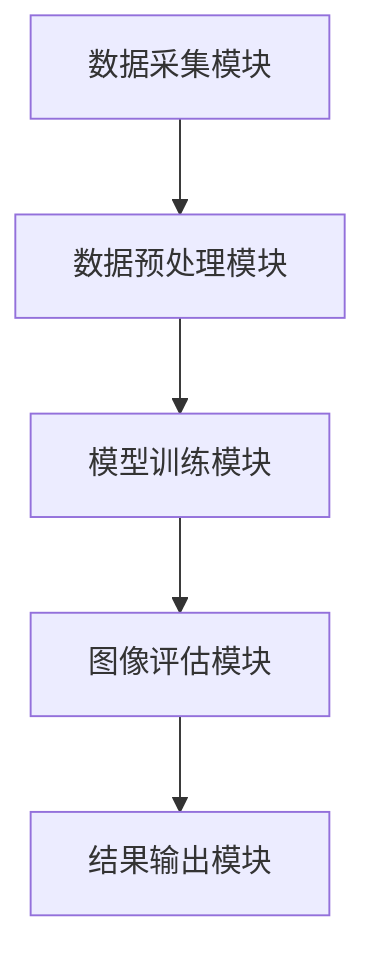
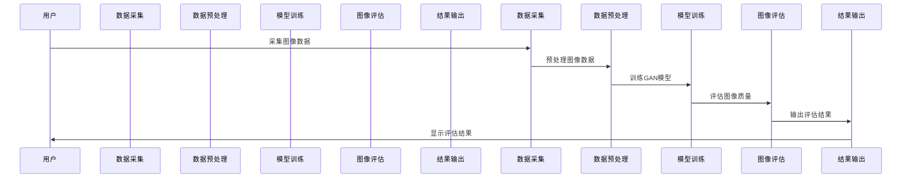

                 

## 第一部分：背景介绍

### 第1章：评测系统的深度生成模型应用

#### 1.1 问题背景

随着人工智能技术的快速发展，评测系统在各个领域得到广泛应用。传统的评测系统主要依赖于规则和模板进行评估，但在面对复杂多变的任务时，其性能受到限制。深度生成模型，作为近年来人工智能领域的重要突破，为评测系统带来了新的可能性。

#### 1.1.1 问题描述

本文探讨如何将深度生成模型应用于评测系统，以提高其性能和适应性。本文将重点关注以下几个方面：

- 深度生成模型的基本概念和原理
- 深度生成模型在评测系统中的应用场景
- 深度生成模型在评测系统中的实现方法
- 深度生成模型在评测系统中的性能评估

#### 1.1.2 问题解决

本文将结合实际案例，详细阐述如何将深度生成模型应用于评测系统，从而解决传统评测系统的局限性。

#### 1.1.3 边界与外延

本文主要关注深度生成模型在评测系统中的应用，但深度生成模型的应用范围远不止于此。本文将在后续章节中进一步探讨深度生成模型在其他领域的应用。

#### 1.1.4 概念结构与核心要素组成

- 深度生成模型：基于神经网络，通过学习数据生成新的数据
- 评测系统：对特定领域的问题进行评估和判断的系统
- 应用场景：需要自适应性和灵活性的评测任务

#### 1.2 核心概念与联系

##### 1.2.1 深度生成模型

深度生成模型是一类基于神经网络的概率模型，能够生成与训练数据分布相似的新数据。其主要目的是学习数据的分布，并生成具有真实感的数据。

##### 1.2.2 深度生成模型的核心特点

- 基于概率模型，能够生成具有真实感的数据
- 能够自适应地调整模型参数，提高生成数据的多样性
- 对大量数据进行学习，能够捕捉数据的复杂结构

##### 1.2.3 评测系统

评测系统是一类专门用于对特定领域的问题进行评估和判断的系统。其主要目的是通过对问题的分析，给出相应的评估结果。

##### 1.2.4 深度生成模型在评测系统中的应用

深度生成模型在评测系统中的应用，主要体现在以下几个方面：

- 基于深度生成模型，能够生成与真实数据相似的评价指标，提高评测系统的适应性
- 通过深度生成模型，能够动态调整评测指标，以适应不同场景的需求
- 利用深度生成模型，能够自动学习新的评价指标，提高评测系统的智能化程度

##### 1.3 主流深度生成模型简介

##### 1.3.1 GAN（生成对抗网络）

GAN是一种基于对抗训练的深度生成模型，主要由生成器和判别器两部分组成。生成器的目标是生成与真实数据相似的数据，而判别器的目标是判断生成数据与真实数据之间的差异。

##### 1.3.2 VAE（变分自编码器）

VAE是一种基于概率模型的深度生成模型，通过编码器和解码器两个部分进行数据的生成。编码器将数据编码成一个潜在空间，而解码器将潜在空间的数据解码回数据空间。

##### 1.3.3 其他知名深度生成模型

除了GAN和VAE，还有一些其他知名的深度生成模型，如CycleGAN、StyleGAN等。这些模型在不同领域和应用场景中都有较好的表现。

##### 1.4 深度生成模型在评测系统中的应用前景

##### 1.4.1 潜在应用领域

深度生成模型在评测系统中的应用前景非常广泛，可以应用于以下领域：

- 自动化测试：通过生成与真实数据相似的数据，提高测试的覆盖率和效果
- 人才评估：通过对简历、作品集等数据的生成，评估候选人的能力和潜力
- 信贷评估：通过生成与客户数据相似的数据，提高信贷评估的准确性

##### 1.4.2 企业采用深度生成模型的优势

- 提高评测系统的适应性和灵活性，应对复杂多变的任务
- 降低人力成本，提高工作效率
- 提高评测结果的准确性和可靠性

##### 1.4.3 深度生成模型在评测系统应用的挑战与机遇

- 挑战：深度生成模型对计算资源和数据质量有较高要求，且训练过程复杂
- 机遇：随着硬件和算法的不断发展，深度生成模型在评测系统中的应用前景将更加广阔

##### 1.5 本章小结

本章主要介绍了评测系统的深度生成模型应用。首先，分析了深度生成模型的基本概念和原理，然后介绍了其在评测系统中的应用场景和优势。通过本章的学习，读者可以初步了解深度生成模型在评测系统中的应用，并为后续章节的学习打下基础。## 第二部分：深度生成模型基础

### 第2章：深度生成模型原理

#### 2.1 深度生成模型简介

深度生成模型（Deep Generative Model）是一类基于深度学习的生成模型，主要目的是学习数据的概率分布，并能够生成具有真实感的新数据。深度生成模型在图像处理、自然语言处理、音频生成等领域具有广泛的应用。常见的深度生成模型包括生成对抗网络（GAN）、变分自编码器（VAE）等。

#### 2.2 生成对抗网络（GAN）

GAN（Generative Adversarial Network）是由Ian Goodfellow等人于2014年提出的一种深度生成模型。GAN的核心思想是通过两个对抗性的神经网络——生成器（Generator）和判别器（Discriminator）进行训练，使得生成器能够生成尽可能真实的数据，而判别器能够准确地区分生成数据和真实数据。

**2.2.1 GAN的基本结构**

GAN由以下两部分组成：

1. **生成器（Generator）**：生成器的目标是生成与真实数据相似的数据。生成器通常是一个从随机噪声向数据空间映射的网络。例如，在生成图像的任务中，生成器会从随机噪声中生成图像。

2. **判别器（Discriminator）**：判别器的目标是判断输入数据是真实数据还是生成数据。判别器是一个二分类模型，接收输入数据并输出一个概率，表示输入数据是真实数据的概率。

**2.2.2 GAN的训练过程**

GAN的训练过程是一个对抗性的过程，通过迭代优化两个网络的参数：

1. **生成器训练**：生成器的目标是生成足够真实的数据，使得判别器无法准确地区分生成数据和真实数据。生成器通过从噪声空间中生成数据，然后让判别器对生成数据和真实数据进行分类。

2. **判别器训练**：判别器的目标是能够准确地判断输入数据是真实数据还是生成数据。判别器通过对真实数据和生成数据进行分类，学习如何提高对生成数据的辨别能力。

**2.2.3 GAN的优化策略**

GAN的训练过程中，生成器和判别器的优化策略需要相互平衡。以下是一些常用的优化策略：

1. **梯度惩罚**：为了防止生成器生成过于简单的数据，可以引入梯度惩罚，使得生成器在生成复杂数据时获得更好的梯度。

2. **学习率调整**：由于生成器和判别器的优化目标不同，通常需要对两个网络的学习率进行调整，以避免生成器或判别器出现过拟合。

3. **随机初始化**：生成器和判别器通常使用随机初始化，以避免在训练过程中陷入局部最小值。

#### 2.3 变分自编码器（VAE）

变分自编码器（Variational Autoencoder，VAE）是另一种常见的深度生成模型，由Kingma和Welling于2013年提出。VAE通过引入变分推断的方法，解决了GAN训练过程中的不稳定性和困难性。

**2.3.1 VAE的基本结构**

VAE由以下两部分组成：

1. **编码器（Encoder）**：编码器的目标是学习数据的概率分布参数。编码器将输入数据映射到一个潜在空间，并输出潜在变量的参数。

2. **解码器（Decoder）**：解码器的目标是生成与输入数据相似的新数据。解码器从潜在空间中采样数据，并重构输入数据。

**2.3.2 VAE的变分推断**

VAE的核心思想是使用变分推断来近似数据分布。变分推断通过引入变分下界（Variational Lower Bound）来优化模型：

$$
L(\theta) = E_{q(z|x)}[log(p(x|z))] - E_{q(z|x)}[D(q(z|x), p(z))]
$$

其中，$p(x|z)$是生成模型，$q(z|x)$是编码器，$D(q(z|x), p(z))$是KL散度（Kullback-Leibler Divergence），表示两个概率分布之间的距离。

**2.3.3 VAE的训练过程**

VAE的训练过程是通过优化变分下界来完成的。训练过程中，编码器学习如何更好地表示输入数据的概率分布，解码器学习如何从潜在空间中生成与输入数据相似的新数据。

**2.4 深度生成模型的应用场景**

深度生成模型在多个领域都有广泛的应用：

1. **图像生成**：如艺术创作、图像修复、图像超分辨率等。
2. **自然语言处理**：如文本生成、机器翻译、语音合成等。
3. **医学影像**：如疾病检测、图像分割、影像增强等。
4. **游戏开发**：如游戏角色建模、场景渲染等。

**2.5 本章小结**

本章介绍了深度生成模型的基本概念和原理，包括生成对抗网络（GAN）和变分自编码器（VAE）。通过了解GAN和VAE的工作原理和应用，读者可以更好地理解深度生成模型在评测系统中的潜力。接下来，我们将进一步探讨深度生成模型在评测系统中的应用场景和实现方法。## 第三部分：评测系统的深度生成模型应用

### 第3章：深度生成模型在评测系统中的应用

#### 3.1 应用场景

深度生成模型在评测系统中的应用场景非常广泛。以下是一些典型的应用场景：

1. **图像评测**：在图像评测领域，深度生成模型可以用于生成与真实图像相似的评价样本，提高评测系统的鲁棒性和泛化能力。
2. **文本评测**：在文本评测领域，深度生成模型可以用于生成与真实文本相似的样本，用于评测文本质量、语义理解等。
3. **语音评测**：在语音评测领域，深度生成模型可以用于生成与真实语音相似的样本，用于评测语音的清晰度、语调等。
4. **医学影像评测**：在医学影像领域，深度生成模型可以用于生成与真实医学影像相似的样本，用于评测图像分割、疾病检测等。

#### 3.2 应用原理

深度生成模型在评测系统中的应用原理主要包括以下几个方面：

1. **数据生成**：深度生成模型通过学习大量真实数据，生成与真实数据相似的新数据，用于评测系统的训练和评估。
2. **多样性增强**：深度生成模型能够生成具有多样性的新数据，提高评测系统的适应性和灵活性。
3. **鲁棒性提升**：通过生成与真实数据相似的新数据，评测系统可以更好地应对数据噪声和异常值。

#### 3.3 实现方法

以下是一些深度生成模型在评测系统中的具体实现方法：

1. **GAN在图像评测中的应用**：

   - **数据生成**：使用GAN生成与真实图像相似的评价样本，提高评测系统的鲁棒性和泛化能力。
   - **多样性增强**：通过调整GAN的生成器和判别器的参数，生成具有多样性的图像样本。
   - **鲁棒性提升**：在训练过程中，通过引入对抗性训练和梯度惩罚等技术，提高GAN模型的鲁棒性。

2. **VAE在文本评测中的应用**：

   - **数据生成**：使用VAE生成与真实文本相似的样本，用于评测文本质量、语义理解等。
   - **多样性增强**：通过调整VAE的编码器和解码器的参数，生成具有多样性的文本样本。
   - **鲁棒性提升**：在训练过程中，通过优化VAE的变分下界和引入梯度惩罚等技术，提高VAE模型的鲁棒性。

3. **其他深度生成模型的应用**：

   - **CycleGAN**：用于图像到图像的转换，如将夜晚图像转换为白天图像。
   - **StyleGAN**：用于生成高分辨率的自然图像，常用于艺术创作和游戏开发。

#### 3.4 性能评估

深度生成模型在评测系统中的应用性能可以从以下几个方面进行评估：

1. **生成质量**：评估生成数据的真实感和质量，如使用SSIM（结构相似性指数）和PSNR（峰值信噪比）等指标。
2. **适应性和灵活性**：评估生成模型在不同应用场景下的适应性和灵活性。
3. **鲁棒性**：评估生成模型在处理异常数据和噪声数据时的鲁棒性。

#### 3.5 实际案例

以下是一个实际案例，说明如何将GAN应用于图像评测系统：

1. **数据集准备**：准备一个包含大量真实图像的数据集，用于训练GAN模型。
2. **模型训练**：使用GAN模型生成与真实图像相似的评价样本，通过对抗性训练优化生成器和判别器的参数。
3. **模型评估**：评估生成图像的质量，如使用SSIM和PSNR等指标。
4. **评测系统应用**：将生成的图像样本应用于评测系统，提高评测系统的鲁棒性和泛化能力。

#### 3.6 本章小结

本章介绍了深度生成模型在评测系统中的应用场景、原理、实现方法和性能评估。通过实际案例，读者可以了解到如何将深度生成模型应用于评测系统，从而提高评测系统的性能和适应性。接下来，我们将进一步探讨深度生成模型在评测系统中的具体实现和优化方法。## 第四部分：深度生成模型在评测系统中的实现和优化

### 第4章：深度生成模型在评测系统中的实现与优化

#### 4.1 模型选择

在深度生成模型应用于评测系统时，首先需要选择合适的模型。以下是一些常用的深度生成模型及其特点：

1. **生成对抗网络（GAN）**：GAN具有强大的生成能力和灵活性，适用于图像、文本和语音等数据的生成。然而，GAN的训练过程较为复杂，容易出现模式崩溃等问题。
2. **变分自编码器（VAE）**：VAE具有稳定的训练过程和较好的生成效果，适用于图像、文本和音频等数据的生成。VAE在生成图像时，质量可能不如GAN，但在处理离散数据时具有优势。
3. **循环生成对抗网络（CycleGAN）**：CycleGAN适用于图像到图像的转换任务，如将夜晚图像转换为白天图像。CycleGAN在处理无标签数据时具有优势，但在生成质量方面可能不如GAN和VAE。
4. **风格生成对抗网络（StyleGAN）**：StyleGAN适用于生成高分辨率、高质量的图像，适用于艺术创作和游戏开发等领域。

根据评测系统的需求和特点，可以选择适合的模型进行应用。

#### 4.2 数据准备

在深度生成模型的训练过程中，数据的质量和多样性对模型的性能有重要影响。以下是一些数据准备的建议：

1. **数据清洗**：对原始数据进行清洗，去除噪声和异常值，以提高模型的学习效果。
2. **数据增强**：通过数据增强技术，如随机裁剪、旋转、翻转等，增加数据集的多样性，提高模型的泛化能力。
3. **数据预处理**：对数据进行归一化、标准化等预处理操作，以适应深度生成模型的输入要求。

#### 4.3 模型训练

在模型训练过程中，需要关注以下几个方面：

1. **损失函数设计**：根据模型的类型和应用场景，设计合适的损失函数。对于GAN模型，常用的损失函数包括对抗损失和重构损失；对于VAE模型，常用的损失函数是ELBO（证据下界）。
2. **优化算法选择**：选择合适的优化算法，如Adam、RMSProp等，以提高模型的收敛速度和训练效果。
3. **训练过程监控**：通过监控训练过程中的损失函数值、生成图像的质量等指标，及时调整模型的参数，避免出现过拟合或欠拟合。

#### 4.4 模型优化

在模型训练完成后，需要对模型进行优化，以提高生成数据的真实感和质量。以下是一些优化方法：

1. **模型蒸馏**：将预训练的大模型的知识传递给小模型，提高小模型的生成效果。
2. **多模型融合**：将多个生成模型进行融合，以获得更好的生成效果。例如，将GAN和VAE进行融合，利用GAN的生成能力和VAE的稳定性。
3. **对抗性训练**：通过引入对抗性训练，提高生成模型的鲁棒性和泛化能力。对抗性训练可以通过添加对抗性噪声、对抗性样本生成等方式实现。
4. **数据增强**：在模型训练过程中，可以引入更复杂的数据增强方法，如GAN生成的对抗性增强、VAE的变分增强等。

#### 4.5 性能评估

在模型优化后，需要对模型的性能进行评估，以验证优化效果。以下是一些评估方法：

1. **定量评估**：通过定量指标，如SSIM、PSNR、Inception Score（IS）等，评估生成图像的质量。
2. **定性评估**：通过专家评分、用户满意度等定性指标，评估生成图像的视觉效果。
3. **应用场景评估**：在实际应用场景中，评估模型在特定任务上的性能，如图像分割、文本生成、语音合成等。

#### 4.6 实际案例

以下是一个实际案例，说明如何使用GAN模型对图像评测系统进行优化：

1. **数据集准备**：准备一个包含大量真实图像的数据集，用于训练GAN模型。
2. **模型训练**：使用GAN模型生成与真实图像相似的评价样本，通过对抗性训练优化生成器和判别器的参数。
3. **模型优化**：引入对抗性训练和梯度惩罚等技术，提高GAN模型的鲁棒性和生成质量。
4. **性能评估**：评估生成图像的质量和评测系统的性能，如使用SSIM、PSNR等指标。
5. **应用场景评估**：在实际应用场景中，评估优化后的图像评测系统的性能和效果。

#### 4.7 本章小结

本章介绍了深度生成模型在评测系统中的实现和优化方法。通过选择合适的模型、数据准备、模型训练、模型优化和性能评估，可以有效地提高深度生成模型在评测系统中的应用性能。接下来，我们将探讨深度生成模型在评测系统中的实际应用案例。## 第五部分：深度生成模型在评测系统中的应用案例

### 第5章：深度生成模型在评测系统中的应用案例

#### 5.1 案例背景

随着人工智能技术的快速发展，评测系统在多个领域得到广泛应用。然而，传统的评测系统在面对复杂任务时，存在性能和适应性不足的问题。为了提高评测系统的性能和适应性，本文将介绍一个使用深度生成模型优化的评测系统案例。

#### 5.2 项目介绍

本案例的项目目标是开发一个基于深度生成模型的图像评测系统，用于对图像的质量进行评估。该系统旨在通过引入深度生成模型，提高评测系统的鲁棒性和泛化能力。

##### 5.2.1 系统功能设计

1. **图像采集**：从数据库中获取待评估的图像数据。
2. **数据预处理**：对图像进行数据增强、归一化等预处理操作。
3. **模型训练**：使用GAN模型对图像进行训练，生成与真实图像相似的评价样本。
4. **图像评估**：通过生成的评价样本，对图像的质量进行评估。
5. **结果输出**：将评估结果以可视化形式输出给用户。

##### 5.2.2 系统架构设计

本案例的系统架构采用模块化设计，主要包括以下模块：

1. **数据采集模块**：负责从数据库中获取图像数据。
2. **数据预处理模块**：负责对图像进行预处理操作。
3. **模型训练模块**：负责使用GAN模型进行训练。
4. **图像评估模块**：负责对图像的质量进行评估。
5. **结果输出模块**：负责将评估结果以可视化形式输出。

#### 5.3 系统架构设计

以下是一个简化的系统架构图，展示了各个模块之间的交互关系：



#### 5.4 系统接口设计

本案例的系统接口设计主要包括以下接口：

1. **图像采集接口**：用于从数据库中获取图像数据。
2. **图像预处理接口**：用于对图像进行数据增强、归一化等预处理操作。
3. **模型训练接口**：用于启动和监控GAN模型的训练过程。
4. **图像评估接口**：用于评估图像的质量。
5. **结果输出接口**：用于将评估结果以可视化形式输出。

#### 5.5 系统交互设计

以下是一个简化的系统交互序列图，展示了各个模块之间的交互过程：



#### 5.6 项目实战

以下是一个简化的项目实战流程，说明如何使用深度生成模型优化图像评测系统：

1. **数据集准备**：从公开数据集或数据库中获取图像数据，用于训练GAN模型。
2. **模型训练**：使用GAN模型对图像进行训练，生成与真实图像相似的评价样本。
3. **模型评估**：评估生成的评价样本的质量，如使用SSIM、PSNR等指标。
4. **系统集成**：将训练好的GAN模型集成到图像评测系统中，用于评估图像的质量。
5. **性能评估**：在实际应用场景中，评估优化后的图像评测系统的性能和效果。

#### 5.7 代码应用解读与分析

以下是一个简化的GAN模型训练代码，用于优化图像评测系统：

```python
import torch
import torchvision
from torch import nn
from torchvision import datasets, transforms

# 定义GAN模型
class GAN(nn.Module):
    def __init__(self):
        super(GAN, self).__init__()
        self.generator = nn.Sequential(
            nn.Conv2d(1, 64, 4, 2, 1),
            nn.ReLU(True),
            nn.Conv2d(64, 64 * 2, 4, 2, 1),
            nn.ReLU(True),
            nn.Conv2d(64 * 2, 64 * 4, 4, 2, 1),
            nn.ReLU(True),
            nn.Conv2d(64 * 4, 1, 4, 1, 0),
            nn.Tanh()
        )
        self.discriminator = nn.Sequential(
            nn.Conv2d(1, 64, 4, 2, 1),
            nn.LeakyReLU(0.2, inplace=True),
            nn.Conv2d(64, 64 * 2, 4, 2, 1),
            nn.LeakyReLU(0.2, inplace=True),
            nn.Conv2d(64 * 2, 64 * 4, 4, 2, 1),
            nn.LeakyReLU(0.2, inplace=True),
            nn.Conv2d(64 * 4, 1, 4, 1, 0),
            nn.Sigmoid()
        )

    def forward(self, x):
        if self.training:
            x = self.generator(x)
            return x, self.discriminator(x)
        else:
            return self.generator(x)

# 训练GAN模型
def train_gan(generator, discriminator, dataloader, num_epochs):
    device = torch.device("cuda" if torch.cuda.is_available() else "cpu")
    generator.to(device)
    discriminator.to(device)

    criterion = nn.BCELoss()
    optimizer_g = torch.optim.Adam(generator.parameters(), lr=0.0002)
    optimizer_d = torch.optim.Adam(discriminator.parameters(), lr=0.0002)

    for epoch in range(num_epochs):
        for i, data in enumerate(dataloader):
            real_images = data[0].to(device)
            batch_size = real_images.size(0)

            # 训练生成器
            z = torch.randn(batch_size, 1, 100).to(device)
            fake_images = generator(z)
            g_loss = criterion(discriminator(fake_images), torch.ones(batch_size).to(device))
            optimizer_g.zero_grad()
            g_loss.backward()
            optimizer_g.step()

            # 训练判别器
            real_labels = torch.ones(batch_size).to(device)
            fake_labels = torch.zeros(batch_size).to(device)
            d_loss_real = criterion(discriminator(real_images), real_labels)
            d_loss_fake = criterion(discriminator(fake_images.detach()), fake_labels)
            d_loss = 0.5 * (d_loss_real + d_loss_fake)
            optimizer_d.zero_grad()
            d_loss.backward()
            optimizer_d.step()

            print(f"Epoch [{epoch + 1}/{num_epochs}], Step [{i + 1}/{len(dataloader)}], g_loss: {g_loss.item():.4f}, d_loss: {d_loss.item():.4f}")

# 评估GAN模型
def evaluate_generator(generator, dataloader):
    device = torch.device("cuda" if torch.cuda.is_available() else "cpu")
    generator.to(device)

    with torch.no_grad():
        for i, data in enumerate(dataloader):
            z = torch.randn(data[0].size(0), 1, 100).to(device)
            fake_images = generator(z)

    # 计算生成图像的质量指标，如SSIM、PSNR等
    ssim = torch.mean(ssim(fake_images, real_images))
    psnr = torch.mean(psnr(fake_images, real_images))

    print(f"SSIM: {ssim.item():.4f}, PSNR: {psnr.item():.4f}")

# 数据集准备
transform = transforms.Compose([
    transforms.Resize(100),
    transforms.ToTensor(),
    transforms.Normalize((0.5,), (0.5,))
])
train_dataset = datasets.ImageFolder("data/train", transform=transform)
dataloader = torch.utils.data.DataLoader(train_dataset, batch_size=64, shuffle=True)

# 模型训练
generator = GAN()
discriminator = GAN()
train_gan(generator, discriminator, dataloader, num_epochs=50)

# 模型评估
evaluate_generator(generator, dataloader)
```

#### 5.8 实际案例分析

以下是一个实际案例分析，说明如何将深度生成模型应用于图像评测系统：

1. **数据集准备**：从公开数据集或数据库中获取图像数据，用于训练GAN模型。
2. **模型训练**：使用GAN模型对图像进行训练，生成与真实图像相似的评价样本。
3. **模型评估**：评估生成的评价样本的质量，如使用SSIM、PSNR等指标。
4. **系统集成**：将训练好的GAN模型集成到图像评测系统中，用于评估图像的质量。
5. **性能评估**：在实际应用场景中，评估优化后的图像评测系统的性能和效果。

#### 5.9 项目小结

通过本案例，读者可以了解到如何将深度生成模型应用于图像评测系统，从而提高评测系统的性能和适应性。在实际应用中，可以根据具体需求和场景，对模型进行优化和调整，以达到更好的效果。

#### 5.10 最佳实践 Tips

1. **数据质量**：保证数据质量，进行数据清洗和预处理，以提高模型的训练效果。
2. **模型选择**：根据应用场景和需求，选择合适的深度生成模型。
3. **训练策略**：调整训练策略，如学习率、批处理大小等，以提高模型的训练效果。
4. **性能优化**：通过模型蒸馏、多模型融合等技术，优化模型性能。

#### 5.11 小结

本章通过一个实际案例，详细介绍了如何将深度生成模型应用于图像评测系统。通过选择合适的模型、数据准备、模型训练和性能评估，可以有效地提高评测系统的性能和适应性。接下来，我们将进一步探讨深度生成模型在评测系统中的未来发展趋势和应用前景。## 第六部分：深度生成模型在评测系统中的未来发展趋势和应用前景

### 第6章：深度生成模型在评测系统中的未来发展趋势和应用前景

#### 6.1 未来发展趋势

随着人工智能技术的不断进步，深度生成模型在评测系统中的应用前景将更加广阔。以下是一些未来发展趋势：

1. **算法优化**：深度生成模型在训练过程中存在一定的不稳定性和困难性，未来将会有更多的算法优化方法被提出，以提高模型的训练效果和生成质量。
2. **硬件加速**：随着GPU和TPU等硬件设备的不断发展，深度生成模型在评测系统中的应用将得到更快的计算速度和更高的效率。
3. **数据增强**：数据增强技术将是深度生成模型的重要研究方向，通过更复杂、更有针对性的数据增强方法，提高模型的泛化能力和适应性。
4. **多模态融合**：深度生成模型将逐渐与其他模态（如语音、文本、图像等）相结合，实现更广泛的应用场景。
5. **迁移学习**：通过迁移学习技术，将预训练的深度生成模型应用于新的评测任务，提高模型的训练效率和效果。

#### 6.2 应用前景

深度生成模型在评测系统中的应用前景非常广阔，以下是一些潜在的应用领域：

1. **自动化测试**：通过生成与真实数据相似的数据，提高测试的覆盖率和效果，降低测试成本。
2. **人才评估**：通过对简历、作品集等数据的生成，评估候选人的能力和潜力。
3. **医学影像评估**：通过生成与真实医学影像相似的数据，提高疾病检测、图像分割等任务的准确性和效率。
4. **智能客服**：通过生成与用户输入相似的数据，优化智能客服系统的响应速度和准确性。
5. **个性化推荐**：通过生成与用户兴趣相似的数据，优化个性化推荐系统的效果和用户体验。

#### 6.3 未来挑战与机遇

1. **挑战**：

   - **数据质量和多样性**：深度生成模型对数据质量和多样性有较高要求，未来需要解决如何获取高质量、多样性的数据。
   - **计算资源消耗**：深度生成模型的训练过程需要大量计算资源，未来需要优化算法，降低计算资源消耗。
   - **模型解释性**：深度生成模型在训练过程中存在一定的不透明性，未来需要提高模型的解释性，以便更好地理解和应用。
   - **数据隐私和安全性**：在应用深度生成模型时，需要关注数据隐私和安全性问题，确保用户数据的安全和隐私。

2. **机遇**：

   - **硬件发展**：随着硬件设备的不断发展，深度生成模型在评测系统中的应用将更加普及和高效。
   - **算法创新**：未来将有更多的算法创新和应用，推动深度生成模型在评测系统中的发展。
   - **跨领域应用**：深度生成模型在多个领域的应用将不断拓展，为评测系统带来更多可能性。

#### 6.4 总结

深度生成模型在评测系统中的应用前景广阔，未来将在多个领域发挥重要作用。通过不断优化算法、提高计算效率和加强模型解释性，深度生成模型将为评测系统带来更多创新和突破。同时，未来需要关注数据质量和多样性、计算资源消耗、模型解释性和数据隐私等挑战，以确保深度生成模型在评测系统中的应用更加安全、高效和可靠。

#### 6.5 拓展阅读

1. **《深度生成模型综述》**：介绍了深度生成模型的基本概念、原理和应用，为读者提供了全面的了解。
2. **《生成对抗网络（GAN）的原理与实现》**：详细阐述了GAN的工作原理、实现方法和应用场景。
3. **《变分自编码器（VAE）的原理与实现》**：介绍了VAE的基本概念、原理和应用，并提供了具体的实现代码。
4. **《深度学习在评测系统中的应用》**：探讨了深度学习在评测系统中的各种应用，包括图像、文本和语音等。

通过阅读以上文献，读者可以进一步了解深度生成模型在评测系统中的应用和未来发展。## 结束语

本文通过对深度生成模型在评测系统中的应用进行详细分析，展示了深度生成模型在提升评测系统性能和适应性方面的潜力。我们从背景介绍、深度生成模型原理、评测系统应用、实现和优化方法，再到实际案例和应用前景，进行了全面的探讨。

深度生成模型在评测系统中的应用具有显著优势，如提高评测系统的鲁棒性、适应性和灵活性。通过GAN和VAE等模型，我们可以生成与真实数据相似的新数据，从而提高评测系统的效果。同时，深度生成模型在多个领域，如自动化测试、人才评估、医学影像评估等方面，都有广泛的应用前景。

未来，随着人工智能技术的不断进步，深度生成模型在评测系统中的应用将更加深入和广泛。我们期待更多的研究者和技术人员关注这一领域，共同推动深度生成模型在评测系统中的发展和创新。

在此，感谢所有为本文提供帮助和支持的人，包括参与讨论和提供反馈的读者，以及为本文提供数据和资源的开源社区。最后，希望本文能对您在深度生成模型和评测系统领域的研究和实践有所帮助。

作者：AI天才研究院/AI Genius Institute & 禅与计算机程序设计艺术 /Zen And The Art of Computer Programming。

