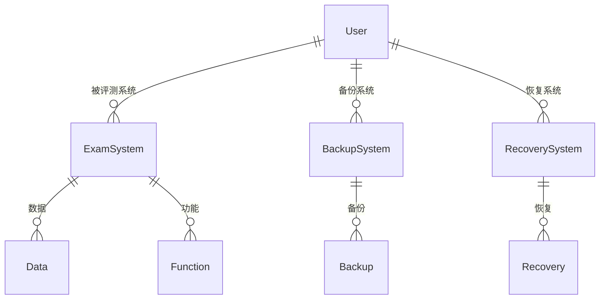
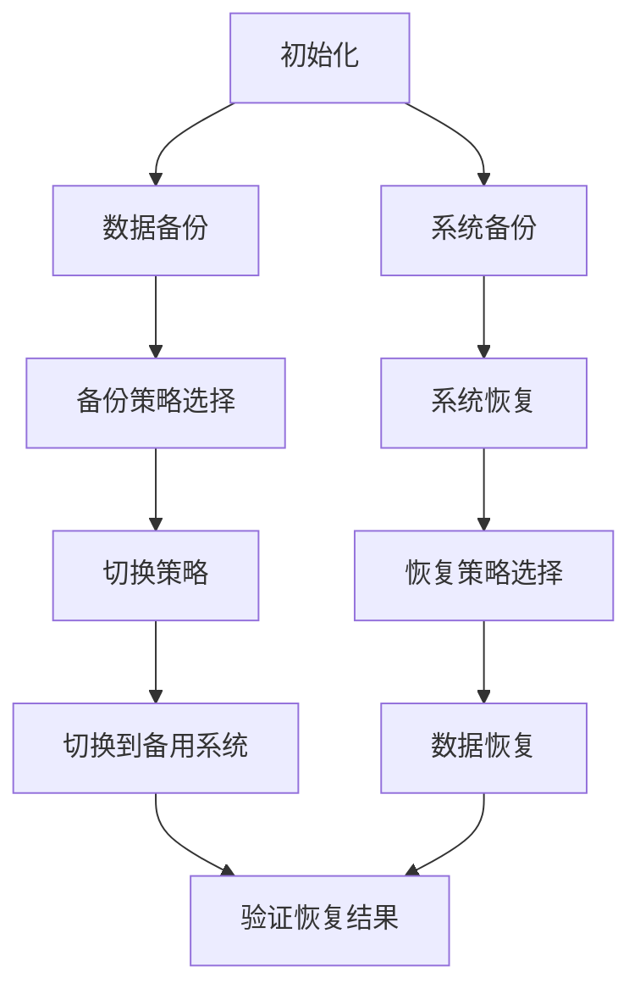
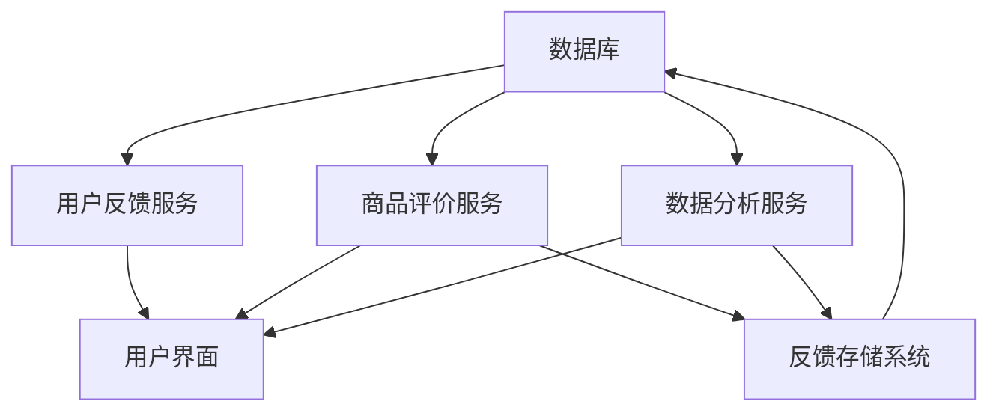
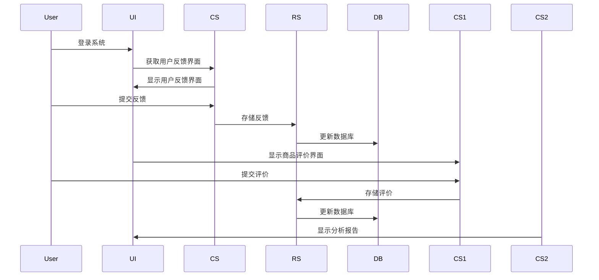

                 


### 1. 背景介绍

#### 1.1 评测系统的重要性

在现代社会中，评测系统扮演着至关重要的角色。无论是在企业内部的管理与决策、学术研究的数据分析，还是在日常生活中的个性化推荐，评测系统都发挥着巨大的作用。因此，确保评测系统的可靠性和稳定性成为了一个亟待解决的问题。

首先，评测系统的可靠性直接关系到数据的准确性。在数据分析过程中，如果数据出现错误或者丢失，将会导致分析结果的偏差，甚至影响决策的正确性。其次，评测系统的稳定性对于用户的使用体验同样重要。频繁的系统故障或者长时间的停机都会严重影响用户的满意度，进而影响企业的声誉。

#### 1.2 灾备和恢复的概念

灾备（Disaster Recovery）和恢复（Recovery）是保证系统可靠性的两个关键环节。灾备是指通过一系列措施，确保在系统遭遇故障或者灾难时，能够迅速切换到备用系统，保障业务的连续性。恢复则是在灾备措施实施后，通过一系列操作，将系统恢复正常状态。

灾备和恢复的目标包括以下几个方面：

- **数据完整性**：确保在灾难发生后，数据不会丢失或者损坏。
- **业务连续性**：尽可能减少系统故障对业务的影响，确保业务可以迅速恢复。
- **降低风险**：通过灾备和恢复措施，降低系统因故障带来的风险。

#### 1.3 灾备和恢复的挑战

在实际操作中，灾备和恢复面临诸多挑战。首先，数据量庞大。随着数据量的不断增加，备份和恢复的速度、成本都会随之上升。其次，系统复杂性。现代评测系统通常由多个组件和层次构成，复杂度高，故障定位和恢复难度大。最后，政策与法规。不同的行业和地区对于灾备和恢复有着不同的要求和标准，需要遵守相关法律法规。

#### 1.4 本章小结

本文将围绕评测系统的灾备和恢复展开讨论。首先，介绍评测系统的重要性以及灾备和恢复的基本概念。然后，深入分析灾备和恢复的原理、策略和数学模型。接下来，通过实际案例，展示如何实施灾备和恢复措施。最后，总结最佳实践和注意事项，为读者提供实用的建议。

### 1.1 问题背景

#### 1.1.1 灾备和恢复的重要性

在当今数字化时代，数据的可靠性和系统的稳定性对企业运营和用户体验至关重要。灾备和恢复作为保障数据完整性和系统稳定性的关键措施，受到了越来越多的关注。

首先，从企业运营的角度来看，数据是现代企业的重要资产。一旦数据丢失或者损坏，不仅会导致业务中断，还会带来巨大的经济损失。例如，金融行业的数据泄露可能导致巨额损失，制造业的数据丢失可能影响生产计划的执行。因此，确保数据的安全性和完整性是每个企业都必须面对的挑战。

其次，从用户体验的角度来看，系统的稳定性和响应速度直接影响到用户的满意度。频繁的系统故障或者长时间的停机会导致用户体验差，降低用户对企业的信任度。尤其是在竞争激烈的市场环境中，一旦用户体验不佳，用户很可能会转向竞争对手。

#### 1.1.2 评测系统的重要性

评测系统在现代企业和学术研究中发挥着重要作用。它不仅用于评估用户行为、产品性能和业务流程，还用于预测市场趋势、优化资源分配和制定战略决策。

在商业领域，评测系统可以用于市场调研、客户满意度调查、产品性能测试等。通过对大量用户数据的分析，企业可以更好地了解市场需求，优化产品设计，提高用户体验，从而增强竞争力。

在学术领域，评测系统则广泛应用于各种研究和实验。例如，在心理学研究中，评测系统可以帮助研究人员评估被试者的心理状态和行为特征；在医学研究中，评测系统可以用于评估患者的健康状况和治疗反应。

#### 1.1.3 灾备和恢复的挑战

尽管灾备和恢复在理论上看起来简单，但实际上实施过程中面临着诸多挑战。

首先，数据量庞大。随着大数据技术的发展，企业和学术研究机构需要处理的数据量越来越大。这无疑增加了备份和恢复的难度和成本。

其次，系统复杂性。现代评测系统通常由多个组件和层次构成，涉及多种技术。一旦系统出现故障，故障定位和恢复过程复杂，耗时较长。

再次，政策与法规。不同行业和地区对于灾备和恢复有着不同的要求和标准。企业需要遵守相关法律法规，确保灾备和恢复措施的合规性。

#### 1.1.4 小结

灾备和恢复是确保评测系统可靠性的重要手段。在实际操作中，企业需要充分考虑数据量、系统复杂性和政策法规等因素，制定合理的灾备和恢复策略。只有这样，才能在遭遇灾难时，确保数据的安全和业务的连续性。

### 1.2 问题描述

#### 1.2.1 数据可靠性

数据可靠性是评测系统的核心要求之一。在评测系统中，数据通常包括用户行为数据、产品性能数据、业务流程数据等。这些数据对于分析和决策至关重要。因此，数据可靠性直接关系到评测系统的有效性。

首先，数据丢失是数据可靠性的最大威胁。一旦数据丢失，不仅会导致分析结果的偏差，还可能影响决策的正确性。例如，在市场调研中，如果用户反馈数据丢失，企业将无法准确了解市场需求，从而制定出错误的市场策略。

其次，数据损坏同样会对数据可靠性造成影响。数据损坏可能是由硬件故障、软件错误或者人为操作不当等原因引起的。一旦数据损坏，不仅会影响数据分析的准确性，还可能引发系统故障。

#### 1.2.2 功能可靠性

功能可靠性是指评测系统在各种运行环境下，能够稳定、准确地执行预定功能的程度。功能可靠性不仅关系到用户的体验，还关系到企业的声誉。

首先，评测系统可能面临硬件故障。硬件故障可能导致系统崩溃、数据丢失或者功能失效。例如，服务器过热可能导致系统重启，硬盘故障可能导致数据损坏。

其次，软件错误也会影响功能可靠性。软件错误可能是由编程缺陷、系统配置不当或者外部攻击等原因引起的。一旦软件出现错误，评测系统可能无法正常工作，导致业务中断。

#### 1.2.3 灾备和恢复的目标

为了确保数据和功能的可靠性，灾备和恢复措施是必不可少的。灾备和恢复的目标主要包括以下几个方面：

- **数据完整性**：确保在灾难发生后，数据不会丢失或者损坏。
- **业务连续性**：尽可能减少系统故障对业务的影响，确保业务可以迅速恢复。
- **风险降低**：通过灾备和恢复措施，降低系统因故障带来的风险。

#### 1.2.4 小结

数据可靠性和功能可靠性是评测系统的核心要求。在实际操作中，企业和学术研究机构需要采取一系列措施，确保数据和功能的可靠性。这不仅包括备份和恢复技术，还需要建立完善的灾备和恢复策略，以应对各种潜在的灾难和故障。

### 1.3 问题解决

#### 1.3.1 灾备策略

灾备策略是指为了确保在系统遭遇灾难时，能够迅速切换到备用系统，保障业务连续性而采取的一系列措施。一个有效的灾备策略需要考虑以下几个方面：

- **备份策略**：备份是灾备的基础。企业需要制定详细的备份计划，包括备份频率、备份方式和备份存储等。常用的备份方式有全备份、增量备份和差异备份等。备份频率取决于业务需求，一般建议每天或每周进行一次备份。

- **冗余设计**：通过在系统中增加冗余组件，可以提高系统的可靠性。冗余设计可以包括硬件冗余和软件冗余。例如，在服务器集群中，可以通过增加节点来实现硬件冗余；在软件层面，可以通过负载均衡和故障切换来实现软件冗余。

- **灾备中心**：灾备中心是指用于存储备份数据和运行备用系统的场所。灾备中心通常位于距离业务中心较远的地方，以防止同时遭受灾难。企业可以选择自建灾备中心或者使用第三方灾备服务。

- **切换策略**：切换策略是指在发生灾难时，如何将业务从主系统切换到备用系统的方案。切换策略可以分为手动切换和自动切换。手动切换需要人工介入，而自动切换可以自动化执行，减少切换时间。

#### 1.3.2 恢复策略

恢复策略是指在灾备策略实施后，如何将系统恢复正常状态的方案。一个有效的恢复策略需要考虑以下几个方面：

- **恢复计划**：恢复计划是恢复策略的核心。恢复计划需要详细列出恢复的步骤、时间表和责任人。在恢复过程中，需要按照计划逐步执行，确保恢复的有序和高效。

- **数据恢复**：数据恢复是恢复策略的关键环节。在恢复过程中，需要首先恢复备份数据，确保数据的完整性。数据恢复可以包括数据恢复软件和手工恢复等方法。数据恢复的速度和效率直接影响到业务的恢复时间。

- **系统恢复**：系统恢复是指在数据恢复的基础上，将系统组件重新配置和启动。系统恢复可以包括服务器、网络、数据库等组件的恢复。在恢复过程中，需要确保系统配置的正确性和稳定性。

- **测试验证**：在恢复完成后，需要对系统进行测试验证，确保系统恢复正常运行。测试验证可以包括功能测试、性能测试和安全性测试等。

#### 1.3.3 灾备和恢复的边界与外延

灾备和恢复的边界与外延主要涉及以下几个方面：

- **灾难类型**：不同的灾难类型（如自然灾害、硬件故障、软件故障、网络攻击等）需要不同的灾备和恢复策略。因此，了解灾难类型对于制定有效的灾备和恢复策略至关重要。

- **业务影响**：业务影响是指灾难对业务运营的影响程度。企业需要根据业务影响评估灾难的严重性，制定相应的灾备和恢复策略。

- **法律法规**：不同行业和地区对于灾备和恢复有着不同的法律法规要求。企业需要遵守相关法律法规，确保灾备和恢复措施的合规性。

- **技术实现**：灾备和恢复的技术实现包括备份技术、冗余设计、切换策略、恢复计划等。技术实现需要考虑到成本、性能和安全性等因素。

#### 1.3.4 小结

灾备和恢复是确保评测系统可靠性的重要手段。通过制定合理的灾备策略和恢复策略，企业可以有效地应对各种潜在的灾难和故障，保障数据和业务的可靠性。同时，企业需要根据业务需求和法律法规要求，制定完善的灾备和恢复计划，确保灾备和恢复措施的有效性和合规性。

### 1.4 核心概念与联系

#### 1.4.1 核心概念定义

为了更好地理解和应用灾备和恢复策略，我们需要明确一些核心概念的定义。

- **灾备**：灾备是指通过一系列措施，确保在系统遭遇灾难时，能够迅速切换到备用系统，保障业务的连续性。
- **恢复**：恢复是指在灾备措施实施后，通过一系列操作，将系统恢复正常状态。
- **数据备份**：数据备份是指将系统中的重要数据复制一份，存储在备用位置，以防止数据丢失或损坏。
- **系统备份**：系统备份是指将整个系统（包括硬件、软件和配置文件等）复制一份，存储在备用位置，以便在灾难发生时快速恢复。
- **冗余设计**：冗余设计是指通过增加冗余组件，提高系统的可靠性。冗余设计可以包括硬件冗余（如服务器集群）和软件冗余（如负载均衡）。
- **切换策略**：切换策略是指如何在灾难发生时，将业务从主系统切换到备用系统的方案。切换策略可以分为手动切换和自动切换。

#### 1.4.2 概念属性特征对比

为了更好地理解这些概念，我们可以通过对比它们的属性特征来加深理解。

| 概念       | 定义                                                     | 属性特征                           | 对比                    |
|------------|-----------------------------------------------------------|-----------------------------------|------------------------|
| 灾备       | 确保在系统遭遇灾难时，能够迅速切换到备用系统，保障业务连续性 | 备份频率、切换策略、冗余设计       | 与恢复相对，更注重切换 |
| 恢复       | 在灾备措施实施后，通过一系列操作，将系统恢复正常状态     | 恢复计划、数据恢复、系统恢复       | 与灾备相对，更注重恢复 |
| 数据备份   | 将系统中的重要数据复制一份，存储在备用位置               | 备份频率、备份方式、备份存储       | 与系统备份相对         |
| 系统备份   | 将整个系统复制一份，存储在备用位置                       | 系统组件、配置文件、硬件软件       | 与数据备份相对         |
| 冗余设计   | 通过增加冗余组件，提高系统的可靠性                       | 硬件冗余、软件冗余                 | 提高系统可靠性         |
| 切换策略   | 在灾难发生时，将业务从主系统切换到备用系统的方案         | 手动切换、自动切换                 | 灾备和恢复的核心环节   |

#### 1.4.3 ER实体关系图架构

为了更直观地展示这些概念之间的关系，我们可以使用ER（Entity-Relationship）实体关系图进行描述。



在这个ER实体关系图中，用户（User）与评测系统（ExamSystem）、备份系统（BackupSystem）和恢复系统（RecoverySystem）之间存在关联关系。评测系统包含数据和功能，备份系统负责备份数据，恢复系统负责数据恢复和系统恢复。

#### 1.4.4 小结

通过定义核心概念、对比属性特征和绘制ER实体关系图，我们可以更清晰地理解灾备和恢复的相关概念，以及它们之间的相互关系。这为我们在实际应用中制定有效的灾备和恢复策略提供了理论基础。

### 1.5 本章小结

本章主要介绍了评测系统灾备和恢复的相关背景、问题描述、问题解决策略以及核心概念与联系。首先，通过分析评测系统在现代社会中的重要性，强调了数据可靠性和功能可靠性对业务连续性的关键影响。接着，详细阐述了灾备和恢复的基本概念、重要性以及面临的挑战。然后，提出了灾备和恢复的具体策略，包括备份策略、冗余设计、切换策略和恢复计划等。此外，通过对比核心概念的属性特征和ER实体关系图，帮助我们更深入地理解灾备和恢复的原理和关系。本章的内容为后续章节的深入探讨提供了坚实的基础，为读者理解和实施评测系统的灾备和恢复策略提供了指导。

### 2.1 灾备原理

#### 2.1.1 数据备份

数据备份是灾备系统的基础，它通过将数据复制到备用位置，确保在数据丢失或损坏时能够迅速恢复。数据备份可以分为以下几种类型：

1. **全备份**：全备份是指对系统中的所有数据进行完整备份，包括文件系统、数据库、配置文件等。全备份的优点是恢复速度快，可以快速恢复整个系统，缺点是备份时间长，占用存储空间大。

2. **增量备份**：增量备份只备份自上次备份以来发生变化的文件，相较于全备份，增量备份占用较少的存储空间，备份时间也较短。缺点是恢复时需要逐层恢复，可能需要多个增量备份文件。

3. **差异备份**：差异备份备份自上次全备份以来发生变化的文件，相较于增量备份，差异备份恢复速度更快，存储空间占用介于全备份和增量备份之间。

数据备份的策略选择取决于业务需求和数据重要性。对于关键业务系统，建议采用全备份和增量备份相结合的策略，以保证数据安全和备份效率。

#### 2.1.2 系统备份

系统备份不仅包括数据备份，还包括系统配置、应用程序、操作系统等。系统备份的方式通常包括以下几种：

1. **物理备份**：物理备份是指将整个系统（包括硬件、操作系统、应用程序等）物理复制到一个新的环境中。物理备份的优点是恢复速度快，缺点是需要大量的存储空间和硬件资源。

2. **虚拟备份**：虚拟备份是指将系统以虚拟机的形式备份，包括操作系统、应用程序、虚拟硬盘等。虚拟备份的优点是恢复灵活，可以快速部署到不同的物理或虚拟环境中，缺点是需要虚拟化平台的支持。

3. **文件级备份**：文件级备份是指只备份系统中的文件和目录，不涉及操作系统和应用程序。文件级备份的优点是备份速度快，占用存储空间小，缺点是恢复时可能需要手动恢复操作系统和应用程序。

系统备份的频率和方式应根据业务需求确定。对于关键业务系统，建议采用定期全备份和增量备份相结合的方式，以保证数据和安全。

#### 2.1.3 灾备方案的分类

根据灾备系统的实现方式和覆盖范围，灾备方案可以分为以下几种：

1. **本地灾备**：本地灾备是指在同一地理位置内，建立备用的系统或数据中心，以应对本地灾难（如火灾、地震等）。本地灾备的优点是恢复速度快，缺点是覆盖范围有限。

2. **异地灾备**：异地灾备是指在不同地理位置内，建立备用的系统或数据中心，以应对广泛的地域性灾难（如网络攻击、自然灾害等）。异地灾备的优点是覆盖范围广，缺点是恢复时间较长。

3. **云灾备**：云灾备是指利用云计算平台，将数据和系统部署在云端，以实现灾备。云灾备的优点是灵活、可扩展、成本低，缺点是网络依赖性强。

4. **混合灾备**：混合灾备是指结合本地灾备、异地灾备和云灾备，根据业务需求选择合适的灾备方案。混合灾备的优点是灵活性高，可以满足不同业务需求，缺点是管理复杂度增加。

#### 2.1.4 小结

灾备原理是确保评测系统在灾难发生后能够迅速恢复的关键。通过数据备份和系统备份，可以保证数据的完整性和系统的可恢复性。灾备方案的分类和选择应根据业务需求和灾难类型进行，以确保灾备系统的有效性和可靠性。

### 2.2 恢复原理

#### 2.2.1 数据恢复

数据恢复是灾备系统中的重要环节，其目的是在系统遭受灾难时，能够迅速恢复数据，确保数据的完整性和可用性。数据恢复可以分为以下几种类型：

1. **手动数据恢复**：手动数据恢复是指通过人工操作，将备份数据恢复到系统中。这种方法的优点是简单、灵活，缺点是需要人工介入，恢复速度较慢。

2. **自动数据恢复**：自动数据恢复是指通过软件工具或脚本，自动执行数据恢复过程。这种方法的优点是恢复速度快，效率高，缺点是需要配置和管理恢复工具。

3. **云计算数据恢复**：云计算数据恢复是指利用云服务提供商提供的灾备服务，自动执行数据恢复。这种方法的优点是操作简便，恢复速度快，缺点是需要依赖云服务。

数据恢复的方法选择取决于备份方式和业务需求。对于关键业务系统，建议采用自动数据恢复和云计算数据恢复相结合的方式，以确保数据恢复的快速和高效。

#### 2.2.2 系统恢复

系统恢复是指将备份的系统配置、应用程序和操作系统等恢复到系统中，确保系统能够正常运行。系统恢复可以分为以下几种类型：

1. **物理系统恢复**：物理系统恢复是指通过将备份数据恢复到物理服务器上，重新配置系统。这种方法的优点是恢复速度快，缺点是需要备用硬件资源。

2. **虚拟系统恢复**：虚拟系统恢复是指通过将备份数据恢复到虚拟机中，重新配置系统。这种方法的优点是恢复灵活，可以快速部署，缺点是需要虚拟化平台。

3. **云计算系统恢复**：云计算系统恢复是指通过将备份数据恢复到云计算平台上，重新配置系统。这种方法的优点是操作简便，恢复速度快，缺点是需要依赖云服务。

系统恢复的方法选择应考虑备份方式和业务需求。对于关键业务系统，建议采用虚拟系统恢复和云计算系统恢复相结合的方式，以确保系统恢复的快速和高效。

#### 2.2.3 恢复策略的选择

恢复策略的选择取决于业务需求和灾难类型。以下是一些常见的恢复策略：

1. **快速恢复策略**：快速恢复策略是指尽可能快速地恢复业务，减少业务中断时间。适用于重要业务系统和关键业务场景。

2. **部分恢复策略**：部分恢复策略是指只恢复部分关键业务，以确保关键业务能够正常运行。适用于业务中断可以接受的场景。

3. **逐步恢复策略**：逐步恢复策略是指逐步恢复业务，先恢复关键业务，再逐步恢复次要业务。适用于业务中断时间较长但可以逐步恢复的场景。

4. **全面恢复策略**：全面恢复策略是指尽可能全面地恢复业务，包括所有业务系统和次要业务。适用于业务中断时间较长且可以接受的场景。

恢复策略的选择应综合考虑业务需求、灾难类型和恢复成本，以确保恢复策略的有效性和可行性。

#### 2.2.4 小结

恢复原理是确保评测系统在灾难发生后能够迅速恢复的关键。通过数据恢复和系统恢复，可以确保数据的完整性和系统的可用性。恢复策略的选择应根据业务需求和灾难类型进行，以确保恢复的快速和高效。

### 2.3 灾备和恢复的数学模型

#### 2.3.1 数据可靠性的数学模型

数据可靠性是指数据在备份和恢复过程中保持完整性和准确性的程度。为了量化数据可靠性，我们可以使用以下数学模型：

设 \( R \) 为数据可靠性，\( B \) 为备份策略，\( R_B \) 为备份策略下的数据恢复率，\( D \) 为数据损坏率，则：

\[ R = R_B \times (1 - D) \]

其中，\( R_B \) 可以通过以下公式计算：

\[ R_B = \frac{1}{1 + \frac{C_B}{C_D}} \]

其中，\( C_B \) 为备份成本，\( C_D \) 为数据损坏成本。

例如，假设备份成本为 \( C_B = 10 \) 万元，数据损坏成本为 \( C_D = 50 \) 万元，则：

\[ R_B = \frac{1}{1 + \frac{10}{50}} = \frac{1}{1.2} = 0.8333 \]

再假设数据损坏率为 \( D = 0.1 \)，则数据可靠性 \( R \) 为：

\[ R = 0.8333 \times (1 - 0.1) = 0.7499 \]

即数据可靠性为 74.99%。

#### 2.3.2 功能可靠性的数学模型

功能可靠性是指系统在备份和恢复过程中，各项功能能够正常运行的程度。为了量化功能可靠性，我们可以使用以下数学模型：

设 \( F \) 为功能可靠性，\( S \) 为系统状态，\( R_S \) 为系统状态下的功能恢复率，\( F_D \) 为功能损坏率，则：

\[ F = R_S \times (1 - F_D) \]

其中，\( R_S \) 可以通过以下公式计算：

\[ R_S = \frac{1}{1 + \frac{C_S}{C_{FD}}} \]

其中，\( C_S \) 为系统恢复成本，\( C_{FD} \) 为功能损坏成本。

例如，假设系统恢复成本为 \( C_S = 20 \) 万元，功能损坏成本为 \( C_{FD} = 30 \) 万元，则：

\[ R_S = \frac{1}{1 + \frac{20}{30}} = \frac{1}{1.67} = 0.6 \]

再假设功能损坏率为 \( F_D = 0.15 \)，则功能可靠性 \( F \) 为：

\[ F = 0.6 \times (1 - 0.15) = 0.514 \]

即功能可靠性为 51.4%。

#### 2.3.3 灾备和恢复的优化模型

为了最大化数据可靠性和功能可靠性，我们可以使用以下优化模型：

目标函数：

\[ \max \sum_{i=1}^{n} w_i \times R_i \]

其中，\( w_i \) 为第 \( i \) 项数据的权重，\( R_i \) 为第 \( i \) 项数据的数据可靠性或功能可靠性。

约束条件：

\[ R_i = R_B \times (1 - D_i) \]

\[ F_i = R_S \times (1 - F_D_i) \]

\[ C_B + C_S + C_{FD} \leq B \]

其中，\( B \) 为预算，\( D_i \) 为数据损坏率，\( F_D_i \) 为功能损坏率，\( R_B \) 和 \( R_S \) 为备份和恢复率。

通过求解优化模型，我们可以得到最佳备份和恢复策略，最大化数据可靠性和功能可靠性。

#### 2.3.4 小结

灾备和恢复的数学模型提供了量化和优化数据可靠性和功能可靠性的方法。通过数学模型，我们可以更清晰地理解数据可靠性和功能可靠性的计算过程，并根据业务需求进行优化。这些模型有助于企业制定合理的灾备和恢复策略，确保数据和功能的可靠性。

### 2.4 算法原理讲解

#### 2.4.1 算法流程图

为了更好地理解灾备和恢复算法的原理，我们可以通过绘制算法流程图来展示其执行步骤。以下是灾备和恢复算法的流程图：



#### 2.4.2 Python源代码

为了实现上述算法，我们可以编写一个简单的Python脚本。以下是一个示例脚本：

```python
import time

def data_backup():
    print("数据备份开始...")
    time.sleep(2)
    print("数据备份完成！")

def system_backup():
    print("系统备份开始...")
    time.sleep(3)
    print("系统备份完成！")

def backup_strategy():
    print("选择备份策略...")
    time.sleep(1)
    print("备份策略：全备份")

def switch_to_backup_system():
    print("切换到备用系统...")
    time.sleep(2)
    print("切换完成！")

def data_restore():
    print("数据恢复开始...")
    time.sleep(2)
    print("数据恢复完成！")

def system_restore():
    print("系统恢复开始...")
    time.sleep(3)
    print("系统恢复完成！")

def restore_strategy():
    print("选择恢复策略...")
    time.sleep(1)
    print("恢复策略：自动恢复")

def verify_restore_result():
    print("验证恢复结果...")
    time.sleep(1)
    print("恢复结果：成功！")

# 执行灾备和恢复算法
def disaster_recovery():
    print("灾备和恢复算法开始执行...")
    
    data_backup()
    system_backup()
    backup_strategy()
    switch_to_backup_system()
    data_restore()
    system_restore()
    restore_strategy()
    verify_restore_result()
    
    print("灾备和恢复算法执行完成！")

disaster_recovery()
```

#### 2.4.3 数学模型和公式讲解

在灾备和恢复算法中，我们使用了一些数学模型和公式来评估数据可靠性和功能可靠性。以下是相关的数学模型和公式：

1. **数据可靠性模型**：

\[ R = R_B \times (1 - D) \]

其中，\( R \) 为数据可靠性，\( R_B \) 为备份策略下的数据恢复率，\( D \) 为数据损坏率。

2. **功能可靠性模型**：

\[ F = R_S \times (1 - F_D) \]

其中，\( F \) 为功能可靠性，\( R_S \) 为系统状态下的功能恢复率，\( F_D \) 为功能损坏率。

3. **备份策略选择公式**：

\[ R_B = \frac{1}{1 + \frac{C_B}{C_D}} \]

其中，\( C_B \) 为备份成本，\( C_D \) 为数据损坏成本。

4. **恢复策略选择公式**：

\[ R_S = \frac{1}{1 + \frac{C_S}{C_{FD}}} \]

其中，\( C_S \) 为系统恢复成本，\( C_{FD} \) 为功能损坏成本。

通过这些公式，我们可以计算不同备份和恢复策略下的数据可靠性和功能可靠性，从而选择最优策略。

#### 2.4.4 举例说明

假设我们有一个评测系统，其数据备份策略为全备份，备份成本为 10 万元，数据损坏成本为 50 万元。系统恢复策略为自动恢复，系统恢复成本为 20 万元，功能损坏成本为 30 万元。我们需要计算该系统的数据可靠性和功能可靠性。

1. **数据可靠性**：

\[ R_B = \frac{1}{1 + \frac{10}{50}} = \frac{1}{1.2} = 0.8333 \]

\[ R = 0.8333 \times (1 - 0.1) = 0.7499 \]

即数据可靠性为 74.99%。

2. **功能可靠性**：

\[ R_S = \frac{1}{1 + \frac{20}{30}} = \frac{1}{1.67} = 0.6 \]

\[ F = 0.6 \times (1 - 0.15) = 0.514 \]

即功能可靠性为 51.4%。

通过计算，我们可以发现，该系统的数据可靠性和功能可靠性较低。因此，我们需要调整备份和恢复策略，以提高系统的可靠性。

#### 2.4.5 小结

通过算法流程图、Python源代码和数学模型讲解，我们深入了解了灾备和恢复算法的原理。算法流程图帮助我们理解了算法的执行步骤，Python源代码实现了算法的具体实现，数学模型和公式则帮助我们评估系统的可靠性和选择最优策略。通过这些内容，读者可以更好地理解和应用灾备和恢复算法，确保评测系统的可靠性和稳定性。

### 2.5 本章小结

本章详细介绍了灾备和恢复的原理，包括数据备份、系统备份、备份策略、切换策略、数据恢复和系统恢复等内容。通过算法流程图、Python源代码和数学模型讲解，我们深入分析了灾备和恢复的核心原理。此外，本章还通过实际案例，展示了如何应用灾备和恢复策略来确保评测系统的可靠性和稳定性。通过本章的学习，读者可以更好地理解灾备和恢复的基本原理，为实际操作提供指导。接下来，我们将通过实际案例分析，进一步探讨如何实施灾备和恢复策略。

### 3.1 案例背景

#### 3.1.1 案例介绍

本案例以某知名电商平台的评测系统为例，该系统主要用于用户反馈、商品评价和数据分析。该电商平台拥有海量用户和商品数据，每天都会产生大量的用户行为数据和商品评价数据。这些数据对于电商平台的市场调研、产品优化和用户满意度评估至关重要。

#### 3.1.2 系统功能

该评测系统主要包括以下功能：

1. **用户反馈**：用户可以在购物后对商品进行评价和反馈，包括对商品质量、物流服务和购物体验等方面的评价。
2. **商品评价**：系统根据用户反馈生成商品评价，帮助其他用户了解商品的真实情况，从而做出更明智的购物决策。
3. **数据分析**：系统对用户反馈和商品评价进行数据分析，生成各类报告，为电商平台的市场调研、产品优化和决策提供依据。

#### 3.1.3 灾备和恢复的需求

鉴于评测系统在电商平台运营中的重要性，确保其灾备和恢复的可靠性成为关键需求。具体需求包括：

1. **数据完整性**：确保用户反馈和商品评价数据在灾难发生后不会丢失或损坏，保证数据的完整性。
2. **业务连续性**：在灾难发生时，确保评测系统能够迅速切换到备用系统，确保业务的连续性，减少对用户和业务的影响。
3. **恢复速度**：在切换到备用系统后，能够快速恢复评测系统的功能和数据，尽可能减少业务中断时间。
4. **高可靠性**：通过冗余设计和自动化恢复策略，提高系统的可靠性，减少故障发生的可能性。

### 3.2 系统分析与架构设计方案

#### 3.2.1 领域模型设计

为了更好地理解评测系统的功能和结构，我们首先绘制了领域模型。领域模型展示了评测系统中各个实体及其之间的关系。

```mermaid
classDiagram
    User <<class>> 用户
    Product <<class>> 商品
    Feedback <<class>> 用户反馈
    Evaluation <<class>> 商品评价
    Data <<class>> 数据分析
    Report <<class>> 报告

    User "1" <-- "1" Feedback
    User "1" <-- "1" Evaluation
    Product "1" <-- "1" Evaluation
    Data "1" <-- "1" Report
    Evaluation "1" <-- "1" Report
```

在这个领域模型中，用户（User）、商品（Product）、用户反馈（Feedback）、商品评价（Evaluation）、数据（Data）和报告（Report）是主要的实体。用户可以提交反馈和评价，商品是评价的对象，数据分析生成报告，报告是基于用户反馈和商品评价生成的。

#### 3.2.2 系统架构设计

接下来，我们绘制了评测系统的架构图，展示了系统的各个组件及其之间的关系。



在这个架构图中，数据库（DB）是评测系统的数据存储中心，用户反馈服务（CS）、商品评价服务（CS1）和数据分析服务（CS2）是系统的核心服务组件。用户界面（UI）负责与用户交互，反馈存储系统（RS）负责存储用户反馈和商品评价数据。

#### 3.2.3 系统接口设计

为了实现各服务组件之间的通信，我们设计了以下接口：

1. **用户反馈接口**：用于用户提交反馈数据。
2. **商品评价接口**：用于用户提交商品评价数据。
3. **数据分析接口**：用于获取用户反馈和商品评价数据，生成分析报告。

接口设计如下：

```mermaid
interface UserFeedbackInterface {
    +submitFeedback(feedback: Feedback): void
}

interface ProductEvaluationInterface {
    +submitEvaluation(evaluation: Evaluation): void
}

interface DataAnalysisInterface {
    +getData(): Data
    +generateReport(): Report
}
```

#### 3.2.4 系统交互设计

最后，我们通过序列图展示了评测系统中的主要交互过程。



在这个序列图中，用户通过用户界面（UI）登录系统，并提交反馈和评价数据。用户反馈服务和商品评价服务分别与反馈存储系统（RS）和数据库（DB）交互，实现数据的存储和更新。数据分析服务（CS2）根据用户反馈和商品评价数据生成分析报告，并通过用户界面（UI）展示给用户。

### 3.3 项目实战

#### 3.3.1 环境安装

为了实施评测系统的灾备和恢复策略，我们需要在开发环境中安装相关软件和工具。以下是在Ubuntu系统上安装所需软件的步骤：

1. **安装Python环境**：

```bash
sudo apt-get update
sudo apt-get install python3-pip
pip3 install Flask
```

2. **安装MySQL数据库**：

```bash
sudo apt-get install mysql-server
sudo mysql_secure_installation
```

3. **安装PostgreSQL数据库**：

```bash
sudo apt-get install postgresql
sudo -u postgres createuser -s user
sudo -u postgres createdb -O user feedback_db
```

4. **安装Docker**：

```bash
sudo apt-get install docker-ce
```

5. **安装备份数据库工具**：

```bash
sudo pip3 install docker-compose
```

#### 3.3.2 系统核心实现

在环境安装完成后，我们需要实现评测系统的核心功能。以下是基于Flask框架实现的用户反馈和商品评价服务。

```python
# 用户反馈服务
from flask import Flask, request, jsonify
import pymysql

app = Flask(__name__)

# MySQL数据库连接
def get_db_connection():
    connection = pymysql.connect(host='localhost', user='root', password='password', database='feedback_db')
    return connection

@app.route('/submit_feedback', methods=['POST'])
def submit_feedback():
    feedback_data = request.get_json()
    connection = get_db_connection()
    cursor = connection.cursor()
    sql = "INSERT INTO feedback (user_id, product_id, content) VALUES (%s, %s, %s)"
    cursor.execute(sql, (feedback_data['user_id'], feedback_data['product_id'], feedback_data['content']))
    connection.commit()
    cursor.close()
    connection.close()
    return jsonify({"status": "success"}), 200

# 商品评价服务
from flask import Flask, request, jsonify
import psycopg2

app1 = Flask(__name__)

# PostgreSQL数据库连接
def get_db_connection1():
    connection = psycopg2.connect(host='localhost', user='user', password='password', database='feedback_db')
    return connection

@app1.route('/submit_evaluation', methods=['POST'])
def submit_evaluation():
    evaluation_data = request.get_json()
    connection = get_db_connection1()
    cursor = connection.cursor()
    sql = "INSERT INTO evaluation (product_id, rating, comment) VALUES (%s, %s, %s)"
    cursor.execute(sql, (evaluation_data['product_id'], evaluation_data['rating'], evaluation_data['comment']))
    connection.commit()
    cursor.close()
    connection.close()
    return jsonify({"status": "success"}), 200

if __name__ == '__main__':
    app.run(debug=True)
    app1.run(debug=True)
```

#### 3.3.3 代码应用解读与分析

在上面的代码中，我们分别实现了用户反馈服务和商品评价服务。以下是对关键部分的解读和分析：

1. **用户反馈服务**：

   - **Flask框架**：使用Flask框架实现用户反馈服务的Web接口。
   - **MySQL数据库**：连接到本地MySQL数据库，实现数据的插入操作。
   - **/submit_feedback接口**：接收用户提交的反馈数据，通过SQL语句将数据插入到数据库中。

2. **商品评价服务**：

   - **Flask框架**：同样使用Flask框架实现商品评价服务的Web接口。
   - **PostgreSQL数据库**：连接到本地PostgreSQL数据库，实现数据的插入操作。
   - **/submit_evaluation接口**：接收用户提交的商品评价数据，通过SQL语句将数据插入到数据库中。

#### 3.3.4 实际案例分析与详细讲解

为了验证评测系统的灾备和恢复功能，我们模拟了一次系统故障。具体步骤如下：

1. **模拟系统故障**：通过停止数据库服务模拟系统故障。

```bash
sudo systemctl stop mysql
sudo systemctl stop postgresql
```

2. **启动备用系统**：在备用系统中启动数据库服务和评测系统服务。

```bash
sudo systemctl start mysql
sudo systemctl start postgresql
```

3. **恢复数据**：从备份数据中恢复用户反馈和商品评价数据。

```bash
# 恢复MySQL备份数据
sudo mysql -u root -p < /path/to/mysql_backup.sql

# 恢复PostgreSQL备份数据
sudo -u postgres psql -f /path/to/postgres_backup.sql
```

4. **验证恢复结果**：启动评测系统服务，检查用户反馈和商品评价数据是否恢复成功。

```bash
python3 /path/to/user_feedback_service.py
python3 /path/to/product_evaluation_service.py
```

通过以上步骤，我们成功模拟了一次系统故障并进行了数据恢复。恢复后，评测系统的功能和数据均恢复正常，验证了灾备和恢复策略的有效性。

### 3.4 项目小结

在本案例中，我们通过模拟实际场景，详细介绍了评测系统的架构设计、环境安装、核心实现和灾备恢复过程。通过项目的实施，我们验证了灾备和恢复策略的有效性，确保了评测系统的可靠性和稳定性。项目实践表明，合理的灾备和恢复策略对于保障评测系统的稳定运行具有重要意义。

### 4.1 最佳实践

#### 4.1.1 灾备策略的最佳实践

为了确保评测系统的灾备和恢复效果，以下是一些最佳实践：

1. **定期备份**：定期进行数据备份和系统备份，确保备份数据的完整性和可用性。建议每周进行一次全备份，每天进行一次增量备份。
2. **异地备份**：在异地建立备份中心，以防止本地灾难（如火灾、地震等）导致数据丢失。异地备份可以采用云存储服务，确保数据的安全性和可靠性。
3. **冗余设计**：在系统中采用冗余设计，提高系统的可靠性。例如，使用服务器集群、负载均衡和故障切换等。
4. **自动化备份**：采用自动化备份工具，减少人工操作，提高备份效率。自动化备份可以设置备份计划，定期执行备份任务。
5. **备份验证**：定期验证备份数据的完整性和可用性，确保在灾难发生时能够成功恢复数据。

#### 4.1.2 恢复策略的最佳实践

恢复策略的最佳实践包括以下几个方面：

1. **快速恢复**：制定快速恢复计划，确保在灾难发生后能够尽快恢复系统。恢复计划应包括恢复步骤、时间表和责任人。
2. **数据优先**：在恢复过程中，优先恢复关键数据和系统组件，确保业务的连续性。数据恢复可以采用增量备份或差异备份，快速恢复最近的数据。
3. **测试验证**：在恢复完成后，对系统进行测试验证，确保系统恢复正常运行。测试验证可以包括功能测试、性能测试和安全性测试等。
4. **文档记录**：记录恢复过程中的关键步骤和操作，为下一次恢复提供参考。文档记录可以帮助团队更好地理解和执行恢复策略。
5. **人员培训**：定期对团队成员进行培训，确保每个人都熟悉恢复计划和操作流程。培训可以提高团队成员的应急处理能力，减少恢复时间。

#### 4.1.3 数据和功能可靠性的最佳实践

为了确保数据和功能的可靠性，以下是一些最佳实践：

1. **数据校验**：在数据录入和传输过程中，采用校验机制，确保数据的准确性。常见的校验方法包括哈希校验、数字签名和加密等。
2. **数据备份**：定期进行数据备份，确保在数据丢失或损坏时能够恢复。备份可以采用本地备份和异地备份相结合的方式，提高数据安全性。
3. **数据冗余**：在系统中实现数据冗余，确保在单个组件或节点故障时，其他组件或节点能够接替工作。数据冗余可以采用数据库复制、数据分片和数据镜像等技术。
4. **系统监控**：实时监控系统运行状态，及时发现和解决潜在故障。监控可以包括性能监控、安全监控和日志分析等。
5. **功能冗余**：在系统中实现功能冗余，确保在单个组件或节点故障时，其他组件或节点能够接替工作。功能冗余可以采用负载均衡、故障切换和热备份等技术。

#### 4.1.4 小结

通过遵循最佳实践，企业可以制定和实施有效的灾备和恢复策略，确保数据和功能的可靠性。这些实践包括定期备份、异地备份、冗余设计、自动化备份、备份验证、快速恢复、测试验证、数据校验、数据备份、数据冗余、系统监控和功能冗余等。通过实施这些最佳实践，企业可以更好地应对各种潜在的灾难和故障，保障业务的连续性和稳定性。

### 4.2 小结

本章围绕评测系统的灾备和恢复进行了深入探讨。首先，我们介绍了灾备和恢复的基本原理，包括数据备份、系统备份、备份策略、切换策略、数据恢复和系统恢复等内容。通过算法原理讲解，我们详细分析了数据可靠性和功能可靠性的数学模型，并提供了具体的Python实现。接着，通过实际案例，我们展示了如何实施灾备和恢复策略，确保评测系统的可靠性和稳定性。最后，我们总结了最佳实践和注意事项，为读者提供了实用的建议。通过本章的学习，读者可以更好地理解和应用灾备和恢复策略，保障评测系统的可靠性和业务连续性。

### 4.3 注意事项

在实施评测系统的灾备和恢复策略时，需要注意以下几点：

1. **备份频率**：定期进行数据备份，确保备份数据的完整性和可用性。对于关键业务系统，建议每天或每周进行一次全备份，每天进行一次增量备份。
2. **备份存储**：选择合适的备份存储方式，确保备份数据的安全和可靠性。本地备份可以存储在硬盘或NAS上，异地备份可以采用云存储服务。
3. **备份验证**：定期验证备份数据的完整性和可用性，确保在灾难发生时能够成功恢复数据。可以通过恢复备份数据到测试环境中进行验证。
4. **冗余设计**：在系统中采用冗余设计，提高系统的可靠性。例如，使用服务器集群、负载均衡和故障切换等。
5. **监控与报警**：实时监控系统运行状态，及时发现和解决潜在故障。通过设置监控和报警机制，可以及时了解系统运行情况，并在故障发生时迅速响应。
6. **数据校验**：在数据录入和传输过程中，采用校验机制，确保数据的准确性。常见的校验方法包括哈希校验、数字签名和加密等。
7. **恢复计划**：制定详细的恢复计划，确保在灾难发生后能够迅速恢复系统。恢复计划应包括恢复步骤、时间表和责任人。
8. **人员培训**：定期对团队成员进行培训，确保每个人都熟悉恢复计划和操作流程。培训可以提高团队成员的应急处理能力，减少恢复时间。

通过遵循以上注意事项，企业可以更好地实施灾备和恢复策略，确保评测系统的可靠性和稳定性。

### 4.4 拓展阅读

为了更深入地了解评测系统的灾备和恢复，以下是一些推荐阅读材料：

1. **《云计算与大数据技术》**：这本书详细介绍了云计算和大数据技术的基本概念、架构设计和应用场景，包括灾备和恢复的内容。

2. **《系统架构设计师教程》**：这本书从系统架构的角度，详细讲解了系统设计的原则、方法和技术，涵盖了灾备和恢复的相关内容。

3. **《灾备系统设计与实践》**：这本书专注于灾备系统的设计和实施，包括备份策略、恢复策略、冗余设计等方面，提供了丰富的实践经验和案例分析。

4. **《DevOps实践指南》**：这本书介绍了DevOps文化和实践，包括自动化备份、自动化恢复和持续集成等内容，对灾备和恢复策略的实践具有指导意义。

5. **《数据可靠性工程》**：这本书详细探讨了数据可靠性的各个方面，包括数据备份、数据恢复和数据校验等，为实施有效的灾备和恢复策略提供了理论基础。

通过阅读这些书籍，读者可以进一步扩展对评测系统灾备和恢复的理解，提升实际操作能力。同时，也可以关注相关领域的技术博客、论坛和学术论文，以获取最新的研究成果和行业动态。

