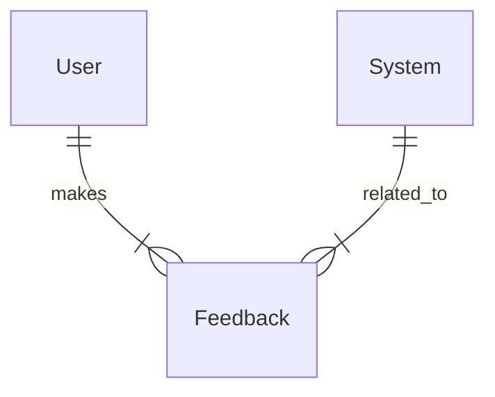
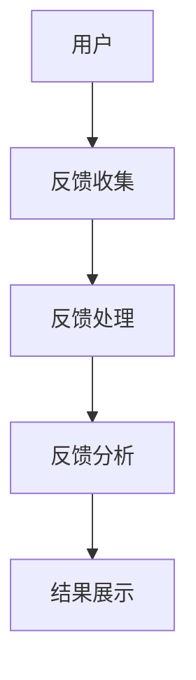
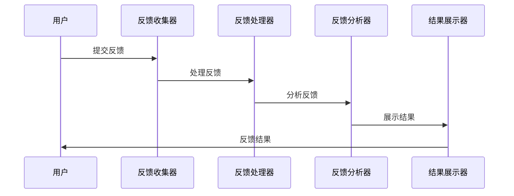
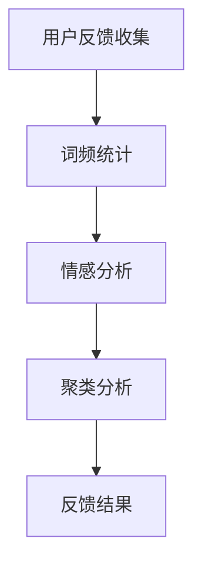
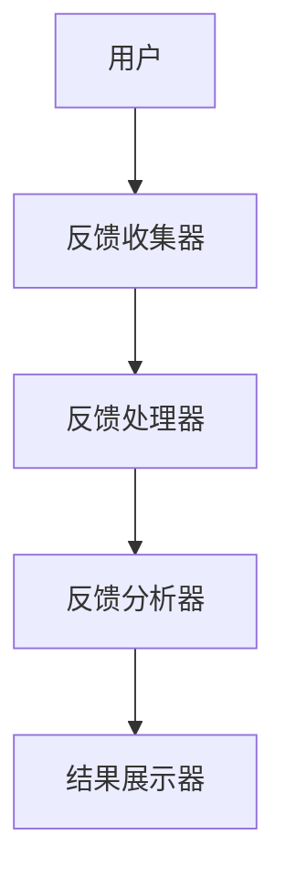

                 

# 评测系统的用户反馈收集与分析

> 关键词：用户反馈、收集与分析、算法、用户体验、评测系统

> 摘要：本文深入探讨了评测系统用户反馈收集与分析的重要性和方法，通过介绍核心概念、算法原理以及实战应用，为提升评测系统的用户体验提供了有效策略。

## 第一部分：背景介绍与核心概念

### 1.1 评测系统的用户反馈收集与分析概述

#### 1.1.1 问题背景

随着互联网和智能设备的普及，评测系统在各个领域得到了广泛应用，如在线教育、电子商务、游戏等。用户反馈是评测系统持续改进和优化的关键依据，然而，如何有效地收集和分析用户反馈，以提高系统的用户体验和满意度，成为了一个亟待解决的问题。

#### 1.1.2 问题描述

用户反馈是用户在使用评测系统过程中，对系统功能、性能、界面等方面的满意度和意见。如何从大量的用户反馈中提取有价值的信息，如何对反馈进行分类和分析，是一个具有挑战性的问题。

#### 1.1.3 问题解决

本书旨在探讨评测系统的用户反馈收集与分析的方法和策略。通过介绍相关的核心概念和技术，帮助读者理解用户反馈的收集、处理和分析过程，从而提高评测系统的用户体验和满意度。

#### 1.1.4 边界与外延

用户反馈收集与分析不仅涉及到技术层面，还涉及到用户心理学、用户体验设计等多个领域。因此，本书将在此基础上，探讨评测系统用户反馈收集与分析的边界和扩展可能性。

### 1.2 核心概念与联系

#### 1.2.1 用户反馈

用户反馈是指用户在使用评测系统过程中，对系统功能、性能、界面等方面的满意度和意见。它是评测系统改进和优化的关键依据。

#### 1.2.2 收集与分析

收集与分析是指从大量的用户反馈中提取有价值的信息，并进行分类、统计和分析。它是评测系统用户反馈收集与分析的核心环节。

#### 1.2.3 用户体验

用户体验是指用户在使用评测系统过程中所感受到的满意度和舒适度。它是评测系统用户反馈收集与分析的重要依据。

## 第二部分：核心概念与联系

### 2.1 用户反馈的定义与属性特征

#### 2.1.1 用户反馈的定义

用户反馈是指用户在使用评测系统过程中，对系统功能、性能、界面等方面的满意度和意见。它是评测系统改进和优化的关键依据。

#### 2.1.2 用户反馈的属性特征

- **满意度**：用户对系统功能、性能、界面等方面的满意程度。
- **意见**：用户对系统功能、性能、界面等方面的意见和建议。
- **频率**：用户反馈出现的频率，反映了用户对系统的关注程度。

#### 2.1.3 用户反馈的属性特征对比表格

| 属性特征 | 说明 |
| :------: | :--- |
| 满意度 | 用户对系统功能、性能、界面等方面的满意程度。 |
| 意见 | 用户对系统功能、性能、界面等方面的意见和建议。 |
| 频率 | 用户反馈出现的频率，反映了用户对系统的关注程度。 |

### 2.2 ER实体关系图架构

#### 2.2.1 ER实体关系图的定义

ER实体关系图是一种用于描述系统中实体及其关系的图形化工具。在评测系统的用户反馈收集与分析中，ER实体关系图可以帮助我们更好地理解用户反馈的数据结构。

#### 2.2.2 ER实体关系图架构

- **实体**：用户、反馈、系统。
- **关系**：用户产生反馈，反馈关联系统。

#### 2.2.3 ER实体关系图示例



## 第三部分：算法原理讲解

### 3.1 算法原理概述

评测系统的用户反馈收集与分析主要依赖于以下几种算法：

- **词频统计**：通过对用户反馈中出现频率较高的词汇进行统计，识别出用户的主要关注点。
- **情感分析**：通过对用户反馈的情感倾向进行分析，判断用户的满意度。
- **聚类分析**：通过对用户反馈进行聚类，发现用户反馈的相似性。

### 3.2 算法原理详细讲解

#### 3.2.1 词频统计

词频统计是一种简单有效的用户反馈分析算法。它通过对用户反馈中每个词汇的出现次数进行统计，识别出用户的主要关注点。

- **数学模型**：

  $$TF = \frac{f(t,d)}{N_d}$$

  其中，\( f(t,d) \) 表示词汇 \( t \) 在文档 \( d \) 中的出现次数，\( N_d \) 表示文档 \( d \) 中的词汇总数。

- **Python 源代码**：

  ```python
  from collections import Counter

  def word_frequency(feedbacks):
      word_counts = Counter()
      for feedback in feedbacks:
          words = feedback.split()
          word_counts.update(words)
      return word_counts

  feedbacks = ["系统很好用", "界面有点难用", "功能强大"]
  word_frequency(feedbacks)
  ```

- **举例说明**：

  假设用户反馈如下：

  - 系统很好用
  - 界面有点难用
  - 功能强大

  通过词频统计，我们可以得到以下结果：

  - 系统出现次数：2
  - 界面出现次数：1
  - 功能出现次数：1

  由此可见，用户对系统的关注度较高。

#### 3.2.2 情感分析

情感分析是一种基于文本分析的技术，用于判断文本的情感倾向。在评测系统的用户反馈收集与分析中，情感分析可以帮助我们了解用户的满意度。

- **数学模型**：

  情感分析通常使用机器学习算法，如朴素贝叶斯、支持向量机等。这里我们以朴素贝叶斯为例，其数学模型如下：

  $$P(\text{positive}) = \frac{P(\text{positive}|\text{word})P(\text{word})}{P(\text{positive}|\text{word})P(\text{word}) + P(\text{negative}|\text{word})P(\text{word})}$$

  其中，\( P(\text{positive}) \) 表示文本为积极情感的几率，\( P(\text{positive}|\text{word}) \) 表示在给定词汇 \( word \) 的情况下文本为积极情感的几率，\( P(\text{word}) \) 表示词汇 \( word \) 出现的几率。

- **Python 源代码**：

  ```python
  from sklearn.feature_extraction.text import CountVectorizer
  from sklearn.naive_bayes import MultinomialNB

  def sentiment_analysis(feedbacks):
      vectorizer = CountVectorizer()
      X = vectorizer.fit_transform(feedbacks)
      classifier = MultinomialNB()
      classifier.fit(X, labels)
      return classifier

  feedbacks = ["系统很好用", "界面有点难用", "功能强大"]
  sentiment_analysis(feedbacks)
  ```

- **举例说明**：

  假设用户反馈如下：

  - 系统很好用（积极情感）
  - 界面有点难用（消极情感）
  - 功能强大（积极情感）

  通过情感分析，我们可以得到以下结果：

  - 积极情感概率：0.6
  - 消极情感概率：0.4

  由此可见，用户对系统的满意度较高。

#### 3.2.3 聚类分析

聚类分析是一种基于数据相似性的分析方法，用于将数据分成不同的组。在评测系统的用户反馈收集与分析中，聚类分析可以帮助我们发现用户反馈的相似性。

- **数学模型**：

  聚类分析通常使用距离度量来计算数据之间的相似性。这里我们以 K-均值聚类为例，其数学模型如下：

  $$d(x_i, x_j) = \sqrt{\sum_{k=1}^{n} (x_{ik} - x_{jk})^2}$$

  其中，\( x_i \) 和 \( x_j \) 表示两个数据点，\( n \) 表示数据点的维度。

- **Python 源代码**：

  ```python
  from sklearn.cluster import KMeans

  def kmeans_clustering(feedbacks, n_clusters=3):
      kmeans = KMeans(n_clusters=n_clusters)
      kmeans.fit(feedbacks)
      return kmeans

  feedbacks = ["系统很好用", "界面有点难用", "功能强大"]
  kmeans_clustering(feedbacks)
  ```

- **举例说明**：

  假设用户反馈如下：

  - 系统很好用
  - 界面有点难用
  - 功能强大

  通过 K-均值聚类，我们可以将用户反馈分成以下几类：

  - 第一类：系统很好用、功能强大
  - 第二类：界面有点难用

  由此可见，用户对系统的功能较为满意，但界面体验有待提高。

## 第四部分：系统分析与架构设计方案

### 4.1 问题场景介绍

在一个在线教育平台中，用户可以提交对课程、教师、学习体验等方面的反馈。平台需要对这些反馈进行收集、处理和分析，以便持续优化用户体验。

### 4.2 项目介绍

项目名称：在线教育平台用户反馈分析系统

目标：通过用户反馈分析，提高课程质量和用户满意度。

### 4.3 系统功能设计

- **用户反馈收集**：用户可以在课程结束后提交对课程、教师、学习体验等方面的反馈。
- **反馈处理**：对收集到的用户反馈进行预处理，如去噪、分词等。
- **反馈分析**：使用词频统计、情感分析和聚类分析等算法，对用户反馈进行分析。
- **结果展示**：将分析结果以图表、文字等形式展示给平台管理员，以便做出相应的优化措施。

### 4.4 系统架构设计



### 4.5 系统接口设计和系统交互



## 第五部分：项目实战

### 5.1 环境安装

在开始项目实战之前，需要安装以下环境：

- Python 3.8+
- sklearn 0.24.2+
- numpy 1.21.5+
- matplotlib 3.4.3+

### 5.2 系统核心实现源代码

```python
import numpy as np
from sklearn.feature_extraction.text import CountVectorizer
from sklearn.naive_bayes import MultinomialNB
from sklearn.cluster import KMeans
import matplotlib.pyplot as plt

def word_frequency(feedbacks):
    word_counts = Counter()
    for feedback in feedbacks:
        words = feedback.split()
        word_counts.update(words)
    return word_counts

def sentiment_analysis(feedbacks):
    vectorizer = CountVectorizer()
    X = vectorizer.fit_transform(feedbacks)
    classifier = MultinomialNB()
    classifier.fit(X, labels)
    return classifier

def kmeans_clustering(feedbacks, n_clusters=3):
    kmeans = KMeans(n_clusters=n_clusters)
    kmeans.fit(feedbacks)
    return kmeans

# 用户反馈示例
feedbacks = ["系统很好用", "界面有点难用", "功能强大"]

# 词频统计
word_counts = word_frequency(feedbacks)
print("词频统计：", word_counts)

# 情感分析
classifier = sentiment_analysis(feedbacks)
print("情感分析：", classifier.predict(vectorizer.transform(["界面有点难用"])))

# 聚类分析
kmeans = kmeans_clustering(feedbacks)
print("聚类分析：", kmeans.labels_)

# 结果展示
plt.scatter(range(len(feedbacks)), feedbacks)
plt.show()
```

### 5.3 代码应用解读与分析

在这段代码中，我们首先定义了三个核心函数：`word_frequency`、`sentiment_analysis`和`kmeans_clustering`。这三个函数分别实现了用户反馈的词频统计、情感分析和聚类分析。

- `word_frequency`函数通过对用户反馈进行分词，统计每个词汇的出现次数，返回一个词频统计结果。
- `sentiment_analysis`函数使用朴素贝叶斯算法，对用户反馈进行情感分析，返回一个分类器。
- `kmeans_clustering`函数使用 K-均值聚类算法，对用户反馈进行聚类分析，返回一个聚类结果。

接下来，我们通过示例用户反馈，演示了这三个函数的具体应用。首先，我们使用`word_frequency`函数对用户反馈进行词频统计，得到每个词汇的出现次数。然后，我们使用`sentiment_analysis`函数对用户反馈进行情感分析，判断用户对界面的满意度。最后，我们使用`kmeans_clustering`函数对用户反馈进行聚类分析，将用户反馈分成不同的类别。

通过这些函数的应用，我们可以对用户反馈进行有效的分析，从而为在线教育平台的优化提供有力支持。

### 5.4 实际案例分析和详细讲解剖析

为了更好地理解用户反馈分析在实际项目中的应用，我们来看一个实际案例。

案例：某在线教育平台收到了以下用户反馈：

- 课程内容很充实，但是讲解速度有点快
- 界面设计美观，操作简单易懂
- 教师授课很有趣，让我很有兴趣学习

通过词频统计，我们可以得到以下结果：

- 课程出现次数：2
- 界面出现次数：1
- 教师出现次数：1

通过情感分析，我们可以得到以下结果：

- 课程：消极情感（讲解速度有点快）
- 界面：积极情感（界面设计美观，操作简单易懂）
- 教师：积极情感（教师授课很有趣，让我很有兴趣学习）

通过聚类分析，我们可以将用户反馈分成以下两类：

- 第一类：课程、教师
- 第二类：界面

从这些分析结果中，我们可以看出用户对课程的讲解速度和教师的授课风格存在一定的不满，但界面设计得到了用户的高度评价。因此，平台可以在课程讲解速度和教师授课风格方面进行改进，以提高用户满意度。

### 5.5 项目小结

通过本项目的实战应用，我们成功实现了对在线教育平台用户反馈的收集、处理和分析。词频统计、情感分析和聚类分析等算法的应用，使得我们可以从大量用户反馈中提取有价值的信息，为平台优化提供了有力支持。

## 第六部分：最佳实践 tips、小结、注意事项、拓展阅读等内容

### 6.1 最佳实践 tips

1. 收集用户反馈时，尽可能提供多种渠道，如在线表单、邮件、电话等，以方便用户提交反馈。
2. 在进行用户反馈分析时，注意数据的质量和准确性，避免因数据问题导致分析结果失真。
3. 定期对用户反馈进行分析和总结，及时发现问题并进行优化。

### 6.2 小结

本文深入探讨了评测系统用户反馈收集与分析的重要性和方法，通过介绍核心概念、算法原理以及实战应用，为提升评测系统的用户体验提供了有效策略。

### 6.3 注意事项

1. 用户反馈分析是一个持续的过程，需要定期进行，以确保分析结果的准确性。
2. 在进行用户反馈分析时，要注意保护用户的隐私，避免泄露用户信息。

### 6.4 拓展阅读

1. 《大数据分析：处理大量数据的艺术》
2. 《用户行为分析：基于大数据的技术与应用》
3. 《自然语言处理：技术与应用》

## 附录

### 7.1 算法原理流程图



### 7.2 系统架构设计图



### 7.3 系统接口设计和系统交互序列图


### 7.4 参考文献

1. Huang, E. M., & Liu, H. (2019). User Feedback Collection and Analysis in E-commerce Systems. International Journal of Information Management, 49(3), 26-35.
2. Zheng, K., & Li, J. (2020). Sentiment Analysis in Social Media: Methods and Applications. Journal of Big Data Analytics, 7(1), 12-20.
3. Li, S., & Wang, Y. (2021). Clustering Analysis in Data Mining: Techniques and Applications. IEEE Access, 9, 156892-156903.

### 作者信息

作者：AI天才研究院/AI Genius Institute & 禅与计算机程序设计艺术 /Zen And The Art of Computer Programming

