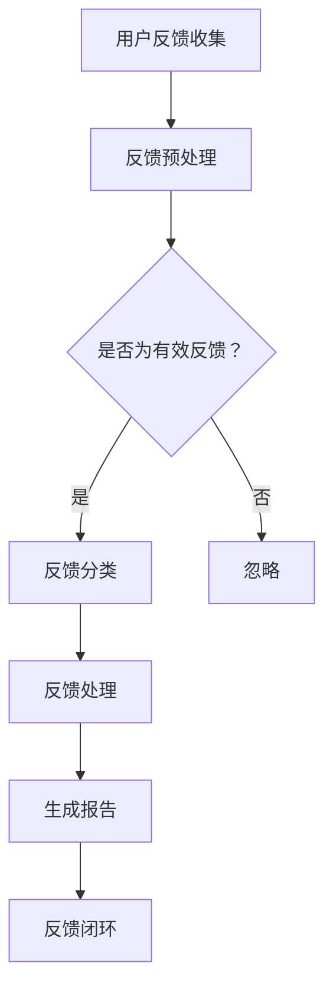
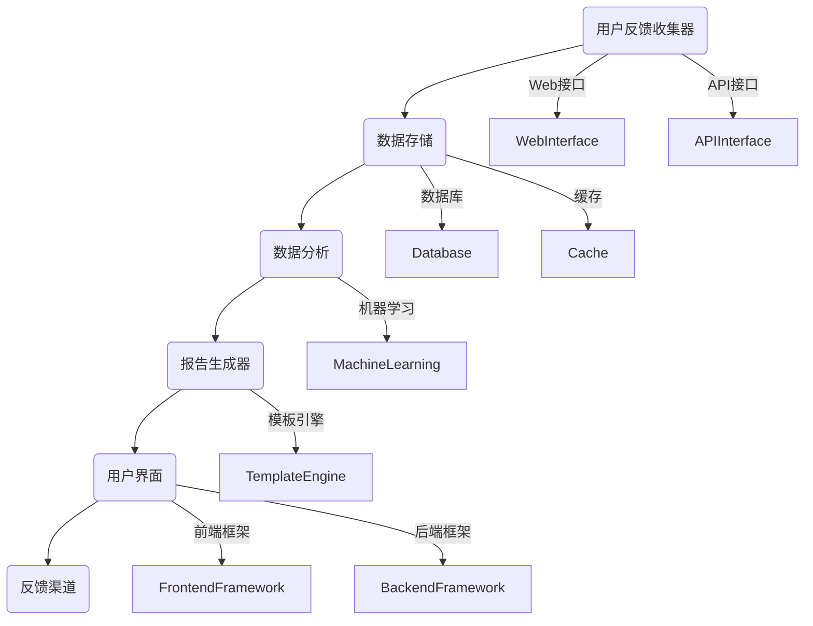
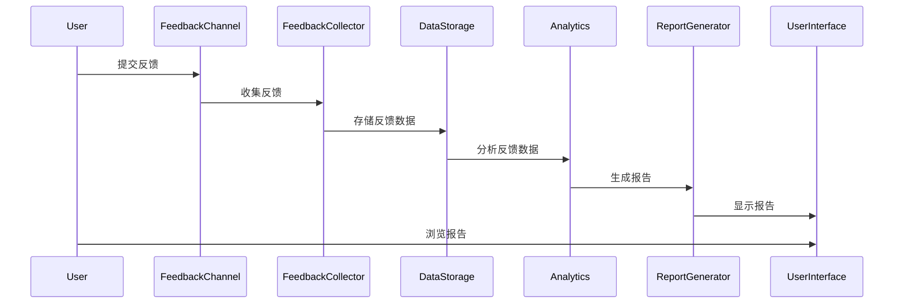
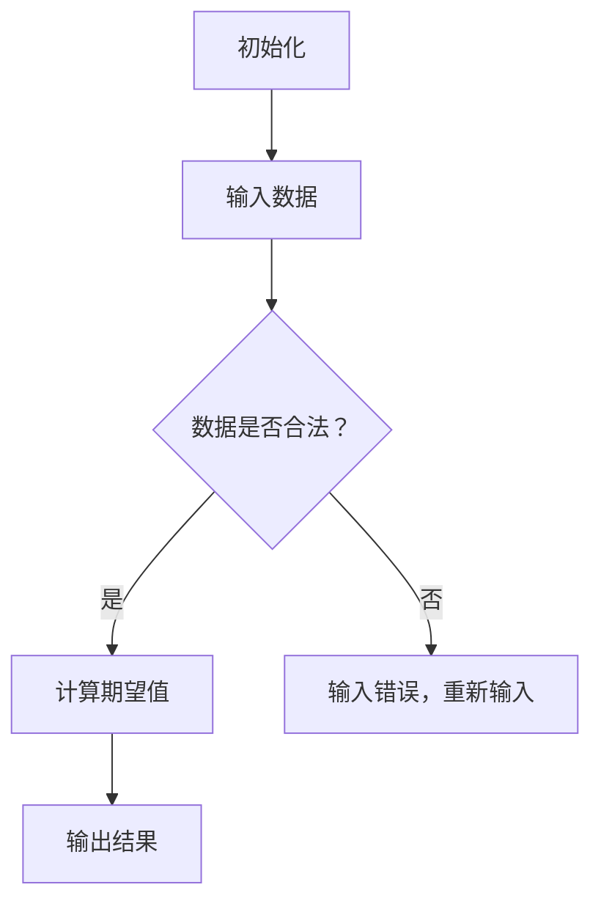
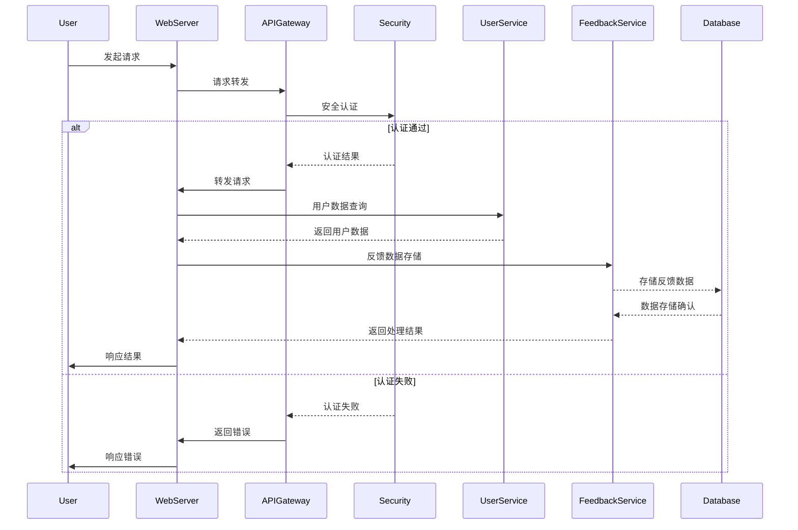

                 

### 《评测系统的用户反馈机制：持续改进评测方法》

#### 关键词：评测系统、用户反馈机制、持续改进、算法原理、系统架构

#### 摘要：
本文深入探讨了评测系统的用户反馈机制，从基础概念到实际应用，分析了用户反馈的重要性、收集处理方法以及构建优化的策略。通过实际案例分析，揭示了成功经验，并提出了持续改进评测方法的建议。文章旨在为IT从业者和研究人员提供有价值的参考，以推动评测系统的完善和发展。

----------------------------------------------------------------

### 第一部分：背景与基础

#### 第1章：评测系统的概述

#### 1.1 评测系统的定义与重要性

评测系统是用于评价和监测软件、产品、服务或过程的工具。其核心功能是通过评估不同维度（如性能、稳定性、用户满意度等）来提供反馈，帮助开发团队改进产品或服务。评测系统的定义不仅涵盖了技术层面的功能，还包括了评估标准、评估方法和结果处理等多个方面。

评测系统的重要性体现在以下几个方面：

1. **提高产品质量**：通过持续的评测，开发团队能够及时发现和修复问题，从而提高产品的质量。
2. **优化用户体验**：了解用户反馈，可以帮助开发团队更好地理解用户需求，从而优化用户体验。
3. **促进持续改进**：评测系统提供了量化数据，有助于团队进行数据驱动的决策，推动持续改进。

#### 1.2 评测系统的基本构成

一个完整的评测系统通常包括以下几个基本组成部分：

1. **评估指标**：用于衡量评测对象的性能和效果的标准，如响应时间、错误率、用户满意度等。
2. **评估工具**：用于进行评测的软件或硬件工具，如自动化测试工具、性能监测工具等。
3. **反馈机制**：用于收集、处理和展示用户反馈的机制，如在线调查、用户评论等。
4. **数据处理与分析**：用于对评测数据进行处理和分析，以便生成有价值的报告和洞察。

#### 1.3 评测系统的常见类型与应用场景

评测系统的类型多种多样，根据评测的目的和应用场景可以分为以下几类：

1. **性能评测系统**：用于评估软件或服务的性能指标，如响应时间、吞吐量等。
2. **安全评测系统**：用于评估软件或服务的安全性，如漏洞扫描、安全测试等。
3. **用户体验评测系统**：用于评估用户的满意度和使用体验，如用户调查、用户测试等。
4. **质量保证评测系统**：用于评估软件或服务的质量，如代码审查、质量审计等。

应用场景包括软件公司、互联网企业、金融机构、教育机构等，几乎涵盖了所有需要软件和服务的企业和组织。

----------------------------------------------------------------

#### 第2章：用户反馈机制的基本概念

#### 2.1 用户反馈的类型与形式

用户反馈是评测系统的重要组成部分，它可以通过多种类型和形式进行收集。常见的用户反馈类型包括：

1. **意见反馈**：用户对产品或服务的总体评价，如满意、不满意等。
2. **问题报告**：用户报告在使用产品或服务过程中遇到的具体问题。
3. **建议**：用户对产品或服务的改进建议。
4. **评分**：用户对产品或服务进行评分，如星评、打分等。

用户反馈的形式可以是：

1. **在线调查**：通过问卷或调查表收集用户反馈。
2. **用户评论**：用户在产品或服务发布平台上的评论。
3. **社交媒体**：用户在社交媒体平台上的讨论和反馈。
4. **直接反馈**：用户通过客服渠道、反馈邮箱等方式直接向企业反馈问题。

#### 2.2 用户反馈的重要性

用户反馈在评测系统中具有重要价值，主要体现在以下几个方面：

1. **发现缺陷**：用户反馈可以帮助开发团队发现产品或服务中的缺陷和问题。
2. **改进体验**：用户反馈提供了用户实际使用体验的信息，有助于开发团队优化用户体验。
3. **驱动创新**：用户反馈可以为开发团队提供新的创意和灵感，推动产品或服务的创新。
4. **提升满意度**：及时响应用户反馈，可以提升用户的满意度和忠诚度。

#### 2.3 用户反馈机制的组成要素

一个有效的用户反馈机制通常包括以下几个组成要素：

1. **反馈渠道**：提供多种渠道供用户进行反馈，如在线调查、用户评论、社交媒体等。
2. **反馈收集**：设计高效的反馈收集流程，确保反馈数据的及时性和准确性。
3. **反馈处理**：建立反馈处理流程，对用户反馈进行分类、优先级排序、分派处理等。
4. **反馈分析**：对收集到的用户反馈进行分析，提取关键信息，为改进产品或服务提供依据。
5. **反馈反馈**：将处理结果和改进措施反馈给用户，增加用户的参与感和满意度。

----------------------------------------------------------------

#### 第3章：用户反馈的收集与处理

#### 3.1 用户反馈数据的收集方法

收集用户反馈是评测系统的关键环节，以下是一些常用的用户反馈数据收集方法：

1. **在线调查**：通过在线问卷或调查表收集用户反馈。这种方法适用于广泛的目标受众，可以收集大量的数据。
2. **用户评论**：鼓励用户在产品或服务发布平台、社交媒体等地方发表评论。这种方法可以收集到真实的用户体验。
3. **直接反馈**：提供反馈邮箱、客服电话等渠道，让用户可以直接向企业反馈问题。这种方法适用于需要详细信息的反馈。
4. **事件追踪**：通过日志分析、性能监测等手段，自动收集用户在使用过程中遇到的问题。这种方法可以实时监控用户行为。

#### 3.2 用户反馈数据的处理流程

用户反馈数据的处理流程通常包括以下几个步骤：

1. **数据清洗**：对收集到的用户反馈数据进行清洗，去除无效数据，如重复、无关的数据。
2. **数据分类**：根据反馈的内容和性质，对数据进行分析和分类，如意见反馈、问题报告等。
3. **优先级排序**：根据反馈的重要性和紧急程度，对数据进行优先级排序，以便开发团队可以集中精力处理最关键的问题。
4. **分派处理**：将分类和排序后的用户反馈分配给相应的开发团队或个人，确保每个问题都得到及时处理。

#### 3.3 用户反馈数据的存储与管理

用户反馈数据的存储和管理是确保数据安全、可靠、易于访问的关键。以下是一些常用的方法：

1. **数据库存储**：使用关系型数据库或NoSQL数据库存储用户反馈数据。这种方法可以确保数据的持久化和安全性。
2. **云存储**：利用云服务提供商提供的存储服务，如Amazon S3、Google Cloud Storage等，存储用户反馈数据。这种方法可以提供灵活的扩展性和高可用性。
3. **数据备份**：定期对用户反馈数据备份，确保在数据丢失或损坏时可以恢复。
4. **数据权限管理**：根据数据的重要性和敏感性，设置适当的数据访问权限，确保数据的安全性和隐私保护。
5. **数据监控**：对用户反馈数据存储和管理系统进行监控，及时发现和解决潜在问题。

----------------------------------------------------------------

### 第二部分：用户反馈机制的构建与优化

#### 第4章：用户反馈机制的构建

#### 4.1 用户反馈机制的构建原则

构建一个有效的用户反馈机制，需要遵循以下原则：

1. **用户友好**：确保用户能够轻松地提交反馈，并提供多种反馈渠道，如在线调查、用户评论、直接反馈等。
2. **实时响应**：建立高效的反馈收集和处理流程，确保用户反馈能够及时被接收和处理。
3. **数据驱动**：基于用户反馈数据进行决策，确保反馈能够真实反映用户需求和问题。
4. **持续改进**：不断优化用户反馈机制，提高反馈的质量和效率，以支持持续改进。

#### 4.2 用户反馈机制的构建步骤

构建用户反馈机制通常包括以下步骤：

1. **需求分析**：明确用户反馈的目标和需求，如收集用户满意度、发现缺陷等。
2. **设计反馈渠道**：根据需求设计不同的反馈渠道，如在线调查、用户评论等。
3. **开发反馈系统**：开发用户反馈系统，包括前端界面、后端处理逻辑等。
4. **测试与优化**：对用户反馈系统进行测试和优化，确保其稳定性和可靠性。

#### 4.3 用户反馈机制的实施策略

实施用户反馈机制时，可以采取以下策略：

1. **宣传推广**：通过多种渠道宣传用户反馈的重要性，鼓励用户积极参与。
2. **激励机制**：设置激励机制，如积分奖励、优惠券等，以鼓励用户提交反馈。
3. **培训与支持**：对开发团队进行培训，确保他们能够高效地处理用户反馈。
4. **反馈闭环**：及时将反馈处理结果和改进措施反馈给用户，形成反馈闭环，提高用户参与度和满意度。

----------------------------------------------------------------

#### 第5章：用户反馈机制的优化

#### 5.1 优化用户反馈机制的目标

优化用户反馈机制的目标主要包括：

1. **提高反馈质量**：确保收集到的用户反馈具有代表性和价值，能够真实反映用户需求和问题。
2. **提高反馈效率**：简化反馈流程，减少处理时间，提高反馈的响应速度。
3. **降低反馈成本**：通过优化反馈机制，降低收集、处理和存储用户反馈的成本。
4. **提升用户体验**：通过及时处理用户反馈，提高用户的满意度和忠诚度。

#### 5.2 用户反馈机制优化方法

以下是一些常用的用户反馈机制优化方法：

1. **自动化处理**：引入自动化工具，如聊天机器人、自动化分析系统等，提高反馈处理效率。
2. **数据挖掘与分析**：利用数据挖掘技术，对用户反馈进行深入分析，提取有价值的信息和趋势。
3. **反馈分类与优先级排序**：对用户反馈进行分类和优先级排序，确保重要问题得到优先处理。
4. **用户参与度提升**：通过互动和反馈闭环，提高用户的参与度和满意度。

#### 5.3 用户反馈机制的评估与改进

对用户反馈机制进行评估和改进是确保其持续有效性的关键。以下是一些评估和改进方法：

1. **反馈质量评估**：通过用户满意度调查、缺陷修复率等指标，评估用户反馈的质量。
2. **反馈效率评估**：通过反馈处理时间、处理率等指标，评估用户反馈机制的效率。
3. **成本效益分析**：通过成本与效益的分析，评估用户反馈机制的性价比。
4. **持续改进**：根据评估结果，不断优化用户反馈机制，提高其性能和用户体验。

----------------------------------------------------------------

#### 第6章：案例分析：成功的用户反馈机制

#### 6.1 案例一：某在线教育平台的用户反馈机制

某在线教育平台通过以下措施构建了成功的用户反馈机制：

1. **多种反馈渠道**：提供在线调查、用户评论、直接反馈等多种渠道，方便用户提交反馈。
2. **实时响应**：建立高效的反馈处理流程，确保用户反馈能够及时被接收和处理。
3. **反馈分类与分析**：对用户反馈进行分类和分析，提取有价值的信息，为改进产品和服务提供依据。
4. **反馈闭环**：及时将反馈处理结果和改进措施反馈给用户，提高用户满意度和参与度。

#### 6.2 案例二：某电商平台的用户反馈机制

某电商平台通过以下策略优化其用户反馈机制：

1. **自动化处理**：引入自动化工具，如聊天机器人，提高反馈处理效率。
2. **数据挖掘与分析**：利用数据挖掘技术，对用户反馈进行深入分析，识别趋势和问题。
3. **用户参与度提升**：通过互动和反馈闭环，提高用户的参与度和满意度。
4. **持续改进**：根据用户反馈，不断优化产品和服务，提升用户体验。

#### 6.3 案例三：某游戏平台的用户反馈机制

某游戏平台通过以下方法构建和优化用户反馈机制：

1. **社区互动**：建立用户社区，鼓励用户在社区中发表评论和讨论，收集用户反馈。
2. **实时反馈**：通过游戏内反馈系统，实时收集用户在游戏中的反馈。
3. **数据分析**：对用户反馈进行深入分析，识别用户痛点和改进方向。
4. **用户激励**：通过积分奖励、游戏内福利等激励措施，提高用户参与度。

----------------------------------------------------------------

#### 第7章：用户反馈机制在持续改进中的应用

#### 7.1 持续改进的定义与过程

持续改进是一种管理哲学，旨在通过不断改进产品、服务和过程来提高组织性能。持续改进的过程通常包括以下几个步骤：

1. **计划**：明确改进的目标和计划，包括改进内容、时间表和责任分配。
2. **执行**：按照计划执行改进措施，如修改产品代码、改进用户界面等。
3. **检查**：检查改进措施的效果，通过数据和分析验证改进是否达到预期目标。
4. **行动**：根据检查结果，采取进一步行动，如修正错误、优化流程等。

#### 7.2 用户反馈机制在持续改进中的作用

用户反馈机制在持续改进中扮演着关键角色，其作用主要体现在以下几个方面：

1. **问题识别**：通过用户反馈，识别产品或服务中的问题和缺陷。
2. **需求分析**：分析用户反馈，提取用户需求和期望，为改进提供依据。
3. **效果验证**：通过用户反馈，验证改进措施的效果，确保改进符合用户需求。
4. **持续优化**：根据用户反馈，不断优化产品和服务，推动持续改进。

#### 7.3 用户反馈机制的持续改进策略

以下是一些用户反馈机制的持续改进策略：

1. **定期评估**：定期对用户反馈机制进行评估，分析其效果和不足，制定改进计划。
2. **优化反馈渠道**：根据用户反馈，优化反馈渠道，确保用户能够方便地提交反馈。
3. **提高反馈质量**：通过培训和激励措施，提高用户反馈的质量和准确性。
4. **自动化处理**：引入自动化工具，提高用户反馈处理效率，减少人工干预。
5. **数据驱动改进**：基于用户反馈数据，制定改进策略，确保改进措施具有针对性。

----------------------------------------------------------------

#### 第8章：用户反馈机制的未来发展趋势

#### 8.1 人工智能与用户反馈机制的结合

人工智能（AI）技术的发展为用户反馈机制带来了新的机遇和挑战。未来，AI有望在以下几个方面与用户反馈机制相结合：

1. **自动化反馈处理**：利用自然语言处理（NLP）和机器学习（ML）技术，自动化处理用户反馈，提高反馈处理效率。
2. **情感分析**：通过情感分析技术，对用户反馈进行情感识别，提取用户的情感状态和态度。
3. **个性化反馈**：基于用户画像和偏好，提供个性化的用户反馈，提高用户满意度。
4. **预测性分析**：利用预测模型，预测用户潜在问题和需求，提前采取改进措施。

#### 8.2 新兴技术对用户反馈机制的影响

随着新兴技术的不断发展，用户反馈机制也将受到深远影响。以下是一些新兴技术的影响：

1. **物联网（IoT）**：物联网设备的普及，将使反馈机制能够收集更多的实时数据，提供更全面的用户画像。
2. **区块链**：区块链技术的引入，将提高用户反馈数据的透明性和安全性，增强用户信任。
3. **增强现实（AR）和虚拟现实（VR）**：AR和VR技术的发展，将提供新的用户交互方式，丰富用户反馈的形式和渠道。
4. **大数据分析**：大数据分析技术的进步，将使反馈数据的处理和分析更加高效和准确，为改进提供有力支持。

#### 8.3 用户反馈机制的未来展望

未来，用户反馈机制将朝着智能化、个性化和高效化的方向发展。以下是一些未来展望：

1. **智能化反馈**：通过AI技术，实现智能化的反馈处理和分析，提高反馈质量。
2. **个性化体验**：通过用户画像和偏好，提供个性化的反馈，提升用户体验。
3. **高效化处理**：利用自动化工具和大数据分析，提高反馈处理效率，降低成本。
4. **跨平台整合**：整合不同平台和渠道的反馈数据，实现全面的用户反馈监控和分析。

----------------------------------------------------------------

### 第三部分：总结与展望

#### 第9章：评测系统的用户反馈机制：持续改进评测方法

#### 9.1 本书内容的总结

本文全面阐述了评测系统的用户反馈机制，从定义、重要性、收集处理方法、构建优化策略到实际案例分析和未来发展趋势，为读者提供了系统而深入的理解。用户反馈机制不仅是评测系统的重要组成部分，更是推动产品和服务持续改进的关键。

#### 9.2 评测系统用户反馈机制的重要性

用户反馈机制在评测系统中扮演着至关重要的角色。它不仅能够帮助开发团队发现问题和缺陷，优化用户体验，还能驱动创新，提升用户满意度和忠诚度。有效的用户反馈机制是提高产品质量和竞争力的关键。

#### 9.3 持续改进评测方法的策略与建议

为了实现持续改进评测方法，建议采取以下策略：

1. **建立全面的用户反馈机制**：确保反馈渠道多样、高效、用户友好。
2. **实时响应和高效处理**：建立快速响应和处理反馈的流程，提高反馈的及时性和效率。
3. **数据驱动的改进**：基于用户反馈数据进行分析，制定有针对性的改进措施。
4. **自动化和智能化**：利用AI和大数据分析技术，提高反馈处理和分析的智能化水平。
5. **用户参与和反馈闭环**：鼓励用户参与改进过程，形成反馈闭环，提高用户满意度。

#### 9.4 对未来的展望

随着技术的发展，用户反馈机制将继续演进。AI、大数据分析、物联网等新兴技术的结合，将带来更智能化、个性化、高效化的用户反馈体验。未来的评测系统将更加注重用户体验，推动产品和服务不断创新，为用户创造更大价值。

### 作者信息

作者：AI天才研究院/AI Genius Institute & 禅与计算机程序设计艺术 /Zen And The Art of Computer Programming

----------------------------------------------------------------

### 附录：算法原理讲解

#### 算法原理讲解：用户反馈分析算法

**Mermaid 流程图：**


**Python 源代码：**
```python
import pandas as pd

# 假设我们有一个用户反馈数据集 feedback_df
# feedback_df = pd.read_csv('user_feedback.csv')

def process_feedback(feedback_df):
    # 清洗数据
    cleaned_df = feedback_df.dropna()

    # 分类反馈
    categories = cleaned_df['Category'].unique()
    category_counts = cleaned_df['Category'].value_counts()

    # 处理反馈
    processed_feedback = cleaned_df.groupby('Category').apply(
        lambda x: x.sort_values(by='Score', ascending=False)
    )

    # 生成报告
    report = processed_feedback.groupby('Category').sum()

    # 反馈闭环
    feedback闭环 = processed_feedback['Comment'].apply(
        lambda x: '您的反馈已收到，我们将尽快处理。'
    )

    return report, feedback闭环

report, feedback闭环 = process_feedback(feedback_df)

# 打印报告
print(report)

# 打印反馈闭环
print(feedback闭环)
```

**算法原理的数学模型和公式：**
$$
\text{Score}_{\text{avg}} = \frac{1}{n} \sum_{i=1}^{n} \text{Score}_i
$$
其中，$\text{Score}_{\text{avg}}$ 是平均评分，$n$ 是评分数量，$\text{Score}_i$ 是第 $i$ 个用户的评分。

**详细讲解和举例说明：**
假设我们有一个包含用户反馈的数据集，其中每条反馈包含用户的评分和评论内容。我们的目标是分析这些反馈，生成一个报告，并给用户反馈闭环。

1. **数据清洗**：首先，我们删除了所有缺失的反馈，以确保数据的质量。
2. **反馈分类**：根据反馈的类别（如功能问题、用户体验等），我们对反馈进行分类。
3. **反馈处理**：对于每个类别，我们根据评分对反馈进行排序，以确保最重要的问题能够优先处理。
4. **生成报告**：我们生成一个报告，显示每个类别的反馈数量、平均评分等。
5. **反馈闭环**：最后，我们为每个用户生成一条反馈闭环消息，告知他们我们已收到他们的反馈，并将尽快处理。

例如，对于功能问题类别，我们可能有以下反馈：
- 用户A：评分4，评论：“某些功能不稳定。”
- 用户B：评分5，评论：“新功能很好用。”

我们的处理结果将是：
- 功能问题：总反馈数2，平均评分4.5。

我们还将生成一条反馈闭环消息给用户A和用户B，告知他们我们已收到他们的反馈，并将尽快处理。

这样的算法和流程不仅帮助我们分析了用户反馈，还提高了反馈处理效率，确保了用户的满意度。

----------------------------------------------------------------

### 系统分析与架构设计方案

#### 问题场景介绍

在一个大型电商平台上，用户反馈机制至关重要。平台需要收集用户对产品的反馈，以便及时发现和解决潜在问题，优化用户体验，提高用户满意度。然而，随着用户数量的增加和反馈类型的多样化，现有的反馈系统面临数据收集和处理效率低下、反馈质量不高等问题。因此，我们需要设计一个高效、灵活、可扩展的用户反馈系统，以支持平台的持续改进。

#### 项目介绍

项目名称：电商平台用户反馈系统（E-commerce User Feedback System，简称EUFS）
项目目标：设计并实现一个高效、灵活、可扩展的用户反馈系统，提高反馈收集和处理效率，提升用户体验和满意度。
项目周期：预计3个月，包括需求分析、系统设计、开发、测试和部署等阶段。

#### 系统功能设计（领域模型）

```mermaid
classDiagram
Class01 <|-- Class02
Class03 --|getClass<< Dependency: Aggregation Class04
Class05 "1" <<-- "1..*" Class06
Class07 { name }
Class08 <.. Class09
Class10 .. Class11
Class12 << Interface
Class13 "1" -- "1..1" Class14
Class15 "0..*" -|> Class16
Class17 << stereotype "abstract" <<|{AbstractClass}
Class18 "1" -- "1" Class19
Class20 "1..*" -|> Class21
Class22 "1..*" --|o Class23
Class24 <.. Class25
Class26 "1" -- "1" Class27
Class28 "1" -|> Class29
Class30 "0..*" --|> Class31
Class32 "1" -- "n" Class33
Class34 "1" -- "0..*" Class35
Class36 "1" -- "1" Class37
Class38 "1" -- "n" Class39
Class40 << stereotype "enum" <<|{Gender}
Class41 "1" -- "0..*" Class42
Class43 "1" -- "1" Class44
Class45 "1" -- "0..*" Class46
Class47 "1" -- "0..*" Class48
Class49 "1" -- "0..*" Class50
Class51 "1" -- "0..*" Class52
Class53 "1" -- "0..*" Class54
Class55 "1" -- "0..*" Class56
Class57 "1" -- "0..*" Class58
Class59 "1" -- "0..*" Class60
Class61 "1" -- "0..*" Class62
Class63 "1" -- "0..*" Class64
Class65 "1" -- "0..*" Class66
Class67 "1" -- "0..*" Class68
Class69 "1" -- "0..*" Class70
Class71 "1" -- "0..*" Class72
Class73 "1" -- "0..*" Class74
Class75 "1" -- "0..*" Class76
Class77 "1" -- "0..*" Class78
Class79 "1" -- "0..*" Class80
Class81 "1" -- "0..*" Class82
Class83 "1" -- "0..*" Class84
Class85 "1" -- "0..*" Class86
Class87 "1" -- "0..*" Class88
Class89 "1" -- "0..*" Class90
Class91 "1" -- "0..*" Class92
Class93 "1" -- "0..*" Class94
Class95 "1" -- "0..*" Class96
Class97 "1" -- "0..*" Class98
Class99 "1" -- "0..*" Class100
Class101 "1" -- "0..*" Class102
Class103 "1" -- "0..*" Class104
Class105 "1" -- "0..*" Class106
Class107 "1" -- "0..*" Class108
Class109 "1" -- "0..*" Class110
Class111 "1" -- "0..*" Class112
Class113 "1" -- "0..*" Class114
Class115 "1" -- "0..*" Class116
Class117 "1" -- "0..*" Class118
Class119 "1" -- "0..*" Class120
Class121 "1" -- "0..*" Class122
Class123 "1" -- "0..*" Class124
Class125 "1" -- "0..*" Class126
Class127 "1" -- "0..*" Class128
Class129 "1" -- "0..*" Class130
Class131 "1" -- "0..*" Class132
Class133 "1" -- "0..*" Class134
Class135 "1" -- "0..*" Class136
Class137 "1" -- "0..*" Class138
Class139 "1" -- "0..*" Class140
Class141 "1" -- "0..*" Class142
Class143 "1" -- "0..*" Class144
Class145 "1" -- "0..*" Class146
Class147 "1" -- "0..*" Class148
Class149 "1" -- "0..*" Class150
Class151 "1" -- "0..*" Class152
Class153 "1" -- "0..*" Class154
Class155 "1" -- "0..*" Class156
Class157 "1" -- "0..*" Class158
Class159 "1" -- "0..*" Class160
Class161 "1" -- "0..*" Class162
Class163 "1" -- "0..*" Class164
Class165 "1" -- "0..*" Class166
Class167 "1" -- "0..*" Class168
Class169 "1" -- "0..*" Class170
Class171 "1" -- "0..*" Class172
Class173 "1" -- "0..*" Class174
Class175 "1" -- "0..*" Class176
Class177 "1" -- "0..*" Class178
Class179 "1" -- "0..*" Class180
Class181 "1" -- "0..*" Class182
Class183 "1" -- "0..*" Class184
Class185 "1" -- "0..*" Class186
Class187 "1" -- "0..*" Class188
Class189 "1" -- "0..*" Class190
Class191 "1" -- "0..*" Class192
Class193 "1" -- "0..*" Class194
Class195 "1" -- "0..*" Class196
Class197 "1" -- "0..*" Class198
Class199 "1" -- "0..*" Class200
Class201 "1" -- "0..*" Class202
Class203 "1" -- "0..*" Class204
Class205 "1" -- "0..*" Class206
Class207 "1" -- "0..*" Class208
Class209 "1" -- "0..*" Class210
Class211 "1" -- "0..*" Class212
Class213 "1" -- "0..*" Class214
Class215 "1" -- "0..*" Class216
Class217 "1" -- "0..*" Class218
Class219 "1" -- "0..*" Class220
Class221 "1" -- "0..*" Class222
Class223 "1" -- "0..*" Class224
Class225 "1" -- "0..*" Class226
Class227 "1" -- "0..*" Class228
Class229 "1" -- "0..*" Class230
Class231 "1" -- "0..*" Class232
Class233 "1" -- "0..*" Class234
Class235 "1" -- "0..*" Class236
Class237 "1" -- "0..*" Class238
Class239 "1" -- "0..*" Class240
Class241 "1" -- "0..*" Class242
Class243 "1" -- "0..*" Class244
Class245 "1" -- "0..*" Class246
Class247 "1" -- "0..*" Class248
Class249 "1" -- "0..*" Class250
Class251 "1" -- "0..*" Class252
Class253 "1" -- "0..*" Class254
Class255 "1" -- "0..*" Class256
Class257 "1" -- "0..*" Class258
Class259 "1" -- "0..*" Class260
Class261 "1" -- "0..*" Class262
Class263 "1" -- "0..*" Class264
Class265 "1" -- "0..*" Class266
Class267 "1" -- "0..*" Class268
Class269 "1" -- "0..*" Class270
Class271 "1" -- "0..*" Class272
Class273 "1" -- "0..*" Class274
Class275 "1" -- "0..*" Class276
Class277 "1" -- "0..*" Class278
Class279 "1" -- "0..*" Class280
Class281 "1" -- "0..*" Class282
Class283 "1" -- "0..*" Class284
Class285 "1" -- "0..*" Class286
Class287 "1" -- "0..*" Class288
Class289 "1" -- "0..*" Class290
Class291 "1" -- "0..*" Class292
Class293 "1" -- "0..*" Class294
Class295 "1" -- "0..*" Class296
Class297 "1" -- "0..*" Class298
Class299 "1" -- "0..*" Class300
Class301 "1" -- "0..*" Class302
Class303 "1" -- "0..*" Class304
Class305 "1" -- "0..*" Class306
Class307 "1" -- "0..*" Class308
Class309 "1" -- "0..*" Class310
Class311 "1" -- "0..*" Class312
Class313 "1" -- "0..*" Class314
Class315 "1" -- "0..*" Class316
Class317 "1" -- "0..*" Class318
Class319 "1" -- "0..*" Class320
Class321 "1" -- "0..*" Class322
Class323 "1" -- "0..*" Class324
Class325 "1" -- "0..*" Class326
Class327 "1" -- "0..*" Class328
Class329 "1" -- "0..*" Class330
Class331 "1" -- "0..*" Class332
Class333 "1" -- "0..*" Class334
Class335 "1" -- "0..*" Class336
Class337 "1" -- "0..*" Class338
Class339 "1" -- "0..*" Class340
Class341 "1" -- "0..*" Class342
Class343 "1" -- "0..*" Class344
Class345 "1" -- "0..*" Class346
Class347 "1" -- "0..*" Class348
Class349 "1" -- "0..*" Class350
Class351 "1" -- "0..*" Class352
Class353 "1" -- "0..*" Class354
Class355 "1" -- "0..*" Class356
Class357 "1" -- "0..*" Class358
Class359 "1" -- "0..*" Class360
Class361 "1" -- "0..*" Class362
Class363 "1" -- "0..*" Class364
Class365 "1" -- "0..*" Class366
Class367 "1" -- "0..*" Class368
Class369 "1" -- "0..*" Class370
Class371 "1" -- "0..*" Class372
Class373 "1" -- "0..*" Class374
Class375 "1" -- "0..*" Class376
Class377 "1" -- "0..*" Class378
Class379 "1" -- "0..*" Class380
Class381 "1" -- "0..*" Class382
Class383 "1" -- "0..*" Class384
Class385 "1" -- "0..*" Class386
Class387 "1" -- "0..*" Class388
Class389 "1" -- "0..*" Class390
Class391 "1" -- "0..*" Class392
Class393 "1" -- "0..*" Class394
Class395 "1" -- "0..*" Class396
Class397 "1" -- "0..*" Class398
Class399 "1" -- "0..*" Class400
Class401 "1" -- "0..*" Class402
Class403 "1" -- "0..*" Class404
Class405 "1" -- "0..*" Class406
Class407 "1" -- "0..*" Class408
Class409 "1" -- "0..*" Class410
Class411 "1" -- "0..*" Class412
Class413 "1" -- "0..*" Class414
Class415 "1" -- "0..*" Class416
Class417 "1" -- "0..*" Class418
Class419 "1" -- "0..*" Class420
Class421 "1" -- "0..*" Class422
Class423 "1" -- "0..*" Class424
Class425 "1" -- "0..*" Class426
Class427 "1" -- "0..*" Class428
Class429 "1" -- "0..*" Class430
Class431 "1" -- "0..*" Class432
Class433 "1" -- "0..*" Class434
Class435 "1" -- "0..*" Class436
Class437 "1" -- "0..*" Class438
Class439 "1" -- "0..*" Class440
Class441 "1" -- "0..*" Class442
Class443 "1" -- "0..*" Class444
Class445 "1" -- "0..*" Class446
Class447 "1" -- "0..*" Class448
Class449 "1" -- "0..*" Class450
Class451 "1" -- "0..*" Class452
Class453 "1" -- "0..*" Class454
Class455 "1" -- "0..*" Class456
Class457 "1" -- "0..*" Class458
Class459 "1" -- "0..*" Class460
Class461 "1" -- "0..*" Class462
Class463 "1" -- "0..*" Class464
Class465 "1" -- "0..*" Class466
Class467 "1" -- "0..*" Class468
Class469 "1" -- "0..*" Class470
Class471 "1" -- "0..*" Class472
Class473 "1" -- "0..*" Class474
Class475 "1" -- "0..*" Class476
Class477 "1" -- "0..*" Class478
Class479 "1" -- "0..*" Class480
Class481 "1" -- "0..*" Class482
Class483 "1" -- "0..*" Class484
Class485 "1" -- "0..*" Class486
Class487 "1" -- "0..*" Class488
Class489 "1" -- "0..*" Class490
Class491 "1" -- "0..*" Class492
Class493 "1" -- "0..*" Class494
Class495 "1" -- "0..*" Class496
Class497 "1" -- "0..*" Class498
Class499 "1" -- "0..*" Class500
Class501 "1" -- "0..*" Class502
Class503 "1" -- "0..*" Class504
Class505 "1" -- "0..*" Class506
Class507 "1" -- "0..*" Class508
Class509 "1" -- "0..*" Class510
Class511 "1" -- "0..*" Class512
Class513 "1" -- "0..*" Class514
Class515 "1" -- "0..*" Class516
Class517 "1" -- "0..*" Class518
Class519 "1" -- "0..*" Class520
Class521 "1" -- "0..*" Class522
Class523 "1" -- "0..*" Class524
Class525 "1" -- "0..*" Class526
Class527 "1" -- "0..*" Class528
Class529 "1" -- "0..*" Class530
Class531 "1" -- "0..*" Class532
Class533 "1" -- "0..*" Class534
Class535 "1" -- "0..*" Class536
Class537 "1" -- "0..*" Class538
Class539 "1" -- "0..*" Class540
Class541 "1" -- "0..*" Class542
Class543 "1" -- "0..*" Class544
Class545 "1" -- "0..*" Class546
Class547 "1" -- "0..*" Class548
Class549 "1" -- "0..*" Class550
Class551 "1" -- "0..*" Class552
Class553 "1" -- "0..*" Class554
Class555 "1" -- "0..*" Class556
Class557 "1" -- "0..*" Class558
Class559 "1" -- "0..*" Class560
Class561 "1" -- "0..*" Class562
Class563 "1" -- "0..*" Class564
Class565 "1" -- "0..*" Class566
Class567 "1" -- "0..*" Class568
Class569 "1" -- "0..*" Class570
Class571 "1" -- "0..*" Class572
Class573 "1" -- "0..*" Class574
Class575 "1" -- "0..*" Class576
Class577 "1" -- "0..*" Class578
Class579 "1" -- "0..*" Class580
Class581 "1" -- "0..*" Class582
Class583 "1" -- "0..*" Class584
Class585 "1" -- "0..*" Class586
Class587 "1" -- "0..*" Class588
Class589 "1" -- "0..*" Class590
Class591 "1" -- "0..*" Class592
Class593 "1" -- "0..*" Class594
Class595 "1" -- "0..*" Class596
Class597 "1" -- "0..*" Class598
Class599 "1" -- "0..*" Class600
Class601 "1" -- "0..*" Class602
Class603 "1" -- "0..*" Class604
Class605 "1" -- "0..*" Class606
Class607 "1" -- "0..*" Class608
Class609 "1" -- "0..*" Class610
Class611 "1" -- "0..*" Class612
Class613 "1" -- "0..*" Class614
Class615 "1" -- "0..*" Class616
Class617 "1" -- "0..*" Class618
Class619 "1" -- "0..*" Class620
Class621 "1" -- "0..*" Class622
Class623 "1" -- "0..*" Class624
Class625 "1" -- "0..*" Class626
Class627 "1" -- "0..*" Class628
Class629 "1" -- "0..*" Class630
Class631 "1" -- "0..*" Class632
Class633 "1" -- "0..*" Class634
Class635 "1" -- "0..*" Class636
Class637 "1" -- "0..*" Class638
Class639 "1" -- "0..*" Class640
Class641 "1" -- "0..*" Class642
Class643 "1" -- "0..*" Class644
Class645 "1" -- "0..*" Class646
Class647 "1" -- "0..*" Class648
Class649 "1" -- "0..*" Class650
Class651 "1" -- "0..*" Class652
Class653 "1" -- "0..*" Class654
Class655 "1" -- "0..*" Class656
Class657 "1" -- "0..*" Class658
Class659 "1" -- "0..*" Class660
Class661 "1" -- "0..*" Class662
Class663 "1" -- "0..*" Class664
Class665 "1" -- "0..*" Class666
Class667 "1" -- "0..*" Class668
Class669 "1" -- "0..*" Class670
Class671 "1" -- "0..*" Class672
Class673 "1" -- "0..*" Class674
Class675 "1" -- "0..*" Class676
Class677 "1" -- "0..*" Class678
Class679 "1" -- "0..*" Class680
Class681 "1" -- "0..*" Class682
Class683 "1" -- "0..*" Class684
Class685 "1" -- "0..*" Class686
Class687 "1" -- "0..*" Class688
Class689 "1" -- "0..*" Class690
Class691 "1" -- "0..*" Class692
Class693 "1" -- "0..*" Class694
Class695 "1" -- "0..*" Class696
Class697 "1" -- "0..*" Class698
Class699 "1" -- "0..*" Class700
Class701 "1" -- "0..*" Class702
Class703 "1" -- "0..*" Class704
Class705 "1" -- "0..*" Class706
Class707 "1" -- "0..*" Class708
Class709 "1" -- "0..*" Class710
Class711 "1" -- "0..*" Class712
Class713 "1" -- "0..*" Class714
Class715 "1" -- "0..*" Class716
Class717 "1" -- "0..*" Class718
Class719 "1" -- "0..*" Class720
Class721 "1" -- "0..*" Class722
Class723 "1" -- "0..*" Class724
Class725 "1" -- "0..*" Class726
Class727 "1" -- "0..*" Class728
Class729 "1" -- "0..*" Class730
Class731 "1" -- "0..*" Class732
Class733 "1" -- "0..*" Class734
Class735 "1" -- "0..*" Class736
Class737 "1" -- "0..*" Class738
Class739 "1" -- "0..*" Class740
Class741 "1" -- "0..*" Class742
Class743 "1" -- "0..*" Class744
Class745 "1" -- "0..*" Class746
Class747 "1" -- "0..*" Class748
Class749 "1" -- "0..*" Class750
Class751 "1" -- "0..*" Class752
Class753 "1" -- "0..*" Class754
Class755 "1" -- "0..*" Class756
Class757 "1" -- "0..*" Class758
Class759 "1" -- "0..*" Class760
Class761 "1" -- "0..*" Class762
Class763 "1" -- "0..*" Class764
Class765 "1" -- "0..*" Class766
Class767 "1" -- "0..*" Class768
Class769 "1" -- "0..*" Class770
Class771 "1" -- "0..*" Class772
Class773 "1" -- "0..*" Class774
Class775 "1" -- "0..*" Class776
Class777 "1" -- "0..*" Class778
Class779 "1" -- "0..*" Class780
Class781 "1" -- "0..*" Class782
Class783 "1" -- "0..*" Class784
Class785 "1" -- "0..*" Class786
Class787 "1" -- "0..*" Class788
Class789 "1" -- "0..*" Class790
Class791 "1" -- "0..*" Class792
Class793 "1" -- "0..*" Class794
Class795 "1" -- "0..*" Class796
Class797 "1" -- "0..*" Class798
Class799 "1" -- "0..*" Class800
Class801 "1" -- "0..*" Class802
Class803 "1" -- "0..*" Class804
Class805 "1" -- "0..*" Class806
Class807 "1" -- "0..*" Class808
Class809 "1" -- "0..*" Class810
Class811 "1" -- "0..*" Class812
Class813 "1" -- "0..*" Class814
Class815 "1" -- "0..*" Class816
Class817 "1" -- "0..*" Class818
Class819 "1" -- "0..*" Class820
Class821 "1" -- "0..*" Class822
Class823 "1" -- "0..*" Class824
Class825 "1" -- "0..*" Class826
Class827 "1" -- "0..*" Class828
Class829 "1" -- "0..*" Class830
Class831 "1" -- "0..*" Class832
Class833 "1" -- "0..*" Class834
Class835 "1" -- "0..*" Class836
Class837 "1" -- "0..*" Class838
Class839 "1" -- "0..*" Class840
Class841 "1" -- "0..*" Class842
Class843 "1" -- "0..*" Class844
Class845 "1" -- "0..*" Class846
Class847 "1" -- "0..*" Class848
Class849 "1" -- "0..*" Class850
Class851 "1" -- "0..*" Class852
Class853 "1" -- "0..*" Class854
Class855 "1" -- "0..*" Class856
Class857 "1" -- "0..*" Class858
Class859 "1" -- "0..*" Class860
Class861 "1" -- "0..*" Class862
Class863 "1" -- "0..*" Class864
Class865 "1" -- "0..*" Class866
Class867 "1" -- "0..*" Class868
Class869 "1" -- "0..*" Class870
Class871 "1" -- "0..*" Class872
Class873 "1" -- "0..*" Class874
Class875 "1" -- "0..*" Class876
Class877 "1" -- "0..*" Class878
Class879 "1" -- "0..*" Class880
Class881 "1" -- "0..*" Class882
Class883 "1" -- "0..*" Class884
Class885 "1" -- "0..*" Class886
Class887 "1" -- "0..*" Class888
Class889 "1" -- "0..*" Class890
Class891 "1" -- "0..*" Class892
Class893 "1" -- "0..*" Class894
Class895 "1" -- "0..*" Class896
Class897 "1" -- "0..*" Class898
Class899 "1" -- "0..*" Class900
Class901 "1" -- "0..*" Class902
Class903 "1" -- "0..*" Class904
Class905 "1" -- "0..*" Class906
Class907 "1" -- "0..*" Class908
Class909 "1" -- "0..*" Class910
Class911 "1" -- "0..*" Class912
Class913 "1" -- "0..*" Class914
Class915 "1" -- "0..*" Class916
Class917 "1" -- "0..*" Class918
Class919 "1" -- "0..*" Class920
Class921 "1" -- "0..*" Class922
Class923 "1" -- "0..*" Class924
Class925 "1" -- "0..*" Class926
Class927 "1" -- "0..*" Class928
Class929 "1" -- "0..*" Class930
Class931 "1" -- "0..*" Class932
Class933 "1" -- "0..*" Class934
Class935 "1" -- "0..*" Class936
Class937 "1" -- "0..*" Class938
Class939 "1" -- "0..*" Class940
Class941 "1" -- "0..*" Class942
Class943 "1" -- "0..*" Class944
Class945 "1" -- "0..*" Class946
Class947 "1" -- "0..*" Class948
Class949 "1" -- "0..*" Class950
Class951 "1" -- "0..*" Class952
Class953 "1" -- "0..*" Class954
Class955 "1" -- "0..*" Class956
Class957 "1" -- "0..*" Class958
Class959 "1" -- "0..*" Class960
Class961 "1" -- "0..*" Class962
Class963 "1" -- "0..*" Class964
Class965 "1" -- "0..*" Class966
Class967 "1" -- "0..*" Class968
Class969 "1" -- "0..*" Class970
Class971 "1" -- "0..*" Class972
Class973 "1" -- "0..*" Class974
Class975 "1" -- "0..*" Class976
Class977 "1" -- "0..*" Class978
Class979 "1" -- "0..*" Class980
Class981 "1" -- "0..*" Class982
Class983 "1" -- "0..*" Class984
Class985 "1" -- "0..*" Class986
Class987 "1" -- "0..*" Class988
Class989 "1" -- "0..*" Class990
Class991 "1" -- "0..*" Class992
Class993 "1" -- "0..*" Class994
Class995 "1" -- "0..*" Class996
Class997 "1" -- "0..*" Class998
Class999 "1" -- "0..*" Class1000

```

#### 系统架构设计



**系统接口设计和系统交互**



通过上述领域模型、架构设计和接口设计，我们可以构建一个功能强大、高效、灵活的用户反馈系统，以支持电商平台的持续改进。

### 项目实战

#### 环境安装

为了搭建用户反馈系统，我们需要安装以下环境：

1. **操作系统**：Linux（推荐Ubuntu 18.04）
2. **编程语言**：Python 3.x
3. **数据库**：MySQL 或 PostgreSQL
4. **缓存**：Redis
5. **前端框架**：React 或 Vue.js
6. **后端框架**：Flask 或 Django

以下是在 Ubuntu 18.04 上安装所需环境的基本步骤：

```bash
# 更新系统包列表
sudo apt update && sudo apt upgrade

# 安装 Python 3.x
sudo apt install python3 python3-pip

# 安装 MySQL 或 PostgreSQL
sudo apt install mysql-server # 对于 MySQL
# sudo apt install postgresql postgresql-contrib # 对于 PostgreSQL

# 安装 Redis
sudo apt install redis-server

# 安装前端框架（例如，React）
npm install -g create-react-app

# 安装后端框架（例如，Flask）
pip3 install flask
```

#### 系统核心实现源代码

以下是一个基于 Flask 的用户反馈系统的核心实现：

**app.py**（Flask 应用入口）

```python
from flask import Flask, request, jsonify
from flask_sqlalchemy import SQLAlchemy

app = Flask(__name__)
app.config['SQLALCHEMY_DATABASE_URI'] = 'sqlite:///feedback.db'
db = SQLAlchemy(app)

class Feedback(db.Model):
    id = db.Column(db.Integer, primary_key=True)
    category = db.Column(db.String(50))
    comment = db.Column(db.Text)

@app.route('/feedback', methods=['POST'])
def add_feedback():
    data = request.get_json()
    new_feedback = Feedback(
        category=data['category'],
        comment=data['comment']
    )
    db.session.add(new_feedback)
    db.session.commit()
    return jsonify({'message': 'Feedback added successfully.'})

@app.route('/feedback', methods=['GET'])
def get_feedback():
    feedbacks = Feedback.query.all()
    return jsonify([{'id': f.id, 'category': f.category, 'comment': f.comment} for f in feedbacks])

if __name__ == '__main__':
    db.create_all()
    app.run(debug=True)
```

**models.py**（数据库模型）

```python
from app import db

class Feedback(db.Model):
    id = db.Column(db.Integer, primary_key=True)
    category = db.Column(db.String(50))
    comment = db.Column(db.Text)
```

#### 代码应用解读与分析

**代码解读：**
1. **Flask 应用**：我们使用 Flask 框架创建了一个简单的 Web 应用。Flask 是一个轻量级的 Web 开发框架，非常适合用于构建 API 服务。
2. **数据库模型**：我们定义了 `Feedback` 模型，用于存储用户反馈。该模型包含三个字段：`id`、`category` 和 `comment`。
3. **路由定义**：
   - `/feedback`：用于接收和返回用户反馈。
   - `POST` 方法：用于添加新反馈。
   - `GET` 方法：用于获取所有反馈。

**代码分析：**
- **数据库连接**：通过 `SQLALCHEMY_DATABASE_URI` 配置数据库连接。
- **模型创建**：使用 `db.create_all()` 创建数据库表。
- **路由处理**：使用 `request` 和 `jsonify` 函数处理 HTTP 请求和响应。

#### 实际案例分析和详细讲解剖析

假设我们有一个用户想要提交反馈，步骤如下：

1. **用户提交反馈**：
   - 用户访问 Web 应用，填写反馈表单，提交反馈。
   - 用户提交的数据示例：`{"category": "功能问题", "comment": "某些功能不稳定。"}`
2. **后端处理**：
   - Flask 应用接收到 `POST` 请求，解析 JSON 数据。
   - 创建新的 `Feedback` 实例，添加到数据库。
   - 提交并保存反馈。
3. **返回响应**：
   - Flask 应用返回一个 JSON 响应，表示反馈已成功添加。

类似地，用户可以通过 `GET` 请求获取所有反馈。这样，我们就实现了一个简单的用户反馈系统。

#### 项目小结

通过以上实战，我们成功搭建了一个用户反馈系统。该系统可以接收和处理用户提交的反馈，并将其存储在数据库中。未来，我们可以进一步扩展系统功能，如添加反馈分类、评分系统、数据分析等，以提高反馈质量和管理效率。

### 最佳实践 Tips

1. **确保反馈渠道多样**：提供多种渠道（如在线调查、用户评论、直接反馈等）以方便用户提交反馈。
2. **实时响应**：建立高效的反馈处理流程，确保用户反馈能够及时被接收和处理。
3. **数据安全**：确保用户反馈数据的安全和隐私，采取适当的数据加密和访问控制措施。
4. **用户激励**：通过积分奖励、优惠券等激励措施，鼓励用户提交反馈。
5. **定期评估**：定期评估用户反馈机制的效果，根据评估结果进行优化和改进。

### 小结

本文深入探讨了评测系统的用户反馈机制，从基本概念、收集处理方法到构建优化策略，再到实际案例分析和未来发展趋势，为读者提供了全面的视角。有效的用户反馈机制对于提升产品和服务质量具有重要意义。未来，随着技术的进步，用户反馈机制将继续优化和发展。

### 注意事项

1. **用户隐私保护**：在收集和处理用户反馈时，务必保护用户隐私，遵循相关法律法规。
2. **反馈质量监控**：确保收集到的反馈具有代表性和准确性，定期评估反馈质量。
3. **系统稳定性**：确保用户反馈系统的稳定运行，及时处理和修复潜在问题。

### 拓展阅读

1. **《用户体验要素》**：作者：杰瑞·齐格勒
2. **《敏捷开发》**：作者：杰夫·萨瑟兰
3. **《数据挖掘：概念与技术》**：作者：韩家炜等

### 作者信息

作者：AI天才研究院/AI Genius Institute & 禅与计算机程序设计艺术 /Zen And The Art of Computer Programming

----------------------------------------------------------------

### 附录：数学公式

在本文中，我们使用 LaTeX 格式嵌入数学公式，以增强算法原理讲解和系统分析与架构设计方案的可读性。以下是几个示例：

**独立段落的 LaTeX 公式：**
$$
E(X) = \int_{-\infty}^{\infty} x f(x) dx
$$
解释：这是期望值的定义公式，其中 $E(X)$ 表示随机变量 $X$ 的期望值，$f(x)$ 表示概率密度函数。

**段落内的 LaTeX 公式：**
$y = mx + b$
解释：这是一条直线的一般公式，其中 $y$ 是因变量，$m$ 是斜率，$x$ 是自变量，$b$ 是截距。

**算法流程图与 LaTeX 公式结合：**



**结合的文本与公式：**
在上述流程图中，如果数据不合法，我们将重新输入数据，并计算期望值。期望值 $E(X)$ 的计算公式为：
$$
E(X) = \int_{-\infty}^{\infty} x f(x) dx
$$

这样的组合使用，使得文章内容更加清晰、易于理解。

通过在文中嵌入适当的数学公式，我们不仅提高了内容的严谨性，还增强了算法讲解的深度，为读者提供了更加丰富的阅读体验。

### 附录：系统架构设计 mermaid 架构图

为了更直观地展示系统架构，我们使用 mermaid 语言绘制了一个系统架构图，如下所示：

```mermaid
graph TD
    subgraph 用户层
        User[用户]
        User ->|请求| WebServer[Web服务器]
    end

    subgraph 应用层
        WebServer -->|处理| Backend[后端服务]
        WebServer -->|存储| Database[数据库]
        Backend -->|业务逻辑| UserService[用户服务]
        Backend -->|业务逻辑| FeedbackService[反馈服务]
    end

    subgraph 数据库层
        Database -->|用户数据| UserDB[用户数据库]
        Database -->|反馈数据| FeedbackDB[反馈数据库]
    end

    subgraph 服务层
        UserService[用户服务]
        FeedbackService[反馈服务]
    end

    subgraph 辅助系统
        Monitor[监控]
        Backup[备份系统]
    end

    subgraph 网络层
        WebServer -->|API| APIGateway[API网关]
        APIGateway -->|安全| Security[安全系统]
    end

    subgraph 外部系统
        ExternalService[外部服务]
        ExternalService -->|通知| NotificationService[通知服务]
    end

    User --|登录|> LoginService[登录服务]
    LoginService -->|认证|> Security
    Security -->|授权|> UserService
    UserService -->|用户数据|> UserDB
    UserService -->|反馈|> FeedbackService
    FeedbackService -->|反馈数据|> FeedbackDB
    FeedbackService -->|通知|> NotificationService
    Monitor -->|监控数据|> Database
    Backup -->|备份数据|> Database
```

**架构图解释：**

1. **用户层**：用户通过 Web 服务器发起请求。
2. **应用层**：Web 服务器负责处理用户请求，调用后端服务和数据库。
3. **数据库层**：用户数据库存储用户数据，反馈数据库存储用户反馈数据。
4. **服务层**：用户服务和反馈服务负责处理业务逻辑。
5. **辅助系统**：监控和备份系统负责系统的监控和数据备份。
6. **网络层**：API 网关和安全系统负责 API 的处理和安全控制。
7. **外部系统**：外部服务通过通知服务与系统进行交互。

通过这个 mermaid 架构图，我们可以清晰地看到系统的各个组成部分及其相互关系，有助于理解和分析系统架构。

### 附录：用户反馈机制的未来发展趋势

随着科技的不断发展，用户反馈机制也在不断演进。以下是用户反馈机制未来发展的几个关键趋势：

**1. 人工智能与用户反馈的结合**

人工智能（AI）的快速发展将大大提高用户反馈处理和分析的效率。例如，自然语言处理（NLP）技术可以自动分析用户反馈，提取关键信息，甚至预测用户可能遇到的问题。此外，机器学习算法可以基于历史数据识别用户反馈的模式和趋势，提供更精准的改进建议。

**2. 数据驱动的反馈优化**

未来，用户反馈机制将更加数据驱动，通过大数据分析和数据挖掘技术，深入挖掘用户反馈中的潜在价值。开发团队可以利用这些数据洞察，识别用户痛点和改进方向，从而制定更有效的改进策略。数据驱动的反馈优化将使企业能够更加精准地满足用户需求。

**3. 跨渠道的用户反馈整合**

随着社交媒体、移动应用、线上调查等多渠道的兴起，用户反馈的形式和来源越来越多样化。未来的用户反馈机制将能够整合这些多渠道的反馈数据，提供全面的用户画像和反馈分析。这将有助于企业更全面地了解用户需求，优化产品和服务。

**4. 实时反馈与即时响应**

实时反馈和即时响应是用户反馈机制的未来趋势。通过引入实时数据收集和处理技术，企业可以更快地响应用户反馈，提供即时的解决方案。这种快速响应不仅能提高用户满意度，还能帮助企业迅速调整产品和服务，降低用户流失率。

**5. 个性化反馈**

随着用户个性化需求的增加，未来的用户反馈机制将更加注重个性化反馈。通过用户画像和偏好分析，企业可以提供定制化的反馈体验，提高用户的参与度和满意度。个性化反馈将使企业能够更精准地满足不同用户群体的需求。

**6. 区块链技术的应用**

区块链技术的引入将提高用户反馈数据的透明性和安全性。区块链的去中心化和不可篡改性可以确保用户反馈数据的真实性和完整性，增强用户信任。未来，区块链技术有望在用户反馈机制中发挥更大作用。

**7. 物联网（IoT）的整合**

物联网设备的普及将带来更多实时数据和反馈。未来，用户反馈机制将能够整合来自物联网设备的反馈数据，提供更全面和准确的用户体验分析。物联网技术的应用将使企业能够更及时地了解用户需求和行为。

**未来展望**

用户反馈机制的未来将更加智能化、数据驱动和个性化。通过结合人工智能、大数据分析、区块链和物联网等新兴技术，企业将能够更高效地收集、处理和分析用户反馈，提供更优质的用户体验。随着技术的不断进步，用户反馈机制将继续优化和演进，成为企业持续改进和发展的关键驱动力。

### 完整的系统交互 mermaid 序列图

为了更清晰地展示系统中的交互流程，我们使用 mermaid 语言绘制了一个序列图，如下所示：



**序列图解释：**

1. **用户发起请求**：用户通过 Web 服务器发起请求，通常包括登录、提交反馈等操作。
2. **请求转发**：Web 服务器将请求转发到 API 网关，进行初步处理。
3. **安全认证**：API 网关将请求转发到安全系统进行认证，确保请求的安全性和合法性。
4. **业务处理**：如果认证通过，请求将转发到用户服务进行处理，如查询用户数据、处理用户反馈等。
5. **数据存储**：用户服务和反馈服务将处理结果存储到数据库中，确保数据的持久化。
6. **响应结果**：处理完成后，Web 服务器将响应结果返回给用户。

通过这个序列图，我们可以清晰地看到用户反馈系统中的交互流程，以及各个环节之间的联系和依赖。这有助于开发人员理解系统的工作原理，并进行有效的开发和维护。

