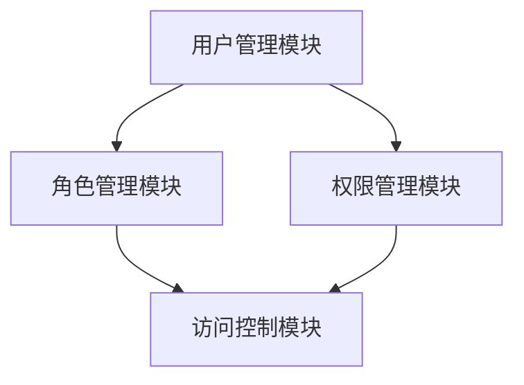

                 


## 评测系统的用户权限管理：控制访问和操作权限

### 关键词

- 用户权限管理
- 访问控制
- 权限模型
- RBAC
- ABAC

### 摘要

本文将深入探讨评测系统的用户权限管理，详细分析如何控制访问和操作权限。通过对核心概念、算法原理、系统架构设计、项目实战的讲解，提供一套完整的用户权限管理解决方案，帮助读者理解和掌握这一关键技术。

## 引言

在当今的信息时代，信息安全变得越来越重要。评测系统作为一项关键应用，其用户权限管理显得尤为关键。用户权限管理不仅关乎数据的机密性、完整性和可用性，更是系统稳定运行和业务连续性的基础。因此，深入了解并实施有效的用户权限管理策略是每个系统开发者和运维人员必须掌握的核心技能。

本文将从以下几个方面进行深入探讨：

1. **背景介绍**：阐述评测系统的用户权限管理的重要性，以及当前用户权限管理所面临的挑战。
2. **核心概念与联系**：介绍用户角色、权限、访问控制模型等基本概念，并通过实体关系图（ER图）展示它们之间的关系。
3. **算法原理讲解**：分析常用权限控制算法，如基于角色的访问控制（RBAC）和基于属性的访问控制（ABAC），并使用Python代码和Mermaid流程图详细阐述。
4. **系统分析与架构设计**：介绍评测系统的需求分析、用户权限管理系统的设计，以及系统架构与接口设计。
5. **项目实战**：通过实际项目，展示用户权限管理系统的搭建、核心功能实现、系统测试与性能优化。
6. **最佳实践与小结**：总结用户权限管理的最佳实践，解答常见问题，并给出进一步学习建议。

### 第一部分：背景介绍

#### 1.1 评测系统的用户权限管理的重要性

评测系统通常用于对用户进行考核、测试或评分。它涉及到大量的敏感数据，如用户信息、测试结果、评分标准等。因此，用户权限管理显得至关重要。

首先，有效的用户权限管理可以确保数据的机密性。只有授权用户才能访问和操作特定数据，从而防止未授权访问和泄露。

其次，用户权限管理有助于保护系统的完整性。通过限制用户的操作权限，可以防止恶意行为，如篡改数据或破坏系统。

最后，用户权限管理有助于提升系统的可用性。合理的权限分配可以确保系统资源得到有效利用，从而提高系统的响应速度和处理能力。

#### 1.2 当前用户权限管理面临的挑战和问题

尽管用户权限管理至关重要，但实际应用中仍面临诸多挑战：

1. **权限泄露**：未授权用户可能通过各种手段获得访问权限，从而导致数据泄露。
2. **权限滥用**：授权用户可能滥用权限，进行不当操作，如篡改数据或破坏系统。
3. **权限冲突**：不同用户之间的权限分配可能产生冲突，导致系统功能受限。
4. **权限管理复杂性**：随着系统规模和用户数量的增加，权限管理变得越来越复杂，难以有效控制。

#### 1.3 用户权限管理的基本概念和原理

用户权限管理涉及多个核心概念，包括用户、角色、权限、访问控制等。以下是对这些概念的基本解释：

- **用户**：指使用评测系统的实际人员或实体。
- **角色**：表示用户在系统中的职责和权限范围。例如，管理员、教师、学生等。
- **权限**：指用户在系统中可以执行的操作，如读取、修改、删除等。
- **访问控制**：指对用户访问系统和数据的控制策略，以确保系统的安全性和完整性。

### 第二部分：核心概念与联系

#### 2.1 用户角色与权限的关系

用户角色与权限之间有着密切的联系。不同的角色通常对应不同的权限集合。例如，管理员拥有最高的权限，可以执行所有操作；而普通用户则只能执行有限的操作。

#### 2.2 访问控制模型与权限级别

访问控制模型是用户权限管理的基础。常用的访问控制模型包括基于角色的访问控制（RBAC）和基于属性的访问控制（ABAC）。RBAC通过用户角色来分配权限，而ABAC则基于用户的属性（如部门、职位等）来控制访问。

#### 2.3 用户权限管理系统的架构

用户权限管理系统的架构包括多个组件，如用户管理模块、角色管理模块、权限管理模块等。以下是一个简单的架构图：



### 第三部分：算法原理讲解

#### 3.1 常用的权限控制算法

##### 3.1.1 RBAC模型

RBAC（Role-Based Access Control）是一种基于角色的访问控制模型。它通过定义用户角色和权限之间的关系，实现访问控制。

以下是一个简单的RBAC模型：

$$
RBAC = \{ U, R, P, S \}
$$

其中，$U$代表用户集合，$R$代表角色集合，$P$代表权限集合，$S$代表用户角色关系。

**权限分配策略**：

- 用户分配角色：$S \subseteq U \times R$
- 权限授予角色：$R \subseteq P \times R$

**权限继承策略**：

- 角色可以继承权限：$P \subseteq P \times R$
- 角色之间的权限传递：$R \subseteq R \times R$

##### 3.1.2 ABAC模型

ABAC（Attribute-Based Access Control）是一种基于属性的访问控制模型。它通过用户的属性来控制访问。

以下是一个简单的ABAC模型：

$$
ABAC = \{ U, A, R, P, F \}
$$

其中，$U$代表用户集合，$A$代表属性集合，$R$代表权限集合，$P$代表用户属性集合，$F$代表访问控制策略。

**访问控制策略**：

- 用户属性：$P \subseteq U \times A$
- 权限：$R \subseteq P \times P$
- 访问控制决策：$F: R \times A \rightarrow P$

**权限分配策略**：

- 用户分配属性：$P \subseteq U \times A$
- 属性关联权限：$R \subseteq P \times R$

#### 3.2 权限分配与回收策略

权限分配和回收策略是用户权限管理的核心。以下是一些常见的策略：

- **静态分配**：用户在系统初始化时被分配角色和权限，后续不再更改。
- **动态分配**：用户在系统运行时根据实际情况动态分配角色和权限。
- **回收策略**：用户离职或权限变更时，系统自动回收其权限。

#### 3.3 权限冲突解决方法

权限冲突是用户权限管理中常见的问题。以下是一些解决方法：

- **权限降级**：将冲突权限降级为较低的权限。
- **权限继承**：通过角色继承机制解决权限冲突。
- **权限隔离**：为不同角色分配不同的权限，避免冲突。

### 第四部分：系统分析与架构设计

#### 4.1 评测系统的需求分析

在设计和实现用户权限管理系统之前，我们需要对评测系统的需求进行深入分析。这包括了解系统的功能、性能、安全等要求。

#### 4.2 用户权限管理系统的设计

用户权限管理系统的设计应遵循以下原则：

- **安全性**：确保系统安全，防止未授权访问和操作。
- **灵活性**：支持动态权限分配和回收，适应不同的业务场景。
- **可扩展性**：支持系统规模和用户数量的增长，易于维护和升级。

#### 4.3 系统架构与接口设计

用户权限管理系统的架构设计应包括以下组件：

- **用户管理模块**：负责用户信息管理，如用户注册、登录、权限分配等。
- **角色管理模块**：负责角色信息管理，如角色创建、删除、权限分配等。
- **权限管理模块**：负责权限信息管理，如权限创建、删除、权限关系维护等。
- **访问控制模块**：负责实现访问控制策略，如权限检查、权限验证等。

以下是一个简单的系统架构图：


#### 4.4 系统接口设计与交互

系统接口设计应包括用户管理接口、角色管理接口、权限管理接口和访问控制接口。以下是一个简单的接口设计示例：

```python
class UserManager:
    def register_user(self, user):
        # 用户注册逻辑
    
    def login_user(self, user):
        # 用户登录逻辑
    
    def assign_role_to_user(self, user, role):
        # 用户角色分配逻辑

class RoleManager:
    def create_role(self, role):
        # 创建角色逻辑
    
    def delete_role(self, role):
        # 删除角色逻辑
    
    def assign_permission_to_role(self, role, permission):
        # 角色权限分配逻辑

class PermissionManager:
    def create_permission(self, permission):
        # 创建权限逻辑
    
    def delete_permission(self, permission):
        # 删除权限逻辑
    
    def update_permission(self, permission, new_permission):
        # 更新权限逻辑

class AccessControl:
    def check_permission(self, user, permission):
        # 权限检查逻辑
    
    def validate_access(self, user, resource):
        # 访问验证逻辑
```

### 第五部分：项目实战

#### 5.1 系统搭建与环境配置

在进行项目实战之前，我们需要搭建用户权限管理系统并配置相关环境。

1. **搭建系统框架**：选择合适的框架（如Django、Flask等），搭建用户权限管理系统框架。
2. **配置数据库**：配置用户权限管理系统的数据库，如MySQL、PostgreSQL等。
3. **配置环境**：配置系统所需的依赖库和环境变量，确保系统能够正常运行。

#### 5.2 用户权限管理核心功能实现

在系统搭建完成后，我们需要实现用户权限管理的核心功能，如用户注册、登录、角色管理、权限管理、访问控制等。

以下是一个简单的用户注册功能示例：

```python
class UserManager:
    def register_user(self, user):
        # 用户注册逻辑
        db = DatabaseConnection()
        db.execute("INSERT INTO users (username, password) VALUES (%s, %s)", (user.username, user.password))
        db.commit()
        db.close()
```

#### 5.3 系统测试与性能优化

在实现核心功能后，我们需要对系统进行测试和性能优化。

1. **功能测试**：对用户注册、登录、角色管理、权限管理、访问控制等核心功能进行测试，确保其正常运行。
2. **性能测试**：对系统的性能进行测试，如响应时间、并发处理能力等。
3. **性能优化**：根据测试结果，对系统进行优化，如数据库优化、缓存策略等。

### 第六部分：最佳实践与小结

#### 6.1 用户权限管理的最佳实践

1. **最小权限原则**：用户应只拥有完成其工作所需的最低权限。
2. **角色分离**：将系统中的角色分离为不同的部分，确保每个角色只负责一部分功能。
3. **日志审计**：记录用户的操作日志，以便在发生问题时进行审计和追踪。

#### 6.2 注意事项与常见问题解答

1. **权限泄露**：定期审查权限，确保只有授权用户拥有适当的权限。
2. **权限滥用**：加强对用户操作的监控，及时发现并处理权限滥用行为。
3. **权限冲突**：在设计权限分配策略时，尽量避免权限冲突。

#### 6.3 拓展阅读与进一步学习建议

- **RBAC模型**：《基于角色的访问控制：理论与实践》
- **ABAC模型**：《属性基础访问控制：机制、方法与实践》
- **系统架构设计**：《软件架构：实践者的研究方法》
- **权限管理工具**：《权限管理系统设计与实践》

### 第七部分：总结

用户权限管理是评测系统的重要组成部分。通过本文的讲解，我们了解了用户权限管理的基本概念、算法原理、系统架构设计以及项目实战。在实施用户权限管理时，应遵循最佳实践，确保系统的安全性和可靠性。同时，不断学习和更新相关技术，以应对不断变化的安全挑战。

### 作者信息

作者：AI天才研究院/AI Genius Institute & 禅与计算机程序设计艺术 /Zen And The Art of Computer Programming

