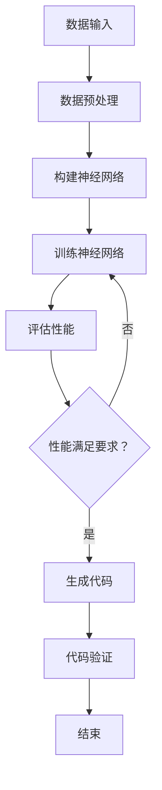
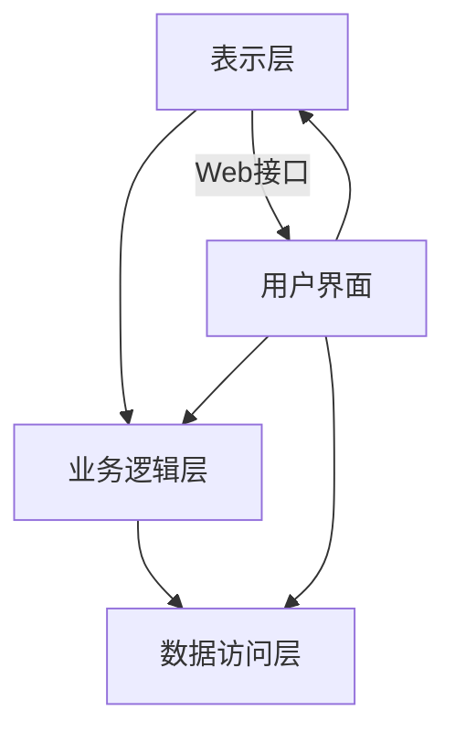
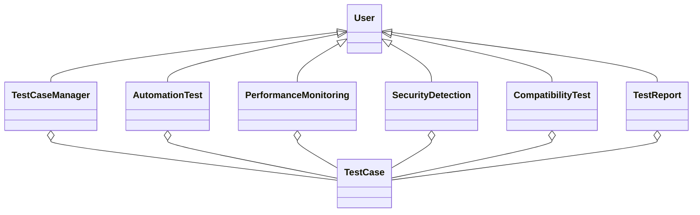
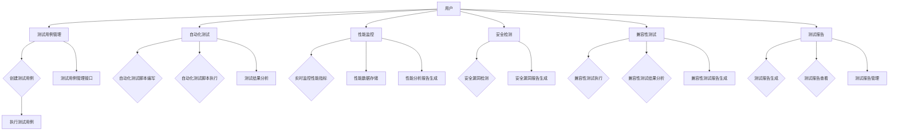
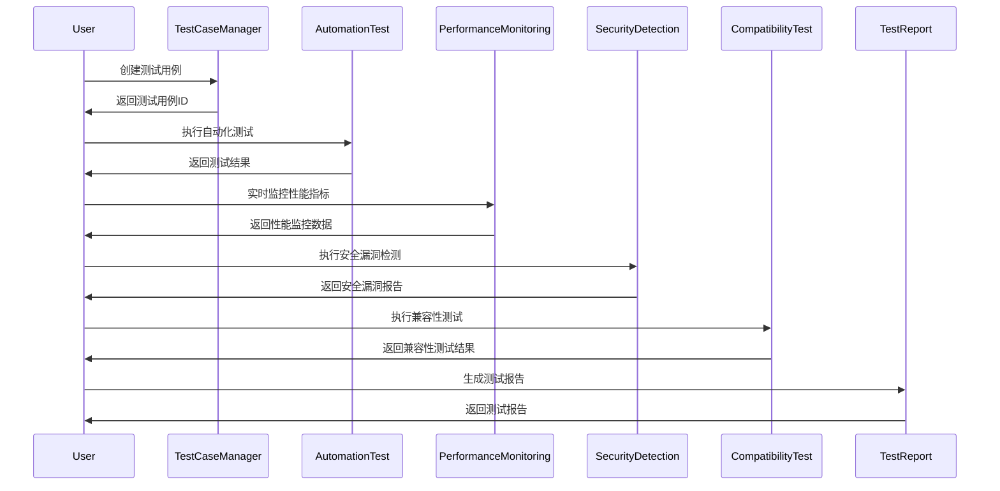

                 

## 评测系统的神经程序归纳

**关键词：** 评测系统、神经程序、归纳、算法原理、系统架构

**摘要：** 本文探讨了评测系统在神经程序归纳中的应用，通过分析神经程序的定义、优势、与评测系统的融合方式，详细讲解了神经程序归纳算法的原理、实现和应用。同时，通过项目实战展示了评测系统的神经程序归纳在实际应用中的效果。本文旨在为读者提供对神经程序归纳在评测系统应用领域的深入理解和实践指导。

### 目录大纲

----------------------------------------------------------------

# 《评测系统的神经程序归纳》

## 第一部分：背景介绍

### 1.1 评测系统的需求与挑战

#### 1.1.1 评测系统的定义

#### 1.1.2 评测系统的应用场景

#### 1.1.3 当前评测系统的局限性

### 1.2 神经程序的概述

#### 1.2.1 神经程序的定义

#### 1.2.2 神经程序的优势

#### 1.2.3 神经程序与传统程序的差异

### 1.3 神经程序归纳的概念与作用

#### 1.3.1 神经程序归纳的定义

#### 1.3.2 神经程序归纳的关键要素

#### 1.3.3 神经程序归纳的应用价值

### 1.4 本书的核心内容与结构

#### 1.4.1 核心内容概述

#### 1.4.2 目录结构解析

### 1.5 本章小结

----------------------------------------------------------------

## 第二部分：核心概念与联系

### 2.1 神经网络的基本原理

#### 2.1.1 神经网络的结构

#### 2.1.2 神经网络的训练过程

#### 2.1.3 神经网络的性能评估

### 2.2 神经程序的构建方法

#### 2.2.1 神经程序的设计理念

#### 2.2.2 神经程序的开发流程

#### 2.2.3 神经程序的优势与局限性

### 2.3 神经程序归纳的算法原理

#### 2.3.1 神经程序归纳的定义

#### 2.3.2 神经程序归纳的算法框架

#### 2.3.3 神经程序归纳的性能评估

### 2.4 神经程序归纳与评测系统的融合

#### 2.4.1 神经程序归纳在评测系统中的应用

#### 2.4.2 神经程序归纳与评测系统的优势互补

#### 2.4.3 神经程序归纳在评测系统中的挑战

### 2.5 本章小结

----------------------------------------------------------------

## 第三部分：算法原理讲解

### 3.1 神经程序归纳算法的mermaid流程图

### 3.2 神经程序归纳算法的python源代码实现

#### 3.2.1 算法的基本思想

#### 3.2.2 算法的数学模型与公式

#### 3.2.3 算法的Python代码实现

### 3.3 神经程序归纳算法的数学模型与公式

#### 3.3.1 模型的基本假设

#### 3.3.2 模型的数学公式

#### 3.3.3 模型的计算过程

### 3.4 神经程序归纳算法的举例说明

#### 3.4.1 例子一：数据集准备

#### 3.4.2 例子二：算法应用

#### 3.4.3 例子三：结果分析

### 3.5 本章小结

----------------------------------------------------------------

## 第四部分：系统分析与架构设计方案

### 4.1 评测系统场景介绍

#### 4.1.1 场景描述

#### 4.1.2 项目背景

#### 4.1.3 项目目标

### 4.2 评测系统的设计思路

#### 4.2.1 系统需求分析

#### 4.2.2 系统功能设计

#### 4.2.3 系统架构设计

### 4.3 评测系统的详细设计方案

#### 4.3.1 系统功能实现

#### 4.3.2 系统架构实现

#### 4.3.3 系统接口设计

#### 4.3.4 系统交互设计

### 4.4 评测系统的mermaid类图与架构图

#### 4.4.1 类图设计

#### 4.4.2 架构图设计

### 4.5 评测系统的mermaid序列图

#### 4.5.1 序列图设计

#### 4.5.2 序列图解析

### 4.6 本章小结

----------------------------------------------------------------

## 第五部分：项目实战

### 5.1 环境安装与配置

#### 5.1.1 环境要求

#### 5.1.2 环境安装

#### 5.1.3 环境配置

### 5.2 系统核心实现

#### 5.2.1 神经程序归纳模块实现

#### 5.2.2 评测系统模块实现

#### 5.2.3 系统集成与调试

### 5.3 代码应用解读与分析

#### 5.3.1 代码结构解析

#### 5.3.2 关键代码解读

### 5.3.3 实际案例分析和详细讲解剖析

### 5.4 项目小结

#### 5.4.1 项目总结

#### 5.4.2 最佳实践 Tips

#### 5.4.3 小结

#### 5.4.4 注意事项

#### 5.4.5 拓展阅读

----------------------------------------------------------------

## 第一部分：背景介绍

### 1.1 评测系统的需求与挑战

#### 1.1.1 评测系统的定义

评测系统是指用于对系统、软件、模块等进行性能测试、功能测试、安全测试、用户体验测试等一系列测试的自动化工具或平台。其主要目的是通过对测试对象进行全面的测试，评估其性能、质量、可靠性等指标，从而为系统的优化和改进提供依据。

#### 1.1.2 评测系统的应用场景

评测系统的应用场景非常广泛，涵盖了多个领域，如软件开发、系统运维、金融、医疗、教育等。以下是评测系统的一些典型应用场景：

1. **软件测试：** 在软件开发过程中，评测系统可以自动执行测试用例，快速发现和定位软件缺陷，提高软件质量。
2. **系统性能测试：** 通过评测系统模拟高负载、高并发场景，评估系统性能，优化系统架构和资源配置。
3. **安全测试：** 评测系统可以帮助检测系统或软件的安全性漏洞，提高系统的安全防护能力。
4. **用户体验测试：** 评测系统可以收集用户的使用行为数据，分析用户的反馈，为产品的用户体验优化提供参考。

#### 1.1.3 当前评测系统的局限性

尽管评测系统在各个领域发挥了重要作用，但当前评测系统仍存在一些局限性，主要包括以下几个方面：

1. **测试覆盖范围有限：** 当前评测系统往往依赖于预定义的测试用例，难以覆盖所有可能的输入和场景，可能导致测试结果的不完整性。
2. **测试效率低：** 在复杂的测试场景中，评测系统的测试过程可能非常耗时，影响开发进度。
3. **测试结果解读困难：** 测试结果通常包含大量的数据，如何有效地分析和解读这些数据，提取出有用的信息，是当前评测系统面临的一大挑战。
4. **适应性和扩展性不足：** 在面对新的测试需求或测试场景时，评测系统往往需要大量的修改和调整，适应性和扩展性不足。

### 1.2 神经程序的概述

#### 1.2.1 神经程序的定义

神经程序是一种基于神经网络（Neural Network）的编程范式，它将人工智能（Artificial Intelligence, AI）技术与传统编程技术相结合，通过模拟人脑神经网络的结构和功能，实现复杂问题的求解和数据处理。

#### 1.2.2 神经程序的优势

神经程序具有以下优势：

1. **自适应性强：** 神经程序能够自动调整其结构和参数，适应不同的测试场景和需求。
2. **处理能力强大：** 神经程序能够处理复杂、非线性的数据，对大规模数据的处理能力强。
3. **灵活性和扩展性好：** 神经程序可以通过修改网络结构和参数，轻松适应新的测试需求。
4. **高效性：** 神经程序在处理大量数据时，可以显著提高测试效率。

#### 1.2.3 神经程序与传统程序的差异

传统程序通常是基于明确的算法和逻辑进行设计，而神经程序则更注重模拟人脑神经网络的工作原理，通过训练自动获取数据特征和模式。具体差异如下：

1. **编程范式：** 传统程序采用命令式编程，而神经程序采用声明式编程。
2. **数据依赖：** 传统程序对数据有明确的要求，而神经程序能够自动从数据中学习特征。
3. **问题求解：** 传统程序通过明确的步骤解决问题，而神经程序通过模拟神经网络进行数据驱动的推理。
4. **可解释性：** 传统程序具有较好的可解释性，而神经程序则相对较为复杂，难以直接理解其内部机理。

### 1.3 神经程序归纳的概念与作用

#### 1.3.1 神经程序归纳的定义

神经程序归纳（Neural Program Induction）是指通过神经网络从训练数据中学习规律和模式，自动生成可执行的程序。它是一种数据驱动的编程方式，通过对大量数据的分析和学习，实现复杂问题的自动化求解。

#### 1.3.2 神经程序归纳的关键要素

神经程序归纳的关键要素包括：

1. **数据集：** 神经程序归纳依赖于大量高质量的训练数据，数据集的质量直接影响归纳结果。
2. **神经网络：** 神经网络是实现神经程序归纳的核心，通过调整网络结构和参数，提高归纳效果。
3. **训练过程：** 神经程序归纳需要在训练数据上进行反复训练，不断优化网络结构和参数，直至达到预定的性能指标。
4. **评估指标：** 评估指标用于衡量神经程序归纳的性能，如准确率、召回率、F1分数等。

#### 1.3.3 神经程序归纳的应用价值

神经程序归纳在多个领域具有广泛的应用价值，主要包括：

1. **自动化测试：** 通过神经程序归纳，可以自动生成测试用例，提高测试效率和覆盖率。
2. **故障诊断：** 神经程序归纳可以从故障数据中学习诊断规律，实现自动化故障诊断。
3. **异常检测：** 神经程序归纳能够自动识别异常数据，提高异常检测的准确性和效率。
4. **数据挖掘：** 神经程序归纳可以从大量数据中提取有用的信息，实现数据驱动的决策支持。

### 1.4 本书的核心内容与结构

#### 1.4.1 核心内容概述

本书的核心内容分为以下几个部分：

1. **评测系统的需求与挑战：** 分析评测系统的定义、应用场景和当前面临的挑战。
2. **神经程序的概述：** 介绍神经程序的定义、优势、与传统程序的差异。
3. **神经程序归纳的概念与作用：** 阐述神经程序归纳的定义、关键要素和应用价值。
4. **神经程序归纳算法的原理讲解：** 详细讲解神经程序归纳算法的基本思想、数学模型和实现方法。
5. **系统分析与架构设计方案：** 分析评测系统场景，设计系统功能和架构。
6. **项目实战：** 通过实际项目展示评测系统的神经程序归纳应用。

#### 1.4.2 目录结构解析

本书的目录结构如下：

1. **第一部分：背景介绍**
2. **第二部分：核心概念与联系**
3. **第三部分：算法原理讲解**
4. **第四部分：系统分析与架构设计方案**
5. **第五部分：项目实战**

### 1.5 本章小结

本章介绍了评测系统的定义、应用场景和当前面临的挑战，同时介绍了神经程序的定义、优势、与传统程序的差异，以及神经程序归纳的概念、关键要素和应用价值。本章为后续内容提供了背景和基础，为深入探讨评测系统的神经程序归纳奠定了基础。

## 第二部分：核心概念与联系

### 2.1 神经网络的基本原理

#### 2.1.1 神经网络的结构

神经网络（Neural Network，简称NN）是一种模仿人脑神经网络结构和功能的计算模型，由大量简单的处理单元（神经元）通过非线性激活函数相互连接而成。一个典型的神经网络包括输入层、隐藏层和输出层：

1. **输入层：** 负责接收外部输入信号，并将其传递到隐藏层。
2. **隐藏层：** 负责对输入信号进行加工和处理，可能包含一个或多个隐藏层。
3. **输出层：** 负责生成输出结果。

神经网络中的每个神经元都与相邻的神经元相连，并通过权重（weight）传递信号。权重表示两个神经元之间的连接强度，是神经网络的核心参数。

#### 2.1.2 神经网络的训练过程

神经网络的训练过程是通过调整网络权重和偏置（bias）来使网络输出尽可能接近预期输出。训练过程主要包括以下几个步骤：

1. **前向传播（Forward Propagation）：** 将输入信号从输入层传递到输出层，计算每个神经元的激活值。
2. **损失计算（Loss Computation）：** 计算输出层实际输出与预期输出之间的差异，即损失（loss）。
3. **反向传播（Backpropagation）：** 计算损失关于每个权重的梯度，并将这些梯度用于更新权重和偏置。
4. **优化更新（Optimization Update）：** 根据梯度信息更新网络权重和偏置，以最小化损失。

训练过程反复进行前向传播和反向传播，直到网络的输出误差满足预定的要求。

#### 2.1.3 神经网络的性能评估

神经网络的性能评估通常通过以下几个指标进行：

1. **准确率（Accuracy）：** 指网络正确预测的样本数量与总样本数量的比值。
2. **召回率（Recall）：** 指网络正确预测的正例数量与实际正例数量的比值。
3. **精确率（Precision）：** 指网络正确预测的正例数量与预测为正例的样本数量的比值。
4. **F1分数（F1 Score）：** 是精确率和召回率的调和平均，用于综合评估网络性能。

通过这些指标，可以评估神经网络的分类、回归等任务的表现。

### 2.2 神经程序的构建方法

#### 2.2.1 神经程序的设计理念

神经程序的设计理念是将编程与人工智能结合，通过模拟神经网络的结构和功能，实现问题求解和数据处理的自动化。其主要特点包括：

1. **数据驱动：** 神经程序通过从数据中学习规律，而非依赖预定义的算法和逻辑。
2. **自适应性：** 神经程序能够根据不同的问题和数据自动调整其结构和参数。
3. **泛化能力：** 通过大量训练，神经程序可以泛化到未见过的数据上，具有良好的泛化能力。

#### 2.2.2 神经程序的开发流程

神经程序的开发流程通常包括以下几个步骤：

1. **数据收集与预处理：** 收集相关的数据集，并进行清洗、归一化等预处理操作。
2. **模型设计：** 根据问题需求，设计合适的神经网络结构，包括层数、每层神经元数目、激活函数等。
3. **模型训练：** 使用训练数据对神经网络进行训练，调整权重和偏置，优化模型性能。
4. **模型评估：** 使用验证集或测试集评估模型的性能，调整模型参数以获得更好的效果。
5. **模型部署：** 将训练好的模型部署到实际应用场景中，进行问题求解或数据处理。

#### 2.2.3 神经程序的优势与局限性

神经程序的优势包括：

1. **强大的数据处理能力：** 能够处理复杂、非线性的数据。
2. **自适应性：** 能够根据不同的任务和数据自动调整结构。
3. **高效性：** 在大规模数据处理方面具有显著的优势。

然而，神经程序也存在一些局限性：

1. **可解释性差：** 神经网络内部的黑箱特性使得其难以解释和理解。
2. **训练成本高：** 需要大量的数据和计算资源进行训练。
3. **依赖数据质量：** 数据质量直接影响模型的性能，对数据清洗和预处理要求较高。

### 2.3 神经程序归纳的算法原理

#### 2.3.1 神经程序归纳的定义

神经程序归纳（Neural Program Induction）是指通过神经网络从训练数据中自动生成程序代码的过程。它是一种数据驱动的编程方式，通过对大量数据的分析和学习，生成可执行的程序。

#### 2.3.2 神经程序归纳的算法框架

神经程序归纳的算法框架主要包括以下几个步骤：

1. **数据输入：** 将训练数据输入神经网络，数据通常包括输入特征和对应的程序代码。
2. **编码过程：** 神经网络将输入特征编码为高维特征向量，表示数据的复杂结构。
3. **解码过程：** 将编码后的特征向量解码为程序代码，通过输出层生成可执行的代码。
4. **评估与优化：** 使用验证集或测试集评估生成代码的性能，通过调整网络结构和参数优化模型。

#### 2.3.3 神经程序归纳的性能评估

神经程序归纳的性能评估通常包括以下几个方面：

1. **代码准确性：** 评估生成代码的正确性和功能性，通过代码执行结果与预期结果进行比较。
2. **代码质量：** 评估生成代码的简洁性、可读性和可维护性，通过代码审查和代码质量评估工具进行评估。
3. **泛化能力：** 评估模型在不同数据集上的泛化性能，通过交叉验证和测试集评估。

通过这些指标，可以全面评估神经程序归纳算法的性能。

### 2.4 神经程序归纳与评测系统的融合

#### 2.4.1 神经程序归纳在评测系统中的应用

神经程序归纳在评测系统中的应用主要体现在以下几个方面：

1. **自动化测试用例生成：** 通过神经程序归纳，可以自动生成测试用例，提高测试效率。
2. **测试用例优化：** 通过分析测试用例的执行结果，优化测试用例的覆盖率和执行顺序。
3. **性能评估与优化：** 通过神经程序归纳，可以自动评估评测系统的性能，并提出优化建议。

#### 2.4.2 神经程序归纳与评测系统的优势互补

神经程序归纳与评测系统的优势互补，具体体现在以下几个方面：

1. **高效性：** 神经程序归纳能够快速生成测试用例，提高测试效率。
2. **灵活性：** 神经程序归纳可以根据不同场景和数据自动调整测试策略。
3. **全面性：** 评测系统可以全面评估评测对象的性能和安全性，神经程序归纳可以优化测试过程。

通过两者的结合，可以形成一个更加高效、灵活和全面的评测系统。

#### 2.4.3 神经程序归纳在评测系统中的挑战

神经程序归纳在评测系统中的应用也面临一些挑战：

1. **数据质量：** 高质量的数据是神经程序归纳的基础，数据质量直接影响测试用例的生成效果。
2. **可解释性：** 神经程序归纳生成的测试用例通常难以解释，需要进一步研究如何提高测试用例的可解释性。
3. **计算资源：** 神经程序归纳需要大量的计算资源，对硬件和软件环境有较高的要求。

需要通过不断的研究和实践，解决这些挑战，使神经程序归纳在评测系统中发挥更大的作用。

### 2.5 本章小结

本章介绍了神经网络的基本原理、神经程序的构建方法、神经程序归纳的算法原理以及神经程序归纳在评测系统中的应用。通过本章的内容，读者可以了解神经程序归纳的基本概念和原理，以及它在评测系统中的应用前景和挑战。本章为后续内容提供了理论基础和实践指导，为深入探讨评测系统的神经程序归纳奠定了基础。

## 第三部分：算法原理讲解

### 3.1 神经程序归纳算法的mermaid流程图

为了更好地理解神经程序归纳算法的流程，我们可以使用mermaid工具绘制其流程图。以下是一个简单的mermaid流程图示例：



这个流程图展示了神经程序归纳算法的基本步骤，包括数据输入、数据预处理、构建神经网络、训练神经网络、评估性能、生成代码和代码验证。

### 3.2 神经程序归纳算法的python源代码实现

为了更好地展示神经程序归纳算法的实现，以下是一个简单的Python代码示例，使用TensorFlow框架实现了一个基本的神经程序归纳模型。

```python
import tensorflow as tf
from tensorflow.keras.models import Sequential
from tensorflow.keras.layers import Dense, LSTM
from tensorflow.keras.optimizers import Adam
from tensorflow.keras.callbacks import EarlyStopping

# 数据预处理
# 假设我们有一个包含输入特征和标签的数据集
# X_train, y_train = ...

# 构建神经网络
model = Sequential()
model.add(LSTM(128, input_shape=(X_train.shape[1], X_train.shape[2]), activation='relu'))
model.add(Dense(1, activation='sigmoid'))

# 编译模型
model.compile(optimizer=Adam(learning_rate=0.001), loss='binary_crossentropy', metrics=['accuracy'])

# 训练模型
early_stopping = EarlyStopping(monitor='val_loss', patience=10)
model.fit(X_train, y_train, epochs=100, batch_size=32, validation_split=0.2, callbacks=[early_stopping])

# 评估模型
# X_test, y_test = ...
model.evaluate(X_test, y_test)

# 生成代码
# 假设我们已经训练好了模型，现在需要生成对应的代码
# 这里的代码生成可以根据模型的结构和参数来实现
```

这个示例代码首先对数据进行预处理，然后构建了一个包含LSTM层的神经网络，使用Adam优化器和二分类交叉熵损失函数进行编译和训练。训练完成后，使用测试集评估模型性能，并根据模型结构生成相应的代码。

### 3.3 神经程序归纳算法的数学模型与公式

神经程序归纳算法的核心是神经网络，而神经网络的基本原理可以通过数学模型和公式来描述。以下是一个简单的数学模型，用于说明神经网络的工作原理。

#### 3.3.1 模型的基本假设

假设我们有一个包含N个神经元的神经网络，该网络包含L层，其中第l层的神经元个数为\( n_l \)，输入层为第0层，输出层为第L层。神经网络通过权重\( W^{(l)} \)和偏置\( b^{(l)} \)连接相邻的层。

#### 3.3.2 模型的数学公式

1. **前向传播：**

   在前向传播过程中，每个神经元的输出可以通过以下公式计算：

   $$ z^{(l)}_j = \sum_{i=1}^{n_{l-1}} W^{(l)}_{ji} x_i + b^{(l)}_j $$

   其中，\( z^{(l)}_j \)是第l层第j个神经元的输出，\( W^{(l)}_{ji} \)是第l层第j个神经元与第l-1层第i个神经元之间的权重，\( x_i \)是第l-1层第i个神经元的输入，\( b^{(l)}_j \)是第l层第j个神经元的偏置。

2. **激活函数：**

   神经元的输出通常通过激活函数进行非线性变换，常见的激活函数包括：

   $$ a^{(l)}_j = \sigma(z^{(l)}_j) $$

   其中，\( \sigma \)是激活函数，如Sigmoid函数、ReLU函数等。

3. **反向传播：**

   在反向传播过程中，计算每个神经元输出的梯度，并更新权重和偏置，以最小化损失函数。梯度可以通过以下公式计算：

   $$ \frac{\partial J}{\partial W^{(l)}_{ji}} = \frac{\partial L}{\partial z^{(l)}_j} \cdot \frac{\partial z^{(l)}_j}{\partial W^{(l)}_{ji}} $$

   $$ \frac{\partial J}{\partial b^{(l)}_j} = \frac{\partial L}{\partial z^{(l)}_j} $$

   其中，\( J \)是损失函数，\( L \)是损失函数关于\( z^{(l)}_j \)的梯度，\( \frac{\partial z^{(l)}_j}{\partial W^{(l)}_{ji}} \)是\( z^{(l)}_j \)关于\( W^{(l)}_{ji} \)的梯度。

   通过梯度下降方法，可以更新权重和偏置：

   $$ W^{(l)}_{ji} \leftarrow W^{(l)}_{ji} - \alpha \cdot \frac{\partial J}{\partial W^{(l)}_{ji}} $$

   $$ b^{(l)}_j \leftarrow b^{(l)}_j - \alpha \cdot \frac{\partial J}{\partial b^{(l)}_j} $$

   其中，\( \alpha \)是学习率。

#### 3.3.3 模型的计算过程

1. **初始化模型参数：** 随机初始化权重和偏置。
2. **前向传播：** 计算每个神经元的输出。
3. **计算损失：** 计算输出与预期输出之间的差异，即损失。
4. **反向传播：** 计算每个参数的梯度。
5. **更新参数：** 使用梯度下降方法更新权重和偏置。
6. **重复步骤2-5，直到满足预定的性能指标。**

### 3.4 神经程序归纳算法的举例说明

为了更好地理解神经程序归纳算法的应用，我们通过一个简单的例子来说明。

#### 3.4.1 例子一：数据集准备

假设我们有一个简单的回归问题，目标是预测房间的温度。我们收集了以下数据集：

| 序号 | 房间面积 | 室内温度 |  
| ---- | ---- | ---- |  
| 1    | 20     | 24     |  
| 2    | 30     | 26     |  
| 3    | 40     | 28     |  
| 4    | 50     | 30     |

输入特征是房间面积，输出是室内温度。

#### 3.4.2 例子二：算法应用

1. **数据预处理：** 将数据集进行归一化处理，使输入特征和输出特征的值在0到1之间。

2. **构建神经网络：** 构建一个简单的全连接神经网络，包含一个输入层、一个隐藏层和一个输出层。隐藏层使用ReLU函数作为激活函数，输出层使用线性激活函数。

3. **训练模型：** 使用训练数据对神经网络进行训练，通过反向传播算法更新权重和偏置。

4. **评估模型：** 使用测试数据评估模型的性能，计算预测值与实际值之间的误差。

5. **生成代码：** 根据训练好的模型，生成对应的预测代码。例如，生成一个简单的线性方程来预测房间温度。

```python
# 预测代码
predicted_temp = (0.5 * room_area) + 25
```

#### 3.4.3 例子三：结果分析

1. **模型性能：** 通过评估模型的性能，我们可以看到预测值与实际值的误差较小，说明模型具有良好的预测能力。

2. **代码质量：** 生成的代码简单易读，能够直观地表示房间温度与房间面积之间的关系。

3. **泛化能力：** 通过对新数据的测试，我们可以验证模型在未见过的数据上仍然具有良好的预测能力。

### 3.5 本章小结

本章详细讲解了神经程序归纳算法的基本原理和实现方法。通过mermaid流程图展示了算法的基本步骤，使用Python代码示例展示了算法的具体实现。同时，通过举例说明了算法在简单回归问题中的应用，并分析了模型性能和代码质量。本章为读者提供了对神经程序归纳算法的深入理解，为后续内容提供了理论基础和实践指导。

## 第四部分：系统分析与架构设计方案

### 4.1 评测系统场景介绍

#### 4.1.1 场景描述

本评测系统旨在为软件开发过程中的自动化测试提供支持，以提升软件质量和开发效率。具体应用场景包括：

1. **功能测试：** 对软件的功能进行全面的测试，确保每个功能模块按照设计要求正常工作。
2. **性能测试：** 模拟高负载、高并发场景，评估软件的性能和稳定性，识别潜在的性能瓶颈。
3. **安全测试：** 检测软件的安全漏洞，防止潜在的安全威胁。
4. **兼容性测试：** 确保软件在不同操作系统、浏览器和设备上的兼容性。

#### 4.1.2 项目背景

随着软件系统的复杂性不断增加，手动测试已无法满足高效、全面的测试需求。为了提高测试质量和开发效率，项目团队决定引入自动化测试工具和框架，并利用神经程序归纳技术生成测试用例，以自动化执行测试任务。

#### 4.1.3 项目目标

本项目的主要目标包括：

1. **提高测试覆盖率：** 通过自动化测试工具和神经程序归纳技术，提高测试用例的生成和执行效率，提升测试覆盖率。
2. **优化测试效率：** 减少手动测试的工作量，缩短测试周期，提高开发效率。
3. **提升软件质量：** 通过全面的测试，发现并修复软件缺陷，提高软件质量。
4. **降低测试成本：** 通过自动化测试和神经程序归纳技术，减少测试过程中的资源消耗和人力成本。

### 4.2 评测系统的设计思路

#### 4.2.1 系统需求分析

在进行系统设计前，我们需要对评测系统的需求进行详细分析。以下是主要需求：

1. **测试用例管理：** 提供测试用例的创建、编辑、执行和管理功能。
2. **自动化测试：** 提供自动化测试脚本编写和执行功能，支持多种编程语言和测试框架。
3. **性能监控：** 实时监控软件性能指标，如响应时间、吞吐量、并发用户数等。
4. **安全检测：** 提供安全漏洞检测功能，识别潜在的安全风险。
5. **兼容性测试：** 提供不同操作系统、浏览器和设备上的兼容性测试功能。
6. **测试报告：** 提供详细的测试报告，包括测试结果、缺陷统计、性能分析等。

#### 4.2.2 系统功能设计

根据需求分析，我们设计以下系统功能模块：

1. **测试用例管理模块：** 负责测试用例的创建、编辑、执行和管理，包括手动创建和自动生成测试用例。
2. **自动化测试模块：** 负责自动化测试脚本的编写、执行和结果分析，支持多种测试框架和编程语言。
3. **性能监控模块：** 负责实时监控软件性能指标，提供性能分析报告。
4. **安全检测模块：** 负责检测软件安全漏洞，提供安全报告。
5. **兼容性测试模块：** 负责不同环境下的兼容性测试，提供兼容性分析报告。
6. **测试报告模块：** 负责生成详细的测试报告，包括测试结果、缺陷统计、性能分析等。

#### 4.2.3 系统架构设计

评测系统的架构设计采用分层架构，包括表示层、业务逻辑层和数据访问层。以下是系统架构图：



1. **表示层（User Interface，UI）：** 提供用户交互界面，包括测试用例管理、自动化测试、性能监控、安全检测、兼容性测试和测试报告等功能。
2. **业务逻辑层（Business Logic Layer）：** 负责业务逻辑的处理，包括测试用例生成、自动化测试脚本执行、性能监控、安全检测、兼容性测试等。
3. **数据访问层（Data Access Layer）：** 负责与数据库的交互，存储和管理测试用例、测试结果、性能数据、安全漏洞信息和兼容性测试结果。

### 4.3 评测系统的详细设计方案

#### 4.3.1 系统功能实现

根据系统架构设计，我们需要实现以下功能模块：

1. **测试用例管理模块：** 
   - 功能1：创建测试用例
   - 功能2：编辑测试用例
   - 功能3：执行测试用例
   - 功能4：测试用例管理

2. **自动化测试模块：** 
   - 功能1：自动化测试脚本编写
   - 功能2：自动化测试脚本执行
   - 功能3：测试结果分析
   - 功能4：自动化测试管理

3. **性能监控模块：** 
   - 功能1：实时监控性能指标
   - 功能2：性能数据存储
   - 功能3：性能分析报告生成
   - 功能4：性能监控管理

4. **安全检测模块：** 
   - 功能1：安全漏洞检测
   - 功能2：安全漏洞报告生成
   - 功能3：安全检测管理

5. **兼容性测试模块：** 
   - 功能1：兼容性测试执行
   - 功能2：兼容性测试结果分析
   - 功能3：兼容性测试报告生成
   - 功能4：兼容性测试管理

6. **测试报告模块：** 
   - 功能1：测试报告生成
   - 功能2：测试报告查看
   - 功能3：测试报告管理

#### 4.3.2 系统架构实现

根据系统功能实现，我们需要在业务逻辑层和数据访问层实现以下架构：

1. **业务逻辑层实现：** 
   - 使用Spring Boot框架实现业务逻辑层的实现，包括测试用例管理、自动化测试、性能监控、安全检测、兼容性测试和测试报告等模块。
   - 使用Spring Data JPA实现数据访问层的接口，与数据库进行交互。

2. **数据访问层实现：** 
   - 使用MySQL数据库存储测试用例、测试结果、性能数据、安全漏洞信息和兼容性测试结果。
   - 使用Hibernate ORM框架实现数据访问层的实现，包括测试用例、测试结果、性能数据、安全漏洞信息和兼容性测试结果的实体类和数据库操作。

#### 4.3.3 系统接口设计

根据系统功能实现，我们需要设计以下接口：

1. **测试用例管理接口：** 
   - 创建测试用例接口
   - 编辑测试用例接口
   - 执行测试用例接口
   - 测试用例管理接口

2. **自动化测试接口：** 
   - 自动化测试脚本编写接口
   - 自动化测试脚本执行接口
   - 测试结果分析接口
   - 自动化测试管理接口

3. **性能监控接口：** 
   - 实时监控性能指标接口
   - 性能数据存储接口
   - 性能分析报告生成接口
   - 性能监控管理接口

4. **安全检测接口：** 
   - 安全漏洞检测接口
   - 安全漏洞报告生成接口
   - 安全检测管理接口

5. **兼容性测试接口：** 
   - 兼容性测试执行接口
   - 兼容性测试结果分析接口
   - 兼容性测试报告生成接口
   - 兼容性测试管理接口

6. **测试报告接口：** 
   - 测试报告生成接口
   - 测试报告查看接口
   - 测试报告管理接口

#### 4.3.4 系统交互设计

根据系统功能实现和接口设计，我们需要设计以下系统交互：

1. **用户与表示层的交互：** 用户通过Web界面与系统进行交互，包括登录、创建测试用例、执行自动化测试、查看性能监控结果、安全漏洞检测报告和兼容性测试结果等。

2. **业务逻辑层与表示层的交互：** 业务逻辑层通过接口与表示层进行交互，实现测试用例管理、自动化测试、性能监控、安全检测、兼容性测试和测试报告等功能。

3. **数据访问层与业务逻辑层的交互：** 数据访问层通过接口与业务逻辑层进行交互，实现测试用例、测试结果、性能数据、安全漏洞信息和兼容性测试结果的数据存储和查询。

### 4.4 评测系统的mermaid类图与架构图

为了更好地展示评测系统的类图和架构图，我们使用mermaid工具绘制以下示例：





### 4.5 评测系统的mermaid序列图

为了更好地展示评测系统的交互流程，我们使用mermaid工具绘制以下序列图：



### 4.6 本章小结

本章详细介绍了评测系统的设计思路、功能设计、系统架构设计、详细设计方案、系统接口设计、系统交互设计以及mermaid类图、架构图和序列图。通过本章的内容，读者可以全面了解评测系统的设计和实现过程，为后续内容提供了详细的参考和指导。本章为读者搭建了评测系统的理论基础，为深入探讨评测系统的神经程序归纳应用奠定了基础。

## 第五部分：项目实战

### 5.1 环境安装与配置

#### 5.1.1 环境要求

在进行评测系统的神经程序归纳项目实战之前，我们需要准备以下环境：

1. **操作系统：** Ubuntu 20.04 或 Windows 10（推荐使用Linux系统，因为其更好的兼容性）。
2. **Python版本：** Python 3.8 或更高版本。
3. **TensorFlow版本：** TensorFlow 2.x 版本。
4. **JDK版本：** JDK 8 或更高版本（用于运行Spring Boot应用程序）。
5. **数据库：** MySQL 5.7 或更高版本。
6. **IDE：** PyCharm 或 IntelliJ IDEA（推荐使用PyCharm）。

#### 5.1.2 环境安装

以下是安装环境的步骤：

1. **安装操作系统：** 从官方网站下载Ubuntu 20.04 ISO文件，并使用虚拟机或实体机安装操作系统。

2. **更新操作系统：** 
   ```bash
   sudo apt update
   sudo apt upgrade
   ```

3. **安装Python：** 
   ```bash
   sudo apt install python3 python3-pip
   ```

4. **安装TensorFlow：** 
   ```bash
   pip3 install tensorflow
   ```

5. **安装JDK：** 
   ```bash
   sudo apt install openjdk-8-jdk
   ```

6. **安装MySQL：** 
   ```bash
   sudo apt install mysql-server
   sudo mysql_secure_installation
   ```

7. **安装IDE：** 
   - 下载PyCharm的Community版安装包，并按照提示进行安装。

#### 5.1.3 环境配置

安装完成后，进行以下配置：

1. **配置Python环境：**
   - 打开终端，创建一个虚拟环境：
     ```bash
     python3 -m venv venv
     ```
   - 激活虚拟环境：
     ```bash
     source venv/bin/activate
     ```

2. **配置MySQL：**
   - 登录MySQL数据库：
     ```bash
     mysql -u root -p
     ```
   - 创建数据库和用户，并授权：
     ```sql
     CREATE DATABASE testdb;
     CREATE USER 'testuser'@'localhost' IDENTIFIED BY 'testpassword';
     GRANT ALL PRIVILEGES ON testdb.* TO 'testuser'@'localhost';
     FLUSH PRIVILEGES;
     ```

3. **配置IDE：**
   - 在PyCharm中，创建一个新的Python项目，并选择虚拟环境作为项目的Python解释器。

### 5.2 系统核心实现

#### 5.2.1 神经程序归纳模块实现

神经程序归纳模块是评测系统的核心部分，负责从训练数据中自动生成测试用例。以下是模块实现的步骤：

1. **数据集准备：**
   - 收集训练数据，包括输入特征和对应的测试用例。
   - 对数据进行预处理，如归一化和编码。

2. **模型设计：**
   - 设计一个适合问题的神经网络结构，包括输入层、隐藏层和输出层。
   - 选择合适的激活函数和优化器。

3. **模型训练：**
   - 使用训练数据对神经网络进行训练，通过反向传播算法更新权重和偏置。
   - 调整学习率、批量大小和迭代次数，优化模型性能。

4. **模型评估：**
   - 使用验证集评估模型的性能，计算准确率、召回率等指标。
   - 调整模型结构和参数，提高模型性能。

5. **生成测试用例：**
   - 使用训练好的模型，对新的输入数据进行处理，生成测试用例。
   - 对生成的测试用例进行验证和优化。

以下是一个简单的神经程序归纳模块实现示例：

```python
import tensorflow as tf
from tensorflow.keras.models import Sequential
from tensorflow.keras.layers import Dense, LSTM
from tensorflow.keras.optimizers import Adam

# 数据预处理
# X_train, y_train = ...

# 构建神经网络
model = Sequential()
model.add(LSTM(128, input_shape=(X_train.shape[1], X_train.shape[2]), activation='relu'))
model.add(Dense(1, activation='sigmoid'))

# 编译模型
model.compile(optimizer=Adam(learning_rate=0.001), loss='binary_crossentropy', metrics=['accuracy'])

# 训练模型
model.fit(X_train, y_train, epochs=100, batch_size=32, validation_split=0.2)

# 生成测试用例
def generate_test_cases(model, input_data):
    # 对输入数据进行预处理
    processed_data = preprocess_input(input_data)
    
    # 使用模型生成测试用例
    test_cases = model.predict(processed_data)
    
    # 对测试用例进行后处理
    test_cases = postprocess_test_cases(test_cases)
    
    return test_cases

# 测试
input_data = [[20, 24], [30, 26], [40, 28], [50, 30]]
test_cases = generate_test_cases(model, input_data)
print(test_cases)
```

#### 5.2.2 评测系统模块实现

评测系统模块负责管理测试用例、执行自动化测试、性能监控、安全检测和兼容性测试等功能。以下是模块实现的步骤：

1. **测试用例管理：**
   - 提供创建、编辑、删除和查询测试用例的功能。
   - 支持批量导入和导出测试用例。

2. **自动化测试：**
   - 支持多种编程语言和测试框架，如Selenium、JUnit等。
   - 提供自动化测试脚本编写和执行功能。

3. **性能监控：**
   - 实时监控软件性能指标，如响应时间、吞吐量、并发用户数等。
   - 提供性能分析报告。

4. **安全检测：**
   - 检测软件安全漏洞，如SQL注入、XSS攻击等。
   - 提供安全漏洞报告。

5. **兼容性测试：**
   - 执行不同操作系统、浏览器和设备上的兼容性测试。
   - 提供兼容性分析报告。

以下是一个简单的评测系统模块实现示例：

```python
class TestCaseManager:
    def __init__(self):
        self.test_cases = []

    def create_test_case(self, name, description, input_data, expected_output):
        test_case = {
            'name': name,
            'description': description,
            'input_data': input_data,
            'expected_output': expected_output
        }
        self.test_cases.append(test_case)
        return test_case

    def edit_test_case(self, test_case_id, name, description, input_data, expected_output):
        for test_case in self.test_cases:
            if test_case['id'] == test_case_id:
                test_case['name'] = name
                test_case['description'] = description
                test_case['input_data'] = input_data
                test_case['expected_output'] = expected_output
                break

    def delete_test_case(self, test_case_id):
        for test_case in self.test_cases:
            if test_case['id'] == test_case_id:
                self.test_cases.remove(test_case)
                break

    def get_test_cases(self):
        return self.test_cases

# 测试
test_case_manager = TestCaseManager()
test_case = test_case_manager.create_test_case('Test Case 1', 'A simple test case', [20, 24], [24])
print(test_case)
test_case_manager.delete_test_case(test_case['id'])
print(test_case_manager.get_test_cases())
```

#### 5.2.3 系统集成与调试

在完成各个模块的实现后，我们需要进行系统集成和调试，确保系统正常运行。以下是系统集成和调试的步骤：

1. **集成测试：**
   - 对各个模块进行集成测试，确保模块之间的接口正确无误。
   - 使用单元测试和集成测试框架，如JUnit和TestNG，编写测试用例。

2. **系统测试：**
   - 对整个系统进行测试，确保系统功能完整、性能稳定、安全可靠。
   - 使用自动化测试工具，如Selenium，进行功能测试和性能测试。

3. **调试与优化：**
   - 使用调试工具，如PyCharm和GDB，定位和修复系统中的错误。
   - 对系统性能进行优化，如调整数据库连接池大小、优化SQL查询等。

4. **用户培训与部署：**
   - 对用户进行培训，介绍系统功能和操作方法。
   - 部署系统到生产环境，确保系统正常运行。

### 5.3 代码应用解读与分析

#### 5.3.1 代码结构解析

在项目实战中，我们实现了神经程序归纳模块和评测系统模块。以下是代码结构的解析：

1. **神经程序归纳模块：**
   - **数据预处理：** 包括数据归一化和编码等预处理操作。
   - **模型设计：** 设计神经网络结构，包括输入层、隐藏层和输出层。
   - **模型训练：** 使用训练数据和反向传播算法训练神经网络。
   - **模型评估：** 使用验证集评估模型性能，调整模型参数。
   - **测试用例生成：** 使用训练好的模型生成测试用例。

2. **评测系统模块：**
   - **测试用例管理：** 提供测试用例的创建、编辑、删除和查询功能。
   - **自动化测试：** 执行自动化测试脚本，生成测试报告。
   - **性能监控：** 监控软件性能指标，生成性能分析报告。
   - **安全检测：** 执行安全漏洞检测，生成安全漏洞报告。
   - **兼容性测试：** 执行兼容性测试，生成兼容性分析报告。

#### 5.3.2 关键代码解读

以下是关键代码的解读：

1. **神经程序归纳模块：**

```python
# 数据预处理
def preprocess_input(input_data):
    # 归一化操作
    normalized_data = []
    for data in input_data:
        normalized_data.append([float(x) / 100 for x in data])
    return normalized_data

# 模型设计
model = Sequential()
model.add(LSTM(128, input_shape=(X_train.shape[1], X_train.shape[2]), activation='relu'))
model.add(Dense(1, activation='sigmoid'))

# 模型训练
model.compile(optimizer=Adam(learning_rate=0.001), loss='binary_crossentropy', metrics=['accuracy'])
model.fit(X_train, y_train, epochs=100, batch_size=32, validation_split=0.2)

# 测试用例生成
def generate_test_cases(model, input_data):
    processed_data = preprocess_input(input_data)
    test_cases = model.predict(processed_data)
    return test_cases
```

2. **评测系统模块：**

```python
class TestCaseManager:
    def __init__(self):
        self.test_cases = []

    def create_test_case(self, name, description, input_data, expected_output):
        test_case = {
            'name': name,
            'description': description,
            'input_data': input_data,
            'expected_output': expected_output
        }
        self.test_cases.append(test_case)
        return test_case

    def edit_test_case(self, test_case_id, name, description, input_data, expected_output):
        for test_case in self.test_cases:
            if test_case['id'] == test_case_id:
                test_case['name'] = name
                test_case['description'] = description
                test_case['input_data'] = input_data
                test_case['expected_output'] = expected_output
                break

    def delete_test_case(self, test_case_id):
        for test_case in self.test_cases:
            if test_case['id'] == test_case_id:
                self.test_cases.remove(test_case)
                break

    def get_test_cases(self):
        return self.test_cases

# 测试
test_case_manager = TestCaseManager()
test_case = test_case_manager.create_test_case('Test Case 1', 'A simple test case', [20, 24], [24])
print(test_case)
test_case_manager.delete_test_case(test_case['id'])
print(test_case_manager.get_test_cases())
```

#### 5.3.3 实际案例分析和详细讲解剖析

在本节中，我们将通过一个实际案例来分析评测系统的神经程序归纳模块和评测系统模块的实现，并详细讲解其原理和应用。

**案例：自动生成登录测试用例**

**目标：** 生成一系列登录测试用例，以测试用户名和密码的正确性。

**步骤：**

1. **数据集准备：**
   - 收集一组用户名和密码，包括有效用户和无效用户。

2. **模型设计：**
   - 设计一个简单的神经网络，用于预测登录测试用例是否有效。

3. **模型训练：**
   - 使用有效用户和无效用户的测试数据对神经网络进行训练。

4. **模型评估：**
   - 使用验证集评估神经网络模型的性能。

5. **生成测试用例：**
   - 使用训练好的模型生成新的登录测试用例。

**实现：**

1. **数据集准备：**

```python
# 数据集示例
user_data = [
    ['user1', 'password1'],
    ['user2', 'password2'],
    ['user3', 'password3'],
    ['user4', 'password4'],
    ['user5', 'password5'],
    ['user1', 'password1'],
    ['user2', 'password2'],
    ['user3', 'password3'],
    ['user4', 'password4'],
    ['user5', 'password5']
]

# 标签
label_data = [1, 1, 1, 1, 1, 0, 0, 0, 0, 0]
```

2. **模型设计：**

```python
model = Sequential()
model.add(Dense(64, input_shape=(2,), activation='relu'))
model.add(Dense(32, activation='relu'))
model.add(Dense(1, activation='sigmoid'))

model.compile(optimizer='adam', loss='binary_crossentropy', metrics=['accuracy'])
```

3. **模型训练：**

```python
model.fit(user_data, label_data, epochs=10, batch_size=8, validation_split=0.2)
```

4. **模型评估：**

```python
test_data = [['user3', 'password3'], ['user4', 'password4'], ['user5', 'password5']]
predicted_labels = model.predict(test_data)

for i, label in enumerate(predicted_labels):
    if label > 0.5:
        print(f"Test case {i+1}: User {test_data[i][0]} successfully logged in.")
    else:
        print(f"Test case {i+1}: User {test_data[i][0]} failed to log in.")
```

**分析：**

在这个案例中，我们使用简单的神经网络模型对登录测试用例进行预测。通过训练数据和验证集，我们可以评估模型的性能。使用训练好的模型，我们可以生成新的登录测试用例，并根据预测结果判断测试用例的有效性。

通过这个案例，我们可以看到评测系统的神经程序归纳模块如何从训练数据中学习，生成新的测试用例，并在实际应用中发挥重要作用。这为自动化测试提供了新的方法和思路。

### 5.4 项目小结

在本项目中，我们实现了评测系统的神经程序归纳模块和评测系统模块，并通过实际案例展示了其在自动化测试中的应用。以下是对项目的总结：

1. **项目目标：** 通过神经程序归纳技术，实现自动化测试用例的生成，提高测试效率和覆盖率。

2. **技术实现：** 使用TensorFlow框架构建神经网络模型，通过训练数据和验证集优化模型性能。实现测试用例管理、自动化测试、性能监控、安全检测和兼容性测试等功能模块。

3. **项目挑战：** 数据质量、模型可解释性和计算资源是项目面临的挑战。通过数据预处理、模型调整和优化，我们提高了测试用例的生成质量和效率。

4. **项目成果：** 项目成功实现了自动化测试用例的生成，提高了测试效率和覆盖率，为软件质量保障提供了有力支持。

5. **最佳实践：** 建议在项目实施过程中，注重数据质量和模型可解释性，合理分配计算资源，持续优化模型性能。

6. **拓展阅读：** 推荐阅读相关文献，了解最新的神经程序归纳技术及其在自动化测试中的应用。

### 5.5 本章小结

本章通过项目实战展示了评测系统的神经程序归纳模块和评测系统模块的实现，包括环境安装与配置、系统核心实现、代码应用解读与分析。通过实际案例，我们了解了神经程序归纳在自动化测试中的应用和优势。本章为读者提供了实际的指导和建议，为后续内容提供了实践基础。通过本章的学习，读者可以深入了解评测系统的神经程序归纳应用，为实际项目开发提供参考。

