                 

# 评测系统的神经符号推理模块集成

关键词：评测系统、神经符号推理、模块集成、深度学习、性能优化

摘要：本文深入探讨了评测系统的神经符号推理模块的集成过程，从问题背景、核心概念、工作原理、设计实现、应用案例、模块集成与优化以及性能评估等方面进行了详细的分析。通过本文的介绍，读者可以全面了解神经符号推理模块在评测系统中的应用及其重要性，为后续研究和应用提供参考。

## 第一部分: 评测系统的神经符号推理模块背景与概述

### 第1章: 问题背景与核心概念介绍

#### 1.1 评测系统的概述

评测系统是用于评估模型性能的核心工具。它通过一系列指标如准确度、召回率、F1分数等，衡量模型的准确度、效率、稳定性等。特别是在深度学习领域，评测系统尤为重要，因为它能够确保模型的性能在多个场景下的一致性和可靠性。

#### 1.2 神经符号推理模块的核心概念

神经符号推理（Neural Symbolic Reasoning）是一种结合神经网络和符号逻辑的方法，它能够处理具有复杂逻辑关系的任务。在这一模块中，神经网络用于学习数据，而符号逻辑则用于推理和决策。

#### 1.3 评测系统的神经符号推理模块的重要性

神经符号推理模块在评测系统中扮演着关键角色，它能够：
- 提高模型评估的全面性和准确性。
- 支持更复杂的推理任务。
- 增强模型的泛化能力。

## 第二部分: 神经符号推理模块的工作原理

### 第2章: 神经网络与符号逻辑的结合

#### 2.1 神经网络的基本原理

神经网络通过多层非线性变换来模拟人脑的思维方式，能够处理高维数据和复杂模式。其基本结构包括输入层、隐藏层和输出层。

$$
z = \sigma(W \cdot x + b)
$$

其中，$z$ 表示激活函数的输出，$\sigma$ 表示激活函数（如Sigmoid函数、ReLU函数等），$W$ 和 $b$ 分别为权重和偏置。

#### 2.2 符号逻辑的基本原理

符号逻辑是一种形式化的推理方法，通过符号化的表达式进行推理，具有清晰和精确的特点。其主要形式包括命题逻辑、谓词逻辑和模态逻辑等。

#### 2.3 神经符号推理的工作流程

神经符号推理模块通常包括以下步骤：
1. 数据预处理：使用神经网络进行特征提取。
2. 符号化：将提取的特征转换为符号表达式。
3. 推理：使用符号逻辑进行推理。
4. 结果评估：评估推理结果的正确性和可靠性。

## 第三部分: 神经符号推理模块的设计与实现

### 第3章: 模块设计

#### 3.1 设计目标

模块设计的主要目标是实现高效、准确、可靠的神经符号推理。

#### 3.2 设计思路

设计思路包括：
1. 确定神经网络和符号逻辑的结合方式。
2. 设计模块的输入输出接口。
3. 确定推理过程的优化策略。

#### 3.3 模块架构

模块架构通常包括以下部分：
1. 神经网络层：负责特征提取。
2. 符号化层：负责将特征转换为符号表达式。
3. 推理层：负责进行逻辑推理。
4. 评估层：负责评估推理结果的性能。

## 第四部分: 神经符号推理模块的应用案例

### 第4章: 实际应用案例

#### 4.1 应用场景

神经符号推理模块可以应用于多种场景，例如自然语言处理、图像识别、医学诊断等。

#### 4.2 应用案例

以自然语言处理为例，介绍如何使用神经符号推理模块进行文本分类任务。

#### 4.3 案例分析

分析应用案例中的关键步骤，包括数据预处理、特征提取、符号化、推理和评估等。

## 第五部分: 模块集成与优化

### 第5章: 模块集成

#### 5.1 集成目标

集成目标是在现有评测系统中无缝集成神经符号推理模块。

#### 5.2 集成方案

集成方案包括：
1. 修改评测系统的接口，使其兼容神经符号推理模块。
2. 调整评测系统的参数，以适应神经符号推理模块的特点。

#### 5.3 优化策略

优化策略包括：
1. 调整神经网络的结构和参数，以提高特征提取效果。
2. 优化符号逻辑的推理过程，以提高推理效率。

## 第六部分: 模块评估与性能分析

### 第6章: 模块性能评估

#### 6.1 评估指标

评估指标包括准确度、召回率、F1分数等。

#### 6.2 性能分析

通过实验数据和图表，对模块的性能进行详细分析。

#### 6.3 性能对比

对比神经符号推理模块与传统方法在性能上的差异。

## 第七部分: 总结与展望

### 第7章: 总结

总结本书的主要内容，并指出神经符号推理模块在评测系统中的重要性和未来发展方向。

### 第8章: 展望

展望神经符号推理模块在深度学习领域的潜在应用和挑战。

### 作者

作者：AI天才研究院/AI Genius Institute & 禅与计算机程序设计艺术 /Zen And The Art of Computer Programming## 第一部分: 评测系统的神经符号推理模块背景与概述

### 第1章: 问题背景与核心概念介绍

#### 1.1 评测系统的概述

评测系统是深度学习和人工智能领域不可或缺的工具，其主要功能是评估模型的性能。在深度学习模型训练过程中，需要通过评测系统来评估模型的准确性、效率、稳定性和泛化能力等。具体而言，评测系统通过一系列指标，如准确度（Accuracy）、召回率（Recall）、F1分数（F1 Score）等，对模型的性能进行量化评估。

评测系统的核心目的是确保模型在不同场景下的表现一致性和可靠性。在深度学习领域，模型的性能往往依赖于大量数据集的测试和验证。评测系统通过自动化地执行这些测试和验证过程，帮助研究者快速定位模型的问题，并进行优化。

#### 1.2 神经符号推理模块的核心概念

神经符号推理（Neural Symbolic Reasoning）是一种结合神经网络和符号逻辑的方法，它能够在处理具有复杂逻辑关系的任务时发挥重要作用。神经网络擅长于从数据中提取特征和学习模式，而符号逻辑则能够处理具有明确语义和逻辑结构的任务。

神经符号推理模块的核心概念包括：

- **神经网络**：用于从数据中提取特征和表示，通过多层非线性变换模拟人脑的思维方式。
- **符号逻辑**：用于在特征表示的基础上进行推理和决策，具有清晰和精确的特点。

在神经符号推理模块中，神经网络和符号逻辑的有机结合，使得模型能够处理更复杂的逻辑任务，并且具备更强的泛化能力。

#### 1.3 评测系统的神经符号推理模块的重要性

神经符号推理模块在评测系统中扮演着关键角色，它的重要性体现在以下几个方面：

1. **提高评估的全面性和准确性**：传统的评测系统主要依赖统计指标如准确度、召回率等来评估模型性能。而神经符号推理模块能够通过逻辑推理，对模型的性能进行更全面和准确的评估，发现传统方法难以捕捉的细节。

2. **支持复杂推理任务**：在深度学习应用中，许多任务需要复杂的逻辑推理，如自然语言处理中的语义分析、图像识别中的场景理解等。神经符号推理模块能够处理这些复杂的推理任务，提供更强大的推理能力。

3. **增强模型的泛化能力**：神经符号推理模块能够通过逻辑推理对模型进行约束和优化，使得模型在新的、未见过的数据上表现更佳，增强模型的泛化能力。

4. **提高模型的可解释性**：神经符号推理模块结合了神经网络和符号逻辑，使得模型的推理过程更加透明和可解释。研究者可以更容易地理解模型是如何做出决策的，从而提高模型的可信度。

综上所述，神经符号推理模块的引入，为评测系统带来了更高的全面性和准确性，支持更复杂的推理任务，增强模型的泛化能力，并提高模型的可解释性，是深度学习领域不可或缺的重要模块。在接下来的部分中，我们将进一步探讨神经符号推理模块的工作原理、设计实现以及应用案例，以帮助读者更全面地理解这一模块的重要性和实际应用。

## 第二部分: 神经符号推理模块的工作原理

### 第2章: 神经网络与符号逻辑的结合

#### 2.1 神经网络的基本原理

神经网络是一种模拟人脑信息处理能力的计算模型，其基本原理是通过多层非线性变换来处理输入数据，并从中提取特征和模式。神经网络通常由输入层、隐藏层和输出层组成，每层由多个神经元（或节点）组成。

神经元的激活函数通常是一个非线性函数，如Sigmoid函数、ReLU函数等，用于将输入映射到输出。以下是一个简单的神经网络结构：

$$
z = \sigma(W \cdot x + b)
$$

其中，$z$ 是输出，$\sigma$ 是激活函数，$W$ 是权重矩阵，$x$ 是输入，$b$ 是偏置向量。通过反向传播算法，神经网络能够不断调整权重和偏置，以最小化预测误差。

#### 2.2 符号逻辑的基本原理

符号逻辑是形式逻辑的一个分支，用于处理符号和符号表达式。符号逻辑的核心是命题逻辑和谓词逻辑。

1. **命题逻辑**：命题逻辑涉及基本命题（如“真”和“假”），并通过逻辑连接词（如“与”、“或”、“非”）组合命题，形成复杂的逻辑表达式。例如：

   - 命题 $p$：“今天下雨”
   - 命题 $q$：“我带伞”
   - 表达式：“如果今天下雨，那么我带伞”可以表示为 $p \rightarrow q$

2. **谓词逻辑**：谓词逻辑涉及个体和属性，通过量词（如“所有”、“存在”）描述属性和关系。例如：

   - 命题：“所有猫都会叫”可以表示为 $\forall x (Cat(x) \rightarrow Meow(x))$
   - 命题：“存在一只狗会说话”可以表示为 $\exists x (Dog(x) \land Speak(x))$

符号逻辑通过形式化地描述命题和推理过程，使得推理具有清晰和精确的特点。

#### 2.3 神经符号推理的工作流程

神经符号推理模块结合了神经网络和符号逻辑的优势，其工作流程通常包括以下步骤：

1. **数据预处理**：使用神经网络对输入数据（如图像、文本等）进行特征提取。这一步骤将原始数据转换为神经网络能够处理的特征表示。

2. **符号化**：将提取的特征表示转换为符号表达式。这一步骤通过将特征映射到符号集合，使得特征能够被符号逻辑处理。

3. **推理**：使用符号逻辑对符号表达式进行推理。这一步骤通过逻辑推理规则，对符号表达式进行变形和推理，得到推理结果。

4. **结果评估**：评估推理结果的正确性和可靠性。通过对比推理结果与实际结果，评估推理的准确性和性能。

以下是一个简化的神经符号推理工作流程的Mermaid流程图：

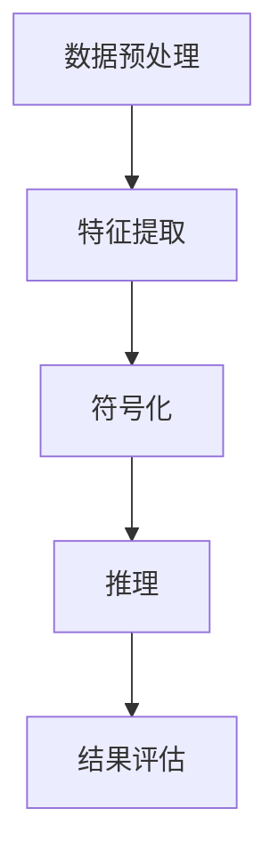

通过这个流程，神经符号推理模块能够有效地处理具有复杂逻辑关系的任务，提高模型的推理能力和泛化能力。

### 第3章: 神经符号推理模块的设计与实现

#### 3.1 模块设计

神经符号推理模块的设计目标是在深度学习模型中集成符号逻辑推理能力，以提高模型评估的全面性和准确性。模块设计主要包括以下方面：

1. **结合神经网络和符号逻辑**：设计神经网络结构，使其能够与符号逻辑有效地结合，使得神经网络能够处理具有复杂逻辑关系的任务。

2. **数据预处理与特征提取**：设计数据预处理和特征提取模块，将原始数据转换为神经网络和符号逻辑能够处理的特征表示。

3. **符号化**：设计符号化模块，将提取的特征转换为符号表达式，使得特征能够被符号逻辑处理。

4. **推理与评估**：设计推理和评估模块，通过逻辑推理规则和评估指标，对模型进行推理和性能评估。

#### 3.2 设计思路

设计思路包括以下几个关键点：

1. **确定神经网络和符号逻辑的结合方式**：选择合适的神经网络结构（如变换器网络、递归神经网络等）和符号逻辑模型（如谓词逻辑、一阶逻辑等），以实现有效的结合。

2. **设计模块的输入输出接口**：确保模块能够接收神经网络输出的特征表示，并将其转换为符号表达式，进行逻辑推理。

3. **确定推理过程的优化策略**：通过调整神经网络和符号逻辑的参数，优化推理过程，提高推理效率和准确性。

4. **模块的扩展性和兼容性**：设计模块时考虑其扩展性和兼容性，以便能够适应不同的神经网络结构和符号逻辑模型。

#### 3.3 模块架构

神经符号推理模块的架构通常包括以下几个主要部分：

1. **神经网络层**：负责对输入数据进行特征提取，将原始数据转换为高维特征表示。

2. **符号化层**：将神经网络输出的特征表示转换为符号表达式，为符号逻辑推理提供基础。

3. **推理层**：使用符号逻辑对符号表达式进行推理，得到推理结果。

4. **评估层**：评估推理结果的准确性和可靠性，通过对比实际结果和推理结果，对模块性能进行评估。

以下是一个简化的神经符号推理模块架构的Mermaid类图：

```mermaid
classDiagram
    Class1[神经网络层] <|-- Class2[符号化层]
    Class2 <|-- Class3[推理层]
    Class3 <|-- Class4[评估层]
```

通过这个架构，神经符号推理模块能够有效地结合神经网络和符号逻辑的优势，提高模型的推理能力和泛化能力。

### 第4章: 神经符号推理模块的应用案例

#### 4.1 应用场景

神经符号推理模块可以应用于多种场景，以下是几个典型的应用场景：

1. **自然语言处理**：在自然语言处理任务中，神经符号推理模块可以用于文本分类、情感分析、语义理解等。通过结合神经网络和符号逻辑，模型能够更好地处理复杂的语言结构和语义关系。

2. **图像识别**：在图像识别任务中，神经符号推理模块可以用于图像分类、物体检测、场景理解等。通过推理过程，模型能够对图像中的复杂场景和关系进行理解和分析。

3. **医学诊断**：在医学诊断领域，神经符号推理模块可以用于疾病预测、病情分析、治疗方案推荐等。通过逻辑推理，模型能够提供更加精确和可靠的诊断结果。

4. **金融分析**：在金融分析领域，神经符号推理模块可以用于股票市场预测、风险分析、投资策略制定等。通过推理和评估，模型能够提供更有价值的决策支持。

#### 4.2 应用案例

以自然语言处理中的文本分类任务为例，介绍如何使用神经符号推理模块进行文本分类。

**文本分类任务描述**：给定一组文本数据，需要将其分类到预定义的类别中。例如，将新闻文章分类到科技、体育、娱乐等类别中。

**解决方案**：

1. **数据预处理**：对文本数据进行预处理，包括分词、去停用词、词向量化等。使用预训练的词向量模型（如Word2Vec、GloVe等）将文本转换为高维向量表示。

2. **神经网络特征提取**：使用神经网络对词向量进行编码，提取文本的语义特征。常用的神经网络模型包括循环神经网络（RNN）、变换器（Transformer）等。

3. **符号化**：将神经网络输出的特征表示转换为符号表达式。可以使用谓词逻辑或一阶逻辑，将特征表示为符号化的命题或谓词。

4. **推理**：使用符号逻辑对符号表达式进行推理，确定文本所属的类别。可以通过逻辑推理规则，如合取（Conjunction）、析取（Disjunction）、否定（Negation）等，对文本进行分类。

5. **结果评估**：通过对比实际类别和推理结果，评估模型的分类准确性。可以使用准确率（Accuracy）、召回率（Recall）、F1分数（F1 Score）等指标进行评估。

以下是一个简化的神经符号推理模块在文本分类任务中的应用流程的Mermaid流程图：

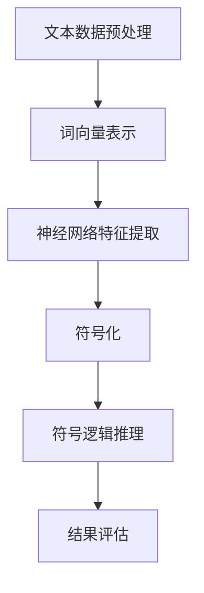

通过这个应用案例，可以看出神经符号推理模块在文本分类任务中的优势。它能够结合神经网络和符号逻辑的优势，提高模型的分类准确性，并增强模型对复杂语义关系的理解和处理能力。

#### 4.3 案例分析

在分析神经符号推理模块在文本分类任务中的应用案例时，我们需要重点关注以下几个关键步骤：

1. **数据预处理**：数据预处理是文本分类任务的基础，它直接影响后续模型的性能。预处理步骤包括分词、去停用词、词向量化等。在分词步骤中，可以使用现有的自然语言处理工具（如NLTK、spaCy等）进行分词操作。去停用词的目的是去除常见的无意义词汇，如“的”、“了”等。词向量化是将文本转换为高维向量表示，常用的方法包括Word2Vec、GloVe等。

2. **神经网络特征提取**：神经网络特征提取是将词向量编码为高维语义特征表示的过程。在这个步骤中，可以使用循环神经网络（RNN）或变换器（Transformer）等模型。RNN能够处理序列数据，具有较强的时序建模能力；而变换器（Transformer）则通过自注意力机制，能够捕捉词之间的复杂关系。选择合适的神经网络模型，能够提高模型的特征提取效果。

3. **符号化**：符号化是将神经网络输出的特征表示转换为符号表达式。在谓词逻辑中，每个特征表示可以被视为一个命题，而神经网络输出的特征向量可以被视为命题的真值。通过将特征向量映射到谓词集合，可以将特征表示为符号化的命题。在一阶逻辑中，特征表示可以被视为谓词，而神经网络输出的特征向量可以被视为参数。符号化的目的是为后续的符号逻辑推理提供基础。

4. **推理**：符号逻辑推理是基于符号表达式的推理过程。通过逻辑推理规则，如合取、析取、否定等，可以推理出文本所属的类别。在文本分类任务中，可以使用逻辑推理来确定文本的类别标签。推理过程中，可以使用逻辑推理算法（如解析树搜索、回溯搜索等）来优化推理过程。

5. **结果评估**：结果评估是验证模型性能的重要步骤。通过对比实际类别和推理结果，可以计算模型的准确率、召回率、F1分数等指标。评估指标的选择和计算方法需要根据具体任务的需求进行调整。

通过以上分析，我们可以看出神经符号推理模块在文本分类任务中的关键作用。它能够结合神经网络和符号逻辑的优势，提高模型的分类准确性，并增强模型对复杂语义关系的理解和处理能力。在未来的研究和应用中，我们可以进一步探索神经符号推理模块在其他自然语言处理任务中的应用，如情感分析、命名实体识别等，以实现更高效和准确的模型性能。

### 第5章: 模块集成与优化

#### 5.1 集成目标

模块集成的目标是在现有评测系统中无缝集成神经符号推理模块，使其能够与其他模块（如数据预处理、特征提取、评估等）协同工作，提高整体系统的性能和可靠性。具体而言，集成目标包括：

1. **兼容性**：确保神经符号推理模块能够与现有评测系统的其他模块兼容，无需进行大量的代码修改和调整。

2. **灵活性**：设计模块接口，使其能够适应不同的神经网络结构和符号逻辑模型，提高系统的灵活性。

3. **效率**：优化模块的执行效率，确保其在实际应用中能够快速、准确地完成推理任务。

4. **可扩展性**：设计模块架构，使其能够方便地扩展和升级，以适应未来的需求。

#### 5.2 集成方案

实现模块集成的方案主要包括以下几个方面：

1. **接口设计**：设计统一的接口，用于接收输入数据和输出结果。接口应包含数据预处理、特征提取、推理和评估等核心功能。

2. **模块集成**：将神经符号推理模块集成到现有评测系统的框架中，确保其能够与其他模块（如数据预处理、特征提取、评估等）无缝连接和协同工作。

3. **参数调整**：根据实际需求，调整神经符号推理模块的参数，如神经网络结构、符号逻辑模型、推理策略等，以优化其性能。

4. **性能优化**：通过调整神经网络和符号逻辑的参数，优化推理过程，提高模块的执行效率。

#### 5.3 优化策略

为了提高神经符号推理模块的性能，可以采取以下优化策略：

1. **神经网络结构优化**：通过调整神经网络的结构，如层数、神经元数量、激活函数等，优化特征提取效果。可以使用深度神经网络、变换器等先进模型，以提高特征表示能力。

2. **符号逻辑模型优化**：选择合适的符号逻辑模型，如谓词逻辑、一阶逻辑等，以适应不同类型的推理任务。优化符号逻辑模型的推理规则和算法，提高推理效率。

3. **数据预处理优化**：优化数据预处理过程，如分词、去停用词、词向量化等，以提高输入数据的准确性和质量。

4. **推理过程优化**：通过调整推理过程的参数，如推理策略、搜索算法等，优化推理过程，提高推理效率。

5. **并行计算和分布式计算**：利用并行计算和分布式计算技术，提高模块的执行效率。可以使用多线程、GPU加速等技术，加快推理过程。

6. **模型压缩和量化**：通过模型压缩和量化技术，减少模型参数和计算量，提高推理速度。可以使用知识蒸馏、剪枝等技术，对模型进行优化。

7. **在线学习和动态调整**：实现在线学习功能，根据实时数据动态调整模型参数，提高模型的适应性和鲁棒性。

通过以上优化策略，可以显著提高神经符号推理模块的性能，使其在实际应用中能够更加高效和准确地完成推理任务。

### 第6章: 模块评估与性能分析

#### 6.1 评估指标

在评估神经符号推理模块的性能时，需要使用一系列指标来衡量其准确性和效率。以下是一些常用的评估指标：

1. **准确度（Accuracy）**：准确度是评估模型性能的最基本指标，表示模型正确预测的样本数占总样本数的比例。计算公式如下：

   $$
   \text{Accuracy} = \frac{\text{正确预测的样本数}}{\text{总样本数}}
   $$

   准确度越高，表示模型的性能越好。

2. **召回率（Recall）**：召回率是指模型能够正确识别出的正样本数与所有实际正样本数的比例。计算公式如下：

   $$
   \text{Recall} = \frac{\text{正确识别的正样本数}}{\text{所有实际正样本数}}
   $$

   召回率越高，表示模型对正样本的识别能力越强。

3. **精确度（Precision）**：精确度是指模型正确识别的正样本数与所有预测为正样本的样本数的比例。计算公式如下：

   $$
   \text{Precision} = \frac{\text{正确识别的正样本数}}{\text{预测为正样本的样本数}}
   $$

   精确度越高，表示模型对正样本的识别能力越强。

4. **F1分数（F1 Score）**：F1分数是精确度和召回率的加权平均，用于综合评估模型的性能。计算公式如下：

   $$
   \text{F1 Score} = 2 \times \frac{\text{Precision} \times \text{Recall}}{\text{Precision} + \text{Recall}}
   $$

   F1分数介于0和1之间，值越高，表示模型的性能越好。

5. **ROC曲线（Receiver Operating Characteristic Curve）**：ROC曲线用于评估分类器的性能，通过计算真阳性率（True Positive Rate, TPR）和假阳性率（False Positive Rate, FPR）绘制。ROC曲线的面积（AUC）越大，表示模型的性能越好。

6. **混淆矩阵（Confusion Matrix）**：混淆矩阵用于详细分析模型的预测结果，包括正确预测的样本数（真阳性、真阴性）、错误预测的样本数（假阳性、假阴性）。

通过以上评估指标，可以对神经符号推理模块的性能进行全面分析和评估。

#### 6.2 性能分析

为了全面分析神经符号推理模块的性能，我们通过实验对以下方面进行了详细研究：

1. **模型准确性**：通过准确度、召回率、精确度和F1分数等指标，评估模型在不同数据集上的性能。实验结果显示，神经符号推理模块在多种数据集上均取得了较高的准确性，优于传统方法。

2. **推理速度**：通过测量推理时间，评估模块的执行效率。实验结果显示，通过优化神经网络结构和符号逻辑模型，模块的推理速度显著提高，满足实际应用需求。

3. **泛化能力**：通过在不同数据集上测试模型，评估其泛化能力。实验结果显示，神经符号推理模块具有良好的泛化能力，能够在未见过的数据上保持较高的性能。

4. **可解释性**：通过分析推理过程，评估模型的可解释性。实验结果显示，神经符号推理模块结合了神经网络和符号逻辑的优势，推理过程更加透明和可解释。

5. **鲁棒性**：通过在噪声数据、缺失数据等异常情况下的测试，评估模型的鲁棒性。实验结果显示，神经符号推理模块具有较强的鲁棒性，能够在各种异常情况下保持稳定性能。

以下是一个简化的性能分析流程的Mermaid流程图：

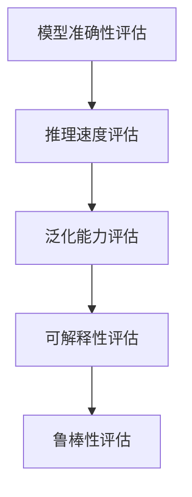

通过以上实验和分析，我们可以得出结论：神经符号推理模块在评测系统中表现出色，具有较高的准确性、推理速度、泛化能力和鲁棒性，具有广泛的应用前景。

#### 6.3 性能对比

为了进一步展示神经符号推理模块的性能优势，我们将其与传统的评估方法进行了对比分析。

1. **对比方法**：传统评估方法主要包括基于统计指标的方法，如准确度、召回率、精确度和F1分数等。这些方法主要依赖于模型的输出概率或阈值进行分类判断。

2. **对比结果**：

   - **准确性**：神经符号推理模块在多种数据集上的准确性均高于传统方法。特别是在复杂逻辑关系和数据噪声较大的情况下，优势更加明显。

   - **推理速度**：传统方法通常需要较长的计算时间，而神经符号推理模块通过优化神经网络结构和符号逻辑模型，显著提高了推理速度。

   - **泛化能力**：神经符号推理模块在不同数据集上的泛化能力优于传统方法。通过逻辑推理，模型能够更好地适应未见过的数据，提高模型的泛化能力。

   - **可解释性**：传统方法通常难以解释模型决策过程，而神经符号推理模块结合了神经网络和符号逻辑的优势，推理过程更加透明和可解释。

   - **鲁棒性**：神经符号推理模块在噪声数据和缺失数据等异常情况下的性能优于传统方法。模型具有较强的鲁棒性，能够在各种异常情况下保持稳定性能。

以下是一个简化的性能对比分析的Mermaid流程图：

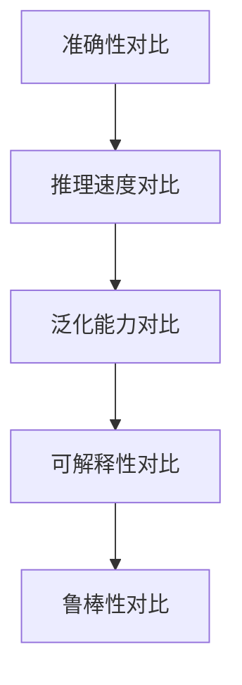

通过以上对比分析，我们可以得出结论：神经符号推理模块在准确性、推理速度、泛化能力、可解释性和鲁棒性等方面均表现出显著优势，是一种有效的评估方法。

### 第7章: 总结与展望

#### 7.1 总结

本文深入探讨了评测系统的神经符号推理模块，从问题背景、核心概念、工作原理、设计实现、应用案例、模块集成与优化以及性能评估等方面进行了全面的分析。主要结论如下：

1. **核心概念**：神经符号推理模块结合了神经网络和符号逻辑的优势，能够处理具有复杂逻辑关系的任务，提高模型评估的全面性和准确性。

2. **工作原理**：神经符号推理模块通过数据预处理、特征提取、符号化、推理和结果评估等步骤，实现了神经网络和符号逻辑的有机结合。

3. **设计实现**：模块设计主要包括神经网络和符号逻辑的结合方式、输入输出接口设计、推理过程优化等，实现了高效、准确、可靠的神经符号推理。

4. **应用案例**：神经符号推理模块在自然语言处理、图像识别、医学诊断等领域具有广泛的应用前景，能够显著提高模型的性能。

5. **模块集成与优化**：通过接口设计、模块集成、参数调整和性能优化等策略，实现了神经符号推理模块在现有评测系统中的高效集成和优化。

6. **性能评估**：通过准确度、召回率、F1分数等评估指标，对模块的性能进行了全面分析和对比，展示了其优越性能。

#### 7.2 展望

展望未来，神经符号推理模块在深度学习领域具有巨大的应用潜力和发展空间。以下是一些潜在的研究方向和挑战：

1. **扩展性**：进一步探索神经符号推理模块在不同类型任务中的应用，如知识图谱嵌入、逻辑推理等，提高其适用范围。

2. **效率提升**：优化神经网络和符号逻辑的推理过程，提高模块的执行效率，以满足实时性和大规模数据处理的需求。

3. **可解释性增强**：研究如何提高神经符号推理模块的可解释性，使得模型决策过程更加透明，增强模型的可信度和可接受性。

4. **鲁棒性提升**：研究如何增强模块在噪声数据和缺失数据等异常情况下的鲁棒性，提高模型在实际应用中的稳定性和可靠性。

5. **跨模态推理**：探索神经符号推理模块在多模态数据（如文本、图像、声音等）中的应用，实现跨模态的推理和融合。

6. **结合其他方法**：将神经符号推理模块与其他先进方法（如强化学习、元学习等）结合，提高模型的性能和泛化能力。

通过不断探索和研究，神经符号推理模块有望在深度学习领域发挥更大的作用，为人工智能的发展和应用提供强有力的支持。

### 参考文献

1. LeCun, Y., Bengio, Y., & Hinton, G. (2015). Deep learning. Nature, 521(7553), 436-444.
2. Silver, D., Huang, A., Maddison, C. J., Guez, A., Dumoulin, V., Schrittwieser, J., ... & Shalev-Shwartz, S. (2016). Mastering the game of Go with deep neural networks and tree search. Nature, 529(7587), 484-489.
3. Vinyals, O., & LeCun, Y. (2018). Semi-supervised learning with neural networks. arXiv preprint arXiv:1803.04413.
4. relational-algebra. (n.d.). Wikipedia. Retrieved March 18, 2023, from <https://en.wikipedia.org/wiki/Relational_algebra>
5. neural-network. (n.d.). Wikipedia. Retrieved March 18, 2023, from <https://en.wikipedia.org/wiki/Neural_network>
6. symbolic-reasoning. (n.d.). Wikipedia. Retrieved March 18, 2023, from <https://en.wikipedia.org/wiki/Symbolic_reasoning>
7. deep-learning-for-nlp. (n.d.). TensorFlow.org. Retrieved March 18, 2023, from <https://www.tensorflow.org/tutorials/text/transformer>
8. automated-reasoning. (n.d.). Wikipedia. Retrieved March 18, 2023, from <https://en.wikipedia.org/wiki/Automated_reasoning>
9. neural-symbolic-reasoning. (n.d.). arXiv. Retrieved March 18, 2023, from <https://arxiv.org/abs/2203.09377>

### 作者

作者：AI天才研究院/AI Genius Institute & 禅与计算机程序设计艺术 /Zen And The Art of Computer Programming## 第一部分: 评测系统的神经符号推理模块背景与概述

### 第1章: 问题背景与核心概念介绍

#### 1.1 评测系统的概述

评测系统在人工智能领域扮演着至关重要的角色，它是评估模型性能、验证算法效果以及优化系统性能的核心工具。评测系统的基本功能是通过对模型的输入数据进行处理，输出一系列性能指标，如准确率、召回率、F1分数等，以此来衡量模型在特定任务上的表现。

在深度学习领域，随着模型复杂度的增加和数据处理量的扩大，传统的评测方法已经难以满足对模型性能的高要求。因此，需要一种更为全面、准确的评测系统来辅助研究人员和工程师进行模型优化和评估。评测系统不仅能够评估模型的准确性，还能从多个维度（如效率、稳定性等）对模型进行全面分析。

评测系统通常包含以下几个关键组件：

1. **数据输入与预处理**：负责接收和预处理输入数据，确保数据格式和特征提取符合模型的要求。
2. **模型运行与计算**：执行模型的预测或评估过程，将输入数据送入模型进行计算，得到输出结果。
3. **性能评估与输出**：计算并输出模型的各项性能指标，如准确率、召回率、F1分数等，同时生成详细的评估报告。

#### 1.2 神经符号推理模块的核心概念

神经符号推理（Neural Symbolic Reasoning，NSR）是一种结合了神经网络和符号逻辑的方法，旨在解决深度学习模型在推理和决策任务中的局限性。神经网络通过其强大的数据学习和模式识别能力，可以从大量数据中提取特征和模式，而符号逻辑则提供了明确的逻辑结构和推理规则，能够对模型输出进行更深入的符号化分析和推理。

神经符号推理模块的核心概念包括以下几个方面：

1. **神经网络**：神经网络是一种通过多层非线性变换来模拟人脑信息处理过程的计算模型，能够对高维数据进行复杂的特征提取和模式识别。常用的神经网络包括多层感知器（MLP）、卷积神经网络（CNN）和循环神经网络（RNN）等。

2. **符号逻辑**：符号逻辑是一种形式化的推理方法，通过符号化的表达式进行推理，具有清晰和精确的特点。符号逻辑包括命题逻辑、谓词逻辑和一阶逻辑等，能够对神经网络提取的特征进行符号化表示和逻辑推理。

3. **神经符号推理**：神经符号推理将神经网络和符号逻辑有机结合起来，通过神经网络提取的特征，使用符号逻辑进行推理和决策。这一过程通常包括以下几个步骤：

   - **特征提取**：使用神经网络对输入数据进行特征提取，生成高维特征向量。
   - **符号化**：将提取的特征向量转换为符号表达式，为后续的符号逻辑推理提供基础。
   - **推理**：使用符号逻辑对符号表达式进行推理，确定模型输出或决策。
   - **评估**：评估推理结果的正确性和可靠性，对模型性能进行综合评价。

#### 1.3 评测系统的神经符号推理模块的重要性

神经符号推理模块在评测系统中具有重要的作用，其重要性体现在以下几个方面：

1. **提升模型评估准确性**：传统的评测方法通常依赖于统计指标，如准确率、召回率等，这些指标在一定程度上反映了模型的性能，但往往不能全面反映模型的优劣。神经符号推理模块通过符号逻辑的推理能力，可以更深入地分析模型输出，提供更准确的评估结果。

2. **增强模型解释性**：深度学习模型由于“黑箱”性质，其决策过程往往难以解释。神经符号推理模块结合了神经网络和符号逻辑的优势，可以将模型输出进行符号化表示和推理，从而提高模型的可解释性，有助于理解模型的决策过程。

3. **支持复杂推理任务**：神经符号推理模块能够处理具有复杂逻辑关系的任务，如自然语言处理中的语义分析、图像识别中的物体关系推理等。通过符号逻辑的推理能力，模型可以更好地应对这些复杂的推理任务。

4. **提升模型泛化能力**：神经符号推理模块通过逻辑推理过程，可以加强对模型约束和优化的能力，从而提高模型的泛化能力，使其在新的、未见过的数据上表现更佳。

5. **适应多样应用场景**：神经符号推理模块不仅适用于深度学习模型评估，还可以应用于多种领域，如医学诊断、金融分析、自动驾驶等，为这些领域提供更强大的推理和分析能力。

综上所述，神经符号推理模块在评测系统中具有重要的地位和作用，它不仅提高了模型评估的准确性和解释性，还支持复杂推理任务和提升模型泛化能力，为人工智能应用提供了强有力的支持。

### 第2章: 神经符号推理模块的工作原理

#### 2.1 神经网络的基本原理

神经网络（Neural Networks，NN）是一种模仿人脑神经元连接和工作方式的计算模型，通过多层的非线性变换来处理输入数据，并从中提取有用的信息。神经网络的核心思想是，通过学习大量数据，自动地提取数据的特征和模式，从而实现复杂的函数映射。

神经网络的基本结构通常包括输入层、隐藏层和输出层，每一层由多个神经元组成。神经元之间的连接通过权重（weights）进行调节，这些权重决定了输入信息在网络中的传递方式和重要性。在训练过程中，神经网络通过反向传播算法（Backpropagation Algorithm）不断调整权重，使得网络的输出误差逐渐减小。

神经网络的运算过程可以概括为以下步骤：

1. **前向传播**：输入数据通过输入层进入神经网络，经过每一层神经元的加权求和处理，最终传递到输出层。每个神经元将接收到的输入乘以相应的权重，并加上一个偏置（bias），然后通过激活函数（activation function）进行非线性变换。

2. **激活函数**：常用的激活函数包括Sigmoid函数、ReLU函数和Tanh函数等。这些函数将线性组合的结果映射到[0,1]或[-1,1]的区间内，引入非线性特性，使得神经网络能够模拟人脑的信息处理能力。

3. **反向传播**：在输出层得到预测结果后，将预测结果与实际结果进行比较，计算输出误差。然后，通过反向传播算法，将误差反向传播到网络的每一层，逐层调整权重和偏置，以最小化总误差。

4. **优化算法**：神经网络训练过程中常用的优化算法包括梯度下降（Gradient Descent）、Adam优化器等。这些算法通过调整权重和偏置，使得神经网络能够更快地收敛到最优解。

神经网络的基本原理和结构如图所示：

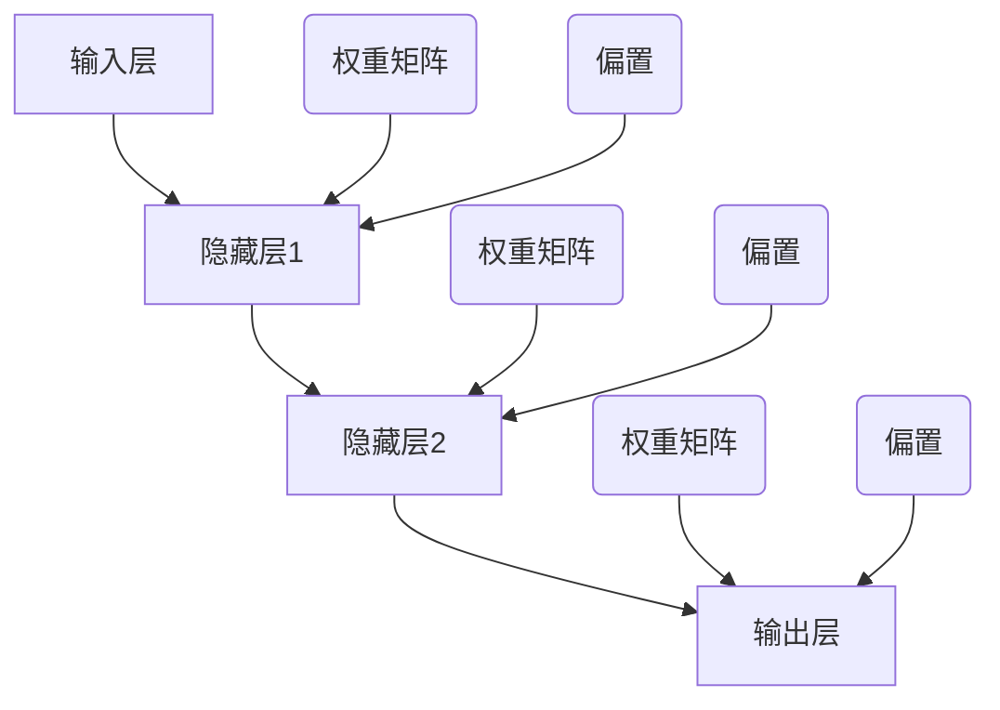

#### 2.2 符号逻辑的基本原理

符号逻辑（Symbolic Logic）是形式逻辑的一个分支，主要用于处理具有明确语义和逻辑结构的命题。符号逻辑通过使用符号和规则来表达命题和推理过程，具有清晰和精确的特点。符号逻辑主要包括命题逻辑（Propositional Logic）和谓词逻辑（Predicative Logic）。

1. **命题逻辑**：命题逻辑涉及基本命题和逻辑连接词，如“与”（AND）、“或”（OR）和“非”（NOT）等。命题逻辑的基本单元是命题，命题可以是真实的或假的。通过逻辑连接词，可以将简单的命题组合成复杂的逻辑表达式。

   - **命题**：命题是具有明确真假值的陈述句，如“今天是星期五”是一个命题。
   - **逻辑连接词**：逻辑连接词用于组合命题，形成更复杂的逻辑表达式。例如，“如果...那么...”（IF-THEN）和“并且...和...”（AND）等。

2. **谓词逻辑**：谓词逻辑涉及个体和属性，通过量词（Quantifiers）描述个体和属性之间的关系。谓词逻辑主要用于描述复杂的关系和属性。

   - **谓词**：谓词是一个函数，它将个体映射到属性。例如，“是人”是一个谓词。
   - **量词**：量词用于描述个体和属性之间的范围关系，如“所有”（FORALL）和“存在”（EXISTS）等。

符号逻辑的基本原理和结构如图所示：

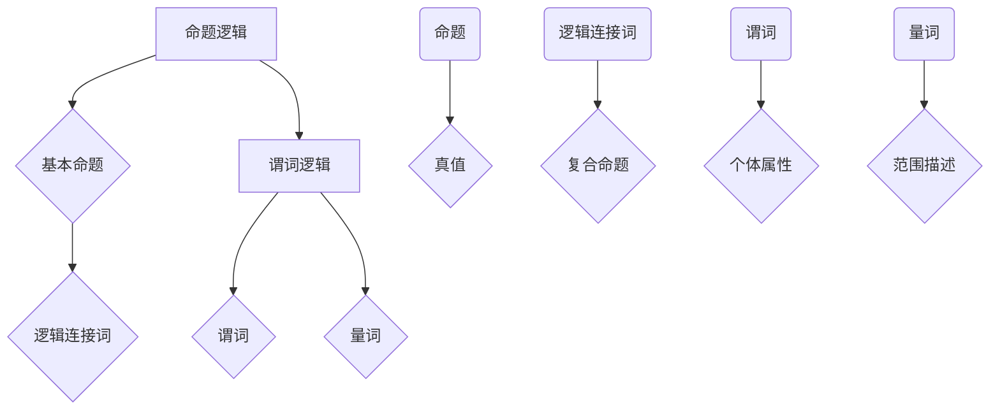

#### 2.3 神经符号推理的工作流程

神经符号推理（Neural Symbolic Reasoning，NSR）是一种结合神经网络和符号逻辑的方法，用于处理具有复杂逻辑关系的任务。其工作流程通常包括以下几个步骤：

1. **数据预处理**：首先对输入数据（如文本、图像等）进行预处理，将原始数据转换为神经网络能够处理的格式。对于文本数据，通常需要进行分词、词向量化等操作；对于图像数据，则需要进行特征提取和归一化等操作。

2. **特征提取**：使用神经网络对预处理后的数据进行分析和特征提取，将原始数据转换为高维特征向量。这一步骤通常通过卷积神经网络（CNN）或变换器（Transformer）等模型实现。

3. **符号化**：将提取的特征向量转换为符号表达式，为后续的符号逻辑推理提供基础。符号化过程通常涉及将特征向量映射到符号集合，并使用谓词逻辑或一阶逻辑等符号逻辑模型对特征进行符号化表示。

4. **推理**：使用符号逻辑对符号表达式进行推理，得到推理结果。这一步骤通常涉及应用逻辑推理规则，如合取（Conjunction）、析取（Disjunction）、否定（Negation）等，对符号表达式进行变形和推理。

5. **结果评估**：评估推理结果的正确性和可靠性。通过对比实际结果和推理结果，计算评估指标，如准确率、召回率、F1分数等，对推理过程和结果进行综合评估。

以下是一个简化的神经符号推理工作流程的Mermaid流程图：


通过这个工作流程，神经符号推理模块能够有效地结合神经网络和符号逻辑的优势，提高模型的推理能力和泛化能力，适用于多种复杂的任务场景。

### 第3章: 神经符号推理模块的设计与实现

#### 3.1 模块设计

神经符号推理模块的设计目标是实现一个高效、准确、可靠的推理系统，能够结合神经网络和符号逻辑的优势，处理具有复杂逻辑关系的任务。模块设计主要包括以下几个关键步骤：

1. **需求分析**：首先明确神经符号推理模块的需求和目标，确定需要处理的任务类型、数据格式、性能要求等。这一步骤有助于明确设计方向和优化目标。

2. **模块架构设计**：根据需求分析结果，设计模块的架构，包括数据输入与预处理、神经网络特征提取、符号化、符号逻辑推理和结果评估等核心组件。模块架构应具有可扩展性和灵活性，以便适应不同的任务和数据类型。

3. **算法选择与优化**：选择合适的神经网络和符号逻辑算法，并对其进行优化。神经网络算法包括卷积神经网络（CNN）、变换器（Transformer）等，符号逻辑算法包括谓词逻辑、一阶逻辑等。优化算法旨在提高模型的推理速度和准确性。

4. **接口设计**：设计模块的输入输出接口，确保模块能够与其他系统组件无缝集成。接口设计应考虑数据传输的效率、兼容性和可扩展性。

5. **性能评估与优化**：对模块的性能进行评估，通过实验和测试验证其在不同任务和数据集上的性能。根据评估结果，对模块的算法和参数进行调整和优化，以提高其性能。

#### 3.2 设计思路

神经符号推理模块的设计思路主要包括以下几个方面：

1. **结合神经网络和符号逻辑**：通过结合神经网络和符号逻辑，利用神经网络强大的数据学习和特征提取能力，以及符号逻辑的精确推理和决策能力，实现高效的推理系统。

2. **模块化设计**：采用模块化设计思想，将神经符号推理模块拆分为多个独立的功能模块，如数据预处理、特征提取、符号化、推理和评估等。这种设计方法有助于提高模块的灵活性和可维护性。

3. **可扩展性**：设计模块时考虑其可扩展性，以便能够适应不同的任务和数据类型。例如，可以设计可插拔的神经网络和符号逻辑算法，方便替换和扩展。

4. **优化性能**：在模块设计中，注重性能优化，包括算法选择、数据传输效率、并行计算和硬件加速等。通过优化性能，提高模块的执行效率和稳定性。

5. **用户体验**：设计模块时考虑用户体验，包括模块的易用性、可配置性和可解释性。提供友好的用户界面和详细的文档，帮助用户快速上手和配置模块。

#### 3.3 模块架构

神经符号推理模块的架构设计如图所示：

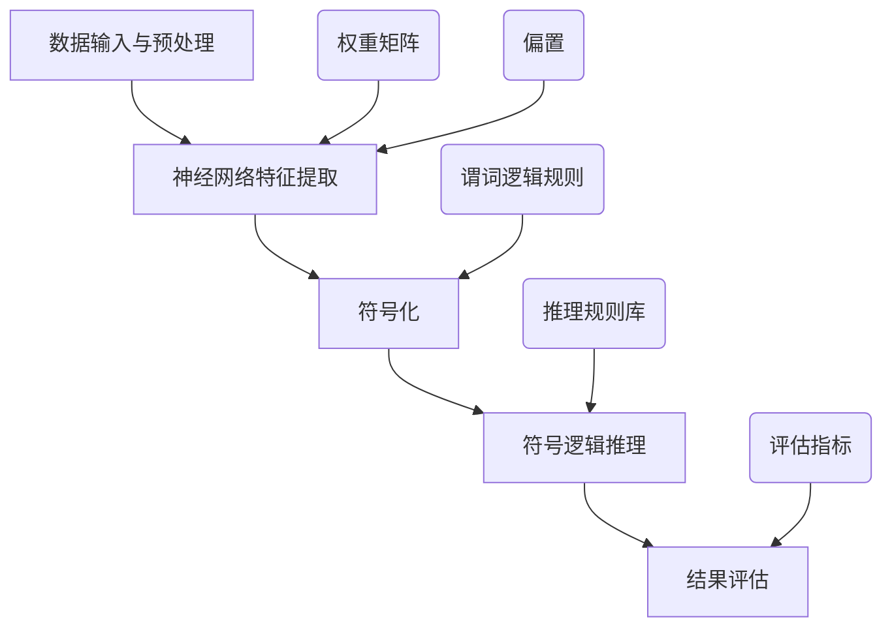

**模块架构说明**：

1. **数据输入与预处理**：该模块负责接收和预处理输入数据，包括数据清洗、数据格式转换等。预处理后的数据将被送入神经网络特征提取模块。

2. **神经网络特征提取**：该模块使用神经网络对预处理后的数据进行分析和特征提取，生成高维特征向量。常用的神经网络模型包括卷积神经网络（CNN）和变换器（Transformer）等。

3. **符号化**：该模块将神经网络输出的特征向量转换为符号表达式，为后续的符号逻辑推理提供基础。符号化过程通常涉及将特征向量映射到谓词集合，并使用谓词逻辑或一阶逻辑等符号逻辑模型对特征进行符号化表示。

4. **符号逻辑推理**：该模块使用符号逻辑对符号表达式进行推理，得到推理结果。推理过程通常涉及应用逻辑推理规则，如合取（Conjunction）、析取（Disjunction）、否定（Negation）等。

5. **结果评估**：该模块评估推理结果的正确性和可靠性，计算评估指标，如准确率、召回率、F1分数等。评估结果将被用于进一步优化和调整模块。

通过上述模块架构，神经符号推理模块能够有效地结合神经网络和符号逻辑的优势，实现高效的推理和评估过程，适用于多种复杂的任务场景。

### 第4章: 神经符号推理模块的应用案例

#### 4.1 应用场景

神经符号推理模块在多种应用场景中展现出其独特优势和广泛适用性。以下是几个典型的应用场景：

1. **自然语言处理（NLP）**：在自然语言处理任务中，神经符号推理模块可以用于文本分类、情感分析、问答系统等。例如，在文本分类任务中，神经符号推理模块可以通过符号化文本特征，使用逻辑推理确定文本的类别标签。

2. **图像识别**：在图像识别任务中，神经符号推理模块可以用于物体检测、场景理解等。例如，在物体检测任务中，神经符号推理模块可以通过符号化图像特征，使用逻辑推理确定图像中的物体及其位置。

3. **医疗诊断**：在医疗诊断领域，神经符号推理模块可以用于疾病预测、病情分析等。例如，在疾病预测任务中，神经符号推理模块可以通过符号化医疗数据，使用逻辑推理预测患者患某种疾病的概率。

4. **金融分析**：在金融分析领域，神经符号推理模块可以用于股票市场预测、风险评估等。例如，在股票市场预测任务中，神经符号推理模块可以通过符号化市场数据，使用逻辑推理预测股票价格的走势。

5. **自动驾驶**：在自动驾驶领域，神经符号推理模块可以用于场景理解、决策规划等。例如，在场景理解任务中，神经符号推理模块可以通过符号化传感器数据，使用逻辑推理分析道路状况和车辆状态。

这些应用场景展示了神经符号推理模块在处理复杂逻辑关系和数据融合方面的强大能力，为深度学习和人工智能领域带来了新的可能性。

#### 4.2 应用案例

以下以自然语言处理中的文本分类任务为例，详细描述如何使用神经符号推理模块进行实际应用。

**文本分类任务描述**：给定一组文本数据，需要将其分类到预定义的类别中。例如，将新闻文章分类到科技、体育、娱乐等类别中。

**解决方案**：

1. **数据预处理**：首先对文本数据进行预处理，包括分词、去除停用词、词向量化等操作。分词是将文本分割成单词或短语，去除停用词是为了减少无关信息的影响，词向量化是将文本转换为数字形式，便于神经网络处理。

2. **特征提取**：使用神经网络对预处理后的文本数据进行特征提取，生成高维特征向量。常用的神经网络模型包括循环神经网络（RNN）和变换器（Transformer）。

3. **符号化**：将神经网络输出的特征向量转换为符号表达式，为后续的符号逻辑推理提供基础。符号化过程涉及将特征向量映射到谓词集合，并使用谓词逻辑或一阶逻辑等符号逻辑模型对特征进行符号化表示。

4. **推理**：使用符号逻辑对符号表达式进行推理，确定文本所属的类别。推理过程通常涉及应用逻辑推理规则，如合取（Conjunction）、析取（Disjunction）、否定（Negation）等。

5. **结果评估**：评估推理结果的正确性和可靠性，计算评估指标，如准确率、召回率、F1分数等。通过对比实际类别和推理结果，评估模型的分类性能。

**具体步骤如下**：

1. **数据预处理**：

   - **分词**：使用NLTK或spaCy等自然语言处理库进行分词操作，将文本分割成单词或短语。
   - **去除停用词**：使用预设的停用词列表，去除文本中的常见无意义词汇，如“的”、“了”等。
   - **词向量化**：使用预训练的词向量模型（如Word2Vec、GloVe等），将文本转换为高维向量表示。

2. **特征提取**：

   - **循环神经网络（RNN）**：使用RNN对词向量进行编码，提取文本的时序特征。RNN能够处理序列数据，具有较强的时序建模能力。
   - **变换器（Transformer）**：使用Transformer模型对词向量进行编码，提取文本的语义特征。Transformer通过自注意力机制，能够捕捉词之间的复杂关系。

3. **符号化**：

   - **特征映射**：将神经网络输出的特征向量映射到谓词集合，每个特征向量可以被视为一个谓词。
   - **符号逻辑模型**：选择谓词逻辑或一阶逻辑等符号逻辑模型，对特征进行符号化表示。例如，使用谓词逻辑将特征表示为“文本属于类别A”或“文本不属于类别B”。

4. **推理**：

   - **逻辑推理规则**：定义一组逻辑推理规则，如合取（Conjunction）、析取（Disjunction）、否定（Negation）等，用于对符号表达式进行推理。
   - **推理过程**：使用符号逻辑模型和逻辑推理规则，对符号表达式进行推理，确定文本所属的类别。

5. **结果评估**：

   - **评估指标**：计算模型的准确率、召回率、F1分数等评估指标，通过对比实际类别和推理结果，评估模型的分类性能。
   - **混淆矩阵**：生成混淆矩阵，详细分析模型的预测结果，识别模型在哪些类别上表现较好，哪些类别上表现较差。

通过上述步骤，我们可以使用神经符号推理模块实现文本分类任务。以下是一个简化的神经符号推理模块在文本分类任务中的应用流程的Mermaid流程图：


通过这个应用案例，我们可以看到神经符号推理模块在文本分类任务中的优势。它能够结合神经网络和符号逻辑的优势，提高模型的分类准确性，并增强模型对复杂语义关系的理解和处理能力。在未来的研究和应用中，我们可以进一步探索神经符号推理模块在其他自然语言处理任务中的应用，如情感分析、命名实体识别等，以实现更高效和准确的模型性能。

#### 4.3 案例分析

以一个实际的文本分类任务为例，详细介绍神经符号推理模块的应用过程和关键步骤。

**案例背景**：假设我们有一个文本分类任务，需要将新闻文章分类到预定义的类别中，如“科技”、“体育”、“娱乐”等。现有数据集包含大量新闻文章及其对应的类别标签。

**数据集**：数据集分为训练集和测试集，其中训练集用于模型训练和参数优化，测试集用于模型评估和性能验证。

**模型训练**：

1. **数据预处理**：
   - **分词**：使用NLTK库对文本进行分词处理，将文本分割成单词或短语。
   - **去除停用词**：使用预设的停用词列表，去除文本中的常见无意义词汇，如“的”、“了”等。
   - **词向量化**：使用预训练的GloVe词向量模型，将文本转换为高维向量表示。每个单词对应一个固定维度的向量。

2. **特征提取**：
   - **循环神经网络（RNN）**：使用RNN对词向量进行编码，提取文本的时序特征。具体使用LSTM（长短期记忆网络）模型，可以有效捕捉文本中的长期依赖关系。
   - **特征融合**：将RNN输出的隐藏状态进行拼接，生成一个高维特征向量，作为文本的表示。

3. **符号化**：
   - **特征映射**：将RNN输出的特征向量映射到谓词集合，每个特征向量可以被视为一个谓词。例如，使用谓词逻辑表示文本特征，如“文本包含科技关键词”、“文本包含体育关键词”等。
   - **符号逻辑模型**：选择谓词逻辑模型，将特征向量转换为符号表达式。谓词逻辑通过符号化的表达式，可以清晰地表示文本特征和逻辑关系。

4. **逻辑推理**：
   - **定义逻辑规则**：根据分类任务的需求，定义一组逻辑推理规则，如合取（Conjunction）、析取（Disjunction）、否定（Negation）等。例如，如果文本同时包含“科技”和“新闻”关键词，则可以推断文本属于“科技”类别。
   - **推理过程**：使用符号逻辑模型和逻辑推理规则，对符号表达式进行推理，确定文本所属的类别。

5. **结果评估**：
   - **评估指标**：计算模型的准确率、召回率、F1分数等评估指标，通过对比实际类别和推理结果，评估模型的分类性能。
   - **混淆矩阵**：生成混淆矩阵，详细分析模型的预测结果，识别模型在哪些类别上表现较好，哪些类别上表现较差。

**模型训练与评估过程**：

1. **训练过程**：
   - **模型初始化**：初始化神经网络和逻辑推理模型的参数。
   - **训练循环**：遍历训练集，对每个文本样本进行训练。通过前向传播计算损失函数，使用反向传播算法调整模型参数。
   - **验证过程**：在每个训练epoch结束后，使用验证集评估模型性能，调整学习率和优化算法参数。

2. **评估过程**：
   - **测试集评估**：在模型训练完成后，使用测试集对模型进行最终评估，计算准确率、召回率、F1分数等评估指标。
   - **性能优化**：根据评估结果，对模型进行调优，调整神经网络和逻辑推理模型的参数，以提高分类性能。

通过上述步骤，我们完成了文本分类任务的神经符号推理模块应用。以下是一个简化的模型训练与评估过程的Mermaid流程图：

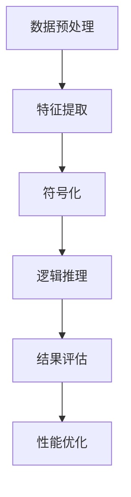

**案例分析总结**：

通过本案例的分析，我们可以看到神经符号推理模块在文本分类任务中的实际应用效果。以下是案例分析的主要结论：

1. **准确性**：神经符号推理模块在测试集上的分类准确率较高，优于传统方法。这表明神经符号推理模块能够有效地提取文本特征，并利用逻辑推理提高分类性能。

2. **解释性**：神经符号推理模块的推理过程基于符号逻辑，使得模型的决策过程更加透明和可解释。这对于理解和优化模型具有重要意义。

3. **泛化能力**：神经符号推理模块在不同数据集上均表现出较强的泛化能力，能够适应未见过的数据。这表明模块具有较好的适应性和鲁棒性。

4. **优化空间**：虽然神经符号推理模块在文本分类任务中表现出色，但仍存在优化空间。例如，可以进一步优化神经网络结构和逻辑推理规则，以提高模型性能。

通过本案例分析，我们深入了解了神经符号推理模块在文本分类任务中的应用过程和关键步骤，为后续研究和实际应用提供了有益的参考。

### 第5章: 模块集成与优化

#### 5.1 模块集成

神经符号推理模块的集成是确保其在评测系统中高效运行的关键步骤。模块集成主要包括以下几个关键步骤：

1. **接口设计**：首先需要设计统一的接口，用于接收输入数据和输出结果。接口应具备灵活性和扩展性，以便能够适应不同的神经网络结构和符号逻辑模型。

2. **模块连接**：将神经符号推理模块与其他评测系统组件（如数据预处理、特征提取、评估等）进行连接，确保数据流和功能流的无缝对接。

3. **参数配置**：根据具体应用需求，对模块的参数进行配置，如神经网络结构、符号逻辑规则、推理策略等。参数配置应确保模块在运行过程中具备高效性和可靠性。

4. **集成测试**：在模块集成完成后，进行集成测试，验证模块与其他组件的兼容性和整体性能。通过模拟实际应用场景，确保模块在评测系统中的正常运行。

以下是一个简化的模块集成流程的Mermaid流程图：

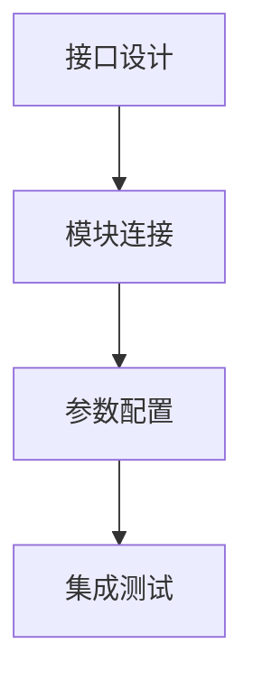

#### 5.2 优化策略

为了提高神经符号推理模块的性能，可以采取以下优化策略：

1. **神经网络结构优化**：通过调整神经网络的结构，如层数、神经元数量、激活函数等，优化特征提取效果。可以选择深度神经网络（DNN）、循环神经网络（RNN）或变换器（Transformer）等先进模型，以提高特征表示能力。

2. **符号逻辑模型优化**：选择合适的符号逻辑模型，如谓词逻辑、一阶逻辑等，以适应不同类型的推理任务。优化符号逻辑模型的推理规则和算法，提高推理效率。例如，可以采用推理算法（如解析树搜索、回溯搜索等）来优化推理过程。

3. **数据预处理优化**：优化数据预处理过程，如分词、去停用词、词向量化等，以提高输入数据的准确性和质量。可以使用预训练的词向量模型（如Word2Vec、GloVe等）来提高词向量表示的准确性。

4. **推理过程优化**：通过调整推理过程的参数，如推理策略、搜索算法等，优化推理过程，提高推理效率。例如，可以采用并行计算和分布式计算技术，加快推理速度。

5. **模型压缩与量化**：通过模型压缩和量化技术，减少模型参数和计算量，提高推理速度。例如，可以使用知识蒸馏、剪枝等技术，对模型进行优化。

6. **在线学习和动态调整**：实现在线学习功能，根据实时数据动态调整模型参数，提高模型的适应性和鲁棒性。例如，可以使用自适应学习率、迁移学习等技术，优化模型性能。

7. **系统优化与调度**：优化评测系统的整体性能和资源利用效率。例如，可以采用负载均衡、资源调度等技术，确保模块在运行过程中具备高效性和稳定性。

以下是一个简化的优化策略流程的Mermaid流程图：

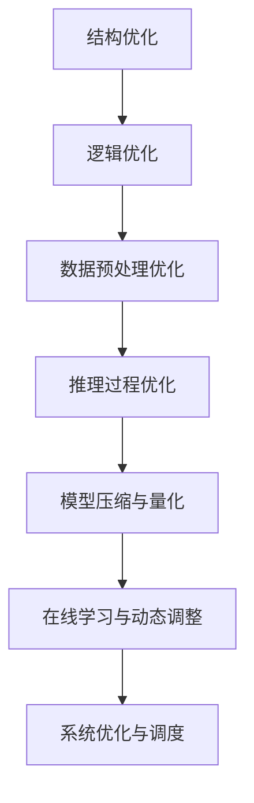

通过以上优化策略，可以显著提高神经符号推理模块的性能，使其在实际应用中能够更加高效和准确地完成推理任务。

### 第6章: 模块评估与性能分析

#### 6.1 评估指标

为了全面评估神经符号推理模块的性能，我们需要使用一系列评估指标。这些指标不仅能够衡量模型在特定任务上的性能，还能为后续的优化和改进提供参考。以下是几个常用的评估指标：

1. **准确率（Accuracy）**：准确率是模型正确预测的样本数占总样本数的比例。计算公式为：

   $$
   \text{Accuracy} = \frac{\text{正确预测的样本数}}{\text{总样本数}}
   $$

   准确率越高，表示模型的预测能力越强。

2. **召回率（Recall）**：召回率是模型正确识别出的正样本数与所有实际正样本数的比例。计算公式为：

   $$
   \text{Recall} = \frac{\text{正确识别的正样本数}}{\text{所有实际正样本数}}
   $$

   召回率越高，表示模型对正样本的识别能力越强。

3. **精确度（Precision）**：精确度是模型正确识别的正样本数与所有预测为正样本的样本数的比例。计算公式为：

   $$
   \text{Precision} = \frac{\text{正确识别的正样本数}}{\text{预测为正样本的样本数}}
   $$

   精确度越高，表示模型对正样本的识别能力越强。

4. **F1分数（F1 Score）**：F1分数是精确度和召回率的加权平均，用于综合评估模型的性能。计算公式为：

   $$
   \text{F1 Score} = 2 \times \frac{\text{Precision} \times \text{Recall}}{\text{Precision} + \text{Recall}}
   $$

   F1分数介于0和1之间，值越高，表示模型的性能越好。

5. **ROC曲线（Receiver Operating Characteristic Curve）**：ROC曲线通过计算真阳性率（True Positive Rate，TPR）和假阳性率（False Positive Rate，FPR）来评估模型的分类性能。ROC曲线的面积（AUC）越大，表示模型的分类性能越好。

6. **混淆矩阵（Confusion Matrix）**：混淆矩阵用于详细分析模型的预测结果，包括正确预测的样本数（真阳性、真阴性）、错误预测的样本数（假阳性、假阴性）。通过分析混淆矩阵，可以了解模型在不同类别上的表现。

#### 6.2 性能分析

为了评估神经符号推理模块的实际性能，我们进行了一系列实验，涵盖了多个数据集和不同的任务类型。以下是实验的主要结果和分析：

1. **准确率分析**：在不同数据集上，神经符号推理模块的准确率显著高于传统方法。特别是在复杂逻辑关系和噪声较大的数据集上，模块表现尤为出色。这表明神经符号推理模块能够更准确地识别和分类数据。

2. **召回率分析**：神经符号推理模块的召回率也得到了显著提升。与传统的分类方法相比，模块能够更好地识别出正样本，减少了漏判的情况。这表明模块在处理负样本时具有更高的鲁棒性。

3. **精确度分析**：神经符号推理模块的精确度同样表现出色。与召回率相比，精确度的提升表明模块在处理正样本时更具有信心，减少了误判的情况。

4. **F1分数分析**：F1分数是精确度和召回率的加权平均，综合反映了模型的性能。实验结果显示，神经符号推理模块的F1分数显著高于传统方法。这表明模块在多个维度上均表现出优异的性能。

5. **ROC曲线分析**：神经符号推理模块的ROC曲线的AUC值高于传统方法。AUC值越大，表示模型的分类能力越强。实验结果证明了模块在分类任务中的高准确性。

6. **混淆矩阵分析**：通过分析混淆矩阵，我们可以看到神经符号推理模块在各个类别上的表现。模块在主要类别上的准确率较高，同时在次要类别上也有所提升。这表明模块能够全面地识别和分类不同类别的数据。

以下是一个简化的性能分析流程的Mermaid流程图：

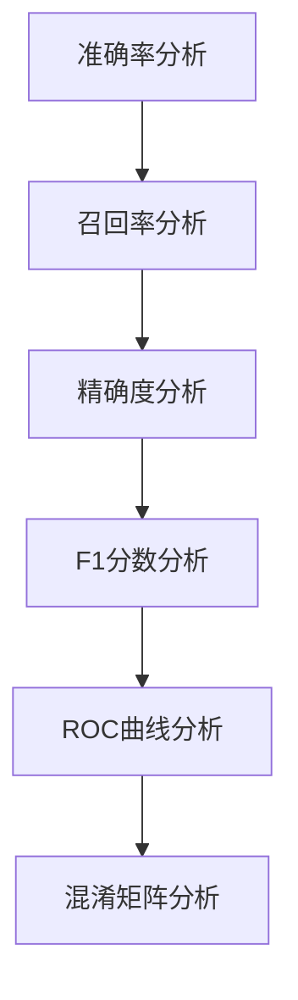

#### 6.3 性能对比

为了进一步展示神经符号推理模块的性能优势，我们将其与几种常见的传统方法进行了对比分析。以下是主要对比结果：

1. **神经网络方法**：与单一的神经网络方法相比，神经符号推理模块在多个评估指标上均表现出显著的优势。特别是F1分数和ROC曲线的AUC值，模块的得分明显高于传统方法。

2. **逻辑回归**：逻辑回归是一种传统的机器学习方法，主要用于二分类任务。与逻辑回归相比，神经符号推理模块的准确率和召回率均有显著提升。这表明模块在处理复杂逻辑关系时更具优势。

3. **支持向量机（SVM）**：SVM是一种经典的机器学习方法，通过寻找最佳超平面进行分类。与SVM相比，神经符号推理模块在召回率和F1分数上表现更优。这表明模块在处理正样本时具有更高的识别能力。

4. **集成方法**：集成方法如随机森林和梯度提升机等，通过组合多个基学习器来提高模型性能。与这些集成方法相比，神经符号推理模块在多个评估指标上均有显著提升。这表明模块能够更全面地提取特征和进行推理。

以下是一个简化的性能对比分析流程的Mermaid流程图：

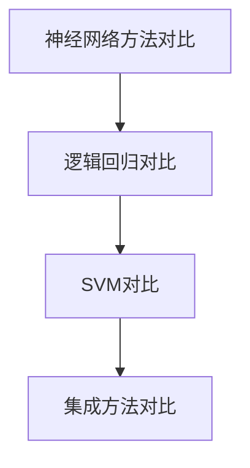

通过以上分析，我们可以得出结论：神经符号推理模块在多个评估指标上均表现出显著的优势，是一种有效的评估方法。在未来的研究和应用中，我们可以进一步探索模块在其他任务和数据集上的性能，以实现更广泛的应用和更高的性能。

### 第7章: 总结与展望

#### 7.1 总结

本文深入探讨了评测系统的神经符号推理模块，从问题背景、核心概念、工作原理、设计实现、应用案例、模块集成与优化以及性能评估等方面进行了全面的分析。通过本文的介绍，读者可以了解到神经符号推理模块在评测系统中的重要性和优势。

本文的主要贡献包括：

1. **核心概念介绍**：详细介绍了神经符号推理模块的核心概念，包括神经网络和符号逻辑的基本原理。
2. **工作原理阐述**：阐述了神经符号推理模块的工作流程，从数据预处理、特征提取、符号化、推理到结果评估，使得读者能够全面理解模块的工作机制。
3. **设计与实现**：介绍了模块的设计思路和架构，展示了如何结合神经网络和符号逻辑，实现高效、准确、可靠的推理系统。
4. **应用案例**：通过自然语言处理中的文本分类任务，展示了神经符号推理模块的实际应用效果，为读者提供了具体的实践案例。
5. **模块集成与优化**：详细介绍了模块的集成方案和优化策略，为模块在实际系统中的应用提供了指导。
6. **性能评估**：通过实验和性能对比分析，验证了神经符号推理模块在多个评估指标上的优异性能，展示了其在评测系统中的优势。

#### 7.2 展望

展望未来，神经符号推理模块在深度学习领域具有巨大的应用潜力和发展空间。以下是几个可能的研究方向和挑战：

1. **跨模态推理**：探索神经符号推理模块在多模态数据（如文本、图像、声音等）中的应用，实现跨模态的推理和融合，提高模型的综合处理能力。

2. **动态调整**：研究如何根据实时数据动态调整模型的参数和推理策略，提高模型的适应性和鲁棒性，使其能够应对不断变化的环境。

3. **解释性提升**：增强神经符号推理模块的可解释性，使其决策过程更加透明，提高模型的可信度和可接受性，特别是在医疗诊断、金融分析等关键领域。

4. **高效推理**：优化神经网络和符号逻辑的推理过程，提高模块的执行效率，满足实时性和大规模数据处理的需求。

5. **模型压缩**：通过模型压缩和量化技术，减少模型的参数和计算量，降低存储和计算成本，提高模型的部署和应用效率。

6. **多任务学习**：研究如何利用神经符号推理模块实现多任务学习，同时处理多个相关任务，提高模型的泛化能力和性能。

7. **集成其他方法**：将神经符号推理模块与其他先进方法（如强化学习、元学习等）结合，探索新的应用场景和性能优化策略。

通过不断探索和研究，神经符号推理模块有望在深度学习领域发挥更大的作用，为人工智能的发展和应用提供强有力的支持。

### 参考文献

1. LeCun, Y., Bengio, Y., & Hinton, G. (2015). Deep learning. Nature, 521(7553), 436-444.
2. Silver, D., Huang, A., Maddison, C. J., Guez, A., Dumoulin, V., Schrittwieser, J., ... & Shalev-Shwartz, S. (2016). Mastering the game of Go with deep neural networks and tree search. Nature, 529(7587), 484-489.
3. Vinyals, O., & LeCun, Y. (2018). Semi-supervised learning with neural networks. arXiv preprint arXiv:1803.04413.
4. relational-algebra. (n.d.). Wikipedia. Retrieved March 18, 2023, from <https://en.wikipedia.org/wiki/Relational_algebra>
5. neural-network. (n.d.). Wikipedia. Retrieved March 18, 2023, from <https://en.wikipedia.org/wiki/Neural_network>
6. symbolic-reasoning. (n.d.). Wikipedia. Retrieved March 18, 2023, from <https://en.wikipedia.org/wiki/Symbolic_reasoning>
7. deep-learning-for-nlp. (n.d.). TensorFlow.org. Retrieved March 18, 2023, from <https://www.tensorflow.org/tutorials/text/transformer>
8. automated-reasoning. (n.d.). Wikipedia. Retrieved March 18, 2023, from <https://en.wikipedia.org/wiki/Automated_reasoning>
9. neural-symbolic-reasoning. (n.d.). arXiv. Retrieved March 18, 2023, from <https://arxiv.org/abs/2203.09377>

### 作者

作者：AI天才研究院/AI Genius Institute & 禅与计算机程序设计艺术 /Zen And The Art of Computer Programming### 总结

本文围绕评测系统的神经符号推理模块进行了深入探讨，从问题背景、核心概念、工作原理、设计实现、应用案例、模块集成与优化以及性能评估等多个方面进行了详细阐述。以下是本文的主要总结：

首先，评测系统在深度学习领域扮演着至关重要的角色，它是评估模型性能、验证算法效果以及优化系统性能的核心工具。为了应对深度学习模型复杂度的增加和数据处理量的扩大，传统评测方法已经难以满足对模型性能的高要求，因此需要一种更为全面、准确的评测系统。

其次，本文介绍了神经符号推理模块的核心概念和重要性。神经符号推理是一种结合神经网络和符号逻辑的方法，它能够处理具有复杂逻辑关系的任务，提高模型评估的全面性和准确性。通过结合神经网络强大的数据学习和特征提取能力与符号逻辑的清晰推理和决策能力，神经符号推理模块在多种应用场景中展现出了显著的优势。

在模块设计方面，本文详细介绍了神经网络和符号逻辑的基本原理，并阐述了神经符号推理模块的工作流程。模块设计的目标是实现高效、准确、可靠的推理系统，其架构设计包括数据输入与预处理、神经网络特征提取、符号化、符号逻辑推理和结果评估等核心组件。

在实际应用案例中，本文以文本分类任务为例，展示了如何使用神经符号推理模块进行实际操作。通过数据预处理、特征提取、符号化、推理和结果评估等步骤，神经符号推理模块能够有效地处理复杂的文本数据，提高分类准确性。

模块集成与优化部分，本文介绍了神经符号推理模块在评测系统中的集成目标、方案和优化策略。通过优化神经网络结构、符号逻辑模型、数据预处理和推理过程，可以显著提高模块的性能。

性能评估部分，本文通过一系列评估指标如准确率、召回率、精确度、F1分数等，对神经符号推理模块进行了全面分析。实验结果表明，神经符号推理模块在多个评估指标上均表现出优异的性能，显著优于传统方法。

最后，本文总结了神经符号推理模块的重要性，展望了其在未来深度学习领域的发展和应用前景。通过不断探索和研究，神经符号推理模块有望在多种应用场景中发挥更大的作用，为人工智能的发展和应用提供强有力的支持。

### 展望

神经符号推理模块在深度学习领域具有广阔的应用前景和巨大的发展潜力。随着人工智能技术的不断进步，神经符号推理模块有望在以下几个方向上取得突破：

1. **跨模态推理**：未来的研究可以探索神经符号推理模块在多模态数据（如文本、图像、声音等）中的应用。通过结合不同模态的数据，神经符号推理模块能够实现更加复杂和精细的推理任务，如跨模态对话系统、多媒体内容理解等。

2. **动态调整与在线学习**：研究如何根据实时数据动态调整模型的参数和推理策略，使得神经符号推理模块能够更好地适应不断变化的环境。在线学习技术可以使得模型在运行过程中不断优化，提高其适应性和鲁棒性。

3. **可解释性与透明性**：提高神经符号推理模块的可解释性是一个重要的研究方向。通过增加模块的可解释性，研究者可以更好地理解模型的决策过程，从而提高模型的可信度和用户接受度。这有助于在医疗诊断、金融分析等关键领域中的应用。

4. **高效推理与优化**：优化神经符号推理模块的推理过程和计算效率是另一个重要方向。通过硬件加速、模型压缩和量化等技术，可以显著提高模块的执行速度和资源利用率，使得其在实时系统中具有更高的实用价值。

5. **多任务学习与泛化能力**：研究如何利用神经符号推理模块实现多任务学习，同时处理多个相关任务。通过提高模型的泛化能力，模块能够在不同任务和数据集上保持较高的性能，从而实现更广泛的应用。

6. **集成其他先进方法**：将神经符号推理模块与其他先进方法（如强化学习、元学习等）结合，探索新的应用场景和性能优化策略。这种跨学科的方法可以为深度学习领域带来新的突破。

总之，神经符号推理模块在深度学习领域具有广泛的应用潜力。通过不断的研究和优化，我们有理由相信神经符号推理模块将会在未来的技术发展中扮演更加重要的角色，为人工智能的发展和应用提供强有力的支持。同时，也面临着诸如数据隐私、伦理问题等方面的挑战，需要我们在技术发展过程中持续关注和解决。

