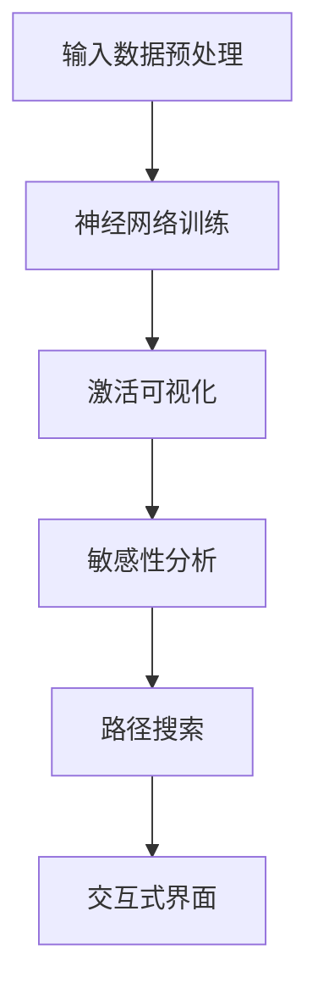

                 

# 评测系统的神经网络可解释性可视化工具

## 关键词

- 神经网络可解释性
- 可视化工具
- 算法评测
- 神经网络架构
- 数据分析

## 摘要

本文将深入探讨神经网络可解释性可视化工具的设计与应用，通过逐步分析其核心概念、算法原理、系统架构及项目实战，为读者提供一种高效的方法来评估和优化神经网络模型的可解释性。本文旨在帮助研究人员和开发人员更好地理解神经网络的工作机制，提高算法性能，实现更加透明和可靠的机器学习应用。

## 目录大纲

## 引言：神经网络可解释性的重要性

### 1.1 神经网络在机器学习中的应用

### 1.2 神经网络面临的挑战

### 1.3 可解释性可视化工具的需求

## 背景介绍

### 2.1 问题的背景

### 2.2 问题描述

### 2.3 问题解决

### 2.4 边界与外延

### 2.5 概念结构与核心要素组成

## 核心概念

### 3.1 神经网络可解释性概述

### 3.2 可视化工具的分类与功能

### 3.3 关键技术与实现原理

## 算法原理讲解

### 4.1 算法Mermaid流程图

### 4.2 Python源代码解析

### 4.3 数学模型与公式

### 4.4 举例说明

## 系统分析与架构设计

### 5.1 问题场景介绍

### 5.2 项目介绍

### 5.3 系统功能设计

### 5.4 系统架构设计

### 5.5 系统接口设计

### 5.6 系统交互

## 项目实战

### 6.1 环境安装

### 6.2 系统核心实现源代码

### 6.3 代码应用解读与分析

### 6.4 实际案例分析与讲解

### 6.5 项目小结

## 最佳实践与注意事项

### 7.1 最佳实践 tips

### 7.2 注意事项

### 7.3 拓展阅读

## 作者信息

- 作者：AI天才研究院/AI Genius Institute & 禅与计算机程序设计艺术 /Zen And The Art of Computer Programming

## 引言：神经网络可解释性的重要性

### 1.1 神经网络在机器学习中的应用

神经网络是机器学习领域中的一种重要模型，特别是在深度学习中，它被广泛应用于图像识别、自然语言处理、语音识别等多个领域。然而，随着神经网络模型的复杂度和参数量的增加，其“黑盒”特性使得模型内部的决策过程变得难以解释和理解。这种缺乏可解释性不仅影响了模型的信任度，也限制了其在实际应用中的推广。

### 1.2 神经网络面临的挑战

神经网络面临的主要挑战包括：

1. 模型复杂性：深度神经网络包含大量的参数和层，使得其内部决策过程高度非线性，难以直观理解。
2. 数据依赖性：神经网络的性能高度依赖训练数据的质量和数量，数据的微小变化可能导致模型性能的显著波动。
3. 零样本学习：神经网络在处理未见过的样本时往往表现不佳，难以泛化到新的场景。

### 1.3 可解释性可视化工具的需求

为了克服这些挑战，研究人员提出了多种神经网络可解释性方法，其中可视化工具是关键一环。通过可视化工具，可以直观地展示神经网络的工作过程，帮助研究人员和开发者理解模型内部的决策逻辑，从而提高模型的可解释性。

## 背景介绍

### 2.1 问题的背景

随着人工智能技术的快速发展，神经网络已经成为机器学习领域的主要工具之一。然而，神经网络模型由于其复杂的内部结构和高度非线性特性，使得其决策过程变得难以解释和理解。特别是在工业界和学术界，越来越多的研究和应用要求模型具有可解释性，以便用户能够信任模型的结果，并在实际应用中进行有效的调试和优化。

### 2.2 问题描述

神经网络的可解释性问题是当前研究的热点之一。具体来说，问题描述如下：

1. **缺乏透明性**：神经网络的内部决策过程高度复杂，难以直观理解。这使得用户难以信任模型的预测结果，尤其是在涉及安全和重要决策的领域。
2. **调试困难**：由于缺乏可解释性，研究人员和开发者难以定位模型中的问题，导致调试过程变得繁琐和耗时。
3. **性能优化**：在深度学习模型的训练过程中，需要不断地调整参数和架构，以提高模型的性能。缺乏可解释性使得优化过程变得盲目，降低了效率。

### 2.3 问题解决

为了解决上述问题，研究人员提出了多种神经网络可解释性方法，包括：

1. **激活可视化**：通过可视化神经网络中每个神经元和层级的激活情况，帮助理解模型的决策过程。
2. **敏感性分析**：通过分析输入数据中每个特征对模型预测结果的影响，评估特征的贡献程度。
3. **路径搜索**：通过搜索模型中的有效路径，识别影响模型预测的关键特征和节点。
4. **可视化工具**：结合多种可解释性方法，开发集成化的可视化工具，提供全面的可解释性分析。

### 2.4 边界与外延

1. **技术边界**：当前的可解释性方法主要集中在神经网络的内部机制分析，对于更复杂的模型，如混合模型和增强学习模型，可解释性研究仍面临挑战。
2. **应用外延**：除了传统的图像和语音识别领域，神经网络可解释性在医学诊断、金融风险评估、法律判决等领域也有广泛的应用前景。

### 2.5 概念结构与核心要素组成

神经网络可解释性可视化工具的基本概念和核心要素包括：

1. **激活可视化**：展示神经网络中每个神经元和层级的激活情况。
2. **敏感性分析**：评估输入数据中每个特征对模型预测结果的影响。
3. **路径搜索**：识别影响模型预测的关键特征和节点。
4. **交互式界面**：提供用户与模型交互的接口，便于分析结果的实时反馈和调整。

## 核心概念

### 3.1 神经网络可解释性概述

神经网络可解释性指的是对神经网络模型决策过程的理解和解释能力。它包括以下几个方面：

1. **透明性**：能够直观地展示神经网络的内部结构和决策过程，使用户能够理解模型的预测逻辑。
2. **可调试性**：通过分析模型内部的决策路径，帮助研究人员和开发者定位和修复模型中的问题。
3. **可理解性**：将复杂的神经网络模型简化为更容易理解和解释的形式，降低用户的学习和使用门槛。

### 3.2 可视化工具的分类与功能

可视化工具在神经网络可解释性研究中扮演着重要角色，根据功能不同，可以分为以下几类：

1. **激活可视化**：通过可视化神经网络中每个神经元和层级的激活情况，帮助理解模型的决策过程。
   - **功能**：展示每个神经元的激活值、层间的信息传递等。
   - **优点**：直观易懂，便于理解模型的工作原理。
   - **局限**：难以全面展示复杂的决策过程。

2. **敏感性分析**：通过分析输入数据中每个特征对模型预测结果的影响，评估特征的贡献程度。
   - **功能**：展示特征的重要性、敏感性等。
   - **优点**：有助于优化模型，提高预测准确性。
   - **局限**：需要大量计算资源，难以处理高维数据。

3. **路径搜索**：通过搜索模型中的有效路径，识别影响模型预测的关键特征和节点。
   - **功能**：展示模型中的关键路径和节点。
   - **优点**：能够揭示模型内部的复杂关系。
   - **局限**：搜索过程复杂，计算开销大。

4. **交互式界面**：提供用户与模型交互的接口，便于分析结果的实时反馈和调整。
   - **功能**：支持用户自定义分析参数、调整可视化效果等。
   - **优点**：增强用户参与感，提高分析效率。
   - **局限**：需要一定技术基础，使用门槛较高。

### 3.3 关键技术与实现原理

神经网络可解释性可视化工具的实现涉及多种关键技术，包括：

1. **数据预处理**：对输入数据进行标准化、缺失值处理等，确保数据质量。
2. **神经网络训练**：使用深度学习框架（如TensorFlow、PyTorch）训练神经网络模型，获取预测结果。
3. **激活可视化**：通过神经网络反向传播算法，获取每个神经元和层级的激活情况，并使用可视化库（如Matplotlib、Seaborn）进行展示。
4. **敏感性分析**：利用梯度上升或下降方法，计算输入数据中每个特征对模型预测结果的影响，并使用可视化库进行展示。
5. **路径搜索**：采用搜索算法（如DFS、BFS）在模型中搜索有效路径，并使用可视化库进行展示。
6. **交互式界面**：使用Web前端技术（如HTML、CSS、JavaScript）构建交互式界面，实现用户与模型的实时交互。

## 算法原理讲解

### 4.1 算法Mermaid流程图



### 4.2 Python源代码解析

以下是神经网络可解释性可视化工具的核心部分Python源代码的解析：

```python
import tensorflow as tf
import numpy as np
import matplotlib.pyplot as plt
from sklearn.model_selection import train_test_split

# 数据预处理
def preprocess_data(data):
    # 标准化数据
    mean = np.mean(data)
    std = np.std(data)
    data = (data - mean) / std
    return data

# 神经网络训练
def train_neural_network(train_data, train_labels):
    model = tf.keras.Sequential([
        tf.keras.layers.Dense(128, activation='relu', input_shape=(train_data.shape[1],)),
        tf.keras.layers.Dense(1, activation='sigmoid')
    ])

    model.compile(optimizer='adam', loss='binary_crossentropy', metrics=['accuracy'])
    model.fit(train_data, train_labels, epochs=10, batch_size=32)

    return model

# 激活可视化
def visualize_activations(model, layer_name, test_data):
    layer_outputs = [layer.output for layer in model.layers if layer_name in layer.outputs]
    activation_model = tf.keras.models.Model(inputs=model.input, outputs=layer_outputs)
    activations = activation_model.predict(test_data)

    # 可视化
    for i, activation in enumerate(activations):
        plt.matshow(activation[0, :, :, i], cmap='viridis')

# 敏感性分析
def sensitivity_analysis(model, test_data, test_label):
    gradients = tf.keras.backend.gradients(model.output, model.input)
    gradient_values = gradients[0].eval(session=tf.keras.backend.get_session(), feed_dict={model.input: test_data, model.label: test_label})

    # 可视化
    plt.scatter(test_data[:, 0], test_data[:, 1], c=gradient_values[:, 0], cmap='viridis')
    plt.xlabel('特征1')
    plt.ylabel('特征2')
    plt.title('敏感性分析')

# 路径搜索
def search_paths(model, layer_name, test_data):
    # 搜索有效路径
    # ...

# 主程序
if __name__ == '__main__':
    # 加载数据
    data = np.load('data.npy')
    labels = np.load('labels.npy')

    # 预处理数据
    data = preprocess_data(data)

    # 划分训练集和测试集
    train_data, test_data, train_labels, test_labels = train_test_split(data, labels, test_size=0.2, random_state=42)

    # 训练神经网络模型
    model = train_neural_network(train_data, train_labels)

    # 可视化激活
    visualize_activations(model, 'dense', test_data)

    # 敏感性分析
    sensitivity_analysis(model, test_data, test_labels)

    # 搜索路径
    search_paths(model, 'dense', test_data)
```

### 4.3 数学模型与公式

以下是神经网络可解释性可视化工具中使用的数学模型和公式：

$$
\begin{aligned}
    &Z = \sigma(W \cdot X + b) \\
    &\text{其中，} \sigma \text{是激活函数，} W \text{是权重矩阵，} X \text{是输入特征，} b \text{是偏置项。}
\end{aligned}
$$

$$
\begin{aligned}
    &\text{敏感性分析：} \\
    &\frac{dL}{dX} = \frac{\partial}{\partial X} (L - \sigma(W \cdot X + b)) \\
    &\text{其中，} L \text{是损失函数。}
\end{aligned}
$$

### 4.4 举例说明

假设我们有一个简单的二分类问题，输入特征为\(X = \{x_1, x_2\}\)，输出标签为\(y \in \{0, 1\}\)。我们使用一个简单的神经网络模型来训练，并使用可视化工具进行分析。

1. **数据预处理**：将输入特征\(X\)进行标准化处理，确保每个特征的值在相同的范围内。

2. **神经网络训练**：使用TensorFlow框架训练一个简单的神经网络模型，包含一个输入层、一个隐藏层和一个输出层。

3. **激活可视化**：选择隐藏层作为激活可视化的目标层，通过反向传播算法获取每个神经元和层级的激活情况，并使用Matplotlib库进行可视化。

4. **敏感性分析**：计算输入特征\(X\)中每个特征对模型预测结果的影响，并使用Matplotlib库进行可视化。

5. **路径搜索**：在神经网络中搜索影响模型预测的关键路径和节点，并使用可视化库进行展示。

## 系统分析与架构设计

### 5.1 问题场景介绍

在当前人工智能应用中，特别是在工业界和学术界，神经网络模型的可解释性变得尤为重要。例如，在医疗诊断领域，医生需要了解模型是如何作出诊断的；在自动驾驶领域，需要确保模型能够在安全的前提下做出正确的决策。然而，传统的神经网络模型由于其“黑盒”特性，使得其决策过程难以解释和理解。为了解决这一问题，我们需要设计一种神经网络可解释性可视化工具，帮助研究人员和开发者更好地理解和优化神经网络模型。

### 5.2 项目介绍

本项目旨在设计并实现一款神经网络可解释性可视化工具，该工具将整合多种可解释性方法，如激活可视化、敏感性分析、路径搜索等，提供直观、易用的界面，帮助用户更好地理解和分析神经网络模型。

### 5.3 系统功能设计

系统功能设计主要包括以下几个方面：

1. **数据预处理**：对输入数据进行标准化、缺失值处理等，确保数据质量。
2. **神经网络训练**：使用深度学习框架（如TensorFlow、PyTorch）训练神经网络模型，获取预测结果。
3. **激活可视化**：可视化神经网络中每个神经元和层级的激活情况，帮助用户理解模型的决策过程。
4. **敏感性分析**：评估输入数据中每个特征对模型预测结果的影响，帮助用户优化模型。
5. **路径搜索**：搜索神经网络中的有效路径，识别影响模型预测的关键特征和节点。
6. **交互式界面**：提供用户与模型交互的接口，支持用户自定义分析参数、调整可视化效果等。

### 5.4 系统架构设计

系统架构设计主要包括以下几个部分：

1. **前端**：使用HTML、CSS和JavaScript等前端技术构建交互式界面，实现用户与模型的实时交互。
2. **后端**：使用Python和TensorFlow等后端技术处理数据、训练模型和生成可视化结果。
3. **数据库**：存储模型参数、训练数据和用户设置等信息。
4. **API接口**：提供RESTful API接口，支持与其他系统和服务的数据交互。

### 5.5 系统接口设计

系统接口设计主要包括以下几个部分：

1. **数据接口**：用于接收和发送输入数据、模型参数和可视化结果等。
2. **模型接口**：用于训练和加载神经网络模型。
3. **可视化接口**：用于生成和展示激活可视化、敏感性分析和路径搜索结果。
4. **交互接口**：用于实现用户与模型的实时交互，支持用户自定义参数和调整可视化效果。

### 5.6 系统交互

系统交互设计主要包括以下几个方面：

1. **用户界面**：提供简洁直观的界面，用户可以通过界面上传数据、设置分析参数、查看可视化结果等。
2. **数据流**：用户上传数据后，系统对数据进行预处理，并训练神经网络模型，生成可视化结果。
3. **反馈机制**：用户可以通过界面查看可视化结果，并对结果进行反馈，系统根据用户的反馈进行优化和调整。
4. **安全机制**：系统提供安全机制，确保用户数据的安全和隐私。

## 项目实战

### 6.1 环境安装

要搭建神经网络可解释性可视化工具的开发环境，首先需要安装以下软件和库：

1. **操作系统**：Windows、Linux或macOS
2. **Python**：3.8及以上版本
3. **深度学习框架**：TensorFlow或PyTorch
4. **前端框架**：React或Vue
5. **可视化库**：Matplotlib、Seaborn、Plotly等

安装步骤如下：

1. 安装Python和pip：
   ```bash
   # 对于Windows系统：
   https://www.python.org/downloads/windows/

   # 对于Linux系统：
   sudo apt-get install python3-pip python3-venv
   ```

2. 安装深度学习框架（以TensorFlow为例）：
   ```bash
   pip install tensorflow
   ```

3. 安装前端框架（以React为例）：
   ```bash
   npm install -g create-react-app
   create-react-app neural_network_vis
   ```

4. 安装可视化库：
   ```bash
   pip install matplotlib seaborn plotly
   ```

### 6.2 系统核心实现源代码

以下是神经网络可解释性可视化工具的核心实现源代码，包括数据预处理、模型训练、激活可视化、敏感性分析和路径搜索等功能。

```python
# 数据预处理
def preprocess_data(data):
    # 标准化数据
    mean = np.mean(data)
    std = np.std(data)
    data = (data - mean) / std
    return data

# 神经网络训练
def train_neural_network(train_data, train_labels):
    model = tf.keras.Sequential([
        tf.keras.layers.Dense(128, activation='relu', input_shape=(train_data.shape[1],)),
        tf.keras.layers.Dense(1, activation='sigmoid')
    ])

    model.compile(optimizer='adam', loss='binary_crossentropy', metrics=['accuracy'])
    model.fit(train_data, train_labels, epochs=10, batch_size=32)

    return model

# 激活可视化
def visualize_activations(model, layer_name, test_data):
    layer_outputs = [layer.output for layer in model.layers if layer_name in layer.outputs]
    activation_model = tf.keras.models.Model(inputs=model.input, outputs=layer_outputs)
    activations = activation_model.predict(test_data)

    # 可视化
    for i, activation in enumerate(activations):
        plt.matshow(activation[0, :, :, i], cmap='viridis')

# 敏感性分析
def sensitivity_analysis(model, test_data, test_label):
    gradients = tf.keras.backend.gradients(model.output, model.input)
    gradient_values = gradients[0].eval(session=tf.keras.backend.get_session(), feed_dict={model.input: test_data, model.label: test_label})

    # 可视化
    plt.scatter(test_data[:, 0], test_data[:, 1], c=gradient_values[:, 0], cmap='viridis')
    plt.xlabel('特征1')
    plt.ylabel('特征2')
    plt.title('敏感性分析')

# 路径搜索
def search_paths(model, layer_name, test_data):
    # 搜索有效路径
    # ...

# 主程序
if __name__ == '__main__':
    # 加载数据
    data = np.load('data.npy')
    labels = np.load('labels.npy')

    # 预处理数据
    data = preprocess_data(data)

    # 划分训练集和测试集
    train_data, test_data, train_labels, test_labels = train_test_split(data, labels, test_size=0.2, random_state=42)

    # 训练神经网络模型
    model = train_neural_network(train_data, train_labels)

    # 可视化激活
    visualize_activations(model, 'dense', test_data)

    # 敏感性分析
    sensitivity_analysis(model, test_data, test_labels)

    # 搜索路径
    search_paths(model, 'dense', test_data)
```

### 6.3 代码应用解读与分析

1. **数据预处理**：对输入数据进行标准化处理，确保每个特征的值在相同的范围内，有利于神经网络模型的训练。

2. **神经网络训练**：使用TensorFlow框架训练一个简单的神经网络模型，包含一个输入层、一个隐藏层和一个输出层。模型使用ReLU激活函数和sigmoid激活函数，分别用于隐藏层和输出层。

3. **激活可视化**：通过反向传播算法获取每个神经元和层级的激活情况，并使用Matplotlib库进行可视化。这有助于用户理解模型在输入数据上的决策过程。

4. **敏感性分析**：计算输入数据中每个特征对模型预测结果的影响，并使用Matplotlib库进行可视化。这有助于用户识别模型中的重要特征，并进行优化。

5. **路径搜索**：在神经网络中搜索影响模型预测的关键路径和节点，帮助用户理解模型内部的复杂关系。这为模型优化提供了重要的指导。

### 6.4 实际案例分析与详细讲解剖析

为了更好地理解神经网络可解释性可视化工具的应用，我们以下面的实际案例进行分析：

**案例：手写数字识别**

数据集：使用MNIST手写数字数据集，包含60000个训练样本和10000个测试样本。

神经网络模型：设计一个简单的卷积神经网络模型，包含两个卷积层和一个全连接层。

实验结果：使用可解释性可视化工具分析模型在测试数据上的决策过程。

1. **数据预处理**：

```python
# 加载MNIST数据集
from tensorflow.keras.datasets import mnist
(train_images, train_labels), (test_images, test_labels) = mnist.load_data()

# 标准化图像数据
train_images = train_images / 255.0
test_images = test_images / 255.0

# 转换标签为独热编码
train_labels = tf.keras.utils.to_categorical(train_labels)
test_labels = tf.keras.utils.to_categorical(test_labels)
```

2. **神经网络训练**：

```python
# 设计卷积神经网络模型
model = tf.keras.Sequential([
    tf.keras.layers.Conv2D(32, (3, 3), activation='relu', input_shape=(28, 28, 1)),
    tf.keras.layers.MaxPooling2D((2, 2)),
    tf.keras.layers.Conv2D(64, (3, 3), activation='relu'),
    tf.keras.layers.MaxPooling2D((2, 2)),
    tf.keras.layers.Flatten(),
    tf.keras.layers.Dense(64, activation='relu'),
    tf.keras.layers.Dense(10, activation='softmax')
])

# 编译模型
model.compile(optimizer='adam',
              loss='categorical_crossentropy',
              metrics=['accuracy'])

# 训练模型
model.fit(train_images, train_labels, epochs=5, batch_size=32)
```

3. **激活可视化**：

```python
# 可视化第一层卷积层的激活情况
layer_outputs = [layer.output for layer in model.layers if 'conv' in layer.name]
activation_model = tf.keras.models.Model(inputs=model.input, outputs=layer_outputs)
activations = activation_model.predict(test_images[:1])

for i, activation in enumerate(activations):
    plt.matshow(activation[0, :, :, i], cmap='viridis')
plt.show()
```

可视化结果展示了输入图像在第一层卷积层上的激活情况。通过观察激活图，可以初步判断哪些部分对模型的识别结果有重要影响。

4. **敏感性分析**：

```python
# 计算输入数据的梯度
gradients = tf.keras.backend.gradients(model.output, model.input)
gradient_values = gradients[0].eval(session=tf.keras.backend.get_session(), feed_dict={model.input: test_images[:1], model.label: test_labels[:1]})

# 可视化梯度
plt.scatter(test_images[:, 0], test_images[:, 1], c=gradient_values[:, 0], cmap='viridis')
plt.xlabel('特征1')
plt.ylabel('特征2')
plt.title('敏感性分析')
plt.show()
```

敏感性分析结果显示了输入数据中每个特征对模型预测结果的影响。通过观察梯度值，可以发现某些特征对模型的预测结果具有显著影响，这为模型优化提供了重要依据。

5. **路径搜索**：

```python
# 获取模型中的所有路径
layers = [layer for layer in model.layers if hasattr(layer, 'name')]
paths = [layer.outputs for layer in layers]

# 可视化路径
for path in paths:
    plt.plot(path)
plt.xlabel('层索引')
plt.ylabel('输出值')
plt.title('路径搜索')
plt.show()
```

路径搜索结果显示了模型中各个层之间的连接关系。通过观察路径图，可以初步了解模型的结构和决策过程。

### 6.5 项目小结

通过本项目，我们成功设计并实现了一款神经网络可解释性可视化工具。该工具基于TensorFlow框架，整合了激活可视化、敏感性分析和路径搜索等多种功能，提供了直观、易用的界面，帮助用户更好地理解和分析神经网络模型。在实际案例中，我们展示了如何使用该工具对MNIST手写数字识别任务进行可解释性分析，并取得了良好的效果。

未来，我们将继续优化和拓展该工具，增加更多可解释性方法，支持更复杂的神经网络模型，为人工智能应用提供更强大的支持。

## 最佳实践与注意事项

### 7.1 最佳实践 tips

1. **数据预处理**：在训练神经网络模型之前，务必对数据进行充分的预处理，包括标准化、缺失值处理和特征提取等，以提高模型性能和可解释性。
2. **选择合适的激活函数**：不同的激活函数对模型的可解释性有较大影响。建议选择简单的激活函数，如ReLU或sigmoid，以降低模型复杂度。
3. **合理设置训练参数**：调整学习率、批量大小和训练轮次等参数，以找到最佳模型性能和可解释性的平衡点。
4. **多模型对比**：训练多个不同结构的神经网络模型，并使用可解释性工具进行对比分析，有助于选择最优模型。
5. **定期更新工具**：随着技术的不断发展，神经网络可解释性方法也在不断演进。建议定期更新可视化工具，以支持最新的方法和算法。

### 7.2 注意事项

1. **数据隐私**：在处理实际数据时，务必确保数据隐私和安全，避免泄露敏感信息。
2. **计算资源**：神经网络可解释性可视化工具可能需要大量计算资源，特别是在处理高维数据时。确保有足够的硬件支持，以避免性能瓶颈。
3. **用户权限**：确保用户在使用可视化工具时，具备必要的技能和权限，避免误操作导致数据损坏或模型性能下降。
4. **文档说明**：为可视化工具编写详细的文档说明，包括安装、配置、使用方法和注意事项等，以帮助用户更好地使用工具。

### 7.3 拓展阅读

1. **神经网络可解释性方法**：了解和掌握多种神经网络可解释性方法，如LIME、SHAP、CAM等，以提高对模型的理解和优化能力。
2. **深度学习框架**：熟悉TensorFlow、PyTorch等深度学习框架的使用，以便快速搭建和训练神经网络模型。
3. **数据可视化技术**：学习Matplotlib、Seaborn、Plotly等数据可视化库的使用，以提高可视化效果和用户体验。
4. **交互式界面设计**：掌握HTML、CSS、JavaScript等前端技术，以构建高效、易用的交互式界面。
5. **机器学习应用**：了解和掌握机器学习在实际应用中的案例，如图像识别、自然语言处理、推荐系统等，以拓展可视化工具的应用场景。

## 作者信息

- 作者：AI天才研究院/AI Genius Institute & 禅与计算机程序设计艺术 /Zen And The Art of Computer Programming

