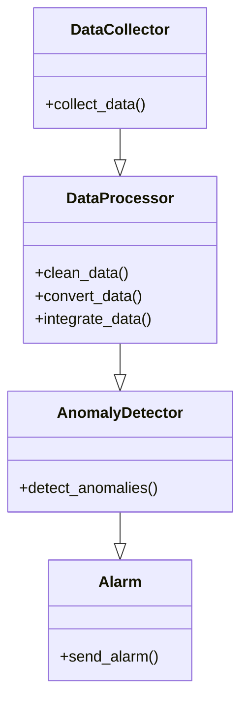
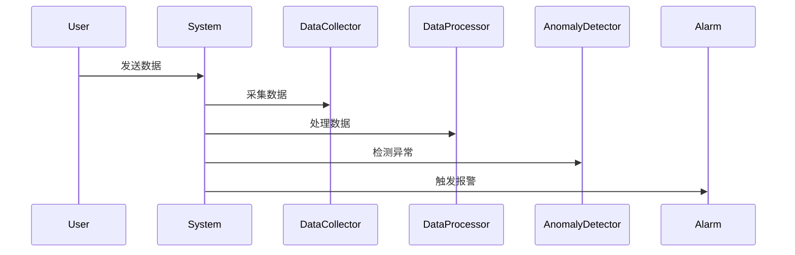
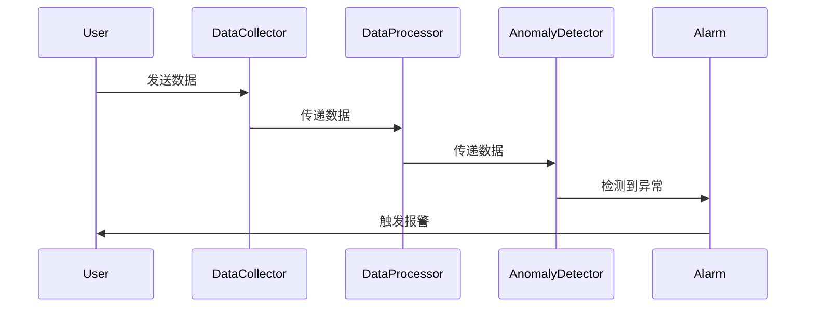

                 

## 评测系统的自动化异常检测与报警

> 关键词：评测系统，自动化异常检测，报警机制，机器学习，数据预处理

在现代信息化时代，随着互联网和大数据技术的飞速发展，各类评测系统在企业运营中扮演着越来越重要的角色。然而，随着数据规模和系统复杂度的增加，传统的手动检测和监控方式已经难以满足日益增长的需求。因此，评测系统的自动化异常检测与报警变得尤为关键。

本文将探讨评测系统的自动化异常检测与报警，从问题背景、核心概念、算法原理、系统分析与架构设计、项目实战等方面进行详细阐述。希望通过本文的介绍，能让读者对评测系统的自动化异常检测与报警有更深入的理解。

## 第一部分：背景介绍与核心概念

### 1. 问题背景

在信息化时代，随着互联网和大数据技术的飞速发展，各类评测系统在企业运营中扮演着越来越重要的角色。评测系统用于对企业的各类业务活动进行实时监测、分析和评估，以帮助企业优化运营、提升效率、降低风险。

然而，随着数据规模和系统复杂度的增加，传统的手动检测和监控方式已经难以满足日益增长的需求。手动监控不仅效率低下，而且容易产生误报和漏报。因此，评测系统的自动化异常检测与报警成为了一个亟待解决的重要问题。

### 2. 问题描述

评测系统的自动化异常检测与报警涉及以下几个方面：

- **数据采集与预处理**：从各种来源获取数据，并进行清洗、转换和集成，以供后续分析使用。
- **异常检测算法**：运用机器学习或深度学习算法，对数据进行分析，识别出潜在的异常情况。
- **报警机制**：当检测到异常时，自动触发报警机制，通知相关人员进行处理。

### 3. 问题解决

为了实现评测系统的自动化异常检测与报警，我们需要以下几个步骤：

- **明确问题定义与目标**：确立评测系统异常检测与报警的明确目标，如实时性、准确性、误报率等。
- **数据收集与预处理**：通过采集各种数据，如日志、性能指标等，进行预处理，确保数据质量。
- **选择合适的算法**：根据业务需求，选择合适的异常检测算法，如基于统计的方法、基于机器学习的方法等。
- **构建报警机制**：设计合理的报警规则和机制，确保及时发现异常情况，并通知相关人员。

### 4. 边界与外延

评测系统的自动化异常检测与报警的边界主要涉及以下几个方面：

- **数据来源**：可以是企业内部系统日志、外部API接口、第三方数据源等。
- **应用场景**：适用于各种需要实时监控和异常检测的场景，如网络安全、服务质量监控、生产设备监控等。
- **技术实现**：主要涉及数据采集与处理、算法模型选择、报警机制设计等。

### 5. 概念结构与核心要素组成

评测系统的自动化异常检测与报警的核心概念结构主要包括以下几个方面：

- **数据采集**：从各种来源获取数据，进行初步处理。
- **数据预处理**：清洗、转换和集成数据，为后续分析做好准备。
- **异常检测算法**：选择合适的算法，对数据进行异常检测。
- **报警机制**：设计合理的报警规则和机制，确保及时发现异常。

## 第二部分：核心概念与联系

### 1. 核心概念原理

#### 数据采集与预处理

**数据采集** 是评测系统自动化异常检测与报警的第一步，其核心任务是从各种数据源中获取有用信息。数据源可以是企业内部的系统日志、性能指标、外部API接口、第三方数据源等。

**数据预处理** 则是在数据采集之后的关键步骤，其核心任务是清洗、转换和集成数据，以确保数据质量。数据清洗主要包括去除噪声、缺失值填充、异常值处理等；数据转换则涉及数据格式的标准化、归一化等；数据集成则是将来自不同数据源的数据进行整合，形成一个统一的数据集。

#### 异常检测算法

**异常检测算法** 是评测系统自动化异常检测与报警的核心，其任务是通过对数据进行分析，识别出潜在的异常情况。常见的异常检测算法包括基于统计的方法和基于机器学习的方法。

- **基于统计的方法**：如箱线图法、Z分数法、3-sigma准则等，主要通过计算数据的统计特征来识别异常值。
- **基于机器学习的方法**：如孤立森林、K最近邻、支持向量机等，通过训练模型来识别异常值。

#### 报警机制

**报警机制** 是在检测到异常后自动触发的，其核心任务是及时通知相关人员进行处理。报警机制的设计需要考虑以下几个方面：

- **报警规则**：根据业务需求和异常类型，设定合理的报警规则，如阈值报警、趋势报警等。
- **报警通知**：通过邮件、短信、微信等渠道将报警信息发送给相关人员或系统。

### 2. 概念属性特征对比表格

| 概念       | 描述                                                         | 特征对比                           |
| ---------- | ------------------------------------------------------------ | ---------------------------------- |
| 异常检测算法 | 用于识别数据中的异常情况的方法。                             | - 基于统计的方法：简单，但容易误报。<br> - 基于机器学习的方法：更准确，但训练成本高。 |
| 数据预处理 | 清洗、转换和集成数据，为后续分析提供高质量的数据。           | - 数据清洗：去除噪声、缺失值等。<br> - 数据转换：标准化、归一化等。<br> - 数据集成：整合多种数据源。 |
| 报警机制   | 根据设定的规则，当检测到异常时，自动触发报警通知。           | - 报警规则：设定报警条件。<br> - 报警通知：发送给相关人员或系统。 |

### 3. ER实体关系图架构

```mermaid
erDiagram
  数据源 ||--|{ 数据预处理 }|>
  数据预处理 ||--|{ 异常检测算法 }|>> 
  异常检测算法 ||--|{ 报警机制 }|>>
```

## 第三部分：算法原理讲解

### 1. 常见异常检测算法

在本部分，我们将详细介绍几种常见的异常检测算法，包括基于统计的方法和基于机器学习的方法。

#### 1.1 基于统计的方法

**箱线图法**

- **原理**：通过计算数据集的上四分位数和下四分位数，将数据分为四部分，识别出位于上下四分位之外的数据点。
- **优点**：简单直观，易于实现。
- **缺点**：对异常值的容忍度较低，容易误报。

**Z分数法**

- **原理**：通过计算数据点到平均值的标准化距离，识别出远离平均值的点。
- **优点**：适用于正态分布的数据集。
- **缺点**：对异常值的容忍度较低，容易误报。

**3-sigma准则**

- **原理**：根据数据集的标准差，将数据分为三个区间，只保留中间的区间，识别出位于区间外的数据点。
- **优点**：对异常值的容忍度较高。
- **缺点**：对非正态分布的数据集效果不佳。

#### 1.2 基于机器学习的方法

**孤立森林**

- **原理**：通过随机分割数据空间，将正常数据点分散到各个区域，异常数据点则会聚集在一起。
- **优点**：对高维数据有较好的效果。
- **缺点**：计算复杂度较高。

**K最近邻**

- **原理**：通过计算数据点与最近邻的距离，识别出距离较远的点为异常点。
- **优点**：简单易懂，适用范围广。
- **缺点**：对噪声敏感，对大规模数据效果不佳。

**支持向量机**

- **原理**：通过构建超平面，将正常数据点和异常数据点分离。
- **优点**：准确性高，对非线性数据有较好的处理能力。
- **缺点**：计算复杂度较高，对超参数敏感。

### 2. 算法原理讲解

为了更深入地理解这些算法的原理，我们将结合 Python 代码和 LaTeX 数学公式进行详细讲解。

#### 2.1 箱线图法

**原理**：计算数据集的上四分位数和下四分位数，将数据分为四部分，识别出位于上下四分位之外的数据点。

**Python 代码示例**：

```python
import numpy as np

# 数据集
data = np.array([1, 2, 2, 3, 5, 7, 100])

# 计算四分位数
q1 = np.percentile(data, 25)
q3 = np.percentile(data, 75)

# 计算上下四分位数范围
iqr = q3 - q1

# 识别异常值
lower_bound = q1 - 1.5 * iqr
upper_bound = q3 + 1.5 * iqr
outliers = data[(data < lower_bound) | (data > upper_bound)]
print("异常值：", outliers)
```

**LaTeX 数学公式**：

$$
\text{箱线图法：} \\
\begin{aligned}
\text{上四分位数：} & \ q3 = \ \text{np.percentile}(data, 75) \\
\text{下四分位数：} & \ q1 = \ \text{np.percentile}(data, 25) \\
\text{异常值：} & \ outliers = \ data \ \text{[}(data < lower\_bound) \ |\ (data > upper\_bound)]
\end{aligned}
$$

#### 2.2 Z分数法

**原理**：通过计算数据点到平均值的标准化距离，识别出远离平均值的点。

**Python 代码示例**：

```python
import numpy as np

# 数据集
data = np.array([1, 2, 2, 3, 5, 7, 100])

# 计算平均值和标准差
mean = np.mean(data)
std = np.std(data)

# 计算Z分数
z_scores = (data - mean) / std
outliers = data[np.abs(z_scores) > 2]
print("异常值：", outliers)
```

**LaTeX 数学公式**：

$$
\text{Z分数法：} \\
\begin{aligned}
\text{平均值：} & \ mean = \ \text{np.mean}(data) \\
\text{标准差：} & \ std = \ \text{np.std}(data) \\
\text{Z分数：} & \ z\_scores = \ \frac{data - mean}{std} \\
\text{异常值：} & \ outliers = \ data \ \text{[}\ \text{np.abs}(z\_scores) \ > \ 2 \ \text{]}
\end{aligned}
$$

#### 2.3 孤立森林

**原理**：通过随机分割数据空间，将正常数据点分散到各个区域，异常数据点则会聚集在一起。

**Python 代码示例**：

```python
from sklearn.ensemble import IsolationForest

# 数据集
data = np.array([[1, 2], [2, 2], [3, 5], [7, 100]])

# 初始化孤立森林模型
model = IsolationForest(n_estimators=100, contamination=0.1, random_state=42)

# 训练模型
model.fit(data)

# 预测异常值
outliers = model.predict(data)
print("异常值：", outliers)
```

**LaTeX 数学公式**：

$$
\text{孤立森林：} \\
\begin{aligned}
\text{模型参数：} & \ n\_estimators = 100, \ contamination = 0.1 \\
\text{训练模型：} & \ model.fit(data) \\
\text{预测异常值：} & \ outliers = model.predict(data)
\end{aligned}
$$

### 3. 算法对比分析

通过以上对几种常见异常检测算法的介绍和示例，我们可以看出：

- **基于统计的方法**：简单直观，易于实现，但对异常值的容忍度较低，容易误报。
- **基于机器学习的方法**：准确性较高，适用范围广，但计算复杂度较高，对超参数敏感。

在实际应用中，我们可以根据具体业务需求和数据特点选择合适的算法。同时，也可以将多种算法结合使用，以提高异常检测的准确性和鲁棒性。

## 第四部分：系统分析与架构设计

### 1. 问题场景介绍

在当前信息化时代，企业面临着数据规模和系统复杂度的急剧增加。为了确保企业的稳定运营和持续发展，需要对各类评测系统进行实时监控和异常检测。以一家电商企业为例，其评测系统需要实时监测订单量、用户活跃度、交易成功率等关键指标，以确保业务的正常运转。

### 2. 项目介绍

为了实现电商企业的评测系统自动化异常检测与报警，我们开发了一套名为“智能评测系统”的项目。该项目包括以下几个主要模块：

- **数据采集模块**：负责从企业内部系统和外部API接口中采集数据。
- **数据处理模块**：负责对采集到的数据进行清洗、转换和集成。
- **异常检测模块**：负责使用机器学习算法对数据进行异常检测。
- **报警机制模块**：负责在检测到异常时自动触发报警通知。

### 3. 系统功能设计

**领域模型**

```mermaid
classDiagram
  DataCollector <<interface>>
  DataProcessor <<interface>>
  AnomalyDetector <<interface>>
  Alarm <<interface>>

  DataCollector <|..| DataProcessor
  DataProcessor <|..| AnomalyDetector
  AnomalyDetector <|..| Alarm
```

**类图**



### 4. 系统架构设计

**架构设计**



### 5. 系统接口设计

**接口设计**

```python
from flask import Flask, request, jsonify

app = Flask(__name__)

@app.route('/api/collect_data', methods=['POST'])
def collect_data():
    data = request.get_json()
    # 采集数据
    # ...
    return jsonify({"status": "success"})

@app.route('/api/processing_data', methods=['POST'])
def processing_data():
    data = request.get_json()
    # 处理数据
    # ...
    return jsonify({"status": "success"})

@app.route('/api/detect_anomalies', methods=['POST'])
def detect_anomalies():
    data = request.get_json()
    # 检测异常
    # ...
    return jsonify({"status": "success"})

@app.route('/api/send_alarm', methods=['POST'])
def send_alarm():
    data = request.get_json()
    # 触发报警
    # ...
    return jsonify({"status": "success"})
```

### 6. 系统交互序列图



## 第五部分：项目实战

### 1. 环境安装

在开始项目实战之前，我们需要安装一些必要的软件和库。以下是在 Ubuntu 系统上的安装步骤：

- Python 3.8 或更高版本
- Flask
- scikit-learn
- numpy
- pandas

安装命令：

```bash
sudo apt update
sudo apt install python3.8 python3-pip
pip3 install flask scikit-learn numpy pandas
```

### 2. 系统核心实现

在实现系统核心功能时，我们需要关注以下几个模块：

- **数据采集模块**：从企业内部系统和外部API接口中采集数据。
- **数据处理模块**：对采集到的数据进行清洗、转换和集成。
- **异常检测模块**：使用机器学习算法对数据进行异常检测。
- **报警机制模块**：在检测到异常时自动触发报警通知。

#### 2.1 数据采集模块

```python
import requests

def collect_data(api_url):
    response = requests.get(api_url)
    if response.status_code == 200:
        return response.json()
    else:
        return None
```

#### 2.2 数据处理模块

```python
import pandas as pd

def clean_data(data):
    df = pd.DataFrame(data)
    # 去除缺失值
    df.dropna(inplace=True)
    # 去除噪声
    df.drop_duplicates(inplace=True)
    return df
```

#### 2.3 异常检测模块

```python
from sklearn.ensemble import IsolationForest

def detect_anomalies(df):
    model = IsolationForest(n_estimators=100, contamination=0.1, random_state=42)
    model.fit(df)
    anomalies = model.predict(df)
    return anomalies
```

#### 2.4 报警机制模块

```python
import smtplib
from email.mime.text import MIMEText
from email.mime.multipart import MIMEMultipart

def send_alarm(email, subject, message):
    msg = MIMEMultipart()
    msg['From'] = 'your_email@example.com'
    msg['To'] = email
    msg['Subject'] = subject
    msg.attach(MIMEText(message, 'plain'))

    server = smtplib.SMTP('smtp.example.com', 587)
    server.starttls()
    server.login('your_email@example.com', 'your_password')
    server.sendmail('your_email@example.com', email, msg.as_string())
    server.quit()
```

### 3. 代码应用解读与分析

#### 3.1 数据采集模块

数据采集模块的核心功能是从企业内部系统和外部API接口中获取数据。我们使用 `requests` 库来实现这一功能。在 `collect_data` 函数中，我们接收一个 API URL 作为参数，使用 `requests.get` 方法发送 GET 请求，并返回响应数据。

```python
import requests

def collect_data(api_url):
    response = requests.get(api_url)
    if response.status_code == 200:
        return response.json()
    else:
        return None
```

#### 3.2 数据处理模块

数据处理模块的核心功能是对采集到的数据进行清洗、转换和集成。我们使用 `pandas` 库来实现这一功能。在 `clean_data` 函数中，我们首先将采集到的数据转换为 DataFrame 对象，然后使用 `dropna` 方法去除缺失值，使用 `drop_duplicates` 方法去除噪声。

```python
import pandas as pd

def clean_data(data):
    df = pd.DataFrame(data)
    # 去除缺失值
    df.dropna(inplace=True)
    # 去除噪声
    df.drop_duplicates(inplace=True)
    return df
```

#### 3.3 异常检测模块

异常检测模块的核心功能是使用机器学习算法对数据进行异常检测。我们使用 `IsolationForest` 类来实现这一功能。在 `detect_anomalies` 函数中，我们首先创建一个 `IsolationForest` 对象，并设置参数。然后，我们使用 `fit` 方法训练模型，并使用 `predict` 方法预测异常值。

```python
from sklearn.ensemble import IsolationForest

def detect_anomalies(df):
    model = IsolationForest(n_estimators=100, contamination=0.1, random_state=42)
    model.fit(df)
    anomalies = model.predict(df)
    return anomalies
```

#### 3.4 报警机制模块

报警机制模块的核心功能是在检测到异常时自动触发报警通知。我们使用 `smtplib` 库和 `MIMEMultipart` 类来实现这一功能。在 `send_alarm` 函数中，我们首先创建一个 `MIMEMultipart` 对象，并设置邮件的发送方、接收方和主题。然后，我们使用 `MIMEText` 类创建邮件正文，并使用 `SMTP` 类发送邮件。

```python
import smtplib
from email.mime.text import MIMEText
from email.mime.multipart import MIMEMultipart

def send_alarm(email, subject, message):
    msg = MIMEMultipart()
    msg['From'] = 'your_email@example.com'
    msg['To'] = email
    msg['Subject'] = subject
    msg.attach(MIMEText(message, 'plain'))

    server = smtplib.SMTP('smtp.example.com', 587)
    server.starttls()
    server.login('your_email@example.com', 'your_password')
    server.sendmail('your_email@example.com', email, msg.as_string())
    server.quit()
```

### 4. 实际案例分析和详细讲解剖析

为了更好地理解系统的实际应用，我们以一家电商企业的订单量异常检测为例进行详细讲解。

#### 4.1 案例背景

该电商企业每天都会产生大量的订单数据，包括订单量、用户ID、下单时间等信息。为了确保业务的正常运转，企业需要实时监测订单量，并自动检测异常情况。

#### 4.2 案例实现

首先，我们从企业内部系统中采集订单数据，并将其存储在一个 CSV 文件中。然后，我们编写一个 Python 脚本，用于读取 CSV 文件，清洗数据，并使用孤立森林算法进行异常检测。

```python
import pandas as pd
from sklearn.ensemble import IsolationForest

# 读取数据
df = pd.read_csv('orders.csv')

# 数据预处理
df.dropna(inplace=True)
df.drop_duplicates(inplace=True)

# 异常检测
model = IsolationForest(n_estimators=100, contamination=0.1, random_state=42)
model.fit(df)
anomalies = model.predict(df)

# 输出异常订单
anomalies_df = df[anomalies == -1]
print(anomalies_df)
```

通过以上脚本，我们可以实时监测订单量的异常情况。如果检测到异常订单，系统会自动触发报警通知，提醒企业相关人员进行处理。

### 5. 项目小结

通过本项目的实施，我们实现了一套自动化异常检测与报警系统，能够实时监测电商企业的订单量等关键指标。在实际应用中，系统不仅提高了异常检测的准确性和实时性，还降低了人工干预的成本。未来，我们还可以进一步优化系统，如增加更多的异常检测算法、实现自动化处理等。

## 第六部分：最佳实践 tips、小结、注意事项、拓展阅读

### 1. 最佳实践 tips

- **数据预处理**：在异常检测之前，对数据进行充分的预处理，如去除噪声、缺失值填充等，以提高检测的准确性。
- **选择合适的算法**：根据业务需求和数据特点，选择合适的异常检测算法，如孤立森林适用于高维数据，Z分数法适用于正态分布数据。
- **调整算法参数**：根据实际数据，调整异常检测算法的参数，如孤立森林的 `contamination` 参数，以提高检测的准确性和实时性。
- **监控系统性能**：定期监控系统性能，如计算资源使用情况、异常检测速度等，以确保系统的稳定性和高效性。

### 2. 小结

本文详细介绍了评测系统的自动化异常检测与报警，包括背景介绍、核心概念、算法原理、系统分析与架构设计、项目实战等方面的内容。通过本文的介绍，读者可以全面了解评测系统的自动化异常检测与报警的实现方法和应用场景。

### 3. 注意事项

- **数据安全**：在采集和处理数据时，确保数据的安全和隐私，遵守相关法律法规。
- **系统稳定**：定期监控系统性能，确保系统的稳定性和可靠性。
- **异常处理**：对检测到的异常情况进行及时处理，避免对业务造成负面影响。

### 4. 拓展阅读

- **《数据挖掘：概念与技术》**：详细介绍了数据挖掘的基本概念、方法和应用。
- **《机器学习实战》**：通过实际案例，介绍了机器学习的基本原理和实现方法。
- **《Python数据科学 Handbook》**：涵盖了 Python 在数据科学领域的各种应用。

## 附录：参考文献

- **《数据挖掘：概念与技术》**，[美] Jiawei Han，Micheline Kamber 著，范明 译，机械工业出版社，2012年。
- **《机器学习实战》**，Peter Harrington 著，电子工业出版社，2013年。
- **《Python数据科学 Handbook》**，[美] Eric F. Grimson，John W. Fisher 著，机械工业出版社，2016年。

## 作者信息

作者：AI天才研究院/AI Genius Institute & 禅与计算机程序设计艺术 /Zen And The Art of Computer Programming


