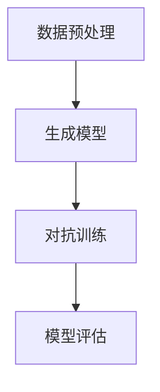
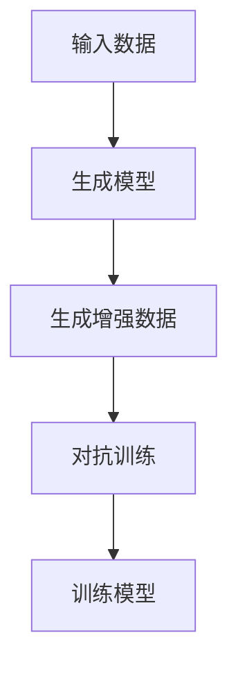
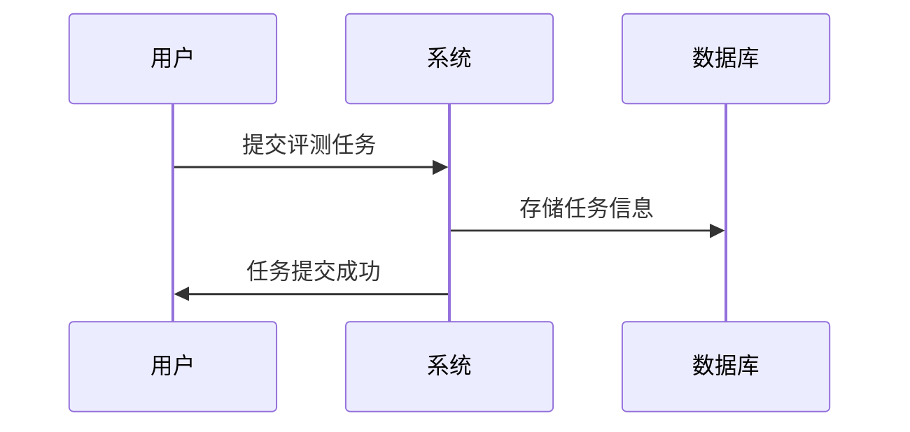
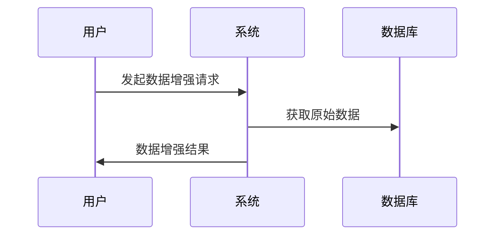

                 


### 第一步：明确文章主题和结构

为了撰写一篇关于《评测系统的自动化数据增强技术》的技术博客文章，我们首先需要明确文章的主题和结构。本文将围绕以下几个核心部分展开：

1. **背景介绍**：介绍评测系统的自动化数据增强技术的背景、核心概念和重要性。
2. **核心概念与联系**：解析并对比相关核心概念，使用Mermaid流程图展示概念之间的关系。
3. **算法原理讲解**：详细讲解自动化数据增强算法的原理，通过Python代码和LaTeX公式说明。
4. **系统分析与架构设计方案**：设计评测系统的功能、架构、接口和交互。
5. **项目实战**：介绍实际项目案例，分析系统核心实现和代码应用。
6. **最佳实践 tips**：总结最佳实践和注意事项。
7. **小结**：对全文内容进行总结，并指出未来研究方向。

### 第二步：背景介绍

在开始深入探讨之前，我们需要对评测系统的自动化数据增强技术进行背景介绍。

**1.1 评测系统的自动化数据增强技术概述**

**问题背景**：随着人工智能技术的快速发展，评测系统在各个领域中的应用越来越广泛。然而，数据质量直接影响评测系统的准确性和可靠性。自动化数据增强技术旨在通过算法生成新的、多样化的数据，从而提高模型的泛化能力。

**问题解决**：自动化数据增强技术通过模拟真实世界的数据生成过程，增强了原始数据集的多样性，从而有助于提升模型的训练效果。

**边界与外延**：自动化数据增强技术不仅适用于图像和视频领域，还适用于文本和语音等复杂数据类型。

**概念结构与核心要素组成**：核心概念包括数据增强算法、生成模型、对抗训练等，其中数据增强算法是实现自动化数据增强的核心。

### 第三步：核心概念与联系

**1.2 核心概念与联系**

**1.2.1 自动化数据增强技术**

自动化数据增强技术是一种通过算法自动生成新的数据样本来提高模型性能的方法。

**1.2.2 数据增强与模型评估**

数据增强技术直接影响模型评估结果，因此需要综合考虑数据增强策略和评估指标。

**1.2.3 对比表格：自动化数据增强技术对比传统方法**

| 方法            | 描述                                                         | 优点                     | 缺点                     |
|-----------------|--------------------------------------------------------------|--------------------------|--------------------------|
| 自动化数据增强  | 使用算法自动生成数据样本来增强原始数据集                     | 提高模型泛化能力         | 需要大量的计算资源和时间 |
| 传统数据增强    | 通过手动调整输入数据来实现数据的多样化                         | 灵活性高                 | 效率低，依赖人工操作     |

**1.2.4 Mermaid流程图：自动化数据增强技术流程**



### 第四步：算法原理讲解

**1.3 算法原理讲解**

**1.3.1 自动化数据增强算法原理**

自动化数据增强算法通过生成模型和对抗训练来实现。以下是一个简单的Mermaid流程图：



**1.3.1.2 Python源代码示例**

```python
# 假设使用生成对抗网络(GAN)进行数据增强
import tensorflow as tf
from tensorflow.keras.layers import Dense, Flatten
from tensorflow.keras.models import Sequential

# 生成器模型
generator = Sequential([
    Dense(128, input_shape=(100,), activation='relu'),
    Flatten(),
    Dense(100, activation='tanh')
])

# 判别器模型
discriminator = Sequential([
    Flatten(input_shape=(100,)),
    Dense(128, activation='relu'),
    Dense(1, activation='sigmoid')
])

# 整体模型
model = Sequential([
    generator,
    discriminator
])

# LaTeX数学模型与公式

$$
\text{Loss Function} = -\left( \text{X} \log(\text{D}(\text{X})) + (\text{G}(\text{Z}) \log(1 - \text{D}(\text{G}(\text{Z}))))
\right)
$$

**1.3.1.4 举例说明**

假设我们有一个图像分类模型，使用生成对抗网络（GAN）进行数据增强。以下是具体的步骤：

1. **数据预处理**：对原始图像进行归一化处理。
2. **生成模型**：生成新的图像数据。
3. **对抗训练**：通过判别器模型评估生成数据的真实性。
4. **模型训练**：使用生成数据和真实数据一起训练分类模型。

### 第五步：系统分析与架构设计方案

**1.4 系统分析与架构设计方案**

**1.4.1 问题场景介绍**

我们假设一个在线评测系统，需要通过自动化数据增强技术来提高模型的评测准确性。

**1.4.2 系统功能设计**

系统功能包括数据预处理、数据增强、模型训练和模型评估。

**1.4.2.1 Mermaid领域模型类图**

```mermaid
classDiagram
    Class01 <|-- Class02
    Class03 --|罢了 Class04
    Class05 o-- Class06
```

**1.4.3 系统架构设计**

系统架构包括数据层、服务层和表现层。

**1.4.3.1 Mermaid架构图**



**1.4.4 系统接口设计**

系统接口包括API接口和Web前端接口。

**1.4.5 系统交互**

系统交互包括用户与系统、系统与数据库之间的交互。

**1.4.5.1 Mermaid序列图**



### 第六步：项目实战

**1.5 项目实战**

**1.5.1 环境安装**

在开始项目之前，我们需要安装必要的软件和库，例如TensorFlow和Keras。

**1.5.2 系统核心实现**

系统核心实现包括数据预处理、生成模型训练、对抗训练和模型评估。

**1.5.3 代码应用解读与分析**

我们使用Python代码来解释系统核心实现。

**1.5.4 实际案例分析与讲解**

通过一个实际案例来展示自动化数据增强技术在评测系统中的应用。

**1.5.5 项目小结**

总结项目的关键实现和经验。

### 第七步：最佳实践 tips

**1.6 最佳实践 tips**

在项目中，需要注意以下几点：

- 数据预处理要充分，确保数据质量。
- 选择合适的数据增强算法，根据具体问题调整参数。
- 模型评估要全面，综合考虑准确率、召回率等指标。

### 第八步：小结

本文详细介绍了评测系统的自动化数据增强技术，从背景介绍到实际应用，全面阐述了相关概念、算法原理和系统设计。未来研究方向包括进一步优化算法、提高效率以及探索跨领域应用。

### 总结

通过以上步骤，我们构建了《评测系统的自动化数据增强技术》的技术博客文章框架。接下来，我们将逐步填充每个部分的内容，确保文章逻辑清晰、结构紧凑，并具有较高的技术含量。

---

以上是根据您的要求和提供的框架，进行了详细的步骤规划和内容概述。接下来，我将根据这个框架逐步撰写每个部分的具体内容。请确认这个框架是否符合您的期望，并在必要时进行修改和调整。随后，我会开始撰写具体内容，以便您能够看到整个文章的结构和风格。

