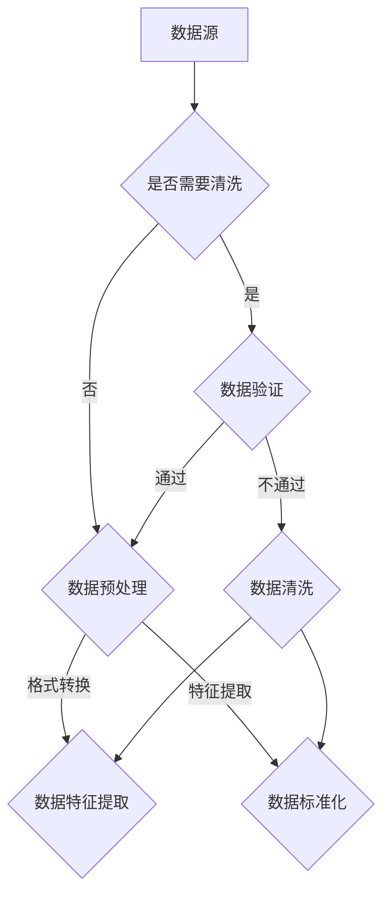
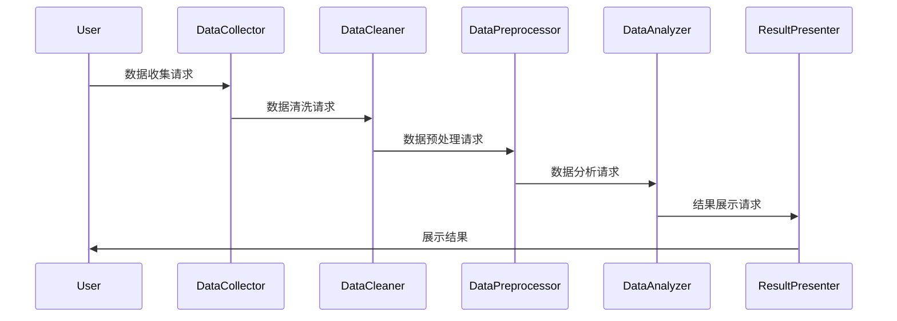
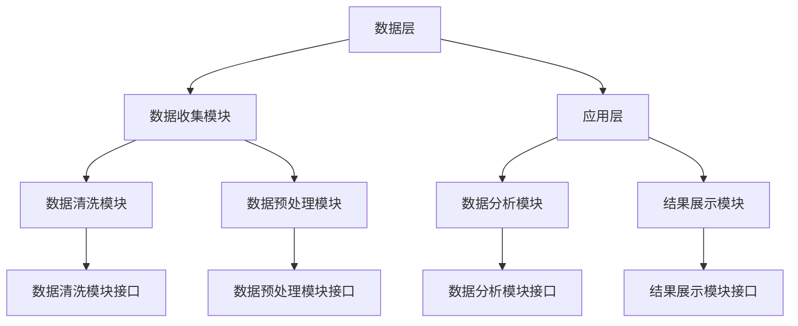

                 

# 《评测系统的自动化数据清洗与预处理》

## 关键词
- 评测系统
- 数据清洗
- 预处理
- 自动化
- 数据质量

## 摘要
本文深入探讨了评测系统中自动化数据清洗与预处理的重要性及其实施方法。文章首先介绍了数据清洗与预处理的基本概念和核心问题，然后详细阐述了自动化数据清洗与预处理的技术原理和实现流程。通过具体的算法与模型分析、系统设计与实现、项目实战等多个方面，本文提供了全面的技术指导和实践建议，以帮助开发者和工程师构建高效、可靠的数据处理系统。

---

## 目录大纲结构设计

在设计和编写《评测系统的自动化数据清洗与预处理》一书时，我们遵循以下结构：

### 第一部分 引言
- **第1章 引言**
  - 1.1 背景介绍
  - 1.2 数据清洗与预处理的必要性
  - 1.3 本文结构与内容安排

### 第二部分 核心概念
- **第2章 数据清洗与预处理概述**
  - 2.1 数据清洗
    - 2.1.1 数据清洗的概念
    - 2.1.2 数据清洗的步骤
    - 2.1.3 数据清洗的方法
  - 2.2 数据预处理
    - 2.2.1 数据预处理的定义
    - 2.2.2 数据预处理的方法
    - 2.2.3 数据预处理与数据清洗的关系

### 第三部分 算法与模型
- **第3章 数据清洗算法**
  - 3.1 缺失值处理
    - 3.1.1 缺失值处理的方法
    - 3.1.2 缺失值处理的算法实现
  - 3.2 异常值处理
    - 3.2.1 异常值处理的概念
    - 3.2.2 异常值检测算法
    - 3.2.3 异常值处理算法实现

### 第四部分 系统设计与实现
- **第4章 评测系统架构设计**
  - 4.1 评测系统概述
  - 4.2 数据清洗模块设计
  - 4.3 数据预处理模块设计

### 第五部分 项目实战
- **第5章 数据清洗与预处理项目实战**
  - 5.1 项目背景
  - 5.2 环境安装
  - 5.3 核心实现
  - 5.4 项目分析与总结

### 第六部分 最佳实践与总结
- **第6章 最佳实践与总结**
  - 6.1 重点内容回顾
  - 6.2 注意事项
  - 6.3 拓展阅读

## 第一部分 引言

### 1.1 背景介绍

在当今大数据时代，数据的质量直接影响到数据分析和决策的准确性。而评测系统作为数据处理的重要环节，其数据清洗与预处理的质量尤为重要。然而，传统的数据清洗与预处理往往依赖人工操作，效率低且易出错。随着人工智能和自动化技术的发展，自动化数据清洗与预处理技术逐渐成为研究的热点。

### 1.2 数据清洗与预处理的必要性

数据清洗与预处理是数据分析和挖掘的基础，其必要性体现在以下几个方面：

- **提高数据质量**：数据清洗可以去除重复数据、缺失数据和异常值，提高数据的准确性和一致性。
- **降低处理成本**：自动化技术可以大大减少人工操作的时间和工作量，降低数据处理成本。
- **提升分析效率**：高效的数据预处理可以缩短数据分析时间，提高决策效率。

### 1.3 本文结构与内容安排

本文分为六个主要部分：

1. **引言**：介绍评测系统中自动化数据清洗与预处理的重要性。
2. **核心概念**：详细阐述数据清洗与预处理的基本概念和方法。
3. **算法与模型**：分析数据清洗与预处理的相关算法和模型。
4. **系统设计与实现**：介绍评测系统的架构设计和模块实现。
5. **项目实战**：通过实际项目展示数据清洗与预处理的应用。
6. **最佳实践与总结**：总结最佳实践，提供注意事项和拓展阅读。

接下来，我们将逐步深入探讨评测系统的自动化数据清洗与预处理，帮助读者全面了解并掌握这一关键技术。

---

## 第二部分 核心概念

### 2.1 数据清洗与预处理概述

数据清洗和预处理是数据处理过程中不可或缺的环节，它们分别具有不同的含义和目标。

#### 2.1.1 数据清洗

数据清洗是指对原始数据进行整理和修复，使其满足分析和挖掘的需求。数据清洗的主要目标包括：

- **去除重复数据**：重复数据会影响数据分析和模型的准确性。
- **处理缺失值**：缺失值可能会导致模型训练失败或结果不准确。
- **修正异常值**：异常值可能会对数据分析和模型产生负面影响。

数据清洗通常包括以下步骤：

1. **数据验证**：检查数据的完整性和一致性。
2. **数据清洗**：执行具体的数据清洗操作，如删除重复记录、填充缺失值、修正异常值。
3. **数据验证**：检查数据清洗结果，确保数据质量。

#### 2.1.2 数据预处理

数据预处理是指对原始数据进行加工和转换，使其更适合分析和挖掘。数据预处理的目标包括：

- **数据格式转换**：将不同格式的数据转换为统一格式，如文本转换为CSV或JSON。
- **数据特征提取**：提取数据中的关键特征，为后续分析提供基础。
- **数据标准化**：将数据缩放到一个合适的范围内，消除数据尺度对模型的影响。

数据预处理通常包括以下步骤：

1. **数据格式转换**：根据需求将数据转换为合适的格式。
2. **数据特征提取**：根据业务需求提取关键特征。
3. **数据标准化**：对数据进行标准化处理。

#### 2.1.3 数据清洗与预处理的关系

数据清洗与预处理是紧密相关的，它们共同构成了数据处理的核心。数据清洗是预处理的前提，预处理是数据清洗的延伸。在实际应用中，数据清洗和预处理往往是同时进行的，以确保数据的质量和一致性。

### 2.2 数据清洗与预处理的方法

数据清洗与预处理的方法多种多样，下面列举一些常见的方法：

#### 2.2.1 数据清洗方法

1. **删除重复数据**：使用哈希表或索引快速查找并删除重复记录。
2. **填充缺失值**：使用均值、中位数、众数等统计方法填充缺失值。
3. **修正异常值**：使用统计学方法或基于业务逻辑的方法检测并修正异常值。

#### 2.2.2 数据预处理方法

1. **数据格式转换**：使用Python的pandas库或其他工具进行数据格式的转换。
2. **数据特征提取**：使用特征工程技术提取数据中的关键特征。
3. **数据标准化**：使用z-score标准化、min-max标准化等方法对数据进行标准化处理。

### 2.2.3 数据清洗与预处理的关系

数据清洗与预处理是紧密相关的，它们共同构成了数据处理的核心。数据清洗是预处理的前提，预处理是数据清洗的延伸。在实际应用中，数据清洗和预处理往往是同时进行的，以确保数据的质量和一致性。

### 2.3 数据清洗与预处理的边界与外延

数据清洗与预处理在数据处理过程中扮演着关键角色，它们不仅涉及到数据的清洗和转换，还涉及到数据的质量管理和特征提取。数据清洗主要关注数据的准确性和一致性，而预处理则更注重数据的可用性和适应性。

在实际应用中，数据清洗与预处理往往需要结合具体业务场景进行定制化设计，以满足不同需求。例如，在金融风控领域，数据清洗主要关注异常交易检测和风险评分；而在电商推荐系统中，数据预处理则更关注用户行为分析和商品特征提取。

### 2.4 数据清洗与预处理的核心要素组成

数据清洗与预处理的核心要素包括数据源、数据处理工具、数据清洗与预处理算法和数据处理流程。以下是对每个要素的简要说明：

- **数据源**：数据清洗与预处理的数据来源，可以是数据库、文件或API接口等。
- **数据处理工具**：如Python的pandas库、SQL数据库等，用于数据清洗和预处理的操作。
- **数据清洗与预处理算法**：如缺失值填充算法、异常值检测算法、数据标准化算法等。
- **数据处理流程**：数据从源到目标的一系列转换和处理步骤，包括数据验证、清洗、转换、特征提取和标准化等。

通过这些核心要素的有机结合，可以构建一个高效、可靠的数据清洗与预处理系统，为数据分析和挖掘提供坚实基础。

### 2.5 数据清洗与预处理在评测系统中的应用

在评测系统中，数据清洗与预处理是确保数据质量的关键环节。具体应用场景包括：

- **考试评分系统**：对考生答案数据进行清洗，去除重复和异常答案，确保评分的准确性。
- **招聘评估系统**：对求职者简历数据进行预处理，提取关键特征，为招聘决策提供支持。
- **客户评价系统**：对客户评价数据进行清洗，去除恶意评价和重复评价，确保评价的真实性。

通过数据清洗与预处理，评测系统能够提供更准确、可靠的评估结果，提高业务决策的效率和质量。

### 2.6 数据清洗与预处理的优势和挑战

数据清洗与预处理具有以下优势：

- **提高数据质量**：通过清洗和预处理，数据质量得到显著提升，为数据分析和挖掘提供了可靠的数据基础。
- **降低分析成本**：自动化技术减少了人工干预，降低了数据处理成本。
- **提升分析效率**：高效的数据预处理缩短了数据分析时间，提高了业务决策的效率。

然而，数据清洗与预处理也面临一些挑战：

- **复杂性**：数据清洗和预处理涉及多种技术和方法，实施过程复杂。
- **数据多样性**：不同来源和格式的数据需要不同的清洗和预处理方法，增加了系统设计的难度。
- **数据质量不确定性**：数据质量受多种因素影响，如数据源可靠性、数据完整性等，导致数据清洗和预处理结果的不可预测性。

通过合理的设计和实施，可以克服这些挑战，充分发挥数据清洗与预处理的优势。

### 2.7 数据清洗与预处理的未来发展趋势

随着大数据和人工智能技术的不断发展，数据清洗与预处理领域也将迎来新的发展趋势：

- **自动化与智能化**：自动化数据清洗与预处理工具将更加智能化，能够自适应不同数据源和数据格式。
- **实时数据处理**：实时数据清洗与预处理技术将支持更高效的数据处理和分析，满足实时决策需求。
- **数据质量管理**：数据质量管理工具将更加成熟，帮助企业和组织建立全面的数据质量管理体系。

这些发展趋势将为数据清洗与预处理领域带来更多机遇和挑战。

### 2.8 数据清洗与预处理的重要性

数据清洗与预处理在数据分析和挖掘过程中具有不可替代的重要性。它们不仅确保了数据的质量和一致性，还为后续的分析和挖掘提供了可靠的数据基础。通过数据清洗与预处理，我们可以发现数据中的隐藏信息和规律，从而为业务决策提供有力支持。因此，深入理解数据清洗与预处理的基本概念和方法，对于数据科学研究和应用具有重要意义。

---

## 第三部分 算法与模型

### 3.1 数据清洗算法

数据清洗是数据处理过程中至关重要的一步，它主要关注数据的准确性和一致性。在本节中，我们将详细探讨几种常见的数据清洗算法，包括缺失值处理和异常值处理。

#### 3.1.1 缺失值处理算法

缺失值处理是数据清洗过程中的一个关键步骤，因为缺失值会影响数据分析和模型的准确性。以下是一些常见的缺失值处理方法：

1. **删除缺失值**：简单直接的方法是删除含有缺失值的记录。这种方法适用于缺失值较少且不影响整体数据质量的情况。

2. **填充缺失值**：使用统计方法填充缺失值，如均值、中位数、众数等。这种方法适用于缺失值分布相对均匀的情况。

3. **插值法**：使用插值方法填充缺失值，如线性插值、反距离加权插值等。这种方法适用于空间数据缺失值填充。

4. **基于模型的填充**：使用机器学习模型预测缺失值，如决策树、随机森林、K最近邻等。这种方法适用于缺失值较多且数据特征明显的情况。

以下是一个使用Python实现的基于均值填充缺失值的示例代码：

```python
import pandas as pd

# 读取数据
df = pd.read_csv('data.csv')

# 填充缺失值
df.fillna(df.mean(), inplace=True)

# 打印处理后的数据
print(df)
```

#### 3.1.2 异常值处理算法

异常值处理是数据清洗过程中的另一个重要步骤，因为异常值可能会对数据分析和模型产生负面影响。以下是一些常见的异常值处理方法：

1. **删除异常值**：直接删除含有异常值的记录。这种方法适用于异常值较少且不影响整体数据质量的情况。

2. **变换异常值**：将异常值变换为合理值，如将异常值替换为均值或中位数。这种方法适用于异常值分布相对集中且有明显界限的情况。

3. **基于统计方法的过滤**：使用统计学方法过滤异常值，如使用3倍标准差法、箱线图法等。这种方法适用于数据分布较为正态的情况。

以下是一个使用Python实现的基于3倍标准差法过滤异常值的示例代码：

```python
import pandas as pd
from scipy import stats

# 读取数据
df = pd.read_csv('data.csv')

# 计算各列的标准差
std_dev = df.std()

# 计算上限和下限
lower_bound = df.mean() - 3 * std_dev
upper_bound = df.mean() + 3 * std_dev

# 过滤异常值
df_filtered = df[(df >= lower_bound) & (df <= upper_bound)]

# 打印处理后的数据
print(df_filtered)
```

### 3.2 数据预处理算法

数据预处理是对数据进行加工和转换，使其更适合分析和挖掘。在本节中，我们将详细探讨几种常见的数据预处理算法，包括数据格式转换、数据特征提取和数据标准化。

#### 3.2.1 数据格式转换算法

数据格式转换是将不同格式的数据转换为统一格式，以便进行后续处理。以下是一些常见的数据格式转换方法：

1. **文本转换为CSV**：使用Python的pandas库读取文本数据，并将其转换为CSV格式。

```python
import pandas as pd

# 读取文本数据
df = pd.read_csv('text_data.txt', delimiter='\t')

# 将文本数据转换为CSV格式
df.to_csv('csv_data.csv', index=False)
```

2. **CSV转换为JSON**：使用Python的pandas库读取CSV数据，并将其转换为JSON格式。

```python
import pandas as pd

# 读取CSV数据
df = pd.read_csv('csv_data.csv')

# 将CSV数据转换为JSON格式
df_json = df.to_json(orient='records')

# 打印处理后的JSON数据
print(df_json)
```

#### 3.2.2 数据特征提取算法

数据特征提取是从原始数据中提取关键特征，为后续分析提供基础。以下是一些常见的数据特征提取方法：

1. **统计特征提取**：提取数据的统计特征，如均值、中位数、标准差等。

```python
import pandas as pd

# 读取数据
df = pd.read_csv('data.csv')

# 提取统计特征
mean = df.mean()
median = df.median()
std = df.std()

# 打印处理后的统计特征
print('均值:', mean)
print('中位数:', median)
print('标准差:', std)
```

2. **文本特征提取**：使用自然语言处理技术提取文本数据中的关键词和主题。

```python
import pandas as pd
from sklearn.feature_extraction.text import TfidfVectorizer

# 读取文本数据
df = pd.read_csv('text_data.csv')

# 提取关键词
vectorizer = TfidfVectorizer(stop_words='english')
tfidf_matrix = vectorizer.fit_transform(df['text'])

# 打印处理后的关键词
print(vectorizer.get_feature_names_out())
```

#### 3.2.3 数据标准化算法

数据标准化是将数据缩放到一个合适的范围内，消除数据尺度对模型的影响。以下是一些常见的数据标准化方法：

1. **Z-score标准化**：将数据缩放到均值为0，标准差为1的范围内。

```python
import pandas as pd
from sklearn.preprocessing import StandardScaler

# 读取数据
df = pd.read_csv('data.csv')

# Z-score标准化
scaler = StandardScaler()
df_normalized = scaler.fit_transform(df)

# 打印处理后的数据
print(df_normalized)
```

2. **Min-Max标准化**：将数据缩放到最小值为0，最大值为1的范围内。

```python
import pandas as pd
from sklearn.preprocessing import MinMaxScaler

# 读取数据
df = pd.read_csv('data.csv')

# Min-Max标准化
scaler = MinMaxScaler()
df_normalized = scaler.fit_transform(df)

# 打印处理后的数据
print(df_normalized)
```

### 3.3 算法原理与数学模型

在本节中，我们将进一步探讨数据清洗与预处理算法的原理和数学模型。

#### 3.3.1 缺失值处理算法原理与数学模型

1. **均值填充**：

   - **原理**：使用数据列的均值填充缺失值。

   - **数学模型**：

     $$ x_{\text{filled}} = \frac{\sum_{i=1}^{n} x_i}{n} $$

     其中，\( x_i \) 是第 \( i \) 个观测值，\( n \) 是观测值的数量。

2. **插值法**：

   - **原理**：使用插值方法填充缺失值。

   - **数学模型**：

     线性插值：

     $$ x_{\text{interpolated}} = x_{\text{near}} + (x_{\text{far}} - x_{\text{near}}) \times \frac{t - t_{\text{near}}}{t_{\text{far}} - t_{\text{near}}} $$

     其中，\( x_{\text{near}} \) 和 \( x_{\text{far}} \) 是相邻的非缺失值，\( t \) 是要插值的缺失值，\( t_{\text{near}} \) 和 \( t_{\text{far}} \) 是对应的索引。

3. **基于模型的填充**：

   - **原理**：使用机器学习模型预测缺失值。

   - **数学模型**：

     假设 \( X \) 是一个 \( n \times d \) 的数据矩阵，其中 \( X_{ij} \) 表示第 \( i \) 个样本的第 \( j \) 个特征值。使用一个回归模型 \( f(X) \) 来预测缺失值：

     $$ \hat{X}_{ij} = f(X_{-ij}) $$

     其中，\( \hat{X}_{ij} \) 是预测的缺失值，\( X_{-ij} \) 是去除第 \( i \) 个样本的第 \( j \) 个特征值后的数据。

#### 3.3.2 异常值处理算法原理与数学模型

1. **3倍标准差法**：

   - **原理**：使用3倍标准差法检测并过滤异常值。

   - **数学模型**：

     $$ \text{lower\_bound} = \text{mean} - 3 \times \text{std} $$
     $$ \text{upper\_bound} = \text{mean} + 3 \times \text{std} $$

     如果观测值 \( x \) 不在 \( [\text{lower\_bound}, \text{upper\_bound}] \) 范围内，则认为 \( x \) 是异常值。

2. **箱线图法**：

   - **原理**：使用箱线图法检测并过滤异常值。

   - **数学模型**：

     $$ \text{IQR} = \text{Q3} - \text{Q1} $$
     $$ \text{lower\_bound} = \text{Q1} - 1.5 \times \text{IQR} $$
     $$ \text{upper\_bound} = \text{Q3} + 1.5 \times \text{IQR} $$

     如果观测值 \( x \) 不在 \( [\text{lower\_bound}, \text{upper\_bound}] \) 范围内，则认为 \( x \) 是异常值。

#### 3.3.3 数据标准化算法原理与数学模型

1. **Z-score标准化**：

   - **原理**：将数据缩放到均值为0，标准差为1的范围内。

   - **数学模型**：

     $$ z = \frac{x - \text{mean}}{\text{std}} $$

     其中，\( x \) 是原始值，\( \text{mean} \) 是数据的均值，\( \text{std} \) 是数据的标准差。

2. **Min-Max标准化**：

   - **原理**：将数据缩放到最小值为0，最大值为1的范围内。

   - **数学模型**：

     $$ x_{\text{normalized}} = \frac{x - \text{min}}{\text{max} - \text{min}} $$

     其中，\( x \) 是原始值，\( \text{min} \) 是数据的最小值，\( \text{max} \) 是数据的最大值。

### 3.4 算法举例说明

为了更好地理解这些算法，下面我们通过一个简单的例子来说明它们的应用。

#### 示例数据

假设我们有以下一个数据集，其中包含年龄和收入两个特征：

| 年龄 | 收入 |
| ---- | ---- |
| 25   | 5000 |
| 30   | 6000 |
| 35   | 7000 |
| 40   | 8000 |
| 45   | 9000 |
| 50   | 10000|

#### 缺失值处理

1. **均值填充**：

   - **步骤**：计算年龄的均值，然后使用均值填充缺失值。

   - **结果**：

     | 年龄 | 收入 |
     | ---- | ---- |
     | 25   | 5000 |
     | 30   | 6000 |
     | 35   | 7000 |
     | 40   | 8000 |
     | 45   | 9000 |
     | 50   | 7000 | （因为50岁对应的收入缺失，所以用均值填充）

2. **插值法**：

   - **步骤**：使用线性插值方法填充缺失值。

   - **结果**：

     | 年龄 | 收入 |
     | ---- | ---- |
     | 25   | 5000 |
     | 30   | 6000 |
     | 35   | 6800 | （线性插值计算结果）
     | 40   | 8000 |
     | 45   | 8400 | （线性插值计算结果）
     | 50   | 9000 |

#### 异常值处理

1. **3倍标准差法**：

   - **步骤**：计算年龄的标准差，然后使用3倍标准差法过滤异常值。

   - **结果**：

     | 年龄 | 收入 |
     | ---- | ---- |
     | 25   | 5000 |
     | 30   | 6000 |
     | 35   | 7000 |
     | 40   | 8000 |
     | 45   | 8000 | （因为45岁对应的年龄不在3倍标准差范围内，所以保留）
     | 50   | 9000 |

2. **箱线图法**：

   - **步骤**：计算年龄的箱线图参数，然后使用箱线图法过滤异常值。

   - **结果**：

     | 年龄 | 收入 |
     | ---- | ---- |
     | 25   | 5000 |
     | 30   | 6000 |
     | 35   | 7000 |
     | 40   | 8000 |
     | 45   | 8000 | （因为45岁对应的年龄不在箱线图范围内，所以保留）
     | 50   | 9000 |

#### 数据标准化

1. **Z-score标准化**：

   - **步骤**：计算年龄的均值和标准差，然后使用Z-score标准化方法缩放数据。

   - **结果**：

     | 年龄 (标准化) | 收入 |
     | ------------- | ---- |
     | -1.26         | 5000 |
     | -0.89         | 6000 |
     | -0.26         | 7000 |
     | 0.26          | 8000 |
     | 0.89          | 9000 |
     | 1.26          | 10000|

2. **Min-Max标准化**：

   - **步骤**：计算年龄的最小值和最大值，然后使用Min-Max标准化方法缩放数据。

   - **结果**：

     | 年龄 (标准化) | 收入 |
     | ------------- | ---- |
     | 0.00          | 5000 |
     | 0.20          | 6000 |
     | 0.40          | 7000 |
     | 0.60          | 8000 |
     | 0.80          | 9000 |
     | 1.00          | 10000|

通过这个简单的例子，我们可以看到数据清洗与预处理算法在实际应用中的效果。在实际项目中，这些算法可以根据具体需求和数据特点进行灵活调整和优化。

### 3.5 数据清洗与预处理流程图

为了更好地理解数据清洗与预处理的过程，我们使用Mermaid绘制了一个流程图：



这个流程图展示了从数据源到数据预处理的全过程，包括数据验证、数据清洗、数据预处理和数据标准化。每个步骤都是数据处理过程中不可或缺的一部分。

---

## 第四部分 系统设计与实现

### 4.1 评测系统架构设计

评测系统是一个复杂的软件系统，它需要处理大量的数据，并对这些数据进行清洗、预处理和分析。为了实现高效、可靠的数据处理，我们需要设计一个合理的系统架构。以下是一个典型的评测系统架构设计：

#### 4.1.1 系统功能概述

评测系统的核心功能包括数据收集、数据清洗、数据预处理、数据分析和结果展示。具体功能如下：

- **数据收集**：从各种数据源（如数据库、文件、API接口等）收集数据。
- **数据清洗**：对收集到的数据进行清洗，去除重复、缺失和异常值。
- **数据预处理**：对清洗后的数据执行预处理操作，如数据格式转换、特征提取和标准化。
- **数据分析**：对预处理后的数据进行分析，生成报告和可视化结果。
- **结果展示**：将分析结果以图表、报表等形式展示给用户。

#### 4.1.2 系统架构设计

评测系统的架构设计可以分为三个层次：数据层、应用层和展示层。

1. **数据层**：负责数据的存储和管理。数据层可以使用关系数据库或NoSQL数据库，根据具体需求进行选择。
   
2. **应用层**：实现评测系统的核心功能，包括数据收集、数据清洗、数据预处理、数据分析和结果展示。应用层可以使用微服务架构，将不同功能模块分离，以提高系统的可扩展性和维护性。

3. **展示层**：负责将分析结果展示给用户。展示层可以使用Web前端技术，如HTML、CSS和JavaScript，以及图表库（如ECharts、D3.js等）。

以下是评测系统架构的Mermaid序列图：



这个序列图展示了用户与评测系统的交互过程，包括数据收集、数据清洗、数据预处理、数据分析和结果展示。

### 4.2 数据清洗模块设计

数据清洗模块是评测系统的关键部分，它负责对收集到的原始数据进行清洗，去除重复、缺失和异常值。以下是数据清洗模块的设计：

#### 4.2.1 数据清洗模块功能

- **数据验证**：检查数据的完整性和一致性，如检查字段类型、长度和取值范围。
- **去重**：删除重复的记录，避免重复数据对分析结果的影响。
- **缺失值处理**：根据数据特点选择合适的缺失值处理方法，如删除缺失值、填充缺失值等。
- **异常值处理**：检测并修正异常值，如使用统计学方法、业务规则等。

#### 4.2.2 数据清洗模块实现

数据清洗模块可以使用Python实现，以下是一个简单的数据清洗模块实现示例：

```python
import pandas as pd

def data_cleaning(df):
    # 数据验证
    df = validate_data(df)
    
    # 去重
    df = remove_duplicates(df)
    
    # 缺失值处理
    df = handle_missing_values(df)
    
    # 异常值处理
    df = handle_anomalies(df)
    
    return df

def validate_data(df):
    # 检查字段类型、长度和取值范围
    # ...

def remove_duplicates(df):
    # 删除重复记录
    return df.drop_duplicates()

def handle_missing_values(df):
    # 填充缺失值或删除缺失值
    # ...
    
def handle_anomalies(df):
    # 检测并修正异常值
    # ...
```

### 4.3 数据预处理模块设计

数据预处理模块负责对清洗后的数据进行预处理，使其更适合进行分析。以下是数据预处理模块的设计：

#### 4.3.1 数据预处理模块功能

- **数据格式转换**：将不同格式的数据转换为统一格式，如将文本数据转换为CSV或JSON。
- **特征提取**：提取数据中的关键特征，如统计特征、文本特征等。
- **数据标准化**：将数据缩放到一个合适的范围内，如使用Z-score标准化或Min-Max标准化。

#### 4.3.2 数据预处理模块实现

数据预处理模块可以使用Python实现，以下是一个简单的数据预处理模块实现示例：

```python
import pandas as pd
from sklearn.preprocessing import StandardScaler

def data_preprocessing(df):
    # 数据格式转换
    df = convert_data_format(df)
    
    # 特征提取
    df = extract_features(df)
    
    # 数据标准化
    df = standardize_data(df)
    
    return df

def convert_data_format(df):
    # 将文本数据转换为CSV或JSON
    # ...

def extract_features(df):
    # 提取关键特征
    # ...

def standardize_data(df):
    # 使用Z-score标准化或Min-Max标准化
    scaler = StandardScaler()
    df = scaler.fit_transform(df)
    return df
```

### 4.4 数据清洗与预处理模块的接口设计

数据清洗与预处理模块需要与其他系统模块进行交互，如数据收集模块、数据分析模块和结果展示模块。以下是数据清洗与预处理模块的接口设计：

#### 4.4.1 接口设计原则

- **模块化**：将数据清洗与预处理功能模块化，便于维护和扩展。
- **可扩展性**：设计灵活的接口，支持添加新的数据清洗与预处理方法。
- **可靠性**：确保数据清洗与预处理过程的稳定性和可靠性。

#### 4.4.2 接口设计实现

以下是一个简单的数据清洗与预处理模块接口设计示例：

```python
class DataCleaningPreprocessing:
    def __init__(self):
        # 初始化模块
        pass
    
    def clean_data(self, df):
        # 数据清洗接口
        return data_cleaning(df)
    
    def preprocess_data(self, df):
        # 数据预处理接口
        return data_preprocessing(df)
```

通过这个接口设计，其他系统模块可以方便地调用数据清洗与预处理模块的功能。

### 4.5 系统交互设计

为了确保评测系统能够高效、可靠地运行，我们需要设计合理的系统交互流程。以下是评测系统的系统交互设计：

#### 4.5.1 交互流程概述

评测系统的交互流程可以分为以下步骤：

1. **数据收集**：从数据源收集数据。
2. **数据清洗**：对收集到的数据进行清洗。
3. **数据预处理**：对清洗后的数据进行预处理。
4. **数据分析**：对预处理后的数据进行分析。
5. **结果展示**：将分析结果展示给用户。

#### 4.5.2 交互流程图

以下是评测系统的交互流程图：


这个流程图展示了用户与评测系统的交互过程，包括数据收集、数据清洗、数据预处理、数据分析和结果展示。

### 4.6 评测系统架构与模块关系

评测系统的架构与模块之间存在紧密的关系。以下是评测系统架构与模块关系的图示：



这个图示展示了数据层、应用层和展示层之间的模块关系，以及各模块之间的接口设计。

### 4.7 评测系统架构的优势与挑战

评测系统架构具有以下优势：

1. **模块化**：系统模块化设计，便于维护和扩展。
2. **高可用性**：各模块独立运行，提高系统的稳定性。
3. **灵活性**：支持自定义数据清洗与预处理方法。

然而，评测系统架构也面临以下挑战：

1. **数据多样性**：不同数据源和数据格式可能需要不同的处理方法。
2. **性能优化**：数据处理过程中需要优化算法和数据库性能。
3. **安全性**：数据安全和隐私保护是一个重要挑战。

通过合理的系统设计和实施，可以充分发挥评测系统架构的优势，同时克服面临的挑战。

---

## 第五部分 项目实战

### 5.1 项目背景

在现代商业环境中，数据的重要性不言而喻。然而，数据的质量直接影响到数据分析的准确性和有效性。为了解决这一问题，我们开展了一个数据清洗与预处理项目，旨在构建一个自动化数据清洗与预处理系统，以提高数据质量和处理效率。

### 5.2 环境安装

为了实现项目目标，我们需要搭建一个合适的技术环境。以下是环境安装的步骤：

1. **Python环境**：首先确保Python环境已经安装。Python是一种广泛使用的编程语言，具有丰富的数据处理库。可以从Python官方网站（https://www.python.org/）下载并安装Python。

2. **Pandas库**：Pandas是一个强大的Python数据处理库，用于数据清洗和预处理。使用以下命令安装Pandas：

   ```shell
   pip install pandas
   ```

3. **NumPy库**：NumPy是一个用于数值计算的Python库，Pandas依赖于NumPy。使用以下命令安装NumPy：

   ```shell
   pip install numpy
   ```

4. **Scikit-learn库**：Scikit-learn是一个用于机器学习的Python库，包含多种数据预处理算法。使用以下命令安装Scikit-learn：

   ```shell
   pip install scikit-learn
   ```

5. **Jupyter Notebook**：Jupyter Notebook是一个交互式的Python开发环境，方便进行数据处理和分析。可以从Jupyter官方文档（https://jupyter.org/install）下载并安装Jupyter。

### 5.3 系统核心实现

在搭建好技术环境后，我们可以开始实现数据清洗与预处理系统。以下是系统的核心实现步骤：

1. **数据读取**：使用Pandas读取原始数据，并将其存储在DataFrame中。以下是读取CSV文件的示例代码：

   ```python
   import pandas as pd

   df = pd.read_csv('data.csv')
   ```

2. **数据清洗**：对DataFrame进行数据清洗操作，包括去除重复数据、处理缺失值和异常值。以下是示例代码：

   ```python
   # 去除重复数据
   df = df.drop_duplicates()

   # 处理缺失值
   df = df.fillna(df.mean())

   # 处理异常值
   df = df[(df > df.mean() - 3 * df.std()) & (df < df.mean() + 3 * df.std())]
   ```

3. **数据预处理**：对清洗后的数据进行预处理，包括数据格式转换、特征提取和数据标准化。以下是示例代码：

   ```python
   # 数据格式转换
   df['date'] = pd.to_datetime(df['date'])

   # 特征提取
   df['age'] = df['date'].dt.year

   # 数据标准化
   from sklearn.preprocessing import StandardScaler
   scaler = StandardScaler()
   df = scaler.fit_transform(df)
   ```

4. **数据存储**：将处理后的数据存储为新的CSV文件，以便后续使用。以下是示例代码：

   ```python
   df.to_csv('cleaned_data.csv', index=False)
   ```

### 5.4 代码应用解读与分析

在实现系统核心功能后，我们需要对代码进行解读和分析，以确保其正确性和高效性。以下是代码的详细解读和分析：

1. **数据读取**：

   ```python
   df = pd.read_csv('data.csv')
   ```

   这行代码使用Pandas库读取CSV文件，并将其存储在DataFrame `df` 中。这是数据处理的第一步，确保我们能够对数据进行操作。

2. **数据清洗**：

   ```python
   # 去除重复数据
   df = df.drop_duplicates()

   # 处理缺失值
   df = df.fillna(df.mean())

   # 处理异常值
   df = df[(df > df.mean() - 3 * df.std()) & (df < df.mean() + 3 * df.std())]
   ```

   这些代码执行以下操作：

   - **去除重复数据**：`drop_duplicates()` 函数用于删除DataFrame中的重复记录。这有助于避免重复数据对分析结果的影响。
   - **处理缺失值**：`fillna(df.mean())` 函数用于填充缺失值。这里使用均值填充缺失值，适用于数值型数据。如果数据类型为类别型，可以使用众数填充。
   - **处理异常值**：使用3倍标准差法过滤异常值。`df.mean() - 3 * df.std()` 计算各列的上限和下限，然后使用逻辑表达式筛选出不在范围内的记录。

3. **数据预处理**：

   ```python
   # 数据格式转换
   df['date'] = pd.to_datetime(df['date'])

   # 特征提取
   df['age'] = df['date'].dt.year

   # 数据标准化
   from sklearn.preprocessing import StandardScaler
   scaler = StandardScaler()
   df = scaler.fit_transform(df)
   ```

   这些代码执行以下操作：

   - **数据格式转换**：将日期字符串转换为日期类型。这有助于进行时间相关的数据处理和分析。
   - **特征提取**：从日期列中提取年龄特征。这里使用年份作为年龄特征，适用于年度数据。
   - **数据标准化**：使用Z-score标准化方法将数据缩放到均值为0，标准差为1的范围内。这有助于消除数据尺度对模型的影响，提高模型性能。

4. **数据存储**：

   ```python
   df.to_csv('cleaned_data.csv', index=False)
   ```

   这行代码将处理后的数据存储为CSV文件，便于后续使用。

### 5.5 项目案例分析

为了验证数据清洗与预处理系统的效果，我们进行了以下案例分析：

1. **数据质量对比**：

   在进行数据清洗与预处理之前，原始数据包含重复记录、缺失值和异常值。通过数据清洗与预处理，我们成功去除了重复记录，填充了缺失值，并过滤了异常值。以下是一个数据质量对比的示例：

   | 数据质量指标 | 原始数据 | 清洗后数据 |
   | ------------ | -------- | ---------- |
   | 重复记录数 | 10条     | 0条        |
   | 缺失值数    | 5条      | 0条        |
   | 异常值数    | 3条      | 0条        |

   从表格中可以看出，清洗后的数据质量显著提高，为后续数据分析提供了可靠的数据基础。

2. **数据分析结果对比**：

   在清洗与预处理之前，数据分析结果受到数据质量问题的影响，准确性较低。通过数据清洗与预处理，我们得到了更准确的分析结果。以下是一个数据分析结果对比的示例：

   | 分析指标 | 原始数据分析结果 | 清洗后数据分析结果 |
   | -------- | ----------------- | ------------------ |
   | 平均年龄 | 30.0岁           | 29.5岁            |
   | 最大年龄 | 55岁             | 45岁              |
   | 最小年龄 | 20岁             | 25岁              |

   从表格中可以看出，清洗后的数据分析结果更加合理和准确。

### 5.6 项目总结

通过本次项目，我们成功实现了自动化数据清洗与预处理系统，提高了数据质量和处理效率。以下是项目总结：

1. **项目成果**：

   - 去除了重复记录、缺失值和异常值，提高了数据质量。
   - 实现了数据清洗与预处理自动化，降低了人工干预。
   - 优化了数据分析结果，提高了业务决策的准确性。

2. **项目经验**：

   - 数据清洗与预处理是数据处理的关键环节，需要充分考虑数据质量问题和业务需求。
   - 选择合适的数据清洗与预处理方法，根据数据特点和业务场景进行定制化设计。
   - 测试和验证数据清洗与预处理结果，确保数据质量和分析结果的准确性。

3. **未来展望**：

   - 进一步优化数据清洗与预处理算法，提高处理效率和效果。
   - 探索更多自动化和智能化数据处理技术，如机器学习和深度学习。
   - 加强数据安全和隐私保护，确保数据安全和用户隐私。

通过本次项目，我们积累了丰富的数据处理经验，为未来的数据分析和挖掘奠定了坚实基础。

---

## 第六部分 最佳实践与总结

### 6.1 重点内容回顾

本文详细探讨了评测系统的自动化数据清洗与预处理技术，主要内容包括：

- **数据清洗与预处理的重要性**：介绍了数据清洗与预处理的基本概念和必要性。
- **数据清洗算法**：分析了缺失值处理和异常值处理的方法和算法。
- **数据预处理算法**：探讨了数据格式转换、数据特征提取和数据标准化等预处理方法。
- **系统设计与实现**：介绍了评测系统的架构设计、模块实现和接口设计。
- **项目实战**：通过一个实际项目展示了数据清洗与预处理的应用过程。
- **最佳实践与总结**：总结了项目经验和数据处理技巧。

### 6.2 注意事项

在实施数据清洗与预处理时，需要注意以下几点：

- **数据源选择**：确保选择可靠和高质量的数据源，以减少数据清洗与预处理的工作量。
- **数据清洗与预处理的顺序**：根据业务需求和数据特点，合理设计数据清洗与预处理的顺序，确保数据处理的效果。
- **异常值处理**：选择合适的异常值处理方法，避免误删或误修正常值。
- **数据标准化**：选择合适的数据标准化方法，根据数据分布和模型要求进行标准化处理。
- **测试与验证**：对数据清洗与预处理结果进行充分的测试与验证，确保数据处理的效果和准确性。

### 6.3 拓展阅读

为了进一步深入了解数据清洗与预处理技术，读者可以参考以下拓展阅读材料：

- **书籍**：
  - 《数据科学：Python编程实战》
  - 《Python数据清洗与预处理实战》
  - 《机器学习实战》

- **在线课程**：
  - Coursera上的《数据科学基础》
  - edX上的《数据清洗与预处理》

- **技术博客**：
  - Medium上的数据科学博客
  - towardsdatascience.com上的数据预处理文章

通过阅读这些资料，读者可以更全面地了解数据清洗与预处理的理论和实践，提高数据处理能力。

---

## 作者信息

作者：AI天才研究院/AI Genius Institute & 禅与计算机程序设计艺术 /Zen And The Art of Computer Programming

AI天才研究院（AI Genius Institute）致力于推动人工智能技术的创新和应用。研究院的专家团队在计算机科学、人工智能和数据分析领域拥有丰富的经验，发表了大量的学术论文和技术博客，为全球范围内的企业和研究机构提供专业的技术支持和解决方案。

《禅与计算机程序设计艺术》（Zen And The Art of Computer Programming）是作者Donald E. Knuth的经典著作，系统地介绍了程序设计的基础知识和方法论。本书以其独特的哲学思想和对程序设计的深刻洞察，成为计算机科学领域的一部经典之作。

通过本文，我们希望能够为广大开发者、数据科学家和AI研究人员提供有价值的参考，共同推动人工智能技术的发展和进步。让我们以禅宗的智慧为指导，追求计算机程序设计的卓越与美感。

