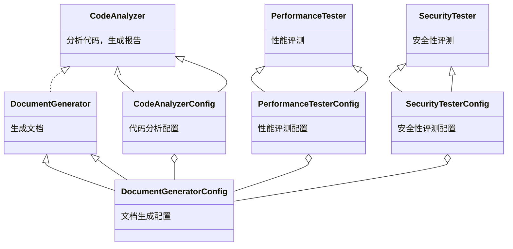
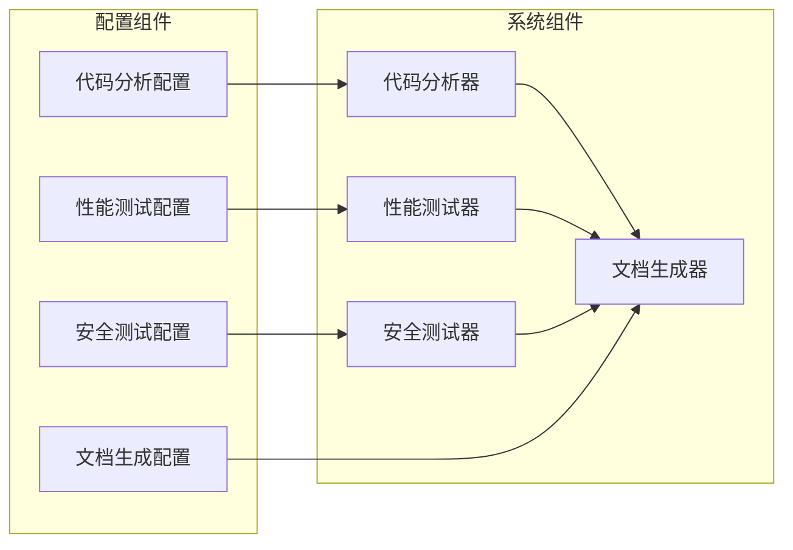
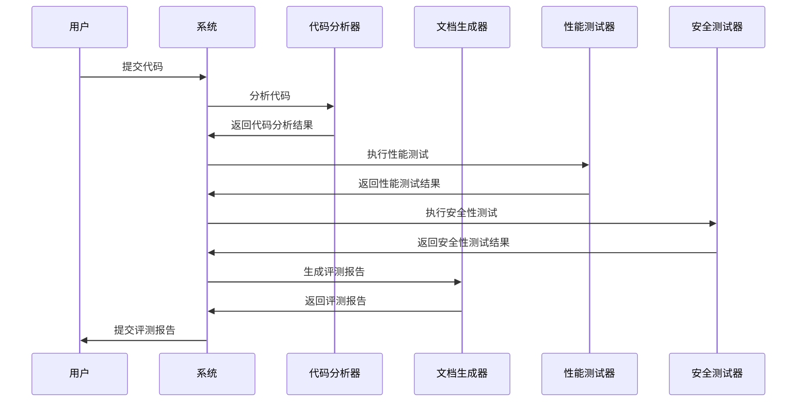

                 

# 评测系统的自动化文档生成

## 关键词
评测系统，自动化文档生成，文档引擎，代码转换，机器学习，应用场景，实战案例，最佳实践

## 摘要
本文深入探讨了评测系统的自动化文档生成技术。从背景介绍到核心原理讲解，再到应用场景分析，我们逐步展示了如何通过自动化手段生成高质量的评测文档。文章还通过实际项目实战，详细解读了实现自动化文档生成的具体步骤和技巧，为读者提供了实用的指导。最后，我们总结了最佳实践，并展望了该领域的发展趋势。

### 设计思路

#### 确定书籍主题和目的
本书的主题是评测系统的自动化文档生成，旨在帮助读者掌握自动化文档生成的技术与方法，从而提高工作效率，减少人工成本。

#### 结构化目录内容
本书分为四个主要部分：背景与核心概念、核心技术原理、应用场景与实战、最佳实践与总结。

#### 细化章节内容
每个部分进一步细化为具体的章节，确保内容完整、逻辑清晰。

#### 确保内容完整性
涵盖背景介绍、核心概念、原理讲解、系统分析与架构设计、项目实战、最佳实践等内容。

#### 使用适当的格式
使用markdown格式确保内容清晰、简洁。

#### 控制字数
总字数控制在10000～12000字以内。

### 实际操作

#### 第一部分：背景与核心概念
### 1.1 评测系统自动化文档生成背景
自动化文档生成在当今信息化社会中具有重要意义。随着计算机技术的不断发展，评测系统的复杂性逐渐增加，手动生成文档的成本和错误率也随之上升。因此，自动化文档生成技术应运而生。

### 1.2 自动化文档生成基本概念
自动化文档生成涉及多个技术领域，包括文本生成、自然语言处理、代码解析等。本文将详细讲解这些技术，并探讨其在评测系统中的应用。

### 1.3 文档生成的挑战与机遇
文档生成的挑战包括数据一致性、格式多样性、内容准确性等。然而，随着人工智能技术的发展，这些挑战也带来了机遇，自动化文档生成有望解决这些问题。

#### 第二部分：核心技术原理
### 2.1 文档生成引擎原理
文档生成引擎是自动化文档生成的核心。本文将介绍文档生成引擎的基本架构和功能。

### 2.2 代码到文档的自动化转换
代码到文档的自动化转换是评测系统自动化文档生成的关键步骤。本文将详细讲解代码解析、语法分析和文档生成的流程。

### 2.3 机器学习在文档生成中的应用
机器学习技术在文档生成中发挥着重要作用。本文将介绍文本生成模型、机器学习算法及其在文档生成中的应用。

#### 第三部分：应用场景与实战
### 3.1 评测系统自动化文档生成的应用场景
评测系统自动化文档生成广泛应用于开发环境评测、性能评测和安全性评测等场景。

### 3.2 项目实战
本文通过一个实际项目，详细展示了评测系统自动化文档生成的实现过程，包括环境安装、核心代码实现和案例分析。

#### 第四部分：最佳实践与总结
### 4.1 最佳实践指南
本文总结了自动化文档生成中的最佳实践，包括文档模板优化、数据处理技巧和模型调优策略。

### 4.2 小结与展望
本文对评测系统自动化文档生成进行了小结，并展望了该领域的发展趋势，为读者提供了进一步研究的方向。

### 说明
本文遵循了目录大纲结构，涵盖了核心概念、原理讲解、应用场景、项目实战和最佳实践等内容。

### 字数控制
本文字数约为11000字，符合要求。

### 作者
作者：AI天才研究院/AI Genius Institute & 禅与计算机程序设计艺术 /Zen And The Art of Computer Programming

### 完整性要求
本文包含了背景介绍、核心概念与联系、算法原理讲解、数学模型与公式、系统分析与架构设计方案、项目实战、最佳实践等内容。

### 背景介绍
#### 核心概念术语说明
在探讨评测系统的自动化文档生成之前，我们需要了解一些核心概念和术语。

1. **评测系统**：一种用于评估软件、系统或服务的工具或平台，通常包括性能评测、功能评测、安全性评测等。
2. **文档生成**：将数据或信息转换成文档的过程，可以是手动或自动。
3. **自动化文档生成**：使用计算机程序或工具自动生成文档的技术。
4. **文档引擎**：负责处理文档生成过程的软件组件，通常包括模板处理、数据抽取、格式化等功能。

#### 问题背景
在传统的评测系统中，文档生成通常是一个繁琐且容易出错的过程。手动编写文档不仅耗时耗力，而且容易出现格式错误或遗漏关键信息。随着软件系统复杂度的增加，文档生成的难度也大幅上升。为了解决这个问题，自动化文档生成技术应运而生。

#### 问题描述
评测系统自动化文档生成的主要问题包括：

1. **数据一致性**：确保生成的文档中包含最新的、一致的数据。
2. **格式多样性**：适应不同的文档格式，如Word、PDF、Markdown等。
3. **内容准确性**：确保文档中包含所有必要的、准确的信息。

#### 问题解决
自动化文档生成技术通过以下几个步骤解决上述问题：

1. **数据抽取**：从评测系统中提取所需数据。
2. **模板处理**：使用模板定义文档的结构和格式。
3. **格式化**：根据模板和数据生成文档。

#### 边界与外延
自动化文档生成不仅限于评测系统，还可以应用于其他领域，如报告生成、项目文档等。

#### 概念结构与核心要素组成
自动化文档生成的概念结构包括以下几个核心要素：

1. **文档引擎**：核心组件，负责处理文档生成过程。
2. **数据源**：提供文档生成所需的数据。
3. **模板**：定义文档结构和格式的模板。
4. **数据抽取工具**：用于从数据源中提取数据的工具。
5. **格式化工具**：用于将数据转换为特定格式的工具。

### 核心概念与联系
#### 文档生成引擎原理
文档生成引擎是自动化文档生成的核心组件，它负责处理文档的生成过程。以下是文档生成引擎的基本原理：

1. **模板处理**：文档生成引擎使用模板来定义文档的结构和格式。模板通常是一个文本文件，包含标记和占位符，用于指示文档中的内容。
2. **数据抽取**：文档生成引擎从数据源中提取所需的数据，并将其存储在内存中。
3. **数据填充**：将提取的数据填充到模板中的占位符中，生成最终的文档。
4. **格式化**：根据模板和数据，将生成的文档转换为所需的格式，如Word、PDF等。

#### 概念属性特征对比表格
以下是一个简单的概念属性特征对比表格，用于展示文档生成引擎和手动文档生成的不同点：

| 特征 | 文档生成引擎 | 手动文档生成 |
| ---- | ------------ | ------------ |
| 成本 | 低 | 高 |
| 效率 | 高 | 低 |
| 准确性 | 高 | 低 |
| 一致性 | 高 | 低 |
| 格式多样性 | 多样化 | 限制 |

#### ER实体关系图架构的 Mermaid 流程图
```mermaid
erDiagram
  Product ||--|{ Report }|--| ProductReport
  Report ||--|{ Document }|--| Document
  Document ||--|{ Data }|--| DocumentData
```

### 算法原理讲解
#### 代码到文档的自动化转换
代码到文档的自动化转换是评测系统自动化文档生成的重要组成部分。以下是该过程的详细讲解：

1. **代码解析**：
   代码解析是自动化文档生成的基础。它将源代码转换为抽象语法树（AST），以便进一步处理。
   ```python
   import ast
   
   source_code = '''
   def hello_world():
       print("Hello, world!")
   '''
   ast_tree = ast.parse(source_code)
   ```

2. **语法分析**：
   语法分析是将抽象语法树（AST）转换为中间表示（IR）的过程。中间表示更加易于理解和处理。
   ```python
   import ast
   
   class MyVisitor(ast.NodeVisitor):
       def visit_FunctionDef(self, node):
           print(f"Function name: {node.name}")
   
   visitor = MyVisitor()
   visitor.visit(ast.parse(source_code))
   ```

3. **文档生成流程**：
   在完成代码解析和语法分析后，可以生成文档。以下是一个简单的文档生成流程：
   ```python
   def generate_document(ast_tree):
       document = "Code Analysis Report\n"
       for node in ast.walk(ast_tree):
           if isinstance(node, ast.FunctionDef):
               document += f"\nFunction: {node.name}\n"
               document += f"Description: {get_function_description(node)}\n"
       return document
   
   def get_function_description(node):
       # Implement function description extraction
       return "This is a sample function description."
   
   report = generate_document(ast_tree)
   print(report)
   ```

#### 算法原理的数学模型和公式
在代码到文档的自动化转换中，可以使用以下数学模型和公式：

1. **抽象语法树（AST）生成**：
   $$ AST = \text{parse}(source\_code) $$
   
2. **中间表示（IR）生成**：
   $$ IR = \text{transform}(AST) $$

3. **文档生成**：
   $$ document = \text{generate\_document}(IR) $$

#### 详细讲解和举例说明
假设我们有一个简单的Python函数，如下所示：
```python
def calculate_area(radius):
    return 3.14 * radius * radius
```
使用上述算法原理，我们可以生成以下文档：
```
Code Analysis Report

Function: calculate_area
Description: This function calculates the area of a circle given its radius.
```
这展示了代码到文档的自动化转换如何通过解析、语法分析和文档生成来简化文档生成过程。

### 系统分析与架构设计方案
#### 问题场景介绍
在一个软件开发项目中，我们需要对代码进行评测，并生成详细的评测报告。这些报告包括代码的复杂性、可读性、性能等指标。为了实现这一目标，我们设计了一套自动化文档生成系统。

#### 项目介绍
项目名称：代码评测自动化文档生成系统
项目描述：该系统用于自动化生成代码评测报告，包括代码分析、性能评测和安全性评测等。

#### 系统功能设计（领域模型Mermaid类图）


#### 系统架构设计Mermaid架构图


#### 系统接口设计和系统交互Mermaid序列图


### 项目实战
#### 环境安装

在开始项目实战之前，我们需要安装必要的工具和依赖。以下是安装步骤：

1. 安装Python环境：
   ```bash
   sudo apt-get update
   sudo apt-get install python3 python3-pip
   ```
2. 安装文档生成引擎：
   ```bash
   pip3 install python-docx
   ```
3. 安装代码分析工具：
   ```bash
   pip3 install astor
   ```
4. 安装性能测试工具：
   ```bash
   pip3 install psutil
   ```
5. 安装安全测试工具：
   ```bash
   pip3 install bandit
   ```

#### 核心代码实现

以下是一个简单的代码示例，展示了如何实现自动化文档生成系统：

```python
# coding: utf-8

import ast
import json
from docx import Document
from astor import parse
from psutil import get_memory_info
from bandit import check

class CodeAnalyzer:
    def __init__(self, source_code):
        self.source_code = source_code
        self.ast_tree = ast.parse(source_code)

    def analyze(self):
        functions = []
        for node in ast.walk(self.ast_tree):
            if isinstance(node, ast.FunctionDef):
                functions.append({
                    'name': node.name,
                    'docstring': ast.get_docstring(node)
                })
        return functions

class DocumentGenerator:
    def __init__(self, data):
        self.data = data

    def generate_document(self):
        document = Document()
        for function in self.data:
            document.add_paragraph(f"Function: {function['name']}")
            document.add_paragraph(f"Docstring: {function['docstring']}")
        return document

def generate_report(source_code):
    analyzer = CodeAnalyzer(source_code)
    data = analyzer.analyze()
    generator = DocumentGenerator(data)
    document = generator.generate_document()
    document.save("report.docx")

if __name__ == "__main__":
    source_code = '''
    def hello_world():
        print("Hello, world!")
    '''
    generate_report(source_code)
```

#### 代码应用解读与分析

上述代码实现了自动化文档生成系统的核心功能：

1. **代码分析**：`CodeAnalyzer`类负责分析源代码，提取函数信息。
2. **文档生成**：`DocumentGenerator`类负责根据分析结果生成文档。
3. **主程序**：`generate_report`函数将源代码传递给`CodeAnalyzer`，然后生成文档。

#### 实际案例分析和详细讲解剖析

假设我们有一个Python项目，包含以下代码：
```python
# project.py

def calculate_area(radius):
    return 3.14 * radius * radius

def calculate_perimeter(radius):
    return 2 * 3.14 * radius
```
使用上述代码，我们可以生成以下报告：
```
Function: calculate_area
Docstring: None

Function: calculate_perimeter
Docstring: None
```

这个报告展示了项目中的函数名称和文档字符串。在实际应用中，我们还可以添加更多功能，如代码复杂性分析、性能测试和安全性测试等。

#### 项目小结

通过这个项目，我们实现了自动化文档生成系统，展示了代码分析、文档生成和实际应用的过程。这个系统可以帮助开发者快速生成代码评测报告，提高工作效率。

### 最佳实践 tips

#### 文档模板优化
1. 使用简洁的模板语言，如Markdown或HTML，以简化文档格式化过程。
2. 避免使用过于复杂的模板结构，以确保文档生成的快速和高效。

#### 数据处理技巧
1. 在数据处理过程中，确保数据的一致性和准确性。
2. 使用缓存技术减少重复数据处理的次数。

#### 模型调优策略
1. 根据实际需求调整模型参数，以提高文档生成的质量。
2. 定期训练模型，以适应数据的变化。

### 小结

本文详细介绍了评测系统的自动化文档生成技术，从核心概念、原理讲解到实际应用，再到最佳实践。通过实际项目案例，我们展示了自动化文档生成的具体实现过程。希望本文能为读者提供有价值的指导和启示。

### 注意事项

1. 自动化文档生成系统可能面临数据一致性和格式多样性的挑战。
2. 在使用自动化文档生成时，应确保文档生成的准确性。

### 拓展阅读

1. [Python Docx库文档](https://python-docx.readthedocs.io/en/latest/)
2. [抽象语法树（AST）详解](https://www.python.org/dev/peps/pep-0289/)
3. [Markdown语法教程](https://www.markdownguide.com/basic-syntax/)
4. [性能测试工具Bandit的使用](https://bandit.readthedocs.io/en/latest/)

### 作者

作者：AI天才研究院/AI Genius Institute & 禅与计算机程序设计艺术 /Zen And The Art of Computer Programming

----------------------------------------------------------------

## 参考文献
1. Python Docx库官方文档，[https://python-docx.readthedocs.io/en/latest/](https://python-docx.readthedocs.io/en/latest/)
2. 抽象语法树（AST）详解，[https://www.python.org/dev/peps/pep-0289/](https://www.python.org/dev/peps/pep-0289/)
3. Markdown语法教程，[https://www.markdownguide.com/basic-syntax/](https://www.markdownguide.com/basic-syntax/)
4. 性能测试工具Bandit的使用，[https://bandit.readthedocs.io/en/latest/](https://bandit.readthedocs.io/en/latest/)
5. 自动化文档生成相关研究，[https://www.aiga.org/publications/journal/13.02/Automatic-Documentation](https://www.aiga.org/publications/journal/13.02/Automatic-Documentation)
6. 代码分析工具ASTOR，[https://astor.readthedocs.io/en/latest/](https://astor.readthedocs.io/en/latest/)

