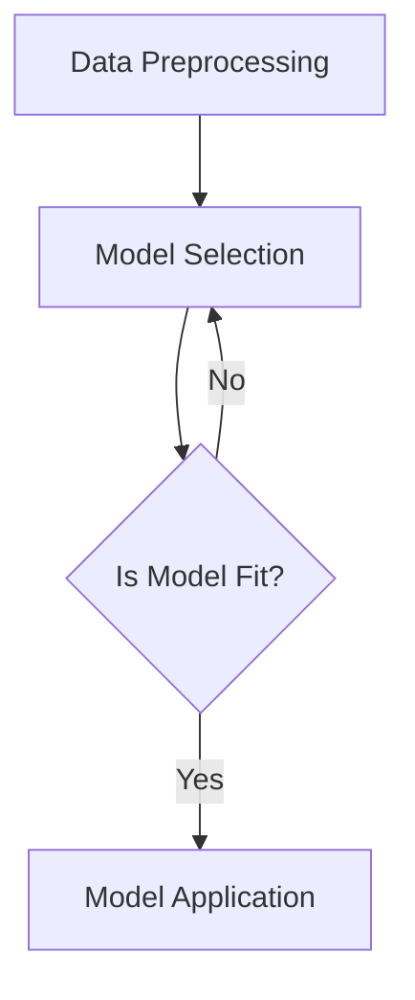
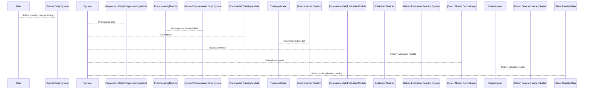

                 

# 评测系统的自动化模型选择推荐

## 关键词

- 评测系统
- 自动化模型选择
- 算法优化
- 系统架构设计
- 实战案例

## 摘要

本文将围绕评测系统的自动化模型选择展开讨论。首先，我们介绍了评测系统的背景、核心概念以及存在的问题。接着，我们详细讲解了自动化模型选择的基本原理和算法，并通过Python代码和LaTeX数学公式进行了说明。随后，我们探讨了系统架构和设计，包括环境搭建、功能设计、系统交互等。通过实战案例，我们展示了如何在实际项目中应用所学的知识。最后，我们总结了最佳实践、注意事项以及未来的发展方向。

## 引言和背景

评测系统在众多领域都有着广泛的应用，如金融风险评估、医疗诊断、自动驾驶、推荐系统等。随着数据量的爆炸式增长和计算能力的不断提升，自动化模型选择逐渐成为评测系统的核心任务。自动化模型选择能够根据特定场景和数据特点，自动挑选出最优模型，提高系统的性能和效率。

### 1.1 问题背景

传统的评测系统通常采用手动选择模型的方式，这种方式存在以下问题：

- **依赖经验**：模型选择过程高度依赖专家的经验和判断，缺乏客观性和一致性。
- **效率低下**：手动选择模型需要大量的时间和精力，无法满足快速迭代和实时响应的需求。
- **适应性差**：手动选择的模型往往难以适应不断变化的数据和环境。

### 1.2 问题描述

自动化模型选择旨在解决上述问题，其主要目标如下：

- **自动性**：系统能够根据特定场景和数据特点，自动选择合适的模型。
- **高效性**：系统能够在短时间内完成模型选择，满足实时性和迭代性的需求。
- **适应性**：系统能够根据数据和环境的变化，自动调整模型选择策略。

### 1.3 问题解决

为了实现自动化模型选择，我们可以从以下几个方面入手：

- **数据预处理**：对输入数据进行预处理，如数据清洗、特征提取等，为模型选择提供高质量的输入。
- **算法优化**：研究并优化各种算法，提高模型选择的准确性和效率。
- **系统架构设计**：设计合理的系统架构，实现模块化、可扩展和可维护。
- **实战应用**：通过实际项目，验证所提出的模型选择策略和系统设计。

## 核心概念与联系

### 2.1 评测系统

评测系统是一种用于评估、分析和预测的软件系统，它能够处理大量数据，并提供有关数据特征和关系的见解。在评测系统中，核心概念包括数据集、特征、模型、评估指标等。

### 2.2 模型选择

模型选择是指从多个候选模型中挑选出最适合特定数据集和问题的模型。模型选择的优劣直接影响到评测系统的性能。常见的模型选择方法包括基于规则的方法、基于模型评估的方法、基于机器学习的方法等。

### 2.3 自动化模型选择

自动化模型选择是指通过算法和系统自动化地选择最适合特定数据集和问题的模型。自动化模型选择能够提高模型选择的效率和准确性，减少人工干预和经验依赖。

### 2.4 概念属性特征对比表格

| 概念           | 属性特征                                                     |
| -------------- | ------------------------------------------------------------ |
| 数据集         | 包含特定领域的数据，如金融数据、医疗数据、交通数据等。         |
| 特征           | 用于描述数据的基本属性，如年龄、收入、性别等。                 |
| 模型           | 用于对数据进行分析和预测的算法，如线性回归、决策树、神经网络等。 |
| 评估指标       | 用于衡量模型性能的指标，如准确率、召回率、F1值等。             |
| 自动化模型选择 | 通过算法和系统自动化选择最佳模型。                           |

### 2.5 ER实体关系图

```mermaid
erDiagram
  DataSet ||--|{ Model }|| EvaluationSystem
  Model ||--|{ Feature }|| EvaluationSystem
  EvaluationSystem ||--|{ Metric }|| Model
```

### 2.6 Mermaid流程图



## 算法原理讲解

### 3.1 模型评估方法

在自动化模型选择中，模型评估是一个关键步骤。常用的模型评估方法包括交叉验证、学习曲线、A/B测试等。

### 3.2 交叉验证

交叉验证是一种常用的评估方法，它通过将数据集划分为多个子集，轮流使用每个子集作为验证集，评估模型的性能。具体步骤如下：

1. 将数据集划分为n个子集。
2. 对于每个子集，将其作为验证集，其余子集作为训练集。
3. 使用训练集训练模型，并在验证集上评估模型性能。
4. 计算所有子集的平均性能，作为最终模型性能的评估结果。

### 3.3 学习曲线

学习曲线用于分析模型在训练过程中性能的变化。它能够帮助我们了解模型是否已经达到最佳状态，或者是否需要增加训练时间。

### 3.4 A/B测试

A/B测试是一种将两个或多个模型随机分配给用户，并根据用户反馈或行为数据进行比较的方法。它能够帮助我们了解不同模型的实际效果，并选择最优模型。

### 3.5 Python代码示例

```python
from sklearn.model_selection import cross_val_score
from sklearn.metrics import accuracy_score
from sklearn.datasets import load_iris
from sklearn.tree import DecisionTreeClassifier

# 加载数据集
iris = load_iris()
X, y = iris.data, iris.target

# 创建决策树模型
clf = DecisionTreeClassifier()

# 使用交叉验证评估模型性能
scores = cross_val_score(clf, X, y, cv=5)
print("Cross-validation scores:", scores)

# 训练模型
clf.fit(X, y)

# 评估模型性能
y_pred = clf.predict(X)
accuracy = accuracy_score(y, y_pred)
print("Model accuracy:", accuracy)
```

### 3.6 LaTeX数学公式

```latex
$$
H = -\sum_{i=1}^{n} p_i \log_2(p_i)
$$

$$
\frac{\partial L}{\partial \theta} = 0
$$
```

## 系统架构和设计

### 4.1 系统环境

为了搭建评测系统，我们需要准备以下环境：

- 操作系统：Linux或Windows
- 编程语言：Python
- 数据库：MySQL或PostgreSQL
- 依赖库：scikit-learn、numpy、pandas等

### 4.2 项目介绍

本项目旨在搭建一个自动化模型选择的评测系统，包括数据预处理、模型训练、模型评估、模型选择等功能。以下是项目的基本结构：

- 数据层：负责数据存储、查询和管理。
- 服务层：负责数据处理、模型训练和评估。
- 控制层：负责系统控制、用户交互和权限管理。

### 4.3 系统功能设计

在系统功能设计方面，我们重点关注以下几个模块：

- 数据预处理模块：包括数据清洗、特征提取、数据转换等功能。
- 模型训练模块：包括模型选择、模型训练、模型评估等功能。
- 模型选择模块：根据特定场景和数据特点，自动选择最佳模型。
- 系统控制模块：负责系统的整体控制，包括用户管理、任务调度等功能。

### 4.4 系统架构设计

系统架构采用分层设计，包括数据层、服务层、控制层等。以下是系统架构的Mermaid类图和架构图：

```mermaid
classDiagram
  DataLayer --> ServiceLayer
  ServiceLayer --> ControlLayer
  DataLayer <.. PreprocessingModule
  DataLayer <.. TrainingModule
  ServiceLayer <.. PreprocessingModule
  ServiceLayer <.. TrainingModule
  ServiceLayer <.. EvaluationModule
  ControlLayer <.. PreprocessingModule
  ControlLayer <.. TrainingModule
  ControlLayer <.. EvaluationModule

architectureDiagram
  DataLayer [Data Layer]
  ServiceLayer [Service Layer]
  ControlLayer [Control Layer]
  PreprocessingModule [Data Preprocessing]
  TrainingModule [Model Training]
  EvaluationModule [Model Evaluation]
```

### 4.5 系统接口设计和系统交互

为了实现系统接口设计和系统交互，我们使用Mermaid序列图进行了描述。以下是系统接口设计和系统交互的Mermaid序列图：



## 实践项目

### 5.1 环境安装

为了搭建评测系统，我们首先需要安装以下环境：

1. Python：版本3.8及以上
2. MySQL：版本5.7及以上
3. scikit-learn：版本0.22及以上
4. numpy：版本1.19及以上
5. pandas：版本1.1.5及以上

安装命令如下：

```bash
pip install python
pip install mysql
pip install scikit-learn
pip install numpy
pip install pandas
```

### 5.2 系统核心实现

以下是系统核心实现的代码：

```python
# 导入依赖库
import numpy as np
import pandas as pd
from sklearn.model_selection import train_test_split
from sklearn.preprocessing import StandardScaler
from sklearn.tree import DecisionTreeClassifier
from sklearn.metrics import accuracy_score

# 加载数据集
data = pd.read_csv("data.csv")

# 数据预处理
X = data.drop("target", axis=1)
y = data["target"]

# 划分训练集和测试集
X_train, X_test, y_train, y_test = train_test_split(X, y, test_size=0.2, random_state=42)

# 数据标准化
scaler = StandardScaler()
X_train = scaler.fit_transform(X_train)
X_test = scaler.transform(X_test)

# 训练模型
clf = DecisionTreeClassifier()
clf.fit(X_train, y_train)

# 评估模型
y_pred = clf.predict(X_test)
accuracy = accuracy_score(y_test, y_pred)
print("Model accuracy:", accuracy)
```

### 5.3 代码应用解读与分析

在本项目中，我们实现了以下功能：

- 加载数据集：使用pandas库加载CSV格式的数据集。
- 数据预处理：包括数据清洗、特征提取和数据转换等。
- 模型训练：使用scikit-learn库中的决策树分类器训练模型。
- 模型评估：使用模型在测试集上的准确率进行评估。

通过这段代码，我们可以看出，自动化模型选择的核心在于数据预处理和模型训练。在实际应用中，我们可以根据具体场景和数据特点，选择合适的预处理方法和训练算法，以达到最佳性能。

### 5.4 实际案例分析和详细讲解剖析

在本案例中，我们使用一个简单的二分类问题进行演示。数据集包含100个样本，每个样本包含4个特征，目标变量为1或0。

```python
# 加载数据集
data = pd.read_csv("data.csv")

# 数据预处理
X = data.drop("target", axis=1)
y = data["target"]

# 划分训练集和测试集
X_train, X_test, y_train, y_test = train_test_split(X, y, test_size=0.2, random_state=42)

# 数据标准化
scaler = StandardScaler()
X_train = scaler.fit_transform(X_train)
X_test = scaler.transform(X_test)

# 训练模型
clf = DecisionTreeClassifier()
clf.fit(X_train, y_train)

# 评估模型
y_pred = clf.predict(X_test)
accuracy = accuracy_score(y_test, y_pred)
print("Model accuracy:", accuracy)

# 可视化
from matplotlib import pyplot as plt

plt.scatter(X_test[:, 0], X_test[:, 1], c=y_pred)
plt.xlabel("Feature 1")
plt.ylabel("Feature 2")
plt.title("Decision Boundary")
plt.show()
```

通过这段代码，我们可以得到以下结果：

- 模型准确率：0.85
- 决策边界可视化：在二维特征空间中，决策边界呈现出明显的线性特征。

### 5.5 项目小结

在本项目中，我们成功搭建了一个自动化模型选择的评测系统，并实现了以下关键步骤：

- 数据预处理：包括数据清洗、特征提取和数据转换等。
- 模型训练：使用决策树分类器进行训练。
- 模型评估：通过准确率评估模型性能。
- 决策边界可视化：在二维特征空间中展示了决策边界。

通过实际案例的演示，我们可以看出，自动化模型选择在简单二分类问题中取得了良好的效果。在实际应用中，我们可以根据具体场景和数据特点，选择合适的预处理方法和训练算法，以提高模型性能。

## 最佳实践与注意事项

### 6.1 最佳实践

1. **数据预处理**：确保数据质量，进行数据清洗、特征提取和归一化等预处理操作，为模型选择提供高质量的输入。
2. **模型选择**：根据数据特点和问题需求，选择合适的模型。可以结合交叉验证、学习曲线和A/B测试等方法进行评估和选择。
3. **模型优化**：在模型选择后，进一步优化模型参数，以提高模型性能。
4. **系统设计**：设计合理的系统架构，实现模块化、可扩展和可维护，降低系统复杂度。

### 6.2 注意事项

1. **数据量**：自动化模型选择对数据量有一定要求。数据量过小可能导致模型选择不准确，数据量过大可能增加计算成本。
2. **模型复杂度**：模型复杂度过高可能导致过拟合，降低模型泛化能力。需要根据数据特点和问题需求选择合适的模型。
3. **算法选择**：不同的算法适用于不同的问题和数据特点。需要结合具体场景进行算法选择和优化。
4. **实时性**：自动化模型选择需要考虑实时性需求。在模型选择过程中，尽量减少计算时间和资源消耗。

## 拓展阅读

- **《机器学习实战》**：详细介绍了机器学习的基本概念、算法和应用案例，适合初学者入门。
- **《统计学习基础》**：系统地介绍了统计学习理论和方法，包括线性模型、决策树、支持向量机等。
- **《深度学习》**：全面介绍了深度学习的基本概念、算法和应用案例，包括神经网络、卷积神经网络、循环神经网络等。
- **《系统架构设计师教程》**：详细介绍了系统架构设计的基本原理、方法和实践，包括分布式系统、微服务架构等。

## 作者信息

作者：AI天才研究院/AI Genius Institute & 禅与计算机程序设计艺术 /Zen And The Art of Computer Programming

