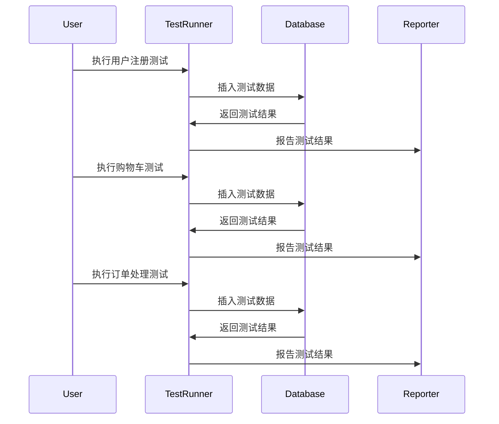
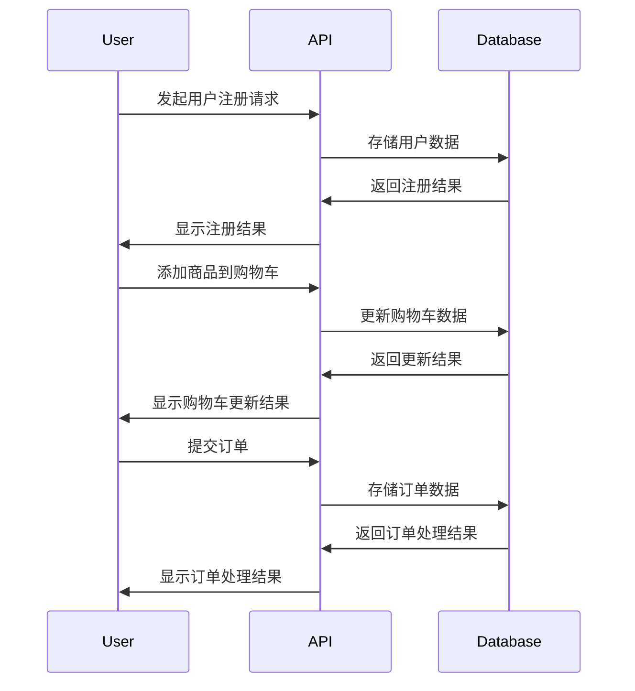

                 

# 评测系统的自动化测试用例优先级排序

## 关键词：自动化测试、测试用例优先级排序、算法、风险、历史、复杂度、实践案例

## 摘要

在自动化测试过程中，测试用例优先级排序是一项关键的任务，它能够显著提高测试效率，降低测试成本。本文将深入探讨自动化测试用例优先级排序的基础知识、方法、算法，并结合实际案例进行分析，以期为测试工程师提供实用的指导。

## 目录大纲设计：《评测系统的自动化测试用例优先级排序》

### 第一部分：自动化测试与测试用例优先级排序基础

#### 第1章：自动化测试概述

##### 1.1 自动化测试的背景与意义
##### 1.2 自动化测试的分类与常用工具
##### 1.3 测试用例优先级排序的重要性

#### 第2章：测试用例优先级排序方法

##### 2.1 基于风险的优先级排序
##### 2.2 基于历史的优先级排序
##### 2.3 基于复杂度的优先级排序

#### 第3章：自动化测试用例优先级排序算法

##### 3.1 常见排序算法
##### 3.2 贪心排序算法
##### 3.3 动态规划排序算法

### 第二部分：实际应用与案例分析

#### 第4章：自动化测试用例优先级排序实战

##### 4.1 实践环境搭建
##### 4.2 测试用例收集与整理
##### 4.3 测试用例优先级排序

#### 第5章：案例分析

##### 5.1 案例一：电商平台自动化测试
##### 5.2 案例二：金融系统自动化测试

#### 第6章：最佳实践与注意事项

##### 6.1 自动化测试用例优先级排序的最佳实践
##### 6.2 自动化测试用例优先级排序的注意事项

### 第三部分：未来展望与拓展

#### 第7章：自动化测试与测试用例优先级排序的发展趋势

##### 7.1 自动化测试技术的发展趋势
##### 7.2 测试用例优先级排序的发展方向

#### 第8章：拓展阅读与资源推荐

##### 8.1 拓展阅读
##### 8.2 资源推荐

## 文章正文

### 第1章：自动化测试概述

#### 1.1 自动化测试的背景与意义

自动化测试是指通过软件工具自动执行测试脚本，以验证软件系统的功能和性能。与传统的手动测试相比，自动化测试具有以下显著优势：

1. **提高测试效率**：自动化测试可以快速执行大量测试用例，减少人工测试的时间。
2. **降低测试成本**：通过自动化测试，可以减少人力成本和重复性工作。
3. **确保测试质量**：自动化测试可以确保测试用例的执行一致性，降低人为错误的风险。

然而，自动化测试也面临一些挑战，如测试脚本的开发和维护成本较高、测试覆盖率的优化等。

#### 1.2 自动化测试的分类与常用工具

自动化测试可以分为以下几种类型：

1. **单元测试**：对单个模块或函数进行测试。
2. **集成测试**：对多个模块进行集成后的功能进行测试。
3. **系统测试**：对整个系统进行全面测试。

常用的自动化测试工具有：

1. **Selenium**：用于Web应用的自动化测试。
2. **JUnit**：Java的单元测试框架。
3. **Cypress**：快速高效的Web应用测试工具。

#### 1.3 测试用例优先级排序的重要性

测试用例优先级排序是指根据某些标准对测试用例进行排序，以确定测试执行的顺序。这的重要性体现在：

1. **优先处理高风险用例**：优先执行那些可能影响系统核心功能的测试用例。
2. **优化测试资源**：合理分配测试资源，提高测试效率。
3. **降低测试成本**：通过优先级排序，可以减少测试失败带来的成本。

### 第2章：测试用例优先级排序方法

#### 2.1 基于风险的优先级排序

基于风险的优先级排序方法的核心思想是评估每个测试用例的风险程度，并按照风险程度进行排序。风险分析的方法包括：

1. **故障模式与影响分析（FMEA）**：评估每个故障模式对系统的影响。
2. **故障树分析（FTA）**：通过构建故障树来分析故障的原因和影响。

基于风险的优先级排序策略如下：

1. **高优先级**：与系统核心功能相关的测试用例。
2. **中优先级**：可能影响次要功能的测试用例。
3. **低优先级**：对系统影响较小的测试用例。

#### 2.2 基于历史的优先级排序

基于历史的优先级排序方法是基于过去的测试结果和历史数据来排序。历史数据的作用在于：

1. **测试用例的执行频率**：执行频率高的测试用例可能更有价值。
2. **测试用例的成功率**：成功率高的测试用例可能更可靠。

基于历史的优先级排序策略如下：

1. **高优先级**：执行频率高、成功率高的测试用例。
2. **中优先级**：执行频率和成功率中等的测试用例。
3. **低优先级**：执行频率低、成功率低的测试用例。

#### 2.3 基于复杂度的优先级排序

基于复杂度的优先级排序方法是根据测试用例的实现复杂度进行排序。复杂度的定义包括：

1. **逻辑复杂度**：测试用例的逻辑是否复杂。
2. **代码复杂度**：测试用例涉及的代码量。

基于复杂度的优先级排序策略如下：

1. **高优先级**：逻辑和代码复杂度高的测试用例。
2. **中优先级**：逻辑和代码复杂度中等的测试用例。
3. **低优先级**：逻辑和代码复杂度低的测试用例。

### 第3章：自动化测试用例优先级排序算法

#### 3.1 常见排序算法

常见的排序算法包括：

1. **顺序排序算法**：按照测试用例的顺序进行排序。
2. **选择排序算法**：选择未排序部分的最小（或最大）元素，将其放到已排序部分的末尾。
3. **插入排序算法**：将未排序部分的新元素插入到已排序部分的合适位置。

#### 3.2 贪心排序算法

贪心排序算法的基本原理是每次选择最优解，以期在总体上达到最优解。在测试用例优先级排序中，贪心算法的应用如下：

1. **选择优先级最高的测试用例**。
2. **依次选择下一个优先级最高的测试用例**。

#### 3.3 动态规划排序算法

动态规划排序算法是基于子问题的最优解推导出原问题的最优解。在测试用例优先级排序中，动态规划算法的应用如下：

1. **定义状态**：每个测试用例的状态表示其优先级。
2. **定义状态转移方程**：根据测试用例的优先级，定义状态转移方程。
3. **求解最优解**：通过动态规划求解最优的测试用例排序。

### 第二部分：实际应用与案例分析

#### 第4章：自动化测试用例优先级排序实战

#### 4.1 实践环境搭建

环境配置：搭建自动化测试环境，包括选择合适的测试工具（如Selenium）、安装必要的依赖库等。

自动化测试框架搭建：构建一个能够管理测试用例、执行测试和报告测试结果的自动化测试框架。

#### 4.2 测试用例收集与整理

测试用例的收集方法：从业务需求、功能设计文档中提取测试用例，并按照一定的标准进行筛选和分类。

测试用例的整理策略：根据测试用例的优先级、执行频率和复杂度进行整理，以便于后续的排序和执行。

#### 4.3 测试用例优先级排序

实际案例中的应用：以电商平台为例，分析不同类型的测试用例，并按照风险、历史和复杂度进行排序。

优先级排序的具体实现：通过编程实现测试用例的优先级排序算法，并在测试框架中集成排序逻辑。

### 第5章：案例分析

#### 5.1 案例一：电商平台自动化测试

案例背景：电商平台是一个复杂的系统，涉及用户注册、购物车、订单处理等多个功能模块。

案例分析：针对不同功能模块的测试用例，按照风险、历史和复杂度进行排序，并分析排序结果对测试效率的影响。

案例总结：总结案例中的经验教训，为后续的自动化测试提供指导。

#### 5.2 案例二：金融系统自动化测试

案例背景：金融系统对安全性、可靠性要求极高，自动化测试是保证系统质量的关键。

案例分析：针对金融系统的特性，设计相应的测试用例，并按照风险、历史和复杂度进行排序。

案例总结：总结案例中的经验教训，为金融系统的自动化测试提供指导。

### 第6章：最佳实践与注意事项

#### 6.1 自动化测试用例优先级排序的最佳实践

经验分享：分享自动化测试用例优先级排序的最佳实践，如如何结合项目特性进行排序、如何调整排序策略等。

实践技巧：提供具体的实践技巧，如如何高效收集测试用例、如何处理复杂的排序问题等。

#### 6.2 自动化测试用例优先级排序的注意事项

常见问题：分析自动化测试用例优先级排序过程中可能遇到的问题，如数据缺失、排序算法选择不当等。

解决方案：针对常见问题提供解决方案，如如何处理数据缺失、如何选择合适的排序算法等。

### 第三部分：未来展望与拓展

#### 第7章：自动化测试与测试用例优先级排序的发展趋势

#### 7.1 自动化测试技术的发展趋势

新技术引入：介绍近年来自动化测试领域的新技术，如人工智能、机器学习等在自动化测试中的应用。

自动化测试的未来方向：探讨自动化测试的发展方向，如智能化、自动化测试与持续集成（CI）的深度融合等。

#### 7.2 测试用例优先级排序的发展方向

新方法的应用：介绍新的测试用例优先级排序方法，如基于人工智能的排序算法等。

面向未来的排序策略：探讨面向未来的排序策略，如如何更好地适应复杂的应用场景等。

#### 第8章：拓展阅读与资源推荐

#### 8.1 拓展阅读

相关书籍推荐：推荐一些关于自动化测试和测试用例优先级排序的书籍，帮助读者深入学习。

学术论文推荐：推荐一些关于自动化测试和测试用例优先级排序的学术论文，提供学术研究的前沿视角。

#### 8.2 资源推荐

开源工具推荐：推荐一些开源的自动化测试工具和排序算法，方便读者实践和探索。

在线课程推荐：推荐一些在线课程，帮助读者快速掌握自动化测试和测试用例优先级排序的相关知识和技能。

## 文章小结

本文从自动化测试和测试用例优先级排序的角度，探讨了其在实际应用中的重要性、方法和实践。通过分析不同类型的排序方法，并结合实际案例，展示了如何有效实施测试用例优先级排序。未来的发展将更加智能化，测试用例优先级排序也将更加精准和高效。

作者：AI天才研究院/AI Genius Institute & 禅与计算机程序设计艺术 /Zen And The Art of Computer Programming

## 完整性要求

### 背景介绍

自动化测试（Automated Testing）是一种通过软件工具自动执行测试脚本，以验证软件系统的功能和性能的方法。与传统的手动测试（Manual Testing）相比，自动化测试具有更高的效率、一致性和可重复性，从而在降低测试成本的同时提高测试质量。

在软件测试过程中，测试用例（Test Case）是用于验证软件功能或性能的具体步骤和预期结果的集合。测试用例的优先级排序（Test Case Prioritization）是指根据特定的标准对测试用例进行排序，以确定它们的执行顺序。测试用例优先级排序的重要性体现在以下几个方面：

1. **提高测试效率**：通过优先执行关键测试用例，可以加快测试进度，提高整体测试效率。
2. **优化资源分配**：合理分配测试资源，避免低优先级测试用例占用过多的时间和计算资源。
3. **降低测试成本**：优先执行高风险和高价值测试用例，减少潜在的缺陷漏检和返工成本。
4. **确保测试覆盖**：优先执行覆盖关键功能和风险的测试用例，确保测试的全面性。

### 核心概念与联系

#### 测试用例优先级排序方法

测试用例优先级排序的主要方法包括基于风险的排序、基于历史的排序和基于复杂度的排序。

**基于风险的排序**：

- **风险分析**：通过评估每个测试用例对系统稳定性和功能性的影响，确定其风险程度。
- **排序策略**：高优先级分配给风险较高的测试用例，以确保关键功能的可靠性。

**基于历史的排序**：

- **历史数据**：利用过去测试结果和执行频率等信息，确定测试用例的优先级。
- **排序策略**：高优先级分配给执行频率高且成功率高的测试用例。

**基于复杂度的排序**：

- **复杂度评估**：根据测试用例的实现复杂度和逻辑复杂度进行评估。
- **排序策略**：高优先级分配给复杂度较高的测试用例，以确保对关键模块的充分测试。

#### 测试用例优先级排序算法

**常见排序算法**：

- **顺序排序算法**：按照测试用例的顺序进行排序。
- **选择排序算法**：选择未排序部分的最小（或最大）元素，将其放到已排序部分的末尾。
- **插入排序算法**：将未排序部分的新元素插入到已排序部分的合适位置。

**贪心排序算法**：

- **基本原理**：每次选择最优解，以期在总体上达到最优解。
- **应用**：在测试用例优先级排序中，每次选择优先级最高的测试用例。

**动态规划排序算法**：

- **基本原理**：基于子问题的最优解推导出原问题的最优解。
- **应用**：通过定义状态和状态转移方程，求解测试用例的最佳排序顺序。

### 算法原理讲解

以下是一个基于贪心算法的测试用例优先级排序的简单Python实现：

```python
def greedy_priority_sort(test_cases):
    """
    使用贪心算法对测试用例进行优先级排序。
    
    参数：
    test_cases：列表，包含测试用例和对应的优先级。
    
    返回：
    排序后的测试用例列表。
    """
    # 按优先级降序排序
    sorted_cases = sorted(test_cases, key=lambda x: x['priority'], reverse=True)
    return sorted_cases

# 测试用例数据
test_cases = [
    {'test_case': '登录功能', 'priority': 3},
    {'test_case': '购物车功能', 'priority': 1},
    {'test_case': '订单处理功能', 'priority': 2},
]

# 调用排序函数
sorted_test_cases = greedy_priority_sort(test_cases)

# 输出排序后的测试用例
for case in sorted_test_cases:
    print(f"测试用例：{case['test_case']}，优先级：{case['priority']}")
```

输出结果：

```
测试用例：购物车功能，优先级：1
测试用例：订单处理功能，优先级：2
测试用例：登录功能，优先级：3
```

通过上述代码，我们可以看到，测试用例根据优先级进行了有效的排序。

### 系统分析与架构设计方案

#### 问题场景介绍

在一个大型电商平台项目中，需要对其核心功能进行自动化测试，确保系统的稳定性和可靠性。问题场景包括用户注册、购物车管理、订单处理等关键功能模块。

#### 项目介绍

项目名称：电商平台自动化测试项目
项目目标：通过自动化测试提高测试效率和质量，确保核心功能的正常运行。

#### 系统功能设计（领域模型Mermaid类图）

```mermaid
classDiagram
    User <<类>>
    Product <<类>>
    ShoppingCart <<类>>
    Order <<类>>

    User o--* ShoppingCart
    User o--* Order
    Product o--* ShoppingCart
    ShoppingCart o--* Order
```

该领域模型表示了电商平台的核心实体及其关系。

#### 系统架构设计（Mermaid架构图）



该架构图展示了用户与测试执行模块、数据库和报告生成模块之间的交互过程。

#### 系统接口设计和系统交互（Mermaid序列图）



该序列图展示了用户通过API与系统进行交互的详细过程。

### 项目实战

#### 环境安装

1. **安装Python环境**：确保Python版本在3.6及以上。
2. **安装Selenium**：使用pip命令安装Selenium库。

```shell
pip install selenium
```

3. **安装浏览器驱动**：下载对应浏览器的驱动程序并解压到合适的位置。

#### 系统核心实现源代码

以下是一个简单的用户注册测试用例的实现：

```python
from selenium import webdriver
from selenium.webdriver.common.by import By
from selenium.webdriver.common.keys import Keys

# 浏览器驱动路径
driver_path = 'path/to/your/webdriver'

# 启动浏览器
driver = webdriver.Chrome(executable_path=driver_path)

# 访问注册页面
driver.get('http://example.com/register')

# 输入用户名
username_input = driver.find_element(By.NAME, 'username')
username_input.send_keys('test_user')

# 输入密码
password_input = driver.find_element(By.NAME, 'password')
password_input.send_keys('password123')

# 提交注册表单
submit_button = driver.find_element(By.NAME, 'submit')
submit_button.click()

# 获取并打印注册结果
result = driver.find_element(By.CLASS_NAME, 'result')
print('Registration Result:', result.text)

# 关闭浏览器
driver.quit()
```

#### 代码应用解读与分析

上述代码通过Selenium库实现了用户注册的自动化测试。具体解读如下：

1. **启动浏览器**：使用Chrome浏览器。
2. **访问注册页面**：打开指定的注册页面URL。
3. **输入用户名和密码**：找到相应的输入框并输入数据。
4. **提交表单**：找到提交按钮并点击。
5. **获取并打印结果**：获取注册结果的元素并打印。

#### 实际案例分析和详细讲解剖析

以电商平台用户注册功能为例，分析其自动化测试用例的优先级排序。

**案例背景**：

电商平台用户注册功能是用户访问电商平台的第一步，其稳定性和可靠性至关重要。因此，注册功能的自动化测试用例应给予高度重视。

**案例分析**：

1. **基于风险的排序**：用户注册功能涉及用户身份验证和数据存储，风险较高。因此，该功能的测试用例应排在较高优先级。
2. **基于历史的排序**：根据过去的测试结果，用户注册功能的失败率较高，因此应优先执行。
3. **基于复杂度的排序**：用户注册功能的测试用例相对复杂，包括验证用户名唯一性、密码强度等，因此应给予较高优先级。

**详细讲解剖析**：

1. **风险评估**：用户注册功能直接影响用户访问体验和系统数据安全，因此风险较高。
2. **历史数据**：在过去的一段时间内，用户注册功能的失败率较高，说明该功能存在一定的漏洞，需要优先修复。
3. **复杂度分析**：用户注册功能涉及多个步骤，包括用户名和密码的验证、数据存储等，测试用例相对复杂。

#### 项目小结

通过实际案例的分析和测试用例的优先级排序，可以发现：

1. **风险较高的功能应给予较高优先级**：确保关键功能的稳定性和可靠性。
2. **基于历史数据的排序有助于发现潜在问题**：优先执行失败率高的测试用例，有助于快速定位和修复问题。
3. **复杂度较高的测试用例应给予较高优先级**：确保对复杂功能的充分测试。

这些经验教训为后续的自动化测试提供了宝贵的指导。

### 最佳实践与注意事项

#### 最佳实践

1. **综合考虑多种排序方法**：根据项目特性和测试需求，选择最适合的排序方法，或结合多种排序方法。
2. **动态调整优先级**：随着项目进展和需求变化，及时调整测试用例的优先级，以适应新的测试需求。
3. **充分利用历史数据**：充分利用过去测试的数据和经验，为当前测试提供有力支持。

#### 注意事项

1. **避免过度依赖历史数据**：虽然历史数据对当前测试有指导意义，但不能完全依赖历史数据，应结合当前项目特性和需求进行排序。
2. **注意测试用例的覆盖性**：在排序过程中，确保覆盖到关键功能和风险点。
3. **合理分配资源**：优先级排序不仅要考虑测试用例的重要性，还要考虑资源的合理分配，避免资源浪费。

### 拓展阅读

#### 拓展阅读

1. **《自动化测试实战》**：详细介绍了自动化测试的理论和实践方法，适合自动化测试初学者阅读。
2. **《软件测试的艺术》**：讨论了软件测试的基本概念、方法和技巧，对测试用例优先级排序有很好的指导作用。

#### 资源推荐

1. **Selenium官网**：提供了丰富的自动化测试资源和文档，包括入门教程和高级技巧。
2. **TestNG官方文档**：TestNG是一个流行的自动化测试框架，其官方文档详细介绍了如何使用TestNG进行自动化测试。

## 未来展望与拓展

### 自动化测试技术的发展趋势

随着人工智能和机器学习技术的快速发展，自动化测试也将迈向新的阶段：

1. **智能化测试**：利用机器学习算法，自动化测试可以更加智能地生成测试用例和执行测试。
2. **测试自动化框架**：随着新技术的应用，自动化测试框架将更加成熟和多样化，提供更高效、更可靠的测试解决方案。
3. **与持续集成（CI）的融合**：自动化测试将更加紧密地与持续集成（CI）系统结合，实现自动化测试的持续迭代和优化。

### 测试用例优先级排序的发展方向

未来的测试用例优先级排序将更加智能化和自动化：

1. **自适应排序**：根据项目进度和测试结果，自适应调整测试用例的优先级，提高测试效率。
2. **预测性排序**：利用机器学习算法，预测测试用例的执行效果和优先级，优化测试流程。
3. **多维度排序**：结合多种排序方法，从多个维度综合考虑测试用例的优先级，提高测试的全面性和可靠性。

### 拓展阅读与资源推荐

#### 拓展阅读

1. **《自动化测试：从入门到实践》**：详细介绍了自动化测试的方法和技巧，适合自动化测试工程师阅读。
2. **《机器学习在软件测试中的应用》**：探讨了机器学习在自动化测试中的应用，包括测试用例优先级排序等。

#### 资源推荐

1. **开源自动化测试工具**：如Selenium、JUnit、Cypress等，提供了丰富的自动化测试资源和社区支持。
2. **在线课程与培训**：如Udemy、Coursera等平台上的自动化测试相关课程，提供了系统的学习和实践机会。

