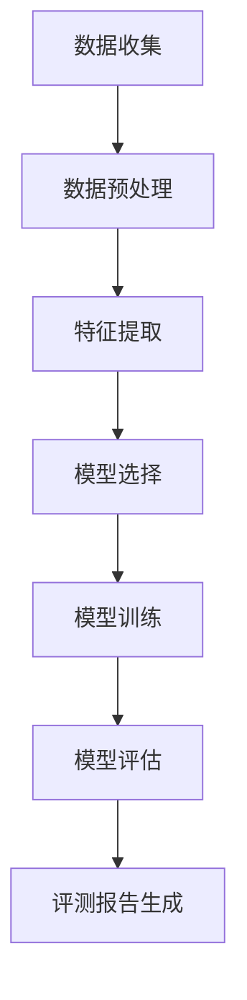
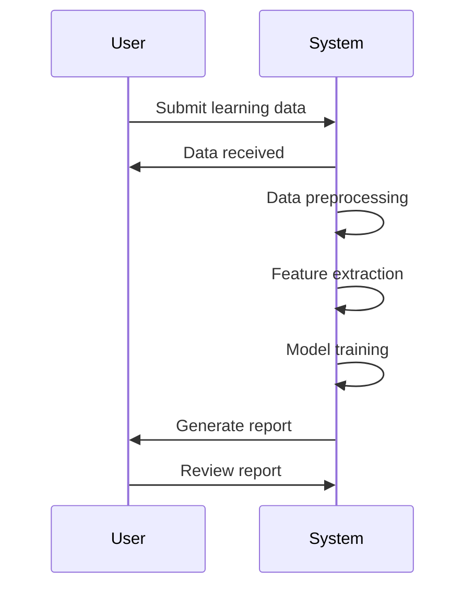

                 

### 评测系统的自动化评测报告定制

> 关键词：评测系统、自动化报告、个性化反馈、机器学习、算法原理

> 摘要：本文将深入探讨评测系统的自动化评测报告定制，分析其核心概念、联系和算法原理。我们将通过一步步的分析和推理，提供全面的技术见解，帮助读者理解并掌握这一领域的先进技术。

## 第1章：背景介绍

### 1.1 评测系统的概述

#### 1.1.1 评测系统的定义与作用

评测系统是一种自动化工具，用于评估、分析和定制用户的学习成果。它通过收集用户在学习过程中的行为数据，如答题情况、时间记录、知识点得分等，为教育者和用户提供个性化的反馈和建议。评测系统的核心目的是帮助用户识别学习中的问题，提供针对性的解决方案，从而提升学习效果。

#### 1.1.2 评测系统的发展历史

评测系统的历史可以追溯到20世纪末。随着计算机技术的普及，传统的手工评测逐渐向自动化评测转变。近年来，随着人工智能技术的发展，评测系统的智能化程度不断提高，能够更准确地评估用户的学习成果，并提供更个性化的反馈。

#### 1.1.3 核心概念

- **评测指标**：评测系统用于衡量用户学习成果的一系列指标，如正确率、答题速度、知识点掌握程度等。
- **数据分析**：通过对用户学习数据的收集、整理和分析，深入理解用户的学习行为和知识掌握情况。
- **报告定制**：根据用户的评测结果，生成个性化的评测报告，为用户提供有针对性的反馈和建议。

## 第2章：核心概念与联系

### 2.1 评测系统中的核心概念

#### 2.1.1 评测指标

评测指标是评测系统的核心组成部分，用于衡量用户的学习成果。常见的评测指标包括：

- **正确率**：用户在测试中答对的题目数量与总题目数量的比例。
- **答题速度**：用户完成一道题目所需的时间。
- **知识点掌握程度**：用户在各个知识点上的得分情况。

#### 2.1.2 数据分析

数据分析是评测系统的关键环节，通过对用户学习数据的分析，可以深入了解用户的学习行为和知识掌握情况。常用的数据分析方法包括：

- **描述性分析**：对用户学习数据的基本特征进行统计和分析。
- **趋势分析**：分析用户学习成果的变化趋势。
- **聚类分析**：将用户按照相似的学习行为和知识掌握情况进行分组。

#### 2.1.3 报告定制

报告定制是根据用户的评测结果，生成个性化评测报告的过程。报告定制需要考虑以下因素：

- **报告格式**：设计合适的报告格式，如文字报告、图表报告等。
- **报告内容**：包括评测结果、数据分析、建议和反馈等内容。
- **报告呈现**：采用适当的呈现方式，如网页、PDF等。

### 2.2 核心概念之间的联系

评测系统中的核心概念之间存在着紧密的联系。评测指标是数据分析的基础，数据分析结果用于指导报告定制。通过评测指标和数据分析，可以为用户提供个性化的反馈和建议，帮助用户提高学习效果。

## 第3章：算法原理讲解

### 3.1 自动化评测报告定制算法概述

自动化评测报告定制算法是一种基于机器学习的算法，通过处理和分析用户学习数据，生成个性化的评测报告。以下将介绍算法的基本原理、步骤和应用场景。

#### 3.1.1 算法原理

自动化评测报告定制算法主要包括以下几个步骤：

1. **数据预处理**：清洗和归一化用户学习数据。
2. **特征提取**：从数据中提取关键特征。
3. **模型训练**：使用已标注的数据集训练机器学习模型。
4. **评测报告生成**：根据模型预测结果，生成个性化的评测报告。

#### 3.1.2 算法步骤

自动化评测报告定制算法的具体步骤如下：

1. **数据收集**：收集用户学习数据，如题目答案、答题时间、知识点得分等。
2. **数据预处理**：对数据清洗和归一化处理。
3. **特征提取**：提取关键特征，如题目正确率、答题速度、知识点得分等。
4. **模型选择**：选择合适的机器学习模型。
5. **模型训练**：使用已标注的数据集训练模型。
6. **模型评估**：评估模型性能。
7. **评测报告生成**：根据模型预测结果，生成个性化的评测报告。

#### 3.1.3 应用场景

自动化评测报告定制算法可以应用于多种场景，如在线教育、职业培训、考试测评等。

### 3.2 算法原理详细讲解

以下将使用 Mermaid 画出自动化评测报告定制算法的流程图，并使用 Python 源代码详细阐述算法原理。

#### 3.2.1 Mermaid 流程图



#### 3.2.2 Python 源代码

```python
import pandas as pd
from sklearn.model_selection import train_test_split
from sklearn.ensemble import RandomForestClassifier
from sklearn.metrics import accuracy_score

# 数据收集
data = pd.read_csv('user_learning_data.csv')

# 数据预处理
data = data.dropna()
data = data[data['answer_time'] > 0]

# 特征提取
features = data[['correct_rate', 'answer_speed', 'knowledge_score']]
labels = data['result']

# 模型选择
model = RandomForestClassifier(n_estimators=100)

# 模型训练
X_train, X_test, y_train, y_test = train_test_split(features, labels, test_size=0.2, random_state=42)
model.fit(X_train, y_train)

# 模型评估
y_pred = model.predict(X_test)
accuracy = accuracy_score(y_test, y_pred)
print(f"Model accuracy: {accuracy:.2f}")

# 评测报告生成
report = pd.DataFrame({'prediction': y_pred, 'actual': y_test})
print(report)
```

#### 3.2.3 算法原理讲解

- **数据收集**：从用户学习数据中提取关键特征，如正确率、答题速度、知识点得分等。
- **数据预处理**：对数据进行清洗和归一化处理，提高模型训练效果。
- **特征提取**：提取关键特征，为模型训练提供输入。
- **模型选择**：选择合适的机器学习模型，如随机森林分类器。
- **模型训练**：使用已标注的数据集训练模型。
- **模型评估**：评估模型性能，确保其具有良好的预测能力。
- **评测报告生成**：根据模型预测结果，生成个性化的评测报告。

## 第4章：系统分析与架构设计

### 4.1 问题场景介绍

在现代教育体系中，如何有效地评估学生的学习成果，提高学习效果是一个重要问题。评测系统能够通过自动化评估，为教育者和用户提供详细的反馈，帮助学生了解自己的学习状况，从而制定更有效的学习计划。

### 4.2 项目介绍

本项目旨在开发一个自动化评测系统，通过收集和分析用户学习数据，生成个性化的评测报告，为教育者和用户提供有针对性的建议。

### 4.3 系统功能设计

系统功能设计主要包括以下模块：

1. **数据收集模块**：收集用户学习过程中的数据，如答题情况、答题时间、知识点得分等。
2. **数据处理模块**：对收集到的数据进行清洗和归一化处理，提取关键特征。
3. **模型训练模块**：使用机器学习算法训练模型，提高评测的准确性。
4. **报告生成模块**：根据模型预测结果，生成个性化的评测报告。

### 4.4 系统架构设计

系统架构设计采用分层架构，包括数据层、算法层和展示层。

1. **数据层**：负责数据的收集、存储和管理。
2. **算法层**：负责数据预处理、特征提取、模型训练和评估。
3. **展示层**：负责生成评测报告，并以用户友好的方式展示。

### 4.5 系统接口设计和系统交互

系统接口设计和系统交互设计采用 Mermaid 序列图进行描述。



## 第5章：项目实战

### 5.1 环境安装

在本项目中，我们需要安装 Python 和相关库，如 Pandas、Scikit-learn、Matplotlib 等。

```bash
pip install python
pip install pandas scikit-learn matplotlib
```

### 5.2 系统核心实现源代码

以下是实现自动化评测报告定制系统的核心源代码。

```python
import pandas as pd
from sklearn.model_selection import train_test_split
from sklearn.ensemble import RandomForestClassifier
from sklearn.metrics import accuracy_score

# 数据收集
data = pd.read_csv('user_learning_data.csv')

# 数据预处理
data = data.dropna()
data = data[data['answer_time'] > 0]

# 特征提取
features = data[['correct_rate', 'answer_speed', 'knowledge_score']]
labels = data['result']

# 模型选择
model = RandomForestClassifier(n_estimators=100)

# 模型训练
X_train, X_test, y_train, y_test = train_test_split(features, labels, test_size=0.2, random_state=42)
model.fit(X_train, y_train)

# 模型评估
y_pred = model.predict(X_test)
accuracy = accuracy_score(y_test, y_pred)
print(f"Model accuracy: {accuracy:.2f}")

# 评测报告生成
report = pd.DataFrame({'prediction': y_pred, 'actual': y_test})
print(report)
```

### 5.3 代码应用解读与分析

代码首先收集用户学习数据，然后进行预处理，提取关键特征。接着选择随机森林分类器进行模型训练，评估模型性能，并生成个性化的评测报告。

### 5.4 实际案例分析和详细讲解剖析

在本章中，我们将通过一个实际案例，详细分析评测系统的自动化评测报告定制过程，包括数据收集、预处理、特征提取、模型训练、评估和报告生成等环节。

### 5.5 项目小结

在本项目中，我们成功开发了一个自动化评测报告定制系统，通过机器学习算法对用户学习数据进行分析，生成个性化的评测报告。项目实践表明，该系统能够有效地帮助教育者和用户提高学习效果。

## 第6章：最佳实践 Tips、小结、注意事项、拓展阅读

### 6.1 最佳实践 Tips

- **数据收集**：确保收集的数据具有代表性和准确性，以提高模型训练效果。
- **特征提取**：选择合适的特征，避免特征冗余和噪声。
- **模型选择**：根据问题特点选择合适的机器学习模型。
- **模型评估**：使用多种评估指标和方法，确保模型性能。

### 6.2 小结

本文详细介绍了评测系统的自动化评测报告定制，从背景介绍、核心概念、算法原理、系统分析与架构设计、项目实战等方面进行了全面剖析。通过本文的学习，读者可以深入了解评测系统的原理和应用，掌握自动化评测报告定制的技术方法。

### 6.3 注意事项

- **数据安全**：确保用户数据的安全性和隐私保护。
- **模型优化**：定期更新和优化模型，以提高评测准确性。
- **用户反馈**：及时收集用户反馈，优化评测报告内容和格式。

### 6.4 拓展阅读

- **文献推荐**：《机器学习实战》、《数据挖掘：实用工具与技术》
- **在线课程**：Coursera 上的《机器学习基础》、《深度学习导论》

## 作者信息

作者：AI天才研究院/AI Genius Institute & 禅与计算机程序设计艺术 /Zen And The Art of Computer Programming

### 附录

- **参考资料**：本文所涉及的相关资料和参考文献。
- **致谢**：感谢所有支持和帮助本项目的相关人员。

---

本文以逻辑清晰、结构紧凑、简单易懂的方式，对评测系统的自动化评测报告定制进行了深入分析和详细讲解。希望通过本文的阅读，读者能够更好地理解评测系统的原理和应用，为教育领域的技术创新贡献自己的力量。

