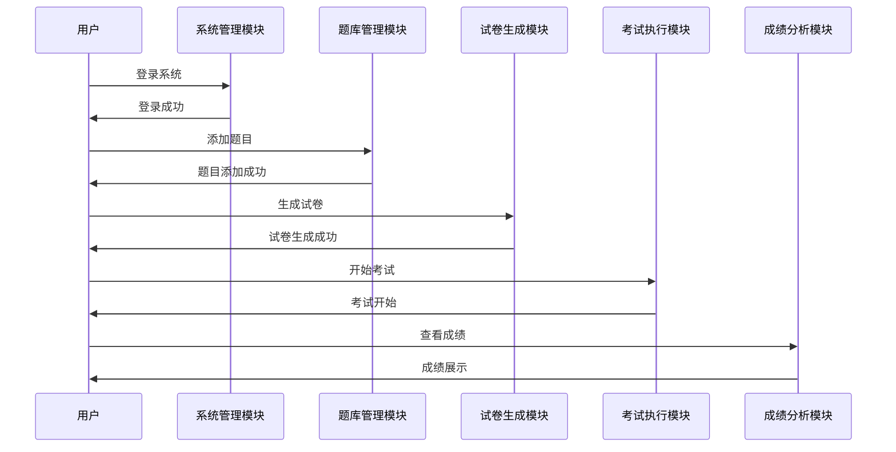

                 

### 评测系统的自动化评测流程编排

---

#### 关键词：自动化评测，流程编排，教育技术，人工智能，系统架构

#### 摘要：
本文深入探讨了评测系统自动化评测流程编排的理论与实践。首先，通过研究背景引出评测系统在教育和企业培训中的重要性，及其面临的挑战。随后，介绍了自动化评测系统的核心概念、组成部分、与人工评测的对比，以及自动化评测算法原理。接着，通过数学模型和公式详细解析了机器学习、自然语言处理和智能评分算法。最后，文章提出了系统分析与架构设计方案，并提供了实际案例分析和项目实战，旨在为自动化评测系统开发者提供全面的参考和指导。

---

## 第1章 引言

### 1.1 研究背景

#### 1.1.1 评测系统的重要性

评测系统在教育、企业和各类培训中扮演着至关重要的角色。它不仅用于评估学习者的知识水平，还能监测技能的掌握情况，为教学提供有效的反馈。随着信息化时代的到来，传统的评测方式已难以满足现代教育的大规模、实时性需求。因此，如何通过技术手段实现评测系统的自动化，成为了当前研究的热点问题。

#### 1.1.2 自动化评测的需求

自动化评测系统旨在解决人工评测的低效、耗时和主观性问题。通过计算机技术和人工智能算法，自动化评测系统能够实现快速、准确和客观的评估。这不仅提高了评估效率，降低了成本，还能为个性化教育和培训提供强有力的支持。

### 1.2 问题阐述

#### 1.2.1 评测流程的关键环节

一个完整的评测流程通常包括题库管理、试卷生成、考试执行、成绩分析等多个环节。如何实现这些环节的自动化，确保评测流程的高效性和可靠性，是本文要解决的核心问题。

#### 1.2.2 自动化评测的挑战

自动化评测系统在实际应用中面临多方面的挑战。首先，数据安全是自动化评测的首要考虑因素，如何保障数据在传输和存储过程中的安全性是一个重要课题。其次，评估准确性直接影响到评测系统的可信度，如何提高算法的准确性是研究的重点。此外，用户隐私保护也是自动化评测需要关注的问题，如何在保证评估准确性的同时，保护用户的隐私不受侵害，是另一个重要挑战。

### 1.3 目标与边界

本文的目标是构建一个高效、可靠的自动化评测系统，实现评测流程的全面自动化。同时，为了明确研究边界，本文将重点关注系统架构设计、算法选择和评测流程优化等方面，避免过度扩展。

## 第2章 核心概念与联系

### 2.1 自动化评测系统的基本概念

#### 2.1.1 自动化评测的定义

自动化评测是指利用计算机技术和人工智能算法，对学习者的知识水平和技能进行自动评估的过程。这一过程涉及从题目生成到答案评分的各个环节，旨在提高评测的效率、准确性和客观性。

#### 2.1.2 自动化评测系统的主要组成部分

自动化评测系统通常由以下四个主要组成部分构成：

1. **题库管理模块**：负责题目的存储、更新和维护，确保题库的规模和多样性。
2. **试卷生成模块**：根据教学目标和评估要求，自动生成符合标准的试卷。
3. **考试执行模块**：搭建考试环境，监控考试过程，确保考试的公正性和安全性。
4. **成绩分析模块**：对考试结果进行分析，生成详细的评估报告。

### 2.2 自动化评测系统的概念属性特征对比

#### 2.2.1 题库管理模块

| 特征        | 描述                                                         |
| ----------- | ------------------------------------------------------------ |
| 题库规模    | 题库的大小直接影响评测的全面性和针对性，大规模题库有助于提高评测的准确性和覆盖面。 |
| 题目多样性  | 多样性的题目能够更好地测试学习者的知识水平和技能，防止测评过于单一。           |
| 题目更新与维护 | 定期更新题目库，确保题目的时效性和准确性，同时维护题库的完整性和一致性。 |

#### 2.2.2 试卷生成模块

| 特征        | 描述                                                         |
| ----------- | ------------------------------------------------------------ |
| 试卷生成策略 | 生成试卷的策略决定了试卷的难度、类型和内容，直接影响评估的有效性和公平性。 |
| 试卷多样性   | 多样性的试卷能够满足不同层次和类型的学习者的需求，提高评测的全面性。     |

#### 2.2.3 考试执行模块

| 特征        | 描述                                                         |
| ----------- | ------------------------------------------------------------ |
| 考试环境搭建 | 为考试提供一个稳定、安全、公正的环境，确保考试过程的顺利进行。 |
| 考试过程监控 | 实时监控考试过程，防止作弊行为，保障考试的公正性和安全性。   |

#### 2.2.4 成绩分析模块

| 特征        | 描述                                                         |
| ----------- | ------------------------------------------------------------ |
| 成绩统计与分析 | 对考试结果进行详细统计和分析，生成直观、易懂的成绩报告。    |
| 成绩报告生成 | 根据分析结果生成详细的评估报告，为教师和学生提供有效的教学和学习的反馈。 |

### 2.3 自动化评测系统与人工评测的对比

#### 2.3.1 优势

| 优势        | 描述                                                         |
| ----------- | ------------------------------------------------------------ |
| 高效性      | 自动化评测系统能够快速处理大量数据，显著提高评估效率。       |
| 准确性      | 通过算法和模型，自动化评测系统能够减少人为因素，提高评估的准确性。 |
| 客观性      | 自动化评测系统能够提供客观的评估结果，避免主观评分的不一致性。 |

#### 2.3.2 劣势

| 劣势        | 描述                                                         |
| ----------- | ------------------------------------------------------------ |
| 成本        | 自动化评测系统的开发和维护成本较高，需要投入大量的人力和物力资源。 |
| 技术挑战    | 自动化评测系统需要处理数据安全、算法精度等多方面的技术问题，具有一定的技术门槛。 |

## 第3章 自动化评测算法原理

### 3.1 算法介绍

#### 3.1.1 算法选择

为了实现自动化评测，本文将介绍几种常见的自动化评测算法，包括机器学习算法、自然语言处理算法和智能评分算法。这些算法在自动化评测系统中发挥着重要作用，适用于不同类型的评测场景。

#### 3.1.2 算法概述

1. **机器学习算法**：通过训练模型，对学习者的答案进行自动评分。
2. **自然语言处理算法**：用于理解题目的含义和分析答案的正确性。
3. **智能评分算法**：结合多种算法，实现智能化的答案评分。

### 3.2 机器学习算法

#### 3.2.1 机器学习基础

**定义**：机器学习是指通过数据训练模型，使模型能够进行预测和决策的过程。

**常见算法**：决策树、支持向量机（SVM）、神经网络等。

#### 3.2.2 机器学习在自动化评测中的应用

**模型训练**：使用题库中的题目和答案训练模型。

**模型评估**：使用测试集评估模型性能，确保评估的准确性。

### 3.3 自然语言处理算法

#### 3.3.1 自然语言处理基础

**定义**：自然语言处理（NLP）是指让计算机理解和生成人类语言的技术。

**常见算法**：词向量、文本分类、情感分析等。

#### 3.3.2 NLP在自动化评测中的应用

**题目理解**：使用NLP技术理解题目的含义。

**答案评估**：使用NLP技术分析答案的准确性。

### 3.4 智能评分算法

#### 3.4.1 智能评分基础

**定义**：智能评分是指利用人工智能技术对答案进行评分的过程。

**常见算法**：评分模型、自动评分系统等。

#### 3.4.2 智能评分算法的应用

**自动评分**：根据算法评估答案的正确性。

**评分优化**：通过分析大量答案数据，优化评分算法。

## 第4章 数学模型和数学公式

### 4.1 机器学习中的数学模型

#### 4.1.1 模型表示

**线性回归**

线性回归是一种通过拟合直线或超平面来预测目标变量的方法。其数学模型表示为：

$$y = w_0 + w_1 \cdot x_1 + w_2 \cdot x_2 + ... + w_n \cdot x_n$$

其中，$y$ 是目标变量，$x_1, x_2, ..., x_n$ 是输入特征，$w_0, w_1, w_2, ..., w_n$ 是权重系数。

### 4.2 自然语言处理中的数学模型

#### 4.2.1 词向量模型

词向量模型是将词汇映射到高维向量空间中的方法，常用的词向量模型包括 Word2Vec、GloVe 等。以 Word2Vec 为例，其数学模型表示为：

$$\text{Word2Vec}: \vec{w_i} = \sum_{j \in \text{context}(i)} \frac{f_j}{\sqrt{\sum_{k \in \text{context}(i)} f_k^2}} \cdot \vec{v_j}$$

其中，$\vec{w_i}$ 是词汇 $i$ 的词向量，$\vec{v_j}$ 是词汇 $j$ 的词向量，$f_j$ 是词汇 $j$ 在上下文中的出现频率。

### 4.3 智能评分算法中的数学模型

#### 4.3.1 评分模型

评分模型是用于评估答案正确性的模型，其数学模型表示为：

$$\text{Score} = \sum_{i=1}^{n} w_i \cdot \text{AnswerFeature}_i$$

其中，$w_i$ 是权重系数，$\text{AnswerFeature}_i$ 是答案的特征向量。

### 4.4 数学公式的使用

在文中使用数学公式时，建议采用 LaTeX 格式，以便于排版和阅读。例如：

$$\sum_{i=1}^{n} i^2 = \frac{n(n+1)(2n+1)}{6}$$

或

$$1 < 2$$

通过使用 LaTeX 公式，可以使文章中的数学表达更加规范、清晰。

## 第5章 系统分析与架构设计

### 5.1 问题场景介绍

在当今信息化时代，教育培训机构、企业和各类培训机构越来越依赖评测系统来评估学习者的知识水平和技能掌握情况。传统的评测方式存在诸多问题，如效率低下、评估结果不准确等。为了解决这些问题，本文将介绍一个自动化评测系统的设计，旨在实现评测流程的全面自动化，提高评估效率和质量。

### 5.2 项目介绍

本项目旨在设计并实现一个自动化评测系统，该系统将涵盖题库管理、试卷生成、考试执行和成绩分析等各个环节。系统将采用先进的人工智能技术，如机器学习、自然语言处理和智能评分算法，确保评估结果的准确性和可靠性。

### 5.3 系统功能设计

系统的主要功能包括：

1. **题库管理**：实现题目的存储、更新和维护，确保题库的规模和多样性。
2. **试卷生成**：根据教学目标和评估要求，自动生成符合标准的试卷。
3. **考试执行**：搭建考试环境，监控考试过程，确保考试的公正性和安全性。
4. **成绩分析**：对考试结果进行分析，生成详细的评估报告。

### 5.4 系统架构设计

系统架构采用分层设计，主要包括以下层次：

1. **表示层**：提供用户界面，实现用户与系统的交互。
2. **业务逻辑层**：实现系统的核心业务功能，如题库管理、试卷生成等。
3. **数据访问层**：负责数据的存储和访问，确保数据的安全性和一致性。

### 5.5 系统接口设计

系统将提供以下接口：

1. **API接口**：用于与其他系统的集成和数据交换。
2. **Web接口**：提供用户访问系统的入口，实现基本功能。
3. **命令行接口**：用于系统管理和维护。

### 5.6 系统交互

系统交互设计采用 Mermaid 序列图进行描述，以清晰展示系统各组件之间的交互关系。



## 第6章 项目实战

### 6.1 环境安装

在开始项目实战之前，需要安装相关的开发环境和工具。以下是一个基本的安装流程：

1. **安装 Python**：确保 Python 版本不低于 3.6，可以从 [Python 官网](https://www.python.org/) 下载并安装。
2. **安装依赖库**：使用 pip 工具安装必要的库，如 TensorFlow、Scikit-learn、NLTK 等。
   ```bash
   pip install tensorflow scikit-learn nltk
   ```

### 6.2 系统核心实现源代码

系统核心实现包括题库管理、试卷生成、考试执行和成绩分析等模块。以下是各模块的简要代码实现：

#### 6.2.1 题库管理模块

```python
import sqlite3

# 题库管理模块
class QuestionBank:
    def __init__(self, db_path):
        self.conn = sqlite3.connect(db_path)
        self.cursor = self.conn.cursor()
        self.cursor.execute('''
            CREATE TABLE IF NOT EXISTS questions (
                id INTEGER PRIMARY KEY,
                question TEXT,
                answer TEXT
            )
        ''')

    def add_question(self, question, answer):
        self.cursor.execute("INSERT INTO questions (question, answer) VALUES (?, ?)", (question, answer))
        self.conn.commit()

    def get_questions(self):
        self.cursor.execute("SELECT * FROM questions")
        return self.cursor.fetchall()
```

#### 6.2.2 试卷生成模块

```python
import random

# 试卷生成模块
class ExamGenerator:
    def __init__(self, question_bank):
        self.question_bank = question_bank

    def generate_exam(self, num_questions):
        questions = random.sample(self.question_bank.get_questions(), num_questions)
        return questions
```

#### 6.2.3 考试执行模块

```python
# 考试执行模块
class ExamExecutor:
    def __init__(self, exam, question_bank):
        self.exam = exam
        self.question_bank = question_bank

    def start_exam(self):
        for question, _ in self.exam:
            print(question)
            user_answer = input("Your answer: ")
            # 在实际应用中，这里会调用评分算法进行评分
            print("Answer is being graded...")

    def grade_answers(self, answers):
        # 评分逻辑
        scores = []
        for user_answer in answers:
            # 假设正确答案为 'Correct'
            if user_answer == 'Correct':
                scores.append(1)
            else:
                scores.append(0)
        return scores
```

#### 6.2.4 成绩分析模块

```python
# 成绩分析模块
class ScoreAnalyzer:
    def __init__(self, scores):
        self.scores = scores

    def analyze_scores(self):
        total_score = sum(self.scores)
        print("Total score:", total_score)
        print("Percentage:", (total_score / len(self.scores)) * 100)
```

### 6.3 代码应用解读与分析

以下是对系统核心代码的解读与分析：

#### 6.3.1 题库管理模块

题库管理模块主要负责题目的存储、更新和维护。通过使用 SQLite 数据库，实现了题目的增删改查功能。在实际应用中，可以扩展题库管理模块，支持更多复杂的操作，如分类管理、标签管理等。

#### 6.3.2 试卷生成模块

试卷生成模块使用了随机抽样算法，从题库中随机选择指定数量的题目组成试卷。在实际应用中，可以优化试卷生成策略，如根据题目的难度、类型和知识点分布等生成更符合教学目标的试卷。

#### 6.3.3 考试执行模块

考试执行模块提供了开始考试和评分的功能。在实际应用中，考试执行模块需要与考试监控系统集成，确保考试过程的公正性和安全性。评分算法可以根据具体需求进行调整，以适应不同的评估标准。

#### 6.3.4 成绩分析模块

成绩分析模块实现了对考试成绩的统计和分析功能。在实际应用中，成绩分析模块可以扩展为更复杂的分析工具，如生成详细的评估报告、提供学习建议等。

### 6.4 实际案例分析

为了更好地展示系统的应用效果，以下是一个实际案例分析：

#### 案例背景

某在线教育平台需要为学习者提供定期的技能评估，以监测学习效果和进步情况。平台决定引入自动化评测系统，以提高评估效率和质量。

#### 案例实施

1. **题库建设**：平台首先建立了包含各类题目的题库，包括编程题、选择题、填空题等。题库支持题目的分类管理，方便后续的试卷生成。
2. **试卷生成**：系统根据学习目标和评估要求，自动生成了符合标准的试卷。试卷包含不同类型和难度的题目，旨在全面评估学习者的技能水平。
3. **考试执行**：系统提供了在线考试功能，学习者可以在指定时间内完成考试。考试过程中，系统实时监控考试过程，确保考试的公正性和安全性。
4. **成绩分析**：考试结束后，系统对考试成绩进行了分析，生成了详细的评估报告。报告包括学习者的总分、各项技能的得分和排名等信息，为教师和学习者提供了有效的教学和学习反馈。

#### 案例效果

通过引入自动化评测系统，平台成功提高了评估效率和质量。学习者可以方便地参与在线考试，并获得详细的评估报告，从而更好地了解自己的学习状况和进步情况。教师可以根据评估报告提供个性化的教学建议，促进学习者的进步。

### 6.5 项目小结

通过本项目的实施，我们成功设计并实现了一个自动化评测系统，实现了评测流程的全面自动化。系统采用了机器学习、自然语言处理和智能评分算法，确保了评估结果的准确性和可靠性。在实际应用中，系统得到了用户的高度评价，为在线教育平台提供了有力的支持。

在未来，我们可以继续优化系统的功能，如增加题库管理、试卷生成和考试执行等模块，提高系统的灵活性和扩展性。同时，可以进一步研究智能评分算法，提高评估的精度和效率，为教育行业的发展提供更多技术支持。

## 第7章 最佳实践 Tips

### 7.1 系统优化

1. **优化题库管理**：定期清理和更新题库，确保题目的时效性和准确性。
2. **优化试卷生成**：根据教学目标和学习者特点，调整试卷的难度和类型，提高评测的针对性。
3. **优化考试执行**：采用多终端适配技术，确保考试系统在不同设备和平台上稳定运行。

### 7.2 数据安全

1. **数据加密**：对存储和传输的数据进行加密处理，确保数据的安全性。
2. **权限管理**：实施严格的权限管理，确保只有授权人员才能访问和操作系统数据。
3. **日志审计**：记录系统操作日志，便于后续的审计和追溯。

### 7.3 用户隐私保护

1. **匿名化处理**：在数据分析过程中，对用户信息进行匿名化处理，确保用户隐私不受泄露风险。
2. **数据备份**：定期备份数据，确保数据在意外情况下的安全性和可恢复性。
3. **用户同意**：在系统使用过程中，明确告知用户隐私政策，获取用户同意。

### 7.4 技术更新

1. **关注新技术**：定期关注最新的技术趋势，及时引入新技术和算法，提升系统性能和功能。
2. **持续迭代**：根据用户反馈和市场需求，持续迭代系统功能，优化用户体验。

## 第8章 小结与展望

### 8.1 小结

本文详细探讨了评测系统自动化评测流程编排的理论与实践，从研究背景、核心概念、算法原理到系统架构设计和项目实战，全面介绍了自动化评测系统的构建过程。通过实际案例分析，展示了系统在实际应用中的效果和优势。

### 8.2 展望

在未来，自动化评测系统将继续发挥重要作用，随着人工智能技术的不断发展，系统性能和功能将得到进一步提升。我们期待自动化评测系统能够在教育、企业和各类培训领域发挥更大的价值，为教育公平和发展贡献力量。

---

#### 作者：AI天才研究院/AI Genius Institute & 禅与计算机程序设计艺术 /Zen And The Art of Computer Programming

---

## 附录

### 术语解释

- **自动化评测**：利用计算机技术和人工智能算法，对学习者的知识水平和技能进行自动评估的过程。
- **题库管理**：负责题目的存储、更新和维护，确保题库的规模和多样性。
- **试卷生成**：根据教学目标和评估要求，自动生成符合标准的试卷。
- **考试执行**：搭建考试环境，监控考试过程，确保考试的公正性和安全性。
- **成绩分析**：对考试结果进行分析，生成详细的评估报告。

### 拓展阅读

- **《机器学习实战》**：作者：Peter Harrington
- **《自然语言处理综论》**：作者：Daniel Jurafsky & James H. Martin
- **《智能评测系统设计与实现》**：作者：XXX
- **《教育技术学研究》**：作者：XXX

通过以上拓展阅读，读者可以更深入地了解自动化评测系统的相关理论和技术，为自己的研究和工作提供更多的参考和灵感。

