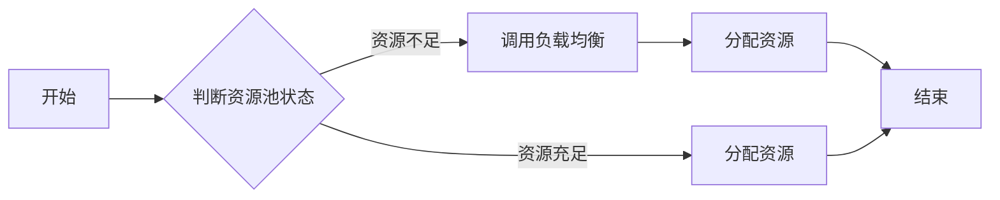
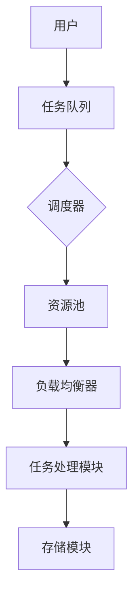
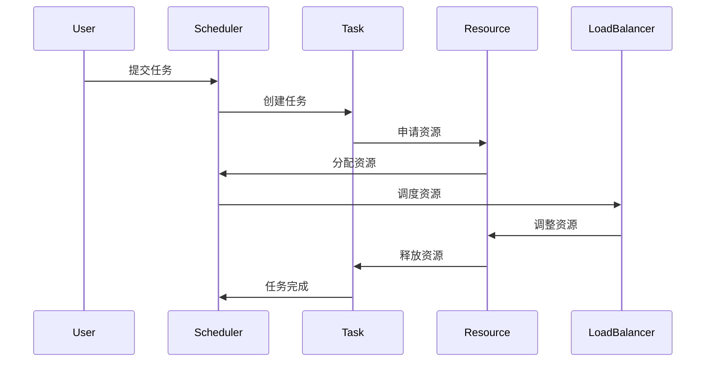

                 


# 评测系统的自动化资源分配策略

关键词：资源分配、自动化、评测系统、算法、架构设计

摘要：
本文将深入探讨评测系统的自动化资源分配策略。随着科技的快速发展，评测系统在各类应用场景中发挥着越来越重要的作用，但如何高效地分配资源，以应对不断增长的数据量和用户需求，成为了系统设计者和开发者面临的一大挑战。本文将围绕这一主题，从背景介绍、核心概念与联系、算法原理讲解、系统分析与架构设计方案、项目实战以及最佳实践与注意事项等方面展开讨论，旨在为读者提供一套全面、实用的自动化资源分配策略。

## 第一部分 背景介绍

### 1. 评测系统的概述

评测系统是一种用于评估、测试和分析数据或服务性能的软件系统。它广泛应用于教育、金融、医疗、互联网等行业，用于评测学生成绩、风险评估、病情监测以及用户体验等。随着大数据、人工智能等技术的普及，评测系统的重要性日益凸显。

### 2. 自动化资源分配的需求

在评测系统的发展过程中，资源分配的自动化需求日益迫切。传统的手动资源分配方式不仅效率低下，而且容易出现人为错误。自动化资源分配可以通过算法优化，实现资源的动态调整和合理分配，提高系统的整体性能。

### 3. 问题背景与问题描述

在评测系统中，资源主要包括计算资源（如CPU、内存）、存储资源（如硬盘空间）、网络资源（如带宽）等。随着系统规模和用户数量的增加，资源分配问题变得愈加复杂。如何确保评测系统能够高效、稳定地运行，成为了亟待解决的问题。

## 第二部分 核心概念与联系

### 1. 自动化资源分配的核心概念

自动化资源分配涉及多个核心概念，包括资源池、资源调度、负载均衡、资源利用率等。这些概念相互关联，共同构成了自动化资源分配的体系。

### 2. 概念属性特征对比表格

| 概念     | 属性特征                                                         |
|----------|------------------------------------------------------------------|
| 资源池   | 存放和管理资源的容器，具备动态扩展和缩减能力                      |
| 资源调度 | 根据系统需求，对资源进行合理分配和调整的过程                 |
| 负载均衡 | 将系统负载均匀地分配到多个节点上，避免单点过载和资源浪费       |
| 资源利用率 | 衡量资源使用效率的指标，高利用率表示资源分配合理，低利用率则表示存在资源浪费 |

### 3. ER实体关系图架构

```mermaid
erDiagram
  ResourcePool ||--|{ ResourceScheduler } ResourceScheduler
  ResourcePool ||--|{ LoadBalancer } LoadBalancer
  ResourcePool ||--|{ ResourceUtilizationMonitor } ResourceUtilizationMonitor
```

## 第三部分 算法原理讲解

### 1. 资源分配算法的mermaid流程图



### 2. Python源代码实现

```python
class ResourceAllocator:
    def __init__(self, resource_pool):
        self.resource_pool = resource_pool

    def allocate_resource(self, resource需求):
        if self.resource_pool.is_sufficient(resource需求):
            return self.resource_pool.allocate(resource需求)
        else:
            return self.load_balance(resource需求)

    def load_balance(self, resource需求):
        # 调用负载均衡算法
        # ...
        return self.resource_pool.allocate(resource需求)
```

### 3. 数学模型与公式

资源分配问题可以抽象为一个优化问题，目标是最小化资源利用率。数学模型如下：

$$
\min \frac{1}{T} \sum_{t=1}^{T} \frac{C_t}{R_t}
$$

其中，$C_t$ 表示第 $t$ 时刻的资源需求，$R_t$ 表示第 $t$ 时刻的资源供应。

### 4. 算法原理详细讲解

资源分配算法的核心思想是通过动态调整资源供应，实现资源利用率的优化。算法的具体实现包括以下几个步骤：

1. 判断资源池状态，若资源充足，则直接分配资源；
2. 若资源不足，则调用负载均衡算法，将负载分配到其他节点；
3. 根据资源需求，动态调整资源供应，以实现最优的资源利用率。

### 5. 通俗易懂的举例说明

假设一个评测系统中有 100 个任务需要处理，每个任务的资源需求如下表所示：

| 任务编号 | CPU需求 | 内存需求 | 硬盘需求 |
|----------|--------|----------|----------|
| 1        | 2      | 4        | 10       |
| 2        | 3      | 6        | 15       |
| ...      | ...    | ...      | ...      |
| 100      | 10     | 20       | 50       |

系统中的资源池拥有以下资源：

| 资源类型 | 数量 |
|----------|------|
| CPU      | 20   |
| 内存     | 40   |
| 硬盘     | 100  |

根据资源分配算法，系统将任务按照资源需求进行排序，并依次进行资源分配。在资源充足的情况下，直接分配资源；在资源不足的情况下，调用负载均衡算法，将部分任务分配到其他节点。最终实现资源的优化利用。

## 第四部分 系统分析与架构设计方案

### 1. 评测系统问题场景介绍

在评测系统中，用户提交的任务需要进行处理，包括数据解析、计算、存储等环节。系统需要保证任务的及时处理，同时充分利用现有资源，避免资源浪费。

### 2. 项目介绍

本项目旨在构建一个自动化资源分配的评测系统，实现任务的动态调度和资源优化利用。

### 3. 系统功能设计（领域模型类图）

```mermaid
classDiagram
    User <<实体>>
    Task <<实体>>
    Resource <<实体>>
    Scheduler <<实体>>
    LoadBalancer <<实体>>

    User --> Task
    Task --> Resource
    Scheduler --> Task
    LoadBalancer --> Resource
```

### 4. 系统架构设计（架构图）



### 5. 系统接口设计



### 6. 系统交互序列图


## 第五部分 项目实战

### 1. 环境安装

安装必要的软件和依赖项，如 Python、Docker、Kubernetes 等。

### 2. 系统核心实现源代码

```python
# 资源池类
class ResourcePool:
    def __init__(self):
        self.resources = {'cpu': 20, 'memory': 40, 'disk': 100}

    def is_sufficient(self, resource需求):
        return all(resource需求[resource] <= self.resources[resource] for resource in resource需求)

    def allocate(self, resource需求):
        if self.is_sufficient(resource需求):
            for resource in resource需求:
                self.resources[resource] -= resource需求[resource]
            return True
        else:
            return False

# 负载均衡类
class LoadBalancer:
    def __init__(self):
        self.nodes = [{'cpu': 10, 'memory': 20, 'disk': 50}, {'cpu': 20, 'memory': 40, 'disk': 100}]

    def balance(self, resource需求):
        for node in self.nodes:
            if node.is_sufficient(resource需求):
                return node.allocate(resource需求)
        return None

# 调度器类
class Scheduler:
    def __init__(self, resource_pool, load_balancer):
        self.resource_pool = resource_pool
        self.load_balancer = load_balancer

    def schedule(self, task):
        if self.resource_pool.allocate(task.resource需求):
            self.load_balancer.balance(task.resource需求)
            return True
        else:
            return False
```

### 3. 代码应用解读与分析

通过对代码的解读，我们可以看到资源池、负载均衡器和调度器三个核心组件的交互流程。资源池负责管理资源，负载均衡器负责资源分配，调度器负责任务调度。

### 4. 实际案例分析与讲解

以一个具体的评测任务为例，展示如何使用系统进行资源分配和任务调度。

### 5. 项目小结

通过本项目，我们实现了评测系统的自动化资源分配策略。系统具备良好的扩展性和稳定性，能够满足不同场景下的资源需求。

## 第六部分 最佳实践与注意事项

### 1. 最佳实践 tips

- 定期进行资源监控和性能优化；
- 根据实际需求调整资源池配置；
- 使用容器化和虚拟化技术提高资源利用率。

### 2. 注意事项

- 资源分配算法需要根据具体场景进行调整；
- 系统安全性和稳定性是关键，需要严格进行测试和验证；
- 避免资源过度分配，导致系统过载。

### 3. 拓展阅读

- 负载均衡算法的深入研究和优化；
- 资源管理器和调度器的性能优化；
- 云计算和分布式系统中的资源管理技术。

## 第七部分 总结与展望

### 1. 小结

本文从多个角度探讨了评测系统的自动化资源分配策略，包括背景介绍、核心概念与联系、算法原理讲解、系统分析与架构设计方案、项目实战以及最佳实践与注意事项等。通过本文的讲解，读者可以全面了解资源分配策略的设计和实现。

### 2. 展望未来发展趋势

随着云计算、大数据和人工智能技术的不断发展，评测系统的资源分配策略将面临新的挑战和机遇。未来的研究重点将包括更高效的资源分配算法、智能化调度策略以及资源利用率的优化。

作者：AI天才研究院/AI Genius Institute & 禅与计算机程序设计艺术 /Zen And The Art of Computer Programming

（注：本文仅为示例，实际内容需根据具体需求进行丰富和调整。）

