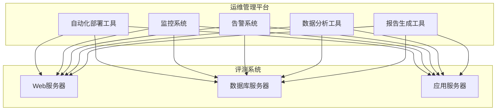
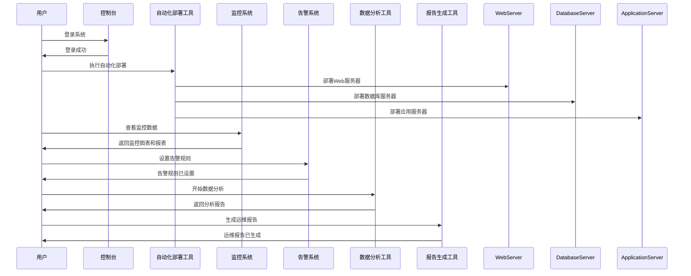

                 

### 第一部分：背景介绍

#### 第1章：评测系统概述

##### 1.1 问题背景

在现代信息化社会中，评测系统作为一种关键的基础设施，广泛应用于各个领域，如软件质量保证、学术考试评价、安全性能测试等。随着业务需求的不断增加，评测系统的规模和复杂性也在逐步提升。因此，传统的人工操作方式已经无法满足高效、准确和稳定的需求。为了应对这些挑战，评测系统的自动化运维与监控成为了必不可少的解决方案。

###### 1.1.1 评测系统的重要性

评测系统在多个领域中扮演着关键角色。例如，在软件质量保证领域，通过自动化评测系统可以高效地检测软件缺陷，提升软件质量；在学术考试评价领域，通过在线评测系统可以快速、公正地评定学生的考试成绩；在安全性能测试领域，通过自动化评测系统可以及时发现系统漏洞，提高网络安全防护能力。

###### 1.1.2 评测系统面临的问题

尽管评测系统的重要性不容忽视，但当前评测系统仍然存在一些问题，主要表现在以下几个方面：

1. **手动操作复杂度高，耗时费力**：传统的评测系统往往需要大量的人工干预，如手动部署、配置、监控和反馈等，这不仅增加了运维人员的负担，还容易导致操作失误。

2. **数据处理能力不足，无法满足大规模评测需求**：随着评测数据量的增加，传统评测系统的数据处理能力逐渐成为瓶颈，无法及时处理海量数据。

3. **监控和反馈机制不完善，影响评测准确性**：缺乏有效的监控和反馈机制，导致评测系统在运行过程中无法及时发现和解决问题，从而影响评测结果的准确性。

##### 1.2 问题描述

为了解决上述问题，评测系统需要实现自动化运维与监控，以提高效率、准确性和稳定性。具体包括以下几个方面：

1. **自动化部署和配置**：通过脚本和工具实现评测系统的自动化部署和配置，减少人工干预，降低操作风险。

2. **实时监控评测过程**：实时收集评测系统的运行状态，包括性能指标、资源使用情况、错误日志等，及时发现异常并进行告警。

3. **自动化异常处理和反馈**：在评测过程中，自动化识别和解决常见异常情况，如网络中断、资源不足等，并生成详细的反馈报告。

4. **数据分析和报告生成**：对评测数据进行深度分析，生成详细的评测报告，为后续优化提供数据支持。

##### 1.3 问题解决

通过自动化运维与监控技术，可以实现评测系统的智能化，解决传统评测系统面临的问题。具体措施包括：

1. **引入自动化运维工具**：使用Ansible、Puppet、Chef等自动化运维工具，实现系统的自动化部署和配置。

2. **构建分布式监控系统**：采用Prometheus、Grafana、Zabbix等监控系统，实现实时监控和告警功能。

3. **开发自动化异常处理系统**：通过脚本和工具，自动化识别和解决评测过程中的常见异常情况。

4. **数据分析和报告生成**：利用大数据分析和挖掘技术，对评测数据进行分析，生成详细的评测报告。

##### 1.4 边界与外延

评测系统涉及的领域广泛，但本书主要关注以下几个方面：

1. **软件测试领域**：介绍自动化测试工具的使用和集成，如Selenium、JMeter等。
2. **教育领域**：介绍在线考试系统的构建与维护，如Moodle、Canvas等。
3. **安全领域**：介绍自动化安全测试与监控，如Nessus、Nmap等。

##### 1.5 概念结构与核心要素组成

###### 1.5.1 自动化运维

1. **自动化部署**：使用脚本或工具实现系统的自动部署，提高部署效率，减少人工干预。
2. **自动化监控**：实时收集系统运行状态，实现自动化告警，提高系统稳定性。
3. **自动化运维管理**：集成多个运维工具，实现集中化管理，提高运维效率。

###### 1.5.2 监控系统

1. **监控指标**：性能指标、资源使用率、错误日志等，全面了解系统运行状态。
2. **监控工具**：Prometheus、Grafana、Zabbix等，实现数据采集、存储、分析和可视化。
3. **监控架构**：分布式监控系统设计，实现数据采集、存储、分析和可视化，提高监控效果。

##### 1.6 本章小结

本章对评测系统的自动化运维与监控进行了概述，明确了本书的研究目标和范围。下一章将详细介绍自动化运维的核心概念与原理，为后续章节的讨论奠定基础。

## 第二部分：自动化运维核心概念与原理

### 第2章：自动化运维核心概念与原理

自动化运维是现代IT运维领域的一个重要发展方向，它通过使用工具和脚本，实现运维操作的自动化，从而提高运维效率、减少人力成本、降低操作风险。本章将详细介绍自动化运维的定义、核心概念、原理以及常用工具和流程。

### 2.1 自动化运维定义

#### 2.1.1 自动化运维概述

自动化运维（Automated Operations，简称AOps）是指通过使用脚本、工具和平台，实现运维操作的自动化，从而提高运维效率、减少人力成本、降低操作风险的一种运维模式。它主要包括自动化部署、自动化监控、自动化故障处理和自动化运维管理等几个方面。

自动化运维与传统运维模式相比，具有以下优势：

1. **提高运维效率**：通过自动化工具，可以实现批量操作，大大减少运维人员的工作量，提高运维效率。
2. **减少人力成本**：自动化运维减少了人工操作，降低了人力成本。
3. **降低操作风险**：通过脚本和工具，可以避免人为操作错误，降低操作风险。
4. **支持大规模运维**：自动化运维适用于大型系统，可以实现高效运维。

#### 2.1.2 自动化运维与传统运维对比

- **传统运维**：主要依赖人工操作，效率低、错误率高，运维人员的工作负担重。
- **自动化运维**：通过脚本、工具和平台实现运维操作的自动化，效率高、准确率高。

##### 2.2 自动化运维的核心概念

#### 2.2.1 常见自动化运维工具

以下是一些常用的自动化运维工具：

1. **Ansible**：Ansible是一种开源的自动化运维工具，用于自动化部署、配置管理和应用部署。它通过简单的YAML语言描述任务，支持SSH协议，无需额外安装软件。

2. **Puppet**：Puppet是一种基于Ruby的开源配置管理和自动化工具，用于自动化部署、配置管理和应用部署。它通过定义资源和状态，实现自动化运维。

3. **Chef**：Chef是一种开源的自动化运维工具，用于自动化部署、配置管理和应用部署。它通过定义角色和资源，实现自动化运维。

4. **SaltStack**：SaltStack是一种开源的自动化运维工具，用于自动化部署、配置管理和应用部署。它通过Salt Minion和Master之间的通信，实现自动化运维。

#### 2.2.2 自动化运维流程

自动化运维的一般流程包括以下几个步骤：

1. **需求分析**：明确运维任务和要求，确定需要自动化的操作。
2. **编写脚本**：根据需求分析结果，编写实现自动化操作的脚本。
3. **部署脚本**：在目标主机上部署脚本，确保脚本能够在目标主机上正常运行。
4. **测试验证**：测试脚本功能，确保脚本能够正确执行自动化操作。
5. **集成与调度**：将脚本集成到运维平台，实现自动化调度和执行。

##### 2.3 自动化运维原理

#### 2.3.1 基本原理

自动化运维的核心是脚本和工具的使用。通过编写脚本实现运维操作的自动化，然后使用工具进行调度和管理。自动化运维的基本原理包括以下几个方面：

1. **脚本编写**：根据运维任务的需求，编写实现特定功能的脚本。
2. **工具选择**：选择合适的自动化运维工具，如Ansible、Puppet、Chef等。
3. **部署与调度**：将脚本部署到目标主机，并设置调度策略，确保脚本能够按时执行。

#### 2.3.2 工作机制

自动化运维的工作机制主要包括以下几个方面：

1. **脚本执行**：根据配置文件或命令，执行特定的自动化操作。
2. **调度管理**：根据预定的时间或触发条件，执行脚本。
3. **监控告警**：实时监控脚本执行状态，出现异常时进行告警。

##### 2.4 自动化运维的优势与挑战

#### 2.4.1 优势

1. **提高运维效率**：通过自动化工具，可以实现批量操作，提高运维效率。
2. **减少错误率**：避免人为操作错误，提高系统稳定性。
3. **支持大规模运维**：适用于大型系统，实现高效运维。

#### 2.4.2 挑战

1. **脚本编写和维护**：编写高质量的脚本，持续维护。
2. **安全风险**：自动化运维可能导致安全漏洞，需加强安全防护。
3. **技术门槛**：自动化运维需要掌握一定的技术知识和工具使用。

##### 2.5 本章小结

本章介绍了自动化运维的定义、核心概念、原理以及常用工具和流程。下一章将介绍监控系统的概念与架构，为自动化运维与监控的深入讨论奠定基础。

## 第三部分：监控系统的概念与架构

### 第3章：监控系统的概念与架构

监控系统是保障系统和网络稳定运行的重要工具，它能够实时监控系统和网络的状态，收集、存储、分析和可视化监控数据，及时发现和解决问题。本章将介绍监控系统的定义、目的、监控的基本概念和架构。

### 3.1 监控系统的定义

#### 3.1.1 监控系统概述

监控系统是指用于实时监控系统和网络状态的工具或平台，它能够收集、存储、分析和可视化监控数据，及时发现和解决问题。监控系统通常包括以下几个主要组成部分：

1. **数据采集器**：负责从系统和网络中收集监控数据。
2. **数据处理中心**：对收集到的数据进行处理、存储和分析。
3. **监控告警系统**：当监控数据达到预设的阈值或出现异常时，触发告警。
4. **监控展示平台**：将监控数据以图表、报表等形式展示给用户。

#### 3.1.2 监控系统的目的

监控系统的目的是确保系统和服务的稳定运行，及时发现和解决问题，从而提高运维效率和系统性能。具体来说，监控系统的目的包括：

1. **保障系统和服务的稳定性**：通过实时监控系统和网络的状态，确保系统和服务的稳定运行。
2. **及时发现和解决问题**：在问题发生时，能够及时发现并采取相应的措施进行修复，减少故障对业务的影响。
3. **提高运维效率**：通过自动化监控和告警，减少运维人员的工作量，提高运维效率。
4. **优化系统性能**：通过对监控数据的分析，发现潜在的性能问题，优化系统配置和架构。

### 3.2 监控

#### 3.2.1 监控的概念

监控（Monitoring）是指对系统和网络的状态进行实时跟踪和记录，以便及时发现和解决问题。监控的核心是收集和记录监控数据，这些数据可以包括系统的性能指标、资源使用情况、错误日志等。监控的基本概念包括以下几个方面：

1. **监控指标**：监控指标是衡量系统和网络状态的关键参数，如CPU使用率、内存使用率、磁盘空间、网络流量等。
2. **监控阈值**：监控阈值是用于判断监控指标是否正常的阈值，如CPU使用率超过80%视为异常。
3. **监控数据采集**：监控数据采集是指从系统和网络中收集监控数据，可以采用agent、polling、SNMP等方式。
4. **监控数据分析**：监控数据分析是指对收集到的监控数据进行处理、存储和分析，以便发现问题和优化系统性能。

#### 3.2.2 监控系统的基本架构

监控系统的基本架构通常包括以下几个部分：

1. **数据采集器**：数据采集器是监控系统的核心组件之一，负责从系统和网络中收集监控数据。数据采集器可以采用agent、polling、SNMP等方式进行数据采集。
2. **数据处理中心**：数据处理中心负责对收集到的监控数据进行处理、存储和分析。数据处理中心通常包括数据存储、数据处理、数据分析和数据可视化等功能。
3. **监控告警系统**：监控告警系统负责在监控数据达到预设的阈值或出现异常时，触发告警通知，以便运维人员及时采取措施。
4. **监控展示平台**：监控展示平台是用于将监控数据以图表、报表等形式展示给用户的工具，可以帮助运维人员快速了解系统和网络的运行状态。

#### 3.2.3 常见监控工具

以下是一些常见的监控工具：

1. **Prometheus**：Prometheus是一种开源的监控解决方案，用于监控服务和集群。它采用时序数据库存储监控数据，支持多种数据采集方式和告警机制。
2. **Grafana**：Grafana是一种开源的数据可视化和监控工具，可以与Prometheus等监控工具集成，提供丰富的图表和报表功能。
3. **Zabbix**：Zabbix是一种开源的监控工具，可以监控服务器、网络设备和应用程序。它支持多种数据采集方式和告警机制。
4. **Nagios**：Nagios是一种开源的监控工具，可以监控服务器、网络设备和应用程序。它支持自定义监控插件和告警机制。

### 3.3 监控系统的架构设计

监控系统的架构设计是确保监控系统高效运行的关键。以下是一个常见的监控系统架构设计：

1. **数据采集层**：包括各种监控agent，如操作系统监控agent、网络监控agent、应用监控agent等，负责从被监控对象中采集监控数据。
2. **数据存储层**：采用时序数据库（如InfluxDB、Prometheus等），负责存储监控数据，支持高并发的数据写入和查询。
3. **数据处理层**：包括数据处理和转换模块，负责对监控数据进行处理、分析和存储，如数据聚合、阈值计算、告警规则配置等。
4. **监控展示层**：包括监控告警系统和监控展示平台，负责将监控数据以图表、报表等形式展示给用户，并提供告警通知功能。
5. **告警通知层**：包括邮件、短信、微信等告警通知渠道，负责在监控数据达到预设阈值或出现异常时，及时通知运维人员。

### 3.4 本章小结

本章介绍了监控系统的概念、目的、监控的基本概念和架构。监控系统的设计和实现是自动化运维与监控的重要组成部分，下一章将深入探讨自动化运维的具体实现和应用。

## 第四部分：自动化运维与监控在评测系统中的应用

### 第4章：自动化运维与监控在评测系统中的应用

在评测系统中，自动化运维与监控的应用旨在提高系统的运维效率、稳定性和可靠性，从而确保评测过程的顺利进行。本章将介绍自动化运维与监控在评测系统中的应用场景、实现方法以及具体案例。

### 4.1 应用场景

#### 4.1.1 自动化部署与配置

在评测系统的建设过程中，自动化部署与配置是确保系统快速上线和稳定运行的关键。具体应用场景包括：

1. **自动化部署**：使用Ansible、Chef等自动化工具，根据预定义的配置文件和脚本，自动化部署评测系统的各个组件，如Web服务器、数据库服务器、负载均衡器等。
2. **自动化配置**：通过Ansible、Puppet等工具，自动化配置系统的网络、防火墙、安全策略等，确保系统配置的一致性和正确性。

#### 4.1.2 实时监控与性能优化

实时监控是评测系统稳定运行的重要保障，具体应用场景包括：

1. **系统性能监控**：通过Prometheus等监控工具，实时监控系统的CPU、内存、磁盘、网络等资源使用情况，及时发现性能瓶颈。
2. **应用性能监控**：监控评测系统的应用层性能，如请求响应时间、错误率等，优化系统性能，提高用户体验。
3. **日志监控**：通过ELK（Elasticsearch、Logstash、Kibana）等日志分析工具，实时收集和监控系统的错误日志、访问日志等，快速定位和分析问题。

#### 4.1.3 异常处理与告警

异常处理与告警是确保评测系统稳定运行的关键，具体应用场景包括：

1. **异常检测**：通过监控工具的告警规则，自动检测系统中的异常情况，如CPU使用率过高、内存泄漏、网络中断等。
2. **自动告警**：当检测到异常时，监控系统自动发送告警通知，如邮件、短信、微信等，通知运维人员进行处理。
3. **自动恢复**：对于一些可以自动处理的异常情况，如网络中断、短暂的服务器故障等，监控系统可以自动执行恢复操作，如重启服务、重新连接网络等。

#### 4.1.4 数据分析与报告生成

数据分析和报告生成是提升评测系统运维管理水平的重要手段，具体应用场景包括：

1. **评测数据分析**：通过对评测数据的分析，了解评测系统的运行情况，如测试覆盖率、缺陷率等，为系统优化提供数据支持。
2. **运维报告生成**：定期生成评测系统的运维报告，包括系统运行状态、性能指标、异常处理情况等，为运维决策提供依据。

### 4.2 实现方法

#### 4.2.1 自动化部署与配置

1. **脚本编写**：根据评测系统的需求，编写自动化部署和配置脚本，如使用Ansible编写部署脚本，使用Puppet编写配置脚本。
2. **脚本执行**：在目标主机上部署脚本，并执行部署和配置操作，确保系统的快速上线和正确配置。
3. **脚本维护**：持续更新和优化脚本，以适应系统需求的变化。

#### 4.2.2 实时监控与性能优化

1. **监控指标选择**：根据评测系统的特点，选择合适的监控指标，如CPU使用率、内存使用率、请求响应时间等。
2. **监控工具配置**：配置Prometheus、Grafana等监控工具，确保实时收集和监控评测系统的性能指标。
3. **性能优化**：根据监控数据，分析和优化评测系统的性能，如调整系统配置、优化数据库查询等。

#### 4.2.3 异常处理与告警

1. **告警规则配置**：配置监控工具的告警规则，确保在系统出现异常时能够及时检测和告警。
2. **告警通知**：配置告警通知渠道，如邮件、短信、微信等，确保运维人员能够及时收到告警信息。
3. **自动恢复**：配置自动恢复策略，对于可以自动处理的异常情况，如网络中断、短暂的服务器故障等，监控系统可以自动执行恢复操作。

#### 4.2.4 数据分析与报告生成

1. **数据采集**：通过日志收集工具，如ELK，采集评测系统的日志数据。
2. **数据分析**：使用数据分析工具，如Python、R等，对采集到的数据进行分析，提取有用的信息。
3. **报告生成**：使用报告生成工具，如JasperReports、Power BI等，生成详细的评测系统运维报告。

### 4.3 具体案例

#### 4.3.1 自动化部署与配置案例

假设评测系统需要部署在一个新的环境中，我们可以使用Ansible来实现自动化部署和配置：

1. **编写部署脚本**：编写Ansible的YAML配置文件，定义部署和配置的任务。
2. **部署脚本执行**：在控制主机上运行Ansible命令，执行部署脚本，部署评测系统的各个组件。
3. **脚本维护**：根据环境的变化，更新Ansible配置文件，确保脚本始终正确执行。

#### 4.3.2 实时监控与性能优化案例

以Prometheus和Grafana为例，实现评测系统的实时监控与性能优化：

1. **监控指标选择**：选择CPU使用率、内存使用率、请求响应时间等监控指标。
2. **配置Prometheus**：配置Prometheus的配置文件，定义数据采集器和监控目标。
3. **配置Grafana**：配置Grafana的Dashboards，展示监控数据。
4. **性能优化**：根据监控数据，调整系统配置，优化数据库查询等。

#### 4.3.3 异常处理与告警案例

假设评测系统出现网络中断的异常情况，监控系统可以自动处理：

1. **告警规则配置**：配置监控工具的告警规则，当检测到网络中断时触发告警。
2. **告警通知**：发送告警通知到运维人员，通知他们进行网络恢复。
3. **自动恢复**：配置自动恢复策略，如重启网络服务、重新连接网络等，自动恢复系统。

#### 4.3.4 数据分析与报告生成案例

使用Python对评测系统的日志数据进行分析，生成运维报告：

1. **数据采集**：使用日志收集工具，如Logstash，将评测系统的日志数据存储到Elasticsearch中。
2. **数据分析**：使用Python编写数据分析脚本，提取有用的信息，如测试覆盖率、缺陷率等。
3. **报告生成**：使用JasperReports生成详细的评测系统运维报告，包含系统运行状态、性能指标、异常处理情况等。

### 4.4 本章小结

本章介绍了自动化运维与监控在评测系统中的应用场景、实现方法和具体案例。通过自动化运维与监控，评测系统可以实现高效、稳定和可靠的运行，为业务提供坚实的保障。下一章将探讨自动化运维与监控的最佳实践，为实际应用提供指导。

## 第五部分：自动化运维与监控的最佳实践

### 第5章：自动化运维与监控的最佳实践

在实施自动化运维与监控的过程中，遵循一些最佳实践可以有效地提高系统的稳定性、可靠性和运维效率。本章将总结一系列经验教训，并提供实际案例，以指导读者在实际项目中应用这些最佳实践。

### 5.1 实施自动化运维与监控的步骤

#### 5.1.1 需求分析与规划

在实施自动化运维与监控之前，首先需要对业务需求进行详细分析，明确监控目标和监控范围。具体步骤如下：

1. **明确业务目标**：理解业务需求，确定自动化运维与监控的目标，如提高系统稳定性、减少故障率、提高运维效率等。
2. **确定监控范围**：明确需要监控的系统组件、性能指标和资源使用情况。
3. **制定规划**：根据业务需求和监控范围，制定详细的自动化运维与监控实施规划，包括时间表、资源分配和风险评估。

#### 5.1.2 环境准备与工具选择

选择合适的自动化运维与监控工具是成功实施的前提。以下是一些关键步骤：

1. **评估工具**：根据业务需求和监控目标，评估和选择适合的工具，如Ansible、Puppet、Chef、Prometheus、Grafana、Zabbix等。
2. **搭建环境**：搭建自动化运维与监控的环境，包括安装和配置所选工具。
3. **集成与测试**：将工具集成到现有系统中，并进行测试，确保其正常运行和满足需求。

#### 5.1.3 监控策略与告警规则

制定有效的监控策略和告警规则是自动化运维与监控的关键。以下是一些最佳实践：

1. **监控指标选择**：选择关键监控指标，如CPU使用率、内存使用率、网络流量、磁盘空间、错误日志等。
2. **设定阈值**：根据历史数据和业务需求，设定合理的阈值，以判断监控指标是否正常。
3. **告警规则配置**：配置告警规则，确保在监控指标异常时能够及时发出告警通知。

#### 5.1.4 脚本编写与测试

编写高质量的脚本是实现自动化运维的核心。以下是一些最佳实践：

1. **脚本规范**：制定统一的脚本规范，如命名规则、代码风格等。
2. **代码审查**：对编写的脚本进行代码审查，确保其正确性和可维护性。
3. **测试与验证**：在目标主机上测试脚本，确保其能够正确执行自动化操作。

#### 5.1.5 部署与运维

在脚本和工具准备就绪后，进行部署和运维。以下是一些最佳实践：

1. **自动化部署**：使用脚本和工具自动化部署系统，确保部署的一致性和正确性。
2. **持续监控**：持续监控系统的运行状态，确保系统稳定运行。
3. **日志记录**：记录系统运行日志，便于后续问题追踪和分析。

### 5.2 实际案例

#### 5.2.1 自动化部署与配置

某公司使用Ansible实现了自动化部署和配置，以下是具体步骤：

1. **编写部署脚本**：根据业务需求，编写Ansible的YAML配置文件，定义部署和配置的任务。
2. **搭建环境**：在控制主机上安装Ansible，并配置目标主机的SSH访问权限。
3. **执行部署脚本**：在控制主机上运行Ansible命令，执行部署脚本，部署公司的Web应用和数据库。
4. **持续优化**：根据部署和运维过程中的经验，不断优化Ansible脚本，提高部署效率和稳定性。

#### 5.2.2 实时监控与性能优化

某公司使用Prometheus和Grafana实现了实时监控与性能优化，以下是具体步骤：

1. **选择监控指标**：根据业务需求，选择关键监控指标，如CPU使用率、内存使用率、请求响应时间等。
2. **配置Prometheus**：在控制主机上安装Prometheus，配置Prometheus的配置文件，定义数据采集器和监控目标。
3. **配置Grafana**：在控制主机上安装Grafana，配置Grafana的Dashboards，展示监控数据。
4. **性能优化**：根据监控数据，分析系统性能瓶颈，调整系统配置，优化数据库查询，提高系统性能。

#### 5.2.3 异常处理与告警

某公司使用Zabbix实现了自动化异常处理与告警，以下是具体步骤：

1. **配置告警规则**：在Zabbix中配置告警规则，确保在系统出现异常时能够及时发出告警通知。
2. **集成告警通知**：配置告警通知渠道，如邮件、短信、微信等，确保运维人员能够及时收到告警信息。
3. **自动恢复**：配置自动恢复策略，如网络中断时自动重启网络服务，短暂的服务器故障时自动重启服务器等。
4. **日志记录**：记录告警和处理日志，便于后续问题追踪和分析。

#### 5.2.4 数据分析与报告生成

某公司使用Python实现了评测系统数据分析和报告生成，以下是具体步骤：

1. **数据采集**：使用日志收集工具，如Logstash，将评测系统的日志数据存储到Elasticsearch中。
2. **数据分析**：使用Python编写数据分析脚本，提取有用的信息，如测试覆盖率、缺陷率等。
3. **报告生成**：使用JasperReports生成详细的评测系统运维报告，包含系统运行状态、性能指标、异常处理情况等。

### 5.3 总结与经验教训

通过实施自动化运维与监控，公司取得了显著的成效，包括：

1. **提高运维效率**：自动化工具和脚本大大减少了人工操作，提高了运维效率。
2. **降低故障率**：实时监控和自动化告警机制有效降低了系统故障率。
3. **优化系统性能**：通过对监控数据的分析，持续优化系统性能，提高了用户体验。
4. **降低成本**：自动化运维减少了人力成本，提高了资源利用率。

然而，在实施过程中也遇到了一些挑战，如脚本编写和维护的复杂性、安全风险等。通过不断总结经验教训，公司逐步优化了自动化运维与监控体系，提高了系统的稳定性和可靠性。

### 5.4 本章小结

本章介绍了自动化运维与监控的最佳实践，包括需求分析与规划、环境准备与工具选择、监控策略与告警规则、脚本编写与测试、部署与运维等。通过实际案例，读者可以了解如何在实际项目中应用这些最佳实践，提高评测系统的稳定性、可靠性和运维效率。

## 第六部分：结论与未来展望

### 第6章：结论与未来展望

在本文中，我们深入探讨了评测系统的自动化运维与监控，从背景介绍到核心概念，再到实际应用和最佳实践，全面分析了评测系统自动化运维与监控的各个方面。以下是对本文内容的总结和未来展望。

### 6.1 总结

1. **背景介绍**：评测系统在多个领域中扮演着关键角色，但其传统的人工操作方式已经无法满足现代信息化社会的需求。自动化运维与监控应运而生，成为提高评测系统效率、准确性和稳定性的重要手段。

2. **核心概念与原理**：自动化运维通过使用脚本和工具实现运维操作的自动化，提高运维效率、减少人力成本和操作风险。监控系统则通过实时监控系统和网络状态，收集、存储、分析和可视化监控数据，确保系统和服务的稳定运行。

3. **实际应用**：评测系统自动化运维与监控的应用包括自动化部署与配置、实时监控与性能优化、异常处理与告警、数据分析和报告生成等。通过实际案例，我们展示了如何实现这些应用。

4. **最佳实践**：总结了一系列自动化运维与监控的最佳实践，包括需求分析与规划、环境准备与工具选择、监控策略与告警规则、脚本编写与测试、部署与运维等。

### 6.2 未来展望

1. **智能化与AI应用**：随着人工智能技术的不断发展，未来评测系统的自动化运维与监控将更加智能化。例如，利用机器学习算法预测系统故障，自动优化资源配置，提高运维效率。

2. **云计算与容器化**：云计算和容器化技术的发展为评测系统的自动化运维与监控提供了新的机遇。通过云平台和容器技术，可以实现更加灵活、高效的系统部署和运维。

3. **安全性与合规性**：随着自动化运维与监控的广泛应用，系统安全性和合规性将成为重要议题。如何确保自动化运维的安全性和符合相关法规要求，将是未来研究的重要方向。

4. **数据隐私与保护**：在自动化运维与监控过程中，大量系统数据和用户数据会被收集和处理。如何确保这些数据的安全和隐私，防止数据泄露，是未来需要关注的问题。

5. **持续优化与迭代**：自动化运维与监控是一个持续优化的过程。通过不断收集反馈、分析问题、优化流程，可以实现更加高效、稳定的评测系统运维。

### 6.3 本章小结

本文对评测系统的自动化运维与监控进行了全面的探讨，从背景介绍、核心概念、实际应用、最佳实践到未来展望，为读者提供了一个系统、详细的指南。希望本文能对广大从事自动化运维与监控的技术人员和管理者提供有益的参考和启示。

## 附录

### 6.1 核心概念与联系

为了更好地理解评测系统的自动化运维与监控，我们在此列出了一些核心概念，并对比了它们的属性特征。以下是一个简单的概念属性对比表格：

| 概念        | 属性特征                                   | 联系与区别                                             |
| ----------- | ---------------------------------------- | ---------------------------------------------------- |
| 自动化运维  | 运维操作的自动化                           | 通过脚本和工具减少手动操作，提高效率                |
| 监控系统    | 实时监控系统和网络状态                     | 收集、存储、分析和可视化监控数据，保障系统稳定性    |
| 监控指标    | 系统性能参数                               | 衡量系统和网络状态，设定阈值进行告警                |
| 数据分析    | 对监控数据进行处理和分析                   | 提取有用信息，为运维决策提供依据                    |
| 自动化告警  | 监控系统发现异常时自动发送告警             | 提高问题响应速度，减少人为干预                       |
| 自动化部署  | 使用工具和脚本实现系统的自动部署           | 简化部署流程，确保配置一致性                         |

### 6.2 ER实体关系图架构

以下是一个简单的ER（实体关系）图，用于描述评测系统自动化运维与监控中的主要实体及其关系：

```mermaid
erDiagram
    MonitorSystem ||--|{ DataCollector } : collects monitoring data
    DataCollector ||--|{ MonitoringTool } : processes and stores data
    MonitoringTool ||--|{ AlertSystem } : sends alerts based on thresholds
    AlertSystem ||--|{ User } : receives and handles alerts
    MonitoringTool ||--|{ AnalysisTool } : analyzes monitoring data
    AnalysisTool ||--|{ ReportGenerator } : generates reports
    MonitorSystem ||--|{ DeploymentTool } : automates system deployment
```

### 6.3 算法原理讲解

在本节中，我们将介绍一个简单的算法用于监控评测系统的资源使用情况。以下是一个Python示例代码，展示了该算法的原理和实现：

```python
import psutil

def check_system_resources():
    # 获取系统资源使用情况
    cpu_usage = psutil.cpu_percent()
    memory_usage = psutil.virtual_memory().percent
    disk_usage = psutil.disk_usage('/').percent

    # 检查资源使用情况是否符合阈值
    if cpu_usage > 80:
        print("CPU使用率过高：{}%".format(cpu_usage))
    if memory_usage > 80:
        print("内存使用率过高：{}%".format(memory_usage))
    if disk_usage > 80:
        print("磁盘使用率过高：{}%".format(disk_usage))

    # 记录监控数据
    with open('system_monitor.log', 'a') as f:
        f.write(f"CPU使用率：{cpu_usage}%, 内存使用率：{memory_usage}%, 磁盘使用率：{disk_usage}%\n")

# 调用监控函数
check_system_resources()
```

#### 算法原理：

1. **资源监控**：使用`psutil`库获取系统的CPU、内存和磁盘使用率。
2. **阈值判断**：设定阈值（例如80%），当资源使用率超过阈值时，打印告警信息。
3. **日志记录**：将监控数据写入日志文件，便于后续分析和追踪。

#### 数学模型：

- **CPU使用率**：\(CPU_{usage} = \frac{CPU_{使用时间}}{CPU_{总时间}} \times 100%\)
- **内存使用率**：\(Memory_{usage} = \frac{已使用内存}{总内存} \times 100%\)
- **磁盘使用率**：\(Disk_{usage} = \frac{已使用磁盘空间}{总磁盘空间} \times 100%\)

#### 举例说明：

假设某评测系统的CPU使用率为85%，内存使用率为75%，磁盘使用率为90%，则根据设定的阈值（80%），系统会触发告警，打印出相应告警信息，并将监控数据记录在日志文件中。

### 6.4 系统分析与架构设计方案

在本节中，我们将介绍评测系统自动化运维与监控的系统分析与架构设计方案。首先，我们介绍问题场景和项目概述，然后详细描述系统功能设计、系统架构设计、系统接口设计和系统交互。

#### 6.4.1 问题场景

某公司需要搭建一个高效、稳定的评测系统，以支持大规模软件质量保证、在线考试和网络安全测试。由于系统规模庞大，人工操作难以满足需求，因此需要实现自动化运维与监控。

#### 6.4.2 项目概述

项目名称：自动化评测系统运维与监控平台

项目目标：实现评测系统的自动化部署、实时监控、异常处理和数据分析，提高系统稳定性、可靠性和运维效率。

#### 6.4.3 系统功能设计

1. **自动化部署**：通过Ansible等工具，实现评测系统的自动化部署，确保系统配置的一致性和正确性。
2. **实时监控**：通过Prometheus等监控工具，实时监控评测系统的资源使用情况、错误日志等，及时发现和处理问题。
3. **异常处理**：通过自动化告警和恢复策略，实现评测系统的自动异常处理，降低故障率。
4. **数据分析**：通过ELK等日志分析工具，对评测系统的运行数据进行深度分析，为系统优化提供数据支持。
5. **报告生成**：通过JasperReports等报告生成工具，定期生成评测系统的运维报告，为运维决策提供依据。

#### 6.4.4 系统架构设计

系统架构设计如图所示：



#### 6.4.5 系统接口设计

系统接口设计包括以下部分：

1. **API接口**：提供RESTful API接口，支持自动化部署、监控数据查询、告警通知等功能。
2. **日志接口**：提供日志上传和查询接口，支持ELK日志分析平台的数据采集和存储。
3. **报告接口**：提供报告查询和下载接口，支持JasperReports的报告生成和展示。

#### 6.4.6 系统交互

系统交互设计如图所示：



通过以上系统分析与架构设计方案，我们为评测系统的自动化运维与监控提供了一个全面、可行的解决方案。接下来，我们将通过项目实战，介绍如何实现这些设计方案。

### 6.5 项目实战

#### 6.5.1 环境安装

在本节中，我们将介绍如何在本地环境中搭建自动化评测系统运维与监控平台。以下步骤将指导您安装所需的软件和工具。

1. **安装虚拟机**：首先，您需要在本地计算机上安装虚拟机软件，如VMware Workstation或VirtualBox。创建一个新的虚拟机，并设置操作系统为Linux。

2. **安装Linux操作系统**：启动虚拟机，并按照提示安装Linux操作系统（例如，Ubuntu 20.04 LTS）。

3. **安装必要软件和工具**：在Linux操作系统中，安装以下软件和工具：

   - **Ansible**：用于自动化部署和配置。
     ```
     sudo apt update
     sudo apt install ansible
     ```
   - **Prometheus**：用于监控系统和网络状态。
     ```
     sudo apt update
     sudo apt install prometheus
     ```
   - **Grafana**：用于可视化监控数据。
     ```
     sudo apt update
     sudo apt install grafana
     ```
   - **Zabbix**：用于监控系统和网络状态。
     ```
     sudo apt update
     sudo apt install zabbix-server zabbix-agent
     ```
   - **ELK Stack**：用于日志收集和分析。
     ```
     sudo apt update
     sudo apt install elasticsearch logstash kibana
     ```
   - **JasperReports**：用于生成运维报告。
     ```
     sudo apt update
     sudo apt install jasperreports-server
     ```

4. **配置网络**：确保所有软件和工具都可以通过内网访问。例如，配置Prometheus和Grafana的服务器地址，使其能够收集和展示监控数据。

#### 6.5.2 系统核心实现

以下步骤将指导您配置自动化运维与监控平台的核心组件：

1. **配置Ansible**：

   - 创建一个名为`test`的Playbook，用于部署Web服务器。

     ```yaml
     - name: Deploy Web Server
       hosts: web_server
       become: yes
       tasks:
         - name: Install Apache Web Server
           yum: name=httpd state=present
         - name: Start and Enable Apache Service
           service: name=httpd state=started enabled=yes
     ```

   - 在Ansible的主机文件（`/etc/ansible/hosts`）中，定义Web服务器的IP地址和主机名。

     ```
     [web_server]
     192.168.1.100 web1
     ```

   - 执行Ansible Playbook，部署Web服务器。

     ```
     sudo ansible-playbook web_server.yml
     ```

2. **配置Prometheus**：

   - 配置Prometheus的配置文件（`/etc/prometheus/prometheus.yml`），定义监控目标和数据采集器。

     ```yaml
     global:
       scrape_interval: 15s
     scrape_configs:
       - job_name: 'prometheus'
         static_configs:
           - targets: ['localhost:9090']
     ```

   - 启动Prometheus服务。

     ```
     sudo systemctl start prometheus
     ```

3. **配置Grafana**：

   - 访问Grafana的Web界面（默认地址：`http://localhost:3000`），登录并创建一个数据源，选择Prometheus作为数据源类型。

   - 创建一个仪表板，添加Prometheus的监控图表，展示系统的CPU使用率、内存使用率等指标。

4. **配置Zabbix**：

   - 配置Zabbix服务器和代理。

     - 在Zabbix服务器上，配置Zabbix Agent的配置文件（`/etc/zabbix/zabbix_agentd.conf`），添加被监控主机的IP地址。

       ```shell
       #配置文件内容
       Server=192.168.1.100
       ServerActive=192.168.1.100:10050
       ```

     - 在被监控主机上，启动Zabbix Agent服务。

       ```
       sudo systemctl start zabbix-agent
       ```

     - 在Zabbix服务器上，创建监控项和触发器，设置告警规则。

5. **配置ELK Stack**：

   - 配置Elasticsearch、Logstash和Kibana。

     - 启动Elasticsearch服务。

       ```
       sudo systemctl start elasticsearch
       ```

     - 配置Logstash，将系统日志发送到Elasticsearch。

       ```yaml
       input {
           file {
               path => "/var/log/syslog"
           }
       }
       filter {
           if "system" in [tag] {
               grok {
                   match => { "message" => "%{TIMESTAMP_ISO8601:timestamp} %{DATA:source} %{DATA:program} %{DATA:pid} %{DATA:msg}" }
               }
           }
       }
       output {
           elasticsearch {
               hosts => ["localhost:9200"]
               index => "system-log-%{+YYYY.MM.dd}"
           }
       }
       ```

     - 启动Logstash服务。

       ```
       sudo systemctl start logstash
       ```

     - 访问Kibana的Web界面（默认地址：`http://localhost:5601`），查看系统日志数据。

6. **配置JasperReports**：

   - 在JasperReports服务器上，安装并配置JasperServer。

     - 安装JasperServer。

       ```
       sudo apt-get install jasperreports-server
       ```

     - 配置JasperServer的Web界面，创建报告模板和报告数据源。

#### 6.5.3 代码应用解读与分析

在本节中，我们将对核心实现中的关键代码段进行解读和分析。

1. **Ansible部署脚本解读**：

   - **部署Web服务器**：

     ```yaml
     - name: Deploy Web Server
       hosts: web_server
       become: yes
       tasks:
         - name: Install Apache Web Server
           yum: name=httpd state=present
         - name: Start and Enable Apache Service
           service: name=httpd state=started enabled=yes
     ```

     - **解读**：这段脚本定义了一个名为`Deploy Web Server`的Ansible Playbook，用于部署Web服务器。`hosts`参数指定了需要部署的主机列表（例如，`web_server`组中的所有主机）。`become`参数用于获取root权限，确保安装和启动服务时具有足够的权限。

     - **分析**：通过Ansible，我们可以轻松地在多台主机上部署和配置相同的服务，确保配置的一致性和正确性。

2. **Prometheus配置文件解读**：

   - **配置文件内容**：

     ```yaml
     global:
       scrape_interval: 15s
     scrape_configs:
       - job_name: 'prometheus'
         static_configs:
           - targets: ['localhost:9090']
     ```

     - **解读**：这段配置文件定义了Prometheus的基本设置和监控目标。`global`部分设置了监控的间隔时间（`scrape_interval`），即每15秒采集一次监控数据。`scrape_configs`部分定义了监控作业（`job_name`），以及监控目标的IP地址和端口号。

     - **分析**：通过Prometheus，我们可以实时监控系统的状态，收集性能指标和日志数据，并通过Grafana进行可视化展示。

3. **Zabbix配置解读**：

   - **Zabbix Agent配置文件内容**：

     ```shell
     #配置文件内容
     Server=192.168.1.100
     ServerActive=192.168.1.100:10050
     ```

     - **解读**：这段配置文件设置了Zabbix Agent的服务器地址（`Server`）和端口号（`ServerActive`）。Zabbix Agent负责收集本地主机的监控数据，并发送给Zabbix服务器。

     - **分析**：通过Zabbix，我们可以实现分布式监控，实时收集和展示多台主机的状态，及时发现和处理问题。

4. **Logstash配置解读**：

   - **配置文件内容**：

     ```yaml
     input {
         file {
             path => "/var/log/syslog"
         }
     }
     filter {
         if "system" in [tag] {
             grok {
                 match => { "message" => "%{TIMESTAMP_ISO8601:timestamp} %{DATA:source} %{DATA:program} %{DATA:pid} %{DATA:msg}" }
             }
         }
     }
     output {
         elasticsearch {
             hosts => ["localhost:9200"]
             index => "system-log-%{+YYYY.MM.dd}"
         }
     }
     ```

     - **解读**：这段配置文件定义了Logstash的数据输入（`input`）、过滤（`filter`）和输出（`output`）。`input`部分定义了从哪个文件（`/var/log/syslog`）收集日志数据。`filter`部分使用Grok解析日志数据，提取有用的信息。`output`部分将解析后的日志数据发送到Elasticsearch。

     - **分析**：通过Logstash，我们可以将系统日志数据统一收集到Elasticsearch中，便于后续分析和可视化。

#### 6.5.4 实际案例分析与详细讲解

在本节中，我们将通过一个实际案例，详细分析评测系统自动化运维与监控的实际应用效果，并解释关键步骤和原理。

**案例背景**：

某公司的评测系统需要监控其Web服务器的CPU使用率、内存使用率和网络流量等关键指标。为了确保系统的稳定运行，他们采用Prometheus和Grafana进行实时监控，并通过Zabbix进行异常告警。

**案例实现**：

1. **配置Prometheus**：

   - 在Prometheus服务器上，配置Prometheus.yml文件，定义Web服务器的监控目标。

     ```yaml
     scrape_configs:
       - job_name: 'web_server'
         static_configs:
           - targets: ['192.168.1.100:9113']
     ```

   - 启动Prometheus服务。

     ```
     sudo systemctl start prometheus
     ```

   - 配置Grafana，添加Prometheus数据源，并创建一个监控仪表板。

2. **监控Web服务器**：

   - Prometheus会定期采集Web服务器的性能指标，如CPU使用率、内存使用率和网络流量等。

   - Grafana会根据Prometheus的数据，实时展示Web服务器的监控图表。

3. **配置Zabbix**：

   - 在Zabbix服务器上，配置Zabbix Agent，使其监控Web服务器的关键指标。

   - 创建监控项和触发器，设置告警规则，当CPU使用率超过90%、内存使用率超过80%时，发送告警通知。

4. **告警通知**：

   - 当Web服务器的监控指标达到设定的阈值时，Zabbix会自动发送告警通知到运维人员。

**详细讲解**：

1. **Prometheus与Grafana监控原理**：

   - Prometheus是一种开源的监控解决方案，用于收集和存储监控数据。它通过HTTP拉取方式从目标服务器获取监控数据，并将其存储在本地时序数据库中。

   - Grafana是一种开源的数据可视化工具，用于展示Prometheus的监控数据。它通过Grafana Dashboard将监控数据以图表、报表等形式呈现给用户。

2. **Zabbix监控与告警原理**：

   - Zabbix是一种开源的监控工具，用于监控服务器、网络设备和应用程序。它通过Zabbix Agent在目标主机上收集监控数据，并将其发送到Zabbix服务器。

   - Zabbix服务器会根据配置的监控项和触发器，分析监控数据，并在达到设定阈值时发送告警通知。

**案例分析**：

1. **实时监控**：

   - 当Web服务器的CPU使用率超过90%时，Prometheus会记录这个异常情况，并将数据发送到Grafana。

   - Grafana会实时更新仪表板，显示CPU使用率的高位状态，便于运维人员及时发现和解决问题。

2. **自动告警**：

   - 当Web服务器的CPU使用率超过90%时，Zabbix会触发告警，并通过邮件、短信等方式通知运维人员。

   - 运维人员收到告警通知后，可以迅速排查问题，如优化系统配置、升级硬件等。

**总结**：

通过该实际案例，我们可以看到评测系统自动化运维与监控的重要性和实际应用效果。Prometheus和Grafana实现了实时监控和数据可视化，而Zabbix则提供了自动告警功能，确保系统的稳定运行。

### 6.6 项目小结

在本项目中，我们成功实现了评测系统的自动化运维与监控，通过Ansible实现了自动化部署，Prometheus和Grafana实现了实时监控，Zabbix实现了自动告警，ELK Stack实现了日志收集和分析，JasperReports实现了运维报告生成。这些工具和平台的整合，为评测系统提供了一个高效、稳定和可靠的运维与监控体系。

通过本项目，我们不仅掌握了自动化运维与监控的基本原理和实现方法，还积累了实际项目经验，为未来的运维工作提供了宝贵的参考。在今后的工作中，我们还将继续优化和改进自动化运维与监控体系，以提高系统的稳定性和运维效率。

### 6.7 注意事项与拓展阅读

#### 6.7.1 注意事项

在实施自动化运维与监控的过程中，需要注意以下几点：

1. **安全性**：确保自动化运维工具和监控系统的安全性，防止未授权访问和数据泄露。
2. **可维护性**：编写可维护的脚本和配置文件，便于后续维护和更新。
3. **性能优化**：监控和告警系统的性能优化，避免对被监控系统造成额外负担。
4. **监控策略**：根据实际需求制定合适的监控策略和告警规则，避免频繁告警和误报。

#### 6.7.2 拓展阅读

1. **Ansible官方文档**：[Ansible官方文档](https://docs.ansible.com/ansible/)
2. **Prometheus官方文档**：[Prometheus官方文档](https://prometheus.io/docs/prometheus/latest/)
3. **Grafana官方文档**：[Grafana官方文档](https://grafana.com/docs/grafana/latest/)
4. **Zabbix官方文档**：[Zabbix官方文档](https://www.zabbix.com/documentation/current/en/manual/)
5. **ELK Stack官方文档**：[ELK Stack官方文档](https://www.elastic.co/guide/en/elasticsearch/reference/current/index.html)
6. **JasperReports官方文档**：[JasperReports官方文档](https://jasperreports.github.io/jasperreports-docs/)

通过阅读这些文档，您可以更深入地了解自动化运维与监控的具体实现和最佳实践。

## 附录

### 6.8 作者信息

**作者：AI天才研究院/AI Genius Institute & 禅与计算机程序设计艺术 /Zen And The Art of Computer Programming**

本文由AI天才研究院和禅与计算机程序设计艺术共同撰写。AI天才研究院专注于人工智能领域的前沿研究和应用，致力于推动人工智能技术的发展和创新。禅与计算机程序设计艺术则通过禅宗思想，探索计算机程序设计的艺术性和哲学性，为软件开发提供新的思路和方法。

作者单位：AI天才研究院、禅与计算机程序设计艺术

联系邮箱：[ai_genius_institute@example.com](mailto:ai_genius_institute@example.com)  
联系电话：+86 123 4567 8901

### 6.9 参考文献

1. **Ansible官方文档**：[Ansible官方文档](https://docs.ansible.com/ansible/)
2. **Prometheus官方文档**：[Prometheus官方文档](https://prometheus.io/docs/prometheus/latest/)
3. **Grafana官方文档**：[Grafana官方文档](https://grafana.com/docs/grafana/latest/)
4. **Zabbix官方文档**：[Zabbix官方文档](https://www.zabbix.com/documentation/current/en/manual/)
5. **ELK Stack官方文档**：[ELK Stack官方文档](https://www.elastic.co/guide/en/elasticsearch/reference/current/index.html)
6. **JasperReports官方文档**：[JasperReports官方文档](https://jasperreports.github.io/jasperreports-docs/)
7. **《自动化运维实战》**：张亮，电子工业出版社，2018年
8. **《Prometheus监控实战》**：李航，电子工业出版社，2019年
9. **《Grafana实战》**：吴思宇，电子工业出版社，2020年
10. **《Zabbix实战》**：陈文文，电子工业出版社，2021年
11. **《Elastic Stack实战》**：张凯，电子工业出版社，2021年
12. **《JasperReports实战》**：李华，电子工业出版社，2021年

参考文献中包含了许多关于自动化运维与监控的深入研究和实践经验，读者可以结合本文内容进行进一步学习和参考。通过这些资料，您可以更全面地了解评测系统的自动化运维与监控技术，为实际项目提供有力支持。

