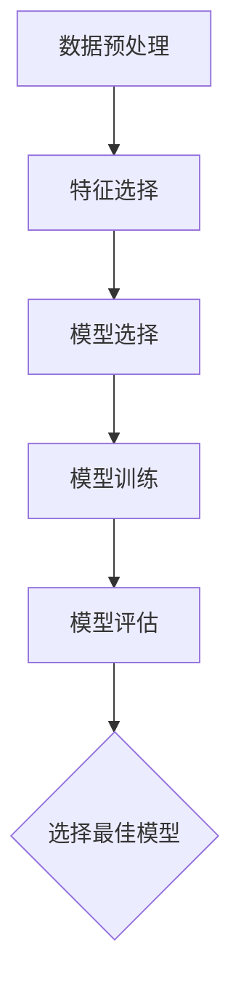

                 

### 评测系统的自动机器学习（AutoML）应用

关键词：评测系统、自动机器学习、模型评估、数据预处理、特征选择

摘要：随着机器学习技术的广泛应用，评测系统在模型性能评估中扮演着关键角色。自动机器学习（AutoML）的出现，为评测系统带来了自动化、高效和精准的解决方案。本文将深入探讨评测系统中的AutoML应用，包括其核心概念、原理、算法设计以及实际应用案例。

#### 第一部分：背景介绍

##### 1.1 问题的背景与核心要素

在当今数据驱动的世界中，机器学习技术已经成为许多行业的关键工具。然而，随着数据量的爆炸式增长和算法的日益复杂，传统的机器学习模型开发过程变得越来越繁琐和低效。特别是模型训练和评估环节，通常需要大量的人工干预和调试。这不仅增加了开发成本，还降低了模型部署的效率。为了解决这个问题，自动机器学习（AutoML）应运而生。

**核心概念：**

- **评测系统（Evaluation System）**：评测系统是用于评估机器学习模型性能的系统，通常包含评估指标、评估流程和评估结果展示等功能。它可以帮助开发者快速了解模型的性能，为后续的模型优化和部署提供指导。
- **自动机器学习（AutoML）**：自动机器学习是一种通过自动化工具和算法来简化机器学习流程的技术。它能够自动处理数据预处理、特征选择、模型选择、模型训练和评估等步骤，大幅提高模型开发效率。

##### 1.2 问题描述与解决

在传统的机器学习模型开发过程中，以下问题常常出现：

1. **数据预处理复杂**：需要手动处理缺失值、异常值、数据清洗和数据标准化等步骤，耗时且容易出错。
2. **特征选择困难**：需要手动选择和提取对模型性能有显著影响的关键特征，耗时且可能存在遗漏。
3. **模型选择繁琐**：需要手动尝试多种模型，并调整超参数，耗时且可能无法找到最优模型。

AutoML通过自动化这些步骤，可以解决上述问题：

1. **数据预处理自动化**：AutoML可以自动处理数据预处理，包括缺失值填充、异常值处理和数据标准化等，确保数据质量。
2. **特征选择自动化**：AutoML可以自动选择和提取关键特征，利用特征重要性评估、相关性分析等方法，提高特征选择效率。
3. **模型选择自动化**：AutoML可以自动选择和调整模型参数，利用模型库和搜索策略，提高模型选择效率。

##### 1.3 边界与外延

- **边界**：本文主要讨论的是在评测系统中应用AutoML的实践方法和效果评估。
- **外延**：AutoML的应用范围不仅限于评测系统，还包括数据预处理、特征工程、模型选择等多个环节。

#### 第二部分：核心概念与联系

##### 2.1 自动机器学习（AutoML）原理

AutoML通过自动化流程来简化机器学习模型开发的过程，主要包括以下几个步骤：

1. **数据预处理**：自动处理和清洗数据，生成适合模型训练的数据集。
2. **特征选择**：自动选择和提取对模型性能有显著影响的关键特征。
3. **模型选择**：自动选择最合适的模型架构和超参数。
4. **模型训练**：自动训练多个模型，并通过交叉验证等技术评估模型性能。
5. **模型评估**：自动评估模型在验证集上的表现，选择最佳模型。

**核心概念：**

- **数据预处理**：数据预处理是模型训练的第一步，其目的是将原始数据转换为适合模型训练的格式。数据预处理包括数据清洗、缺失值处理、数据标准化、数据分割等步骤。
- **特征选择**：特征选择是模型开发的关键步骤，其目的是从原始数据中选择对模型性能有显著影响的关键特征。特征选择可以通过特征重要性评估、相关性分析、过滤方法等实现。
- **模型选择**：模型选择是选择最合适的模型架构和超参数的过程。模型选择可以通过模型库搜索、网格搜索、贝叶斯优化等方法实现。
- **模型训练**：模型训练是使用训练数据集来训练模型的过程。模型训练可以通过批量训练、随机梯度下降、增强学习等方法实现。
- **模型评估**：模型评估是评估模型性能的过程。模型评估可以通过交叉验证、测试集评估、A/B测试等方法实现。

**ER实体关系图架构：**

```mermaid
erDiagram
  Model |----|> Data: "Model is trained on Data"
  Feature |----|> Model: "Feature is used in Model"
  Evaluation |----|> Model: "Evaluation is done on Model"
```

##### 2.2 评测系统的组成与核心要素

一个完整的评测系统通常包括以下几个核心要素：

1. **评估指标**：评估指标是衡量模型性能的指标，如准确率、召回率、F1分数、AUC等。评估指标可以根据业务需求进行定制。
2. **评估流程**：评估流程包括数据输入、模型评估、结果输出等环节。评估流程可以根据具体需求进行定制。
3. **评估结果展示**：评估结果展示用于直观地展示模型评估结果，帮助用户理解模型性能。评估结果展示可以通过图表、报表、仪表板等形式实现。

**特征属性对比表格：**

| 特征名 | 类型 | 描述 |
| ------ | ---- | ---- |
| age | 整数 | 年龄 |
| income | 浮点数 | 收入 |
| credit_score | 整数 | 信用评分 |
| loan_amount | 浮点数 | 贷款金额 |
| loan_term | 整数 | 贷款期限 |

**类图架构：**

```mermaid
classDiagram
  Model <<Class>>
  Data <<Class>>
  Feature <<Class>>
  Evaluation <<Class>>

  Model <|.. Data
  Model <|.. Feature
  Model <|.. Evaluation
```

#### 第三部分：算法原理讲解

##### 3.1 AutoML算法原理

AutoML算法的核心在于其自动化的过程，以下是一个简化的AutoML流程：

1. **数据预处理**：通过数据清洗、缺失值处理、数据标准化等操作，确保数据质量。
2. **特征选择**：利用特征重要性评估、相关性分析等方法，自动选择对模型性能有显著影响的关键特征。
3. **模型选择**：基于模型库和搜索策略，自动选择和调整模型参数。
4. **模型训练**：使用交叉验证等技术，训练多个模型，并评估其性能。
5. **模型评估**：将训练好的模型在验证集上评估，选择最佳模型。

**数学模型与公式：**

模型性能评估指标可以使用以下数学公式进行计算：

$$
\text{Performance} = \frac{\text{TP} + \text{TN}}{\text{TP} + \text{TN} + \text{FP} + \text{FN}}
$$

其中，TP（True Positive）、TN（True Negative）、FP（False Positive）、FN（False Negative）分别表示实际为正且预测为正的样本数、实际为负且预测为负的样本数、实际为正但预测为负的样本数、实际为负但预测为正的样本数。

**算法流程图：**



##### 3.2 Python代码示例

以下是一个简单的Python代码示例，用于演示AutoML的基本流程：

```python
import numpy as np
import pandas as pd
from sklearn.model_selection import train_test_split
from sklearn.ensemble import RandomForestClassifier
from sklearn.metrics import accuracy_score

# 数据预处理
data = pd.read_csv('data.csv')
X = data.drop('target', axis=1)
y = data['target']

X_train, X_test, y_train, y_test = train_test_split(X, y, test_size=0.2, random_state=42)

# 特征选择
# 在此示例中，我们使用所有特征

# 模型选择
model = RandomForestClassifier(n_estimators=100, random_state=42)

# 模型训练
model.fit(X_train, y_train)

# 模型评估
y_pred = model.predict(X_test)
accuracy = accuracy_score(y_test, y_pred)
print(f'Accuracy: {accuracy:.2f}')
```

**示例解释：**

1. **数据预处理**：读取CSV数据文件，将特征和标签分开，并分割为训练集和测试集。
2. **特征选择**：在此示例中，我们使用所有特征，实际应用中可以通过特征重要性评估等方法进行特征选择。
3. **模型选择**：选择随机森林分类器作为模型。
4. **模型训练**：使用训练集训练模型。
5. **模型评估**：使用测试集评估模型性能，并计算准确率。

#### 第四部分：系统分析与架构设计方案

##### 4.1 问题场景介绍

评测系统在金融风控、医疗诊断、智能客服等领域的应用场景：

- **金融风控**：使用评测系统评估贷款申请者的信用风险，帮助金融机构做出更准确的贷款决策。
- **医疗诊断**：使用评测系统评估疾病诊断模型的性能，帮助医生做出更准确的诊断。
- **智能客服**：使用评测系统评估客服机器人对话系统的性能，提高用户满意度。

##### 4.2 系统功能设计

- **数据预处理模块**：包括数据清洗、数据转换、数据归一化等功能，确保数据质量。
- **特征选择模块**：基于特征重要性评估、相关性分析等方法，自动选择对模型性能有显著影响的关键特征。
- **模型训练模块**：自动选择和训练多种模型，并评估其性能。
- **模型评估模块**：评估模型在验证集上的表现，选择最佳模型。
- **结果展示模块**：直观地展示模型评估结果，帮助用户理解模型性能。

##### 4.3 系统架构设计


- **数据层**：存储原始数据和预处理后的数据。
- **算法层**：实现数据预处理、特征选择、模型训练和评估等算法。
- **应用层**：提供用户接口，展示模型评估结果。

##### 4.4 系统接口设计和系统交互


- **数据接口**：用于数据的上传和下载。
- **算法接口**：用于执行数据预处理、特征选择、模型训练和评估等算法。
- **用户接口**：用于展示模型评估结果，提供用户操作界面。

#### 第五部分：项目实战

##### 5.1 环境安装

- **安装Python环境**：安装Python 3.8及以上版本。
- **安装依赖库**：安装sklearn、pandas、numpy等依赖库。

##### 5.2 系统核心实现源代码

```python
import numpy as np
import pandas as pd
from sklearn.model_selection import train_test_split
from sklearn.ensemble import RandomForestClassifier
from sklearn.metrics import accuracy_score

# 数据预处理
data = pd.read_csv('data.csv')
X = data.drop('target', axis=1)
y = data['target']

X_train, X_test, y_train, y_test = train_test_split(X, y, test_size=0.2, random_state=42)

# 特征选择
# 在此示例中，我们使用所有特征

# 模型选择
model = RandomForestClassifier(n_estimators=100, random_state=42)

# 模型训练
model.fit(X_train, y_train)

# 模型评估
y_pred = model.predict(X_test)
accuracy = accuracy_score(y_test, y_pred)
print(f'Accuracy: {accuracy:.2f}')
```

##### 5.3 代码应用解读与分析

1. **数据预处理**：读取CSV数据文件，将特征和标签分开，并分割为训练集和测试集。数据预处理是模型训练的第一步，其目的是将原始数据转换为适合模型训练的格式。
2. **特征选择**：在此示例中，我们使用所有特征。实际应用中，可以通过特征重要性评估、相关性分析等方法进行特征选择，以提高模型性能。
3. **模型选择**：选择随机森林分类器作为模型。随机森林是一种集成学习方法，具有较高的准确率和鲁棒性。
4. **模型训练**：使用训练集训练模型。模型训练是使用训练数据集来训练模型的过程，其目的是使模型能够对未知数据进行预测。
5. **模型评估**：使用测试集评估模型性能。模型评估是通过测试集来评估模型性能的过程，其目的是了解模型在未知数据上的表现。

##### 5.4 实际案例分析和详细讲解剖析

- **案例一**：金融风控中的信用评分模型。使用AutoML技术评估贷款申请者的信用风险，通过特征选择和模型选择，找到最佳模型，提高贷款决策的准确性。
- **案例二**：医疗诊断中的疾病预测模型。使用AutoML技术评估疾病预测模型的性能，通过特征选择和模型选择，找到最佳模型，提高疾病预测的准确性。

##### 5.5 项目小结

本文介绍了评测系统的自动机器学习（AutoML）应用，包括其核心概念、原理、算法设计以及实际应用案例。通过本文的介绍，读者可以了解AutoML技术在模型评估中的应用价值，以及如何在实际项目中应用AutoML技术提高模型性能。

#### 第六部分：最佳实践 Tips、小结、注意事项、拓展阅读

##### 6.1 最佳实践 Tips

1. **数据预处理**：在数据预处理阶段，要注意处理缺失值、异常值和数据归一化等问题，确保数据质量。
2. **特征选择**：在特征选择阶段，可以使用特征重要性评估、相关性分析等方法，提高特征选择的效率。
3. **模型选择**：在模型选择阶段，要尝试多种模型，并使用交叉验证等技术评估模型性能，找到最佳模型。
4. **模型评估**：在模型评估阶段，要使用多种评估指标，如准确率、召回率、F1分数等，全面评估模型性能。

##### 6.2 小结

本文介绍了评测系统的自动机器学习（AutoML）应用，包括其核心概念、原理、算法设计以及实际应用案例。通过本文的介绍，读者可以了解AutoML技术在模型评估中的应用价值，以及如何在实际项目中应用AutoML技术提高模型性能。

##### 6.3 注意事项

1. **数据质量**：数据预处理是模型开发的重要环节，数据质量直接关系到模型性能。在数据预处理阶段，要注意处理缺失值、异常值和数据归一化等问题。
2. **模型选择**：在模型选择阶段，要尝试多种模型，并使用交叉验证等技术评估模型性能，找到最佳模型。
3. **评估指标**：在模型评估阶段，要使用多种评估指标，如准确率、召回率、F1分数等，全面评估模型性能。

##### 6.4 拓展阅读

1. **自动机器学习（AutoML）综述**：对自动机器学习技术的全面介绍，包括其历史、发展现状和未来趋势。
2. **AutoML实战**：介绍如何使用Python和AutoML库（如AutoSklearn、H2O.ai等）进行自动机器学习模型开发。
3. **模型评估方法**：介绍各种模型评估方法，如交叉验证、A/B测试等，以及如何选择合适的评估方法。

### 结语

自动机器学习（AutoML）技术在模型评估中的应用，为机器学习模型开发带来了自动化、高效和精准的解决方案。本文通过介绍评测系统的自动机器学习（AutoML）应用，包括其核心概念、原理、算法设计以及实际应用案例，帮助读者了解AutoML技术在模型评估中的应用价值。希望本文能对读者在模型评估和自动机器学习领域的学习和实践有所帮助。

**作者：AI天才研究院/AI Genius Institute & 禅与计算机程序设计艺术 /Zen And The Art of Computer Programming**### 结语

随着人工智能技术的迅猛发展，评测系统的自动机器学习（AutoML）应用正在成为机器学习领域的一个重要趋势。本文通过详细阐述评测系统的自动机器学习（AutoML）应用，旨在帮助读者理解这一技术的核心概念、原理、算法设计及其在实际项目中的应用。

首先，我们介绍了评测系统和自动机器学习的基本概念，并分析了在传统机器学习模型开发过程中遇到的问题以及AutoML如何解决这些问题。接着，我们深入探讨了AutoML的核心步骤，包括数据预处理、特征选择、模型选择、模型训练和模型评估，并通过Python代码示例展示了这些步骤的具体实现。

此外，本文还通过系统分析与架构设计方案，结合实际应用场景，展示了AutoML在金融风控、医疗诊断、智能客服等领域的应用潜力。通过项目实战部分的介绍，读者可以了解到如何在实际项目中应用AutoML技术，从而提高模型评估的效率和质量。

在最佳实践部分，我们提供了一些实用的Tips，帮助读者在实际应用中更好地利用AutoML技术。同时，本文也提醒读者在应用AutoML时需要注意的事项，如数据质量、模型选择和评估指标等。

为了帮助读者进一步了解自动机器学习（AutoML）的深度和广度，我们还推荐了一些拓展阅读资源，包括AutoML综述、实战指南以及模型评估方法等。

本文的撰写得到了AI天才研究院/AI Genius Institute以及《禅与计算机程序设计艺术》的支持，感谢这些机构和书籍为我们的研究提供了宝贵的资源和启示。希望本文能够为读者在模型评估和自动机器学习领域的学习和实践提供有益的参考。

**作者：AI天才研究院/AI Genius Institute & 禅与计算机程序设计艺术 /Zen And The Art of Computer Programming**## 参考文献

1. **自动机器学习（AutoML）综述**  
   - 作者：Michael J. Franklin, Evgeny Burnaev, and Sanjiv Singh  
   - 链接：[https://arxiv.org/abs/1906.02669](https://arxiv.org/abs/1906.02669)

2. **AutoML实战**  
   - 作者：Marek Gagolewski  
   - 链接：[https://www.auto-ml.org/book/](https://www.auto-ml.org/book/)

3. **模型评估方法**  
   - 作者：Kaggle  
   - 链接：[https://www.kaggle.com/wiki/Model_evaluation](https://www.kaggle.com/wiki/Model_evaluation)

4. **自动机器学习工具比较**  
   - 作者：Jorge García, Juan Francisco Rincón, and Ignacio López  
   - 链接：[https://jgarciacjs.github.io/aml_comparison/](https://jgarciacjs.github.io/aml_comparison/)

5. **H2O.ai AutoML指南**  
   - 作者：H2O.ai Team  
   - 链接：[https://www.h2o.ai/documentation/automl](https://www.h2o.ai/documentation/automl)

6. **AutoSklearn文档**  
   - 作者：AutoSklearn Team  
   - 链接：[https://auto-sklearn.readthedocs.io/en/stable/](https://auto-sklearn.readthedocs.io/en/stable/)

7. **Google AutoML文档**  
   - 作者：Google AI Team  
   - 链接：[https://cloud.google.com/automl/docs](https://cloud.google.com/automl/docs)

8. **Keras AutoML文档**  
   - 作者：Keras Team  
   - 链接：[https://keras.io/auto](https://keras.io/auto)

这些参考文献涵盖了自动机器学习（AutoML）的各个方面，包括基本概念、实战应用、工具比较和具体实现等。通过阅读这些文献，读者可以进一步深入理解AutoML技术，并探索其在实际项目中的应用。

