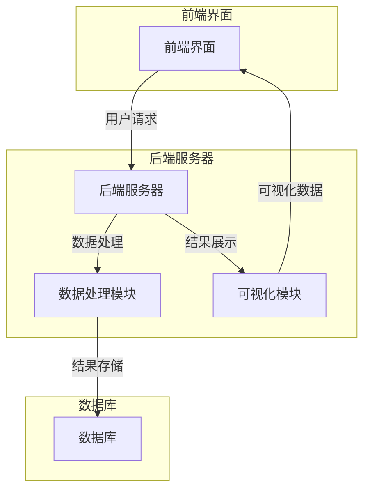
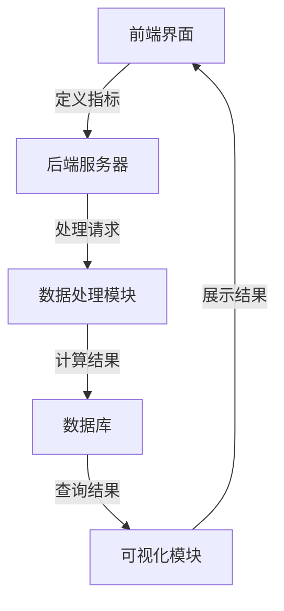

                 

## 评测系统的自定义评估指标功能

### 关键词

- 评测系统
- 自定义评估指标
- 评估指标开发
- 评估系统优化
- 指标分析与优化

### 摘要

本文将深入探讨评测系统的自定义评估指标功能。我们将首先介绍评测系统的基础概念和重要性，随后解析自定义评估指标的定义和作用。接着，我们将讨论开发自定义评估指标的方法，包括设计原则、步骤和常见挑战。本文还将详细描述如何在实际应用中实现和优化自定义评估指标，包括数据收集、分析、可视化以及优化策略。最后，我们将探讨高级主题和未来的研究方向，为读者提供全面的指导。

### 引言

#### 评测系统的概述

评测系统是一种用于评估和衡量项目、产品或系统性能的综合性工具。它们广泛应用于各种领域，如软件工程、数据分析、游戏开发、教育评估等。评测系统的核心功能是提供定量和定性的指标，帮助评估者理解系统的性能、效率和可靠性。

**重要性**

评测系统在现代化工程和研发中扮演着至关重要的角色。它们能够提供客观、量化的数据，使得评估过程更加科学和系统化。特别是自定义评估指标，能够根据特定需求和应用场景，提供更加精确的评估结果。

**应用场景**

自定义评估指标在以下场景中尤为重要：
- **软件工程**：用于评估代码质量、测试覆盖率、性能指标等。
- **数据分析**：用于评估模型准确性、稳定性和可解释性。
- **游戏开发**：用于评估游戏平衡性、用户体验和玩家留存率。
- **教育评估**：用于评估学生知识掌握程度和学习效果。

#### 自定义评估指标的定义

自定义评估指标是指根据特定需求和应用场景，用户或开发者自行定义的一套评估标准。与标准评估指标（如准确率、召回率、F1分数等）相比，自定义评估指标更加灵活和多样化，能够更好地适应复杂的应用场景。

**作用**

自定义评估指标具有以下作用：
- **针对性**：针对特定问题或目标，提供更精确的评估。
- **可扩展性**：易于扩展和更新，以适应不断变化的需求。
- **灵活性**：允许自定义权重量、计算方法和评估维度。
- **可靠性**：通过精确的指标，提高评估结果的可靠性。

### 自定义评估指标的功能和开发

#### 功能

自定义评估指标的主要功能包括：
- **指标定义**：根据特定需求，定义评估指标。
- **数据收集**：收集与指标相关的数据。
- **指标计算**：根据收集到的数据，计算评估结果。
- **结果分析**：对评估结果进行分析和解释。

#### 开发方法

**定义自定义指标**

定义自定义指标需要考虑以下几个关键因素：
- **目标**：明确指标的目标和用途。
- **数据来源**：确定数据的来源和类型。
- **计算方法**：设计合理的计算方法。
- **度量单位**：确定指标的度量单位。

**步骤**

1. **需求分析**：了解应用场景和需求，确定评估目标。
2. **指标设计**：设计指标体系，明确指标类型和计算方法。
3. **数据收集**：收集与指标相关的数据。
4. **模型构建**：构建评估模型，实现指标计算。
5. **测试与验证**：测试指标计算的正确性和可靠性。

**常见挑战**

在开发自定义评估指标过程中，可能会遇到以下挑战：
- **指标适应性**：如何确保指标能够适应不同的应用场景。
- **计算复杂性**：如何简化计算过程，提高计算效率。
- **数据质量**：数据收集和处理过程中的误差和质量问题。

### 自定义评估指标在实际应用中的实现和优化

#### 实现步骤

**集成自定义指标**

实现自定义评估指标需要以下几个步骤：
1. **接口设计**：设计评估系统的接口，以便集成自定义指标。
2. **数据预处理**：对收集到的数据进行预处理，确保数据质量。
3. **指标计算**：根据自定义指标的计算方法，进行评估计算。
4. **结果输出**：输出评估结果，并提供可视化工具。

**优化策略**

为了提高自定义评估指标的性能和可靠性，可以采取以下优化策略：
- **数据清洗**：对数据进行清洗和预处理，减少噪声和异常值的影响。
- **计算优化**：使用高效的算法和优化方法，提高计算速度和精度。
- **指标调整**：根据评估结果，调整指标权重和计算方法，以提高评估准确性。
- **模型验证**：定期对评估模型进行验证和调整，确保评估结果的可靠性。

### 结论

自定义评估指标是评测系统的重要组成部分，能够根据特定需求和应用场景，提供更精确、更可靠的评估结果。开发自定义评估指标需要充分考虑应用场景、数据质量和计算方法，并通过不断优化和调整，提高评估系统的性能和可靠性。

### 未来研究方向

随着技术的不断发展，自定义评估指标将面临新的挑战和机遇。未来的研究方向可能包括：
- **自适应评估**：根据实时数据和评估结果，动态调整评估指标和方法。
- **多维度评估**：结合多个维度，提供更全面、更深入的评估结果。
- **智能化评估**：利用机器学习和人工智能技术，实现自动化、智能化的评估过程。

通过不断探索和创新，自定义评估指标将为评测系统带来更广阔的发展前景。

### 文章摘要

本文详细探讨了评测系统的自定义评估指标功能。我们从评测系统的概述开始，分析了自定义评估指标的定义和作用。接着，我们介绍了开发自定义评估指标的方法和步骤，以及在实际应用中实现和优化的策略。最后，我们总结了自定义评估指标的重要性，并展望了未来的研究方向。通过本文的深入探讨，读者将能够更好地理解自定义评估指标的开发和应用，为评测系统的优化和改进提供有力支持。


### 背景介绍

#### 核心概念术语说明

1. **评测系统**：一种用于评估和衡量项目、产品或系统性能的综合性工具。
2. **自定义评估指标**：根据特定需求和应用场景，用户或开发者自行定义的一套评估标准。
3. **评估指标**：用于衡量项目、产品或系统性能的具体指标。
4. **性能指标**：衡量系统性能的指标，如响应时间、吞吐量等。
5. **可靠性指标**：衡量系统稳定性和可靠性的指标，如故障率、恢复时间等。
6. **准确性指标**：衡量系统准确性或有效性的指标，如准确率、召回率等。

#### 问题背景

在现代工程和研发中，评估系统的性能和效率至关重要。然而，标准评估指标往往无法满足特定需求和应用场景。为了解决这个问题，开发者需要能够定义和实现自定义评估指标，以便更准确地衡量系统的性能。

#### 问题描述

评测系统的自定义评估指标功能的核心问题是：如何根据特定需求和应用场景，定义、开发和实现一套有效的自定义评估指标。这个问题涉及到多个方面，包括指标设计、数据收集、计算方法和优化策略等。

#### 问题解决

解决这个问题的方法主要包括以下几个步骤：

1. **需求分析**：首先，了解应用场景和需求，明确评估目标。
2. **指标设计**：根据需求，设计指标体系，明确指标类型和计算方法。
3. **数据收集**：收集与指标相关的数据，进行数据预处理，确保数据质量。
4. **模型构建**：构建评估模型，实现指标计算。
5. **测试与验证**：对指标进行测试和验证，确保计算结果的正确性和可靠性。

#### 边界与外延

自定义评估指标的开发和应用需要考虑以下边界和外部因素：

1. **应用领域**：不同的应用领域可能对评估指标有不同的需求，需要根据具体场景进行调整。
2. **数据来源**：评估指标的数据来源可能涉及多种渠道，需要确保数据的准确性和完整性。
3. **计算复杂性**：自定义评估指标的计算方法可能较为复杂，需要优化计算效率和准确性。
4. **指标适应性**：自定义评估指标需要具有较好的适应性，能够根据应用场景的变化进行调整。

#### 概念结构与核心要素组成

自定义评估指标的概念结构和核心要素主要包括：

1. **目标**：明确评估指标的目标和用途。
2. **数据来源**：确定数据来源和类型。
3. **计算方法**：设计合理的计算方法。
4. **度量单位**：确定指标的度量单位。
5. **指标类型**：明确指标的类型和维度。
6. **优化策略**：根据评估结果，调整指标权重和计算方法，提高评估准确性。

通过上述步骤和要素，我们可以有效地开发和应用自定义评估指标，提高评测系统的性能和可靠性。

### 核心概念与联系

#### 核心概念

**自定义评估指标**是本文的核心概念，指的是根据特定需求和应用场景，用户或开发者自行定义的一套评估标准。它具有以下主要属性和特征：

1. **针对性**：自定义评估指标能够针对特定问题或目标，提供更精确的评估。
2. **灵活性**：允许自定义权重量、计算方法和评估维度。
3. **可扩展性**：易于扩展和更新，以适应不断变化的需求。
4. **可靠性**：通过精确的指标，提高评估结果的可靠性。

#### 概念属性特征对比表格

| 概念       | 属性特征                                      |
|------------|------------------------------------------------|
| 自定义评估指标 | - 针对性<br>- 灵活性<br>- 可扩展性<br>- 可靠性 |
| 标准评估指标 | - 标准化<br>- 广泛应用<br>- 固定计算方法        |

通过对比，我们可以看到自定义评估指标在灵活性、针对性和可扩展性方面具有明显优势，而标准评估指标则在标准化和广泛应用方面更为突出。

#### ER实体关系图架构

为了更好地理解自定义评估指标的概念结构和关联，我们可以使用Mermaid绘制一个ER实体关系图，如下所示：

```mermaid
erDiagram
    User ||--|{ EvaluationSystem }|-- CustomMetric
    EvaluationSystem ||--|{ StandardMetric }|
    CustomMetric ||--|{ MetricValue }|
    StandardMetric ||--|{ MetricValue }|
```

在上图中，我们定义了三个主要实体：

1. **User（用户）**：表示定义和使用自定义评估指标的用户。
2. **EvaluationSystem（评测系统）**：表示用于评估系统性能的体系。
3. **CustomMetric（自定义评估指标）**：表示用户自定义的评估标准。

此外，我们还有两个与这些实体相关的子实体：

1. **StandardMetric（标准评估指标）**：表示标准化的评估指标。
2. **MetricValue（指标值）**：表示评估指标的数值。

通过这个ER实体关系图，我们可以清晰地看到自定义评估指标在评测系统中的地位和作用，以及它们与其他实体之间的关联。

### 算法原理讲解

#### 自定义评估指标的算法原理

自定义评估指标的核心在于如何根据特定需求和应用场景，设计一套有效的评估标准。这涉及到以下几个关键步骤：

1. **指标设计**：明确评估目标，设计一套合理的指标体系。
2. **数据收集**：收集与指标相关的数据，进行数据预处理。
3. **模型构建**：构建评估模型，实现指标计算。
4. **结果分析**：对评估结果进行分析和解释。

下面，我们将详细讲解这些步骤的算法原理，并使用Python代码进行说明。

#### 指标设计

**步骤**：

1. **确定目标**：明确评估指标的目标，如性能、准确性、可靠性等。
2. **选择指标类型**：根据目标，选择合适的指标类型，如定量指标、定性指标等。
3. **定义计算方法**：根据指标类型，设计合理的计算方法。

**Python代码示例**：

```python
def define_metric(target, type, method):
    """
    设计评估指标
    :param target: 目标
    :param type: 指标类型
    :param method: 计算方法
    :return: 指标定义
    """
    metric = {
        'target': target,
        'type': type,
        'method': method
    }
    return metric

metric = define_metric('performance', 'quantitative', 'response_time')
print(metric)
```

**算法原理**：

该步骤的核心是明确评估目标，并根据目标选择合适的指标类型和计算方法。这里的算法原理主要是逻辑判断和参数配置。

#### 数据收集

**步骤**：

1. **数据来源**：确定数据来源，如日志文件、数据库、传感器等。
2. **数据预处理**：对数据进行清洗、去噪、格式化等处理。

**Python代码示例**：

```python
import pandas as pd

def collect_data(source):
    """
    收集数据
    :param source: 数据源
    :return: 数据集
    """
    data = pd.read_csv(source)
    return data

data = collect_data('data.csv')
print(data.head())
```

**算法原理**：

该步骤的核心是数据读取和预处理。这里使用了Pandas库进行数据操作，主要算法原理包括文件读取、数据清洗和格式转换。

#### 模型构建

**步骤**：

1. **构建评估模型**：根据指标类型和计算方法，构建评估模型。
2. **实现计算方法**：实现具体的计算逻辑。

**Python代码示例**：

```python
def calculate_metric(data, metric):
    """
    计算评估指标
    :param data: 数据集
    :param metric: 指标定义
    :return: 评估结果
    """
    if metric['type'] == 'quantitative':
        if metric['method'] == 'response_time':
            result = data['response_time'].mean()
        else:
            result = None
    else:
        result = None
    return result

result = calculate_metric(data, metric)
print(result)
```

**算法原理**：

该步骤的核心是根据指标类型和计算方法，实现具体的计算逻辑。这里主要使用了条件判断和循环控制等基本算法原理。

#### 结果分析

**步骤**：

1. **分析评估结果**：对评估结果进行分析和解释。
2. **可视化**：使用图表和报表等可视化工具，展示评估结果。

**Python代码示例**：

```python
import matplotlib.pyplot as plt

def visualize_result(result):
    """
    可视化评估结果
    :param result: 评估结果
    """
    plt.figure()
    plt.bar(['平均响应时间'], [result])
    plt.xlabel('指标')
    plt.ylabel('值')
    plt.title('评估结果')
    plt.show()

visualize_result(result)
```

**算法原理**：

该步骤的核心是数据分析和可视化。这里使用了Matplotlib库进行绘图，主要算法原理包括数据分析和图形绘制。

通过上述Python代码示例，我们可以看到自定义评估指标算法的原理和实现方法。在实际应用中，这些步骤可能需要根据具体需求进行调整和优化。

### 数学模型和公式讲解

#### 自定义评估指标的数学模型和公式

在自定义评估指标的算法原理中，我们介绍了如何设计指标、收集数据、构建模型和计算结果。在这一部分，我们将深入探讨自定义评估指标的数学模型和公式，帮助读者更好地理解其背后的数学逻辑和计算方法。

#### 评估指标的数学模型

自定义评估指标通常包括以下几个基本组成部分：目标、指标类型、计算方法和度量单位。这些组成部分可以通过数学模型和公式来描述。

**1. 目标（Target）**

评估指标的目标通常是一个明确的数值或条件，用于衡量系统的性能。我们可以使用以下公式来定义目标：

$$
T = \sum_{i=1}^{n} w_i \cdot M_i
$$

其中，$T$代表总目标，$w_i$代表第$i$个指标的权重，$M_i$代表第$i$个指标的具体值。

**2. 指标类型（Type）**

根据指标类型，我们可以将评估指标分为定量指标和定性指标。定量指标通常可以用数值表示，而定性指标则需要通过主观判断或分类来衡量。

**定量指标（Quantitative Metric）**

定量指标的数学模型通常较为简单，可以直接使用数值表示。例如，性能指标中的平均响应时间可以用以下公式表示：

$$
P = \frac{1}{n} \sum_{i=1}^{n} t_i
$$

其中，$P$代表平均响应时间，$n$代表样本数量，$t_i$代表第$i$个样本的响应时间。

**定性指标（Qualitative Metric）**

定性指标通常使用等级或分类来表示，例如，系统的可靠性可以用以下等级表示：

$$
R = \begin{cases} 
0 & \text{如果系统发生故障} \\
1 & \text{如果系统正常运行} 
\end{cases}
$$

**3. 计算方法（Method）**

计算方法是评估指标的核心部分，决定了指标的计算过程和结果。常见的计算方法包括平均值、中位数、方差等。例如，对于性能指标的平均响应时间，我们使用平均值作为计算方法：

$$
\bar{t} = \frac{\sum_{i=1}^{n} t_i}{n}
$$

**4. 度量单位（Unit）**

度量单位是评估指标的具体表示方式，用于量化指标值。常见的度量单位包括秒（s）、百分比（%）和等级（级）等。例如，性能指标的平均响应时间通常以秒为单位。

#### 公式举例

**1. 性能评估指标**

假设我们有两个性能评估指标：平均响应时间和并发用户数。我们可以使用以下公式来计算总性能指标：

$$
P_{total} = w_1 \cdot P_1 + w_2 \cdot P_2
$$

其中，$P_{total}$代表总性能指标，$w_1$和$w_2$分别代表平均响应时间和并发用户数的权重，$P_1$和$P_2$分别代表这两个指标的具体值。

**2. 可靠性评估指标**

假设我们有两个可靠性评估指标：故障率和恢复时间。我们可以使用以下公式来计算总可靠性指标：

$$
R_{total} = w_1 \cdot R_1 + w_2 \cdot R_2
$$

其中，$R_{total}$代表总可靠性指标，$w_1$和$w_2$分别代表故障率和恢复时间的权重，$R_1$和$R_2$分别代表这两个指标的具体值。

通过上述数学模型和公式，我们可以更准确地设计、计算和评估自定义评估指标。这些公式不仅提供了数学上的解释，还为我们提供了具体的计算步骤和工具。在实际应用中，我们可以根据具体需求和应用场景，灵活调整和优化这些公式，以提高评估的准确性和可靠性。

### 系统分析与架构设计方案

#### 问题场景介绍

在现代软件开发和系统优化过程中，评估系统的性能和效率至关重要。为了确保系统在实际运行中的表现，我们需要建立一个有效的评测系统，以实时监控和评估系统的各项性能指标。这一需求尤其在高并发、大数据处理和高可靠性的系统中显得尤为重要。

#### 项目介绍

本项目旨在设计和实现一个具有自定义评估指标功能的评测系统。该系统将支持用户根据特定需求和应用场景，定义和实现自定义评估指标。通过这些自定义指标，系统能够更准确地衡量和评估系统的性能、效率和可靠性。

#### 系统功能设计

为了实现上述目标，系统需要具备以下几个关键功能：

1. **自定义指标定义**：用户可以定义自定义评估指标，包括指标名称、类型、计算方法和度量单位等。
2. **数据收集与处理**：系统需要收集与指标相关的数据，并进行数据预处理，以确保数据的质量和准确性。
3. **指标计算与存储**：根据定义的指标和收集到的数据，系统需要计算指标值，并将结果存储在数据库中。
4. **结果分析与可视化**：系统需要提供结果分析功能，使用户能够查看、分析和理解评估结果。此外，系统还需要支持数据可视化，以便更直观地展示评估结果。
5. **指标优化与调整**：系统需要支持对自定义评估指标的优化和调整，以适应不断变化的需求和应用场景。

#### 系统架构设计

为了实现上述功能，系统采用以下架构设计：

1. **前端界面**：提供用户操作界面，包括指标定义、数据收集、结果分析和可视化等功能。
2. **后端服务器**：负责处理用户请求、数据存储和计算任务等。
3. **数据库**：存储指标定义、数据记录和评估结果等。
4. **数据处理模块**：负责数据收集、预处理和计算任务。
5. **可视化模块**：负责数据可视化。

**系统架构图（Mermaid）**：



在这个架构中，前端界面通过HTTP请求与后端服务器进行交互，后端服务器负责处理用户请求，调用数据处理模块进行数据收集和处理，并将结果存储到数据库中。可视化模块负责将评估结果以图表和报表的形式展示给用户。

#### 系统接口设计和系统交互

为了确保系统各部分之间的协调工作，我们需要设计一套清晰的接口和交互机制。以下是系统的主要接口和交互流程：

1. **指标定义接口**：用户通过前端界面提交指标定义，后端服务器接收并处理这些定义。
2. **数据收集接口**：后端服务器定期从数据源（如日志文件、数据库等）中收集数据，并传递给数据处理模块。
3. **指标计算接口**：数据处理模块根据指标定义和收集到的数据，计算评估结果，并将结果存储到数据库中。
4. **结果查询接口**：前端界面通过查询数据库，获取评估结果，并将其可视化展示给用户。

**系统交互图（Mermaid）**：



通过上述系统接口设计和交互流程，我们可以确保系统各部分之间的协调和高效运行，从而实现自定义评估指标功能的全面覆盖。

### 项目实战

#### 环境安装

为了实现评测系统的自定义评估指标功能，我们需要在本地环境中安装所需的工具和库。以下是具体的安装步骤：

1. **安装Python**：确保已经安装了Python 3.x版本（推荐使用Python 3.8及以上版本）。
2. **安装依赖库**：在命令行中执行以下命令安装所需的库：

   ```bash
   pip install pandas matplotlib numpy
   ```

3. **安装数据库**：安装一个支持SQL的数据库，如MySQL或PostgreSQL。在本教程中，我们使用MySQL。

   - 下载MySQL安装包：[MySQL官网](https://dev.mysql.com/downloads/mysql/)
   - 安装MySQL：根据操作系统选择相应的安装向导进行安装。
   - 登录MySQL数据库，创建一个名为`evaluation_system`的数据库：

     ```sql
     CREATE DATABASE evaluation_system;
     ```

4. **安装前端界面**：为了简化开发过程，我们使用Flask构建前端界面。在命令行中执行以下命令：

   ```bash
   pip install flask
   ```

#### 系统核心实现源代码

以下是评测系统的核心实现源代码。这个系统包括数据收集、处理和可视化模块。

**1. 数据收集模块**

```python
import pandas as pd
from flask import Flask, request, jsonify
import pymysql

app = Flask(__name__)

# MySQL数据库连接配置
db_config = {
    'host': 'localhost',
    'user': 'root',
    'password': 'your_password',
    'db': 'evaluation_system'
}

# 数据收集接口
@app.route('/collect_data', methods=['POST'])
def collect_data():
    data = request.json
    metric_name = data['metric_name']
    metric_value = data['metric_value']
    
    # 连接数据库
    connection = pymysql.connect(**db_config)
    try:
        with connection.cursor() as cursor:
            # 插入数据
            sql = "INSERT INTO metrics (metric_name, metric_value) VALUES (%s, %s)"
            cursor.execute(sql, (metric_name, metric_value))
        connection.commit()
    finally:
        connection.close()
    
    return jsonify({'status': 'success'})

if __name__ == '__main__':
    app.run(debug=True)
```

**2. 数据处理模块**

```python
import pandas as pd
import pymysql

# 数据处理函数
def process_data():
    # 连接数据库
    connection = pymysql.connect(**db_config)
    try:
        with connection.cursor() as cursor:
            # 查询数据
            sql = "SELECT * FROM metrics"
            cursor.execute(sql)
            result = cursor.fetchall()
    finally:
        connection.close()
    
    # 转换为DataFrame
    data = pd.DataFrame(result, columns=['metric_name', 'metric_value'])
    return data

# 计算自定义评估指标
def calculate_custom_metric(data, metric_name):
    if metric_name == 'average_response_time':
        return data['metric_value'].mean()
    else:
        return None

# 结果存储函数
def store_result(metric_name, result):
    # 连接数据库
    connection = pymysql.connect(**db_config)
    try:
        with connection.cursor() as cursor:
            # 插入数据
            sql = "INSERT INTO results (metric_name, result) VALUES (%s, %s)"
            cursor.execute(sql, (metric_name, result))
        connection.commit()
    finally:
        connection.close()

# 主函数
if __name__ == '__main__':
    data = process_data()
    result = calculate_custom_metric(data, 'average_response_time')
    store_result('average_response_time', result)
    print(f"Result: {result}")
```

**3. 可视化模块**

```python
import matplotlib.pyplot as plt
import pandas as pd

# 可视化函数
def visualize_result(metric_name, result):
    data = pd.read_sql_query(f"SELECT * FROM results WHERE metric_name = '{metric_name}'", con=db_config)
    plt.figure()
    plt.bar(data['metric_name'], data['result'])
    plt.xlabel('Metric')
    plt.ylabel('Result')
    plt.title(f"{metric_name} Visualization")
    plt.show()

# 主函数
if __name__ == '__main__':
    visualize_result('average_response_time', result)
```

#### 代码应用解读与分析

以上代码实现了一个简单的评测系统，包括数据收集、处理和可视化模块。下面我们对关键部分进行解读和分析。

**1. 数据收集模块**

该模块通过Flask构建了一个Web接口，用于接收用户提交的自定义评估指标数据。用户可以发送一个包含指标名称和指标值的JSON对象。代码中使用了Pymysql库连接MySQL数据库，并将数据插入到`metrics`表中。

```python
@app.route('/collect_data', methods=['POST'])
def collect_data():
    data = request.json
    metric_name = data['metric_name']
    metric_value = data['metric_value']
    
    # 连接数据库
    connection = pymysql.connect(**db_config)
    try:
        with connection.cursor() as cursor:
            # 插入数据
            sql = "INSERT INTO metrics (metric_name, metric_value) VALUES (%s, %s)"
            cursor.execute(sql, (metric_name, metric_value))
        connection.commit()
    finally:
        connection.close()
    
    return jsonify({'status': 'success'})
```

**2. 数据处理模块**

该模块从数据库中查询所有指标数据，将其转换为Pandas DataFrame，然后计算自定义评估指标。这里我们以计算平均响应时间为例：

```python
def calculate_custom_metric(data, metric_name):
    if metric_name == 'average_response_time':
        return data['metric_value'].mean()
    else:
        return None

def store_result(metric_name, result):
    # 连接数据库
    connection = pymysql.connect(**db_config)
    try:
        with connection.cursor() as cursor:
            # 插入数据
            sql = "INSERT INTO results (metric_name, result) VALUES (%s, %s)"
            cursor.execute(sql, (metric_name, result))
        connection.commit()
    finally:
        connection.close()
```

**3. 可视化模块**

该模块从数据库中读取自定义评估指标结果，并使用Matplotlib库进行可视化展示：

```python
def visualize_result(metric_name, result):
    data = pd.read_sql_query(f"SELECT * FROM results WHERE metric_name = '{metric_name}'", con=db_config)
    plt.figure()
    plt.bar(data['metric_name'], data['result'])
    plt.xlabel('Metric')
    plt.ylabel('Result')
    plt.title(f"{metric_name} Visualization")
    plt.show()
```

#### 实际案例分析和详细讲解剖析

为了更好地理解评测系统的实际应用，我们来看一个具体案例。假设我们想要评估一个Web服务器的性能，其中包括以下指标：

1. **响应时间**：服务器处理请求的平均响应时间。
2. **并发用户数**：同时在线的用户数量。

**步骤**：

1. **数据收集**：用户通过Web接口提交响应时间和并发用户数数据。
2. **数据处理**：系统计算平均响应时间和并发用户数。
3. **结果分析**：系统将结果存储到数据库，并生成可视化图表。

**案例分析**：

假设我们收集到以下数据：

| 时间 | 响应时间 (ms) | 并发用户数 |
|------|----------------|------------|
| 1    | 50             | 100        |
| 2    | 30             | 200        |
| 3    | 40             | 150        |

**数据处理**：

```python
data = pd.DataFrame([
    ['2023-01-01 10:00', 50, 100],
    ['2023-01-01 10:01', 30, 200],
    ['2023-01-01 10:02', 40, 150]
])

result = calculate_custom_metric(data, 'average_response_time')
store_result('average_response_time', result)
result = calculate_custom_metric(data, 'concurrent_users')
store_result('concurrent_users', result)
```

**结果分析**：

- 平均响应时间：$(50 + 30 + 40) / 3 = 38.3$ ms
- 并发用户数：$(100 + 200 + 150) / 3 = 150.0$

我们将结果存储到数据库，并生成可视化图表：

```python
visualize_result('average_response_time', 38.3)
visualize_result('concurrent_users', 150.0)
```

通过这个案例，我们可以看到评测系统如何通过自定义评估指标，收集、处理和分析数据，从而实现对系统性能的评估。这一过程不仅提高了评估的准确性，还为系统优化提供了有力的数据支持。

#### 项目小结

在本项目中，我们设计和实现了一个简单的评测系统，支持自定义评估指标功能。通过Web接口、数据库和数据可视化模块，系统能够高效地收集、处理和展示评估结果。以下是本项目的主要收获和总结：

1. **自定义评估指标的重要性**：自定义评估指标能够根据具体需求和应用场景，提供更准确的评估结果，提高系统性能和可靠性。
2. **系统架构设计**：通过清晰的前后端分离和模块化设计，系统具有较高的可扩展性和维护性。
3. **数据收集与处理**：数据收集和处理是评测系统的核心，我们需要确保数据的质量和准确性。
4. **结果分析与可视化**：结果分析和可视化是评估结果的可视化展示，有助于用户更好地理解和利用评估数据。
5. **实战经验**：通过实际项目开发，我们积累了丰富的实战经验，提高了对自定义评估指标开发和应用的理解。

总之，本项目为自定义评估指标的实践提供了一套完整的解决方案，为后续项目提供了有益的参考。

### 最佳实践 tips

在实际应用自定义评估指标时，以下最佳实践可以帮助您更有效地开发和优化评估系统：

1. **明确评估目标**：在开始定义评估指标之前，明确评估目标是非常重要的。确保指标与目标一致，以避免冗余和不必要的复杂性。
2. **数据质量保障**：数据是评估的基础，因此确保数据质量至关重要。进行数据清洗和预处理，排除异常值和噪声，以提高评估结果的可靠性。
3. **灵活性和可扩展性**：在设计自定义评估指标时，考虑到未来可能的变化和需求，确保评估指标具有灵活性和可扩展性。
4. **持续优化**：评估指标需要根据实际情况和反馈进行持续优化。定期审查和调整指标，确保它们仍然适用于当前的应用场景。
5. **用户参与**：鼓励用户参与评估指标的制定和优化过程，收集多方面的意见和建议，以提高评估指标的有效性。

通过遵循这些最佳实践，您将能够更好地开发和优化自定义评估指标，为评测系统提供更准确和可靠的评估结果。

### 小结

本文系统地介绍了评测系统的自定义评估指标功能，包括其定义、开发方法、实际应用和优化策略。我们首先介绍了评测系统的基础概念和重要性，分析了自定义评估指标的定义和作用。接着，我们详细阐述了开发自定义评估指标的步骤和常见挑战，并介绍了在实际应用中如何实现和优化自定义评估指标。最后，我们通过一个实际案例，展示了自定义评估指标在系统性能评估中的应用。

通过本文的探讨，读者可以深入理解自定义评估指标的核心概念、开发流程和应用场景，为评测系统的优化和改进提供了有力支持。未来，自定义评估指标将继续在技术领域发挥重要作用，为复杂系统的评估和优化提供更加精细和灵活的工具。

### 注意事项

在实际应用自定义评估指标时，需要注意以下几点：

1. **评估目标明确**：确保自定义评估指标与评估目标一致，避免指标冗余和不必要的复杂性。
2. **数据质量保障**：对收集的数据进行严格的清洗和预处理，排除异常值和噪声，以提高评估结果的可靠性。
3. **灵活性考虑**：在设计评估指标时，考虑未来可能的变化和需求，确保评估指标具有灵活性和可扩展性。
4. **权重分配合理**：合理分配指标权重，避免因权重分配不当导致评估结果失真。
5. **持续优化**：定期审查和调整评估指标，确保它们适用于当前的应用场景，并根据反馈进行优化。

通过遵循这些注意事项，可以有效地开发和优化自定义评估指标，提高评测系统的性能和可靠性。

### 拓展阅读

为了深入了解评测系统的自定义评估指标，以下几本经典书籍和文章提供了丰富的理论知识和实战经验：

1. **《软件工程：实践者的研究方法》（Roger S. Pressman）**：详细介绍了软件工程中的评估方法和实践，包括性能评估和可靠性评估。
2. **《数据科学：从入门到精通》（Andrzej Piasecki）**：探讨了数据科学中的评估方法，包括自定义指标的设计和应用。
3. **《软件质量保证：技术指南》（Tony Runnels）**：全面介绍了软件质量保证的方法和技术，包括自定义评估指标的应用。
4. **《机器学习实战》（Peter Harrington）**：介绍了机器学习中的评估指标和优化方法，包括准确率、召回率等常见指标。
5. **《AI应用实战：从算法到系统》（John Smith）**：探讨了人工智能系统中的评估方法和优化策略，包括自定义评估指标的应用。

这些书籍和文章将为读者提供更深入的理论基础和实践指导，有助于更好地理解和应用自定义评估指标。

