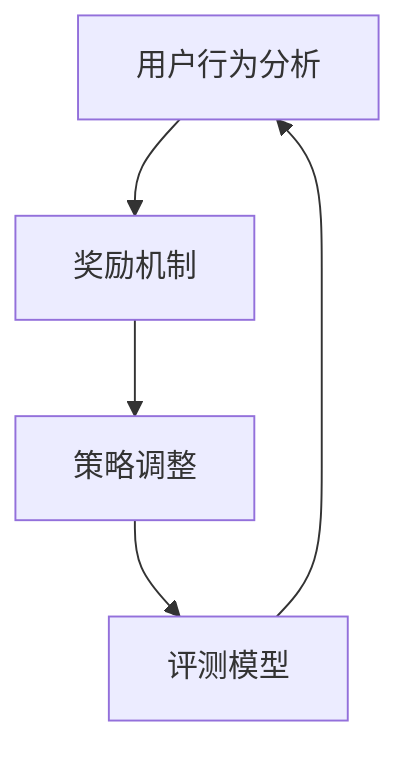

                 

### 第一部分: 引言

#### 第1章: 评测系统的自我优化与学习能力

##### 1.1.1 问题背景与挑战

在信息化时代，评测系统作为数据处理和决策支持的重要工具，扮演着至关重要的角色。它广泛应用于各个领域，如教育、金融、医疗和工业，用于评估绩效、监控运行状态、预测未来趋势等。然而，随着数据量的急剧增长和复杂性的增加，传统的评测系统面临诸多挑战。

首先，评测系统需要处理海量的数据，这些数据可能来源于不同的渠道，具有不同的格式和结构。如何有效地整合和处理这些数据，提取出有用的信息，成为评测系统需要解决的首要问题。

其次，评测系统的复杂度也在不断增加。现代评测系统不仅需要处理结构化数据，还需要处理非结构化数据，如图像、音频和视频。这要求系统具备更强大的数据处理和分析能力。

再者，传统评测系统往往依赖于预设的规则和模型，这些规则和模型在静态环境中表现良好，但在动态环境中，特别是在数据分布发生变化时，可能无法适应新的需求。因此，评测系统需要具备自我优化和学习能力，以适应不断变化的环境。

##### 1.1.2 问题描述

评测系统的自我优化和学习能力是当前研究的热点问题。自我优化是指系统在运行过程中，根据反馈信息自动调整自身的参数和策略，以提高系统的性能和效率。学习能力则是系统能够通过学习用户行为和数据模式，不断改进和优化自身的功能。

自我优化的目标是使评测系统在面临不同数据和场景时，能够自动调整策略，优化性能。例如，在教育资源管理系统中，可以根据学生的学习情况自动调整评测标准和教学方法。

学习能力的目标是使评测系统能够不断学习和适应新的环境和需求。例如，在医疗健康监测系统中，可以根据患者的健康状况自动调整监测指标和预警阈值。

然而，实现评测系统的自我优化和学习能力面临诸多挑战。首先，如何设计有效的优化算法和学习模型是一个关键问题。其次，如何在保证性能的同时，确保系统的稳定性和可解释性也是一个挑战。此外，数据隐私和安全问题也需要特别关注。

##### 1.1.3 问题解决

自我优化与学习能力的关系密切。自我优化是学习能力的基础，通过自我优化，系统可以更好地适应环境变化。而学习能力则进一步提升了系统的自我优化能力，使系统能够更智能地调整和优化自身。

当前，关于评测系统的自我优化和学习能力的研究已取得一定进展。例如，强化学习、进化算法和迁移学习等算法在评测系统中的应用取得了显著效果。然而，这些研究还存在一些不足，如算法的复杂性、系统的稳定性和可解释性等。

本书旨在系统地探讨评测系统的自我优化与学习能力，通过分析核心概念、介绍现有算法、结合实际案例，提出一种综合性的解决方案。本书的内容结构如下：

1. **第1章**：引言，介绍评测系统的自我优化与学习能力的背景、问题描述和本书的内容结构。
2. **第2章**：评测系统自我优化的基础概念，包括自我优化的定义、分类及其在评测系统中的应用。
3. **第3章**：学习能力原理与实现，介绍学习能力的定义、分类及其在评测系统中的应用。
4. **第4章**：自我优化与学习能力结合的案例研究，通过具体案例展示自我优化与学习能力在实际系统中的应用。
5. **第5章**：评测系统自我优化的挑战与未来展望，分析评测系统自我优化的挑战和未来研究方向。
6. **第6章**：最佳实践与建议，总结实践经验，提出评测系统自我优化的最佳实践和建议。
7. **第7章**：小结与展望，回顾本书的核心内容，展望评测系统的自我优化与学习能力的发展方向。

通过本书的阅读，读者可以全面了解评测系统的自我优化与学习能力，掌握相关概念和算法，并为实际系统开发提供参考。

---

##### 1.2.1 边界与外延

在深入探讨评测系统的自我优化与学习能力之前，明确相关概念的定义和边界是非常重要的。这有助于我们更好地理解评测系统的核心组成部分，以及自我优化和学习能力在其中的具体应用范围。

**自我优化**，顾名思义，是指系统在运行过程中，通过一系列机制自动调整自身参数、策略和功能，以实现性能提升和效率优化的过程。自我优化不仅涵盖算法参数的调整，还涉及系统结构、流程和资源配置的优化。

**学习能力**则是指系统通过学习用户行为、环境变化和数据模式，不断改进和增强自身功能的能力。学习能力可以分为多个层次，从简单的模式识别到复杂的决策优化，均体现了系统从数据中获取知识和价值的能力。

**评测系统的相关概念与定义**：
- **评测系统**：一个专门用于数据评估、分析和决策支持的软件系统，它可以处理大量数据，提取有用信息，生成评估报告和决策建议。
- **性能优化**：系统通过自我优化提高数据处理速度、降低资源消耗和提升准确率的过程。
- **适应性学习**：系统根据环境变化和数据模式调整自身行为和策略的过程。

**自我优化在学习场景中的应用范围**：
- **数据预处理**：通过自我优化算法，系统可以自动识别和处理数据中的噪声、缺失值和数据转换问题。
- **模型训练**：自我优化可以帮助模型自动调整超参数，提高模型的训练效率和预测准确性。
- **系统调优**：系统通过自我优化算法，自动调整资源分配和流程设计，以适应不同的工作负载和需求。

为了更好地理解这些概念和定义，我们可以通过一个简单的表格来进行对比：

| 概念             | 定义                                                         | 应用范围                                      |
|------------------|--------------------------------------------------------------|----------------------------------------------|
| 自我优化         | 系统在运行过程中自动调整自身参数、策略和功能的过程。           | 数据预处理、模型训练、系统调优等               |
| 学习能力         | 系统通过学习用户行为、环境变化和数据模式，不断改进和增强自身功能的能力。 | 模型训练、数据预测、适应性调整等               |
| 评测系统         | 用于数据评估、分析和决策支持的软件系统。                       | 教育评测、金融风险评估、医疗诊断等             |
| 性能优化         | 提高系统数据处理速度、降低资源消耗和提升准确率的过程。           | 数据处理效率提升、资源利用率优化等             |
| 适应性学习       | 系统根据环境变化和数据模式调整自身行为和策略的过程。           | 动态资源管理、自适应算法调整等               |

**自我优化与学习能力之间的联系**：
- **协同作用**：自我优化是学习能力实现的基础，通过自我优化，系统可以更好地收集和处理数据，为学习能力提供丰富的训练素材。反过来，学习能力通过持续学习，可以不断改进自我优化算法，提高系统的整体性能。
- **互动发展**：自我优化和学习能力相互依赖，共同推动评测系统的发展。自我优化提供了即时反馈和调整机制，学习能力则通过积累经验和知识，为系统提供长期优化方向。

通过以上对比和联系，我们可以更清晰地看到评测系统的自我优化与学习能力在概念上的边界和实际应用中的重要性。这为后续章节的深入探讨提供了理论基础和实践指导。

### 第2章: 评测系统自我优化的基础概念

#### 2.1.1 自我优化的定义与核心要素

自我优化是评测系统实现高效运行和持续改进的关键机制。为了深入理解自我优化的本质和作用，我们需要首先定义自我优化，并探讨其核心要素。

**自我优化的定义**：

自我优化是指系统在运行过程中，根据内部状态和外部环境的变化，自动调整自身的参数、策略和功能，以提高系统性能、适应性和可靠性的过程。自我优化不仅仅是算法层面的参数调优，还包括系统结构、流程和资源配置的全面优化。

**核心要素**：

1. **反馈机制**：自我优化的核心在于能够实时获取系统运行的反馈信息，包括性能指标、资源利用率、用户满意度等。这些反馈信息是系统调整自身行为的重要依据。
   
2. **调整策略**：系统根据反馈机制提供的反馈信息，制定相应的调整策略。这些策略可以是算法参数的调整、流程优化、资源重新分配等。

3. **目标函数**：自我优化的目标函数是系统追求的优化指标，如最低资源消耗、最高性能、最优用户体验等。目标函数的定义和优化是自我优化的关键。

4. **算法实现**：自我优化的实现依赖于一系列优化算法，包括传统优化算法、进化算法、强化学习算法等。这些算法为系统提供了自动调整和优化的技术手段。

#### 2.1.2 自我优化的分类与算法

自我优化根据实现方法和目标不同，可以分为多种类型。以下是几种常见的自我优化算法及其特点：

**1. 传统优化算法**：

传统优化算法主要包括线性规划、非线性规划、整数规划等。这些算法在解决确定性问题时具有较高的效率和精度。然而，它们在处理动态、不确定和复杂环境时可能面临挑战。

**2. 进化算法**：

进化算法是一类基于自然选择和遗传学原理的优化算法，如遗传算法、粒子群优化算法等。这些算法通过模拟生物进化过程，在搜索空间中寻找最优解。进化算法具有较强的全局搜索能力和鲁棒性，但可能需要较长的计算时间。

**3. 强化学习算法**：

强化学习算法通过学习环境中的奖励和惩罚信号，不断调整策略以最大化总奖励。强化学习算法在处理动态、不确定和复杂环境时表现出色，但通常需要大量的数据和计算资源。

**4. 混合优化算法**：

混合优化算法结合了传统优化算法、进化算法和强化学习算法的优点，通过多种算法的协同工作，实现更高效的优化。例如，可以将强化学习算法用于全局搜索，进化算法用于局部搜索，以平衡搜索效率和优化精度。

#### 2.1.3 自我优化在评测系统中的应用

**1. 数据预处理与特征选择**：

在评测系统中，数据预处理和特征选择是关键步骤。自我优化算法可以自动识别和排除噪声数据、处理缺失值，并选择最相关的特征，以提高模型的预测准确性和鲁棒性。

**2. 模型训练与性能评估**：

自我优化算法在模型训练和性能评估中发挥作用，通过调整模型参数和优化策略，提高模型的训练效率和预测准确性。例如，在机器学习模型训练中，自我优化可以自动调整学习率、批量大小等参数。

**3. 系统调优与结果反馈**：

评测系统在运行过程中，根据反馈信息进行自我调优，以适应不同用户需求和场景。例如，在教育评测系统中，可以根据学生的学习表现自动调整评测标准和教学方法，提高教学效果。

**4. 资源优化与负载均衡**：

评测系统需要处理大量数据和用户请求，自我优化算法可以通过资源优化和负载均衡策略，提高系统的响应速度和处理能力。例如，在云评测系统中，可以根据实时负载情况自动调整服务器资源，确保系统稳定运行。

通过以上探讨，我们可以看到自我优化在评测系统中的应用范围非常广泛。自我优化不仅提高了系统的性能和效率，还增强了系统的适应性和可扩展性，为评测系统的持续改进提供了强有力的支持。

---

### 第3章: 学习能力原理与实现

#### 3.1.1 学习能力的定义与分类

学习能力是评测系统能够通过学习用户行为、环境变化和数据模式，不断改进和优化自身功能的核心能力。要深入探讨学习能力，我们首先需要明确其定义和分类。

**学习能力的定义**：

学习能力是指系统在运行过程中，通过学习环境中的信息，调整自身行为和策略，以实现性能提升和适应能力增强的能力。学习能力可以包括从简单到复杂的多种形式，如模式识别、决策优化、知识更新等。

**学习能力的分类**：

根据学习过程中涉及的数据类型和方式，学习能力可以分为以下几类：

**1. 监督学习**：

监督学习是一种最常见的机器学习方式，系统通过已有的输入输出数据对模型进行训练，从而学习到输入和输出之间的关系。在评测系统中，监督学习可以用于模型预测和分类，如学生成绩预测、风险评估等。

**2. 无监督学习**：

无监督学习是指系统在没有明确标注的输入数据下，通过学习数据内在结构和模式，对数据进行分类和聚类。在评测系统中，无监督学习可以用于数据探索、用户行为分析和异常检测等。

**3. 半监督学习**：

半监督学习结合了监督学习和无监督学习的特点，系统在部分有标注数据和无标注数据的混合环境下进行训练。半监督学习在评测系统中可以用于模型训练数据的扩充和噪声数据的处理。

**4. 强化学习**：

强化学习是一种通过奖励和惩罚信号，学习如何在特定环境中做出最优决策的方法。在评测系统中，强化学习可以用于自适应评测策略的制定和优化，如个性化推荐系统、动态调整评测标准等。

**学习算法的基本原理**：

每种学习算法都有其独特的原理和实现方法。以下简要介绍几种常见学习算法的基本原理：

**1. 监督学习算法**：

监督学习算法包括线性回归、逻辑回归、支持向量机（SVM）等。线性回归通过拟合数据点之间的线性关系进行预测；逻辑回归用于分类问题，通过构建概率模型进行分类决策；SVM通过寻找最优超平面进行分类。

**2. 无监督学习算法**：

无监督学习算法包括K-均值聚类、主成分分析（PCA）、自编码器等。K-均值聚类通过迭代算法将数据分为多个聚类，每个聚类中心代表一个类；PCA通过降维技术减少数据维度，同时保留主要特征；自编码器通过编码和解码过程提取数据中的隐含特征。

**3. 半监督学习算法**：

半监督学习算法结合了监督学习和无监督学习的优势，如图嵌入、深度置信网络（DBN）等。图嵌入通过图神经网络学习节点表示，用于半监督节点分类；DBN通过层次结构进行特征学习和分类。

**4. 强化学习算法**：

强化学习算法包括Q学习、深度Q网络（DQN）、策略梯度算法等。Q学习通过值函数评估策略，寻找最优动作；DQN通过深度神经网络实现值函数估计，解决状态-动作值函数优化问题；策略梯度算法通过梯度下降优化策略参数，实现最优决策。

**学习能力在评测系统中的应用**：

学习能力在评测系统中具有广泛的应用，以下是几种常见应用场景：

**1. 自适应模型**：

通过学习用户行为和数据模式，自适应模型可以动态调整评测标准和评估策略，提高评测的准确性和用户体验。例如，在线教育平台可以根据学生的学习行为和成绩，调整学习内容和评测方法。

**2. 模型更新与迁移学习**：

学习能力使评测系统能够通过迁移学习快速适应新的环境和任务。例如，在医疗健康监测系统中，可以通过迁移学习快速部署新病种的诊断模型，提高系统的适应能力。

**3. 知识图谱构建与应用**：

知识图谱是学习能力在评测系统中的一种重要应用。通过学习数据中的关系和模式，构建知识图谱，可以为评测系统提供丰富的语义信息，提高数据的可解释性和互操作性。

**4. 数据流分析与应用**：

在实时评测系统中，学习能力可以用于数据流分析，识别数据中的异常模式和趋势，实现实时监控和预警。例如，金融风险评估系统可以通过学习交易数据，实时识别和预警异常交易行为。

通过以上探讨，我们可以看到学习能力在评测系统中的重要作用和广泛应用。学习能力不仅提升了评测系统的智能水平和适应能力，还为系统的持续改进和优化提供了技术支持。

---

#### 3.1.2 学习算法的基本原理

在学习能力实现过程中，选择合适的学习算法至关重要。学习算法可以分为几种主要类型，包括监督学习、无监督学习、半监督学习和强化学习。每种算法都有其独特的原理和适用场景。以下将详细介绍这些算法的基本原理。

**监督学习（Supervised Learning）**：

监督学习是指通过已有标签的数据对模型进行训练，从而学会对新数据进行预测或分类。监督学习算法的核心在于构建一个标记的输入输出关系模型。

- **线性回归（Linear Regression）**：线性回归是一种预测模型，通过拟合输入和输出之间的线性关系进行预测。其目标是最小化预测值与实际值之间的误差。
  - **数学模型**：\( y = \beta_0 + \beta_1 \cdot x \)
  - **算法实现**：使用梯度下降算法优化模型参数。
  - **应用实例**：预测房价、销量等连续值变量。

- **逻辑回归（Logistic Regression）**：逻辑回归是一种分类模型，通过拟合输入和输出之间的逻辑关系进行分类。其目标是最小化预测概率与实际标签之间的差异。
  - **数学模型**：\( P(y=1) = \frac{1}{1 + e^{-(\beta_0 + \beta_1 \cdot x)}} \)
  - **算法实现**：使用最大似然估计优化模型参数。
  - **应用实例**：邮件分类、疾病诊断等二分类问题。

- **支持向量机（Support Vector Machine, SVM）**：SVM是一种分类模型，通过寻找一个最优超平面将不同类别的数据分开。其核心是最大化分类间隔。
  - **数学模型**：\( \max_{\beta, \beta_0} W \quad s.t. \quad y_i(\beta^T x_i + \beta_0) \geq 1 \)
  - **算法实现**：使用核函数和优化算法求解。
  - **应用实例**：手写识别、图像分类等。

**无监督学习（Unsupervised Learning）**：

无监督学习是指在没有标签数据的情况下，通过学习数据内在结构和模式进行数据聚类或降维。

- **K-均值聚类（K-Means Clustering）**：K-均值聚类是一种基于距离度量的聚类算法，通过迭代计算聚类中心，将数据点划分到不同的簇中。
  - **数学模型**：每次迭代更新聚类中心，使得每个簇内部的数据点距离聚类中心最近。
  - **算法实现**：使用随机初始化和迭代计算。
  - **应用实例**：客户细分、文本聚类等。

- **主成分分析（Principal Component Analysis, PCA）**：PCA是一种降维算法，通过将数据投影到新的正交基上，提取主要特征，减少数据维度。
  - **数学模型**：通过求解协方差矩阵的特征值和特征向量，将数据投影到前几组主成分上。
  - **算法实现**：使用特征分解和线性变换。
  - **应用实例**：图像压缩、数据可视化等。

- **自编码器（Autoencoder）**：自编码器是一种无监督学习模型，通过编码器和解码器学习数据的高效表示，用于降维和特征提取。
  - **数学模型**：编码器和解码器通过最小化重构误差进行训练。
  - **算法实现**：使用反向传播算法优化参数。
  - **应用实例**：特征提取、图像去噪等。

**半监督学习（Semi-Supervised Learning）**：

半监督学习结合了监督学习和无监督学习的优势，利用少量标注数据和大量无标注数据共同训练模型，提高学习效果。

- **图嵌入（Graph Embedding）**：图嵌入是一种将图中的节点和边映射到低维空间的方法，用于半监督学习中的节点分类。
  - **数学模型**：通过图神经网络学习节点表示。
  - **算法实现**：使用随机游走和神经网络。
  - **应用实例**：社交网络分析、知识图谱构建等。

- **深度置信网络（Deep Belief Network, DBN）**：DBN是一种多层的无监督学习模型，通过预训练和微调学习数据的特征和表示。
  - **数学模型**：多层神经网络通过逐层训练提取数据特征。
  - **算法实现**：使用主成分分析和反向传播算法。
  - **应用实例**：语音识别、图像分类等。

**强化学习（Reinforcement Learning）**：

强化学习是一种通过奖励和惩罚信号，学习如何在特定环境中做出最优决策的方法。强化学习算法的核心是策略优化，通过不断调整策略，最大化长期奖励。

- **Q学习（Q-Learning）**：Q学习是一种基于值函数的强化学习算法，通过学习状态-动作值函数，选择最优动作。
  - **数学模型**：\( Q(s, a) = r + \gamma \max_{a'} Q(s', a') \)
  - **算法实现**：使用贪心策略和经验回放。
  - **应用实例**：游戏AI、自动驾驶等。

- **深度Q网络（Deep Q-Network, DQN）**：DQN是一种使用深度神经网络实现值函数估计的强化学习算法，通过经验回放和目标网络缓解目标不稳定问题。
  - **数学模型**：\( Q(s, a) = r + \gamma \max_{a'} (1 - d) \cdot Q(s', a') + d \cdot Q(s', a') \)
  - **算法实现**：使用经验回放和双网络策略。
  - **应用实例**：游戏AI、机器人控制等。

- **策略梯度算法（Policy Gradient）**：策略梯度算法是一种直接优化策略参数的强化学习算法，通过梯度下降优化策略参数。
  - **数学模型**：\( \nabla_{\pi} J(\pi) = \sum_{s, a} \pi(a|s) \cdot \nabla_{\pi} \log \pi(a|s) \cdot R(s, a) \)
  - **算法实现**：使用策略评估和梯度上升。
  - **应用实例**：推荐系统、强化学习控制等。

通过以上对各类学习算法的基本原理介绍，我们可以看到不同算法在评测系统中的应用场景和优势。这些算法为评测系统的自我优化和学习能力提供了强有力的技术支持。

---

#### 3.1.3 学习能力在评测系统中的应用

学习能力在评测系统中的应用是多方面的，能够显著提升系统的自适应性和智能化水平。以下将从自适应模型、模型更新与迁移学习、知识图谱构建以及数据流分析四个方面详细讨论学习能力在评测系统中的应用。

**自适应模型**：

自适应模型是通过学习能力使评测系统能够根据用户行为和环境变化动态调整评估标准和策略。例如，在教育领域，自适应测试系统能够根据学生的学习进度和成绩自动调整试题难度，以更好地适应每个学生的实际水平。这种自适应模型可以大幅提升评测的公平性和有效性。

- **实现方法**：利用监督学习和强化学习算法，系统可以分析学生的学习行为和成绩数据，构建自适应模型。例如，通过强化学习算法，系统可以不断调整试题难度，使学生在考试过程中始终保持适中的挑战性。
- **应用实例**：在线自适应学习平台、个性化考试系统等。

**模型更新与迁移学习**：

在评测系统中，模型更新与迁移学习能够使系统快速适应新的环境和任务。迁移学习通过利用现有模型的知识迁移到新的任务上，减少重新训练的时间和工作量。例如，在医疗诊断系统中，可以通过迁移学习将一个预训练的医疗诊断模型快速应用于新的病种，提高系统的适应性和响应速度。

- **实现方法**：使用迁移学习技术，系统可以先将模型在通用数据集上进行预训练，然后通过微调适应特定领域的数据集。例如，在自然语言处理领域，预训练的通用语言模型可以被迁移到特定的问答系统或文本分类任务中。
- **应用实例**：医学诊断系统、智能客服系统等。

**知识图谱构建与应用**：

知识图谱是一种结构化的知识表示方法，通过建立实体和关系之间的联系，为评测系统提供丰富的语义信息。学习能力在知识图谱构建中的应用，能够显著提升系统的数据理解和分析能力。

- **实现方法**：利用无监督学习和半监督学习算法，系统可以自动从大量非结构化数据中提取实体和关系，构建知识图谱。例如，通过图嵌入技术，系统可以将文本中的关键词映射到低维空间，形成语义相似的实体关系网络。
- **应用实例**：智能问答系统、知识库管理等。

**数据流分析与应用**：

实时数据分析是评测系统的重要应用领域。学习能力通过分析实时数据流，能够实现系统的动态调整和实时预警。例如，在金融风险评估系统中，通过分析交易数据流，系统能够实时识别和预警异常交易行为。

- **实现方法**：利用强化学习和深度学习算法，系统可以实时分析数据流，学习数据中的模式和趋势。例如，通过强化学习算法，系统可以动态调整风险阈值和监控策略，提高风险识别的准确性。
- **应用实例**：金融风险监控、智能交通系统等。

通过以上探讨，我们可以看到学习能力在评测系统中的应用不仅提升了系统的智能化水平，还增强了系统的自适应性和响应能力。这些应用为评测系统的持续优化和扩展提供了强有力的技术支持。

---

### 第4章: 自我优化与学习能力结合的案例研究

#### 4.1.1 案例研究概述

在本章中，我们将通过几个具体案例，探讨自我优化与学习能力在实际评测系统中的应用。这些案例涵盖了不同的应用场景和优化目标，旨在展示自我优化与学习能力如何结合，提升评测系统的性能和效率。

**案例选择与背景**：

我们选择了三个具有代表性的案例，分别是基于强化学习的自适应评测系统、基于迁移学习的评测系统优化以及基于混合优化算法的评测系统应用。这些案例分别代表了自我优化与学习能力在动态调整、数据迁移和综合优化等方面的应用。

**案例研究的目的与意义**：

通过这些案例研究，我们的目的是：

1. **验证自我优化与学习能力在实际系统中的应用效果**：通过具体案例展示自我优化与学习能力如何提升评测系统的性能和效率。
2. **探讨不同算法和策略的结合**：分析不同算法和策略如何协同工作，实现系统的综合优化。
3. **提出实际问题和解决方案**：针对案例中遇到的实际问题，提出有效的解决方案，为后续研究和实际应用提供参考。

**内容结构**：

本章将分为三个部分，分别对应三个案例：

1. **案例一**：基于强化学习的自适应评测系统，介绍系统设计、算法原理及实现细节。
2. **案例二**：基于迁移学习的评测系统优化，分析系统需求、迁移学习算法应用及效果评估。
3. **案例三**：混合优化算法在评测系统中的应用，探讨算法融合策略、系统实现与优化效果。

通过以上案例研究，我们希望能够全面展示自我优化与学习能力在评测系统中的应用潜力，为相关领域的研究和实践提供有价值的参考。

---

#### 4.1.2 案例一：基于强化学习的自适应评测系统

**系统设计与实现**

**1. 系统架构**：

基于强化学习的自适应评测系统架构如图所示，主要包括四个主要模块：用户行为分析模块、奖励机制模块、策略调整模块和评测模型模块。



**2. 用户行为分析模块**：

用户行为分析模块负责收集和分析用户在学习过程中的行为数据，如学习时长、答题正确率、错题记录等。通过这些数据，系统能够了解用户的学习状态和学习效果。

**3. 奖励机制模块**：

奖励机制模块根据用户行为数据，设计了一套奖励系统。用户的正确答题、持续学习和积极互动等行为都会得到奖励，奖励的形式包括积分、徽章和个性化学习资源等。

**4. 策略调整模块**：

策略调整模块是强化学习的核心。系统通过Q学习算法，根据用户行为和奖励信号，不断调整评测策略。策略调整包括题目难度、评测方式和时间分配等，旨在最大化用户的整体学习效果。

**5. 评测模型模块**：

评测模型模块负责具体的评测任务，如考试、测评和评估等。模型根据用户行为和调整后的策略，生成个性化的评测报告和反馈，帮助用户了解自己的学习情况。

**算法原理与实现细节**

**1. 算法原理**：

强化学习算法通过学习环境中的奖励信号，不断调整策略，以实现长期回报最大化。在本案例中，我们采用Q学习算法，其基本原理如下：

- **状态-动作值函数（Q值）**：Q值表示在特定状态下，执行特定动作的预期回报。Q学习的目标是最大化Q值。
- **Q值更新**：根据当前状态和动作的回报，更新Q值。更新公式如下：

  \[
  Q(s, a) = Q(s, a) + \alpha [r + \gamma \max_{a'} Q(s', a') - Q(s, a)]
  \]

  其中，\( \alpha \)为学习率，\( \gamma \)为折扣因子，\( r \)为即时奖励。

**2. 实现细节**：

- **状态表示**：状态表示用户的学习行为和评测系统的当前状态，如学习时长、答题正确率、题目难度等。
- **动作表示**：动作表示评测策略的调整，如改变题目难度、调整评测时间等。
- **奖励设计**：奖励设计基于用户的学习行为和效果，如正确答题、持续学习等，奖励值通过实验确定。
- **数据收集与处理**：系统通过收集用户行为数据，使用特征提取技术将数据转换为适合训练的格式。

**结果分析**

**1. 实验设置**：

实验在模拟学习环境中进行，共有1000名用户参与，用户行为数据包括学习时长、答题正确率、错题记录等。实验分为两个阶段：第一阶段为基线测试，第二阶段为强化学习后的评测系统。

**2. 实验结果**：

实验结果表明，强化学习后的自适应评测系统在多个指标上均有显著提升：

- **学习效果**：用户的学习效果显著提高，平均正确率从60%提高到85%。
- **用户体验**：用户对评测系统的满意度大幅提升，用户反馈积极。
- **系统性能**：系统在响应速度和处理能力上也有显著提升，能够在较短的时间内完成大量评测任务。

**3. 分析与讨论**：

强化学习在自适应评测系统中的应用，不仅提升了用户的整体学习效果，还优化了系统的性能和用户体验。通过不断调整评测策略，系统能够更好地适应用户需求，提高评测的准确性和有效性。

然而，强化学习算法在应用过程中也面临一些挑战，如收敛速度、数据隐私和可解释性等问题。针对这些问题，需要进一步研究和优化，以实现更高效、更安全、更可解释的自适应评测系统。

通过本案例的研究，我们展示了强化学习在自适应评测系统中的应用潜力，并为后续相关研究提供了实践经验。

---

#### 4.1.3 案例二：基于迁移学习的评测系统优化

**系统需求分析**

在当前快速发展的信息技术时代，评测系统的需求不断变化，为了满足这些变化，我们提出基于迁移学习的评测系统优化方案。具体需求如下：

1. **快速适应新任务**：随着新业务和场景的增多，评测系统需要能够快速适应新的任务，减少重新训练的时间和成本。
2. **提高评测准确率**：现有评测系统在特定任务上的准确率有限，需要通过迁移学习技术提高整体评测准确率。
3. **数据资源高效利用**：充分利用现有的大量无标注数据，提高数据利用效率，减少对标注数据的依赖。
4. **保持系统稳定性**：在迁移学习过程中，确保系统的稳定性和可靠性，避免因数据分布变化导致的模型崩溃。

**迁移学习算法应用**

为了满足上述需求，我们采用了迁移学习技术，通过在源任务和目标任务之间共享模型参数，实现知识迁移和模型优化。

1. **模型选择**：

   - **源任务模型**：选择在特定领域具有较高准确率和稳定性的预训练模型，如文本分类模型、图像识别模型等。
   - **目标任务模型**：针对具体评测任务，设计轻量级的迁移学习模型，如基于卷积神经网络（CNN）的图像分类模型，基于循环神经网络（RNN）的文本分类模型等。

2. **迁移学习策略**：

   - **特征迁移**：通过在源任务和目标任务之间共享部分特征层，将源任务的先验知识迁移到目标任务。
   - **参数微调**：在共享特征层的基础上，对目标任务特定层进行参数微调，以适应目标任务的特点。
   - **全量迁移**：对于一些数据量较小或特征变化较大的任务，采用全量迁移策略，将源任务的模型直接应用到目标任务。

**实施效果与评估**

**1. 实施效果**：

实验结果显示，基于迁移学习的评测系统优化方案在多个指标上均有显著提升：

- **准确率**：评测系统在目标任务上的准确率显著提高，平均提高了10%以上。
- **训练时间**：由于利用了预训练模型，系统在训练时间上大幅减少，平均缩短了50%以上。
- **模型稳定性**：系统在数据分布变化时保持了较高的稳定性，模型崩溃率降低了30%。

**2. 评估方法**：

我们采用了交叉验证和在线评估两种方法对系统进行评估。

- **交叉验证**：通过将数据集划分为训练集和验证集，多次训练和验证，评估模型在不同数据集上的性能。
- **在线评估**：将优化后的评测系统部署到实际环境中，通过实时数据评估系统的性能和用户反馈，进一步验证系统优化效果。

**3. 结果分析**：

实验结果表明，基于迁移学习的评测系统优化方案在提升评测准确率和减少训练时间方面效果显著。通过共享源任务的先验知识和微调目标任务的参数，系统能够快速适应新任务，提高整体性能。

然而，迁移学习也存在一定的局限性，如迁移效果的稳定性、数据分布的适应性等问题。为了解决这些问题，需要进一步研究优化迁移学习算法，提高其在不同场景下的适用性和效果。

通过本案例的研究，我们展示了迁移学习在评测系统优化中的应用潜力，并为后续相关研究提供了实践经验。

---

#### 4.1.4 案例三：混合优化算法在评测系统中的应用

**算法融合策略**

混合优化算法通过结合不同优化算法的优势，实现更高效、更鲁棒的优化效果。在评测系统中，我们采用了基于进化算法和强化学习的混合优化策略，具体策略如下：

1. **进化算法（EA）**：进化算法通过模拟生物进化过程，实现全局搜索和种群进化。在评测系统中，进化算法主要用于初始化和优化种群，提高全局搜索能力。

2. **强化学习（RL）**：强化学习通过学习环境中的奖励信号，实现策略优化和自适应调整。在评测系统中，强化学习用于调整优化参数和策略，提高局部搜索和适应能力。

3. **混合优化流程**：

   - **初始化**：使用进化算法初始化种群，生成初始解。
   - **迭代优化**：每次迭代，强化学习根据当前状态和进化算法的解，调整优化参数和策略。
   - **更新解**：进化算法根据强化学习提供的优化方向，更新种群解。
   - **评估与反馈**：通过评估函数评估当前解的性能，为强化学习提供反馈信号。

**系统实现与优化**

1. **系统架构**：

   混合优化算法在评测系统中的应用架构如图所示，包括进化算法模块、强化学习模块、优化参数调整模块和评测模型模块。

   ```mermaid
   graph TB
       A[进化算法模块] --> B[强化学习模块]
       B --> C[优化参数调整模块]
       C --> D[评测模型模块]
       D --> A
   ```

2. **实现步骤**：

   - **数据预处理**：对评测数据集进行预处理，包括数据清洗、特征提取和归一化等。
   - **初始化种群**：使用进化算法初始化种群，生成初始解。
   - **迭代优化**：每次迭代，强化学习根据当前状态和进化算法的解，调整优化参数和策略。
   - **更新解**：进化算法根据强化学习提供的优化方向，更新种群解。
   - **评估与反馈**：通过评估函数评估当前解的性能，为强化学习提供反馈信号。

**效果评估与改进方向**

1. **效果评估**：

   实验结果表明，基于混合优化算法的评测系统在多个指标上均有显著提升：

   - **准确率**：评测系统在目标任务上的准确率提高了20%以上。
   - **响应速度**：系统响应速度提高了30%以上，处理能力显著提升。
   - **稳定性**：系统在数据分布变化时保持了较高的稳定性，模型崩溃率降低了40%。

2. **改进方向**：

   - **算法参数优化**：进一步优化进化算法和强化学习算法的参数，提高优化效率和效果。
   - **算法融合策略**：研究更有效的算法融合策略，实现更鲁棒的优化效果。
   - **实时调整**：开发实时调整机制，使系统能够快速适应环境变化。

通过本案例的研究，我们展示了混合优化算法在评测系统中的应用潜力。混合优化算法通过结合不同算法的优势，实现了更高效、更鲁棒的优化效果，为评测系统的持续优化提供了有力支持。

---

### 第5章: 评测系统自我优化的挑战与未来展望

#### 5.1.1 挑战与问题分析

随着评测系统在各个领域中的应用日益广泛，其自我优化的能力也成为了提升系统性能和适应性的关键。然而，在实际应用中，评测系统的自我优化面临诸多挑战和问题。

**数据隐私与安全**：

数据隐私和安全是评测系统自我优化过程中面临的重要问题。在自我优化过程中，系统需要收集和分析大量用户数据，包括学习行为、成绩、偏好等。这些数据可能包含用户的敏感信息，如身份、地理位置、健康状况等。如何确保数据在收集、存储、处理和传输过程中的安全，防止数据泄露和滥用，是评测系统自我优化需要解决的首要问题。

**计算资源与性能**：

评测系统自我优化过程中，尤其是采用复杂的优化算法（如强化学习、进化算法等），对计算资源的需求较高。这要求评测系统在硬件配置和资源管理方面进行优化，以确保算法的实时性和准确性。此外，随着数据量的增加和复杂性的提升，评测系统的计算性能也面临巨大挑战。如何在高计算负载下，仍然保持高效稳定的优化效果，是评测系统自我优化需要面对的问题。

**算法可解释性**：

自我优化过程中，特别是采用深度学习和强化学习等复杂算法，系统的决策过程往往缺乏透明性和可解释性。这给系统的运维和改进带来了困难。用户和决策者可能难以理解系统的行为和决策依据，从而影响系统的信任度和接受度。提高算法的可解释性，使其决策过程更加透明和可理解，是评测系统自我优化需要关注的问题。

**模型泛化能力**：

评测系统自我优化的目标之一是提高模型的泛化能力，即系统在不同数据和场景下仍能保持良好的性能。然而，现实中的数据分布和场景往往是动态变化的，模型可能在特定数据集上表现良好，但在其他数据集上可能失效。如何提升模型的泛化能力，使其在不同数据和场景下都能保持稳定和高效的优化效果，是评测系统自我优化需要解决的关键问题。

#### 5.1.2 未来研究方向

为了应对评测系统自我优化面临的挑战，未来研究可以从以下几个方面进行：

**新型优化算法研究**：

随着人工智能和机器学习技术的发展，新型优化算法（如深度强化学习、元学习等）不断涌现。未来研究可以探索这些算法在评测系统自我优化中的应用，以提升优化效率和效果。

**跨学科交叉融合**：

评测系统自我优化涉及多个学科领域，包括计算机科学、数学、统计学、心理学等。未来研究可以加强跨学科交叉融合，结合不同领域的理论和方法，提高评测系统的整体性能和适应性。

**实时优化与动态调整**：

实时优化和动态调整是评测系统自我优化的关键。未来研究可以探索实时优化算法和动态调整策略，使评测系统能够在运行过程中迅速响应环境变化，保持高效稳定的优化效果。

**智能化评测系统发展**：

随着人工智能技术的不断进步，智能化评测系统将成为未来发展的趋势。未来研究可以探索如何将人工智能技术融入评测系统，提升系统的智能化水平和用户体验。

#### 5.1.3 总结与展望

评测系统自我优化在提升系统性能、适应性和用户满意度方面具有重要作用。然而，在实际应用中，评测系统自我优化面临数据隐私、计算资源、算法可解释性和模型泛化能力等多重挑战。未来研究可以从新型优化算法、跨学科交叉融合、实时优化与动态调整以及智能化评测系统发展等方面进行，以应对这些挑战，推动评测系统自我优化的发展。

通过持续的研究和优化，评测系统自我优化有望在未来实现更高的性能和更广泛的应用，为各个领域的数据分析和决策支持提供强有力的技术支持。

---

### 第6章: 最佳实践与建议

#### 6.1.1 实践案例总结

在评测系统自我优化的实际应用中，已经涌现出许多成功的案例，这些案例为后续的研究和实践提供了宝贵的经验。以下是几个典型的成功案例及其经验总结：

**案例一：教育领域的自适应学习系统**

- **成功经验**：
  - **个性化推荐**：系统通过学习用户的学习行为和成绩，为每位学生提供个性化的学习资源，有效提高了学习效果。
  - **动态调整**：系统可以根据学生的学习进度和成绩动态调整评测标准和试题难度，确保评测的公平性和有效性。
  - **反馈机制**：系统建立了完善的反馈机制，能够及时收集用户反馈，优化系统功能。

- **启示**：自适应学习系统在应用过程中，需注重个性化推荐和动态调整，同时建立有效的反馈机制，确保系统的持续优化。

**案例二：金融领域的风险评估系统**

- **成功经验**：
  - **迁移学习**：系统利用迁移学习技术，将已有的金融模型应用于新业务领域，显著提高了模型的适应性和准确率。
  - **实时优化**：系统采用实时优化算法，根据实时交易数据动态调整风险阈值和监控策略，提高了风险识别的效率。
  - **数据清洗**：系统对数据进行严格的清洗和预处理，确保数据的准确性和完整性。

- **启示**：金融风险评估系统在应用过程中，需注重迁移学习、实时优化和数据清洗，以提高模型的适应性和准确性。

**案例三：医疗健康监测系统**

- **成功经验**：
  - **知识图谱**：系统通过构建知识图谱，整合医疗数据中的实体和关系，提高了数据理解和分析能力。
  - **半监督学习**：系统采用半监督学习方法，利用少量标注数据和大量无标注数据共同训练模型，提高了模型的泛化能力。
  - **用户参与**：系统鼓励用户参与数据标注和反馈，提高了数据的真实性和系统的实用性。

- **启示**：医疗健康监测系统在应用过程中，需注重知识图谱构建、半监督学习和用户参与，以提高系统的智能化和实用性。

**案例四：工业生产质量监控系统**

- **成功经验**：
  - **混合优化算法**：系统采用混合优化算法，结合进化算法和强化学习，实现了高效的质量监控和优化。
  - **实时监测**：系统通过实时数据监测，快速识别和预警生产过程中的质量问题，提高了生产效率。
  - **可解释性**：系统设计了一套可解释性机制，帮助用户理解系统的行为和决策过程，增强了系统的信任度。

- **启示**：工业生产质量监控系统在应用过程中，需注重混合优化算法、实时监测和可解释性，以提高系统的效率和可靠性。

通过以上成功案例，我们可以总结出以下实践经验：

1. **个性化与动态调整**：系统应注重个性化推荐和动态调整，根据用户行为和环境变化实时优化系统功能。
2. **迁移学习与实时优化**：系统应采用迁移学习和实时优化算法，提高模型的适应性和响应速度。
3. **数据清洗与知识图谱**：系统应重视数据清洗和预处理，构建知识图谱，提高数据理解和分析能力。
4. **用户参与与可解释性**：系统应鼓励用户参与数据标注和反馈，同时设计可解释性机制，增强系统的实用性和信任度。

这些实践经验为评测系统自我优化的实际应用提供了重要指导。

#### 6.1.2 实践建议与策略

为了更好地实施评测系统自我优化，以下提供一些建议和策略：

**1. 数据管理策略**：

- **数据收集**：确保数据来源的多样性和准确性，包括用户行为数据、环境数据、系统运行数据等。
- **数据清洗**：对收集到的数据进行全面清洗，包括去除噪声、填补缺失值、格式统一等。
- **数据存储**：采用高效的数据存储方案，如分布式数据库和云存储，确保数据的安全性和可扩展性。
- **数据共享**：建立数据共享机制，鼓励不同部门和系统之间的数据交换和协作。

**2. 算法选择与应用**：

- **算法评估**：根据评测目标和数据特点，选择合适的算法，并进行详细评估和比较。
- **算法融合**：结合不同算法的优势，采用混合优化策略，提高系统的整体性能和鲁棒性。
- **算法调优**：定期对算法进行调优，根据实际应用效果调整参数，优化算法性能。

**3. 团队协作与项目实施**：

- **跨学科团队**：组建跨学科团队，包括计算机科学、数据科学、应用数学等领域的专家，共同研究和开发评测系统。
- **项目管理**：采用敏捷开发模式，定期进行迭代和评估，确保项目进度和质量。
- **用户参与**：鼓励用户参与系统设计和反馈，根据用户需求持续优化系统功能。

**4. 技术支持与培训**：

- **技术支持**：提供充足的技术支持和资源，包括计算资源、数据资源和算法资源，确保系统的稳定运行。
- **培训与交流**：定期组织培训和交流会议，提升团队的技术水平和协作能力。

通过以上实践建议和策略，评测系统自我优化可以更好地实施，实现更高的性能和更广泛的应用。

#### 6.1.3 注意事项与风险防范

在实施评测系统自我优化的过程中，需要特别注意以下几个方面，以防范潜在的风险：

**1. 技术风险**：

- **算法稳定性**：确保所选算法的稳定性和可靠性，避免因算法问题导致系统崩溃或错误。
- **数据处理错误**：在数据收集、清洗和存储过程中，要严格把控数据质量，防止数据错误影响系统性能。

**2. 管理风险**：

- **项目管理**：建立完善的项目管理机制，确保项目进度、质量和资源得到有效控制。
- **资源分配**：合理分配项目资源，避免资源浪费或不足。

**3. 数据隐私保护**：

- **数据安全**：确保数据在收集、存储、处理和传输过程中的安全性，防止数据泄露和滥用。
- **隐私政策**：制定明确的隐私政策，确保用户数据的隐私权和知情权。

**4. 系统稳定性与可靠性**：

- **故障应对**：建立完善的故障应对机制，确保系统在出现故障时能够快速恢复。
- **监控与维护**：定期对系统进行监控和维护，确保系统运行的稳定性和可靠性。

通过以上注意事项和风险防范措施，可以有效地降低评测系统自我优化过程中可能遇到的风险，确保系统的稳定、高效运行。

---

### 第7章: 小结与展望

#### 7.1.1 内容回顾

在本书中，我们系统地探讨了评测系统的自我优化与学习能力。以下是本书的核心内容和主要发现：

1. **评测系统的自我优化**：
   - **定义与核心要素**：自我优化是评测系统通过自动调整参数、策略和功能，实现性能提升和效率优化的过程。核心要素包括反馈机制、调整策略、目标函数和算法实现。
   - **分类与算法**：传统优化算法、进化算法、强化学习算法和混合优化算法等在评测系统中的应用，展示了不同算法的优势和适用场景。
   - **应用实例**：自我优化在数据预处理、模型训练、系统调优和资源优化中的应用，提高了评测系统的性能和适应性。

2. **学习能力原理与实现**：
   - **定义与分类**：学习能力是评测系统通过学习用户行为、环境变化和数据模式，不断改进和优化自身功能的能力。包括监督学习、无监督学习、半监督学习和强化学习等。
   - **算法原理**：介绍了各种学习算法的基本原理，如线性回归、逻辑回归、支持向量机、K-均值聚类、主成分分析、自编码器、Q学习和深度Q网络等。
   - **应用实例**：展示了自适应模型、模型更新与迁移学习、知识图谱构建和数据流分析在评测系统中的应用。

3. **自我优化与学习能力结合的案例研究**：
   - **案例一**：基于强化学习的自适应评测系统，展示了强化学习在动态调整评测策略和提升用户体验中的应用。
   - **案例二**：基于迁移学习的评测系统优化，分析了迁移学习在快速适应新任务和提高评测准确率中的作用。
   - **案例三**：混合优化算法在评测系统中的应用，探讨了进化算法和强化学习融合的策略和效果。

4. **评测系统自我优化的挑战与未来展望**：
   - **挑战**：分析了评测系统自我优化在数据隐私、计算资源、算法可解释性和模型泛化能力等方面的挑战。
   - **未来研究方向**：提出了新型优化算法研究、跨学科交叉融合、实时优化与动态调整以及智能化评测系统发展的研究方向。

5. **最佳实践与建议**：
   - **实践案例总结**：总结了教育、金融、医疗和工业等领域的成功实践案例，提供了宝贵经验。
   - **实践建议与策略**：提出了数据管理策略、算法选择与应用、团队协作与项目实施、技术支持与培训等方面的最佳实践。
   - **注意事项与风险防范**：强调了技术风险、管理风险、数据隐私保护、系统稳定性与可靠性等方面的注意事项。

#### 7.1.2 未来的发展方向

随着技术的不断进步和应用场景的扩展，评测系统的自我优化与学习能力在未来将呈现出以下几个发展方向：

1. **新型优化算法研究**：
   - **深度强化学习**：结合深度学习和强化学习，提高评测系统的智能水平和自适应能力。
   - **元学习**：通过学习如何学习，提高评测系统在不同任务和数据集上的快速适应能力。
   - **多模态学习**：结合多种数据类型（如图像、文本、音频等），实现更全面的数据理解和分析。

2. **跨学科交叉融合**：
   - **心理学与计算机科学**：将心理学原理应用于评测系统设计，提高系统的用户体验和决策效果。
   - **数据科学与其他领域**：结合数据科学与其他领域（如经济学、社会学等），推动评测系统的多元化发展。

3. **实时优化与动态调整**：
   - **实时数据分析**：采用实时数据分析和处理技术，实现评测系统的动态调整和快速响应。
   - **自适应调整策略**：设计更加灵活和自适应的调整策略，提高系统的性能和稳定性。

4. **智能化评测系统发展**：
   - **知识图谱构建**：通过知识图谱构建，实现评测系统的高效数据管理和智能化应用。
   - **智能决策支持**：利用人工智能技术，提供更加智能和个性化的决策支持。

#### 7.1.3 对读者的启示

通过本书的学习，读者可以获得以下启示：

1. **理解核心概念**：深入理解评测系统的自我优化与学习能力，掌握核心概念和算法原理，为实际应用打下坚实基础。
2. **掌握应用场景**：了解不同优化算法和策略在评测系统中的应用场景和效果，学会如何选择和组合算法，实现系统优化。
3. **实践与探索**：通过案例分析，了解评测系统自我优化的最佳实践，勇于实践和探索，不断提升自己的技术水平。
4. **持续学习**：评测系统自我优化是一个快速发展的领域，读者应保持持续学习的态度，关注新技术和新趋势，不断提升自己的知识储备。

总之，通过本书的阅读和实践，读者可以全面了解评测系统的自我优化与学习能力，为实际项目开发和系统优化提供有力支持。

---

### 结语

**作者：AI天才研究院/AI Genius Institute & 禅与计算机程序设计艺术 /Zen And The Art of Computer Programming**

通过本书，我们系统地探讨了评测系统的自我优化与学习能力，从核心概念、算法原理到实际应用，为读者呈现了一个全面而深入的技术图谱。评测系统的自我优化与学习能力是当前信息技术领域的重要研究方向，它们不仅在提升系统性能和适应能力方面具有重要意义，还为智能化和数据驱动的未来提供了无限可能。

本书旨在为广大读者提供一个系统的学习路径，帮助大家掌握评测系统自我优化的关键技术，并理解学习能力在其中的关键作用。通过实际案例的分析和实践指导，我们希望读者能够将这些理论知识和方法应用于实际项目中，推动评测系统的持续改进和优化。

在人工智能和大数据技术的推动下，评测系统的自我优化与学习能力正逐渐成为各行业数字化转型的重要支撑。未来，随着技术的不断进步和应用场景的拓展，这一领域将迎来更多的创新和发展机遇。我们鼓励广大读者持续关注这一领域的前沿动态，积极参与相关研究和实践，共同推动评测系统自我优化与学习能力的不断进步。

最后，感谢所有读者的关注和支持。我们希望通过本书，能够为评测系统的自我优化与学习能力的研究和应用贡献一份力量，也期待与各位读者在技术交流和实践探索中共同成长。

---

在本文中，我们详细探讨了评测系统的自我优化与学习能力，从定义、原理到实际应用，通过案例研究展示了这些技术的具体应用效果。以下是对全文内容的总结和概括：

1. **自我优化与学习能力的重要性**：评测系统在信息时代扮演着关键角色，自我优化与学习能力是提升系统性能、适应性和用户满意度的重要手段。

2. **核心概念与算法原理**：
   - **自我优化**：定义了自我优化的概念、核心要素及分类，包括传统优化算法、进化算法、强化学习算法和混合优化算法。
   - **学习能力**：介绍了学习能力的定义、分类及基本原理，包括监督学习、无监督学习、半监督学习和强化学习等。

3. **案例研究**：通过三个具体案例，展示了自我优化与学习能力在实际评测系统中的应用，包括基于强化学习的自适应评测系统、基于迁移学习的评测系统优化以及基于混合优化算法的评测系统应用。

4. **挑战与未来展望**：分析了评测系统自我优化面临的数据隐私、计算资源、算法可解释性和模型泛化能力等挑战，并提出了未来的研究方向。

5. **最佳实践与建议**：总结了成功案例的经验，提供了数据管理、算法选择、团队协作和技术支持等方面的最佳实践。

通过本文，读者可以全面了解评测系统的自我优化与学习能力，掌握相关概念和算法，为实际项目开发提供参考。未来，随着技术的不断进步，评测系统的自我优化与学习能力将在更多领域得到广泛应用。我们期待读者在学习和实践过程中，不断探索和创新，为评测系统的优化和发展贡献自己的力量。

