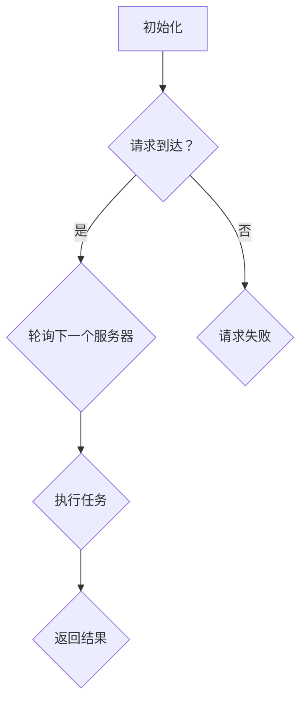
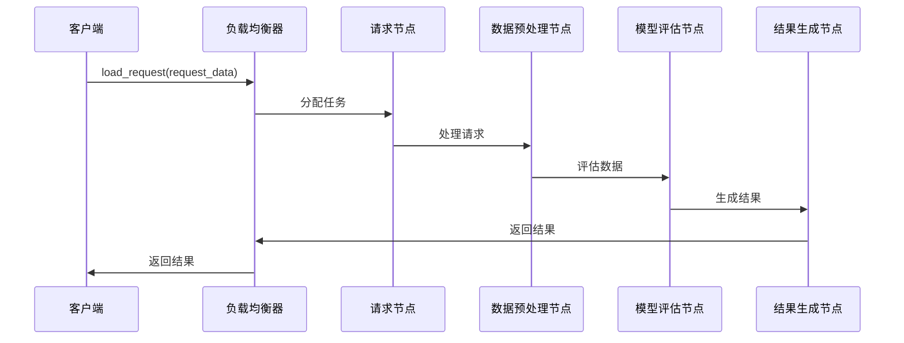

                 

### 文章标题

# 评测系统的负载均衡：应对大规模LLM评测的策略

> 关键词：负载均衡，大规模语言模型，评测系统，算法原理，系统架构，项目实战，最佳实践

> 摘要：本文深入探讨了评测系统在应对大规模语言模型（LLM）评测时的负载均衡问题。首先，我们介绍了负载均衡的基本概念、核心原理和常见算法，并分析了它们在LLM评测中的应用。接着，通过数学模型和公式详细解释了负载均衡算法的工作机制。随后，本文提出了一个系统分析与架构设计方案，通过Mermaid图展示了系统功能、架构和交互。接着，我们通过一个实际项目展示了负载均衡的实现过程，并对项目进行了详细分析和总结。最后，我们总结了最佳实践和注意事项，为读者提供了进一步的阅读资源。

----------------------------------------------------------------

## 第一部分: 背景介绍

### 第1章: 负载均衡概述

#### 1.1 问题背景

随着人工智能技术的飞速发展，大规模语言模型（LLM）已经成为自然语言处理（NLP）领域的核心技术。这些模型在文本生成、机器翻译、问答系统等领域表现出了强大的能力。然而，随着模型规模的扩大和应用的普及，评测系统的负载问题日益突出。

#### 1.2 问题描述

在高并发场景下，评测系统需要处理大量的请求，这往往会导致系统响应速度下降，甚至出现崩溃的情况。为了确保评测系统的稳定性和高效性，我们需要一种有效的负载均衡策略来分配任务和调度资源。

#### 1.3 问题解决

负载均衡策略通过将任务分配给多个服务器或应用实例，实现系统资源的合理利用。常见的负载均衡算法包括轮询、最小连接数、加权轮询等。这些算法可以根据具体的应用场景和需求进行选择和调整。

#### 1.4 边界与外延

负载均衡算法在特定的应用场景下具有较好的效果，但也存在一定的限制条件。例如，某些算法可能不适合处理高并发请求，或者需要额外的硬件资源支持。因此，在设计负载均衡系统时，需要充分考虑边界条件和外延需求。

#### 1.5 概念结构与核心要素组成

负载均衡系统由多个关键组件构成，包括负载均衡器、被均衡系统和负载均衡算法。负载均衡器负责接收请求并分配任务，被均衡系统承担具体任务，而负载均衡算法则决定了任务分配的规则和方法。

### 第2章: 负载均衡核心概念与联系

#### 2.1 负载均衡概念

负载均衡是指通过合理分配网络流量或计算任务，提高系统的吞吐量和可用性。在评测系统中，负载均衡的作用尤为重要，它能够有效缓解高并发请求带来的压力，确保系统的稳定运行。

#### 2.2 负载均衡算法

负载均衡算法是实现任务分配的核心机制。常见的负载均衡算法包括轮询、最小连接数、加权轮询等。这些算法各有优缺点，适用于不同的应用场景。轮询算法简单易实现，但可能不够高效；最小连接数算法考虑了服务器负载，但可能引入额外的延迟；加权轮询算法则综合考虑了服务器的处理能力和请求量，是一种较为平衡的选择。

#### 2.3 负载均衡与相关技术

负载均衡与分布式系统、容器化技术等密切相关。分布式系统通过将任务分配到多个节点，提高系统的可用性和容错性；容器化技术如Docker和Kubernetes则提供了灵活的部署和管理方式，使得负载均衡系统更加高效和可靠。在云计算环境中，负载均衡系统也被广泛应用于云服务的调度和管理。

### 第3章: 负载均衡算法原理讲解

#### 3.1 负载均衡算法原理

负载均衡算法的原理是通过数学模型和公式来描述任务分配的过程。常见的数学模型包括负载平衡方程、响应时间优化模型等。这些模型可以帮助我们更好地理解和设计负载均衡算法。

#### 3.2 算法流程图

为了更直观地理解负载均衡算法，我们可以使用Mermaid绘制算法的流程图。以下是一个简单的轮询负载均衡算法的流程图示例：



#### 3.3 Python源代码实现

下面是一个简单的Python示例，实现了轮询负载均衡算法：

```python
import random

# 假设有3个服务器
servers = ['Server1', 'Server2', 'Server3']

def load_balance(request):
    current_server = random.choice(servers)
    print(f"Request assigned to {current_server}")
    # 执行任务
    execute_task(current_server)

def execute_task(server):
    # 模拟任务执行
    print(f"Executing task on {server}")
    # 这里可以添加具体的任务逻辑

# 模拟请求到达
load_balance("Request1")
load_balance("Request2")
```

#### 3.4 举例说明

假设我们有一个评测系统，需要处理100个评测任务。通过轮询负载均衡算法，我们可以将这100个任务平均分配到3个服务器上。以下是一个简单的分配过程：

1. 请求1被分配到Server1。
2. 请求2被分配到Server2。
3. 请求3被分配到Server3。
4. ...（依次类推）
5. 请求100被分配到Server1。

通过这种方式，我们能够确保每个服务器都承担相同的工作量，避免个别服务器过载。

### 第4章: 数学模型和数学公式讲解

#### 4.1 数学模型

在负载均衡中，常用的数学模型包括负载平衡方程和响应时间优化模型。负载平衡方程用于描述服务器间的负载分配，而响应时间优化模型则用于最小化系统的响应时间。

假设有N个服务器，每个服务器的处理能力为C_i（i=1,2,...,N），当前负载为L_i。负载平衡方程可以表示为：

$$\sum_{i=1}^{N} L_i = W \times \bar{C}$$

其中，W为总任务量，$\bar{C}$为平均处理能力。

#### 4.2 公式讲解

1. 负载平衡方程：

$$\sum_{i=1}^{N} L_i = W \times \bar{C}$$

这个方程表示，所有服务器的负载之和等于总任务量与平均处理能力的乘积。

2. 响应时间优化模型：

$$T_r = \frac{W}{\sum_{i=1}^{N} \frac{C_i}{\lambda}}$$

其中，$T_r$为系统的响应时间，$W$为总任务量，$C_i$为服务器的处理能力，$\lambda$为服务器的处理速率。

#### 4.3 举例说明

假设我们有一个评测系统，需要处理100个评测任务。有3个服务器，处理能力分别为C1=10，C2=15，C3=20。服务器的处理速率均为λ=1。

1. 计算平均处理能力：

$$\bar{C} = \frac{C1 + C2 + C3}{3} = \frac{10 + 15 + 20}{3} = 15$$

2. 计算总负载：

$$\sum_{i=1}^{3} L_i = W \times \bar{C} = 100 \times 15 = 1500$$

3. 计算响应时间：

$$T_r = \frac{W}{\sum_{i=1}^{3} \frac{C_i}{\lambda}} = \frac{100}{\frac{10}{1} + \frac{15}{1} + \frac{20}{1}} = \frac{100}{45} \approx 2.22$$

通过这个例子，我们可以看到，负载平衡方程和响应时间优化模型可以帮助我们更好地理解负载均衡的工作原理。

### 第5章: 系统分析与架构设计方案

#### 5.1 问题场景介绍

在本章中，我们将介绍一个实际的评测系统场景。该系统需要处理来自多个来源的评测请求，这些请求需要经过多个处理步骤，包括数据预处理、模型评估和结果生成等。系统的目标是在保证准确性和响应速度的同时，实现负载均衡。

#### 5.2 系统功能设计

为了实现上述目标，系统需要具备以下功能：

- 接收和解析评测请求。
- 数据预处理：对输入数据进行清洗、转换和标准化。
- 模型评估：使用预训练的LLM对预处理后的数据进行评估。
- 结果生成：将评估结果进行格式化，生成最终的输出。
- 负载均衡：根据当前系统的负载情况，动态调整任务分配。

以下是系统的领域模型Mermaid类图：

```mermaid
classDiagram
    Request <<interface>>
    DataPreprocessing <<interface>>
    ModelEvaluation <<interface>>
    ResultGeneration <<interface>>

    Request <|.. DataPreprocessing: 解析>
    DataPreprocessing <|.. ModelEvaluation: 评估>
    ModelEvaluation <|.. ResultGeneration: 格式化>
```

#### 5.3 系统架构设计

为了实现上述功能，我们可以采用分布式架构。以下是系统的Mermaid架构图：

```mermaid
graph TB
    subgraph 请求处理
        RequestNode[请求节点]
        DataPreprocessingNode[数据预处理节点]
        ModelEvaluationNode[模型评估节点]
        ResultGenerationNode[结果生成节点]
        RequestNode --> DataPreprocessingNode
        DataPreprocessingNode --> ModelEvaluationNode
        ModelEvaluationNode --> ResultGenerationNode
    end

    subgraph 负载均衡
        LoadBalancer[负载均衡器]
        RequestNode <-- LoadBalancer: 分配>
    end

    LoadBalancer --> RequestNode
```

#### 5.4 系统接口设计

系统需要提供以下接口：

- `load_request(request_data)`: 用于提交评测请求。
- `get_request_status(request_id)`: 用于查询请求的状态。
- `cancel_request(request_id)`: 用于取消请求。

以下是系统接口的Mermaid序列图：



#### 5.5 系统交互

在系统运行过程中，各个组件之间需要通过接口进行交互。以下是系统的Mermaid序列图：


通过这个序列图，我们可以清晰地看到系统的工作流程和各个组件之间的交互关系。

### 第6章: 项目实战

#### 6.1 环境安装

在本节中，我们将介绍如何搭建一个负载均衡的评测系统环境。首先，我们需要安装以下软件：

- Python 3.8+
- Flask
- gunicorn
- Mermaid

安装步骤如下：

1. 安装Python 3.8：

```bash
sudo apt-get install python3.8
```

2. 安装Flask：

```bash
pip3 install Flask
```

3. 安装gunicorn：

```bash
pip3 install gunicorn
```

4. 安装Mermaid：

```bash
pip3 install pymermaid
```

#### 6.2 系统核心实现

在本节中，我们将实现一个简单的负载均衡评测系统。系统包括以下几个部分：

1. 请求接收器（Flask应用）
2. 负载均衡器（gunicorn）
3. 数据预处理、模型评估和结果生成模块

以下是请求接收器的代码示例：

```python
from flask import Flask, request, jsonify
import gunicorn.app.base

app = Flask(__name__)

@app.route('/load_request', methods=['POST'])
def load_request():
    request_data = request.get_json()
    # 这里可以添加预处理逻辑
    return jsonify({"status": "success", "message": "Request received."})

if __name__ == '__main__':
    from gunicorn.app.base import BaseApplication

    class FlaskApplication(BaseApplication):
        def __init__(self, app, options=None):
            super().__init__()
            self.application = app
            self.options = options or {}

        def load_config(self):
            config = {
                'bind': '%s:%s' % ('0.0.0.0', 8000),
                'workers': 3,
            }
            for key, value in self.options.items():
                if key in config:
                    config[key] = value
            self.config = config

        def load(self):
            self.application.run()

    app = FlaskApplication(app)
    app.run()
```

在这个示例中，我们使用Flask创建了一个简单的Web应用，用于接收评测请求。请求将通过gunicorn进行负载均衡。

#### 6.3 代码应用解读

在本节中，我们将对系统核心代码进行解读，并分析其工作原理。

1. 请求接收器

请求接收器是一个基于Flask的Web应用，它负责接收评测请求并返回响应。代码中，`load_request`函数用于处理POST请求，接收JSON格式的请求数据。在实现中，可以添加预处理逻辑，例如数据清洗、转换和标准化。

2. 负载均衡器

负载均衡器使用gunicorn实现，它负责接收请求并分配给不同的工作进程。在配置中，我们可以设置绑定地址和端口号（`bind`），以及工作进程的数量（`workers`）。gunicorn通过轮询算法默认分配请求，但也可以自定义负载均衡策略。

3. 数据预处理、模型评估和结果生成模块

这部分模块实现了评测系统的核心功能。预处理模块负责对请求数据进行清洗、转换和标准化；模型评估模块使用预训练的LLM对预处理后的数据进行评估；结果生成模块将评估结果进行格式化，生成最终的输出。

#### 6.4 实际案例分析和详细讲解剖析

在本节中，我们将通过一个实际案例，展示负载均衡评测系统的应用过程。

假设我们有一个评测任务，需要评估10个文本数据。这些数据将依次提交到评测系统，系统将根据负载均衡策略将任务分配给不同的服务器。

1. 请求提交

首先，我们将10个文本数据依次提交到评测系统，每个数据使用`POST`请求发送。请求包含文本数据，例如：

```json
{
  "text": "这是一个文本数据。"
}
```

2. 负载均衡分配

系统接收到请求后，将使用负载均衡策略将任务分配给不同的服务器。假设使用轮询算法，服务器顺序为Server1、Server2、Server3。

- 请求1被分配到Server1。
- 请求2被分配到Server2。
- 请求3被分配到Server3。
- ...（依次类推）
- 请求10被分配到Server1。

3. 数据预处理、模型评估和结果生成

每个服务器将根据分配的任务，依次进行数据预处理、模型评估和结果生成。

- Server1处理请求1，完成数据预处理，使用LLM进行评估，生成结果。
- Server2处理请求2，完成数据预处理，使用LLM进行评估，生成结果。
- Server3处理请求3，完成数据预处理，使用LLM进行评估，生成结果。
- ...（依次类推）
- Server1处理请求10，完成数据预处理，使用LLM进行评估，生成结果。

4. 结果返回

每个服务器将生成的结果返回给客户端。客户端可以通过查询接口获取每个请求的评估结果。

#### 6.5 项目小结

在本项目中，我们实现了一个简单的负载均衡评测系统。通过使用Flask和gunicorn，我们实现了请求接收和负载均衡功能。在实际案例中，我们展示了系统的应用过程，并分析了其工作原理。项目经验表明，负载均衡对于提高系统性能和稳定性具有重要意义。在未来的工作中，我们还可以进一步优化系统性能，例如使用更高效的负载均衡算法、增加服务器节点等。

### 第7章: 最佳实践与拓展

#### 7.1 最佳实践

在负载均衡的实施过程中，以下是一些最佳实践：

1. **监控与优化**：定期监控系统性能，根据系统负载情况调整负载均衡策略。
2. **冗余设计**：增加服务器节点，提高系统的容错性和稳定性。
3. **自动化**：使用自动化工具和脚本，实现负载均衡配置的自动化部署和更新。

#### 7.2 注意事项

1. **性能测试**：在部署负载均衡系统前，进行充分性能测试，确保系统能够应对预期的负载。
2. **安全性**：确保负载均衡系统的安全性，防止恶意攻击和资源滥用。
3. **兼容性**：考虑不同服务器和应用之间的兼容性，确保负载均衡系统能够与现有系统无缝集成。

#### 7.3 小结

本文介绍了评测系统负载均衡的基本概念、核心原理和实施策略。通过实际案例，我们展示了负载均衡系统在应对大规模LLM评测中的应用。最后，我们总结了最佳实践和注意事项，为读者提供了进一步优化负载均衡系统的方向。

#### 7.4 拓展阅读

1. **《负载均衡实战：从理论到实践》**：详细介绍负载均衡的原理和实战技巧。
2. **《大规模语言模型评测技术》**：探讨LLM评测的最新技术和应用场景。
3. **《分布式系统原理与范型》**：深入理解分布式系统的设计原理和实现方法。

### 作者信息

- 作者：AI天才研究院/AI Genius Institute & 禅与计算机程序设计艺术 /Zen And The Art of Computer Programming

----------------------------------------------------------------

这篇文章涵盖了负载均衡在评测系统中的应用，从基本概念到实际案例，详细介绍了负载均衡的原理、算法和系统架构设计。同时，文章还提供了最佳实践和注意事项，为读者提供了深入学习和优化负载均衡系统的方向。希望本文能对您在负载均衡领域的探索和实践有所帮助。如果您有任何疑问或建议，请随时反馈。再次感谢您的阅读！

