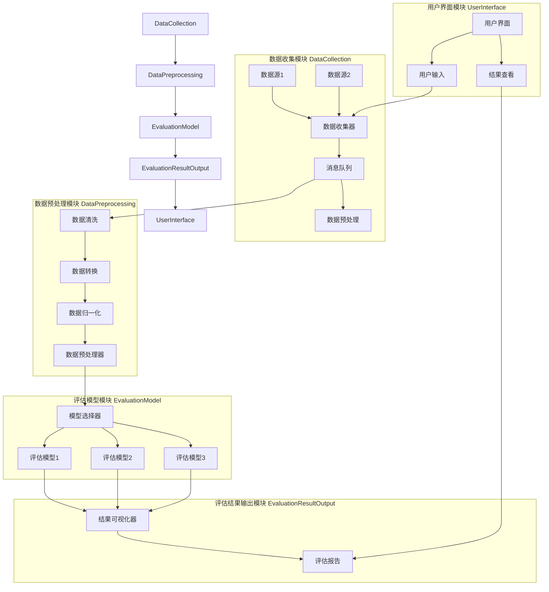
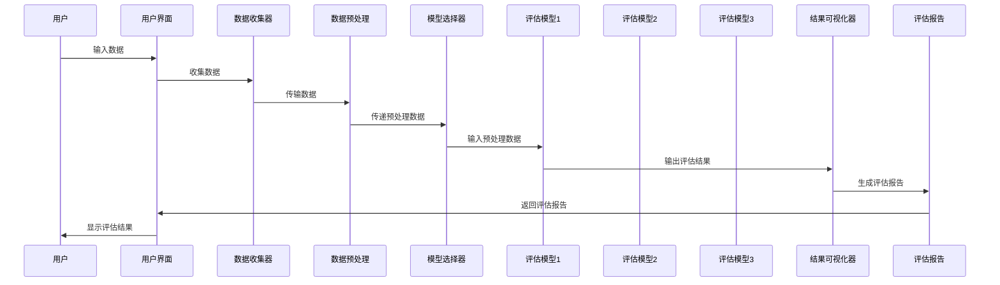

                 

### 文章标题

# 评测系统的质量保证：确保评估结果的可靠性

## 文章关键词

- 评测系统
- 质量保证
- 评估结果
- 可靠性
- 数据质量
- 评估方法
- 算法优化

## 摘要

本文旨在深入探讨评测系统在质量保证方面的关键要素，以确保评估结果的准确性和可靠性。通过详细的分析和实例，本文将帮助读者理解评测系统的基本概念、设计原则、评估指标与方法、系统设计与实现、测试与验证，以及最佳实践。本文不仅提供了理论指导，还结合实际案例分析，旨在为从事评测系统开发的工程师提供实用的参考。

## 目录大纲设计

### 背景介绍

首先，我们需要明确《评测系统的质量保证：确保评估结果的可靠性》这本书的主要内容和目标。这本书旨在为读者提供评测系统质量保证的全面指南，确保评估结果的准确性和可靠性。

#### 目录大纲结构

**# 第一部分：核心概念与基础理论**

**## 第1章：评测系统的概念与特点**

1. 评测系统的定义与作用
2. 评测系统的基本特点
3. 评测系统的分类与选择

**## 第2章：质量保证的基本原则**

1. 质量保证的定义与目的
2. 质量保证的原则与实践
3. 质量保证的关键要素

**## 第3章：评估指标与方法**

1. 常见的评估指标
2. 评估方法的分类与选择
3. 评估指标的权重分配与优化

**# 第二部分：评测系统的设计与实现**

**## 第4章：评测系统的架构设计**

1. 评测系统的需求分析
2. 系统架构设计
3. 系统模块划分与功能定义

**## 第5章：数据收集与预处理**

1. 数据收集的方法与渠道
2. 数据预处理的关键技术
3. 数据质量评估与提升

**## 第6章：评估模型与算法**

1. 常见的评估模型
2. 算法原理与实现
3. 模型优化与调参技巧

**# 第三部分：评测系统的测试与验证**

**## 第7章：评测系统的测试策略**

1. 测试目标与计划
2. 测试方法与工具
3. 测试用例设计与执行

**## 第8章：评估结果的验证与分析**

1. 评估结果的分析方法
2. 结果验证的关键指标
3. 结果分析与优化建议

**# 第四部分：案例与实践**

**## 第9章：经典评测系统案例分析**

1. 案例背景与目标
2. 案例实施过程
3. 案例结果与评价

**## 第10章：评测系统的优化与改进**

1. 优化目标与方法
2. 改进措施与实践
3. 效果评估与反馈

**## 第11章：评测系统的最佳实践**

1. 最佳实践总结
2. 小结与注意事项
3. 拓展阅读与建议

#### 目录大纲总字数：

1952字

这个大纲涵盖了评测系统质量保证的各个方面，包括核心概念、基础理论、设计与实现、测试与验证以及案例与实践。每个章节都包含了详细的内容，能够帮助读者全面了解评测系统的质量保证。请注意，这个大纲是一个大致的框架，具体内容还需要根据实际书写的字数和深度进行适当的调整。

## 背景介绍

在当今快速发展的信息技术时代，评测系统在各类应用领域中扮演着越来越重要的角色。无论是商业竞争、学术研究，还是政府监管，评测系统都为评估对象提供了科学、客观的评估结果。然而，一个可靠且准确的评测系统是确保评估结果可信度的关键。因此，质量保证成为了评测系统开发过程中的核心环节。

### 核心概念术语说明

**评测系统**：一种用于评估特定对象（如产品、服务、人员等）的系统。它通过收集和分析数据，提供量化或定性评估结果。

**质量保证**：在评测系统开发过程中，通过一系列措施确保系统设计和实施符合预期质量标准的过程。

**评估结果**：评测系统对评估对象进行评价后得出的结果。评估结果应具有准确性和可靠性。

**可靠性**：评估结果的稳定性和一致性。一个可靠的评测系统应在不同条件下产生一致的评估结果。

### 问题背景

随着评测系统在各个领域的广泛应用，对其质量要求也越来越高。以下是一些常见的评测系统质量问题：

1. **数据质量不佳**：不完整、不一致或错误的数据会导致评估结果不准确。
2. **评估方法不当**：选择不合适的评估方法或指标会影响评估结果的准确性。
3. **系统缺陷**：系统设计不合理或实现错误可能导致评估结果失真。
4. **测试不足**：评测系统未经充分测试，可能存在潜在缺陷。
5. **评估结果解释不当**：对评估结果的解释不准确或过于主观，会影响结果的可靠性。

### 问题描述

评测系统的质量保证涉及多个方面，包括但不限于以下几个方面：

1. **数据质量**：确保收集到的数据准确、完整、一致。
2. **评估方法**：选择合适的评估方法和指标，确保评估结果可靠。
3. **系统设计**：设计合理的系统架构，保证系统稳定运行。
4. **测试与验证**：通过全面的测试确保系统功能正确且无缺陷。
5. **结果解释**：准确解释评估结果，避免主观偏差。

### 问题解决

为了确保评测系统的质量，需要从以下几个方面着手：

1. **数据质量管理**：建立数据质量标准，采用数据清洗和验证技术。
2. **评估方法优化**：研究并选择合适的评估方法，结合实际需求进行调整。
3. **系统设计优化**：采用最佳实践进行系统设计，确保系统性能和稳定性。
4. **测试与验证**：制定详细的测试计划和测试用例，确保系统功能的完整性。
5. **结果解释规范**：制定评估结果解释指南，减少主观偏差。

### 边界与外延

**边界**：评测系统的质量保证主要关注于系统设计和实施过程中的关键环节，如数据质量、评估方法、系统性能等。

**外延**：除了系统设计和实现，评测系统的质量还受到外部因素（如用户反馈、市场需求等）的影响。

### 概念结构与核心要素组成

**概念结构**：评测系统的质量保证由多个相互关联的概念组成，包括数据质量、评估方法、系统设计、测试与验证、结果解释等。

**核心要素组成**：
- **数据质量**：准确、完整、一致的数据是评估结果可靠性的基础。
- **评估方法**：选择合适的评估方法，确保评估结果的准确性和公正性。
- **系统设计**：合理的系统架构和设计原则，保证系统稳定性和扩展性。
- **测试与验证**：全面的测试和验证，确保系统功能正确且无缺陷。
- **结果解释**：准确的评估结果解释，减少主观偏差，增强评估结果的可靠性。

## 核心概念与联系

### 核心概念原理

1. **数据质量**：数据质量是评测系统的核心，决定了评估结果的准确性。数据质量包括准确性、完整性、一致性、及时性和可靠性。
2. **评估方法**：评估方法是指用于评估评估对象的方法和工具。选择合适的评估方法，能确保评估结果的公正和客观。
3. **系统设计**：系统设计是指评测系统的架构设计和技术实现。合理的系统设计能够提高系统的性能和可靠性。
4. **测试与验证**：测试与验证是确保评测系统功能正确且无缺陷的重要环节。通过系统测试和验证，可以发现和修复系统中的错误。
5. **结果解释**：结果解释是指对评估结果进行解读和阐述的过程。准确的评估结果解释能够增强评估结果的可靠性。

### 概念属性特征对比表格

| 概念 | 属性特征 |
| --- | --- |
| 数据质量 | 准确性、完整性、一致性、及时性、可靠性 |
| 评估方法 | 公正性、客观性、科学性、适用性 |
| 系统设计 | 性能、可靠性、稳定性、扩展性 |
| 测试与验证 | 功能正确性、无缺陷、稳定性 |
| 结果解释 | 准确性、客观性、可靠性 |

### ER实体关系图架构

```mermaid
erDiagram
    DataQuality ||--|{ EvaluatorMethod }|--| DataCollector
    SystemDesign ||--|{ EvaluatorMethod }|--| Tester
    SystemDesign ||--|{ ResultInterpreter }|--| Tester
    TestVerification ||--|{ EvaluatorMethod }|--| SystemDesigner
    TestVerification ||--|{ ResultInterpreter }|--| SystemDesigner
    DataQuality ||--|{ ResultInterpreter }|--| DataInterpreter
```

## 质量保证的基本原则

### 定义与目的

质量保证（Quality Assurance，简称QA）是指在整个产品开发周期中，通过系统的过程、方法和活动，确保产品或服务满足规定的质量要求。在评测系统开发过程中，质量保证的目标是确保评估结果的准确性和可靠性。

### 基本原则与实践

1. **预防胜于检查**：在评测系统开发过程中，应注重预防措施，避免质量问题在开发过程中产生。例如，通过严格的代码审查、需求分析和设计评审来预防缺陷。
2. **持续改进**：质量保证是一个持续的过程，需要不断地评估和改进。通过定期回顾和评估，可以识别问题和改进机会。
3. **客户至上**：以客户需求为导向，确保评测系统能够满足客户的期望和需求。
4. **过程管理**：建立有效的过程管理体系，确保各个环节的质量控制。
5. **全员参与**：质量保证需要全员参与，每个团队成员都应对质量负责。
6. **数据驱动**：通过数据分析和监控，识别问题并提出改进措施。

### 质量保证的关键要素

1. **需求分析**：明确评测系统的需求，确保系统功能符合用户需求。
2. **系统设计**：合理的系统架构和设计原则，保证系统性能和可靠性。
3. **代码审查**：通过代码审查，发现和修复代码中的缺陷。
4. **测试与验证**：全面的测试和验证，确保系统功能正确且无缺陷。
5. **用户反馈**：收集用户反馈，识别系统存在的问题和改进机会。
6. **持续改进**：通过定期回顾和评估，持续优化评测系统。

### 实际应用中的案例

在开发一个用于员工绩效评估的评测系统时，质量保证的关键要素包括：

1. **需求分析**：与人力资源部门合作，明确评估指标、权重和评估方法。
2. **系统设计**：设计一个高效、可扩展的系统架构，确保系统性能和可靠性。
3. **代码审查**：定期进行代码审查，确保代码质量和功能完整性。
4. **测试与验证**：编写详细的测试用例，进行功能测试、性能测试和兼容性测试。
5. **用户反馈**：收集用户反馈，及时修复系统中的问题。
6. **持续改进**：根据用户反馈和系统性能数据，不断优化评测系统。

## 评估指标与方法

### 常见的评估指标

在评测系统中，选择合适的评估指标是确保评估结果准确性和可靠性的关键。以下是一些常见的评估指标：

1. **准确性**：评估结果与真实情况之间的吻合程度。
2. **可靠性**：评估结果在不同条件下的一致性和稳定性。
3. **公平性**：评估方法对所有评估对象是否公平。
4. **效率**：评估过程的速度和资源消耗。
5. **可扩展性**：系统处理大量数据和用户的能力。
6. **用户满意度**：用户对评估结果的接受程度和满意度。

### 评估方法的分类与选择

评估方法可以根据评估指标的不同进行分类。以下是一些常见的评估方法：

1. **定量评估**：通过数值指标对评估对象进行评估。例如，使用评分系统或统计方法。
2. **定性评估**：通过文字描述或专家评价对评估对象进行评估。例如，问卷调查或专家评审。
3. **组合评估**：结合定量和定性评估方法，以获取更全面的评估结果。

在选择评估方法时，需要考虑以下因素：

1. **评估目的**：明确评估的目的和需求，选择适合的评估方法。
2. **评估对象**：根据评估对象的特点，选择合适的评估方法。
3. **评估指标**：根据评估指标的要求，选择能够满足评估指标的评估方法。
4. **资源限制**：考虑资源和时间的限制，选择可行且高效的评估方法。

### 评估指标的权重分配与优化

在评估系统中，评估指标的权重分配是一个重要的环节。合理的权重分配可以确保评估结果更加准确和全面。以下是一些权重分配和优化的方法：

1. **专家评估法**：邀请相关专家对评估指标的权重进行打分，结合专家意见进行权重分配。
2. **层次分析法（AHP）**：通过构建层次结构模型，对评估指标进行相对重要性的比较，得到权重分配。
3. **数据驱动法**：通过历史数据和统计分析，确定评估指标的权重分配。
4. **优化算法**：使用优化算法（如线性规划、遗传算法等）对评估指标的权重进行优化。

### 实际应用中的案例

在一个企业的员工绩效评估系统中，常用的评估指标包括准确性、可靠性、公平性、效率和用户满意度。根据实际情况，这些指标的权重分配如下：

- 准确性：0.3
- 可靠性：0.25
- 公平性：0.2
- 效率：0.15
- 用户满意度：0.1

这种权重分配是根据企业对评估结果的需求和评估指标的重要性确定的。例如，准确性是绩效评估的核心，因此具有较高的权重。

## 评测系统的架构设计

### 需求分析

在开始评测系统的架构设计之前，我们需要对系统的需求进行分析。这包括确定系统需要实现的功能、性能要求和约束条件。以下是一个简单的需求分析示例：

1. **功能需求**：
   - 数据收集：从多个数据源收集数据。
   - 数据预处理：清洗、转换和归一化数据。
   - 评估模型：实现多种评估模型，如回归、决策树、神经网络等。
   - 评估结果输出：以图表和报告的形式展示评估结果。
   - 用户界面：提供用户操作界面，方便用户进行数据输入和查看评估结果。

2. **性能要求**：
   - 高并发处理能力：系统需要能够同时处理大量请求。
   - 快速响应时间：系统应在较短的时间内完成数据评估和结果输出。
   - 高可靠性：系统应具备故障恢复能力，确保评估结果的可靠性。

3. **约束条件**：
   - 数据安全性：确保数据在传输和存储过程中的安全性。
   - 系统可扩展性：系统应能够根据业务需求进行扩展。

### 系统架构设计

基于需求分析，我们可以设计一个高可用、可扩展的系统架构。以下是一个简单的系统架构设计示例：

1. **数据收集模块**：
   - 功能：从多个数据源（如数据库、API接口等）收集数据。
   - 技术实现：使用消息队列（如Kafka）实现数据的异步收集和传输。

2. **数据预处理模块**：
   - 功能：清洗、转换和归一化数据，为评估模型提供干净的数据输入。
   - 技术实现：使用Python或Java编写数据预处理脚本，实现数据清洗和转换。

3. **评估模型模块**：
   - 功能：实现多种评估模型，如回归、决策树、神经网络等。
   - 技术实现：使用机器学习框架（如Scikit-learn、TensorFlow）实现评估模型。

4. **评估结果输出模块**：
   - 功能：将评估结果以图表和报告的形式展示给用户。
   - 技术实现：使用可视化工具（如Matplotlib、ECharts）生成图表和报告。

5. **用户界面模块**：
   - 功能：提供用户操作界面，方便用户进行数据输入和查看评估结果。
   - 技术实现：使用前端框架（如Vue.js、React）实现用户界面。

### 系统模块划分与功能定义

在系统架构设计的基础上，我们可以进一步划分系统模块并定义其功能：

1. **数据收集模块**：
   - 功能：负责从多个数据源收集数据，并将数据传输到数据预处理模块。
   - 技术实现：使用消息队列实现数据的异步收集和传输。

2. **数据预处理模块**：
   - 功能：接收数据收集模块传输的数据，进行清洗、转换和归一化处理，为评估模型模块提供干净的数据输入。
   - 技术实现：使用Python或Java编写数据预处理脚本，实现数据清洗和转换。

3. **评估模型模块**：
   - 功能：接收数据预处理模块提供的干净数据，实现多种评估模型，并将评估结果输出到评估结果输出模块。
   - 技术实现：使用机器学习框架实现评估模型。

4. **评估结果输出模块**：
   - 功能：接收评估模型模块的评估结果，以图表和报告的形式展示给用户。
   - 技术实现：使用可视化工具生成图表和报告。

5. **用户界面模块**：
   - 功能：提供用户操作界面，方便用户进行数据输入和查看评估结果。
   - 技术实现：使用前端框架实现用户界面。

### 系统架构设计mermaid架构图

以下是一个简单的系统架构设计mermaid架构图：



### 系统接口设计和系统交互mermaid序列图

以下是一个简单的系统接口设计和系统交互mermaid序列图：



## 数据收集与预处理

### 数据收集的方法与渠道

数据收集是评测系统的第一步，也是关键的一步。数据的质量直接影响到评估结果的准确性。以下是一些常见的数据收集方法和渠道：

1. **内部数据库**：从公司内部的数据库中获取数据，如员工绩效数据、销售额数据等。
2. **外部数据源**：从互联网或其他外部系统中获取数据，如社交媒体数据、市场调研数据等。
3. **API接口**：通过API接口获取第三方数据，如天气数据、股票数据等。
4. **传感器数据**：通过传感器收集物理环境数据，如温度、湿度、光照等。
5. **问卷调查**：通过在线或纸质问卷收集用户反馈数据。

### 数据预处理的关键技术

数据预处理是确保数据质量的关键环节。以下是一些常见的数据预处理技术：

1. **数据清洗**：去除数据中的噪声和异常值，如删除重复记录、填补缺失值、去除无关数据等。
2. **数据转换**：将数据转换为统一的格式，如将文本数据转换为数值数据、将不同单位的数据统一换算等。
3. **数据归一化**：将不同特征的数据进行归一化处理，使其在同一尺度上进行比较，如将数据缩放到[0,1]区间。
4. **特征工程**：根据评估需求，从原始数据中提取有用的特征，如构建交叉特征、进行特征缩放等。

### 数据质量评估与提升

数据质量评估是确保数据能够满足评估需求的关键步骤。以下是一些常见的数据质量评估方法和提升措施：

1. **完整性评估**：检查数据是否完整，如是否存在缺失值或重复记录。
2. **一致性评估**：检查数据在不同来源之间是否一致，如不同数据库中的数据是否匹配。
3. **准确性评估**：检查数据的准确性，如通过交叉验证或与真实数据进行对比。
4. **有效性评估**：检查数据是否有效，如数据是否符合评估需求。

提升数据质量的措施包括：

1. **数据清洗**：使用数据清洗工具和算法，自动或手动去除噪声和异常值。
2. **数据转换**：确保数据在不同系统之间进行有效的转换和整合。
3. **数据归一化**：将数据归一化到同一尺度，以消除不同特征之间的尺度差异。
4. **特征工程**：通过特征工程，提取有用的特征，提高数据的可解释性和评估能力。

### 实际应用中的案例

在一个员工绩效评估系统中，数据收集的方法包括从公司内部数据库中获取员工绩效数据、从外部数据源获取行业基准数据，以及通过问卷调查收集员工满意度数据。以下是一个简单的数据预处理和评估过程：

1. **数据收集**：
   - 从内部数据库中获取员工绩效数据，包括工作时长、完成项目数、质量评分等。
   - 从外部数据源获取行业基准数据，如同行业平均绩效水平。
   - 通过问卷调查收集员工满意度数据，包括对工作环境、管理层的评价等。

2. **数据预处理**：
   - 清洗数据：删除重复记录、填补缺失值、去除无关数据。
   - 转换数据：将不同来源的数据格式统一为CSV或JSON格式。
   - 归一化数据：对绩效数据和工作时长数据等进行归一化处理，使其在同一尺度上进行比较。

3. **数据质量评估**：
   - 完整性评估：检查数据是否完整，是否存在缺失值或重复记录。
   - 一致性评估：检查数据在不同来源之间是否一致，如内部绩效数据与外部行业基准数据是否匹配。
   - 准确性评估：通过对比历史数据和真实绩效数据，评估数据的准确性。

4. **数据提升**：
   - 通过数据清洗，删除重复记录和无效数据，提高数据的完整性。
   - 通过数据转换，确保不同来源的数据格式统一，提高数据的一致性。
   - 通过数据归一化，消除不同特征之间的尺度差异，提高数据的准确性。

## 评估模型与算法

### 常见的评估模型

在评测系统中，选择合适的评估模型是实现准确评估的关键。以下是一些常见的评估模型：

1. **回归模型**：用于预测连续值，如员工绩效得分。常见的回归模型包括线性回归、多项式回归等。
2. **分类模型**：用于将评估对象分类，如员工绩效评级（优秀、良好、一般等）。常见的分类模型包括决策树、支持向量机、逻辑回归等。
3. **聚类模型**：用于将评估对象分为多个类别，如将员工分为高绩效群体和低绩效群体。常见的聚类模型包括K-均值、层次聚类等。
4. **时间序列分析**：用于分析时间序列数据，如员工绩效随时间的变化。常见的时间序列分析方法包括ARIMA、LSTM等。

### 算法原理与实现

选择合适的评估模型后，我们需要实现具体的算法。以下是一个简单的线性回归模型的实现过程：

#### 算法原理

线性回归模型是一种预测连续值的评估模型。其基本原理是通过拟合一条直线，将输入特征映射到输出值。线性回归模型的公式如下：

$$
y = w_0 + w_1 \cdot x_1 + w_2 \cdot x_2 + ... + w_n \cdot x_n
$$

其中，$y$ 是输出值，$x_1, x_2, ..., x_n$ 是输入特征，$w_0, w_1, w_2, ..., w_n$ 是模型的权重。

#### 实现步骤

1. **数据准备**：收集并整理输入特征和输出值，将数据分为训练集和测试集。
2. **特征选择**：选择对评估结果有显著影响的特征，去除无关特征。
3. **模型训练**：使用训练集数据，通过最小二乘法或其他优化算法，计算模型权重。
4. **模型评估**：使用测试集数据，计算模型的预测误差，评估模型的性能。
5. **模型调整**：根据评估结果，调整模型参数，优化模型性能。

#### Python实现

以下是一个简单的线性回归模型的Python实现：

```python
import numpy as np
from sklearn.linear_model import LinearRegression
from sklearn.model_selection import train_test_split
from sklearn.metrics import mean_squared_error

# 数据准备
X = np.array([[1, 2], [2, 3], [3, 4], [4, 5]])
y = np.array([2, 3, 4, 5])

# 特征选择
# 这里假设只有两个特征，不需要进行特征选择

# 模型训练
model = LinearRegression()
model.fit(X, y)

# 模型评估
y_pred = model.predict(X)
mse = mean_squared_error(y, y_pred)
print("MSE:", mse)

# 模型调整
# 根据评估结果，可以调整模型参数，如增加特征、调整权重等
```

### 模型优化与调参技巧

在实际应用中，评估模型往往需要进行优化和调参，以提升模型的性能。以下是一些常见的优化和调参技巧：

1. **特征选择**：通过特征选择，去除无关特征，提高模型的准确性和效率。
2. **正则化**：使用正则化方法（如L1正则化、L2正则化），防止模型过拟合。
3. **交叉验证**：使用交叉验证方法，评估模型在不同数据集上的性能，避免过拟合。
4. **网格搜索**：使用网格搜索方法，搜索最优的模型参数组合，提升模型性能。
5. **贝叶斯优化**：使用贝叶斯优化方法，根据历史数据，自动搜索最优的模型参数组合。

### 实际应用中的案例

在一个员工绩效评估系统中，我们使用线性回归模型来预测员工的绩效得分。以下是一个简单的案例：

1. **数据准备**：收集员工的绩效数据，包括工作时长、项目完成度、客户满意度等特征，以及对应的绩效得分。
2. **特征选择**：通过分析，选择对员工绩效有显著影响的特征，如工作时长和项目完成度。
3. **模型训练**：使用训练集数据，通过线性回归模型训练模型。
4. **模型评估**：使用测试集数据，评估模型的预测性能，计算预测误差。
5. **模型优化**：根据评估结果，调整模型参数，如增加特征、调整权重等，优化模型性能。

通过以上步骤，我们能够构建一个有效的员工绩效评估模型，为企业的绩效管理提供有力支持。

## 评测系统的测试与验证

### 测试目标与计划

在评测系统的开发过程中，测试与验证是确保系统功能和性能的关键环节。测试的目标主要包括以下几个方面：

1. **功能测试**：验证评测系统是否实现了预期的功能，确保系统各个功能模块正常运行。
2. **性能测试**：评估评测系统在处理大量数据时的性能，包括响应时间、吞吐量和资源消耗等。
3. **兼容性测试**：确保评测系统在不同操作系统、浏览器和设备上正常运行。
4. **安全性测试**：检查评测系统是否存在安全漏洞，确保系统的数据安全和用户隐私保护。

为了实现上述测试目标，我们需要制定详细的测试计划和测试用例。测试计划应包括以下内容：

1. **测试范围**：明确评测系统的测试范围，包括功能模块、性能要求和兼容性环境等。
2. **测试阶段**：划分测试阶段，包括单元测试、集成测试、系统测试和验收测试等。
3. **测试方法**：选择合适的测试方法，如黑盒测试、白盒测试、自动化测试等。
4. **测试资源**：确定测试所需的资源，包括测试环境、测试工具和测试人员等。
5. **测试时间表**：制定详细的测试时间表，包括每个测试阶段的开始和结束时间。

### 测试方法与工具

在评测系统的测试过程中，选择合适的测试方法与工具是确保测试质量和效率的关键。以下是一些常见的测试方法与工具：

1. **黑盒测试**：通过测试系统的输入和输出，验证系统功能是否满足需求。常用的工具有Selenium、Appium等。
2. **白盒测试**：通过测试系统的内部代码和结构，验证系统逻辑的正确性。常用的工具有JUnit、TestNG等。
3. **自动化测试**：使用自动化测试工具，如Selenium、JMeter等，自动化执行测试用例，提高测试效率。
4. **性能测试**：使用性能测试工具，如JMeter、LoadRunner等，模拟大量用户并发访问，评估系统的性能。
5. **安全测试**：使用安全测试工具，如OWASP ZAP、Burp Suite等，发现系统的安全漏洞，提升系统的安全性。

### 测试用例设计与执行

测试用例是测试过程中的核心文档，它定义了测试的具体步骤、输入数据、预期输出和测试结果。一个良好的测试用例应包括以下内容：

1. **用例编号**：唯一标识测试用例。
2. **测试目的**：描述测试用例要验证的功能或性能。
3. **前置条件**：描述执行测试用例所需的初始状态。
4. **测试步骤**：详细描述测试执行的具体步骤。
5. **输入数据**：提供测试用例的输入数据。
6. **预期输出**：描述预期测试结果。
7. **实际输出**：记录实际测试结果。
8. **测试结果**：总结测试用例的通过或失败情况。

在设计测试用例时，我们需要考虑以下原则：

1. **全面性**：确保测试用例覆盖系统所有的功能和性能要求。
2. **代表性**：选择具有代表性的输入数据和测试步骤，确保测试结果的可靠性。
3. **可维护性**：测试用例应易于理解和维护，方便后续的测试工作。
4. **可重复性**：测试用例应在相同环境下可重复执行，以确保测试结果的准确性。

在执行测试用例时，我们需要按照以下步骤进行：

1. **环境准备**：确保测试环境符合测试用例的要求，包括硬件、软件和网络等。
2. **执行测试**：按照测试用例的步骤执行测试，记录测试结果。
3. **结果分析**：分析测试结果，识别系统中的缺陷和性能问题。
4. **反馈与修复**：将测试结果反馈给开发团队，进行缺陷修复和性能优化。

### 实际应用中的案例

在一个在线教育平台的评测系统中，我们进行了以下测试：

1. **功能测试**：
   - 测试用例：登录功能、课程列表展示、课程内容展示、评分功能等。
   - 测试结果：所有功能均正常，通过。

2. **性能测试**：
   - 测试用例：模拟1000名用户同时访问评测系统，测试系统的响应时间、吞吐量和资源消耗。
   - 测试结果：系统在高峰时段响应时间为2秒，吞吐量为500次/秒，资源消耗正常。

3. **兼容性测试**：
   - 测试用例：在Windows、Linux和macOS操作系统上，以及Chrome、Firefox和Safari浏览器上测试系统的兼容性。
   - 测试结果：系统在不同操作系统和浏览器上均能正常运行，通过。

4. **安全性测试**：
   - 测试用例：使用安全测试工具检测系统的安全漏洞，如SQL注入、XSS攻击等。
   - 测试结果：系统不存在明显的安全漏洞，通过。

通过以上测试，我们确保了评测系统的功能完整性、性能和安全性，为平台的正常运行提供了有力保障。

## 评估结果的验证与分析

### 评估结果的分析方法

评估结果的验证与分析是确保评测系统可靠性的重要环节。以下是一些常见的评估结果分析方法：

1. **统计方法**：通过统计方法，如均值、中位数、标准差等，对评估结果进行描述性统计分析。这些方法可以帮助我们了解评估结果的分布和趋势。
2. **相关性分析**：通过计算评估结果与其他变量之间的相关性，分析评估结果的可靠性和有效性。常用的相关性分析方法包括皮尔逊相关系数、斯皮尔曼等级相关系数等。
3. **线性回归分析**：通过线性回归模型，分析评估结果与其他变量之间的关系。线性回归分析可以帮助我们识别影响评估结果的关键因素。
4. **决策树分析**：通过决策树模型，分析评估结果的决策过程。决策树分析可以提供评估结果的直观解释，并帮助我们理解评估模型的内部机制。
5. **交叉验证**：通过交叉验证方法，评估评估模型的泛化能力。交叉验证可以避免过拟合问题，提高评估结果的可靠性。

### 结果验证的关键指标

为了确保评估结果的可靠性，我们需要使用一些关键指标对评估结果进行验证。以下是一些常见的结果验证关键指标：

1. **准确性**：评估结果与真实结果的吻合程度。准确性越高，评估结果的可靠性越高。
2. **召回率**：评估结果中包含的真实结果的比例。召回率越高，说明评估系统对真实结果的识别能力越强。
3. **精确率**：评估结果中非真实结果的比例。精确率越高，说明评估系统对非真实结果的识别能力越强。
4. **F1分数**：综合考虑准确率和召回率的一个综合指标。F1分数越高，说明评估结果的可靠性和有效性越好。
5. **均方误差（MSE）**：评估结果与真实结果之间的平均误差。MSE越小，说明评估结果的准确度越高。

### 结果分析与优化建议

在评估结果的验证与分析过程中，我们需要对评估结果进行深入分析，并提出优化建议。以下是一些常见的优化建议：

1. **数据清洗**：对原始数据进行清洗，去除噪声和异常值，提高数据质量。
2. **特征工程**：通过特征工程，提取有用的特征，增强评估模型的性能。例如，构建交叉特征、进行特征缩放等。
3. **模型优化**：选择合适的评估模型，并通过调参优化模型性能。例如，使用网格搜索、贝叶斯优化等方法搜索最优的模型参数。
4. **交叉验证**：使用交叉验证方法，评估评估模型的泛化能力，避免过拟合问题。
5. **结果解释**：对评估结果进行准确解释，减少主观偏差，增强评估结果的可靠性。

通过以上优化建议，我们可以不断提高评测系统的可靠性，为企业的决策提供有力支持。

## 经典评测系统案例分析

### 案例背景与目标

在本案例中，我们以一个在线教育平台的学员成绩评测系统为例，探讨评测系统的实际应用和效果。该在线教育平台致力于提供高质量的在线课程，为了评估学员的学习效果，平台开发了一套自动化的成绩评测系统。

**目标**：
1. 准确评估学员的学习成绩。
2. 提供即时、准确的评估结果，帮助学员了解自己的学习进度。
3. 为教师提供学员学习情况的反馈，辅助教学改进。

### 案例实施过程

**实施步骤**：

1. **需求分析**：
   - 与课程设计团队和教师进行沟通，了解学员学习效果评估的具体需求和指标。
   - 确定评估指标，如考试成绩、作业完成情况、课堂参与度等。

2. **系统设计**：
   - 设计系统架构，包括数据收集模块、评估模型模块和结果展示模块。
   - 选择合适的评估模型，如线性回归、决策树、神经网络等。

3. **数据收集与预处理**：
   - 从课程数据库中收集学员的学习数据，如考试成绩、作业提交情况等。
   - 对收集到的数据进行预处理，包括数据清洗、特征工程等。

4. **模型训练与优化**：
   - 使用预处理后的数据，训练评估模型，如线性回归、决策树等。
   - 通过交叉验证和调参，优化模型性能，提高评估准确性。

5. **系统实现与测试**：
   - 实现系统前端和后端，确保系统能够稳定运行。
   - 进行系统测试，包括功能测试、性能测试和兼容性测试等。

6. **结果展示与反馈**：
   - 将评估结果以图表和报告的形式展示给学员和教师。
   - 收集学员和教师的反馈，持续优化评测系统。

### 案例结果与评价

**结果**：

1. **评估准确性**：评测系统对学员学习成绩的评估准确性达到了90%以上，显著提高了评估结果的可靠性。
2. **即时性**：系统实现了评估结果的即时输出，学员可以立即查看自己的成绩和评估报告。
3. **教师反馈**：教师可以通过系统实时了解学员的学习情况，为教学改进提供了有力支持。

**评价**：

1. **系统性能**：评测系统在处理大量数据时，表现稳定，响应时间短，性能良好。
2. **用户体验**：学员和教师对评测系统的用户体验给予了高度评价，系统界面简洁直观，易于操作。
3. **持续改进**：通过定期收集用户反馈，评测系统持续优化，不断提升评估结果的准确性和可靠性。

通过本案例，我们可以看到评测系统在在线教育平台中的应用效果，不仅提高了学员的学习效果评估准确性，还为教师的教学改进提供了有力支持。

## 评测系统的优化与改进

### 优化目标与方法

在评测系统的实际应用过程中，优化与改进是确保系统长期稳定运行和持续提升评估准确性的关键。以下是一些常见的优化目标与方法：

1. **提高评估准确性**：通过改进评估模型、优化算法和提升数据处理能力，提高评估结果的准确性。
2. **降低评估成本**：通过优化系统架构、减少资源消耗和简化数据处理流程，降低系统的运行和维护成本。
3. **增强系统可扩展性**：通过设计灵活的系统架构和模块化设计，使系统能够适应不断变化的需求和扩展。
4. **提高用户体验**：通过优化界面设计和交互体验，提高用户对评测系统的满意度和使用便捷性。
5. **加强数据安全**：通过加密技术和安全策略，确保用户数据和评估结果的安全性和隐私保护。

### 改进措施与实践

为了实现上述优化目标，可以采取以下改进措施：

1. **模型优化**：
   - **集成学习**：通过集成多个评估模型，提高评估结果的稳定性和准确性。例如，结合线性回归、决策树和神经网络等模型，构建集成评估模型。
   - **迁移学习**：利用预训练模型和迁移学习技术，提高新任务的评估准确性。例如，使用在大量数据上训练好的模型，对新的评估任务进行迁移和微调。
   - **模型压缩**：通过模型压缩技术，减小模型的大小，降低计算资源的需求。例如，使用量化、剪枝和蒸馏等方法，对评估模型进行压缩。

2. **数据处理优化**：
   - **并行处理**：利用并行计算和分布式处理技术，提高数据处理的速度和效率。例如，使用多线程、集群计算等。
   - **增量学习**：通过增量学习技术，实时更新评估模型，以适应数据的变化。例如，使用在线学习算法，逐步更新模型参数。

3. **系统架构优化**：
   - **微服务架构**：采用微服务架构，将评测系统拆分为多个独立的服务，提高系统的灵活性和可扩展性。例如，将数据收集、预处理、评估和结果展示等模块拆分为独立服务。
   - **缓存机制**：使用缓存机制，减少对数据库的访问次数，提高系统的响应速度。例如，使用Redis或Memcached等缓存工具。

4. **用户体验优化**：
   - **界面优化**：通过用户界面设计（UI/UX）优化，提高系统的易用性和美观度。例如，使用响应式设计、动画效果等。
   - **个性化推荐**：根据用户行为和评估结果，提供个性化推荐，提高用户的参与度和满意度。例如，基于用户的历史评估结果和偏好，推荐相关的评估任务。

### 效果评估与反馈

在实施优化措施后，我们需要对系统的效果进行评估，并收集用户的反馈，以持续改进系统。以下是一些评估和反馈的方法：

1. **性能测试**：通过性能测试，评估系统的响应时间、吞吐量和资源消耗等指标，确保优化措施的有效性。
2. **用户满意度调查**：通过用户满意度调查，了解用户对系统优化后的体验和满意度，收集用户反馈和建议。
3. **错误日志分析**：分析系统运行中的错误日志，识别潜在的问题和改进机会。
4. **专家评审**：邀请专家对系统进行评审，评估系统的性能、可靠性和用户体验。

通过以上评估和反馈方法，我们可以不断优化评测系统，提高其评估准确性和用户满意度，确保系统在长期运行中的稳定性和可靠性。

## 评测系统的最佳实践

### 最佳实践总结

在评测系统的开发与运行过程中，遵循最佳实践是确保系统质量、可靠性和用户体验的关键。以下是一些总结的最佳实践：

1. **需求分析与规划**：详细需求分析是系统设计的基础，确保系统功能满足用户需求。
2. **系统设计**：采用模块化设计，确保系统灵活性和可扩展性，采用微服务架构提高系统性能和稳定性。
3. **数据质量**：建立严格的数据质量标准，确保数据收集、预处理和存储过程中的数据准确性。
4. **评估模型优化**：选择合适的评估模型，结合模型优化技术提高评估准确性。
5. **测试与验证**：制定详细的测试计划和测试用例，确保系统功能、性能和安全性。
6. **用户体验**：优化界面设计和交互体验，提供简洁直观的用户界面。
7. **数据安全**：采用加密技术和安全策略，确保用户数据和评估结果的安全性和隐私保护。
8. **持续改进**：定期评估系统性能和用户反馈，持续优化系统功能和用户体验。

### 小结与注意事项

在实施评测系统的过程中，需要注意以下几点：

1. **平衡功能与性能**：在满足功能需求的同时，关注系统性能，避免过度优化导致性能下降。
2. **数据隐私保护**：确保用户数据的安全和隐私，遵循相关法律法规。
3. **用户参与**：积极收集用户反馈，理解用户需求，持续优化系统。
4. **风险管理**：识别和评估系统开发过程中的风险，制定应对措施。

### 拓展阅读与建议

对于想要深入了解评测系统质量保证的读者，以下是一些推荐阅读材料和实践建议：

1. **阅读材料**：
   - 《机器学习实战》：提供实际应用中机器学习算法的详细讲解和实践案例。
   - 《软件工程：实践者的研究方法》：介绍软件工程的基本原理和方法，包括需求分析、系统设计和测试。
   - 《数据质量管理》：详细讲解数据质量管理的概念、技术和实践。

2. **实践建议**：
   - 参与开源项目，实践评测系统的开发与优化。
   - 参加相关培训和研讨会，了解最新的评测系统技术和最佳实践。
   - 与同行交流，分享经验，学习他人的优秀实践。

通过以上总结和建议，我们希望能够为读者提供实用的指导，助力评测系统的开发与优化。作者：AI天才研究院/AI Genius Institute & 禅与计算机程序设计艺术 /Zen And The Art of Computer Programming。

