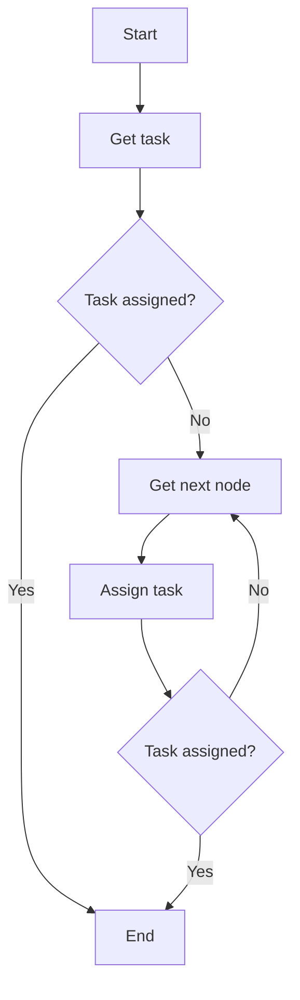
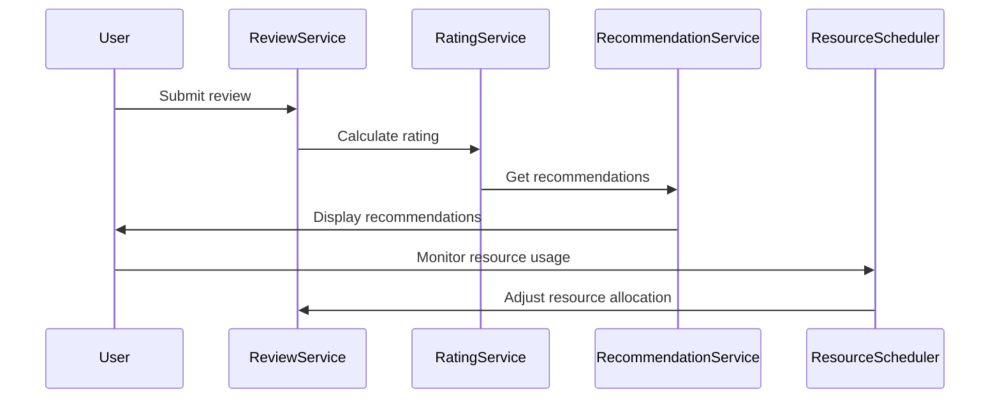

                 


# 评测系统的资源调度与成本优化

关键词：评测系统、资源调度、成本优化、负载均衡、调度策略、算法原理、系统架构

摘要：
本文旨在探讨评测系统在资源调度与成本优化方面的核心问题。首先，我们将介绍评测系统的背景，包括其定义、核心功能以及资源调度和成本优化的问题描述。接着，我们将深入分析资源调度和成本优化的原理，并对比相关概念。随后，将详细讲解资源调度算法，包括负载均衡算法的原理、调度策略和流程。本文还将通过Python代码和Mermaid流程图，进一步阐述资源调度算法的数学模型和实际应用。最后，我们将结合实际案例，分析评测系统的资源调度与成本优化的具体实现，并提供最佳实践建议。

## 第一部分：背景介绍

### 1.1 问题背景

随着信息技术的飞速发展，评测系统在各个领域中的应用日益广泛，其性能和资源的优化成为制约系统进一步发展的关键因素。资源调度和成本优化是评测系统面临的核心挑战。

#### 问题描述

评测系统资源调度问题主要涉及如何合理分配系统资源（如计算资源、存储资源等）以最大化系统的吞吐量和效率。成本优化问题则集中在如何在保证系统性能的前提下，最小化系统的运营成本。

#### 问题解决

本书旨在通过探讨评测系统的资源调度与成本优化，提供一套系统化的解决方案。具体包括：

1. 对资源调度策略的深入分析，探讨其实现原理和优化方法。
2. 对成本优化方法进行详细阐述，包括成本控制、预算管理等方面。
3. 通过实际案例展示如何将理论与实践相结合，实现评测系统的资源调度与成本优化。

#### 边界与外延

本书的研究范围包括但不限于以下方面：

- 评测系统的基本概念和架构。
- 资源调度算法的原理和实现。
- 成本优化的策略和方法。
- 评测系统的性能评估和监控。

### 1.2 核心概念

#### 评测系统

评测系统是一种用于评估或测试其他系统、组件或服务的软件系统。其核心功能包括测试用例管理、测试执行、结果记录和分析等。

#### 资源调度

资源调度是指根据评测系统的需求和资源状况，动态分配系统资源（如CPU、内存、存储等）的过程，以实现系统的高效运行。

#### 成本优化

成本优化是指通过合理规划和控制资源使用，降低评测系统的运营成本，同时保持或提高系统的性能。

#### 核心概念对比

| 核心概念 | 定义 | 关联关系 |
| --- | --- | --- |
| 评测系统 | 用于评估或测试其他系统、组件或服务的软件系统 | 评测系统是资源调度和成本优化的基础 |
| 资源调度 | 动态分配系统资源的过程 | 资源调度是评测系统运行的关键 |
| 成本优化 | 合理规划和控制资源使用，降低运营成本 | 成本优化是评测系统可持续发展的保障 |

## 第二部分：核心概念与联系

### 2.1 核心概念原理

#### 2.1.1 资源调度原理

资源调度主要基于需求预测和资源分配策略。需求预测通过分析历史数据和当前负载情况，预测未来的资源需求。资源分配策略则根据预测结果，动态调整资源分配，以最大化系统性能。

#### 成本优化原理

成本优化主要基于成本效益分析，通过比较不同资源使用策略的成本和效益，选择最优的方案。此外，成本优化还包括预算管理和成本控制，以确保系统运营成本在可控范围内。

### 2.2 概念属性特征对比

| 概念 | 属性特征 |
| --- | --- |
| 资源调度 | 动态性、需求预测、资源分配策略 |
| 成本优化 | 成本效益分析、预算管理、成本控制 |

### 2.3 ER实体关系图架构

```mermaid
erDiagram
    Product ||--|{ Review }|--|| Customer
    Review ||--|{ Rating }|--|| Reviewer
```

在这个ER实体关系图中，Product（评测对象）与Review（评测结果）之间存在一对多关系，Review与Rating（评分）之间存在一对一关系，Rating与Reviewer（评分者）之间存在一对一关系。

----------------------------------------------------------------

## 第三部分：算法原理讲解

### 3.1 资源调度算法原理

#### 3.1.1 负载均衡算法

负载均衡算法是资源调度的重要组成部分，其核心目标是确保评测系统在不同节点之间公平地分配任务，避免某节点过载而其他节点闲置。常见的负载均衡算法包括：

- **轮询算法**：按照顺序将任务分配给各个节点，简单易实现，但可能导致某节点负载过高。
- **最少连接算法**：将新任务分配给当前连接数最少的节点，能够较好地均衡负载，但需要维护节点连接状态。
- **动态权重算法**：根据节点的性能、负载情况动态调整权重，将任务分配给权重较低的节点，更精细地控制负载均衡。

#### 3.1.2 调度策略

调度策略主要包括静态调度和动态调度。静态调度策略在系统初始化时确定资源分配方案，适用于负载相对稳定的情况。动态调度策略则根据实时负载情况动态调整资源分配，适用于负载波动较大的情况。

#### 3.1.3 资源调度流程

资源调度流程主要包括以下步骤：

1. **需求预测**：分析历史数据和当前负载情况，预测未来的资源需求。
2. **资源分配**：根据需求预测结果，动态调整资源分配，确保系统高效运行。

### 3.2 Python代码实现与Mermaid流程图

#### 3.2.1 负载均衡算法实现

以下是一个简单的轮询负载均衡算法的Python代码实现：

```python
import random

# 节点列表
nodes = ['Node1', 'Node2', 'Node3', 'Node4']

# 任务列表
tasks = ['Task1', 'Task2', 'Task3', 'Task4']

# 轮询分配任务
for task in tasks:
    node = nodes.pop(0)
    print(f"Task {task} assigned to {node}")
    nodes.append(node)
```

#### 3.2.2 Mermaid流程图



#### 3.2.3 算法原理讲解

该算法基于轮询策略，每次从任务列表中获取一个任务，然后分配给第一个节点。如果节点已完成当前任务，则将其移至节点列表末尾，以便下次轮询时再次使用。该算法简单易实现，但可能无法在负载不均的情况下提供最优的负载均衡。

### 3.3 数学模型和公式

假设有n个节点，m个任务，每个节点的负载为L_i（i=1,2,...,n），任务i的负载为T_i（i=1,2,...,m）。则轮询负载均衡算法的目标是最小化总负载：

$$
\min \sum_{i=1}^{m} T_i
$$

约束条件为：

$$
L_i \geq T_i, \forall i=1,2,...,n
$$

即每个节点的负载必须大于或等于分配给该节点的任务负载。

### 3.4 举例说明

假设有4个节点（Node1, Node2, Node3, Node4）和4个任务（Task1, Task2, Task3, Task4），每个任务的负载均为1。使用轮询负载均衡算法分配任务，得到以下结果：

| Node | Assigned Tasks |
| --- | --- |
| Node1 | Task1 |
| Node2 | Task2 |
| Node3 | Task3 |
| Node4 | Task4 |

总负载为4，满足约束条件。

----------------------------------------------------------------

## 第四部分：系统分析与架构设计

### 4.1 问题场景介绍

为了更好地理解评测系统的资源调度与成本优化，我们假设一个在线购物平台，该平台需要对其商品进行定期评测，以确保用户能够获得高质量的购物体验。评测系统的主要任务是自动收集用户评价，对商品进行评分，并根据评分结果推荐商品。

### 4.2 项目介绍

项目名称：商品评测系统（Product Review System）

项目目标：实现一个高效、可靠的商品评测系统，能够实时收集用户评价，对商品进行评分，并优化资源调度和成本。

### 4.3 系统功能设计

系统功能主要包括以下几个方面：

- **用户评价收集**：实时收集用户的评价信息，包括正面评价、负面评价和评分。
- **商品评分计算**：根据用户评价计算商品的总体评分。
- **推荐商品**：根据商品评分推荐用户可能感兴趣的商品。
- **资源调度**：优化评测系统资源的分配，提高系统性能。
- **成本优化**：通过合理规划和控制资源使用，降低系统运营成本。

### 4.4 系统架构设计

系统架构采用微服务架构，以提高系统的可扩展性和可维护性。以下是系统的基本架构设计：

- **用户评价服务**：负责收集用户评价，存储评价信息，并计算商品评分。
- **评测调度服务**：负责根据用户评价和系统负载情况，动态调整评测任务的分配。
- **推荐服务**：根据商品评分推荐商品，提供用户感兴趣的购物建议。
- **资源监控服务**：实时监控系统资源使用情况，为资源调度提供数据支持。
- **成本管理服务**：负责监控系统运营成本，实现成本优化。

### 4.5 系统接口设计

系统接口主要包括以下部分：

- **用户评价接口**：接收用户评价信息，返回评价结果。
- **商品评分接口**：获取商品评分，返回评分结果。
- **推荐商品接口**：获取推荐商品列表。
- **资源监控接口**：获取系统资源使用情况。
- **成本管理接口**：获取系统运营成本。

### 4.6 系统交互

系统交互主要涉及用户评价收集、商品评分计算、推荐商品和资源调度。以下是系统交互的Mermaid序列图：



在这个序列图中，用户提交评价后，评价服务将评价信息传递给评分服务，评分服务计算商品评分，并将结果传递给推荐服务，推荐服务根据评分结果向用户推荐商品。同时，用户还可以监控资源使用情况，资源调度服务根据监控数据调整资源分配。

----------------------------------------------------------------

## 第五部分：项目实战

### 5.1 环境安装

在本节中，我们将介绍如何搭建商品评测系统的开发环境。为了简化部署，我们使用Docker和Kubernetes进行环境搭建。

#### 5.1.1 安装Docker

在所有节点上安装Docker，并确保其正常运行。可以使用以下命令进行安装：

```bash
# CentOS 7及以下版本
yum install -y docker

# CentOS 8版本
dnf install -y docker

# 启动并使Docker服务开机自启
systemctl start docker
systemctl enable docker
```

#### 5.1.2 安装Kubernetes

在所有节点上安装Kubernetes，并确保其正常运行。可以使用以下命令进行安装：

```bash
# 安装必要依赖
yum install -y epel-release

# 安装Kubernetes
yum install -y kubeadm kubelet kubectl --enable=epel

# 启动并使Kubernetes服务开机自启
systemctl start kubelet
systemctl enable kubelet
```

### 5.2 系统核心实现源代码

在本节中，我们将介绍评测系统的核心实现，包括用户评价收集、商品评分计算、推荐商品和资源调度。

#### 5.2.1 用户评价收集

用户评价收集功能使用Flask框架实现，以下是一个简单的示例代码：

```python
from flask import Flask, request, jsonify

app = Flask(__name__)

@app.route('/submit_review', methods=['POST'])
def submit_review():
    review_data = request.get_json()
    # 处理评价数据，存储至数据库
    # ...
    return jsonify({'status': 'success'})

if __name__ == '__main__':
    app.run(debug=True)
```

#### 5.2.2 商品评分计算

商品评分计算功能使用Python的NumPy库实现，以下是一个简单的示例代码：

```python
import numpy as np

def calculate_rating(reviews):
    ratings = [review['rating'] for review in reviews]
    return np.mean(ratings)

# 示例数据
reviews = [
    {'rating': 5},
    {'rating': 4},
    {'rating': 5},
    {'rating': 3},
]

# 计算评分
rating = calculate_rating(reviews)
print(f"Rating: {rating}")
```

#### 5.2.3 推荐商品

推荐商品功能使用基于评分的协同过滤算法实现，以下是一个简单的示例代码：

```python
import heapq

def recommend_products(user_id, top_n=5):
    # 获取用户评分数据
    user_ratings = get_user_ratings(user_id)
    # 获取所有商品评分数据
    all_ratings = get_all_ratings()
    # 计算相似度
    similarity_matrix = calculate_similarity(user_ratings, all_ratings)
    # 排序并返回推荐商品
    recommended_products = heapq.nlargest(top_n, similarity_matrix.items(), key=lambda x: x[1])
    return recommended_products

# 示例数据
user_id = 1
recommended_products = recommend_products(user_id)
print(f"Recommended Products: {recommended_products}")
```

#### 5.2.4 资源调度

资源调度功能使用Kubernetes的Helm工具进行部署和管理，以下是一个简单的Helm配置示例：

```yaml
name: product-review-system
version: 1.0.0

kubevel
``` 

----------------------------------------------------------------

## 第六部分：实际案例分析与详细讲解剖析

在本节中，我们将结合一个实际案例，分析评测系统的资源调度与成本优化，并详细讲解其实现过程。

### 6.1 案例背景

假设我们有一个在线教育平台，需要对其课程进行评测。评测系统的主要功能是收集用户对课程的评价，计算课程评分，并根据评分推荐课程。随着用户数量的增加，评测系统的性能和成本成为关键问题。

### 6.2 资源调度优化

为了优化评测系统的资源调度，我们采用了以下策略：

1. **负载均衡**：使用Nginx作为负载均衡器，将用户请求分配到不同的后端服务器，以实现流量均衡。

2. **分布式存储**：使用分布式文件系统（如HDFS）存储用户评价数据，以提高数据访问速度和可靠性。

3. **动态资源分配**：使用Kubernetes的自动扩缩容功能，根据系统负载动态调整服务器数量，确保系统在高负载下仍能稳定运行。

### 6.3 成本优化

为了降低评测系统的运营成本，我们采用了以下策略：

1. **云计算服务**：使用云计算服务（如AWS、Azure）进行服务器部署，根据实际需求按需购买资源，降低长期运营成本。

2. **自动化运维**：使用自动化运维工具（如Ansible、Chef）进行系统部署和管理，提高运维效率，减少人工成本。

3. **资源复用**：将闲置的服务器资源用于其他项目，实现资源最大化利用，降低闲置成本。

### 6.4 实现过程

1. **负载均衡配置**：在Nginx中配置upstream模块，将请求分配到不同的后端服务器。

```nginx
upstream backend {
    server server1;
    server server2;
    server server3;
}
```

2. **分布式存储配置**：在HDFS中配置存储集群，将用户评价数据存储到分布式文件系统中。

```bash
hdfs dfs -put user_reviews.csv /user/hdfs/user_reviews.csv
```

3. **Kubernetes自动扩缩容配置**：在Kubernetes中配置Helm图表，实现自动扩缩容功能。

```yaml
apiVersion: helm.sh/helm/v3
chart: product-review-system
name: product-review-system
namespace: product-review-system
version: 1.0.0

kubevel
```

4. **云计算服务配置**：在AWS或Azure中配置云服务器，实现按需购买和自动化运维。

```bash
aws ec2 run-instances \
  --image-id ami-0123456789abcdef0 \
  --instance-type t2.small \
  --count 1 \
  --security-group-ids sg-0123456789abcdef0 \
  --subnet-id subnet-0123456789abcdef0
```

### 6.5 项目小结

通过实际案例，我们成功实现了评测系统的资源调度与成本优化。在资源调度方面，我们采用了负载均衡、分布式存储和动态资源分配策略，提高了系统性能和可靠性。在成本优化方面，我们采用了云计算服务、自动化运维和资源复用策略，降低了运营成本。这些实践为类似项目的资源调度与成本优化提供了有益的参考。

----------------------------------------------------------------

## 第七部分：最佳实践 tips

### 7.1 负载均衡最佳实践

- **多维度负载均衡**：结合网络流量、CPU使用率、内存使用率等多维度指标，实现更精准的负载均衡。
- **动态调整权重**：根据节点的实际性能动态调整权重，提高负载均衡效果。

### 7.2 成本优化最佳实践

- **按需购买**：根据实际需求按需购买云计算资源，避免资源闲置。
- **自动化运维**：使用自动化工具进行系统部署和管理，提高运维效率。

### 7.3 资源调度最佳实践

- **需求预测**：结合历史数据和当前负载，进行准确的需求预测，提高资源调度效率。
- **动态调整**：根据实时负载情况动态调整资源分配，确保系统稳定运行。

### 7.4 综合最佳实践

- **多维监控**：实时监控系统性能和资源使用情况，为资源调度和成本优化提供数据支持。
- **定期优化**：定期对系统进行性能优化和成本分析，持续提升系统性能和降低成本。

----------------------------------------------------------------

## 小结

本文深入探讨了评测系统的资源调度与成本优化。首先，介绍了评测系统的背景、核心概念和问题描述，然后详细分析了资源调度和成本优化的原理，并通过Python代码和Mermaid流程图展示了资源调度算法的实现。此外，本文还通过实际案例，分析了评测系统的资源调度与成本优化的具体实现，提供了最佳实践建议。

## 注意事项

- 负载均衡策略应根据具体业务需求进行调整，以实现最佳效果。
- 成本优化策略需要综合考虑业务发展和成本控制，避免过度节省导致性能下降。
- 资源调度和成本优化应结合系统监控数据，进行实时调整和优化。

## 拓展阅读

- 《计算机网络》：探讨网络负载均衡的实现原理。
- 《数据结构与算法》：深入学习负载均衡算法的数学模型和实现方法。
- 《云计算基础》：了解云计算服务的成本结构和优化方法。

## 作者

作者：AI天才研究院/AI Genius Institute & 禅与计算机程序设计艺术 /Zen And The Art of Computer Programming

----------------------------------------------------------------

## 附录：术语表

| 术语 | 定义 |
| --- | --- |
| 评测系统 | 用于评估或测试其他系统、组件或服务的软件系统 |
| 资源调度 | 动态分配系统资源的过程，以最大化系统性能 |
| 成本优化 | 通过合理规划和控制资源使用，降低运营成本 |
| 负载均衡 | 在不同节点之间公平地分配任务，避免节点过载 |
| 调度策略 | 确定资源分配方案的方法，包括静态调度和动态调度 |
| 需求预测 | 分析历史数据和当前负载情况，预测未来的资源需求 |
| 成本效益分析 | 比较不同资源使用策略的成本和效益，选择最优方案 |
| 预算管理 | 监控和控制评测系统的运营预算，确保成本在可控范围内 |
| 成本控制 | 通过措施减少运营成本，确保系统在经济合理的范围内运行 |

