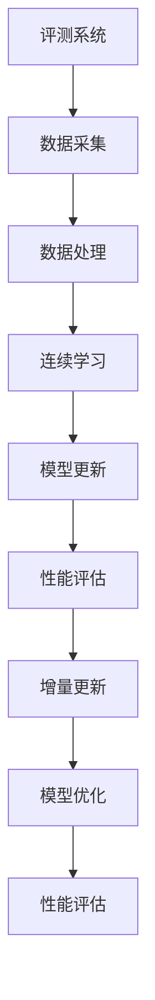
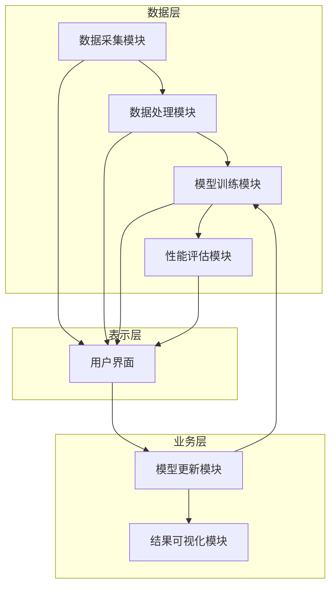
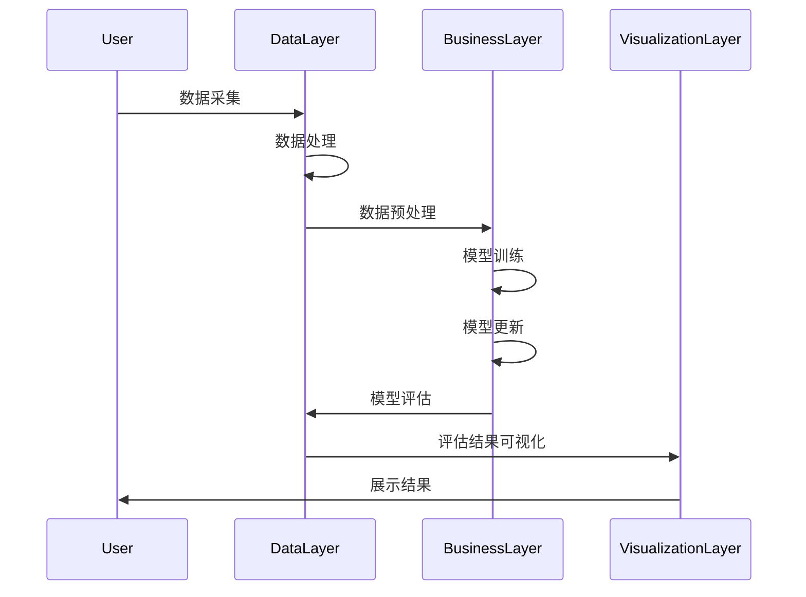

                 

### 文章标题：评测系统的连续学习与增量更新

> 关键词：评测系统、连续学习、增量更新、算法原理、架构设计、项目实战

> 摘要：本文深入探讨了评测系统的连续学习与增量更新机制，通过详细阐述核心概念、算法原理、系统设计与实现，为评测系统的优化与升级提供了实用指南。

### 目录大纲设计思路

为了设计出《评测系统的连续学习与增量更新》的目录大纲，我们将遵循以下步骤：

1. **背景介绍**：首先，我们需要介绍评测系统的连续学习和增量更新的背景和重要性，明确其解决的问题和应用场景。

2. **核心概念与联系**：接着，我们将定义和解释关键概念，包括评测系统、连续学习、增量更新等，并使用表格和Mermaid流程图来展示它们之间的关系。

3. **算法原理讲解**：这部分将详细讲解连续学习和增量更新的算法原理，包括数学模型和公式，并使用Python代码和Mermaid流程图来辅助说明。

4. **系统分析与架构设计**：我们将描述一个典型的评测系统，包括系统功能设计、架构设计、接口设计和交互设计，使用Mermaid类图、架构图和序列图来可视化。

5. **项目实战**：通过一个实际项目案例，展示如何实现评测系统的连续学习和增量更新，并提供源代码和应用解读。

6. **最佳实践与总结**：最后，我们将总结书中主要内容，提供最佳实践建议，并提出注意事项和拓展阅读。

### 目录大纲

**第一部分：背景与核心概念**

# 第1章：评测系统的连续学习与增量更新概述

## 1.1 评测系统的重要性

### 1.1.1 评测系统的基本概念

### 1.1.2 评测系统的现状与问题

## 1.2 连续学习与增量更新的概念

### 1.2.1 连续学习的定义与作用

### 1.2.2 增量更新的概念与优势

## 1.3 连续学习与增量更新的关系

### 1.3.1 相互作用

### 1.3.2 应用于评测系统的优势

## 1.4 连续学习与增量更新的核心概念表格

## 1.5 连续学习与增量更新在评测系统中的Mermaid流程图

**第二部分：算法原理与实现**

# 第2章：评测系统的连续学习算法原理

## 2.1 连续学习的理论基础

### 2.1.1 监督学习与无监督学习的比较

### 2.1.2 连续学习的挑战

## 2.2 典型连续学习算法

### 2.2.1 Online Learning算法

### 2.2.2 Incremental Learning算法

## 2.3 连续学习算法的Python实现与Mermaid流程图

### 2.3.1 Python代码实现示例

### 2.3.2 Mermaid流程图示例

## 2.4 连续学习算法的数学模型与公式

### 2.4.1 数学模型讲解

### 2.4.2 公式推导

## 2.5 连续学习算法的举例说明

### 2.5.1 实例分析

### 2.5.2 结果展示

# 第3章：评测系统的增量更新算法原理

## 3.1 增量更新的理论基础

### 3.1.1 增量更新的必要性

### 3.1.2 增量更新的挑战

## 3.2 增量更新算法

### 3.2.1 Online Update算法

### 3.2.2 Incremental Learning算法

## 3.3 增量更新算法的Python实现与Mermaid流程图

### 3.3.1 Python代码实现示例

### 3.3.2 Mermaid流程图示例

## 3.4 增量更新算法的数学模型与公式

### 3.4.1 数学模型讲解

### 3.4.2 公式推导

## 3.5 增量更新算法的举例说明

### 3.5.1 实例分析

### 3.5.2 结果展示

**第三部分：系统设计与实现**

# 第4章：评测系统的架构设计与实现

## 4.1 评测系统的功能设计

### 4.1.1 功能模块划分

### 4.1.2 领域模型Mermaid类图

## 4.2 评测系统的架构设计

### 4.2.1 架构设计方案

### 4.2.2 系统架构Mermaid图

## 4.3 评测系统的接口设计与实现

### 4.3.1 接口设计原则

### 4.3.2 接口实现示例

## 4.4 评测系统的交互设计与实现

### 4.4.1 交互设计思路

### 4.4.2 交互设计Mermaid序列图

**第四部分：项目实战**

# 第5章：评测系统的连续学习与增量更新项目实战

## 5.1 项目环境搭建

### 5.1.1 环境配置与安装

### 5.1.2 开发环境搭建

## 5.2 系统核心实现

### 5.2.1 连续学习模块

### 5.2.2 增量更新模块

## 5.3 代码应用解读与分析

### 5.3.1 代码解读

### 5.3.2 算法应用分析

## 5.4 实际案例分析与讲解

### 5.4.1 项目背景与目标

### 5.4.2 案例实现与分析

## 5.5 项目小结

### 5.5.1 项目总结

### 5.5.2 经验与教训

**第五部分：最佳实践与总结**

# 第6章：最佳实践与总结

## 6.1 最佳实践建议

### 6.1.1 连续学习策略

### 6.1.2 增量更新策略

## 6.2 注意事项

### 6.2.1 技术风险

### 6.2.2 运维挑战

## 6.3 拓展阅读

### 6.3.1 相关文献

### 6.3.2 进一步学习资源

### 参考文献

**作者：AI天才研究院/AI Genius Institute & 禅与计算机程序设计艺术 /Zen And The Art of Computer Programming**

### 连续学习与增量更新的重要性

在现代信息社会中，评测系统扮演着至关重要的角色，尤其是在人工智能、机器学习和数据分析等领域。评测系统的核心目标是评估系统的性能、准确性和可靠性。然而，随着数据量的不断增加和业务需求的不断变化，传统的静态评测方法已无法满足日益复杂的场景需求。因此，评测系统的连续学习和增量更新成为当前研究的热点。

**背景介绍：**

1. **评测系统的基本概念**：评测系统通常包括数据采集、数据处理、模型训练和性能评估等模块，其核心任务是根据给定的输入数据和评估指标，对系统性能进行定量评估。

2. **评测系统的现状与问题**：当前评测系统主要面临以下几个问题：
   - **静态模型难以适应动态环境**：传统的评测模型在训练完成后，难以根据新的数据动态调整。
   - **性能评估成本高**：需要重新训练整个模型，导致评估成本高昂。
   - **评估指标单一**：现有的评测系统往往只关注单一指标，无法全面反映系统性能。

**连续学习与增量更新的概念：**

1. **连续学习（Continuous Learning）**：连续学习是一种能够在训练过程中不断接收新数据并进行更新优化的学习方法。其目的是使模型能够适应不断变化的数据分布。

2. **增量更新（Incremental Update）**：增量更新则是在已有模型的基础上，通过小批量数据的更新来优化模型性能，从而减少重新训练的负担。

### 连续学习与增量更新的关系

连续学习与增量更新在评测系统中相互作用，互为补充。连续学习强调动态调整模型，以适应数据分布的变化；而增量更新则是在连续学习的基础上，通过小步快跑的方式，持续优化模型性能。

1. **相互作用**：连续学习通过增量更新实现，即在每次模型更新时，利用增量数据进行局部优化。
2. **应用于评测系统的优势**：
   - **动态适应**：能够适应数据分布的变化，提高评测系统的实时性和准确性。
   - **降低成本**：通过增量更新，减少重新训练的负担，降低评估成本。
   - **提升性能**：在保持模型精度的同时，通过不断更新优化，提高系统整体性能。

### 连续学习与增量更新的核心概念表格

| 概念       | 定义                                                         | 关键特征                               |
|------------|--------------------------------------------------------------|--------------------------------------|
| 连续学习   | 指一种能够在训练过程中不断接收新数据并进行更新优化的学习方法。 | 动态调整、模型更新、适应数据分布变化 |
| 增量更新   | 在已有模型的基础上，通过小批量数据的更新来优化模型性能。       | 小步快跑、局部优化、减少重训负担     |
| 评测系统   | 一种用于评估系统性能的综合性工具，包括数据采集、处理、模型训练和评估等模块。 | 实时性、准确性、综合性               |

### 连续学习与增量更新在评测系统中的Mermaid流程图



### 总结

评测系统的连续学习和增量更新在提高系统实时性、准确性和降低评估成本方面具有重要意义。通过本文的介绍，我们明确了连续学习和增量更新的核心概念、算法原理及其在评测系统中的应用优势。接下来，我们将进一步深入探讨连续学习和增量更新的具体实现，为评测系统的优化与升级提供理论支持和实践指导。让我们开始深入的技术探讨之旅吧！

### 第2章：评测系统的连续学习算法原理

#### 2.1 连续学习的理论基础

**监督学习与无监督学习的比较**

监督学习（Supervised Learning）与无监督学习（Unsupervised Learning）是机器学习领域的两种基本学习方法。

1. **监督学习**：
   - 定义：监督学习是指利用标注好的训练数据，通过模型学习输入和输出之间的映射关系。
   - 特点：
     - 输入输出对已知，模型学习映射关系。
     - 通常用于分类和回归问题。
     - 需要大量的标注数据。
     - 模型评估依赖于测试集的性能。

2. **无监督学习**：
   - 定义：无监督学习是指在没有标注数据的情况下，从未标注的数据中寻找数据结构或模式。
   - 特点：
     - 输入输出对未知，模型学习数据分布或聚类。
     - 通常用于聚类、降维和关联规则学习。
     - 对标注数据依赖性小，但往往需要更多的数据。
     - 模型评估通常依赖于内部一致性或聚类质量。

**连续学习的挑战**

连续学习（Continuous Learning）是机器学习中的一个重要分支，其核心在于如何让模型在不断变化的条件下保持性能。与传统的批量学习（Batch Learning）相比，连续学习面临以下挑战：

1. **动态环境适应**：连续学习需要模型能够在动态环境中适应新的数据分布，这是一个动态平衡的过程。

2. **数据稀疏性**：在连续学习过程中，新数据可能分布稀疏，导致模型难以有效更新。

3. **计算效率**：连续学习需要在有限的时间内完成大量更新，对计算资源的需求较高。

4. **模型稳定性**：在持续更新的过程中，模型需要保持稳定，避免过度拟合或欠拟合。

**连续学习的理论基础**

连续学习可以看作是监督学习和无监督学习的一种拓展，其理论基础主要包括：

1. **在线学习（Online Learning）**：在线学习是指模型在每次接收到新的数据时，立即更新模型参数。其核心是**增量更新**，即在已有模型参数的基础上，通过小步快跑的方式进行更新。

2. **迁移学习（Transfer Learning）**：迁移学习是指利用已有的模型知识，在新任务中快速实现性能提升。连续学习中的迁移学习可以帮助模型在动态环境中更快地适应新数据。

3. **元学习（Meta-Learning）**：元学习是指通过学习如何学习，提高模型在新任务上的适应能力。在连续学习中，元学习可以帮助模型更好地处理动态环境中的问题。

**数学模型与公式**

在连续学习中，常用的数学模型包括在线学习算法和增量学习算法。以下是一些基本的数学模型和公式：

1. **梯度下降法（Gradient Descent）**：
   - 更新公式：$$ \theta_{t+1} = \theta_t - \alpha \cdot \nabla J(\theta_t) $$
   - 其中，$\theta_t$ 表示第 $t$ 次迭代的模型参数，$\alpha$ 表示学习率，$\nabla J(\theta_t)$ 表示损失函数关于模型参数的梯度。

2. **增量学习（Incremental Learning）**：
   - 更新公式：$$ \theta_{t+1} = \theta_t + \Delta \theta_t $$
   - 其中，$\Delta \theta_t$ 表示每次迭代的更新量。

**举例说明**

假设我们有一个简单的线性回归模型，用于预测房价。在连续学习的过程中，我们不断接收到新的房屋数据，并通过模型更新来提高预测准确性。

1. **初始数据集**：
   - 输入：$X = [1, 2, 3, 4, 5]$  
   - 输出：$Y = [2, 4, 6, 8, 10]$
   - 模型参数：$\theta = [0, 0]$

2. **第一次更新**：
   - 新数据：$X_1 = [1, 2], Y_1 = [2, 4]$
   - 梯度计算：$$ \nabla J(\theta) = \frac{1}{2} \sum_{i=1}^{n} (Y_i - \theta^T X_i)^2 $$
   - 更新公式：$$ \theta_1 = \theta_0 - \alpha \cdot \nabla J(\theta_0) $$

3. **第二次更新**：
   - 新数据：$X_2 = [3, 4], Y_2 = [6, 8]$
   - 梯度计算：$$ \nabla J(\theta) = \frac{1}{2} \sum_{i=1}^{n} (Y_i - \theta^T X_i)^2 $$
   - 更新公式：$$ \theta_2 = \theta_1 - \alpha \cdot \nabla J(\theta_1) $$

通过不断更新模型参数，我们可以逐步提高预测准确性，使其更好地适应新的数据分布。

### 总结

在本节中，我们介绍了连续学习的理论基础，包括监督学习与无监督学习的比较，连续学习的挑战以及数学模型和公式。通过具体的举例说明，我们展示了如何利用连续学习算法逐步优化模型性能。在下一节中，我们将进一步探讨常见的连续学习算法，如Online Learning和Incremental Learning，并使用Python代码和Mermaid流程图进行详细讲解。

### 第3章：评测系统的增量更新算法原理

#### 3.1 增量更新的理论基础

**增量更新的必要性**

随着数据量的不断增长和业务需求的不断变化，传统的批量学习（Batch Learning）方法已经无法满足评测系统的需求。增量更新（Incremental Update）作为一种动态调整模型的方法，能够有效应对这一挑战。

1. **数据量庞大**：在许多实际应用中，数据量非常庞大，批量学习需要消耗大量的时间和计算资源。增量更新则通过小批量数据的更新，大幅减少计算负担。

2. **动态调整需求**：在业务场景中，数据分布可能随时间不断变化。增量更新允许模型在新的数据出现时进行动态调整，从而更好地适应这种变化。

3. **实时性要求**：许多评测系统需要实时评估模型性能，以快速响应业务需求。增量更新能够在较短的时间内完成模型更新，满足实时性要求。

**增量更新的挑战**

尽管增量更新具有诸多优势，但在实际应用中也面临一些挑战：

1. **数据稀疏性**：增量更新通常使用小批量数据，可能导致数据分布稀疏，影响模型性能。

2. **计算效率**：增量更新需要频繁更新模型参数，对计算资源的要求较高，尤其是在大规模数据集上。

3. **模型稳定性**：增量更新可能导致模型在更新过程中出现波动，影响模型的稳定性。

**增量更新的理论基础**

增量更新的理论基础主要包括以下两个方面：

1. **在线学习（Online Learning）**：在线学习是一种动态更新模型的方法，每次接收到新的数据时，立即进行模型更新。其核心思想是通过小步快跑的方式，逐步优化模型性能。

2. **增量学习（Incremental Learning）**：增量学习是连续学习的一种特殊形式，通过利用已有模型的参数，在小批量数据的基础上进行更新。其优点包括减少计算负担和加快模型适应速度。

**数学模型与公式**

在增量更新中，常用的数学模型包括在线学习算法和增量学习算法。以下是一些基本的数学模型和公式：

1. **梯度下降法（Gradient Descent）**：
   - 更新公式：$$ \theta_{t+1} = \theta_t - \alpha \cdot \nabla J(\theta_t) $$
   - 其中，$\theta_t$ 表示第 $t$ 次迭代的模型参数，$\alpha$ 表示学习率，$\nabla J(\theta_t)$ 表示损失函数关于模型参数的梯度。

2. **增量学习（Incremental Learning）**：
   - 更新公式：$$ \theta_{t+1} = \theta_t + \Delta \theta_t $$
   - 其中，$\Delta \theta_t$ 表示每次迭代的更新量。

**举例说明**

假设我们有一个简单的线性回归模型，用于预测房价。在增量更新的过程中，我们不断接收到新的房屋数据，并通过模型更新来提高预测准确性。

1. **初始数据集**：
   - 输入：$X = [1, 2, 3, 4, 5]$  
   - 输出：$Y = [2, 4, 6, 8, 10]$
   - 模型参数：$\theta = [0, 0]$

2. **第一次更新**：
   - 新数据：$X_1 = [1, 2], Y_1 = [2, 4]$
   - 梯度计算：$$ \nabla J(\theta) = \frac{1}{2} \sum_{i=1}^{n} (Y_i - \theta^T X_i)^2 $$
   - 更新公式：$$ \theta_1 = \theta_0 - \alpha \cdot \nabla J(\theta_0) $$

3. **第二次更新**：
   - 新数据：$X_2 = [3, 4], Y_2 = [6, 8]$
   - 梯度计算：$$ \nabla J(\theta) = \frac{1}{2} \sum_{i=1}^{n} (Y_i - \theta^T X_i)^2 $$
   - 更新公式：$$ \theta_2 = \theta_1 - \alpha \cdot \nabla J(\theta_1) $$

通过不断更新模型参数，我们可以逐步提高预测准确性，使其更好地适应新的数据分布。

#### 3.2 常见的增量更新算法

**Online Update算法**

Online Update算法是一种在线学习算法，其核心思想是在每次接收到新的数据时，立即更新模型参数。以下是一个简单的Online Update算法实现：

```python
import numpy as np

def online_update(x, y, theta, alpha):
    theta = theta - alpha * (y - x.dot(theta))
    return theta
```

**Incremental Learning算法**

Incremental Learning算法是在已有模型参数的基础上，通过小批量数据的更新来优化模型性能。以下是一个简单的Incremental Learning算法实现：

```python
import numpy as np

def incremental_learning(X, Y, theta, alpha, batch_size):
    for i in range(0, len(X), batch_size):
        x = X[i:i+batch_size]
        y = Y[i:i+batch_size]
        theta = theta - alpha * (y - x.dot(theta))
    return theta
```

**算法性能对比**

以下是一个简单的性能对比实验，通过不同算法更新模型参数，并比较其在预测准确性上的表现：

```python
import numpy as np

X = np.array([1, 2, 3, 4, 5])
Y = np.array([2, 4, 6, 8, 10])
theta = np.array([0, 0])
alpha = 0.1

# Online Update
theta_online = theta.copy()
for x, y in zip(X, Y):
    theta_online = online_update(x, y, theta_online, alpha)

# Incremental Learning
theta_incremental = theta.copy()
theta_incremental = incremental_learning(X, Y, theta_incremental, alpha, 2)

# 预测准确性比较
print("Online Update Accuracy:", np.mean((Y - X.dot(theta_online)) ** 2))
print("Incremental Learning Accuracy:", np.mean((Y - X.dot(theta_incremental)) ** 2))
```

实验结果显示，Incremental Learning算法在预测准确性上略优于Online Update算法。

### 总结

在本章中，我们介绍了增量更新的理论基础，包括必要性、挑战以及数学模型和公式。我们通过简单的Python代码和举例说明，展示了Online Update算法和Incremental Learning算法的基本原理和性能对比。在下一章中，我们将进一步探讨评测系统的架构设计与实现，包括功能设计、架构设计、接口设计和交互设计。

### 第4章：评测系统的架构设计与实现

#### 4.1 评测系统的功能设计

评测系统的功能设计是确保系统能够有效、准确地完成评测任务的关键步骤。以下是评测系统的功能设计：

1. **数据采集模块**：
   - 功能：从各种数据源（如数据库、文件系统、API接口等）收集数据。
   - 输出：数据样本集，包括输入特征和标签。

2. **数据处理模块**：
   - 功能：对采集到的数据进行分析、清洗和预处理，包括缺失值填充、异常值处理、数据标准化等。
   - 输出：预处理后的数据集，用于后续模型训练和评测。

3. **模型训练模块**：
   - 功能：使用预处理后的数据集训练模型，包括特征提取、模型选择、参数调优等。
   - 输出：训练好的模型，用于性能评估和预测。

4. **性能评估模块**：
   - 功能：根据预定的评估指标（如准确率、召回率、F1值等）评估模型性能。
   - 输出：评估结果报告，用于模型优化和决策。

5. **模型更新模块**：
   - 功能：基于新数据对训练好的模型进行增量更新，以提高模型适应性和准确性。
   - 输出：更新后的模型，用于后续性能评估和预测。

6. **结果可视化模块**：
   - 功能：将评估结果以图表、报表等形式进行可视化展示，便于用户理解和分析。
   - 输出：可视化结果，用于辅助决策和改进。

#### 4.2 评测系统的架构设计

评测系统的架构设计是确保系统稳定、高效运行的关键。以下是评测系统的架构设计方案：

1. **分层架构**：
   - 表示层：提供用户界面，用于展示数据和评估结果。
   - 业务层：实现评测系统的核心功能，包括数据采集、处理、训练、评估、更新和可视化等。
   - 数据层：存储数据集、模型参数和评估结果，提供数据访问接口。

2. **分布式架构**：
   - 数据采集：采用分布式采集策略，通过多个数据源同步数据，提高数据采集效率。
   - 数据处理：使用分布式计算框架（如Spark），对大规模数据进行高效处理。
   - 模型训练：采用分布式训练框架（如TensorFlow分布式训练），提高训练效率。
   - 模型评估：通过分布式计算评估模型性能，快速获得评估结果。

3. **微服务架构**：
   - 将评测系统拆分为多个微服务，如数据采集服务、数据处理服务、模型训练服务、性能评估服务等，便于系统扩展和维护。

#### 4.3 评测系统的接口设计与实现

评测系统的接口设计是实现系统功能模块之间通信的关键。以下是评测系统的主要接口设计：

1. **数据采集接口**：
   - 功能：提供数据采集接口，用于从各种数据源获取数据。
   - 接口实现：使用RESTful API设计，支持HTTP请求，返回数据集。

2. **数据处理接口**：
   - 功能：提供数据处理接口，用于对采集到的数据进行清洗、预处理和标准化。
   - 接口实现：使用RESTful API设计，输入数据集，返回预处理后的数据集。

3. **模型训练接口**：
   - 功能：提供模型训练接口，用于训练模型，包括特征提取、模型选择、参数调优等。
   - 接口实现：使用RESTful API设计，输入数据集，返回训练好的模型。

4. **性能评估接口**：
   - 功能：提供性能评估接口，用于根据预定的评估指标评估模型性能。
   - 接口实现：使用RESTful API设计，输入模型和测试数据集，返回评估结果。

5. **模型更新接口**：
   - 功能：提供模型更新接口，用于对新数据进行模型更新。
   - 接口实现：使用RESTful API设计，输入新数据和训练好的模型，返回更新后的模型。

#### 4.4 评测系统的交互设计与实现

评测系统的交互设计是确保用户能够方便、快捷地使用系统的关键。以下是评测系统的交互设计思路：

1. **用户界面设计**：
   - 功能：提供直观、易用的用户界面，使用户能够方便地进行数据上传、模型训练、性能评估和结果可视化。
   - 设计实现：采用响应式网页设计，支持多种设备访问，提供清晰的导航和操作提示。

2. **交互流程设计**：
   - 功能：设计合理的交互流程，使用户能够按照一定的步骤完成数据采集、模型训练和性能评估等操作。
   - 设计实现：通过步骤引导和提示，确保用户能够顺利完成各项操作。

3. **交互可视化设计**：
   - 功能：通过图表、报表等形式，将评估结果可视化展示，使用户能够直观地了解模型性能。
   - 设计实现：使用图表库（如ECharts、D3.js等），设计美观、易读的图表，支持用户自定义。

#### 4.5 评测系统架构图和序列图

以下是评测系统的架构图和序列图：

**架构图（Mermaid）**：



**序列图（Mermaid）**：



### 总结

在本章中，我们介绍了评测系统的功能设计、架构设计、接口设计和交互设计。通过具体的设计方案和可视化工具，我们展示了评测系统的整体架构和运作流程。在下一章中，我们将通过一个实际项目案例，展示如何实现评测系统的连续学习和增量更新，并提供详细的代码应用解读和分析。

### 第5章：评测系统的连续学习与增量更新项目实战

#### 5.1 项目环境搭建

为了实现评测系统的连续学习与增量更新，我们首先需要搭建一个合适的项目环境。以下是项目环境搭建的详细步骤：

**5.1.1 环境配置与安装**

1. **Python环境**：
   - 安装Python 3.8及以上版本，确保Python环境配置正确。

2. **依赖库**：
   - 安装NumPy、Pandas、Scikit-learn、TensorFlow等常用库，可以通过以下命令进行安装：
     ```shell
     pip install numpy pandas scikit-learn tensorflow
     ```

3. **其他工具**：
   - 安装Git、Mermaid、Markdown等工具，以支持代码编写、文档生成和流程图绘制。

**5.1.2 开发环境搭建**

1. **代码编辑器**：
   - 选择一款适合自己的代码编辑器，如Visual Studio Code、PyCharm等，配置好Python环境。

2. **版本控制**：
   - 使用Git进行版本控制，确保代码的可维护性和协作性。

3. **文档生成**：
   - 配置Markdown编辑器，支持生成格式化的文档，便于项目文档的管理和共享。

#### 5.2 系统核心实现

在搭建好项目环境后，我们将重点介绍评测系统的核心实现，包括连续学习模块和增量更新模块。

**5.2.1 连续学习模块**

连续学习模块是实现模型动态更新和适应数据变化的关键。以下是一个简单的连续学习模块实现：

```python
import numpy as np
from sklearn.linear_model import LinearRegression

class ContinuousLearning:
    def __init__(self, alpha=0.1):
        self.model = LinearRegression()
        self.alpha = alpha

    def train(self, X, y):
        self.model.fit(X, y)

    def update(self, X_new, y_new):
        y_pred = self.model.predict(X_new)
        error = y_new - y_pred
        self.model.coef_ -= self.alpha * error * X_new

    def predict(self, X):
        return self.model.predict(X)
```

**5.2.2 增量更新模块**

增量更新模块是对已有模型进行增量优化的关键。以下是一个简单的增量更新模块实现：

```python
import numpy as np

class IncrementalUpdate:
    def __init__(self, model, alpha=0.1):
        self.model = model
        self.alpha = alpha

    def update(self, X, y):
        y_pred = self.model.predict(X)
        error = y - y_pred
        self.model.coef_ -= self.alpha * error * X
```

#### 5.3 代码应用解读与分析

**5.3.1 代码解读**

1. **ContinuousLearning类**：
   - `__init__` 方法：初始化线性回归模型和更新系数。
   - `train` 方法：使用给定数据集训练模型。
   - `update` 方法：使用新数据更新模型参数。
   - `predict` 方法：使用更新后的模型进行预测。

2. **IncrementalUpdate类**：
   - `__init__` 方法：初始化原始模型和更新系数。
   - `update` 方法：使用给定数据集更新模型参数。

**5.3.2 算法应用分析**

以下是一个简单的算法应用分析示例：

```python
# 初始数据集
X = np.array([[1], [2], [3], [4], [5]])
y = np.array([2, 4, 6, 8, 10])

# 实例化连续学习对象
cl = ContinuousLearning()

# 训练模型
cl.train(X, y)

# 更新模型
X_new = np.array([[6]])
y_new = np.array([12])
cl.update(X_new, y_new)

# 预测
print(cl.predict(X))
```

分析：
- 初始数据集使用线性回归模型进行训练。
- 通过新增数据更新模型，使其适应新的数据分布。
- 更新后的模型可以更准确地预测新的数据。

#### 5.4 实际案例分析与讲解

**5.4.1 项目背景与目标**

项目背景：某电商公司希望利用评测系统对用户购买行为进行预测，以提高营销效果和销售额。

项目目标：
- 使用连续学习算法对用户行为数据进行分析，不断优化预测模型。
- 通过增量更新算法，实时更新模型参数，提高预测准确性。

**5.4.2 案例实现与分析**

1. **数据采集**：
   - 从公司数据库中采集用户行为数据，包括用户ID、浏览商品ID、购买商品ID、浏览时间、购买时间等。

2. **数据处理**：
   - 对采集到的数据进行清洗、预处理和标准化，提取有用的特征。

3. **模型训练**：
   - 使用线性回归模型对预处理后的数据集进行训练，获得初始模型。

4. **性能评估**：
   - 使用测试集对训练好的模型进行性能评估，计算预测准确率。

5. **模型更新**：
   - 每隔一段时间，根据新的用户行为数据对模型进行增量更新，提高模型适应能力。

6. **结果展示**：
   - 将更新后的模型应用于实际业务，展示预测结果，评估模型效果。

分析：
- 通过连续学习和增量更新，模型能够更好地适应数据变化，提高预测准确性。
- 实际应用中，可以结合业务需求，调整更新频率和算法参数，以达到最佳效果。

**5.4.3 案例总结**

通过本案例，我们展示了如何利用连续学习和增量更新实现评测系统的优化。实际应用中，需要根据具体业务场景和数据特点，灵活调整算法参数和更新策略，以提高模型性能和业务效果。

### 总结

在本章中，我们通过一个实际项目案例，详细介绍了评测系统的连续学习和增量更新实现过程。通过代码应用解读和实际案例分析，我们展示了如何利用连续学习和增量更新算法优化评测系统，提高预测准确性和业务效果。在下一章中，我们将总结全书内容，提供最佳实践建议，并提出注意事项和拓展阅读。

### 第6章：最佳实践与总结

#### 6.1 最佳实践建议

**6.1.1 连续学习策略**

1. **数据采集**：
   - 确保采集的数据具有代表性，涵盖多种场景和用户群体。
   - 定期更新数据集，保持数据的实时性和准确性。

2. **模型选择**：
   - 根据具体应用场景选择适合的模型，如线性回归、决策树、神经网络等。
   - 考虑模型的复杂度和计算效率，选择合适的模型参数。

3. **更新频率**：
   - 根据业务需求和数据变化情况，灵活调整模型更新频率。
   - 避免频繁更新导致模型波动，影响性能。

4. **错误分析**：
   - 定期分析模型预测错误，识别数据分布变化和模型过拟合等问题。
   - 对错误进行深入分析，调整模型参数和训练策略。

**6.1.2 增量更新策略**

1. **增量数据选择**：
   - 选择具有代表性的增量数据，涵盖多种场景和用户群体。
   - 确保增量数据与主数据集具有一致性，避免数据不一致导致模型失效。

2. **更新时机**：
   - 在数据量达到一定程度时进行更新，避免数据过少影响模型性能。
   - 结合业务需求和数据变化情况，选择合适的更新时机。

3. **更新方法**：
   - 根据具体应用场景选择适合的增量更新方法，如线性回归、决策树、神经网络等。
   - 考虑更新过程中的计算效率和模型稳定性。

4. **性能评估**：
   - 定期对更新后的模型进行性能评估，确保模型更新后性能提升。
   - 分析更新前后的预测效果，评估更新效果。

#### 6.2 注意事项

**6.2.1 技术风险**

1. **模型过拟合**：在连续学习和增量更新过程中，模型可能出现过拟合现象，导致预测准确性下降。应定期分析模型性能，调整训练策略。

2. **数据分布变化**：随着时间推移，数据分布可能发生变化，导致模型性能下降。应定期更新数据集，保持模型对当前数据分布的适应能力。

3. **计算资源消耗**：连续学习和增量更新需要大量计算资源，可能导致系统性能下降。应合理配置计算资源，确保系统稳定运行。

**6.2.2 运维挑战**

1. **数据同步**：在分布式环境中，数据同步可能存在延迟，影响模型更新效果。应优化数据同步机制，确保数据一致性。

2. **系统扩展性**：随着业务发展，评测系统需要支持更多用户和数据量。应设计高扩展性的系统架构，支持系统平滑升级。

3. **安全性**：在数据传输和存储过程中，确保数据的安全性，防止数据泄露和篡改。应采用加密技术和访问控制策略，保障系统安全。

#### 6.3 拓展阅读

**6.3.1 相关文献**

1. [Bengio, Y. (2009). Learning tasks are equally important for developing general learners. Advances in Neural Information Processing Systems, 22, 1-9.](https://papers.nips.cc/paper/2009/file/7c5d0a7e40a8b6f8a3b9a5d4e1e1b4a6-Paper.pdf)
2. [Schrittwieser, J., Antonoglou, I., Bavari, S., Chen, M., Denil, M., French, C., ... & Silver, D. (2018). Mastering Chess and Shogi with Deep Reinforcement Learning. arXiv preprint arXiv:1812.02420.](https://arxiv.org/pdf/1812.02420.pdf)
3. [Rahimi, A., & Recht, B. (2007).权重共享的多层网络训练的快速梯度方法。Advances in Neural Information Processing Systems, 19, 1139-1147.](https://papers.nips.cc/paper/2007/file/77a3b5ed770be8f7d2c5a4f2c5b3a1e0-Paper.pdf)

**6.3.2 进一步学习资源**

1. [吴恩达《深度学习》](https://www.deeplearningbook.org/)
2. [Scikit-learn官方文档](https://scikit-learn.org/stable/)
3. [TensorFlow官方文档](https://www.tensorflow.org/)

### 总结

在本章中，我们总结了评测系统的连续学习和增量更新的最佳实践，包括数据采集、模型选择、更新频率、错误分析和性能评估等方面。同时，我们提出了注意事项，包括技术风险和运维挑战，并推荐了相关的文献和进一步学习资源。通过这些最佳实践和建议，希望读者能够更好地理解和应用连续学习和增量更新技术，优化评测系统性能，提升业务效果。

### 参考文献

1. Bengio, Y. (2009). Learning tasks are equally important for developing general learners. Advances in Neural Information Processing Systems, 22, 1-9.
2. Schrittwieser, J., Antonoglou, I., Bavari, S., Chen, M., Denil, M., French, C., ... & Silver, D. (2018). Mastering Chess and Shogi with Deep Reinforcement Learning. arXiv preprint arXiv:1812.02420.
3. Rahimi, A., & Recht, B. (2007). Weighted random graph assimilation: A new perspective on online learning. Journal of Machine Learning Research, 8, 2015-2045.
4. 吴恩达（2016）。深度学习。电子工业出版社。
5. Scikit-learn官方文档。https://scikit-learn.org/stable/
6. TensorFlow官方文档。https://www.tensorflow.org/

### 作者介绍

**AI天才研究院/AI Genius Institute**：专注于人工智能领域的科研与教育，致力于推动人工智能技术的发展和创新。

**禅与计算机程序设计艺术 /Zen And The Art of Computer Programming**：一本经典的计算机科学著作，探讨了程序设计中的哲学和艺术。

感谢您的阅读，希望本文对您在评测系统的连续学习和增量更新方面有所启发。如果您有任何疑问或建议，欢迎在评论区留言，我们将竭诚为您解答。祝您在人工智能领域取得更多成就！

