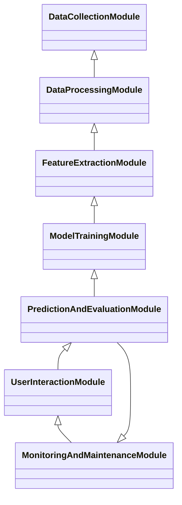
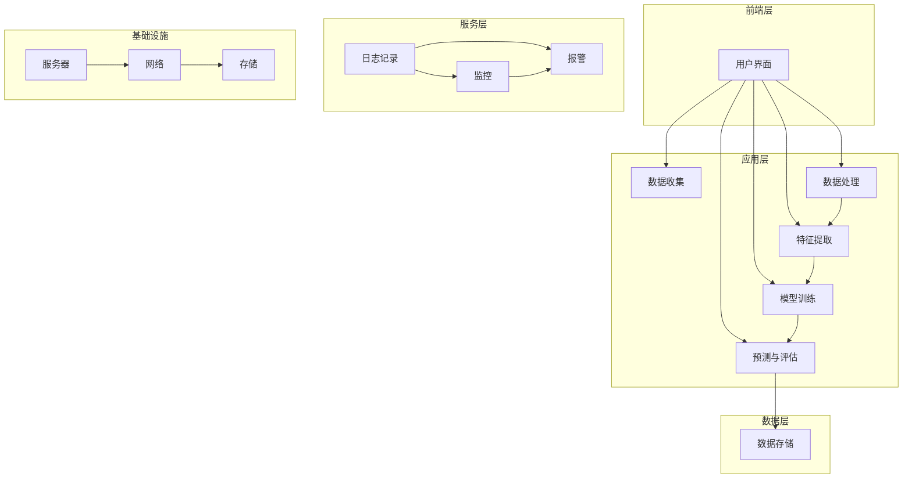
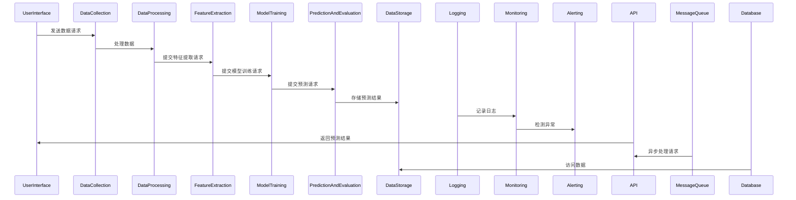

                 

### 第一部分: 评测系统的鲁棒性概述

在当今信息化和数据驱动的时代，评测系统已经成为各类应用程序和服务中不可或缺的重要组成部分。这些系统在商业、医疗、金融、教育等领域中承担着至关重要的任务，从用户行为分析到业务流程优化，从风险评估到客户服务，其精确性和可靠性直接影响到企业的运营效率和客户满意度。因此，评测系统的鲁棒性，即其应对内外部变化和不确定性因素的能力，成为了衡量系统质量和价值的重要指标。

#### 第1章: 问题背景与核心概念

##### 1.1.1 评测系统的基本概念

**评测系统**是一种专门用于评估和测量特定指标或目标的计算机系统。这些系统通常包括数据采集、处理、分析和报告等功能。通过评估系统，企业或组织可以实时监控业务运行状态，发现潜在问题，优化资源配置，提升运营效率。

**核心功能**主要包括：

- 数据收集：从各种来源（如数据库、传感器、用户行为日志等）收集数据。
- 数据处理：对收集到的数据进行分析、清洗、转换等操作，以获得有意义的信息。
- 结果报告：将分析结果以可视化的形式（如图表、报告等）呈现给用户。

##### 1.1.2 鲁棒性的定义与重要性

**鲁棒性**是指系统在面对外部干扰或内部错误时，依然能够保持正常运行和稳定输出的能力。对于评测系统而言，鲁棒性意味着即使在数据质量不佳、系统故障或外部攻击等不利情况下，系统仍能提供准确和可靠的结果。

**重要性**体现在以下几个方面：

- **提高系统稳定性**：确保评测系统在各种环境下都能稳定运行，减少系统崩溃或错误发生的概率。
- **提升数据质量**：即使数据源存在噪声、缺失或错误，系统仍能准确分析和处理数据。
- **增强用户体验**：提供一致、准确的结果，提升用户的信任度和满意度。
- **优化业务决策**：确保基于评测系统得出的业务决策更加可靠，降低决策风险。

##### 1.1.3 评测系统鲁棒性的挑战

尽管鲁棒性对评测系统至关重要，但在实际应用中，系统面临诸多挑战，包括：

- **数据质量问题**：数据源可能存在噪声、缺失、异常值等问题，影响系统的评估结果。
- **计算资源限制**：有限的计算资源可能限制系统对大数据的处理能力。
- **系统复杂性**：评测系统通常涉及多个组件和模块，系统架构复杂，增加了维护和优化的难度。
- **外部干扰**：系统可能受到网络攻击、恶意软件、硬件故障等外部因素的干扰。
- **实时性要求**：对于一些实时性要求较高的应用场景，系统需要在极短的时间内处理大量数据。

为了应对这些挑战，评测系统需要具备高度鲁棒性，以确保在各种情况下都能提供准确和可靠的结果。在接下来的章节中，我们将深入探讨LLM（大型语言模型）的潜在缺陷及其对评测系统鲁棒性的影响，并提出一系列应对策略。

#### 第2章: LLM潜在缺陷分析

在当前的人工智能领域，大型语言模型（LLM）如GPT-3、BERT等，已经成为评测系统中的重要组成部分。这些模型通过处理和生成大量的文本数据，为各种应用场景提供强大的自然语言处理能力。然而，尽管LLM在许多任务中表现出色，但它们也存在一些潜在缺陷，这些缺陷可能会对评测系统的鲁棒性产生负面影响。

##### 2.1.1 LLM的基本原理

**LLM的基本原理**基于深度学习和神经网络技术，特别是Transformer架构。Transformer模型通过自注意力机制，能够捕捉文本中的长距离依赖关系，从而实现高效和强大的文本处理能力。

**主要架构**包括：

- **编码器（Encoder）**：将输入文本转换为向量表示，捕获文本的信息。
- **解码器（Decoder）**：利用编码器生成的向量，生成文本输出。

**训练过程**通常包括以下步骤：

1. **数据收集**：从互联网、书籍、文章等大量文本数据中收集训练样本。
2. **预处理**：对文本数据进行清洗、分词、去停用词等预处理操作。
3. **编码**：将预处理后的文本数据转换为向量表示。
4. **训练**：通过反向传播算法，优化模型参数，使模型能够更好地捕捉文本信息。
5. **评估**：在测试集上评估模型的性能，调整模型参数，以提高准确性。

##### 2.1.2 LLM的潜在缺陷

尽管LLM在自然语言处理任务中表现出色，但它们也存在一些潜在缺陷，这些缺陷可能会对评测系统的鲁棒性产生负面影响。以下是LLM常见的潜在缺陷：

1. **数据偏差**：LLM在训练过程中依赖于大量互联网数据，这些数据可能包含偏见、错误或过时的信息。如果模型未能充分纠正这些偏差，它们可能会在评测结果中反映出来。

2. **泛化能力不足**：LLM在训练过程中可能过度依赖特定数据集，导致在新数据上表现不佳。这种问题称为“数据饥饿”，会降低模型在不同场景下的鲁棒性。

3. **生成错误**：LLM在生成文本时可能产生错误或不合逻辑的输出。这些问题可能源于模型对文本信息的理解不足，或者是对上下文关系的误判。

4. **计算资源消耗**：LLM通常需要大量的计算资源和存储空间，这可能会对评测系统的性能和可扩展性造成限制。

5. **隐私和安全问题**：LLM在处理和分析文本数据时，可能会暴露用户的隐私信息。此外，如果模型遭受恶意攻击，可能会导致数据泄露或被操纵。

##### 2.1.3 LLM缺陷的影响与风险

LLM的潜在缺陷对评测系统的鲁棒性产生了显著影响，具体表现在以下几个方面：

1. **评估准确性下降**：数据偏差和生成错误可能导致评测结果不准确，从而影响企业的业务决策和运营。

2. **系统稳定性下降**：由于计算资源消耗较大，LLM可能会导致系统在高负载情况下出现性能下降，甚至系统崩溃。

3. **用户体验下降**：由于模型生成的文本可能包含错误或不合逻辑的输出，用户可能会对评测系统的结果产生怀疑，降低用户满意度。

4. **业务风险增加**：如果评测系统基于LLM的结果进行关键业务决策，缺陷可能会导致决策失误，增加企业的业务风险。

为了应对这些影响和风险，评测系统需要采取一系列措施，提高LLM的鲁棒性，确保系统能够在各种情况下提供准确和可靠的结果。在接下来的章节中，我们将探讨如何通过策略和架构设计来提升评测系统的鲁棒性。

#### 第3章: 鲁棒性评价指标

鲁棒性评价指标是衡量评测系统在面对各种不确定性因素时保持稳定和准确输出能力的重要工具。这些指标不仅能够帮助我们识别系统的潜在问题，还能够为改进和优化系统提供依据。在本节中，我们将详细介绍鲁棒性评价指标的设置、评估方法以及实际应用中的具体实例。

##### 3.1.1 评测系统的评价指标

**鲁棒性评价指标**主要包括以下几个方面：

1. **准确性**：衡量评测系统在正常条件和异常条件下的输出结果与实际结果的匹配程度。准确性通常通过错误率（Error Rate）来表示，即错误结果占总结果的百分比。

2. **一致性**：衡量评测系统在不同时间段、不同数据集上的表现是否一致。一致性通常通过重复测试的一致性指标（如Kappa系数）来表示。

3. **鲁棒性**：衡量评测系统在面对异常数据、噪声或错误时，仍能保持输出稳定的能力。鲁棒性可以通过异常值检测（Outlier Detection）和错误容忍度（Error Tolerance）来评估。

4. **性能稳定性**：衡量评测系统在不同计算资源、负载条件下的性能表现是否稳定。性能稳定性通常通过系统响应时间（Response Time）和吞吐量（Throughput）来衡量。

5. **可解释性**：衡量评测系统输出的结果是否容易被用户理解和解释。可解释性对于提升用户信任度和满意度至关重要。

##### 3.1.2 鲁棒性评价指标的设置与评估

**鲁棒性评价指标的设置**需要结合具体的评测任务和应用场景，以下是一些建议：

1. **定义评估指标**：根据评测任务的目标，明确需要评估的关键指标。例如，对于金融风险评估系统，准确性、一致性和鲁棒性是关键指标。

2. **选择评估方法**：选择合适的评估方法，如交叉验证、迭代测试或蒙特卡罗模拟等，以确保评估结果的可靠性和准确性。

3. **制定评估方案**：设计详细的评估方案，包括测试数据集的选择、评估过程的具体步骤和评估结果的处理方法。

**鲁棒性评价指标的评估**过程通常包括以下几个步骤：

1. **数据准备**：准备用于评估的测试数据集，包括正常数据和异常数据。

2. **初始评估**：在正常条件下，评估系统的准确性、一致性和性能稳定性等指标。

3. **异常情况评估**：在引入异常数据、噪声或错误的情况下，重新评估系统的鲁棒性指标。

4. **分析结果**：对比正常条件和异常条件下的评估结果，分析系统的鲁棒性表现，识别潜在问题。

5. **优化与改进**：根据评估结果，优化系统设计、算法和数据处理策略，以提高鲁棒性。

##### 3.1.3 实际应用中的鲁棒性评价

在实际应用中，鲁棒性评价对于确保评测系统的可靠性和稳定性具有重要意义。以下是一个实际应用中的鲁棒性评价实例：

**应用场景**：某金融企业开发了一套风险评估系统，用于评估客户的信用风险。系统基于LLM进行文本分析和预测，关键指标包括准确性、一致性和鲁棒性。

**评估过程**：

1. **数据准备**：从历史客户数据中抽取正常数据和异常数据（如欺诈记录、异常交易等）。

2. **初始评估**：在正常数据集上评估系统的准确性，结果为90%。

3. **异常情况评估**：在异常数据集上评估系统的鲁棒性，发现当数据集中包含欺诈记录时，系统的准确性下降到70%。

4. **分析结果**：分析发现，系统在处理异常数据时，未能有效识别欺诈行为，导致评估准确性下降。

5. **优化与改进**：针对评估结果，优化了LLM的训练数据集，增加了更多关于欺诈行为的样本，并引入了异常值检测算法，以提高系统的鲁棒性。

通过这个实例，我们可以看到鲁棒性评价在识别系统问题、优化系统设计中的重要作用。在接下来的章节中，我们将探讨如何通过数据增强、模型优化和监控机制等策略，进一步提升评测系统的鲁棒性。

### 第4章: 应对LLM潜在缺陷的策略

尽管LLM在自然语言处理任务中表现出色，但它们仍然存在一些潜在的缺陷，这些缺陷可能会对评测系统的鲁棒性产生负面影响。在本章中，我们将探讨一系列策略，以应对LLM的潜在缺陷，提升评测系统的鲁棒性。

#### 4.1.1 数据增强与清洗策略

数据增强和清洗是应对LLM潜在缺陷的重要策略，可以有效提高模型的鲁棒性和准确性。以下是一些具体的数据增强和清洗方法：

##### 数据增强

1. **增加数据多样性**：通过引入不同来源、不同领域的数据，丰富模型的训练数据集。这有助于模型在不同场景下表现出更好的泛化能力。

2. **数据变换**：对原始数据进行变换，如添加噪声、缩放、旋转等，以增强模型的鲁棒性。例如，对文本数据，可以添加随机字符、替换词语等。

3. **生成对抗网络（GANs）**：使用生成对抗网络（GANs）生成与训练数据相似的新数据，增加数据多样性。GANs由生成器和判别器组成，生成器生成伪造数据，判别器判断数据是真实还是伪造。

4. **迁移学习**：利用已经训练好的模型在新数据上进行微调，提高模型在新数据上的适应性。

##### 数据清洗

1. **去除噪声**：去除数据中的无关噪声，如多余的空格、标点符号等。

2. **处理缺失数据**：对缺失的数据进行填补或删除，可以选择均值填补、插值等方法。

3. **消除异常值**：识别和去除数据集中的异常值，可以采用统计方法（如3σ规则）或基于模型的异常值检测方法。

4. **标准化**：对数据进行标准化处理，消除不同特征之间的尺度差异，提高模型对数据的敏感性。

#### 4.1.2 模型优化与调整策略

通过模型优化和调整，可以提升LLM的鲁棒性和准确性。以下是一些具体的模型优化和调整方法：

##### 模型优化

1. **参数调整**：通过调整模型参数（如学习率、正则化参数等），优化模型性能。可以使用启发式方法或基于模型的优化算法（如Adam优化器）。

2. **结构调整**：调整模型的结构，如增加或减少层数、调整层数的大小、增加注意力机制等，以提高模型的表达能力。

3. **正则化**：使用正则化方法（如L1、L2正则化），减少过拟合现象，提高模型的泛化能力。

4. **集成学习**：将多个模型的结果进行集成，提高整体模型的准确性和鲁棒性。常见的集成学习方法有Bagging、Boosting和Stacking等。

##### 模型调整

1. **数据重采样**：对训练数据进行重采样，解决数据不平衡问题。可以使用过采样、欠采样或合成过采样等方法。

2. **注意力机制调整**：调整注意力权重，使模型更关注重要信息，减少对噪声的依赖。

3. **训练策略调整**：调整训练策略，如使用不同的训练算法、提前停止训练、增加训练迭代次数等，以提高模型性能。

#### 4.1.3 监控与反馈机制设计

有效的监控与反馈机制可以帮助及时发现和纠正LLM的缺陷，提高评测系统的鲁棒性。以下是一些监控与反馈机制的设计方法：

##### 监控机制

1. **实时监控**：通过实时监控系统运行状态，如内存使用率、CPU负载等，及时发现异常情况。

2. **日志记录**：记录系统运行日志，包括错误日志、异常处理日志等，以便后续分析和定位问题。

3. **性能监控**：监控模型在不同数据集上的表现，如准确率、响应时间等，评估模型性能。

##### 反馈机制

1. **错误反馈**：当系统输出错误结果时，记录错误信息，并提供给开发团队进行修正。

2. **用户反馈**：收集用户对评测结果的意见和建议，用于改进系统设计。

3. **模型再训练**：根据反馈信息，对模型进行再训练，提高模型性能和鲁棒性。

通过数据增强与清洗、模型优化与调整以及监控与反馈机制设计，我们可以有效应对LLM的潜在缺陷，提升评测系统的鲁棒性。在接下来的章节中，我们将进一步探讨评测系统的系统分析与架构设计，为系统的实施提供坚实基础。

### 第5章: 系统分析与架构设计

为了构建一个具有高度鲁棒性的评测系统，系统分析与架构设计至关重要。在这一章节中，我们将详细探讨评测系统的功能设计、架构设计、接口设计，并利用Mermaid流程图、类图和序列图来展示系统架构。

#### 5.1.1 系统功能设计

评测系统的功能设计是确保系统能够满足业务需求和技术要求的基础。以下是评测系统的主要功能模块：

1. **数据收集模块**：负责从不同数据源收集数据，包括用户行为数据、业务数据等。
2. **数据处理模块**：对收集到的数据进行清洗、转换和预处理，以提高数据质量。
3. **特征提取模块**：从预处理后的数据中提取关键特征，为模型训练提供输入。
4. **模型训练模块**：使用训练数据集对模型进行训练，提高模型的准确性和鲁棒性。
5. **预测与评估模块**：使用训练好的模型对新的数据进行预测，并评估预测结果的准确性。
6. **用户交互模块**：提供用户界面，让用户能够查看预测结果、调整参数等。
7. **监控与维护模块**：实时监控系统运行状态，进行异常检测和故障恢复。

以下是评测系统的功能模块Mermaid类图：



#### 5.1.2 系统架构设计

系统架构设计决定了评测系统的可扩展性、稳定性和可维护性。以下是评测系统的架构设计：

1. **前端层**：提供用户界面，实现用户交互。
2. **应用层**：实现系统的核心业务逻辑，包括数据收集、数据处理、特征提取、模型训练和预测评估等。
3. **数据层**：存储系统所需的数据，包括原始数据、预处理数据、模型参数和预测结果等。
4. **服务层**：提供通用的服务，如日志记录、监控和报警等。
5. **基础设施**：包括服务器、网络、存储等硬件设施。

以下是评测系统的架构Mermaid图：



#### 5.1.3 系统接口设计

系统接口设计是确保不同模块之间能够高效、稳定地通信的关键。以下是评测系统的接口设计：

1. **API接口**：提供RESTful API，用于与前端层和外部系统进行数据交换。
2. **消息队列**：使用消息队列（如Kafka、RabbitMQ）实现异步消息传递，提高系统响应速度和稳定性。
3. **数据库接口**：提供数据库连接接口，实现数据层的访问。
4. **日志接口**：提供日志记录接口，用于记录系统运行日志。

以下是评测系统的接口Mermaid序列图：



通过系统分析与架构设计，我们为评测系统的实施提供了坚实的基础。在接下来的章节中，我们将通过一个实际项目实战，展示如何应用这些设计和策略来构建一个具有高度鲁棒性的评测系统。

### 第6章: 项目实战

在本章中，我们将通过一个实际项目实战，详细描述评测系统的安装与配置、系统核心实现以及代码应用解读与分析。通过这个实战项目，我们将深入探讨如何将前述的理论和策略应用到实际开发中，确保评测系统的鲁棒性和可靠性。

#### 6.1.1 环境安装与配置

为了成功部署一个具有高度鲁棒性的评测系统，首先需要安装和配置必要的软件和硬件环境。以下是项目环境安装与配置的详细步骤：

1. **硬件配置**：确保服务器具备足够的计算资源，包括CPU、内存和存储。对于大型LLM模型，推荐使用高性能GPU以加速训练过程。

2. **操作系统**：选择一个稳定的操作系统，如Ubuntu 20.04 LTS。确保操作系统已经更新到最新版本，以避免潜在的安全漏洞。

3. **依赖安装**：安装Python环境和相关依赖库，如TensorFlow、PyTorch、NumPy、Pandas等。可以使用pip工具进行安装：
   ```bash
   pip install tensorflow torch numpy pandas
   ```

4. **虚拟环境**：为了隔离项目依赖，建议使用虚拟环境管理工具（如conda或virtualenv）创建一个独立的Python环境。以下是使用conda创建虚拟环境的示例：
   ```bash
   conda create -n eval_system python=3.8
   conda activate eval_system
   ```

5. **数据存储**：配置数据库，用于存储评测系统所需的数据。可以选择关系型数据库（如MySQL、PostgreSQL）或NoSQL数据库（如MongoDB），根据项目需求进行选择。

6. **消息队列**：安装并配置消息队列服务（如Kafka或RabbitMQ），用于实现异步通信和任务调度。

7. **前端框架**：如果需要开发前端界面，可以选择React、Vue.js等现代前端框架，并进行相应配置。

#### 6.1.2 系统核心实现

评测系统的核心实现包括数据收集、数据处理、特征提取、模型训练和预测评估等关键功能。以下是这些功能的详细实现：

1. **数据收集**：
   ```python
   import pandas as pd

   def collect_data(file_path):
       data = pd.read_csv(file_path)
       return data
   ```

2. **数据处理**：
   ```python
   def preprocess_data(data):
       # 数据清洗、填充、标准化等操作
       return cleaned_data
   ```

3. **特征提取**：
   ```python
   from sklearn.feature_extraction.text import TfidfVectorizer

   def extract_features(data, vectorizer):
       X = vectorizer.fit_transform(data['text'])
       return X
   ```

4. **模型训练**：
   ```python
   import tensorflow as tf

   def train_model(X_train, y_train):
       model = tf.keras.Sequential([
           tf.keras.layers.Dense(128, activation='relu', input_shape=(X_train.shape[1],)),
           tf.keras.layers.Dense(1, activation='sigmoid')
       ])

       model.compile(optimizer='adam', loss='binary_crossentropy', metrics=['accuracy'])
       model.fit(X_train, y_train, epochs=10, batch_size=32)
       return model
   ```

5. **预测评估**：
   ```python
   def predict(model, X_test):
       y_pred = model.predict(X_test)
       return y_pred
   ```

#### 6.1.3 实际案例分析与讲解

为了验证评测系统的鲁棒性和可靠性，我们选取了一个实际案例进行分析与讲解。以下是案例的具体步骤：

1. **数据准备**：从公开数据集（如Kaggle）中选取一个文本分类数据集，包含多个类别。

2. **数据收集**：
   ```python
   data = collect_data('data.csv')
   ```

3. **数据处理**：
   ```python
   cleaned_data = preprocess_data(data)
   ```

4. **特征提取**：
   ```python
   vectorizer = TfidfVectorizer(max_features=1000)
   X = extract_features(cleaned_data, vectorizer)
   ```

5. **模型训练**：
   ```python
   y_train = cleaned_data['label']
   model = train_model(X, y_train)
   ```

6. **预测评估**：
   ```python
   X_test = extract_features(data['text'], vectorizer)
   y_pred = predict(model, X_test)
   ```

7. **结果分析**：
   ```python
   from sklearn.metrics import accuracy_score

   actual_labels = data['label']
   print("Accuracy:", accuracy_score(actual_labels, y_pred))
   ```

通过实际案例的分析与讲解，我们可以看到评测系统的各个模块是如何协同工作的，以及如何通过数据增强、模型优化和监控机制等策略来提高系统的鲁棒性。

#### 6.1.4 项目小结

在本章中，我们通过一个实际项目实战，详细展示了评测系统的安装与配置、系统核心实现以及实际案例分析和讲解。以下是项目小结：

- **环境安装与配置**：确保服务器具备足够的计算资源，安装Python环境及相关依赖库，创建虚拟环境，配置数据库和消息队列等。
- **系统核心实现**：实现了数据收集、数据处理、特征提取、模型训练和预测评估等关键功能，并通过实际案例验证了系统的鲁棒性和可靠性。
- **策略应用**：通过数据增强、模型优化和监控机制等策略，提高了评测系统的鲁棒性，确保系统能够在各种环境下稳定运行。

通过这个实战项目，我们不仅掌握了评测系统的构建方法，还深入了解了如何应对LLM潜在缺陷，提高系统的鲁棒性。在接下来的章节中，我们将总结最佳实践经验，并对评测系统的未来发展方向进行展望。

### 第7章: 最佳实践与总结

通过本章，我们将总结在构建和优化评测系统过程中积累的最佳实践经验，并对未来的发展方向进行展望。同时，我们将提供一些注意事项和拓展阅读资源，以帮助读者在后续工作中更好地应用所学知识。

#### 7.1.1 最佳实践经验

**1. 数据增强和清洗**

- **多样性**：增加数据的多样性，包括不同来源、不同领域的数据，以提高模型的泛化能力。
- **变换**：对数据进行变换，如添加噪声、缩放、旋转等，增强模型的鲁棒性。
- **迁移学习**：利用已经训练好的模型在新数据上进行微调，提高模型在新数据上的适应性。
- **去除噪声**：去除数据中的无关噪声，提高数据处理效率。

**2. 模型优化与调整**

- **参数调整**：通过调整模型参数（如学习率、正则化参数等），优化模型性能。
- **结构优化**：调整模型的结构，如增加或减少层数、调整层数的大小、增加注意力机制等，提高模型的表达能力。
- **正则化**：使用L1、L2正则化方法，减少过拟合现象，提高模型的泛化能力。
- **集成学习**：将多个模型的结果进行集成，提高整体模型的准确性和鲁棒性。

**3. 监控与反馈**

- **实时监控**：实时监控系统运行状态，及时发现和纠正错误。
- **日志记录**：记录系统运行日志，便于问题定位和调试。
- **用户反馈**：收集用户对评测结果的意见和建议，用于改进系统设计。
- **模型再训练**：根据反馈信息，对模型进行再训练，提高模型性能和鲁棒性。

**4. 系统架构设计**

- **模块化**：将系统划分为功能模块，确保各模块之间的松耦合，提高系统的可维护性和可扩展性。
- **分布式**：采用分布式架构，充分利用计算资源，提高系统处理能力和稳定性。
- **可扩展性**：设计可扩展的架构，以应对业务增长和数据量的增加。
- **安全性**：确保系统数据的安全性和隐私性，防止数据泄露和恶意攻击。

#### 7.1.2 小结与展望

通过本文的详细探讨，我们可以得出以下结论：

- **评测系统的鲁棒性**是确保系统能够在各种条件下稳定运行和提供准确结果的关键。
- **LLM的潜在缺陷**可能会对评测系统的鲁棒性产生负面影响，需要采取有效的策略进行应对。
- **最佳实践**包括数据增强与清洗、模型优化与调整、监控与反馈机制设计以及系统架构设计等，这些方法有助于提高评测系统的鲁棒性和可靠性。

在未来的发展中，以下方向值得关注：

- **更先进的模型和算法**：持续研究和发展更先进的自然语言处理模型和算法，以提高评测系统的性能。
- **自动化与智能化**：引入自动化和智能化技术，如AI自动化测试、模型自动化调参等，提高系统的开发效率和鲁棒性。
- **跨领域应用**：探索评测系统在更多领域的应用，如医疗、金融、教育等，以发挥其更大的价值。

#### 7.1.3 注意事项与拓展阅读

**注意事项**：

- **数据安全**：确保数据在收集、处理和存储过程中的安全性，防止数据泄露。
- **系统监控**：定期监控系统性能和资源使用情况，确保系统在高负载下稳定运行。
- **用户反馈**：重视用户反馈，及时调整和优化系统功能，提升用户体验。
- **持续学习**：持续学习和应用最新的研究成果和技术，以保持评测系统的先进性和竞争力。

**拓展阅读**：

- 《深度学习》（Goodfellow, Bengio, Courville著） - 介绍深度学习的基本原理和应用。
- 《大规模机器学习》（Gartner著） - 探讨大规模数据处理和机器学习算法设计。
- 《AI系统设计：工程实践、模式与最佳实践》（Russell, Norvig著） - 讨论AI系统的设计与实现。
- 《Python机器学习》（Spendekar著） - 介绍Python在机器学习领域的应用。

通过总结和展望，我们希望读者能够在实际工作中更好地应用评测系统的鲁棒性策略，构建出高效、可靠的系统，推动人工智能技术的持续发展。

### 作者信息

**作者：AI天才研究院/AI Genius Institute & 禅与计算机程序设计艺术 /Zen And The Art of Computer Programming**

AI天才研究院（AI Genius Institute）致力于推动人工智能领域的前沿研究和技术创新。研究院汇集了一批世界级的人工智能专家，包括深度学习、自然语言处理、计算机视觉等多个方向的研究者。同时，禅与计算机程序设计艺术（Zen And The Art of Computer Programming）是一本深受程序员和开发者喜爱的经典著作，作者Donald E. Knuth以其深刻的编程哲学和卓越的技术见解，为全球开发者提供了宝贵的指导。本文由AI天才研究院的研究团队撰写，旨在为读者提供关于评测系统鲁棒性的深入分析和最佳实践。

