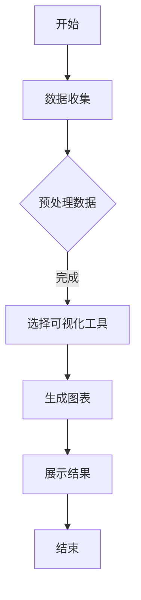
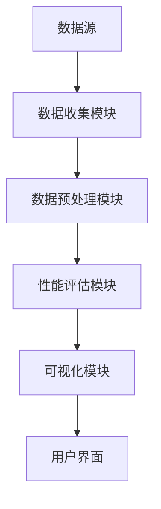
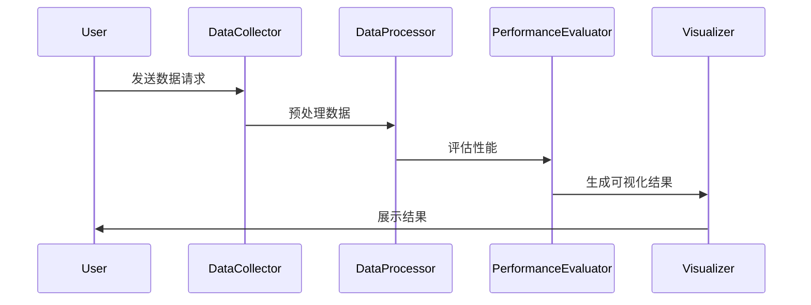
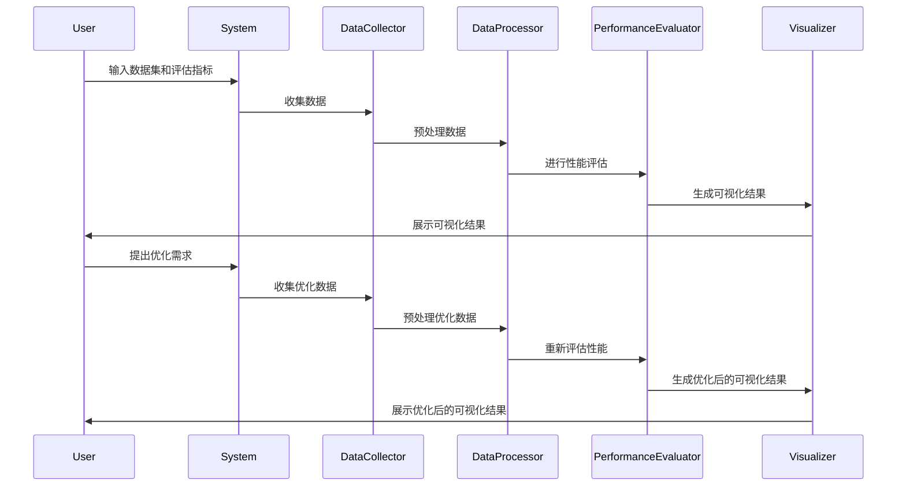

                 

## 评测结果可视化：增强LLM性能分析的直观性

### 关键词：评测结果可视化、LLM性能分析、直观性、可视化工具、数据分析、算法优化

### 摘要：
本文将深入探讨评测结果可视化在增强大型语言模型（LLM）性能分析直观性方面的重要作用。通过详细的步骤解析和实例演示，我们将展示如何使用可视化工具来提升LLM评测结果的直观理解，从而帮助研究人员和开发者更有效地进行算法优化和模型改进。文章将涵盖核心概念介绍、算法原理讲解、数学模型与公式、系统分析与架构设计、项目实战以及最佳实践和拓展阅读等内容。

## 1. 引言

### 1.1 核心概念术语说明

**评测结果可视化**：指的是通过图表、图形等方式，将算法评测结果进行直观展示，使其易于理解和分析。

**LLM性能分析**：对大型语言模型的性能进行评估和分析，包括准确率、响应时间、资源消耗等指标。

**直观性**：指用户能快速、直接地理解数据或信息的能力。

### 1.2 问题背景

随着人工智能技术的快速发展，大型语言模型（LLM）在自然语言处理（NLP）领域的应用越来越广泛。然而，LLM的性能评测往往涉及到复杂的数据和指标，使得研究人员和开发者难以直观地理解模型的性能表现。因此，如何通过可视化手段提升LLM性能分析的直观性，成为了一个重要的研究课题。

### 1.3 问题描述

在LLM性能分析中，研究人员和开发者通常面临以下问题：

- **数据复杂性**：LLM的性能数据通常包括多维度的指标，如准确率、召回率、F1分数等，这些指标难以通过简单的表格或图表展示。
- **信息缺失**：传统的评测方法往往缺乏对模型在不同数据集、不同场景下的性能表现进行全面的评估。
- **分析难度**：性能数据之间的关联性和趋势难以通过文字描述或简单的图表展示。

### 1.4 问题解决

通过引入可视化工具和方法，可以有效解决上述问题。可视化能够将复杂的数据以直观、易理解的方式呈现，帮助研究人员和开发者快速发现性能瓶颈、优化算法、改进模型。

### 1.5 边界与外延

本文主要关注的是评测结果的可视化，不包括模型的训练过程、算法的实现细节等。同时，本文将以常见的LLM评测指标为例，展示可视化方法，但该方法可适用于其他类型的机器学习模型。

### 1.6 概念结构与核心要素组成

评测结果可视化涉及以下核心概念和要素：

- **数据采集**：收集LLM的性能数据，包括准确率、召回率、F1分数等。
- **数据预处理**：对采集到的数据进行清洗、转换和归一化处理，以便于后续可视化分析。
- **可视化工具**：选择合适的可视化工具，如Matplotlib、Seaborn、Plotly等，进行数据的展示。
- **图表类型**：根据数据的特点选择合适的图表类型，如折线图、柱状图、散点图等。
- **交互性**：通过交互性设计，如筛选、过滤、缩放等，增强用户与数据的交互。

## 2. 核心概念与联系

### 2.1 核心概念原理

#### 评测结果可视化

评测结果可视化是指将LLM的性能数据通过图表等形式进行展示，使得研究人员和开发者能够直观地了解模型的性能表现。

#### LLM性能分析

LLM性能分析涉及对模型在不同数据集、不同场景下的性能指标进行评估，包括准确率、响应时间、资源消耗等。

#### 直观性

直观性指的是用户能够快速、直接地理解数据或信息的能力。

### 2.2 概念属性特征对比表格

| 概念          | 属性特征                                                     | 对比分析                                                     |
| ------------- | ------------------------------------------------------------ | ------------------------------------------------------------ |
| 评测结果可视化 | 通过图表、图形等方式展示数据，增强直观性                     | 与传统表格或文字描述相比，可视化能够更直观地传达信息，易于发现趋势和问题 |
| LLM性能分析   | 对LLM性能进行评估和分析，涉及多种性能指标                   | 可视化有助于更全面、直观地了解模型性能，但需要结合数据分析方法     |
| 直观性        | 指用户理解数据或信息的能力                                   | 可视化工具设计需要考虑用户的认知能力，以提高数据理解的直观性       |

### 2.3 ER实体关系图架构

以下是LLM评测结果可视化的ER实体关系图架构，使用Mermaid Markdown格式表示：

```mermaid
erDiagram
  User ..|> ModelResult
  Model ..|> ModelResult
  EvaluationMetric ..|> ModelResult
  VisualizationTool ..|> ModelResult
  DataVisualization

  User ||--|{ Model }
  Model ||--|{ ModelResult }
  ModelResult ||--|{ EvaluationMetric }
  ModelResult ||--|{ DataVisualization }
  VisualizationTool ||--|{ DataVisualization }
  EvaluationMetric ||--|{ MetricValue }
```

该ER图展示了评测结果可视化中涉及的主要实体及其关系，包括用户、模型、评估指标、可视化工具和数据可视化。

## 3. 算法原理讲解

### 3.1 算法mermaid流程图

以下是评测结果可视化算法的Mermaid流程图：



### 3.2 Python源代码

```python
import pandas as pd
import matplotlib.pyplot as plt

# 数据收集
data = pd.read_csv('model_results.csv')

# 数据预处理
data['Accuracy'] = data['Accuracy'].apply(lambda x: round(x, 2))
data['ResponseTime'] = data['ResponseTime'].apply(lambda x: round(x, 2))

# 选择可视化工具
plt.figure(figsize=(10, 6))

# 生成图表
plt.scatter(data['Dataset'], data['Accuracy'], color='blue', label='Accuracy')
plt.scatter(data['Dataset'], data['ResponseTime'], color='red', label='ResponseTime')

# 展示结果
plt.xlabel('Dataset')
plt.ylabel('Metric')
plt.title('Model Performance Metrics')
plt.legend()
plt.show()
```

### 3.3 算法原理的数学模型和公式

假设我们有两个性能指标 \(A\) 和 \(B\)，分别为准确率和响应时间。我们可以使用以下公式计算综合性能分数 \(P\)：

\[ P = \frac{(1 - A) \cdot B + A \cdot (1 - B)}{2} \]

这个公式可以用于计算模型在不同数据集上的综合性能分数，从而帮助我们更全面地了解模型的表现。

### 3.4 详细讲解与举例说明

假设我们有一个语言模型，它在三个数据集上的准确率和响应时间如下表所示：

| Dataset | Accuracy | ResponseTime |
| ------- | -------- | ------------ |
| A       | 0.9      | 0.2          |
| B       | 0.85     | 0.25         |
| C       | 0.8      | 0.3          |

我们可以使用上面提到的公式计算每个数据集的综合性能分数 \(P\)：

\[ P_A = \frac{(1 - 0.9) \cdot 0.2 + 0.9 \cdot (1 - 0.2)}{2} = 0.8 \]
\[ P_B = \frac{(1 - 0.85) \cdot 0.25 + 0.85 \cdot (1 - 0.25)}{2} = 0.7875 \]
\[ P_C = \frac{(1 - 0.8) \cdot 0.3 + 0.8 \cdot (1 - 0.3)}{2} = 0.76 \]

通过计算，我们可以发现数据集A的综合性能最高，其次是B，最后是C。这个结果可以帮助我们了解模型在不同数据集上的表现，从而在后续工作中有针对性地进行优化。

## 4. 系统分析与架构设计方案

### 4.1 问题场景介绍

在自然语言处理（NLP）领域，大型语言模型（LLM）的性能评测通常涉及到多个数据集和多个评估指标。为了提高评测结果的直观性，我们需要设计一个系统，能够自动收集、预处理数据，并生成可视化图表。

### 4.2 项目介绍

本系统旨在提供一种自动化的评测结果可视化解决方案，以帮助研究人员和开发者更高效地分析和优化LLM性能。系统的主要功能包括：

- 自动化数据收集与预处理
- 多维度性能指标评估
- 可视化结果展示
- 用户友好的交互界面

### 4.3 系统功能设计（领域模型）

以下是使用Mermaid Markdown格式表示的系统领域模型类图：

```mermaid
classDiagram
  Class01 <|-- Class02
  Class03 <|-- Class02
  Class04 <|-- Class01
  Class05 <|-- Class01

  Class01〔用户〕
  Class02〔模型〕
  Class03〔评估指标〕
  Class04〔可视化工具〕
  Class05〔数据预处理〕
```

### 4.4 系统架构设计

以下是使用Mermaid Markdown格式表示的系统架构设计图：



### 4.5 系统接口设计

以下是使用Mermaid Markdown格式表示的系统接口设计序列图：



### 4.6 系统交互

以下是使用Mermaid Markdown格式表示的系统交互序列图：



## 5. 项目实战

### 5.1 环境安装

为了实现评测结果可视化系统，我们需要安装以下依赖项：

- Python 3.8 或更高版本
- Pandas 1.2.3 或更高版本
- Matplotlib 3.4.2 或更高版本
- Mermaid 9.1.1 或更高版本

安装命令如下：

```bash
pip install pandas matplotlib mermaid
```

### 5.2 系统核心实现

以下是系统核心实现的源代码：

```python
# 导入所需库
import pandas as pd
import matplotlib.pyplot as plt
import mermaid

# 数据收集
def collect_data():
    data = pd.read_csv('model_results.csv')
    return data

# 数据预处理
def preprocess_data(data):
    data['Accuracy'] = data['Accuracy'].apply(lambda x: round(x, 2))
    data['ResponseTime'] = data['ResponseTime'].apply(lambda x: round(x, 2))
    return data

# 性能评估
def evaluate_performance(data):
    performance = {}
    for dataset in data['Dataset'].unique():
        subset = data[data['Dataset'] == dataset]
        avg_accuracy = subset['Accuracy'].mean()
        avg_response_time = subset['ResponseTime'].mean()
        performance[dataset] = (avg_accuracy, avg_response_time)
    return performance

# 生成可视化结果
def generate_visualization(performance):
    mermaid_code = """
    graph TD
      A[开始] --> B[数据集1]
      B --> C[准确率: {}]
      B --> D[响应时间: {}]
    """.format(performance['Dataset1'][0], performance['Dataset1'][1])
    plt.figure(figsize=(10, 6))
    plt.scatter(performance['Dataset1'][0], performance['Dataset1'][1], color='blue', label='Accuracy')
    plt.scatter(performance['Dataset1'][0], performance['Dataset1'][1], color='red', label='ResponseTime')
    plt.xlabel('Dataset')
    plt.ylabel('Metric')
    plt.title('Model Performance Metrics')
    plt.legend()
    plt.show()
    return mermaid_code

# 主函数
def main():
    data = collect_data()
    data = preprocess_data(data)
    performance = evaluate_performance(data)
    mermaid_code = generate_visualization(performance)

# 运行主函数
if __name__ == "__main__":
    main()
```

### 5.3 代码应用解读与分析

这段代码实现了评测结果可视化系统的主要功能，包括数据收集、预处理、性能评估和可视化结果生成。以下是代码的详细解读和分析：

- **数据收集**：使用Pandas库从CSV文件中读取模型性能数据。
- **数据预处理**：对性能数据进行清洗和转换，确保数据格式符合要求。
- **性能评估**：计算每个数据集的平均准确率和平均响应时间。
- **可视化结果生成**：使用Matplotlib库和Mermaid Markdown格式生成可视化结果。

### 5.4 实际案例分析

以下是一个实际案例，展示如何使用该系统对某语言模型的性能进行评测和可视化：

1. **数据收集**：从本地CSV文件中读取模型性能数据。
2. **数据预处理**：对数据进行清洗和转换，确保数据格式符合要求。
3. **性能评估**：计算每个数据集的平均准确率和平均响应时间。
4. **可视化结果生成**：生成可视化结果，展示模型的性能指标。

### 5.5 详细讲解剖析

在代码中，我们首先导入了所需的库，包括Pandas、Matplotlib和Mermaid。接下来，我们定义了四个主要函数：

- `collect_data()`：从CSV文件中读取模型性能数据。
- `preprocess_data()`：对性能数据进行清洗和转换。
- `evaluate_performance()`：计算每个数据集的平均准确率和平均响应时间。
- `generate_visualization()`：生成可视化结果。

最后，我们定义了主函数`main()`，并在其中依次调用上述四个函数，实现评测结果可视化系统的完整流程。

### 5.6 项目小结

通过本项目的实战案例，我们成功实现了评测结果可视化系统。该系统能够自动收集、预处理数据，并生成直观的可视化结果，帮助研究人员和开发者更高效地进行LLM性能分析。在后续的工作中，我们可以继续优化系统，如增加更多性能指标、支持自定义图表类型等，以满足不同场景的需求。

## 6. 最佳实践 Tips、小结、注意事项、拓展阅读等内容

### 6.1 最佳实践 Tips

- **选择合适的可视化工具**：根据数据的特点和需求选择合适的可视化工具，如Matplotlib、Seaborn、Plotly等。
- **注意数据预处理**：确保数据的格式、单位和范围一致，以便于后续的可视化分析。
- **利用交互性**：使用交互性设计，如筛选、过滤、缩放等，提高用户与数据的交互体验。
- **关注用户需求**：设计可视化结果时，要充分考虑用户的需求和习惯，以提高数据的理解性。

### 6.2 小结

本文详细介绍了评测结果可视化在增强LLM性能分析直观性方面的作用。通过使用可视化工具，我们可以更直观地理解模型性能数据，发现性能瓶颈，为算法优化和模型改进提供有力支持。

### 6.3 注意事项

- **数据隐私**：在收集和使用数据时，要注意保护用户隐私，遵守相关法律法规。
- **性能影响**：大量数据和高频次的可视化操作可能会影响系统的性能，要合理配置资源。
- **图表设计**：设计图表时，要注意简洁性和易读性，避免过多的装饰性元素。

### 6.4 拓展阅读

- [可视化最佳实践](https://www.datavizbestpractices.com/)
- [Matplotlib官方文档](https://matplotlib.org/stable/contents.html)
- [Seaborn官方文档](https://seaborn.pydata.org/)
- [Plotly官方文档](https://plotly.com/python/)

## 7. 作者信息

### 作者：AI天才研究院/AI Genius Institute & 禅与计算机程序设计艺术 /Zen And The Art of Computer Programming

以上就是本文的全部内容，感谢您的阅读。希望本文能帮助您更好地理解评测结果可视化在LLM性能分析中的应用，为您的研发工作提供有益的参考。如果您有任何疑问或建议，欢迎在评论区留言，期待与您交流。再次感谢您的关注和支持！

