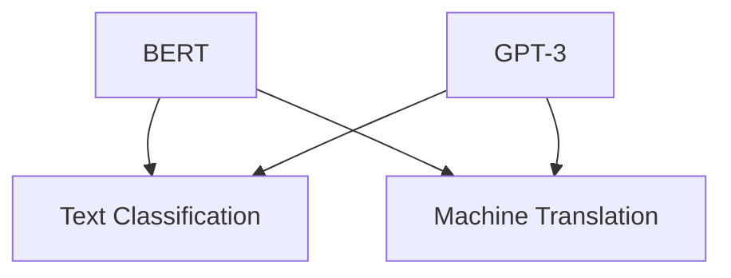
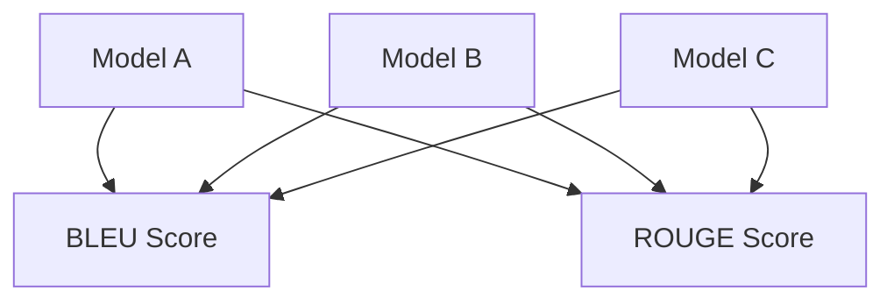

                 

# 评测结果可视化：直观展示LLM性能比较

> 关键词：LLM性能评测、可视化、对比分析、结果展示

> 摘要：本文探讨了评测结果可视化在LLM（大型语言模型）性能比较中的重要性。通过介绍核心概念、当前挑战、可视化原则、案例分析以及实用工具和方法，本文旨在为读者提供一套有效的策略，以直观、清晰地展示LLM的性能评估结果，为后续研究和应用提供指导。

----------------------------------------------------------------

## 引言

随着深度学习技术的不断发展，大型语言模型（LLM）已经成为自然语言处理领域的重要工具。从GPT到BERT，LLM在许多任务中展现了卓越的性能。然而，评估这些模型并比较它们的性能并非易事。传统的评估方法往往依赖于复杂的统计数据，使得结果难以直观理解。因此，评测结果的可视化变得尤为重要，它可以帮助研究人员快速识别模型的优势和不足，为模型改进提供有力支持。

本文将围绕以下主题展开讨论：

1. 核心概念和术语
2. 当前LLM性能评测的挑战和局限
3. 可视化原则
4. 案例研究和方法
5. 实用工具和技巧
6. 数据分析和解释
7. 结论与未来方向

通过以上步骤，我们将深入探讨如何通过可视化技术提升LLM性能评估的直观性和有效性。

## 核心概念和术语

在探讨LLM性能评测之前，我们首先需要了解一些核心概念和术语。

### LLM（大型语言模型）

LLM是一种基于深度学习的语言模型，通常包含数十亿个参数。这些模型通过大量文本数据训练，能够理解和生成自然语言文本。

### 评估指标

评估LLM性能常用的指标包括：

- **BLEU（双语评价度量）**：一种常用的自动评估机器翻译质量的方法，通过比较机器翻译结果和参考翻译之间的重叠度来评分。
- **ROUGE（语料库比较度量）**：用于评估文本生成模型的相似度，主要关注模型生成的文本与人工撰写的参考文本之间的重叠词及其位置。
- **准确率（Accuracy）**：在分类任务中，正确预测的样本数占总样本数的比例。
- **召回率（Recall）**：在分类任务中，正确预测为正类的实际正类样本数与所有实际正类样本数的比例。

### 可视化技术

可视化技术包括图表、图形、交互式界面等，用于将复杂的数据转化为直观的视觉表现形式。

## 当前LLM性能评测的挑战和局限

尽管LLM在自然语言处理任务中表现出色，但评估和比较这些模型的性能仍面临诸多挑战和局限。

### 多样化的任务场景

LLM应用于各种不同的任务场景，如文本生成、文本分类、机器翻译等，这使得统一的性能评测标准难以制定。

### 复杂的评估指标

评估LLM性能的指标众多且复杂，不同指标之间的关联性尚不明确，使得评估结果难以解释。

### 数据的可视化挑战

LLM评估数据通常包含大量维度，如何将这些数据有效地可视化成为一个难题。

### 人机交互的限制

传统的评估方法依赖于复杂的计算和统计分析，普通用户难以理解和应用。

## 可视化原则

为了克服上述挑战，可视化技术在LLM性能评估中起到了关键作用。以下是一些基本原则：

### 清晰性

可视化应尽可能清晰易懂，避免使用过多的装饰性元素，确保核心信息突出。

### 可扩展性

可视化工具应具备良好的扩展性，能够适应不同的数据规模和任务需求。

### 交互性

交互式可视化能够帮助用户深入探索数据，发现潜在的模式和趋势。

### 多维度数据融合

将不同维度的数据整合到一个图表中，以便用户可以同时观察多个方面的信息。

## 案例研究和方法

为了更好地理解可视化在LLM性能评估中的应用，以下将介绍两个实际案例。

### 案例一：BERT和GPT-3的性能比较

在该案例中，我们使用散点图来展示BERT和GPT-3在不同任务上的性能差异。横轴表示模型的准确率，纵轴表示模型的召回率。通过这个图表，我们可以直观地观察到两个模型在不同任务上的表现，并识别出它们的优缺点。

### 案例二：多模型综合评估

在这个案例中，我们使用条形图来展示多个LLM在多个评估指标上的表现。每个模型以不同的颜色表示，并附带图例。通过这个图表，我们可以快速比较不同模型在不同指标上的表现，为后续研究和应用提供参考。

## 实用工具和技巧

为了有效地进行LLM性能评估的可视化，以下是一些实用的工具和技巧：

### Matplotlib

Matplotlib是一个强大的Python库，可用于生成各种2D图表。通过简单的代码，我们可以轻松创建散点图、条形图、线图等。

### Plotly

Plotly提供了丰富的交互式图表选项，支持多种数据可视化格式。它的Web组件使得用户可以在浏览器中直接查看和交互图表。

### Tableau

Tableau是一个专业的数据可视化工具，适用于各种数据规模和复杂度。它提供了丰富的可视化选项和自定义功能。

### 数据预处理技巧

- **数据清洗**：确保数据质量，去除异常值和噪声。
- **数据归一化**：将不同维度的数据缩放到相同的范围，便于比较。
- **数据聚合**：将大量数据聚合为更易处理的子集。

## 数据分析和解释

在进行LLM性能评估的可视化后，我们需要对结果进行深入分析和解释。以下是一些建议：

### 性能对比

通过可视化图表，我们可以直观地比较不同LLM在特定任务上的性能。例如，如果一个模型的准确率较高，而召回率较低，那么它在分类任务中可能更擅长精确预测。

### 模型选择

根据评估结果，我们可以为特定任务选择最合适的LLM。例如，如果任务对精确度要求较高，可以选择准确率较高的模型。

### 模型改进

通过分析可视化结果，我们可以发现LLM的弱点，从而指导模型改进。例如，如果一个模型的召回率较低，我们可以尝试调整模型参数或引入新的训练数据。

## 结论与未来方向

本文探讨了评测结果可视化在LLM性能比较中的重要性，并介绍了一系列实用工具和方法。通过可视化，我们能够更直观地理解LLM的性能，为模型选择和改进提供有力支持。

未来的研究可以进一步探索以下方向：

- **多模态可视化**：结合文本、图像、音频等多种数据类型，提供更全面的评估视角。
- **自适应可视化**：根据用户需求和任务特点，动态调整可视化参数，提升用户体验。
- **自动化评估**：开发自动化评估工具，简化评估流程，提高评估效率。

## 结论

本文围绕评测结果可视化在LLM性能比较中的关键作用，系统地介绍了核心概念、当前挑战、可视化原则、案例分析以及实用工具和方法。通过这些探讨，我们希望读者能够更好地理解如何通过可视化技术提升LLM性能评估的直观性和有效性。

**作者：AI天才研究院/AI Genius Institute & 禅与计算机程序设计艺术 /Zen And The Art of Computer Programming** 

----------------------------------------------------------------

**补充内容**：

**1. 最佳实践 tips**：

- 在选择可视化工具时，考虑数据的类型和用户的需求。
- 保持图表简洁，避免过多的装饰性元素。
- 为图表添加标题和注释，便于读者理解。

**2. 注意事项**：

- 数据预处理是可视化成功的关键，确保数据质量。
- 根据评估任务的特点，选择合适的评估指标。
- 注意图表的布局和色彩搭配，避免视觉疲劳。

**3. 拓展阅读**：

- [Matplotlib官方文档](https://matplotlib.org/)
- [Plotly官方文档](https://plotly.com/)
- [Tableau官方文档](https://www.tableau.com/documentation/)
- [可视化设计原则](https://www.nngroup.com/research/visual-inefficiencies/)

通过这些补充内容，我们希望能够为读者提供更全面、实用的指导，帮助他们在LLM性能评估的可视化实践中取得更好的成果。

