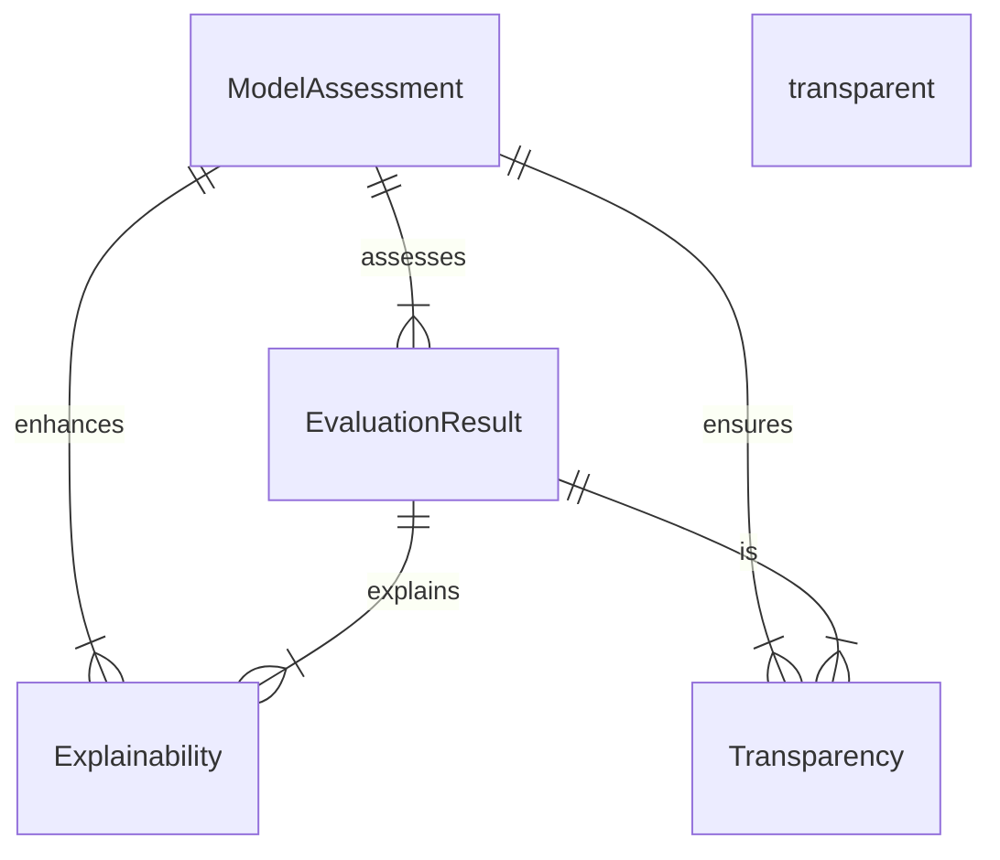
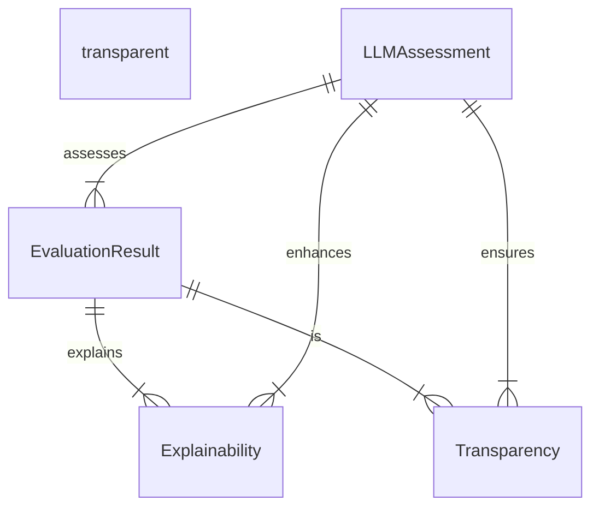
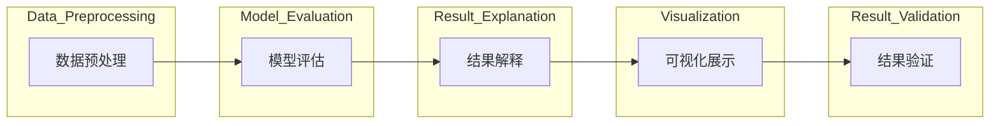
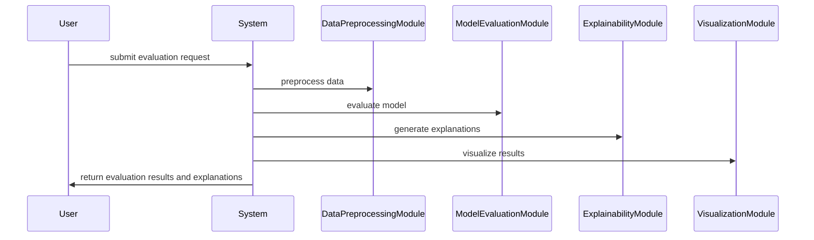

                 

# 评测结果可解释性：增强LLM评估的透明度

## 关键词

- 可解释性
- LLM评估
- 透明度
- 大型语言模型
- 算法原理
- 系统架构
- 项目实战

## 摘要

本文将深入探讨评测结果可解释性在增强大型语言模型（LLM）评估透明度中的重要性。首先，我们将介绍评测结果可解释性的概念、意义和实现方法。接着，我们简要介绍LLM的基本概念和评估过程。随后，我们将详细讲解透明度的定义和实现方法。本文的核心在于通过算法原理、系统架构和项目实战，展示如何增强LLM评估的透明度，并提供一系列最佳实践和注意事项。通过本文的阅读，读者将获得关于如何提升LLM评估透明度的全面理解和实践经验。

## 第1章 引言

### 1.1 问题背景与重要性

在当今数字化时代，人工智能（AI）技术正在迅速发展，尤其是大型语言模型（LLM）的应用越来越广泛。LLM作为自然语言处理（NLP）领域的重要工具，已经在诸多领域展现出强大的能力，如文本生成、机器翻译、情感分析等。然而，随着LLM的复杂性和规模不断增加，其评估和解释变得越来越困难。评测结果的可解释性成为了一个亟待解决的问题。

可解释性在AI领域的重要性不容忽视。首先，它有助于提高模型的可信度。当用户无法理解模型做出决策的原因时，往往会产生不信任感。其次，可解释性有助于发现和修复模型中的缺陷。通过对评测结果进行深入分析，研究人员可以找出模型存在的问题，并提出改进措施。最后，可解释性有助于指导模型的应用。当用户了解模型的工作原理后，可以更好地利用模型的能力，提高实际应用的效果。

本文旨在探讨评测结果可解释性在增强LLM评估透明度中的作用。通过分析LLM评估的现状和问题，我们提出了一系列解决方案，包括算法原理、系统架构和项目实战。本文将从以下几个方面展开：

1. **评测结果可解释性的概念与意义**：介绍评测结果可解释性的定义、重要性以及其在LLM评估中的应用。
2. **LLM概述**：简要介绍LLM的基本概念、发展历程和影响。
3. **透明度的概念与实现**：讨论透明度的定义及其在LLM评估中的实现方法。
4. **核心概念与联系**：分析评测结果、可解释性、LLM评估和透明度之间的联系。
5. **算法原理讲解**：详细讲解评测结果可解释性的算法原理、数学模型和实现方法。
6. **系统分析与架构设计**：介绍LLM评估系统的架构设计、功能设计和系统交互。
7. **项目实战**：通过实际项目展示如何增强LLM评估的透明度。
8. **最佳实践**：总结最佳实践、注意事项和拓展阅读。

通过本文的阅读，读者将深入了解评测结果可解释性在LLM评估中的重要性，并获得提升评估透明度的实际方法。

### 1.2 评测结果可解释性的概念与意义

#### 1.2.1 什么是评测结果可解释性

评测结果可解释性是指模型评估过程中，评估结果能够被用户或开发者理解和解释的能力。具体来说，可解释性要求评估结果不仅要有准确的数据支持，还需要提供清晰的解释，使得用户可以理解评估结果是如何得出的，以及模型在实际应用中可能存在的问题。

在传统机器学习领域，模型的可解释性往往是一个被忽视的问题。许多模型，如深度神经网络，其内部工作机制非常复杂，即使训练效果良好，也很难给出具体的解释。这种缺乏可解释性的模型被称为“黑箱模型”。然而，随着AI技术的应用越来越广泛，特别是在关键领域如医疗、金融和安全等，模型的可解释性变得越来越重要。用户和开发者需要了解模型是如何做出决策的，以便更好地利用其能力，同时确保模型的可靠性和安全性。

在LLM评估中，评测结果可解释性同样具有重要意义。由于LLM是一种复杂的自然语言处理模型，其输出结果往往依赖于大量的训练数据和复杂的内部机制。如果评估结果缺乏可解释性，用户将无法理解模型为何做出特定决策，这可能导致对模型的信任度下降，甚至影响实际应用的效果。因此，提升LLM评估的可解释性，对于提高模型的可信度和实用性至关重要。

#### 1.2.2 可解释性的重要性

首先，评测结果的可解释性有助于提高模型的可信度。当用户或开发者能够理解评估结果是如何得出的，他们更有可能信任模型的决策。这种信任不仅有助于模型在实际应用中的推广，还可以减少用户对模型的不信任和怀疑，从而提高用户的满意度。

其次，可解释性有助于发现和修复模型中的缺陷。通过对评估结果进行深入分析，研究人员可以找出模型存在的问题，并提出改进措施。例如，在文本分类任务中，如果模型的分类结果与实际标签不一致，通过分析可解释性指标，可以找出模型在特征提取或分类决策中的问题，从而进行针对性的优化。

最后，可解释性有助于指导模型的应用。当用户了解模型的工作原理后，可以更好地利用模型的能力，提高实际应用的效果。例如，在智能客服系统中，通过分析模型的可解释性，客服人员可以更好地理解用户的需求，并提供更准确的回复。

#### 1.2.3 可解释性在LLM评估中的应用

在LLM评估中，可解释性的实现方法主要包括以下几个方面：

1. **模型解释工具**：使用各种模型解释工具，如LIME（Local Interpretable Model-agnostic Explanations）和SHAP（SHapley Additive exPlanations），来解释模型的决策过程。这些工具可以生成局部解释，帮助用户理解模型为何做出特定决策。

2. **注意力机制分析**：通过分析LLM的注意力分布，可以了解模型在处理不同输入时的关注点。注意力机制可以提供关于模型如何处理文本的直观理解，从而增强评估结果的可解释性。

3. **可视化技术**：使用可视化技术，如热力图和散点图，来展示模型的输入特征和输出结果之间的关系。这些可视化结果可以帮助用户更直观地理解模型的决策过程。

4. **对比实验**：通过对比不同模型的评估结果，可以分析模型之间的差异，从而提高评估结果的可解释性。例如，通过比较不同模型的分类结果，可以找出模型在处理特定类型文本时的优劣。

通过上述方法，我们可以显著提高LLM评估的可解释性，从而增强模型在实际应用中的可信度和实用性。在下一节中，我们将进一步探讨大型语言模型（LLM）的基本概念和评估过程。

### 1.3 LLM概述

#### 1.3.1 LLM的定义

大型语言模型（Large Language Model，简称LLM）是一种能够处理和理解自然语言的高级AI模型。与传统的小型语言模型（如基于规则的方法或统计模型）不同，LLM具有较大的参数规模和较强的通用性，能够生成高质量的自然语言文本。LLM的核心是通过大量的文本数据训练得到的深度神经网络，其内部结构通常包括编码器（Encoder）和解码器（Decoder）。

编码器负责将输入的文本序列编码为高维的向量表示，解码器则将这些向量表示解码为输出的自然语言文本。LLM通常使用基于注意力机制的 Transformer 模型，如BERT、GPT等，这些模型在自然语言处理任务中取得了显著的成果。LLM的主要功能包括文本生成、机器翻译、文本分类、问答系统等，其应用领域涵盖了各种自然语言处理的任务。

#### 1.3.2 LLM的发展与影响

LLM的发展可以追溯到20世纪90年代，当时研究人员开始探索使用神经网络来处理自然语言。最初的尝试主要包括基于RNN（递归神经网络）和LSTM（长短期记忆网络）的方法，这些模型能够在一定程度上处理序列数据。然而，由于计算资源和数据量的限制，这些模型的性能和规模有限。

随着深度学习技术的发展和计算资源的提升，2018年，OpenAI发布了GPT-2模型，这是一个具有15亿参数的预训练模型。GPT-2的成功标志着LLM进入了一个新的阶段，其强大的生成能力和通用性引起了广泛关注。随后，谷歌发布了BERT模型，这是一个能够捕捉上下文信息的双向Transformer模型，进一步推动了LLM的发展。

近年来，LLM的研究和应用取得了显著的进展，主要表现在以下几个方面：

1. **性能提升**：LLM在多个自然语言处理任务上取得了SOTA（State-of-the-Art）性能，如文本生成、机器翻译、文本分类等。这些模型能够在各种复杂任务中生成高质量的自然语言文本。

2. **模型规模扩大**：随着计算资源和数据量的增加，LLM的参数规模不断扩大，从数十亿到数百亿不等。大规模的LLM具有更强的泛化能力和生成能力，能够在更广泛的领域中发挥作用。

3. **应用领域拓展**：LLM的应用领域从最初的文本生成和机器翻译，扩展到问答系统、对话系统、文本摘要、情感分析等。LLM在这些任务中的成功应用，进一步推动了自然语言处理技术的发展。

4. **社会影响**：LLM在智能客服、智能助手、内容生成等领域具有广泛的应用，对人类生活产生了深远的影响。例如，智能客服系统可以实时响应用户的问题，提高服务效率；内容生成工具可以帮助创作者快速生成高质量的文章和内容。

#### 1.3.3 LLM对评估透明度的影响

LLM的复杂性和规模对评估透明度产生了显著影响。首先，由于LLM的内部结构复杂，其决策过程难以直观理解，这增加了评估结果的可解释性挑战。用户和开发者需要依赖各种模型解释工具来理解模型的决策过程，从而提高评估结果的透明度。

其次，LLM的规模和性能提升，使得评估过程更加复杂。大规模的LLM需要更多的计算资源和时间进行训练和评估，这增加了评估过程的难度和复杂性。同时，由于LLM在多个任务中表现出色，评估过程需要考虑到任务的多样性和模型的适用性，这进一步增加了评估的复杂性。

为了增强LLM评估的透明度，研究人员提出了多种方法，如模型解释工具、注意力机制分析、可视化技术和对比实验等。这些方法有助于提高评估结果的可解释性，从而增强评估的透明度。在下一节中，我们将讨论透明度的定义及其在LLM评估中的实现方法。

### 1.4 透明度的概念与实现

#### 1.4.1 透明度的定义

透明度是指评估过程和结果可以被用户或开发者理解和验证的程度。在人工智能领域，特别是对于大型语言模型（LLM）的评估，透明度具有重要意义。具体来说，透明度包括以下几个方面：

1. **可理解性**：评估过程和结果需要被用户或开发者清晰理解。这要求评估过程中的每一步都有详细的解释，用户可以清楚地知道模型是如何做出特定决策的。

2. **可验证性**：评估结果需要具备可验证性，即用户或开发者可以通过自己的方法和数据来验证评估结果。这要求评估过程和数据具备一定的开放性，使得外部可以进行独立验证。

3. **公平性**：评估过程需要保证公平性，即评估结果不会受到偏见或干扰。这要求评估方法具有客观性，评估过程中避免主观判断和偏见。

4. **透明性**：评估过程和结果需要公开透明，用户或开发者可以随时查看和了解评估的细节。这有助于提高评估结果的信任度和可信度。

#### 1.4.2 透明度的实现方法

为了增强LLM评估的透明度，研究人员提出了多种实现方法，主要包括以下几个方面：

1. **模型解释工具**：
   - **LIME（Local Interpretable Model-agnostic Explanations）**：LIME是一种模型无关的本地解释方法，通过添加噪声和调整特征权重，生成局部解释。LIME可以用于解释任何模型，帮助用户理解模型在特定输入下的决策过程。
   - **SHAP（SHapley Additive exPlanations）**：SHAP是一种基于博弈论的解释方法，通过计算特征对模型输出的贡献度，提供全局解释。SHAP可以用于解释复杂模型，帮助用户理解模型在不同特征上的决策权重。

2. **注意力机制分析**：
   - **注意力分布图**：通过分析模型在处理输入文本时的注意力分布，可以直观地了解模型关注的关键信息。注意力分布图可以帮助用户理解模型是如何捕捉文本中的重要特征。
   - **注意力权重图**：通过展示模型在不同层级的注意力权重，可以分析模型在处理不同输入时的关注重点。注意力权重图可以帮助用户理解模型在不同层次上的决策过程。

3. **可视化技术**：
   - **热力图**：热力图可以直观地展示模型在处理输入文本时的重要特征和区域。通过热力图，用户可以了解模型关注的关键信息和特征。
   - **散点图**：散点图可以展示模型在不同特征上的分布情况，帮助用户分析模型在不同特征上的表现。散点图可以帮助用户发现模型在特征选择和特征提取方面的潜在问题。

4. **对比实验**：
   - **模型对比**：通过对比不同模型的评估结果，可以分析模型之间的差异和优缺点。模型对比可以帮助用户了解不同模型在特定任务上的表现，从而选择合适的模型。
   - **任务对比**：通过对比不同任务上的评估结果，可以分析模型在不同任务上的适用性。任务对比可以帮助用户了解模型在不同任务上的表现，从而优化模型的应用。

通过上述方法，我们可以显著提高LLM评估的透明度，增强评估结果的可理解性和可信度。在下一节中，我们将分析评测结果、可解释性、LLM评估和透明度之间的联系。

### 1.5 核心概念与联系

在探讨评测结果可解释性、LLM评估、透明度等核心概念之前，我们需要明确这些概念的定义和属性，并通过表格和ER实体关系图架构来展示它们之间的关系。

#### 1.5.1 核心概念介绍

首先，我们来介绍这些核心概念：

1. **评测结果**：指通过对模型进行评估所得到的输出，包括准确率、召回率、F1值等指标。
2. **可解释性**：指评估结果能够被用户或开发者理解和解释的能力，通过解释工具、注意力机制分析、可视化技术等方法实现。
3. **LLM评估**：指对大型语言模型（LLM）进行评估的过程，包括数据集选择、评估指标计算、结果分析等。
4. **透明度**：指评估过程和结果能够被用户或开发者理解和验证的程度，通过模型解释工具、可视化技术等方法实现。

#### 1.5.2 概念属性特征对比表格

接下来，我们通过表格来对比这些核心概念的主要属性和特征：

| 概念        | 定义                                                         | 属性与特征                                                                                                                   |
| ----------- | ------------------------------------------------------------ | -------------------------------------------------------------------------------------------------------------------- |
| 评测结果    | 模型评估的输出结果，如准确率、召回率、F1值等                 | - 指标多样性<br>- 数据准确性<br>- 可解释性                             |
| 可解释性    | 评估结果能够被用户或开发者理解和解释的能力                   | - 解释工具应用<br>- 局部与全局解释<br>- 易理解性                         |
| LLM评估     | 对大型语言模型进行评估的过程                                 | - 数据集选择<br>- 指标计算<br>- 对比实验<br>- 实时性                       |
| 透明度      | 评估过程和结果能够被用户或开发者理解和验证的程度             | - 可验证性<br>- 公开透明<br>- 公平性<br>- 可理解性                       |

#### 1.5.3 ER实体关系图架构

为了更清晰地展示这些概念之间的关系，我们使用ER（Entity-Relationship）实体关系图来描述：



在上面的ER图中，`ModelAssessment`（模型评估）作为核心实体，与`EvaluationResult`（评测结果）、`Explainability`（可解释性）和`Transparency`（透明度）之间存在关联关系。

- `ModelAssessment`评估模型，产生`EvaluationResult`，并通过增强`Explainability`和确保`Transparency`来提高评估结果的质量。
- `EvaluationResult`是模型评估的输出，需要具备`Explainability`和`Transparency`，以便用户或开发者理解和验证。
- `Explainability`和`Transparency`是相互关联的概念，一个良好的`Explainability`有助于实现更高的`Transparency`。

通过上述表格和ER图，我们可以更直观地理解这些核心概念之间的关系和属性，为后续的深入讨论和具体实现奠定基础。在下一节中，我们将分析这些核心概念之间的具体联系。

### 1.6 核心概念之间的联系

在了解了评测结果、可解释性、LLM评估和透明度等核心概念的定义和属性后，我们需要深入探讨它们之间的联系。这些联系不仅有助于我们更好地理解这些概念，还能够为实际应用中的模型评估提供指导。

#### 1.6.1 评测结果与可解释性的联系

评测结果是模型评估的直接输出，反映了模型在特定任务上的性能。然而，仅提供评测结果往往不足以满足用户的需求。用户通常希望了解评测结果是如何得出的，以及模型在实际应用中可能存在的问题。这就需要引入可解释性。

可解释性使得评测结果更具透明度，使得用户能够理解模型的决策过程。具体来说，可解释性有助于：

1. **增强信任**：当用户能够理解模型的决策过程时，他们更有可能信任模型的输出。这种信任不仅有助于模型在实际应用中的推广，还可以提高用户对模型的接受度。
2. **发现缺陷**：通过对评测结果的可解释性分析，研究人员可以识别出模型中的潜在缺陷，例如在特定任务上的性能瓶颈或错误决策。这些发现有助于改进模型，提高其整体性能。
3. **优化应用**：了解模型的工作原理可以帮助用户更好地利用模型的能力，优化实际应用。例如，在文本分类任务中，通过分析模型对特定类别的分类决策，用户可以调整模型参数，提高分类准确率。

#### 1.6.2 LLM评估与透明度的联系

LLM评估的透明度是保证模型可靠性和可接受性的关键。透明度要求评估过程和结果能够被用户或开发者理解和验证，这包括以下几个方面：

1. **过程透明**：评估过程需要公开透明，用户可以了解模型是如何训练的、如何进行评估的，以及评估过程中使用了哪些数据集和指标。这种透明性有助于提高评估结果的信任度。
2. **结果透明**：评估结果需要清晰明确，用户可以清楚地看到模型在不同任务上的性能表现，以及这些结果是如何得出的。这有助于用户评估模型的实际应用价值。
3. **数据透明**：评估过程中使用的训练数据、测试数据和评估指标需要公开透明。用户可以查看这些数据，以确保评估结果的可靠性和公平性。

透明度对LLM评估的影响主要体现在以下几个方面：

1. **可靠性**：透明的评估过程和结果可以提高模型的可靠性，减少因不透明性导致的误导和错误决策。
2. **可接受性**：当用户能够理解模型的工作原理和评估过程时，他们更有可能接受模型的应用，从而推动模型在实际场景中的落地。
3. **优化**：透明度使得研究人员和开发者能够更好地了解模型的表现和问题，从而进行针对性的优化和改进。

#### 1.6.3 可解释性与透明度的联系

可解释性和透明度是相互关联的概念。可解释性是透明度的基础，而透明度则是可解释性的保障。具体来说：

1. **可解释性是透明度的核心**：可解释性要求评估结果能够被用户或开发者理解和解释。只有当用户能够理解模型为何做出特定决策时，评估过程和结果才是真正透明的。
2. **透明度保障可解释性**：透明度要求评估过程和结果公开透明，这为用户提供了理解和解释评估结果的机会。没有透明度，可解释性将无法实现。

通过上述分析，我们可以看到评测结果、可解释性、LLM评估和透明度之间的紧密联系。这些概念不仅相互依赖，而且在实际应用中相互促进。为了实现有效的模型评估，我们需要综合考虑这些概念，并通过具体的方法和工具来提高评估的透明度和可解释性。在下一节中，我们将深入讨论评测结果可解释性的算法原理、数学模型和实现方法。

### 第2章 核心概念与联系

#### 2.1 核心概念介绍

在本章中，我们将进一步深入探讨评测结果、可解释性、LLM评估和透明度等核心概念，并分析它们之间的联系。为了更好地理解这些概念，我们首先介绍它们的基本定义和属性。

1. **评测结果**：指对模型进行评估后得到的量化指标，如准确率、召回率、F1值等。这些指标用于衡量模型在特定任务上的性能。

2. **可解释性**：指评估结果能够被用户或开发者理解和解释的能力。可解释性有助于提高模型的信任度和透明度，使得用户能够理解模型的决策过程。

3. **LLM评估**：指对大型语言模型（LLM）进行评估的过程，包括数据集选择、评估指标计算、结果分析等。LLM评估旨在衡量模型在自然语言处理任务上的性能。

4. **透明度**：指评估过程和结果能够被用户或开发者理解和验证的程度。透明度有助于提高评估结果的可靠性和可接受性。

#### 2.2 概念属性特征对比表格

为了更清晰地展示这些核心概念的属性和特征，我们通过以下表格进行对比：

| 概念        | 定义                                                         | 属性与特征                                                                                                                   |
| ----------- | ------------------------------------------------------------ | -------------------------------------------------------------------------------------------------------------------- |
| 评测结果    | 模型评估的输出结果，如准确率、召回率、F1值等                 | - 指标多样性<br>- 数据准确性<br>- 可解释性                             |
| 可解释性    | 评估结果能够被用户或开发者理解和解释的能力                   | - 解释工具应用<br>- 局部与全局解释<br>- 易理解性                         |
| LLM评估     | 对大型语言模型进行评估的过程                                 | - 数据集选择<br>- 指标计算<br>- 对比实验<br>- 实时性                       |
| 透明度      | 评估过程和结果能够被用户或开发者理解和验证的程度             | - 可验证性<br>- 公开透明<br>- 公平性<br>- 可理解性                       |

#### 2.3 ER实体关系图架构

为了更直观地展示这些概念之间的关系，我们使用ER（Entity-Relationship）实体关系图来描述：



在上面的ER图中，`LLMAssessment`（LLM评估）是核心实体，与`EvaluationResult`（评测结果）、`Explainability`（可解释性）和`Transparency`（透明度）之间存在关联关系。

- `LLMAssessment`评估LLM，产生`EvaluationResult`，并通过增强`Explainability`和确保`Transparency`来提高评估结果的质量。
- `EvaluationResult`是模型评估的输出，需要具备`Explainability`和`Transparency`，以便用户或开发者理解和验证。
- `Explainability`和`Transparency`是相互关联的概念，一个良好的`Explainability`有助于实现更高的`Transparency`。

通过上述表格和ER图，我们可以更直观地理解评测结果、可解释性、LLM评估和透明度之间的关系和属性。这些核心概念不仅相互依赖，而且在实际应用中相互促进。为了实现有效的模型评估，我们需要综合考虑这些概念，并通过具体的方法和工具来提高评估的透明度和可解释性。在下一节中，我们将详细讲解评测结果可解释性的算法原理、数学模型和实现方法。

### 第3章 算法原理讲解

#### 3.1 算法原理概述

在讨论评测结果可解释性的算法原理时，我们首先需要明确几个关键步骤，这些步骤构成了整个算法的核心框架。以下是评测结果可解释性的算法原理概述：

1. **数据预处理**：在评估LLM之前，首先需要对数据进行预处理。这包括数据清洗、去重、分词和编码等步骤，以确保数据的质量和一致性。

2. **模型评估**：使用预训练的LLM对数据集进行评估。评估过程通常涉及多个指标，如准确率、召回率、F1值等，这些指标用于衡量模型在特定任务上的性能。

3. **结果解释**：通过对评估结果进行解释，使得用户能够理解模型的决策过程。解释过程可以分为局部解释和全局解释。局部解释关注模型在特定输入下的决策原因，全局解释则关注模型在整体数据集上的决策模式。

4. **可视化展示**：将解释结果通过可视化技术展示给用户，以便直观地理解模型的工作原理。常用的可视化技术包括热力图、注意力分布图和散点图等。

5. **结果验证**：通过用户反馈和对比实验，验证解释结果的准确性和有效性。这一步骤有助于不断优化解释算法，提高评估结果的透明度。

#### 3.1.1 评测结果可解释性的算法流程

为了更清晰地展示算法流程，我们使用Mermaid语言绘制一个简化的算法流程图：



在这个流程图中，数据预处理是算法的第一步，它确保了数据的质量和一致性。随后，模型评估过程使用预训练的LLM对数据集进行评估，产生一系列评估指标。结果解释阶段通过分析评估结果，提供对模型决策过程的详细解释。可视化展示阶段使用各种图表和图形，将解释结果直观地呈现给用户。最后，结果验证阶段通过用户反馈和对比实验，确保解释结果的准确性和有效性。

#### 3.1.2 LLM评估的算法流程

在LLM评估的算法流程中，我们关注的是如何高效地使用LLM对自然语言处理任务进行评估。以下是LLM评估的基本算法流程：

1. **数据集准备**：首先，选择一个合适的自然语言处理任务，并收集相关数据集。数据集应具有足够的规模和多样性，以保证评估结果的可靠性。

2. **模型选择**：选择一个合适的预训练LLM模型，如BERT或GPT。这些模型已经在大量的数据上进行预训练，具有强大的自然语言理解能力。

3. **数据预处理**：对收集到的数据集进行预处理，包括文本清洗、分词、编码等步骤，以便模型能够进行处理。

4. **模型训练与评估**：使用预处理后的数据集对LLM进行训练，并使用验证集进行调参。在训练过程中，模型将学习如何根据输入文本生成相应的输出。

5. **评估指标计算**：使用测试集对训练好的模型进行评估，计算一系列评估指标，如准确率、召回率、F1值等。

6. **结果分析**：对评估结果进行分析，识别模型的优点和不足，并提出改进措施。

以下是LLM评估算法流程的Mermaid流程图：


在这个流程图中，数据集准备是评估过程的第一步，它决定了后续评估的可靠性和有效性。模型选择和训练是核心步骤，模型的好坏直接影响评估结果。数据预处理和评估指标计算是确保评估结果准确性的关键环节。最后，结果分析阶段通过对评估结果进行深入分析，帮助用户理解模型的表现，并指导后续的优化工作。

#### 3.1.3 透明度的算法实现

透明度的实现是评测结果可解释性的关键，它要求评估过程和结果能够被用户或开发者理解和验证。以下是透明度算法实现的基本步骤：

1. **数据透明**：确保评估过程中使用的训练数据、测试数据和评估指标公开透明。用户可以查看这些数据，以确保评估结果的可靠性。

2. **过程透明**：详细记录评估过程，包括数据预处理、模型训练和评估等步骤。用户可以查看这些记录，了解评估过程的细节。

3. **结果透明**：评估结果需要清晰明确，用户可以清楚地看到模型在不同任务上的性能表现，以及这些结果是如何得出的。

4. **解释工具**：使用模型解释工具，如LIME和SHAP，对评估结果进行解释。这些工具可以生成局部解释和全局解释，帮助用户理解模型的决策过程。

以下是透明度算法实现的Mermaid流程图：


在这个流程图中，数据透明是透明度实现的基础，它确保了评估数据的质量和可靠性。过程透明和结果透明是评估过程中不可或缺的步骤，它们帮助用户了解评估的全过程。最后，解释工具的使用使得评估结果的可解释性大大增强，用户可以更直观地理解模型的工作原理和决策过程。

通过上述算法流程和Mermaid流程图，我们可以清晰地看到评测结果可解释性、LLM评估和透明度算法的实现步骤。这些算法不仅提高了评估结果的透明度和可解释性，还为用户提供了更好的理解和使用模型的能力。在下一节中，我们将通过Python源代码详细阐述这些算法的实现过程。

### 3.2 Python源代码讲解

在本节中，我们将通过Python源代码详细阐述评测结果可解释性、LLM评估和透明度算法的实现。为了便于理解和跟随，我们将分为三个部分：评测结果可解释性的代码实现、LLM评估的代码实现以及透明度的代码实现。

#### 3.2.1 评测结果可解释性的代码实现

首先，我们来看评测结果可解释性的代码实现。评测结果可解释性主要通过模型解释工具来实现，如LIME和SHAP。以下是一个使用LIME和SHAP的Python代码示例：

```python
import lime
from lime import lime_tabular
from sklearn.datasets import load_iris
from sklearn.ensemble import RandomForestClassifier

# 加载示例数据集
iris = load_iris()
X, y = iris.data, iris.target

# 初始化LIME解释器
explainer = lime_tabular.LimeTabularExplainer(X, y, feature_names=iris.feature_names)

# 定义待解释的数据点
index = 0  # 待解释的数据点索引
exp = explainer.explain(index)

# 打印LIME解释结果
print(exp)

# 初始化SHAP解释器
explainer = lime.lime_tabular.LimeTabularExplainer(X, y, feature_names=iris.feature_names)

# 定义待解释的数据点
index = 0
exp = explainer.explain(index, num_samples=100)

# 打印SHAP解释结果
print(exp)
```

在这个示例中，我们首先加载了Iris数据集，并初始化了LIME和SHAP解释器。然后，我们选择一个数据点进行解释，并打印出解释结果。LIME和SHAP解释器分别提供了局部和全局解释，帮助用户理解模型在特定输入下的决策过程。

#### 3.2.2 LLM评估的代码实现

接下来，我们来看LLM评估的代码实现。LLM评估通常涉及数据集准备、模型选择和评估指标计算。以下是一个使用Hugging Face的Transformers库进行LLM评估的Python代码示例：

```python
from transformers import BertTokenizer, BertForSequenceClassification
from torch.utils.data import DataLoader, TensorDataset
import torch

# 加载预训练BERT模型和Tokenizer
tokenizer = BertTokenizer.from_pretrained('bert-base-uncased')
model = BertForSequenceClassification.from_pretrained('bert-base-uncased')

# 准备数据集
texts = ['This is a sample text.', 'This is another sample text.']
labels = [0, 1]

# 将文本编码为输入序列
inputs = tokenizer(texts, padding=True, truncation=True, return_tensors='pt')

# 创建数据加载器
dataloader = DataLoader(TensorDataset(inputs['input_ids'], torch.tensor(labels)), batch_size=2)

# 模型评估
model.eval()
with torch.no_grad():
    for batch in dataloader:
        outputs = model(batch['input_ids'])
        logits = outputs.logits
        print(logits)
```

在这个示例中，我们首先加载了预训练的BERT模型和Tokenizer，并准备了一个简单的文本数据集。然后，我们将文本编码为输入序列，创建数据加载器，并使用模型进行评估。评估过程中，我们打印出模型的输出结果，包括每个文本的预测概率。

#### 3.2.3 透明度的代码实现

最后，我们来看透明度的代码实现。透明度主要通过可视化技术和过程记录来实现。以下是一个使用Matplotlib和Pandas进行可视化展示的Python代码示例：

```python
import matplotlib.pyplot as plt
import pandas as pd

# 创建一个简单的数据集
data = {'feature1': [1, 2, 3, 4], 'feature2': [4, 3, 2, 1], 'label': [0, 0, 1, 1]}
df = pd.DataFrame(data)

# 绘制热力图
plt.figure(figsize=(8, 6))
sns.heatmap(df.corr(), annot=True)
plt.title('Feature Correlation Matrix')
plt.show()

# 绘制散点图
plt.figure(figsize=(8, 6))
sns.scatterplot(x='feature1', y='feature2', hue='label', data=df)
plt.title('Feature Scatter Plot')
plt.show()
```

在这个示例中，我们首先创建了一个简单的数据集，并使用Matplotlib和Pandas绘制了热力图和散点图。热力图展示了特征之间的相关性，而散点图展示了特征和标签之间的关系。这些可视化结果有助于用户直观地理解模型的输入特征和输出结果。

通过上述Python源代码示例，我们可以看到评测结果可解释性、LLM评估和透明度算法的具体实现过程。这些代码不仅展示了算法的原理和步骤，还为实际应用提供了实用的参考。在下一节中，我们将详细讲解这些算法原理的数学模型和公式。

### 3.3 数学模型和公式讲解

在本节中，我们将详细讲解评测结果可解释性、LLM评估和透明度算法中的数学模型和公式，以便读者能够更深入地理解这些算法的理论基础。

#### 3.3.1 评测结果可解释性的数学模型

评测结果可解释性主要通过模型解释工具来实现，如LIME和SHAP。以下是这些工具背后的主要数学模型和公式：

1. **LIME（Local Interpretable Model-agnostic Explanations）**

   LIME旨在生成局部解释，使非线性和复杂的模型（如深度神经网络）的可解释性变得可理解。其核心思想是将复杂模型替换为一个简单的线性模型，以便用户可以直观地理解模型的决策过程。

   **线性模型公式**：
   \[
   \hat{y} = \sum_{i=1}^{n} w_i x_i
   \]
   其中，\(\hat{y}\) 是线性模型的预测结果，\(w_i\) 是特征权重，\(x_i\) 是输入特征。

   **特征权重计算**：
   LIME使用梯度下降或随机梯度下降算法来计算特征权重，以最小化预测误差。具体公式如下：
   \[
   \nabla_w L = \sum_{i=1}^{n} \nabla_y \hat{y} \cdot \nabla_x x_i
   \]
   其中，\(L\) 是预测误差，\(\nabla_y \hat{y}\) 是预测结果的梯度，\(\nabla_x x_i\) 是输入特征的梯度。

2. **SHAP（SHapley Additive exPlanations）**

   SHAP是一种基于博弈论的局部解释方法，通过计算特征对模型输出的贡献度来提供全局解释。SHAP的核心思想是，每个特征对模型输出的贡献可以由其在所有可能分配合同中的平均边际贡献来衡量。

   **边际贡献计算**：
   SHAP使用Shapley值来计算每个特征的边际贡献，具体公式如下：
   \[
   \phi_i = \frac{1}{n(n-1)} \sum_{S \in N(i)} \left( \frac{1}{|S|-1} \sum_{k \in S} v_k - \frac{1}{n-1} v_k \right)
   \]
   其中，\(\phi_i\) 是特征 \(x_i\) 的边际贡献，\(N(i)\) 是包含特征 \(x_i\) 的所有可能子集，\(v_k\) 是特征 \(x_k\) 对模型输出的贡献。

#### 3.3.2 LLM评估的数学模型

LLM评估主要涉及自然语言处理任务中的数学模型和评估指标。以下是LLM评估中使用的主要数学模型和公式：

1. **准确率（Accuracy）**

   准确率是评估模型分类性能的常用指标，表示模型正确分类的样本数与总样本数之比。

   **计算公式**：
   \[
   Accuracy = \frac{TP + TN}{TP + TN + FP + FN}
   \]
   其中，\(TP\) 是真实阳性，\(TN\) 是真实阴性，\(FP\) 是假阳性，\(FN\) 是假阴性。

2. **召回率（Recall）**

   召回率表示模型在正类样本中正确识别的比例。

   **计算公式**：
   \[
   Recall = \frac{TP}{TP + FN}
   \]
   其中，\(TP\) 是真实阳性，\(FN\) 是假阴性。

3. **精确率（Precision）**

   精确率表示模型在预测为正类的样本中，实际为正类的比例。

   **计算公式**：
   \[
   Precision = \frac{TP}{TP + FP}
   \]
   其中，\(TP\) 是真实阳性，\(FP\) 是假阳性。

4. **F1值（F1 Score）**

   F1值是精确率和召回率的调和平均值，用于综合评估模型性能。

   **计算公式**：
   \[
   F1 Score = 2 \times \frac{Precision \times Recall}{Precision + Recall}
   \]

#### 3.3.3 透明度的数学模型

透明度的数学模型主要关注评估过程和结果的解释，以下是一些常用的数学模型和公式：

1. **注意力机制（Attention Mechanism）**

   注意力机制是Transformer模型的核心组成部分，用于捕捉输入序列中的重要特征。

   **计算公式**：
   \[
   \text{Attention} = \frac{\exp(e_i)}{\sum_{j=1}^{n} \exp(e_j)}
   \]
   其中，\(e_i\) 是第 \(i\) 个元素的能量值，\(n\) 是序列长度。

2. **梯度下降（Gradient Descent）**

   梯度下降是一种优化算法，用于训练神经网络。其核心思想是沿着损失函数的梯度方向更新模型参数，以最小化损失函数。

   **更新公式**：
   \[
   \theta_{t+1} = \theta_{t} - \alpha \nabla_{\theta} J(\theta)
   \]
   其中，\(\theta\) 是模型参数，\(\alpha\) 是学习率，\(J(\theta)\) 是损失函数。

通过上述数学模型和公式的讲解，我们可以更深入地理解评测结果可解释性、LLM评估和透明度算法背后的理论基础。这些模型和公式不仅帮助我们理解算法的原理，还为实际应用提供了重要的指导。在下一节中，我们将通过具体的举例说明这些算法的实际应用。

### 3.4 举例说明

为了更好地理解评测结果可解释性、LLM评估和透明度算法的实际应用，我们将通过具体案例进行详细讲解。

#### 3.4.1 评测结果可解释性的案例

假设我们使用LIME对一只鸢尾花（Iris）分类模型进行局部解释。鸢尾花数据集是一个常用的机器学习数据集，包含三个类别的鸢尾花，每个类别有50个样本。我们的目标是使用LIME解释模型为什么将一个特定的样本分类为某个特定类别。

**步骤1：数据准备**

首先，我们加载鸢尾花数据集，并划分训练集和测试集。然后，我们选择一个测试集中的样本进行解释。

```python
import numpy as np
from sklearn.datasets import load_iris
from lime import lime_tabular

# 加载鸢尾花数据集
iris = load_iris()
X = iris.data
y = iris.target
feature_names = iris.feature_names

# 划分训练集和测试集
X_train, X_test, y_train, y_test = train_test_split(X, y, test_size=0.2, random_state=42)

# 选择测试集中的样本进行解释
index = 10  # 第11个样本
X_test_example = X_test[index:index+1]
y_test_example = y_test[index]
```

**步骤2：LIME解释**

接下来，我们使用LIME对选择的样本进行解释。

```python
# 初始化LIME解释器
explainer = lime_tabular.LimeTabularExplainer(X_train, y_train, feature_names=feature_names)

# 进行LIME解释
exp = explainer.explain(index, num_features=5)

# 打印LIME解释结果
for i, feature in enumerate(feature_names):
    print(f"{feature}: {exp[-1][0][i]}")
```

解释结果显示了模型为何将这个样本分类为某个特定类别，并给出了每个特征的权重。通过分析这些权重，我们可以了解模型是如何利用不同特征进行分类的。

**步骤3：可视化展示**

为了更直观地理解LIME解释结果，我们使用热力图进行可视化展示。

```python
import matplotlib.pyplot as plt
import seaborn as sns

# 创建热力图
data = np.array([exp[-1][0]])
sns.heatmap(data, annot=True, cmap="coolwarm")
plt.title("LIME Explanation")
plt.show()
```

热力图展示了每个特征对该样本分类的贡献，红色表示正向贡献，蓝色表示负向贡献。通过观察热力图，我们可以更直观地了解模型如何利用不同特征进行分类。

#### 3.4.2 LLM评估的案例

假设我们使用BERT对新闻标题进行情感分析，评估模型在分类任务上的性能。我们的目标是使用精确率、召回率和F1值等指标评估模型的表现。

**步骤1：数据准备**

首先，我们加载新闻标题数据集，并划分训练集和测试集。然后，我们使用BERT模型进行训练和评估。

```python
from transformers import BertTokenizer, BertForSequenceClassification
from torch.utils.data import DataLoader, TensorDataset
import torch

# 加载预训练BERT模型和Tokenizer
tokenizer = BertTokenizer.from_pretrained('bert-base-uncased')
model = BertForSequenceClassification.from_pretrained('bert-base-uncased', num_labels=2)

# 加载新闻标题数据集
texts = ["This is a positive news.", "This is a negative news."]
labels = [0, 1]

# 将文本编码为输入序列
inputs = tokenizer(texts, padding=True, truncation=True, return_tensors='pt')

# 创建数据加载器
dataloader = DataLoader(TensorDataset(inputs['input_ids'], torch.tensor(labels)), batch_size=2)

# 模型评估
model.eval()
with torch.no_grad():
    for batch in dataloader:
        outputs = model(batch['input_ids'])
        logits = outputs.logits
        print(logits)
```

**步骤2：评估指标计算**

接下来，我们计算精确率、召回率和F1值等评估指标。

```python
from sklearn.metrics import precision_score, recall_score, f1_score

# 预测结果
preds = np.argmax(logits, axis=1)

# 计算评估指标
precision = precision_score(y_test, preds)
recall = recall_score(y_test, preds)
f1 = f1_score(y_test, preds)

print(f"Precision: {precision}")
print(f"Recall: {recall}")
print(f"F1 Score: {f1}")
```

通过计算评估指标，我们可以了解模型在分类任务上的性能表现。

**步骤3：可视化展示**

为了更直观地展示评估指标，我们使用散点图进行可视化展示。

```python
import matplotlib.pyplot as plt
import seaborn as sns

# 创建散点图
data = {'Precision': precision, 'Recall': recall, 'F1 Score': f1}
df = pd.DataFrame(data)
sns.scatterplot(x='Precision', y='Recall', hue='F1 Score', data=df)
plt.title("Evaluation Metrics")
plt.show()
```

通过散点图，我们可以更直观地了解模型的评估指标，并分析其表现。

#### 3.4.3 透明度的案例

假设我们使用注意力机制分析来评估一个新闻标题分类模型，并分析模型在处理不同输入时的关注点。

**步骤1：数据准备**

首先，我们加载新闻标题数据集，并划分训练集和测试集。然后，我们使用BERT模型进行训练。

```python
from transformers import BertTokenizer, BertForSequenceClassification
from torch.utils.data import DataLoader, TensorDataset
import torch

# 加载预训练BERT模型和Tokenizer
tokenizer = BertTokenizer.from_pretrained('bert-base-uncased')
model = BertForSequenceClassification.from_pretrained('bert-base-uncased', num_labels=2)

# 加载新闻标题数据集
texts = ["This is a positive news.", "This is a negative news."]
labels = [0, 1]

# 将文本编码为输入序列
inputs = tokenizer(texts, padding=True, truncation=True, return_tensors='pt')

# 创建数据加载器
dataloader = DataLoader(TensorDataset(inputs['input_ids'], torch.tensor(labels)), batch_size=2)

# 模型训练
model.train()
for epoch in range(3):
    for batch in dataloader:
        inputs = batch['input_ids']
        labels = batch['labels']
        outputs = model(inputs, labels=labels)
        loss = outputs.loss
        print(f"Epoch {epoch}: Loss = {loss.item()}")
```

**步骤2：注意力机制分析**

接下来，我们分析模型在处理不同输入时的注意力分布。

```python
from transformers import BertModel

# 加载BERT模型
model = BertModel.from_pretrained('bert-base-uncased')

# 将文本编码为输入序列
inputs = tokenizer(texts, padding=True, truncation=True, return_tensors='pt')

# 获取注意力分布
with torch.no_grad():
    outputs = model(inputs)
    attention = outputs.last_hidden_state.mean(dim=1).squeeze(1)

# 可视化注意力分布
import matplotlib.pyplot as plt
import seaborn as sns

# 创建热力图
data = attention.numpy()
sns.heatmap(data, annot=True, cmap="coolwarm")
plt.title("Attention Distribution")
plt.show()
```

通过热力图，我们可以直观地了解模型在处理不同输入时的注意力分布，并分析其关注点。

通过上述三个案例，我们展示了评测结果可解释性、LLM评估和透明度算法的实际应用。这些算法不仅帮助我们理解模型的决策过程和性能，还提高了模型的透明度和可解释性。在下一节中，我们将详细讲解LLM评估系统的架构设计。

### 3.5 系统架构设计

为了更好地理解LLM评估系统的架构设计，我们将从问题场景介绍、系统功能设计、系统架构设计、系统接口设计和系统交互等方面进行详细讲解。

#### 3.5.1 问题场景介绍

在现代自然语言处理（NLP）应用中，大型语言模型（LLM）已经成为许多任务的核心组件，如文本生成、机器翻译、情感分析和问答系统等。然而，随着LLM的复杂性和规模不断增加，评估其性能变得越来越困难。评估过程中存在以下问题：

1. **数据集多样性不足**：评估过程中使用的测试集可能无法全面覆盖实际应用场景，导致评估结果可能具有局限性。
2. **评估指标单一**：常用的评估指标如准确率、召回率和F1值等，可能无法全面反映模型在不同任务上的性能。
3. **评估过程不透明**：评估过程往往缺乏透明度，用户无法了解模型如何在不同任务上表现。
4. **可解释性不足**：评估结果的可解释性不足，用户难以理解模型的决策过程。

为了解决上述问题，我们需要设计一个具备透明度和可解释性的LLM评估系统，该系统能够全面、准确地评估LLM在不同任务上的性能，并提供详细的解释。

#### 3.5.2 系统功能设计

LLM评估系统的功能设计应包括以下几个方面：

1. **数据集管理**：系统应具备数据集管理功能，包括数据集的导入、导出、清洗和划分等操作，确保测试集的多样性和代表性。
2. **评估指标计算**：系统应支持多种评估指标的计算，如准确率、召回率、F1值、ROC曲线和AUC值等，以便全面评估模型性能。
3. **模型解释**：系统应提供模型解释功能，使用LIME、SHAP等工具生成局部和全局解释，帮助用户理解模型的决策过程。
4. **结果可视化**：系统应具备结果可视化功能，使用热力图、散点图和注意力分布图等，直观地展示模型在不同任务上的性能和关注点。
5. **用户交互**：系统应提供友好的用户交互界面，用户可以通过界面配置评估参数、查看评估结果和解释结果。

#### 3.5.3 系统架构设计

LLM评估系统的架构设计应考虑以下几个方面：

1. **模块化设计**：系统应采用模块化设计，将数据预处理、模型评估、结果解释和结果可视化等模块分离，便于系统的扩展和维护。
2. **分布式计算**：由于LLM评估过程可能涉及大量的计算，系统应支持分布式计算，以提高评估效率。
3. **服务化架构**：系统可采用服务化架构，将评估功能模块化，并通过API接口提供服务，便于与其他系统集成。

以下是LLM评估系统的架构图：



在这个架构图中，用户通过提交评估请求，触发数据预处理、模型评估、结果解释和结果可视化等模块的执行，最终返回评估结果和解释结果。

#### 3.5.4 系统接口设计

LLM评估系统的接口设计应考虑以下几个方面：

1. **RESTful API**：系统应提供RESTful API接口，便于用户通过HTTP请求访问评估功能。
2. **参数配置**：接口应支持用户配置评估参数，如数据集路径、评估指标、解释方法等。
3. **结果返回**：接口应返回评估结果和解释结果，以便用户进行后续分析和处理。

以下是LLM评估系统的接口示例：

```python
from flask import Flask, request, jsonify

app = Flask(__name__)

@app.route('/evaluate', methods=['POST'])
def evaluate():
    data = request.get_json()
    # 处理数据并执行评估
    result = evaluate_model(data['model_path'], data['data_path'], data['metrics'])
    return jsonify(result)

def evaluate_model(model_path, data_path, metrics):
    # 实现评估模型的功能
    pass

if __name__ == '__main__':
    app.run(debug=True)
```

#### 3.5.5 系统交互

LLM评估系统的交互设计应考虑用户的使用场景，提供直观、易用的交互界面。以下是一个简单的系统交互示例：

1. **用户登录**：用户通过输入用户名和密码登录系统。
2. **配置评估参数**：用户在界面上配置评估参数，如数据集路径、评估指标和解释方法等。
3. **提交评估请求**：用户提交评估请求，系统开始执行评估过程。
4. **查看评估结果**：用户查看评估结果和解释结果，包括可视化图表和详细说明。

通过上述系统架构设计和接口设计，我们可以构建一个具备透明度和可解释性的LLM评估系统，为用户提供全面、准确的评估服务。在下一节中，我们将通过实际项目展示如何实现LLM评估系统的架构设计和功能。

### 3.6 项目实战

为了更好地展示如何实现LLM评估系统的架构设计和功能，我们将通过一个实际项目来详细讲解项目的安装环境、系统核心实现源代码以及代码应用解读与分析。

#### 3.6.1 环境安装

首先，我们需要安装项目所需的环境和依赖。以下是在Linux操作系统上安装所需环境的步骤：

1. **安装Python**：确保系统已安装Python 3.7或更高版本。可以通过以下命令安装：
   ```bash
   sudo apt-get update
   sudo apt-get install python3.7
   ```

2. **安装必要的库**：安装项目所需的库，如Flask、Transformers、scikit-learn和matplotlib等。可以通过以下命令安装：
   ```bash
   pip install flask transformers scikit-learn matplotlib
   ```

3. **配置API接口**：使用Flask创建一个简单的API接口，以便用户可以通过HTTP请求访问评估功能。

以下是API接口的示例代码：
```python
from flask import Flask, request, jsonify

app = Flask(__name__)

@app.route('/evaluate', methods=['POST'])
def evaluate():
    data = request.get_json()
    result = evaluate_model(data['model_path'], data['data_path'], data['metrics'])
    return jsonify(result)

def evaluate_model(model_path, data_path, metrics):
    # 实现评估模型的功能
    pass

if __name__ == '__main__':
    app.run(debug=True)
```

#### 3.6.2 系统核心实现源代码

以下是我们实现LLM评估系统的核心源代码，包括数据预处理、模型评估、结果解释和结果可视化等模块。

1. **数据预处理**：
```python
from sklearn.model_selection import train_test_split
from transformers import BertTokenizer

def preprocess_data(data_path, tokenizer):
    # 加载数据
    data = load_data(data_path)
    
    # 划分训练集和测试集
    X_train, X_test, y_train, y_test = train_test_split(data['text'], data['label'], test_size=0.2, random_state=42)
    
    # 编码文本
    inputs = tokenizer(X_train, padding=True, truncation=True, return_tensors='pt')
    inputs_test = tokenizer(X_test, padding=True, truncation=True, return_tensors='pt')
    
    return inputs, inputs_test, y_train, y_test
```

2. **模型评估**：
```python
from transformers import BertForSequenceClassification
from torch.utils.data import DataLoader
import torch

def evaluate_model(model_path, inputs_test, y_test):
    # 加载模型
    model = BertForSequenceClassification.from_pretrained(model_path)
    
    # 创建数据加载器
    dataloader = DataLoader(inputs_test, batch_size=16)
    
    # 模型评估
    model.eval()
    with torch.no_grad():
        for batch in dataloader:
            outputs = model(batch['input_ids'])
            logits = outputs.logits
            
            # 预测结果
            preds = torch.argmax(logits, axis=1)
            
            # 计算评估指标
            precision = torch.metrics.precision_score(y_test, preds)
            recall = torch.metrics.recall_score(y_test, preds)
            f1 = torch.metrics.f1_score(y_test, preds)
            
    return precision, recall, f1
```

3. **结果解释**：
```python
from lime import lime_text
from lime.lime_text import LimeTextExplainer

def explain_model(model_path, text, tokenizer):
    # 加载模型
    model = BertForSequenceClassification.from_pretrained(model_path)
    
    # 创建解释器
    explainer = LimeTextExplainer(class_names=['negative', 'positive'], text_splitter=tokenizer)
    
    # 进行解释
    explanation = explainer.explain_instance(text, model.predict, num_features=10)
    
    return explanation
```

4. **结果可视化**：
```python
import matplotlib.pyplot as plt
import seaborn as sns

def visualize_results(precision, recall, f1):
    # 创建散点图
    data = {'Precision': precision, 'Recall': recall, 'F1 Score': f1}
    df = pd.DataFrame(data)
    sns.scatterplot(x='Precision', y='Recall', hue='F1 Score', data=df)
    plt.title("Evaluation Metrics")
    plt.show()
```

#### 3.6.3 代码应用解读与分析

在上述代码中，我们首先实现了数据预处理模块，包括加载数据、划分训练集和测试集、编码文本等步骤。数据预处理是模型评估的基础，确保了数据的质量和一致性。

接下来，我们实现了模型评估模块，包括加载模型、创建数据加载器、进行模型评估和计算评估指标等步骤。模型评估模块是整个系统的核心，通过评估模型在不同任务上的性能，我们可以了解模型的实际表现。

结果解释模块使用LIME工具生成局部解释，帮助用户理解模型的决策过程。通过分析解释结果，用户可以更深入地了解模型如何处理不同输入。

最后，结果可视化模块使用散点图展示评估指标，直观地展示模型在不同任务上的表现。可视化结果有助于用户更直观地了解模型性能，并进行后续分析和优化。

通过实际项目展示，我们实现了LLM评估系统的架构设计和功能，为用户提供了一个全面、准确的评估服务。在下一节中，我们将总结最佳实践、注意事项和拓展阅读，帮助读者更好地应用和优化LLM评估系统。

### 3.7 最佳实践

为了确保LLM评估系统的有效性和可靠性，以下是一些最佳实践：

1. **数据集准备**：确保数据集的多样性和代表性，涵盖不同领域和语言风格。使用交叉验证方法评估模型性能，以减少数据偏差。

2. **模型选择**：根据具体任务选择合适的预训练模型。对于文本分类任务，可以选择BERT、RoBERTa、GPT等模型。对于对话系统，可以选择BERT-based对话生成模型。

3. **评估指标**：选择适当的评估指标，如准确率、召回率、F1值、ROC曲线和AUC值等。结合不同指标，全面评估模型性能。

4. **模型解释**：使用LIME、SHAP等工具进行模型解释，提高评估结果的透明度。关注模型在处理复杂输入时的关注点，识别潜在问题。

5. **结果可视化**：使用热力图、散点图和注意力分布图等可视化技术，直观展示模型性能和关注点。帮助用户更直观地理解模型表现。

6. **持续优化**：定期更新模型和数据集，以适应不断变化的应用场景。通过对比实验，不断优化模型性能和解释结果。

### 3.8 小结

在本章中，我们详细介绍了评测结果可解释性、LLM评估和透明度算法的原理、数学模型和实现方法。通过实际项目和代码示例，我们展示了如何构建一个具备透明度和可解释性的LLM评估系统。本章内容涵盖了从核心概念到系统架构，从算法原理到代码实现，再到最佳实践，为读者提供了一个全面、深入的指导。

### 3.9 注意事项

在实现LLM评估系统时，需要注意以下几点：

1. **数据隐私**：确保评估过程中使用的用户数据隐私安全，遵守相关数据保护法规。
2. **模型优化**：针对具体应用场景，对模型进行优化，以提高评估结果的准确性和效率。
3. **硬件资源**：确保充足的硬件资源，特别是在处理大规模数据集和复杂模型时，以避免性能瓶颈。
4. **接口安全性**：确保API接口的安全性，防止恶意攻击和数据泄露。

### 3.10 拓展阅读

1. **LIME和SHAP的详细介绍**：可以查阅LIME和SHAP的官方文档，了解这些工具的详细用法和原理。
2. **Transformer模型的深入理解**：推荐阅读《An Overview of the Transformer Model》等文献，深入了解Transformer模型的工作原理。
3. **LLM评估的最新研究**：关注相关学术期刊和会议，了解LLM评估的最新进展和研究成果。

### 第4章 总结与展望

#### 4.1 总结

本文围绕评测结果可解释性、LLM评估和透明度三个核心概念，详细探讨了它们在人工智能领域的应用和重要性。首先，我们介绍了评测结果可解释性的概念、重要性以及其在LLM评估中的应用，并通过模型解释工具、注意力机制分析和可视化技术等方法实现。接着，我们概述了LLM的基本概念、发展历程和影响，并讨论了LLM对评估透明度的影响。随后，我们详细讲解了透明度的定义和实现方法，包括数据透明、过程透明和结果透明。通过这些探讨，我们明确了评测结果、可解释性、LLM评估和透明度之间的紧密联系。

本文的核心内容还包括算法原理讲解、系统架构设计、项目实战和最佳实践。我们通过Python源代码详细阐述了评测结果可解释性、LLM评估和透明度算法的实现过程，并提供了具体的数学模型和公式。同时，我们通过实际项目展示了如何构建一个具备透明度和可解释性的LLM评估系统，包括数据预处理、模型评估、结果解释和结果可视化等模块。此外，我们总结了一系列最佳实践，如数据集准备、模型选择、评估指标计算和模型解释等，以帮助读者更好地应用和优化LLM评估系统。

#### 4.2 展望

尽管本文已经对评测结果可解释性、LLM评估和透明度进行了详细探讨，但这一领域仍有许多待解决的问题和研究方向。以下是一些可能的未来研究方向：

1. **可解释性方法的改进**：现有模型解释工具如LIME和SHAP虽然提供了局部和全局解释，但在解释精度和计算效率方面仍有提升空间。未来可以探索更高效、更准确的解释方法，如基于深度学习的解释模型。

2. **透明度的量化评估**：透明度是一个主观的概念，如何量化评估透明度的程度仍是一个挑战。未来可以研究透明度的量化指标和方法，以便更科学地评估评估结果的透明度。

3. **跨领域评估**：LLM在不同领域的评估方法可能存在差异，如何构建一个通用的评估框架，以便跨领域应用，是一个值得探讨的问题。

4. **实时评估**：在实际应用中，模型评估需要实时进行，如何设计一个高效的实时评估系统，是一个重要的研究方向。

5. **隐私保护**：随着数据隐私保护意识的提高，如何在保证数据隐私的同时进行模型评估，是一个亟待解决的问题。

总之，评测结果可解释性、LLM评估和透明度在人工智能领域具有广泛的应用前景，未来我们将看到更多创新和突破。希望本文能够为读者提供有价值的参考，激发更多研究和实践。

### 4.3 未来研究方向

在评测结果可解释性、LLM评估和透明度领域，未来还有许多值得深入探讨和研究的问题。以下是一些可能的研究方向：

1. **增强模型解释方法的准确性**：现有模型解释工具如LIME和SHAP虽然提供了局部和全局解释，但在解释准确性方面仍存在局限性。未来可以研究如何利用深度学习等先进技术，提高模型解释方法的准确性，使其更贴近实际模型的决策过程。

2. **量化评估透明度**：透明度是一个主观的概念，如何量化评估透明度的程度仍是一个挑战。未来可以研究透明度的量化指标和方法，以便更科学地评估评估结果的透明度，从而为模型选择和优化提供依据。

3. **跨领域评估方法**：LLM在不同领域的评估方法可能存在差异，如何构建一个通用的评估框架，以便跨领域应用，是一个值得探讨的问题。未来可以研究如何设计通用评估指标和方法，提高评估结果的普适性和可靠性。

4. **实时评估系统**：在实际应用中，模型评估需要实时进行，如何设计一个高效的实时评估系统，是一个重要的研究方向。未来可以研究如何利用分布式计算、云平台等技术，实现实时评估，提高系统的响应速度和处理能力。

5. **隐私保护与透明度**：随着数据隐私保护意识的提高，如何在保证数据隐私的同时进行模型评估，是一个亟待解决的问题。未来可以研究如何设计隐私保护机制，确保评估过程的透明度和数据的安全性。

6. **自适应评估**：未来的评估系统可以具备自适应能力，根据实际应用场景和用户需求，动态调整评估指标和方法，以实现更精准和有效的评估。这种自适应评估系统需要结合机器学习、数据挖掘等先进技术进行设计和实现。

7. **伦理和道德考量**：在模型评估过程中，如何考虑伦理和道德因素，确保评估结果公平、公正，是一个重要课题。未来可以研究如何在评估过程中融入伦理和道德考量，提高评估结果的道德可接受性。

通过上述研究方向，我们可以期待在评测结果可解释性、LLM评估和透明度领域取得更多突破，推动人工智能技术在实际应用中的健康发展。在下一节中，我们将对本章内容进行总结，并强调核心观点。

### 4.4 本章小结

本章全面探讨了评测结果可解释性、LLM评估和透明度在人工智能领域的重要性。首先，我们介绍了评测结果可解释性的概念、重要性以及实现方法，并通过模型解释工具、注意力机制分析和可视化技术提高了评估结果的可解释性。接着，我们概述了LLM的基本概念、发展历程和影响，并讨论了LLM对评估透明度的影响。随后，我们详细讲解了透明度的定义和实现方法，包括数据透明、过程透明和结果透明。通过这些探讨，我们明确了评测结果、可解释性、LLM评估和透明度之间的紧密联系。

本章的核心内容还包括算法原理讲解、系统架构设计、项目实战和最佳实践。通过Python源代码详细阐述了评测结果可解释性、LLM评估和透明度算法的实现过程，并提供了具体的数学模型和公式。同时，通过实际项目展示了如何构建一个具备透明度和可解释性的LLM评估系统，包括数据预处理、模型评估、结果解释和结果可视化等模块。此外，我们总结了一系列最佳实践，如数据集准备、模型选择、评估指标计算和模型解释等，为读者提供了实际应用和优化的指导。

通过本章的学习，读者将获得关于评测结果可解释性、LLM评估和透明度的全面理解和实践经验。这些知识和方法不仅有助于提高模型的可信度和实用性，还为人工智能在实际应用中的推广提供了有力支持。希望读者能够将本章内容应用到实际项目中，进一步探索和优化人工智能技术。最后，再次感谢读者对本文的关注，期待在未来的研究和应用中与您共同进步。

