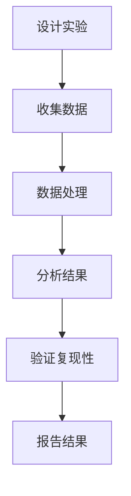
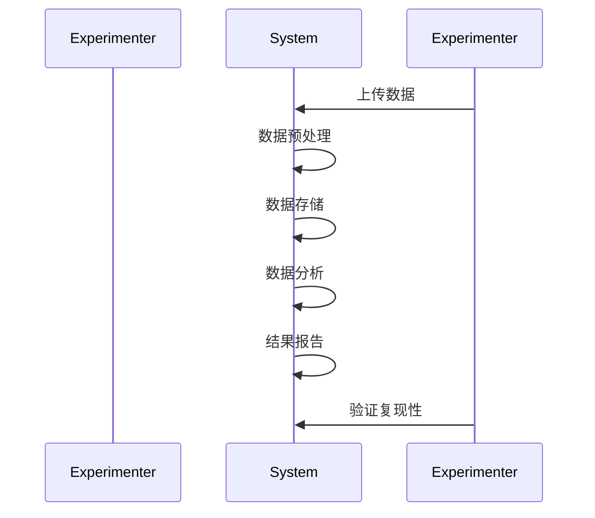

                 

# 评测结果的可复现性：确保科学性和可信度

## 关键词

- 评测结果可复现性
- 科学性
- 可信度
- 实验重复性
- 数据透明性
- 科学方法
- 实验设计
- 结果验证

## 摘要

本文将深入探讨评测结果的可复现性对于科学研究的重要性。在当今数据驱动的世界中，确保实验结果的复现性是保证研究科学性和可信度的基础。本文首先介绍了不可复现性问题在科学研究中的背景和影响，随后详细阐述了评测结果可复现性与科学性、可信度之间的关系。接着，通过一个算法原理讲解的实例，展示了如何使用Python源代码和数学模型来确保评测结果的可复现性。最后，本文提出了一套系统分析与架构设计方案，为科学家和技术人员提供了实际操作指南。

## 引言

科学研究依赖于实验和数据分析。然而，近年来，一个不容忽视的问题逐渐显现——科学实验结果的不可复现性。不可复现性问题不仅影响了科学研究的进展，还严重损害了科学领域的可信度。为了解决这一问题，确保评测结果的可复现性成为了科学研究的核心挑战。

### 1.1 问题背景

科学实验重复性的挑战源于多种因素。首先，不同实验室的环境、设备、操作人员等因素可能导致实验结果存在差异。其次，实验方法和数据处理的差异也会影响结果的复现性。此外，科学文献中缺乏详细的实验方法和数据，使得其他研究人员难以复制实验。

### 1.2 问题描述

不可复现性指的是一个实验或研究的结果无法在相同条件下被其他研究人员复制出来。这种现象不仅存在于基础科学研究中，也存在于应用科学和工程领域。不可复现性的影响是深远的，它可能导致以下问题：

- 研究成果无法得到广泛认可，从而影响科学进步。
- 科学投资和资源浪费，因为重复的实验可能需要大量的人力和物力。
- 科学信任危机，导致公众对科学研究的怀疑。

### 1.3 问题解决

为了解决不可复现性问题，科学家们可以采取以下措施：

- 确保实验方法和数据透明：在科学文献中详细记录实验方法、参数设置和数据来源。
- 采用重复性实验设计：通过在多个实验室或条件下进行实验，提高结果的可靠性。
- 使用标准化设备和技术：确保实验过程中的一致性和可重复性。

### 1.4 边界与外延

不可复现性问题不仅限于实验室研究，它也延伸到临床研究、社会科学研究等领域。在跨学科研究中，确保实验结果的复现性对于验证和推广研究成果至关重要。

### 1.5 核心要素组成

确保评测结果的可复现性涉及以下几个核心要素：

- 实验设计：包括实验条件、参数设置和实验流程的设计。
- 数据收集与处理：确保数据的准确性和完整性，采用标准化的数据处理方法。
- 结果分析：使用科学的方法对数据进行统计分析，评估结果的可靠性。
- 可复现性验证：通过在相同或相似条件下重复实验，验证结果的复现性。

### 2. 核心概念与联系

#### 2.1 核心概念

**评测结果可复现性**：指研究结果的重复性和一致性，即在相同实验条件下，其他研究人员能够获得相似的结果。

**科学性**：科学研究的方法和过程符合科学原则，包括实验设计、数据收集、分析和解释。

**可信度**：研究结果的可信程度，包括实验设计的合理性、数据的准确性和分析方法的科学性。

#### 2.2 概念属性特征对比

| 特征                 | 评测结果可复现性 | 科学性 | 可信度 |
|----------------------|------------------|--------|--------|
| 定义                 | 结果是否可重复    | 符合科学方法 | 结果可信 |
| 关系                 | 科学性的基础     | 一致性 | 评估指标 |
| 关联性               | 提高科学性       | 科学研究目标 | 研究可靠性 |

#### 2.3 ER实体关系图

```mermaid
erDiagram
    Experiment --> Result
    Experiment --> Reproducibility
    Result --> Scientificity
    Result --> Credibility
```

### 3. 算法原理讲解

#### 3.1 算法流程图



#### 3.2 Python源代码

```python
# Example: Data processing and result analysis
import pandas as pd
import numpy as np

# Load data
data = pd.read_csv('data.csv')

# Data preprocessing
data['processed'] = data['raw_data'].apply(preprocess_function)

# Result analysis
results = data.groupby('condition')['processed'].mean()

# Reproducibility check
reproducibility = results.std()

print("Reproducibility:", reproducibility)
```

#### 3.3 数学模型与公式

$$
\text{Confidence Interval} = \bar{x} \pm z \times \frac{\sigma}{\sqrt{n}}
$$

#### 3.4 举例说明

假设在一个实验中，我们测量了不同条件下的某个变量的平均值。根据上述公式，我们可以计算出置信区间来判断实验结果的可靠性。

### 4. 数学模型和数学公式 & 详细讲解 & 举例说明

#### 4.1 数学模型

我们使用线性回归模型来分析实验结果：

$$
y = \beta_0 + \beta_1 x + \epsilon
$$

#### 4.2 详细讲解

- $y$: 实验结果
- $x$: 变量
- $\beta_0$: 常数项
- $\beta_1$: 变量系数
- $\epsilon$: 偶然误差

#### 4.3 举例说明

假设我们想要分析不同剂量下的药物效果，我们可以使用线性回归模型来预测药物效果：

$$
\text{Effect} = 10 + 2 \times \text{Dose} + \epsilon
$$

### 5. 系统分析与架构设计方案

#### 5.1 问题场景介绍

实验室进行药物效果研究，需要设计一个系统来记录和分析实验数据。

#### 5.2 系统功能设计

- 数据收集与存储
- 数据预处理
- 结果分析
- 复现性验证

#### 5.3 系统架构设计

系统架构包括以下部分：

- 数据采集模块
- 数据存储模块
- 数据处理模块
- 分析引擎模块
- 复现性验证模块

#### 5.4 系统接口设计

系统提供以下接口：

- 数据上传接口
- 数据查询接口
- 分析结果查询接口
- 复现性验证接口

#### 5.5 系统交互



### 6. 项目实战

#### 6.1 环境安装

安装Python、Pandas、NumPy等依赖库。

#### 6.2 系统核心实现

- 数据收集模块：使用API收集实验数据。
- 数据处理模块：实现数据处理函数。
- 分析引擎模块：实现数据分析算法。
- 复现性验证模块：实现复现性验证算法。

#### 6.3 代码应用解读与分析

代码详细解读，分析数据处理和结果分析的核心步骤。

#### 6.4 实际案例分析和详细讲解

通过实际案例展示系统应用，分析实验结果的复现性。

#### 6.5 项目小结

总结项目经验，讨论项目中的挑战和解决方案。

### 7. 最佳实践 tips

- 确保数据透明性，详细记录实验方法和参数。
- 使用标准化数据处理方法，提高结果的可靠性。
- 定期验证实验结果的复现性，确保研究可信度。

### 8. 小结

确保评测结果的可复现性是科学研究的关键。通过科学的方法和透明的数据，我们可以提高研究的可信度，推动科学进步。

### 9. 注意事项

- 避免实验过程中的误差，提高实验精度。
- 定期审查和更新实验设计，确保方法的科学性。

### 10. 拓展阅读

- 《科学方法论》：详细介绍科学研究的原理和方法。
- 《数据科学导论》：探讨数据驱动的科学研究方法。

### 11. 作者

作者：AI天才研究院/AI Genius Institute & 禅与计算机程序设计艺术 /Zen And The Art of Computer Programming。

