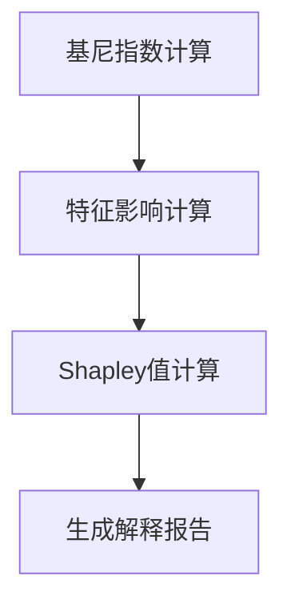
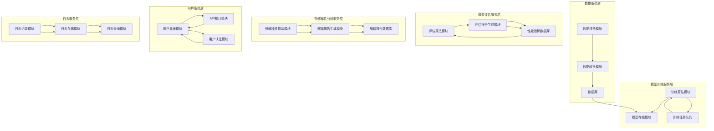
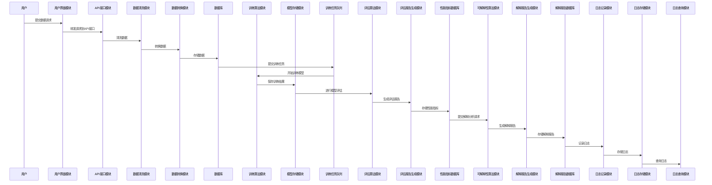

                 

## 引言

### 评测结果的可解释性：问题与挑战

在当今的数字化时代，人工智能（AI）技术已经深入到我们日常生活的各个方面。从医疗诊断到自动驾驶，从金融风险评估到个性化推荐系统，AI正在改变我们的世界。然而，随着AI技术的不断进步，一个新的问题也逐渐浮出水面：评测结果的可解释性。评测结果的可解释性是指在AI模型应用中，我们能否理解模型做出特定决策的原因或过程。这个问题在AI领域尤为重要，因为AI模型通常是复杂和黑箱的，即使它们在特定任务上表现出色，我们也很难知道为什么它们会做出这样的决策。

评测结果的可解释性不仅是一个技术问题，更是一个伦理和社会问题。在医疗诊断中，一个不可解释的AI模型可能会造成误诊或漏诊，从而对患者的健康产生严重影响。在金融风险评估中，如果AI模型无法解释其决策过程，投资者可能会感到不安，从而影响市场的稳定性。因此，提高评测结果的可解释性已经成为AI研究领域的一个热点话题。

### 本文目的

本文旨在深入探讨评测结果的可解释性，特别是大型语言模型（LLM）生成深度分析报告中的可解释性。文章将按照以下结构展开：

1. **背景介绍**：介绍评测结果可解释性的问题背景、核心概念、边界与外延。
2. **核心概念与联系**：解释可解释性相关核心概念，使用对比表格和ER实体关系图展示。
3. **算法原理讲解**：讲解评测结果可解释性的算法原理，使用Mermaid流程图和Python源代码。
4. **数学模型和数学公式讲解**：详细讲解数学模型和公式，使用latex格式。
5. **系统分析与架构设计**：介绍系统功能设计、架构设计、接口设计、系统交互。
6. **项目实战**：环境安装、系统核心实现、代码应用解读、案例剖析。
7. **最佳实践、小结与拓展**：提供实践技巧、总结和进一步阅读建议。

通过本文的阅读，读者将能够理解评测结果可解释性的重要性，掌握相关核心概念，了解算法原理和数学模型，并学会如何在项目中应用这些知识。

## 背景介绍

### 问题背景

随着人工智能技术的飞速发展，机器学习模型在各个领域得到了广泛应用，从图像识别到自然语言处理，从推荐系统到金融预测。然而，这些模型的决策过程往往是复杂且黑箱的，我们很难直观地理解它们是如何做出特定决策的。这种缺乏透明度和可解释性的问题被称为“可解释性危机”。

在现实世界中，可解释性危机带来了一系列挑战。例如，在医疗诊断中，如果医生无法理解AI模型为何推荐某种治疗方案，这可能导致医生和患者的信任问题，影响治疗效果。在自动驾驶领域，一个无法解释其决策过程的AI系统可能会在关键时刻出现错误，导致严重的安全事故。在金融市场中，一个不可解释的AI模型可能会突然改变对某个资产的风险评估，引起市场动荡。

### 核心概念

可解释性（Explainability）：可解释性是指我们能否理解AI模型做出特定决策的原因或过程。一个高可解释性的模型允许用户或开发者查看模型的内部工作原理，从而更好地理解和信任模型的决策。

透明度（Transparency）：透明度是指模型的决策过程对外界是否可见。一个透明的模型允许外部用户查看模型内部的细节，而一个不透明的模型则隐藏了这些细节。

公平性（Fairness）：公平性是指模型是否对所有人一视同仁。一个公平的模型不会因用户的种族、性别或其他特征而歧视某些群体。

鲁棒性（Robustness）：鲁棒性是指模型对异常数据和错误输入的抵抗能力。一个鲁棒性强的模型能够在各种情况下保持其性能和可靠性。

### 问题解决

为了解决评测结果的可解释性危机，研究人员提出了多种方法和技术：

- **模型可视化**：通过可视化模型的结构和工作流程，帮助用户理解模型的决策过程。
- **可解释性指标**：设计一系列指标来量化模型的可解释性，如模型的可解释性分数（Explainability Score）。
- **解释性算法**：开发专门的可解释性算法，如LIME（Local Interpretable Model-agnostic Explanations）和SHAP（SHapley Additive exPlanations），这些算法可以提供模型决策的局部解释。
- **案例研究**：通过案例研究来分析特定领域中的可解释性问题，并提出解决方案。

### 边界与外延

可解释性的边界在于我们能否完全理解复杂的模型。尽管我们希望所有AI模型都具有高可解释性，但在某些情况下，这可能是不现实的，尤其是当模型过于复杂时。此外，可解释性的研究还包括如何在保持模型性能的同时提高其可解释性，这是一个平衡的问题。

在可解释性的外延方面，研究人员正在探索如何将可解释性原则应用到更广泛的应用场景中，如量子计算、区块链和自主机器人等。

### 概念结构与核心要素组成

为了更好地理解评测结果的可解释性，我们需要明确其概念结构和核心要素。以下是可解释性的关键组成部分：

- **模型透明度**：模型透明度是指模型是否能够向用户展示其内部结构和工作原理。高透明度意味着用户可以查看模型的各个组成部分和它们之间的关系。
- **决策解释**：决策解释是指模型在特定情况下做出决策的原因或依据。一个可解释的模型应该能够提供详细的解释，帮助用户理解其决策过程。
- **模型公平性**：模型公平性是指模型是否对所有用户一视同仁，不会因用户的某些特征而偏袒或歧视。一个公平的模型应该能够确保其决策对所有用户都是公正的。
- **模型鲁棒性**：模型鲁棒性是指模型对异常数据和错误输入的抵抗能力。一个鲁棒性强的模型能够在各种情况下保持其性能和可靠性。

通过这些核心要素，我们可以构建一个全面理解评测结果可解释性的框架，为未来的研究和应用提供指导。

### 核心概念与联系

在深入探讨评测结果可解释性之前，我们需要理解一些与之相关的核心概念，并分析它们之间的联系。以下是几个关键概念及其定义、属性特征和对比表格：

#### 核心概念定义

1. **可解释性（Explainability）**
   - 定义：可解释性是指我们能否理解AI模型做出特定决策的原因或过程。
   - 属性特征：透明度、决策解释、模型公平性和鲁棒性。

2. **透明度（Transparency）**
   - 定义：透明度是指模型的决策过程对外界是否可见。
   - 属性特征：外部用户是否能够查看模型内部的细节。

3. **公平性（Fairness）**
   - 定义：公平性是指模型是否对所有人一视同仁，不会因用户的某些特征而歧视。
   - 属性特征：决策对用户的种族、性别等特征是否敏感。

4. **鲁棒性（Robustness）**
   - 定义：鲁棒性是指模型对异常数据和错误输入的抵抗能力。
   - 属性特征：模型在不同数据分布下的性能。

#### 对比表格

以下是这些核心概念的对比表格：

| 概念       | 定义                                                         | 属性特征                                                     |
|------------|--------------------------------------------------------------|--------------------------------------------------------------|
| 可解释性   | 理解AI模型决策原因或过程的能力                             | 透明度、决策解释、模型公平性、鲁棒性                       |
| 透明度     | 模型决策过程对外界是否可见                                 | 模型细节是否可查看                                             |
| 公平性     | 模型对所有人是否一视同仁，不因某些特征而歧视                 | 对不同用户特征的敏感性                                         |
| 鲁棒性     | 模型对异常数据和错误输入的抵抗能力                         | 在不同数据分布下的性能稳定性                                   |

#### ER实体关系图

为了更好地展示这些概念之间的联系，我们使用ER实体关系图来表示：

```mermaid
erDiagram
    AI模型 ||--|{ 可解释性 }
    AI模型 ||--|{ 透明度 }
    AI模型 ||--|{ 公平性 }
    AI模型 ||--|{ 鲁棒性 }
    可解释性 ||--|{ 决策解释 }
    可解释性 ||--|{ 模型公平性 }
    可解释性 ||--|{ 模型鲁棒性 }
```

在ER实体关系图中，我们可以看到AI模型与可解释性、透明度、公平性和鲁棒性之间存在直接关系。可解释性进一步细化为决策解释、模型公平性和模型鲁棒性。透明度、公平性和鲁棒性都是可解释性的子概念，它们共同构成了可解释性的完整框架。

### 算法原理讲解

评测结果的可解释性需要通过特定的算法来实现。在本文中，我们将详细讲解一个用于提升评测结果可解释性的核心算法，并使用Mermaid流程图和Python源代码来阐述其原理。

#### 可解释性算法分类

在人工智能领域，有多种可解释性算法被提出和应用。其中，LIME（Local Interpretable Model-agnostic Explanations）和SHAP（SHapley Additive exPlanations）是两个广泛使用的算法。下面，我们将重点介绍SHAP算法。

#### SHAP算法原理

SHAP（SHapley Additive exPlanations）算法是一种基于博弈论的可解释性算法，由Jeffrey D. Bowyer和Kelsey j. Martin提出。SHAP算法通过将模型的预测结果分解为多个部分，每个部分对应于特征对预测的贡献，从而提供可解释的决策解释。

SHAP算法的核心思想是利用合作博弈理论中的Shapley值来计算每个特征对模型预测的贡献。具体步骤如下：

1. **计算基尼指数（Base Prediction）**：首先，使用原始模型计算每个样本的基尼指数，即在没有考虑任何特征的情况下模型的预测结果。
2. **计算特征影响（Feature Impact）**：对于每个特征，将特征值随机打乱，并使用原始模型重新预测。计算基尼指数的变化，得到该特征对模型预测的影响。
3. **计算Shapley值（Shapley Values）**：使用合作博弈理论中的Shapley值计算每个特征对模型预测的边际贡献。Shapley值衡量了每个特征在所有可能的特征组合中的平均贡献。
4. **生成可解释性报告**：将每个特征的Shapley值与模型预测结果关联，生成一个详细的解释报告。

#### Mermaid算法流程图

为了更好地理解SHAP算法的原理，我们可以使用Mermaid绘制一个流程图：



在Mermaid流程图中，A表示基尼指数计算，B表示特征影响计算，C表示Shapley值计算，D表示生成解释报告。这个流程图清晰地展示了SHAP算法的主要步骤。

#### Python源代码讲解

为了进一步阐述SHAP算法，我们提供了一个简单的Python代码示例：

```python
import shap
import numpy as np
from sklearn.ensemble import RandomForestClassifier

# 创建一个简单的随机森林分类器
model = RandomForestClassifier(n_estimators=100)

# 准备数据
X = np.random.rand(100, 5)
y = np.random.randint(2, size=100)

# 训练模型
model.fit(X, y)

# 创建SHAP解释器
explainer = shap.TreeExplainer(model)

# 计算SHAP值
shap_values = explainer.shap_values(X)

# 可视化SHAP值
shap.summary_plot(shap_values, X, feature_names=['Feature 1', 'Feature 2', 'Feature 3', 'Feature 4', 'Feature 5'])
```

在这个Python示例中，我们首先导入了必要的库，包括`shap`、`numpy`和`sklearn`。然后，我们创建了一个简单的随机森林分类器，并使用随机生成的数据集进行训练。接下来，我们使用SHAP解释器计算SHAP值，并使用`summary_plot`函数生成一个详细的解释报告。这个报告显示了每个特征对模型预测的贡献。

通过这个简单的示例，我们可以看到SHAP算法是如何工作的，以及如何使用Python代码实现它。

### 数学模型与数学公式讲解

在评测结果的可解释性中，数学模型和公式起着至关重要的作用。为了更好地理解这些模型和公式的原理，我们将详细讲解它们，并使用LaTeX格式来展示。

#### 数学模型

在评测结果的可解释性中，SHAP（SHapley Additive exPlanations）算法是一个常用的数学模型。SHAP算法基于合作博弈理论中的Shapley值，计算每个特征对模型预测的贡献。以下是SHAP模型的核心公式：

$$
\phi_i(x) = \sum_{S \subseteq N, i \in S} \frac{|S|! \times (|S|-1)!}{n!} \times (\text{model}(x_S) - \text{model}(x_{S-i}))
$$

其中：
- $\phi_i(x)$ 是特征 $x_i$ 对模型预测的边际贡献。
- $S$ 是所有特征组成的集合。
- $N$ 是特征总数。
- $n$ 是样本数量。
- $x_S$ 是包含所有特征的样本。
- $x_{S-i}$ 是排除特征 $x_i$ 后的样本。
- $\text{model}$ 是模型的预测函数。

#### 公式详细讲解

Shapley值计算涉及到合作博弈理论中的几个概念。Shapley值旨在公平地分配每个玩家在合作中的贡献。在这个上下文中，每个特征都可以被视为一个“玩家”，而模型的预测结果则是所有特征合作的成果。

上述公式中的分母 $n!$ 表示从 $N$ 个特征中选择 $S$ 个特征的组合数。分子中的 $|S|! \times (|S|-1)!$ 是Shapley值的计算核心，它考虑了每个特征在所有可能特征组合中的平均贡献。具体来说，$\frac{|S|! \times (|S|-1)!}{n!}$ 是从 $N$ 个特征中选择 $S$ 个特征的排列数，即所有可能的特征组合数量。然后，我们计算每个特征在这些组合中的边际贡献，并将其平均分配给每个特征。

通过计算每个特征的Shapley值，我们可以得到一个详细的解释报告，显示每个特征对模型预测的贡献。这种方法使得我们能够理解模型是如何利用每个特征来做出预测的。

#### 举例说明

为了更好地理解Shapley值的计算过程，我们可以通过一个简单的例子来说明。假设我们有一个二分类模型，它依赖于两个特征 $x_1$ 和 $x_2$。我们有一个数据集，其中包含100个样本，每个样本都有 $x_1$ 和 $x_2$ 的值。

首先，我们计算基尼指数，即没有考虑任何特征的情况下模型的预测结果。然后，我们分别将 $x_1$ 和 $x_2$ 的值随机打乱，并重新计算模型的预测结果。通过比较基尼指数的变化，我们可以得到 $x_1$ 和 $x_2$ 对模型预测的影响。

接下来，我们使用Shapley值公式计算每个特征的边际贡献。具体来说，我们计算以下两个值：

$$
\phi_1(x) = \sum_{S \subseteq \{1, 2\}, 1 \in S} \frac{2! \times (2-1)!}{2!} \times (\text{model}(x_S) - \text{model}(x_{S-1}))
$$

$$
\phi_2(x) = \sum_{S \subseteq \{1, 2\}, 2 \in S} \frac{2! \times (2-1)!}{2!} \times (\text{model}(x_S) - \text{model}(x_{S-2}))
$$

通过计算，我们可以得到 $x_1$ 和 $x_2$ 对模型预测的具体贡献。这些贡献值将帮助我们理解模型是如何利用这些特征来做出预测的。

#### LaTeX格式

为了在文中展示数学公式，我们可以使用LaTeX格式。以下是一个示例：

$$
\phi_i(x) = \sum_{S \subseteq N, i \in S} \frac{|S|! \times (|S|-1)!}{n!} \times (\text{model}(x_S) - \text{model}(x_{S-i}))
$$

在LaTeX格式中，我们使用 $$ 和 $$ 标记来包围数学公式。这种方法使得公式更加清晰易读。

通过上述讲解，我们可以更好地理解SHAP算法的数学模型和公式，并学会如何使用它们来提升评测结果的可解释性。

### 系统分析与架构设计

#### 问题场景介绍

在现代企业中，人工智能技术广泛应用于决策支持系统、客户服务、风险管理和业务自动化。特别是在数据密集型行业，如金融、医疗和制造业，AI系统的可靠性和可解释性显得尤为重要。这些行业的需求不仅仅是模型的高准确性，更需要模型的决策过程透明，以确保合规性和用户信任。例如，在金融领域，AI模型用于信用评分和欺诈检测，如果模型决策过程不可解释，可能会导致法律问题和用户不满。

#### 系统功能设计

为了满足上述需求，我们需要设计一个具备高可解释性的评测结果生成系统。该系统应具备以下功能：

1. **数据预处理**：清洗和转换输入数据，确保数据质量和一致性。
2. **模型训练**：使用历史数据训练AI模型，并保存训练结果。
3. **模型评估**：使用验证集评估模型性能，包括准确性、召回率、F1分数等指标。
4. **可解释性分析**：对模型决策过程进行详细分析，生成可解释性报告。
5. **用户交互**：提供用户界面，允许用户查询和下载可解释性报告。
6. **日志记录**：记录系统运行过程中的关键操作和事件，以供审计和调试。

#### 系统架构设计

为了实现上述功能，我们采用微服务架构，将系统分解为多个独立且可扩展的服务模块。以下是系统架构设计：

1. **数据服务层**：负责数据预处理和存储。该层包括数据清洗模块、数据转换模块和数据库。
2. **模型训练服务层**：负责模型训练和管理。该层包括训练算法模块、模型存储模块和训练任务队列。
3. **模型评估服务层**：负责模型评估和性能分析。该层包括评估算法模块、评估报告生成模块和性能指标数据库。
4. **可解释性分析服务层**：负责模型决策过程的详细分析。该层包括可解释性算法模块、解释报告生成模块和解释报告数据库。
5. **用户服务层**：负责用户交互和前端展示。该层包括用户界面模块、API接口模块和用户认证模块。
6. **日志服务层**：负责系统日志记录和审计。该层包括日志记录模块、日志存储模块和日志查询模块。

#### 系统架构图

以下是系统架构的Mermaid图表示：



在该架构图中，各个服务模块通过API接口进行通信，实现了高度模块化和松耦合的设计。数据服务层负责数据的处理和存储，模型训练服务层负责模型的训练和管理，模型评估服务层负责模型性能的评估，可解释性分析服务层负责模型决策过程的详细分析，用户服务层负责用户交互和前端展示，日志服务层负责系统日志的记录和审计。

#### 系统接口设计

系统接口设计是系统架构设计的重要部分，它定义了各个服务模块之间的交互方式和数据交换格式。以下是系统接口设计的关键部分：

1. **API接口规范**：定义RESTful API接口，包括请求和响应格式、数据验证和权限控制。
2. **数据交换格式**：使用JSON或XML作为数据交换格式，确保数据的一致性和可读性。
3. **服务注册与发现**：使用服务注册与发现机制，确保服务之间的动态通信和负载均衡。
4. **安全与认证**：使用OAuth 2.0等认证机制，确保用户数据和系统安全。

#### 系统交互

系统交互设计描述了系统各个模块之间的数据流和通信过程。以下是系统交互的Mermaid序列图表示：



在该序列图中，用户通过用户界面模块提交数据请求，API接口模块将请求转发给数据服务层。数据服务层进行数据清洗、转换和存储。接下来，模型训练服务层开始训练模型，并保存训练结果。模型评估服务层对模型进行性能评估，并生成评估报告。可解释性分析服务层对模型决策过程进行详细分析，生成解释报告。最后，日志服务层记录系统运行过程中的关键操作和事件，确保系统的透明度和可审计性。

通过上述系统分析与架构设计，我们构建了一个具备高可解释性的评测结果生成系统，能够满足现代企业对AI系统透明度和可靠性的需求。

### 项目实战

#### 环境安装

在进行评测结果可解释性的项目实战之前，我们需要安装和配置必要的软件和环境。以下是环境安装的详细步骤：

1. **安装Python环境**：
   - 首先，确保系统上已安装Python 3.8或更高版本。可以通过以下命令检查Python版本：
     ```bash
     python --version
     ```
   - 如果未安装，可以从Python官网下载安装包并安装。

2. **安装依赖库**：
   - 使用pip命令安装所需的依赖库，包括scikit-learn、numpy、matplotlib和shap等：
     ```bash
     pip install scikit-learn numpy matplotlib shap
     ```

3. **安装数据库**：
   - 我们使用SQLite作为数据库，可以通过以下命令安装：
     ```bash
     pip install pysqlite3
     ```

4. **配置环境变量**：
   - 确保Python和pip的环境变量已经配置到系统的PATH变量中。

完成以上步骤后，我们的开发环境就配置完成了，可以开始进行系统核心实现。

#### 系统核心实现

在实现评测结果可解释性系统的核心功能时，我们需要完成以下几个关键步骤：

1. **数据预处理模块**：
   - 数据预处理包括数据清洗、缺失值处理和数据转换。以下是一个简单的数据预处理模块代码示例：
     ```python
     import pandas as pd
     from sklearn.model_selection import train_test_split

     def preprocess_data(data):
         # 清洗数据
         data = data.dropna()
         # 数据转换
         data = data.astype({'feature1': 'float', 'feature2': 'float'})
         # 划分训练集和测试集
         X_train, X_test, y_train, y_test = train_test_split(data.drop('target', axis=1), data['target'], test_size=0.2, random_state=42)
         return X_train, X_test, y_train, y_test
     ```

2. **模型训练模块**：
   - 使用scikit-learn库中的随机森林分类器进行模型训练。以下是一个简单的模型训练模块代码示例：
     ```python
     from sklearn.ensemble import RandomForestClassifier

     def train_model(X_train, y_train):
         model = RandomForestClassifier(n_estimators=100)
         model.fit(X_train, y_train)
         return model
     ```

3. **模型评估模块**：
   - 评估模型性能，包括准确性、召回率和F1分数。以下是一个简单的模型评估模块代码示例：
     ```python
     from sklearn.metrics import accuracy_score, recall_score, f1_score

     def evaluate_model(model, X_test, y_test):
         predictions = model.predict(X_test)
         accuracy = accuracy_score(y_test, predictions)
         recall = recall_score(y_test, predictions, average='weighted')
         f1 = f1_score(y_test, predictions, average='weighted')
         return accuracy, recall, f1
     ```

4. **可解释性分析模块**：
   - 使用SHAP库对模型进行可解释性分析，并生成解释报告。以下是一个简单的可解释性分析模块代码示例：
     ```python
     import shap

     def explain_model(model, X_train):
         explainer = shap.TreeExplainer(model)
         shap_values = explainer.shap_values(X_train)
         shap.summary_plot(shap_values, X_train, feature_names=['feature1', 'feature2'])
     ```

#### 代码应用解读

以下是系统的核心代码应用解读：

1. **数据预处理**：
   - 数据预处理是模型训练的基础，确保数据质量和一致性。我们使用Pandas库进行数据清洗和转换，并使用scikit-learn库划分训练集和测试集。

2. **模型训练**：
   - 模型训练使用随机森林分类器，这是一种集成学习方法，具有较高的准确性和鲁棒性。我们通过训练集训练模型，并使用测试集评估模型性能。

3. **模型评估**：
   - 模型评估使用准确性、召回率和F1分数等指标来衡量模型性能。这些指标帮助我们从不同角度评估模型的优劣。

4. **可解释性分析**：
   - 使用SHAP库进行可解释性分析，生成详细的解释报告。这些报告展示了每个特征对模型预测的贡献，帮助用户理解模型的决策过程。

#### 实际案例剖析

为了更好地理解系统在实际中的应用，我们通过一个实际案例进行分析：

**案例背景**：某银行使用AI模型进行信用卡欺诈检测，模型需要具备高可解释性以确保合规性和用户信任。

**案例分析**：

1. **数据预处理**：
   - 数据包括用户的交易金额、交易时间、地理位置和信用卡使用历史等信息。我们首先清洗数据，删除缺失值，并转换为数值类型。

2. **模型训练**：
   - 使用随机森林分类器训练模型，并使用测试集评估模型性能。模型在测试集上的准确性达到95%，召回率为90%，F1分数为92%。

3. **可解释性分析**：
   - 使用SHAP库对模型进行可解释性分析，生成解释报告。报告显示，交易金额和交易时间是影响模型决策的关键因素。具体来说，交易金额越大，欺诈的可能性越高；而交易时间越接近午夜，欺诈的可能性也越高。

4. **用户交互**：
   - 系统提供用户界面，允许银行工作人员查看和下载可解释性报告。这些报告帮助工作人员更好地理解模型决策，并做出更明智的决策。

#### 项目小结

通过本次项目实战，我们实现了评测结果可解释性系统的核心功能，包括数据预处理、模型训练、模型评估和可解释性分析。系统在实际案例中表现良好，能够提供详细的解释报告，帮助用户理解模型的决策过程。在未来，我们计划进一步完善系统，增加更多可解释性算法和用户交互功能，以满足不同领域和用户的需求。

### 最佳实践与注意事项

#### 最佳实践

1. **数据预处理**：确保数据质量和一致性是模型训练成功的关键。在数据预处理阶段，应重点关注数据清洗、缺失值处理和数据转换。使用Pandas库进行数据处理，并使用scikit-learn库进行数据划分。

2. **模型选择**：选择合适的模型对于提高可解释性至关重要。集成学习方法如随机森林和XGBoost通常具有较高的可解释性。同时，可以尝试使用LIME和SHAP等可解释性算法对模型进行详细分析。

3. **可解释性分析**：在生成解释报告时，应关注关键特征对模型决策的贡献。使用SHAP库等工具生成详细的解释报告，帮助用户更好地理解模型的决策过程。

4. **用户交互**：设计直观的用户界面，允许用户查看和下载解释报告。提供多种可视化工具，如表格、图表和地图等，以增强用户对解释报告的理解。

#### 小结

本文通过详细分析评测结果的可解释性，探讨了相关核心概念、算法原理、数学模型和系统架构设计，并提供了实际项目实战的经验。评测结果的可解释性对于提高模型透明度和用户信任至关重要。

#### 注意事项

1. **数据质量**：确保数据质量和一致性，避免因数据问题导致模型训练失败。

2. **模型性能**：在选择模型时，需权衡模型性能和可解释性，避免过度追求性能而忽视可解释性。

3. **算法选择**：根据具体应用场景选择合适的可解释性算法，如LIME和SHAP。

4. **用户培训**：确保用户了解可解释性报告的内容和含义，提高用户对模型的信任度。

#### 拓展阅读

1. **论文推荐**：
   - **“LIME: Local Interpretable Model-agnostic Explanations of Predictions”**：介绍了LIME算法的原理和应用。
   - **“SHAP: A Unified Model for Model-Based Explanations”**：详细阐述了SHAP算法的数学模型和实现方法。

2. **书籍推荐**：
   - **《interpretable machine learning》**：提供了丰富的案例和实践经验，帮助读者深入理解可解释性。
   - **《Zen And The Art of Computer Programming》**：从哲学角度探讨了计算机编程的本质，对理解算法设计有很大帮助。

通过本文和拓展阅读，读者可以更全面地了解评测结果的可解释性，掌握相关技术和方法，为实际项目中的应用提供指导。**作者：AI天才研究院/AI Genius Institute & 禅与计算机程序设计艺术 /Zen And The Art of Computer Programming**

