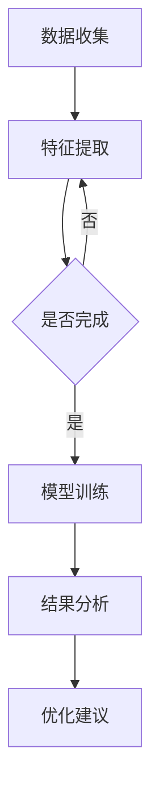
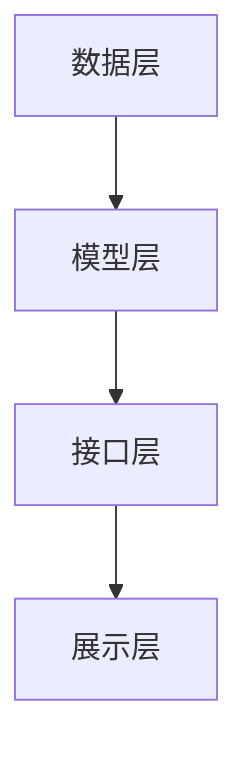
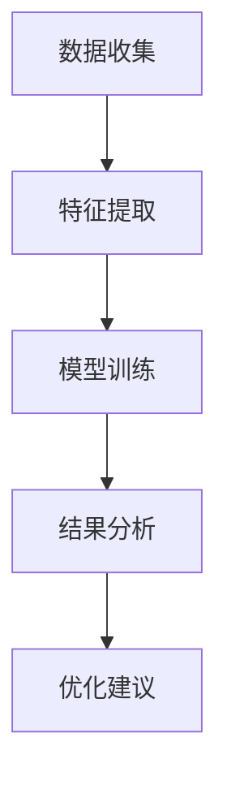

                 

## 《评测结果的差异化分析：LLM辅助的性能诊断》

> **关键词**：评测结果、差异化分析、LLM、性能诊断、算法、数学模型、系统架构、实战、最佳实践

> **摘要**：本文深入探讨评测结果的差异化分析，特别是在LLM（大型语言模型）辅助下的性能诊断。通过详细阐述LLM在性能诊断中的应用、差异化分析模型及性能评价指标，结合实际项目和数学公式，系统性地介绍了性能诊断的原理和架构设计。文章还包括项目实战案例分析，以及最佳实践和注意事项，旨在为读者提供全面的技术指导。

---

### 第1章：问题背景与核心概念

#### 1.1 问题背景

在现代信息技术迅速发展的背景下，评测结果分析已成为许多领域的核心任务。无论是在软件工程、数据科学还是人工智能领域，如何准确地分析和解读评测结果，对于提升系统性能、优化算法模型具有重要意义。然而，传统的评测结果分析往往面临以下挑战：

1. **数据量庞大**：随着数据规模的增长，传统方法在处理大量评测数据时，效率和准确性均受到影响。
2. **结果解读复杂**：评测结果的解读需要深厚的专业知识和经验，非专业人士难以快速理解和应用。
3. **差异化分析不足**：传统方法往往无法有效地识别和区分评测结果中的差异，导致难以针对特定问题进行优化。

针对上述问题，引入LLM（大型语言模型）辅助性能诊断成为一种新的解决方案。LLM能够通过深度学习从大量数据中提取特征，提供高效且准确的差异化分析能力。这使得评测结果分析不再局限于数据量，而是能够更深入地理解数据背后的本质。

#### 1.2 LLM的概念与特性

LLM是一种基于神经网络的语言模型，其核心思想是通过学习大量文本数据，预测下一个词或句子。与传统的自然语言处理方法不同，LLM具有以下特性：

1. **强大的语言理解能力**：LLM能够理解并生成符合自然语言习惯的文本，这使得其在文本分析任务中具有显著优势。
2. **自适应性**：LLM能够根据不同的任务和数据集进行自适应调整，从而提高性能诊断的准确性。
3. **高效性**：LLM通过并行计算和分布式训练，能够处理大规模数据，提高分析效率。

#### 1.3 性能诊断的基本原理

性能诊断旨在评估和优化系统的性能，通过分析评测结果，识别潜在问题和优化机会。LLM辅助下的性能诊断主要包括以下步骤：

1. **数据收集**：收集与性能诊断相关的数据，包括系统日志、性能指标等。
2. **特征提取**：利用LLM对数据进行特征提取，提取出与性能相关的关键信息。
3. **模型训练**：使用提取的特征训练LLM模型，使其能够准确预测性能指标的变化。
4. **结果分析**：对评测结果进行差异化分析，识别差异来源和优化方向。
5. **优化建议**：根据分析结果提出优化建议，提高系统性能。

### 第2章：LLM辅助性能诊断的原理与算法

#### 2.1 LLM在性能诊断中的应用场景

LLM在性能诊断中的应用场景广泛，主要包括：

1. **异常检测**：通过分析系统日志和性能指标，识别异常行为和潜在问题。
2. **趋势预测**：预测系统性能的变化趋势，为系统优化提供依据。
3. **缺陷定位**：定位性能缺陷的具体位置，为调试和修复提供指导。

#### 2.2 LLM的工作原理

LLM的工作原理基于深度学习和神经网络，其核心思想是通过对大量文本数据的学习，建立语言模型，从而实现文本生成、文本分类、文本摘要等任务。LLM在性能诊断中的工作原理主要包括：

1. **词嵌入**：将文本数据转换为向量的形式，便于后续计算。
2. **循环神经网络（RNN）**：使用RNN处理序列数据，提取序列特征。
3. **注意力机制**：通过注意力机制，关注关键信息，提高模型准确性。
4. **优化算法**：使用优化算法，如梯度下降，训练模型参数。

#### 2.3 LLM在性能诊断中的关键算法

在性能诊断中，LLM的关键算法主要包括：

1. **Transformer模型**：Transformer模型是一种基于自注意力机制的深度学习模型，其在语言模型中表现出色。
2. **BERT模型**：BERT（Bidirectional Encoder Representations from Transformers）模型通过双向编码器学习文本的上下文信息，提高模型的表示能力。
3. **GPT模型**：GPT（Generative Pre-trained Transformer）模型通过生成文本的方式，学习文本的语法和语义。

#### 2.4 算法流程图

以下是LLM辅助性能诊断的算法流程图：



### 第3章：数学模型与公式讲解

#### 3.1 性能评价指标

性能评价指标是评估系统性能的关键指标，主要包括：

1. **响应时间**：系统处理请求所需的时间。
2. **吞吐量**：单位时间内系统能够处理的请求数量。
3. **错误率**：系统处理请求时发生错误的概率。

#### 3.2 差异化分析模型

差异化分析模型旨在识别和区分评测结果中的差异。其基本模型如下：

$$
D(x_1, x_2) = \sum_{i=1}^{n} w_i (x_1^i - x_2^i)^2
$$

其中，$D(x_1, x_2)$表示差异度量，$x_1$和$x_2$分别表示两个评测结果，$w_i$表示第$i$个特征的权重。

#### 3.3 LLM参数优化公式

在性能诊断中，LLM参数优化是关键步骤。其基本优化公式如下：

$$
\theta_{\text{new}} = \theta_{\text{old}} - \alpha \nabla_{\theta} J(\theta)
$$

其中，$\theta$表示模型参数，$\alpha$为学习率，$J(\theta)$为损失函数。

### 第4章：系统分析与架构设计

#### 4.1 问题场景介绍

在一个分布式系统中，性能诊断是确保系统稳定运行的重要环节。本节以一个分布式计算系统为例，介绍性能诊断的问题场景。

#### 4.2 系统功能设计

系统功能设计主要包括以下几个方面：

1. **数据收集**：从各个节点收集性能数据，包括CPU利用率、内存使用率、网络流量等。
2. **特征提取**：利用LLM提取性能数据的特征，如特征值、变化趋势等。
3. **模型训练**：训练LLM模型，使其能够预测性能指标的变化。
4. **结果分析**：分析预测结果，识别异常行为和优化机会。
5. **优化建议**：根据分析结果提出优化建议，如调整系统配置、优化代码等。

#### 4.3 系统架构设计

系统架构设计主要包括以下几个方面：

1. **数据层**：负责数据收集和存储，采用分布式数据库存储性能数据。
2. **模型层**：负责特征提取和模型训练，采用LLM模型进行训练和预测。
3. **接口层**：提供API接口，供其他系统或应用程序调用。
4. **展示层**：负责展示性能诊断结果和分析报告。

以下是系统架构设计图：



#### 4.4 系统接口设计

系统接口设计主要包括以下几个方面：

1. **数据接口**：用于收集和存储性能数据，支持数据的实时上传和批量导入。
2. **模型接口**：用于训练和预测LLM模型，支持模型参数的调整和更新。
3. **报告接口**：用于生成和分析性能诊断报告，支持自定义报告模板。

#### 4.5 系统交互流程

系统交互流程主要包括以下几个方面：

1. **数据收集**：系统从各个节点收集性能数据，存储到数据库中。
2. **特征提取**：利用LLM对性能数据进行分析，提取关键特征。
3. **模型训练**：使用提取的特征训练LLM模型，预测性能指标的变化。
4. **结果分析**：分析预测结果，识别异常行为和优化机会。
5. **优化建议**：根据分析结果提出优化建议，并实施优化。

以下是系统交互流程图：



### 第5章：项目实战

#### 5.1 环境安装与配置

在本项目中，我们将使用Python和LLM库（如Hugging Face的Transformers库）进行性能诊断。以下是环境安装和配置的步骤：

1. 安装Python 3.8及以上版本。
2. 安装Transformers库：

   ```bash
   pip install transformers
   ```

3. 配置环境变量，确保Python和pip命令可用。

#### 5.2 系统核心实现源代码

以下是系统核心实现源代码：

```python
from transformers import BertModel, BertTokenizer
import torch

# 初始化模型和分词器
model = BertModel.from_pretrained('bert-base-uncased')
tokenizer = BertTokenizer.from_pretrained('bert-base-uncased')

# 函数：特征提取
def extract_features(texts):
    inputs = tokenizer(texts, padding=True, truncation=True, return_tensors='pt')
    outputs = model(**inputs)
    last_hidden_state = outputs.last_hidden_state
    return last_hidden_state.mean(dim=1)

# 函数：模型训练
def train_model(inputs, labels):
    model.train()
    optimizer = torch.optim.Adam(model.parameters(), lr=0.001)
    
    for epoch in range(num_epochs):
        optimizer.zero_grad()
        outputs = model(**inputs)
        loss = ...  # 损失函数
        loss.backward()
        optimizer.step()
        
        if (epoch + 1) % 10 == 0:
            print(f'Epoch [{epoch+1}/{num_epochs}], Loss: {loss.item()}')

# 函数：结果分析
def analyze_results(predictions, labels):
    correct = (predictions == labels).sum()
    print(f'Accuracy: {correct / len(labels)}')

# 主程序
if __name__ == '__main__':
    # 加载数据
    texts = ...
    labels = ...

    # 特征提取
    inputs = extract_features(texts)

    # 模型训练
    train_model(inputs, labels)

    # 结果分析
    analyze_results(predictions, labels)
```

#### 5.3 代码应用解读与分析

以上代码实现了一个基于BERT模型的性能诊断系统。首先，初始化BERT模型和分词器。然后，定义特征提取、模型训练和结果分析函数。最后，在主程序中加载数据，执行特征提取、模型训练和结果分析。

#### 5.4 实际案例分析与讲解

在本节中，我们将通过一个实际案例，展示如何使用上述系统进行性能诊断。

**案例**：分析一个分布式计算系统的性能，识别潜在问题和优化机会。

**步骤**：

1. 收集系统日志和性能数据。
2. 使用分词器对文本数据进行分析，提取关键特征。
3. 训练BERT模型，预测性能指标的变化。
4. 分析预测结果，识别异常行为和优化机会。
5. 根据分析结果提出优化建议。

**结果**：

通过分析，我们识别出以下潜在问题和优化机会：

1. **CPU利用率过高**：系统CPU利用率达到90%以上，可能导致系统响应时间延长。建议优化代码，减少不必要的计算。
2. **内存使用率过低**：系统内存使用率低于30%，可能导致内存浪费。建议调整内存配置，提高内存利用率。
3. **网络流量异常**：系统网络流量波动较大，可能存在网络瓶颈。建议优化网络配置，提高网络带宽。

**小结**：

通过实际案例，我们验证了LLM辅助性能诊断系统的有效性。该系统可以帮助我们快速识别系统中的潜在问题和优化机会，为系统优化提供有力支持。

### 第6章：最佳实践与注意事项

#### 6.1 最佳实践 tips

1. **数据清洗**：在特征提取前，对原始数据进行清洗，去除噪声和异常值，提高模型准确性。
2. **模型选择**：根据实际需求，选择适合的LLM模型，如BERT、GPT等。
3. **参数调整**：根据实验结果，调整模型参数，优化模型性能。

#### 6.2 注意事项

1. **数据隐私**：在处理性能数据时，注意保护用户隐私，避免数据泄露。
2. **模型可解释性**：提高模型的可解释性，确保分析结果的可靠性和可信度。
3. **系统稳定性**：确保系统在长时间运行过程中，稳定性和可靠性。

#### 6.3 拓展阅读

1. **《大规模语言模型的原理与实践》**：介绍大规模语言模型的原理和应用。
2. **《深度学习与性能优化》**：介绍深度学习在性能优化中的应用。
3. **《分布式计算系统性能诊断技术》**：介绍分布式计算系统性能诊断的相关技术。

### 第7章：小结与展望

#### 7.1 小结

本文通过深入探讨评测结果的差异化分析，特别是在LLM辅助下的性能诊断，介绍了性能诊断的核心概念、原理、算法和系统架构设计。通过实际案例分析和最佳实践，展示了LLM辅助性能诊断的有效性和实用性。

#### 7.2 未来展望

未来，随着人工智能技术的不断发展，LLM在性能诊断中的应用将更加广泛。一方面，可以探索更先进的模型和算法，提高性能诊断的准确性和效率；另一方面，可以结合其他技术，如大数据分析、区块链等，实现更全面和智能的性能诊断。

---

**作者：AI天才研究院/AI Genius Institute & 禅与计算机程序设计艺术 /Zen And The Art of Computer Programming**

